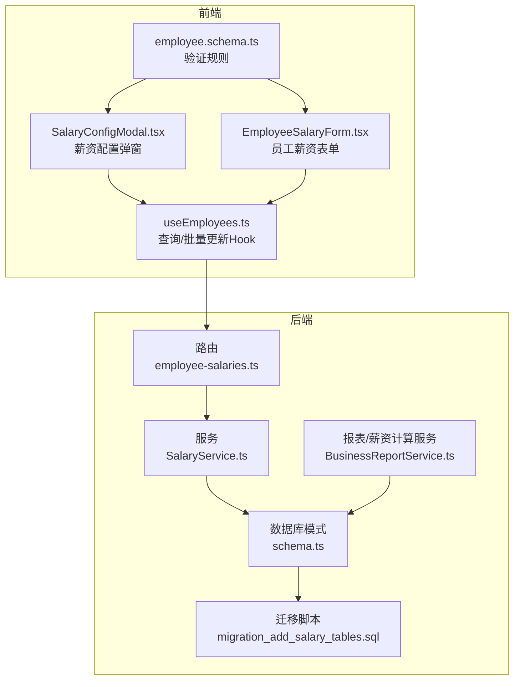
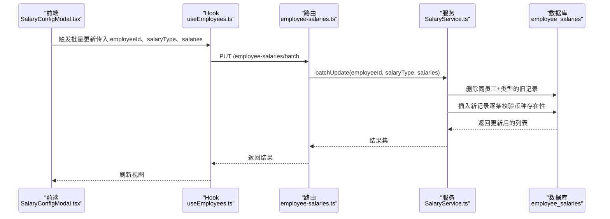
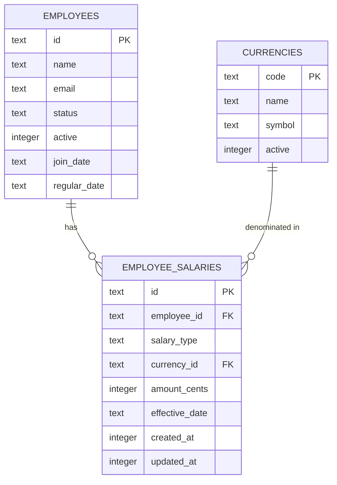
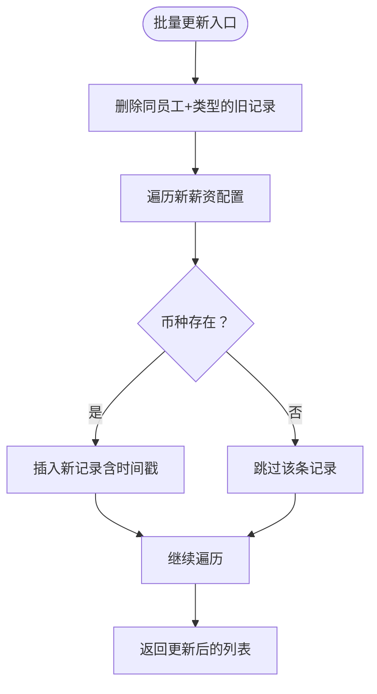
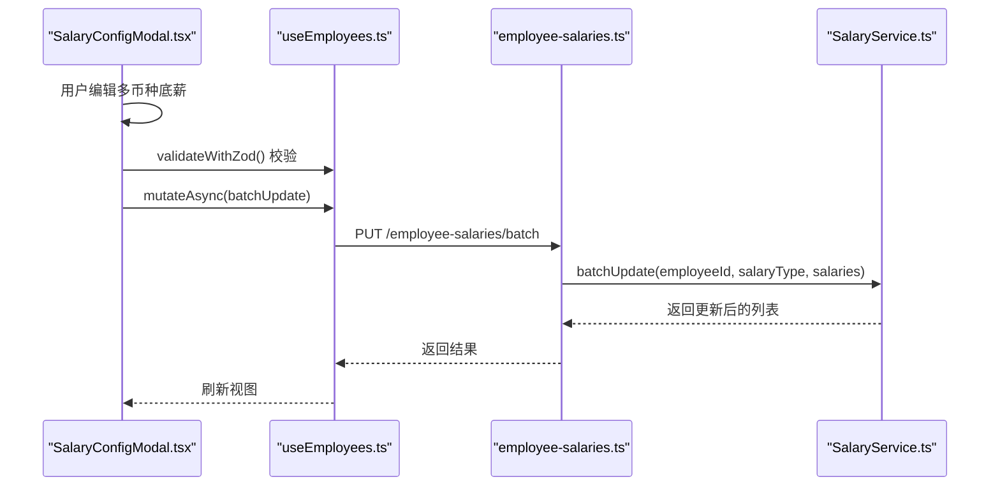
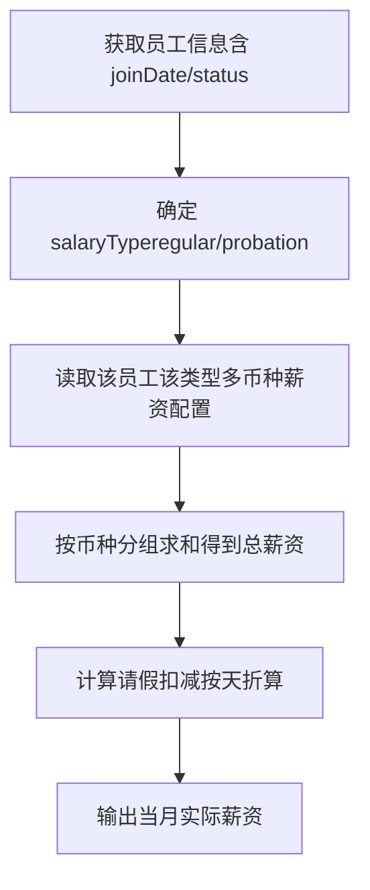
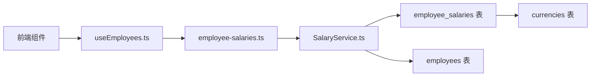

# 员工薪资配置

<cite>
**本文引用的文件**
- [backend/src/db/schema.ts](file://backend/src/db/schema.ts)
- [backend/src/db/migration_add_salary_tables.sql](file://backend/src/db/migration_add_salary_tables.sql)
- [backend/src/routes/v2/employee-salaries.ts](file://backend/src/routes/v2/employee-salaries.ts)
- [backend/src/services/SalaryService.ts](file://backend/src/services/SalaryService.ts)
- [frontend/src/features/employees/components/modals/SalaryConfigModal.tsx](file://frontend/src/features/employees/components/modals/SalaryConfigModal.tsx)
- [frontend/src/features/employees/components/forms/EmployeeSalaryForm.tsx](file://frontend/src/features/employees/components/forms/EmployeeSalaryForm.tsx)
- [frontend/src/hooks/business/useEmployees.ts](file://frontend/src/hooks/business/useEmployees.ts)
- [frontend/src/validations/employee.schema.ts](file://frontend/src/validations/employee.schema.ts)
- [backend/src/services/BusinessReportService.ts](file://backend/src/services/BusinessReportService.ts)
</cite>

## 目录
1. [简介](#简介)
2. [项目结构](#项目结构)
3. [核心组件](#核心组件)
4. [架构总览](#架构总览)
5. [详细组件分析](#详细组件分析)
6. [依赖关系分析](#依赖关系分析)
7. [性能考量](#性能考量)
8. [故障排查指南](#故障排查指南)
9. [结论](#结论)
10. [附录](#附录)

## 简介
本文件聚焦“员工薪资配置”数据模型，系统性阐述 employee_salaries 表的结构、业务语义与约束，以及其与 employees 表的关联关系。同时说明该表如何支撑薪资计算服务（SalaryService）进行月薪核算，并给出 Drizzle ORM 的定义参考与前端薪资配置页面的集成方式，帮助读者快速理解并正确使用该模块。

## 项目结构
围绕“员工薪资配置”的后端与前端关键文件分布如下：
- 后端数据库层：Drizzle ORM 定义与迁移脚本
- 后端路由与服务：薪资配置的 CRUD 与批量更新接口，以及薪资计算服务
- 前端：薪资配置弹窗与表单，配合查询与批量更新 Hook

图表来源
- [backend/src/routes/v2/employee-salaries.ts](file://backend/src/routes/v2/employee-salaries.ts#L1-L258)
- [backend/src/services/SalaryService.ts](file://backend/src/services/SalaryService.ts#L1-L186)
- [backend/src/db/schema.ts](file://backend/src/db/schema.ts#L220-L229)
- [backend/src/db/migration_add_salary_tables.sql](file://backend/src/db/migration_add_salary_tables.sql#L1-L21)
- [backend/src/services/BusinessReportService.ts](file://backend/src/services/BusinessReportService.ts#L352-L450)
- [frontend/src/features/employees/components/modals/SalaryConfigModal.tsx](file://frontend/src/features/employees/components/modals/SalaryConfigModal.tsx#L1-L104)
- [frontend/src/features/employees/components/forms/EmployeeSalaryForm.tsx](file://frontend/src/features/employees/components/forms/EmployeeSalaryForm.tsx#L1-L147)
- [frontend/src/hooks/business/useEmployees.ts](file://frontend/src/hooks/business/useEmployees.ts#L73-L161)
- [frontend/src/validations/employee.schema.ts](file://frontend/src/validations/employee.schema.ts#L106-L118)

章节来源
- [backend/src/db/schema.ts](file://backend/src/db/schema.ts#L220-L229)
- [backend/src/db/migration_add_salary_tables.sql](file://backend/src/db/migration_add_salary_tables.sql#L1-L21)
- [backend/src/routes/v2/employee-salaries.ts](file://backend/src/routes/v2/employee-salaries.ts#L1-L258)
- [backend/src/services/SalaryService.ts](file://backend/src/services/SalaryService.ts#L1-L186)
- [frontend/src/features/employees/components/modals/SalaryConfigModal.tsx](file://frontend/src/features/employees/components/modals/SalaryConfigModal.tsx#L1-L104)
- [frontend/src/features/employees/components/forms/EmployeeSalaryForm.tsx](file://frontend/src/features/employees/components/forms/EmployeeSalaryForm.tsx#L1-L147)
- [frontend/src/hooks/business/useEmployees.ts](file://frontend/src/hooks/business/useEmployees.ts#L73-L161)
- [frontend/src/validations/employee.schema.ts](file://frontend/src/validations/employee.schema.ts#L106-L118)

## 核心组件
- 数据表：employee_salaries
  - 关键字段与业务含义
    - employeeId：外键关联 employees 表 id，标识所属员工
    - salaryType：枚举值，'probation' 或 'regular'，区分试用期与转正薪资
    - currencyId：外键关联 currencies 表 code，标识币种
    - amountCents：整型金额（分），统一以最小货币单位存储
    - effectiveDate：可空，用于薪资生效日期管理（见后续章节）
    - createdAt/updatedAt：时间戳，便于审计与排序
  - 约束与索引
    - 主键 id
    - 建议在 employeeId + salaryType 上建立复合索引，提升按员工与类型查询效率
    - 建议在 currencyId 上建立索引，提升按币种聚合统计效率
- 路由与服务
  - 提供薪资列表、创建、批量更新、删除等接口
  - 服务层负责校验、插入/更新、删除与聚合查询
- 前端
  - 提供薪资配置弹窗与表单，支持按币种配置试用期与转正薪资
  - 使用 Hook 进行查询与批量更新，调用后端接口

章节来源
- [backend/src/db/schema.ts](file://backend/src/db/schema.ts#L220-L229)
- [backend/src/db/migration_add_salary_tables.sql](file://backend/src/db/migration_add_salary_tables.sql#L1-L21)
- [backend/src/routes/v2/employee-salaries.ts](file://backend/src/routes/v2/employee-salaries.ts#L41-L139)
- [backend/src/services/SalaryService.ts](file://backend/src/services/SalaryService.ts#L11-L29)

## 架构总览
薪资配置从“前端配置 -> 后端路由 -> 服务层 -> 数据库”的完整链路如下：

图表来源
- [frontend/src/features/employees/components/modals/SalaryConfigModal.tsx](file://frontend/src/features/employees/components/modals/SalaryConfigModal.tsx#L1-L104)
- [frontend/src/hooks/business/useEmployees.ts](file://frontend/src/hooks/business/useEmployees.ts#L139-L149)
- [backend/src/routes/v2/employee-salaries.ts](file://backend/src/routes/v2/employee-salaries.ts#L158-L221)
- [backend/src/services/SalaryService.ts](file://backend/src/services/SalaryService.ts#L103-L172)

## 详细组件分析

### 数据模型：employee_salaries
- 字段定义与业务含义
  - employeeId：员工标识，与 employees 表 id 关联
  - salaryType：薪资类型，'probation' 或 'regular'
  - currencyId：币种标识，与 currencies 表 code 关联
  - amountCents：以“分”为单位的金额，避免浮点误差
  - effectiveDate：可空，用于记录该条记录的生效日期；可用于“生效日期优先”的薪资计算策略
  - createdAt/updatedAt：时间戳，便于审计与排序
- 约束与索引建议
  - 主键 id
  - 建议在 employeeId + salaryType 上建立复合索引，提升按员工与类型查询效率
  - 建议在 currencyId 上建立索引，提升按币种聚合统计效率
- 与 employees 表的关联
  - 通过 employeeId 外键关联 employees 表 id
  - 服务层在查询时通过左连接获取员工姓名，便于展示

图表来源
- [backend/src/db/schema.ts](file://backend/src/db/schema.ts#L14-L48)
- [backend/src/db/schema.ts](file://backend/src/db/schema.ts#L213-L219)
- [backend/src/db/schema.ts](file://backend/src/db/schema.ts#L220-L229)

章节来源
- [backend/src/db/schema.ts](file://backend/src/db/schema.ts#L220-L229)

### 路由与服务：薪资配置 CRUD 与批量更新
- 接口能力
  - 列表查询：支持按 employeeId 与 salaryType 过滤
  - 创建：默认 salaryType 为 'regular'，若未显式提供
  - 批量更新：删除同员工+类型的现有记录，再插入新的多币种配置
  - 删除：按 id 删除
- 服务层逻辑要点
  - 批量更新前先删除旧记录，确保同一员工在同一类型下仅保留最新配置
  - 对每条新增记录执行币种存在性校验
  - 聚合查询按币种分组统计员工总薪资

图表来源
- [backend/src/routes/v2/employee-salaries.ts](file://backend/src/routes/v2/employee-salaries.ts#L158-L221)
- [backend/src/services/SalaryService.ts](file://backend/src/services/SalaryService.ts#L103-L172)

章节来源
- [backend/src/routes/v2/employee-salaries.ts](file://backend/src/routes/v2/employee-salaries.ts#L41-L139)
- [backend/src/services/SalaryService.ts](file://backend/src/services/SalaryService.ts#L11-L29)
- [backend/src/services/SalaryService.ts](file://backend/src/services/SalaryService.ts#L103-L172)

### 前端集成：薪资配置弹窗与表单
- 弹窗 SalaryConfigModal
  - 支持按币种配置薪资，将金额从元转换为“分”（乘以 100）后再提交
  - 初始化时根据已有记录填充表单
  - 提交时过滤空项，调用批量更新接口
- 表单 EmployeeSalaryForm
  - 分别维护 probation_salaries 与 regular_salaries 两组表单项
  - 支持动态增删币种项
- Hook useEmployees
  - useEmployeeSalaries：按 employeeId 与 salaryType 查询薪资列表
  - useUpdateEmployeeSalaries：批量更新薪资配置

图表来源
- [frontend/src/features/employees/components/modals/SalaryConfigModal.tsx](file://frontend/src/features/employees/components/modals/SalaryConfigModal.tsx#L1-L104)
- [frontend/src/hooks/business/useEmployees.ts](file://frontend/src/hooks/business/useEmployees.ts#L73-L161)
- [backend/src/routes/v2/employee-salaries.ts](file://backend/src/routes/v2/employee-salaries.ts#L158-L221)
- [backend/src/services/SalaryService.ts](file://backend/src/services/SalaryService.ts#L103-L172)

章节来源
- [frontend/src/features/employees/components/modals/SalaryConfigModal.tsx](file://frontend/src/features/employees/components/modals/SalaryConfigModal.tsx#L1-L104)
- [frontend/src/features/employees/components/forms/EmployeeSalaryForm.tsx](file://frontend/src/features/employees/components/forms/EmployeeSalaryForm.tsx#L1-L147)
- [frontend/src/hooks/business/useEmployees.ts](file://frontend/src/hooks/business/useEmployees.ts#L73-L161)
- [frontend/src/validations/employee.schema.ts](file://frontend/src/validations/employee.schema.ts#L106-L118)

### 薪资生效日期管理（effectiveDate）
- 字段定位
  - employee_salaries.effectiveDate 可为空，用于记录该条薪资记录的生效日期
- 业务用途
  - 当存在多条同员工同类型的薪资记录时，可通过生效日期实现“以最新生效日期为准”的策略
  - 报表与薪资计算服务可据此筛选有效薪资记录，避免重复或过期配置
- 实践建议
  - 建议在插入/更新时对 effectiveDate 进行合法性校验（如非空时需为日期字符串）
  - 在查询时按生效日期降序排序，取第一条作为当前有效薪资

章节来源
- [backend/src/db/schema.ts](file://backend/src/db/schema.ts#L220-L229)
- [backend/src/services/SalaryService.ts](file://backend/src/services/SalaryService.ts#L103-L172)

### 与薪资计算服务的协作
- 薪资计算服务（BusinessReportService）在生成月度薪资时，会依据员工状态（regular/probation）选择对应类型的薪资配置，并按币种聚合计算当月应发金额
- 计算流程要点
  - 根据员工 joinDate 与当月日期确定工作天数
  - 按员工状态选择 salaryType（regular 或 probation）
  - 读取该员工对应类型的多币种薪资配置，按币种分组求和
  - 扣除当月请假天数后折算实际薪资

图表来源
- [backend/src/services/BusinessReportService.ts](file://backend/src/services/BusinessReportService.ts#L352-L450)

章节来源
- [backend/src/services/BusinessReportService.ts](file://backend/src/services/BusinessReportService.ts#L352-L450)

## 依赖关系分析
- 组件耦合
  - 路由依赖服务层（SalaryService）
  - 服务层依赖 Drizzle ORM 与数据库 schema
  - 前端通过 Hook 调用后端接口，间接依赖路由与服务
- 外部依赖
  - Drizzle ORM（sqlite-core）
  - Ant Design（前端表单与弹窗）
  - Zod（前端表单校验）

图表来源
- [frontend/src/hooks/business/useEmployees.ts](file://frontend/src/hooks/business/useEmployees.ts#L73-L161)
- [backend/src/routes/v2/employee-salaries.ts](file://backend/src/routes/v2/employee-salaries.ts#L1-L258)
- [backend/src/services/SalaryService.ts](file://backend/src/services/SalaryService.ts#L1-L186)
- [backend/src/db/schema.ts](file://backend/src/db/schema.ts#L220-L229)

章节来源
- [backend/src/routes/v2/employee-salaries.ts](file://backend/src/routes/v2/employee-salaries.ts#L1-L258)
- [backend/src/services/SalaryService.ts](file://backend/src/services/SalaryService.ts#L1-L186)
- [backend/src/db/schema.ts](file://backend/src/db/schema.ts#L220-L229)

## 性能考量
- 查询优化
  - 在 employeeId + salaryType 上建立复合索引，减少批量更新与查询成本
  - 在 currencyId 上建立索引，提升按币种聚合统计效率
- 写入优化
  - 批量更新采用“删除旧记录 + 插入新记录”的策略，确保幂等性与一致性
  - 对每条新增记录进行币种存在性校验，避免脏数据进入数据库
- 前端缓存
  - 使用 React Query 的 staleTime 缓存查询结果，降低重复请求

章节来源
- [backend/src/services/SalaryService.ts](file://backend/src/services/SalaryService.ts#L103-L172)
- [frontend/src/hooks/business/useEmployees.ts](file://frontend/src/hooks/business/useEmployees.ts#L73-L161)

## 故障排查指南
- 常见问题
  - 币种不存在：批量更新时若币种 code 不存在会被忽略，检查 currencies 表数据
  - 金额非法：前端将金额从元转换为“分”，若传入负数或非数字，会被校验拒绝
  - 生效日期异常：若提供 effectiveDate，请确保为合法日期字符串
- 排查步骤
  - 后端：确认路由参数与请求体格式，检查服务层日志与错误处理
  - 前端：确认表单校验通过，Hook 的 mutation 是否触发成功
  - 数据库：核对 employeeId、salaryType、currencyId 是否匹配

章节来源
- [backend/src/services/SalaryService.ts](file://backend/src/services/SalaryService.ts#L103-L172)
- [frontend/src/validations/employee.schema.ts](file://frontend/src/validations/employee.schema.ts#L106-L118)
- [frontend/src/features/employees/components/modals/SalaryConfigModal.tsx](file://frontend/src/features/employees/components/modals/SalaryConfigModal.tsx#L39-L58)

## 结论
employee_salaries 表通过“员工 + 类型 + 币种”的多维配置，实现了灵活的多币种薪资管理。结合路由与服务层的批量更新策略、前端的表单与弹窗交互，以及报表/薪资计算服务的协同，形成了完整的薪资配置与核算闭环。建议在生产环境中完善索引与生效日期策略，确保数据一致性与查询性能。

## 附录

### Drizzle ORM 定义参考
- 数据表定义位置
  - [backend/src/db/schema.ts](file://backend/src/db/schema.ts#L220-L229)
- 迁移脚本位置
  - [backend/src/db/migration_add_salary_tables.sql](file://backend/src/db/migration_add_salary_tables.sql#L1-L21)

章节来源
- [backend/src/db/schema.ts](file://backend/src/db/schema.ts#L220-L229)
- [backend/src/db/migration_add_salary_tables.sql](file://backend/src/db/migration_add_salary_tables.sql#L1-L21)

### 前端薪资配置页面集成要点
- 弹窗 SalaryConfigModal
  - 金额转换：前端将元转换为“分”后再提交
  - 校验规则：使用 salaryConfigSchema 控制必填与数值范围
- 表单 EmployeeSalaryForm
  - 分别维护 probation_salaries 与 regular_salaries
  - 动态增删币种项，支持多币种配置
- Hook useEmployees
  - useEmployeeSalaries：按 employeeId 与 salaryType 查询
  - useUpdateEmployeeSalaries：批量更新薪资配置

章节来源
- [frontend/src/features/employees/components/modals/SalaryConfigModal.tsx](file://frontend/src/features/employees/components/modals/SalaryConfigModal.tsx#L1-L104)
- [frontend/src/features/employees/components/forms/EmployeeSalaryForm.tsx](file://frontend/src/features/employees/components/forms/EmployeeSalaryForm.tsx#L1-L147)
- [frontend/src/hooks/business/useEmployees.ts](file://frontend/src/hooks/business/useEmployees.ts#L73-L161)
- [frontend/src/validations/employee.schema.ts](file://frontend/src/validations/employee.schema.ts#L106-L118)