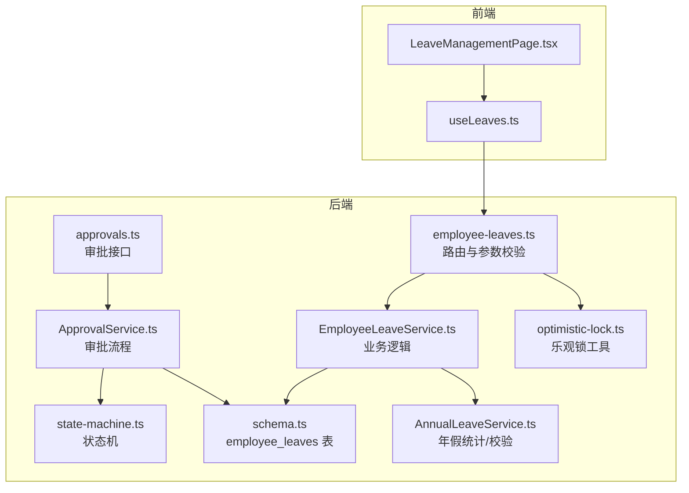
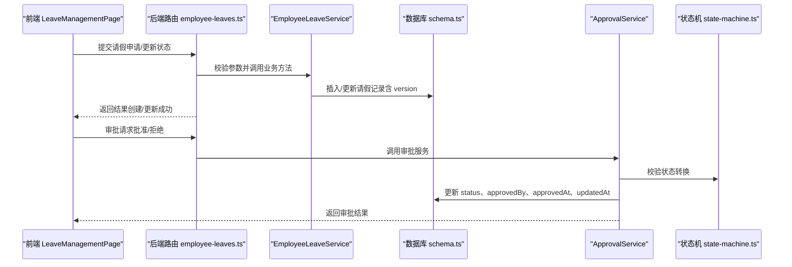
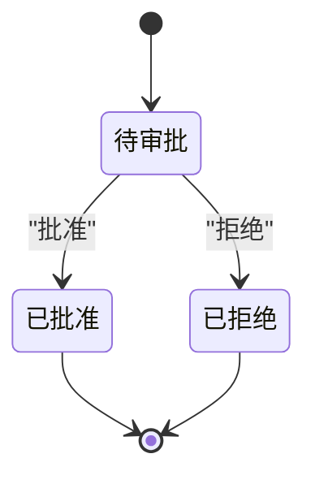
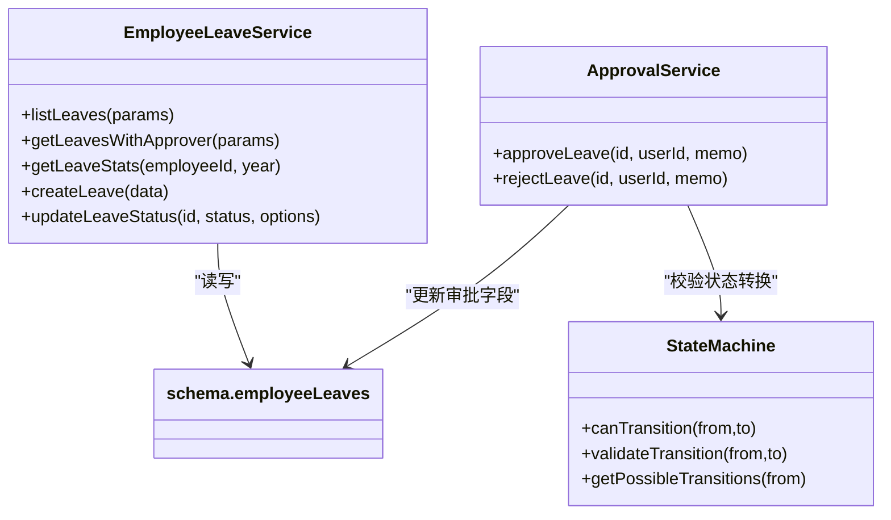
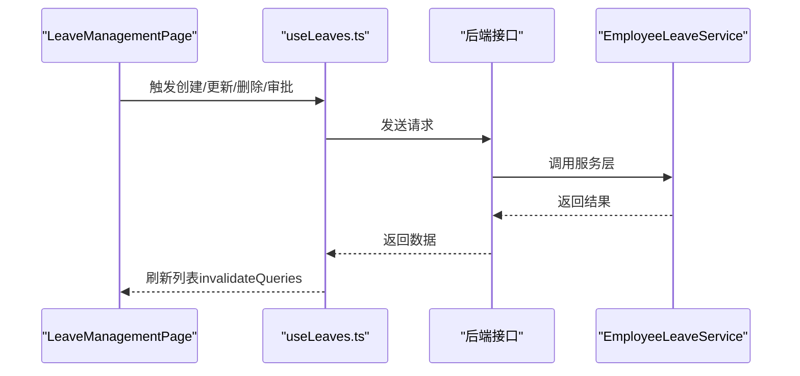
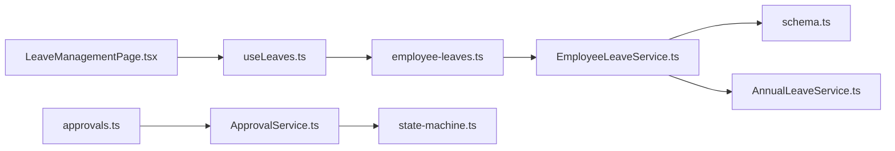

# 员工请假记录

<cite>
**本文引用的文件**
- [employee-leaves.ts](file://backend/src/routes/v2/employee-leaves.ts)
- [schema.ts](file://backend/src/db/schema.ts)
- [EmployeeLeaveService.ts](file://backend/src/services/EmployeeLeaveService.ts)
- [ApprovalService.ts](file://backend/src/services/ApprovalService.ts)
- [state-machine.ts](file://backend/src/utils/state-machine.ts)
- [LeaveManagementPage.tsx](file://frontend/src/features/hr/pages/LeaveManagementPage.tsx)
- [useLeaves.ts](file://frontend/src/hooks/business/useLeaves.ts)
- [AnnualLeaveService.ts](file://backend/src/services/AnnualLeaveService.ts)
- [optimistic-lock.ts](file://backend/src/utils/optimistic-lock.ts)
- [approvalRoutes.ts](file://backend/src/routes/v2/approvals.ts)
</cite>

## 目录
1. [简介](#简介)
2. [项目结构](#项目结构)
3. [核心组件](#核心组件)
4. [架构总览](#架构总览)
5. [详细组件分析](#详细组件分析)
6. [依赖关系分析](#依赖关系分析)
7. [性能考量](#性能考量)
8. [故障排查指南](#故障排查指南)
9. [结论](#结论)

## 简介
本文件系统化梳理“员工请假记录”数据模型与请假流程管理，围绕 employee_leaves 表的字段语义、业务规则、并发控制、审批留痕与前端集成进行深入解析。重点覆盖：
- 字段语义与校验：leaveType、startDate、endDate、days、status（pending、approved、rejected）
- 并发控制：version 乐观锁版本号在请假记录修改中的作用
- 审批留痕：approvedBy、approvedAt 等字段如何记录审批人与时间
- 年假联动：与员工年度假期额度（annualLeaveDays）及 AnnualLeaveService 的统计/校验联动
- 流程支撑：EmployeeLeaveService 如何支撑请假申请、审批、撤销等操作
- 前端集成：LeaveManagementPage 与 useLeaves Hook 的交互

## 项目结构
请假模块由后端路由、服务层、数据库模式、状态机与前端页面/Hook 共同组成，形成“请求—校验—持久化—审批—展示”的闭环。

图表来源
- [employee-leaves.ts](file://backend/src/routes/v2/employee-leaves.ts#L1-L176)
- [schema.ts](file://backend/src/db/schema.ts#L269-L284)
- [EmployeeLeaveService.ts](file://backend/src/services/EmployeeLeaveService.ts#L1-L182)
- [ApprovalService.ts](file://backend/src/services/ApprovalService.ts#L326-L376)
- [state-machine.ts](file://backend/src/utils/state-machine.ts#L79-L89)
- [LeaveManagementPage.tsx](file://frontend/src/features/hr/pages/LeaveManagementPage.tsx#L1-L563)
- [useLeaves.ts](file://frontend/src/hooks/business/useLeaves.ts#L1-L103)
- [AnnualLeaveService.ts](file://backend/src/services/AnnualLeaveService.ts#L1-L226)
- [optimistic-lock.ts](file://backend/src/utils/optimistic-lock.ts#L1-L41)
- [approvalRoutes.ts](file://backend/src/routes/v2/approvals.ts#L165-L265)

章节来源
- [employee-leaves.ts](file://backend/src/routes/v2/employee-leaves.ts#L1-L176)
- [schema.ts](file://backend/src/db/schema.ts#L269-L284)
- [EmployeeLeaveService.ts](file://backend/src/services/EmployeeLeaveService.ts#L1-L182)
- [ApprovalService.ts](file://backend/src/services/ApprovalService.ts#L326-L376)
- [state-machine.ts](file://backend/src/utils/state-machine.ts#L79-L89)
- [LeaveManagementPage.tsx](file://frontend/src/features/hr/pages/LeaveManagementPage.tsx#L1-L563)
- [useLeaves.ts](file://frontend/src/hooks/business/useLeaves.ts#L1-L103)
- [AnnualLeaveService.ts](file://backend/src/services/AnnualLeaveService.ts#L1-L226)
- [optimistic-lock.ts](file://backend/src/utils/optimistic-lock.ts#L1-L41)
- [approvalRoutes.ts](file://backend/src/routes/v2/approvals.ts#L165-L265)

## 核心组件
- 数据模型（employee_leaves 表）
  - 关键字段：id、employeeId、leaveType、startDate、endDate、days、status、reason、memo、approvedBy、approvedAt、version、createdAt、updatedAt
  - 默认值与约束：status 默认 pending；version 默认 1；字段类型与非空约束见 schema.ts
- 后端服务
  - EmployeeLeaveService：提供列表、创建、更新状态（含审批留痕）、统计等能力
  - ApprovalService：封装审批流程，基于状态机进行状态转换校验
  - AnnualLeaveService：提供年假配置、周期计算、使用统计与超额校验
- 前端页面与 Hook
  - LeaveManagementPage：HR/管理者视角的请假管理界面
  - useLeaves：React Query Hook，负责数据拉取与变更后的缓存失效

章节来源
- [schema.ts](file://backend/src/db/schema.ts#L269-L284)
- [EmployeeLeaveService.ts](file://backend/src/services/EmployeeLeaveService.ts#L1-L182)
- [ApprovalService.ts](file://backend/src/services/ApprovalService.ts#L326-L376)
- [AnnualLeaveService.ts](file://backend/src/services/AnnualLeaveService.ts#L1-L226)
- [LeaveManagementPage.tsx](file://frontend/src/features/hr/pages/LeaveManagementPage.tsx#L1-L563)
- [useLeaves.ts](file://frontend/src/hooks/business/useLeaves.ts#L1-L103)

## 架构总览
请假流程从“前端提交—后端校验—服务层处理—数据库持久化—审批留痕—前端刷新”闭环运行。状态机确保状态转换合法，乐观锁保障并发安全。

图表来源
- [employee-leaves.ts](file://backend/src/routes/v2/employee-leaves.ts#L83-L176)
- [EmployeeLeaveService.ts](file://backend/src/services/EmployeeLeaveService.ts#L100-L181)
- [schema.ts](file://backend/src/db/schema.ts#L269-L284)
- [ApprovalService.ts](file://backend/src/services/ApprovalService.ts#L326-L376)
- [state-machine.ts](file://backend/src/utils/state-machine.ts#L79-L89)
- [LeaveManagementPage.tsx](file://frontend/src/features/hr/pages/LeaveManagementPage.tsx#L1-L563)

## 详细组件分析

### 数据模型与字段语义
- 字段定义与默认值
  - id：主键
  - employeeId：外键关联员工
  - leaveType：请假类型（如 sick、annual、personal、other）
  - startDate、endDate：起止日期（字符串）
  - days：天数（整数）
  - status：状态，默认 pending（枚举：pending、approved、rejected）
  - reason、memo：原因与备注
  - approvedBy、approvedAt：审批人与审批时间戳
  - version：乐观锁版本号
  - createdAt、updatedAt：创建与更新时间戳
- 业务规则与校验
  - leaveType：前端/路由中以字符串形式传入，建议在服务层或路由层做白名单校验
  - startDate、endDate：前端示例中会自动计算天数，服务层插入时也包含这些字段
  - days：通常由前端根据日期差计算，或允许手动输入
  - status：仅允许 pending → approved/rejected 的单向转换，终态不可逆
  - approvedBy、approvedAt：当状态变为 approved/rejected 时写入，便于审计留痕
  - version：用于并发修改保护，避免“最后写入覆盖”问题

章节来源
- [schema.ts](file://backend/src/db/schema.ts#L269-L284)
- [employee-leaves.ts](file://backend/src/routes/v2/employee-leaves.ts#L10-L41)
- [LeaveManagementPage.tsx](file://frontend/src/features/hr/pages/LeaveManagementPage.tsx#L97-L123)

### 请假流程与状态机
- 状态机定义
  - pending → approved/rejected
  - approved/rejected 为终态，不可再转换
- 审批流程
  - 路由层接收审批请求，调用 ApprovalService
  - ApprovalService 基于 leaveStateMachine 校验状态转换
  - 成功后更新 status、approvedBy、approvedAt、updatedAt

图表来源
- [state-machine.ts](file://backend/src/utils/state-machine.ts#L79-L89)
- [approvalRoutes.ts](file://backend/src/routes/v2/approvals.ts#L165-L265)
- [ApprovalService.ts](file://backend/src/services/ApprovalService.ts#L326-L376)

章节来源
- [state-machine.ts](file://backend/src/utils/state-machine.ts#L79-L89)
- [approvalRoutes.ts](file://backend/src/routes/v2/approvals.ts#L165-L265)
- [ApprovalService.ts](file://backend/src/services/ApprovalService.ts#L326-L376)

### 并发控制与乐观锁
- version 字段
  - schema 中 employee_leaves 表包含 version 字段，默认 1
  - 在并发修改场景下，若版本号不一致，应触发并发冲突错误
- 乐观锁工具
  - validateVersion：比较当前版本与期望版本，不一致则抛错
  - incrementVersion：递增版本号
- 实践建议
  - 前端在编辑时携带期望版本号（若后端支持），服务层在更新前校验
  - 若版本号为空，按向后兼容策略处理

章节来源
- [schema.ts](file://backend/src/db/schema.ts#L269-L284)
- [optimistic-lock.ts](file://backend/src/utils/optimistic-lock.ts#L1-L41)

### 审批留痕与审计
- 留痕字段
  - approvedBy：审批人 ID
  - approvedAt：审批时间戳
  - updatedAt：通用更新时间戳
- 审批接口
  - 路由 approvals.ts 提供 approve/reject 接口，调用 ApprovalService
  - ApprovalService 将审批动作写入业务操作历史（通过 processApproval 调用链）

章节来源
- [approvalRoutes.ts](file://backend/src/routes/v2/approvals.ts#L165-L265)
- [ApprovalService.ts](file://backend/src/services/ApprovalService.ts#L326-L376)

### 年假额度联动与统计
- 年假统计
  - AnnualLeaveService 提供周期计算、已用天数统计、剩余天数计算
  - 年假类型过滤：仅统计 leaveType='annual' 且 status='approved' 的记录
- 申请校验
  - validateAnnualLeaveRequest：在入职第一周期内禁止年假；超出剩余天数则拒绝
- 与请假记录的关系
  - 年假额度来源于 AnnualLeaveService 的统计，而非直接存储在 employee_leaves
  - 业务上建议在前端/服务层对年假申请进行超额校验后再提交

章节来源
- [AnnualLeaveService.ts](file://backend/src/services/AnnualLeaveService.ts#L1-L226)

### 后端服务与路由
- 路由职责
  - 列表、创建、更新状态（含审批）
  - 参数校验：如 status 限定为 pending/approved/rejected
- 服务层职责
  - listLeaves：支持按 employeeId、status、year 过滤
  - createLeave：插入新记录，status 默认 pending
  - updateLeaveStatus：更新状态与审批留痕字段
  - getLeaveStats：按 leaveType 聚合 approved 天数

图表来源
- [EmployeeLeaveService.ts](file://backend/src/services/EmployeeLeaveService.ts#L1-L182)
- [ApprovalService.ts](file://backend/src/services/ApprovalService.ts#L326-L376)
- [state-machine.ts](file://backend/src/utils/state-machine.ts#L1-L89)
- [schema.ts](file://backend/src/db/schema.ts#L269-L284)

章节来源
- [employee-leaves.ts](file://backend/src/routes/v2/employee-leaves.ts#L43-L176)
- [EmployeeLeaveService.ts](file://backend/src/services/EmployeeLeaveService.ts#L1-L182)
- [ApprovalService.ts](file://backend/src/services/ApprovalService.ts#L326-L376)

### 前端集成与交互
- 页面职责
  - LeaveManagementPage：展示请假列表、筛选、创建/编辑、审批弹窗
  - 自动计算天数：根据 startDate、endDate 计算 days
  - 权限控制：根据权限决定可编辑/可审批/可删除
- 数据 Hook
  - useLeaves：统一管理请假数据的查询、创建、更新、删除、审批等 Mutation
  - React Query 在每次变更后主动失效缓存并重新拉取

图表来源
- [LeaveManagementPage.tsx](file://frontend/src/features/hr/pages/LeaveManagementPage.tsx#L1-L563)
- [useLeaves.ts](file://frontend/src/hooks/business/useLeaves.ts#L1-L103)
- [employee-leaves.ts](file://backend/src/routes/v2/employee-leaves.ts#L83-L176)

章节来源
- [LeaveManagementPage.tsx](file://frontend/src/features/hr/pages/LeaveManagementPage.tsx#L1-L563)
- [useLeaves.ts](file://frontend/src/hooks/business/useLeaves.ts#L1-L103)

## 依赖关系分析
- 路由依赖服务层，服务层依赖数据库 schema
- 审批流程依赖状态机与业务操作历史
- 年假统计独立于请假记录，但业务上强相关
- 前端依赖后端 API，使用 React Query 管理缓存

图表来源
- [employee-leaves.ts](file://backend/src/routes/v2/employee-leaves.ts#L1-L176)
- [schema.ts](file://backend/src/db/schema.ts#L269-L284)
- [EmployeeLeaveService.ts](file://backend/src/services/EmployeeLeaveService.ts#L1-L182)
- [approvalRoutes.ts](file://backend/src/routes/v2/approvals.ts#L165-L265)
- [ApprovalService.ts](file://backend/src/services/ApprovalService.ts#L326-L376)
- [state-machine.ts](file://backend/src/utils/state-machine.ts#L79-L89)
- [AnnualLeaveService.ts](file://backend/src/services/AnnualLeaveService.ts#L1-L226)
- [LeaveManagementPage.tsx](file://frontend/src/features/hr/pages/LeaveManagementPage.tsx#L1-L563)
- [useLeaves.ts](file://frontend/src/hooks/business/useLeaves.ts#L1-L103)

## 性能考量
- 查询优化
  - 列表接口支持按 employeeId、status、year 过滤，建议在数据库侧建立索引以提升过滤效率
- 并发控制
  - 使用 version 字段进行乐观锁，减少写冲突导致的数据覆盖
- 前端缓存
  - React Query 的 staleTime 与 invalidateQueries 机制有助于减少重复请求与保持数据一致性

[本节为通用指导，不涉及具体文件分析]

## 故障排查指南
- 状态转换错误
  - 现象：尝试将 approved/rejected 再转回 pending
  - 原因：状态机限制终态不可逆
  - 处理：检查 leaveStateMachine 的转换规则
- 并发修改冲突
  - 现象：更新时报错提示“数据已被其他用户修改”
  - 原因：version 不匹配
  - 处理：刷新页面后重试，或在前端携带期望版本号
- 审批留痕缺失
  - 现象：approvedBy/approvedAt 为空
  - 原因：未走审批流程或更新状态时未传入审批人信息
  - 处理：通过审批接口更新状态，确保写入审批人与时间

章节来源
- [state-machine.ts](file://backend/src/utils/state-machine.ts#L79-L89)
- [optimistic-lock.ts](file://backend/src/utils/optimistic-lock.ts#L1-L41)
- [employee-leaves.ts](file://backend/src/routes/v2/employee-leaves.ts#L125-L176)
- [approvalRoutes.ts](file://backend/src/routes/v2/approvals.ts#L165-L265)

## 结论
employee_leaves 表通过清晰的字段语义、严格的审批状态机与乐观锁机制，有效支撑了请假申请、审批与留痕管理。结合 AnnualLeaveService 的年假统计与校验，可在业务层面实现“先校验、后提交”的稳健流程。前端 LeaveManagementPage 与 useLeaves Hook 则提供了直观易用的交互体验与良好的数据一致性保障。建议后续在后端完善版本号校验与并发冲突处理，并在前端增加更细粒度的错误提示与重试机制。