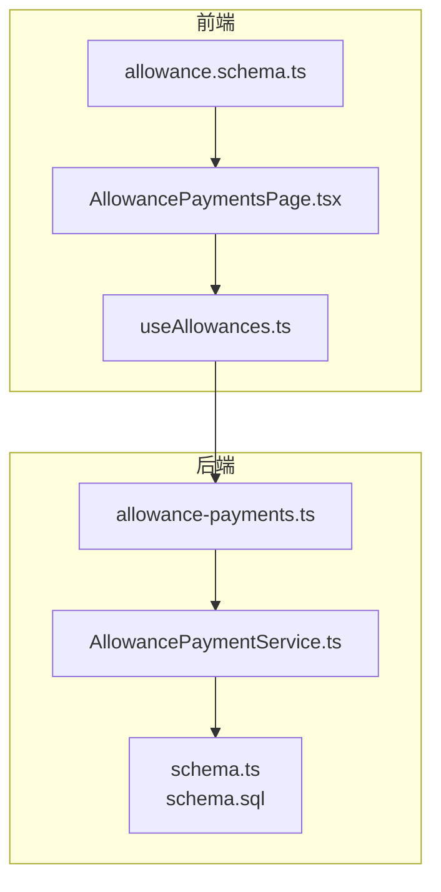
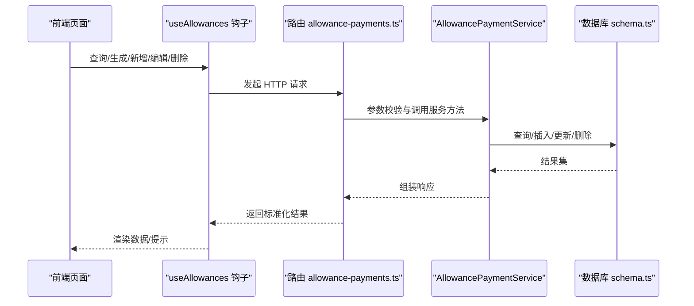
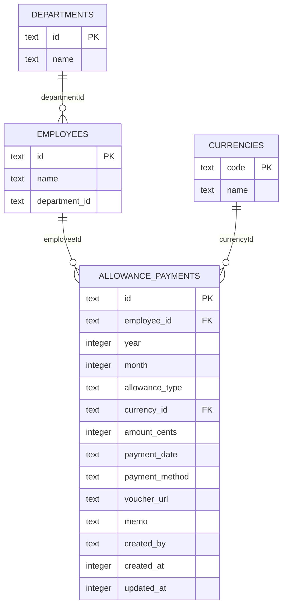
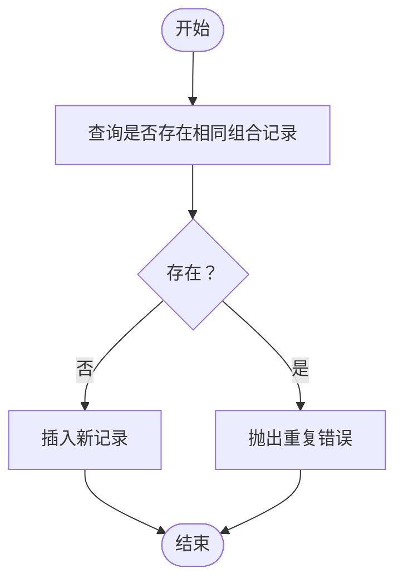
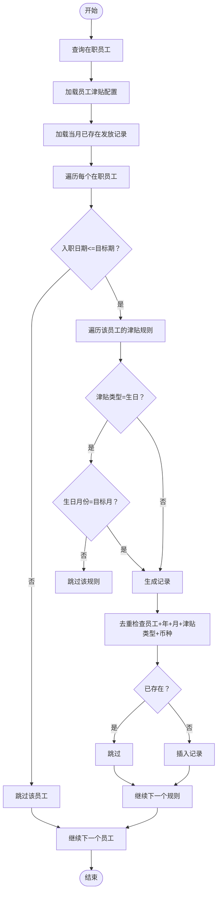
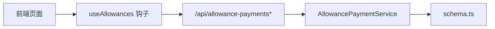

# 津贴发放记录

<cite>
**本文引用的文件**
- [schema.ts](file://backend/src/db/schema.ts)
- [schema.sql](file://backend/src/db/schema.sql)
- [AllowancePaymentService.ts](file://backend/src/services/AllowancePaymentService.ts)
- [allowance-payments.ts](file://backend/src/routes/v2/allowance-payments.ts)
- [AllowancePaymentsPage.tsx](file://frontend/src/features/hr/pages/AllowancePaymentsPage.tsx)
- [allowance.schema.ts](file://frontend/src/validations/allowance.schema.ts)
- [useAllowances.ts](file://frontend/src/hooks/business/useAllowances.ts)
- [openapi.json](file://backend/openapi.json)
- [AllowancePaymentService.test.ts](file://backend/test/services/AllowancePaymentService.test.ts)
</cite>

## 目录
1. [简介](#简介)
2. [项目结构](#项目结构)
3. [核心组件](#核心组件)
4. [架构总览](#架构总览)
5. [详细组件分析](#详细组件分析)
6. [依赖关系分析](#依赖关系分析)
7. [性能考量](#性能考量)
8. [故障排查指南](#故障排查指南)
9. [结论](#结论)
10. [附录](#附录)

## 简介
本文件面向“津贴发放记录”数据模型，系统性梳理 allowance_payments 表的结构、字段语义与业务规则，解释 year、month、allowanceType、paymentDate、paymentMethod 等关键字段在月度津贴发放流程中的作用；说明唯一索引如何防止重复发放；阐述 AllowancePaymentService 的批量生成、查询统计能力及与前端 AllowancePaymentsPage 的集成方式；并给出 Zod 验证模式与 API 接口定义示例，帮助开发者快速理解与扩展该模块。

## 项目结构
- 后端数据库层：定义 allowance_payments 表结构与唯一索引
- 服务层：AllowancePaymentService 提供 CRUD、批量生成、统计等能力
- 路由层：暴露 REST API，定义请求/响应的 Zod 模式
- 前端页面：AllowancePaymentsPage 提供查询、生成、编辑、删除等交互
- 验证层：前端使用 Zod schema 校验输入，后端使用 OpenAPI/Zod schema 校验请求体
- 文档层：openapi.json 导出接口规范

图表来源
- [AllowancePaymentsPage.tsx](file://frontend/src/features/hr/pages/AllowancePaymentsPage.tsx#L1-L574)
- [allowance.schema.ts](file://frontend/src/validations/allowance.schema.ts#L1-L28)
- [useAllowances.ts](file://frontend/src/hooks/business/useAllowances.ts#L42-L98)
- [allowance-payments.ts](file://backend/src/routes/v2/allowance-payments.ts#L1-L442)
- [AllowancePaymentService.ts](file://backend/src/services/AllowancePaymentService.ts#L1-L269)
- [schema.ts](file://backend/src/db/schema.ts#L241-L267)
- [schema.sql](file://backend/src/db/schema.sql#L240-L255)

章节来源
- [schema.ts](file://backend/src/db/schema.ts#L241-L267)
- [schema.sql](file://backend/src/db/schema.sql#L240-L255)
- [allowance-payments.ts](file://backend/src/routes/v2/allowance-payments.ts#L1-L442)
- [AllowancePaymentService.ts](file://backend/src/services/AllowancePaymentService.ts#L1-L269)
- [AllowancePaymentsPage.tsx](file://frontend/src/features/hr/pages/AllowancePaymentsPage.tsx#L1-L574)
- [allowance.schema.ts](file://frontend/src/validations/allowance.schema.ts#L1-L28)
- [useAllowances.ts](file://frontend/src/hooks/business/useAllowances.ts#L42-L98)

## 核心组件
- 数据模型：allowance_payments 表
  - 关键字段：employeeId、year、month、allowanceType、currencyId、amountCents、paymentDate、paymentMethod、voucherUrl、memo、createdBy、createdAt、updatedAt
  - 唯一索引：idx_unq_allowance_payments_emp_period_type（employee_id, year, month, allowance_type），用于防重
- 服务层：AllowancePaymentService
  - 列表查询、单条查询、创建、更新、删除
  - 批量生成：基于员工津贴配置与入职时间规则生成当月发放记录
  - 年度统计：按月汇总与明细查询
- 路由层：/api/allowance-payments 与 /api/allowance-payments/generate
  - 定义请求/响应 Zod 模式，统一返回结构
- 前端页面：AllowancePaymentsPage
  - 支持筛选、生成、新建、编辑、删除、凭证上传
  - 使用 useAllowances 钩子与后端交互

章节来源
- [schema.ts](file://backend/src/db/schema.ts#L241-L267)
- [AllowancePaymentService.ts](file://backend/src/services/AllowancePaymentService.ts#L12-L269)
- [allowance-payments.ts](file://backend/src/routes/v2/allowance-payments.ts#L34-L71)
- [AllowancePaymentsPage.tsx](file://frontend/src/features/hr/pages/AllowancePaymentsPage.tsx#L1-L574)
- [useAllowances.ts](file://frontend/src/hooks/business/useAllowances.ts#L42-L98)

## 架构总览
后端采用“路由 -> 服务 -> 数据库”的分层设计。前端通过 useAllowances 钩子调用后端 API，完成列表查询、批量生成、单条维护等操作。

图表来源
- [allowance-payments.ts](file://backend/src/routes/v2/allowance-payments.ts#L74-L145)
- [allowance-payments.ts](file://backend/src/routes/v2/allowance-payments.ts#L147-L229)
- [allowance-payments.ts](file://backend/src/routes/v2/allowance-payments.ts#L231-L404)
- [AllowancePaymentService.ts](file://backend/src/services/AllowancePaymentService.ts#L12-L269)
- [schema.ts](file://backend/src/db/schema.ts#L241-L267)
- [useAllowances.ts](file://frontend/src/hooks/business/useAllowances.ts#L42-L98)

## 详细组件分析

### 数据模型：allowance_payments 表
- 字段说明
  - employeeId：员工标识
  - year、month：年、月，用于月度维度聚合与过滤
  - allowanceType：津贴类型（如 meal、birthday 等）
  - currencyId：币种代码
  - amountCents：金额（分）
  - paymentDate：发放日期
  - paymentMethod：发放方式（cash、transfer）
  - voucherUrl、memo：凭证链接与备注
  - createdBy、createdAt、updatedAt：审计字段
- 唯一约束
  - idx_unq_allowance_payments_emp_period_type：同一员工在同一年/月/津贴类型下仅允许一条发放记录，防止重复发放
- 关系
  - 与 employees：通过 employeeId 关联，用于展示员工姓名、部门名称
  - 与 currencies：通过 currencyId 关联，用于展示币种名称
  - 与 departments：通过 employees.orgDepartmentId/departmentId 关联，用于展示部门名称

图表来源
- [schema.ts](file://backend/src/db/schema.ts#L241-L267)

章节来源
- [schema.ts](file://backend/src/db/schema.ts#L241-L267)
- [schema.sql](file://backend/src/db/schema.sql#L240-L255)

### 字段在月度津贴发放流程中的作用
- year、month
  - 作为月度维度，用于筛选与统计；批量生成时限定目标期
- allowanceType
  - 与唯一索引共同决定是否重复；不同类型的津贴独立计数
- paymentDate
  - 记录实际发放日期；前端默认值来自用户选择
- paymentMethod
  - 记录发放方式（cash、transfer），默认值为 cash
- currencyId、amountCents
  - 币种与金额（分）；前端将金额转换为分传入后端
- createdBy、createdAt、updatedAt
  - 审计追踪；生成时写入当前操作人 ID

章节来源
- [AllowancePaymentService.ts](file://backend/src/services/AllowancePaymentService.ts#L49-L136)
- [AllowancePaymentsPage.tsx](file://frontend/src/features/hr/pages/AllowancePaymentsPage.tsx#L129-L167)

### 唯一索引与重复防护
- 唯一索引组合：employee_id + year + month + allowance_type
- 防重策略
  - 新增前先查询是否存在相同组合的记录，若存在则抛出重复错误
  - 批量生成时，对已存在的“员工+年+月+津贴类型+币种”组合进行去重判断
- 业务意义
  - 避免同一员工在同一类型津贴上重复发放，保证账务一致性

图表来源
- [AllowancePaymentService.ts](file://backend/src/services/AllowancePaymentService.ts#L62-L95)
- [schema.ts](file://backend/src/db/schema.ts#L259-L267)

章节来源
- [AllowancePaymentService.ts](file://backend/src/services/AllowancePaymentService.ts#L62-L95)
- [schema.ts](file://backend/src/db/schema.ts#L259-L267)

### 批量生成与规则
- 触发入口：/api/allowance-payments/generate
- 规则要点
  - 仅针对在职员工（active=1）
  - 依据员工的津贴配置（employee_allowances）逐条生成
  - 生日津贴仅在员工生日所在月份生成
  - 入职日期晚于目标月份的员工不生成
  - 已存在的“员工+年+月+津贴类型+币种”组合跳过
- 输出：返回生成数量与记录 ID 列表

图表来源
- [AllowancePaymentService.ts](file://backend/src/services/AllowancePaymentService.ts#L155-L231)
- [AllowancePaymentService.test.ts](file://backend/test/services/AllowancePaymentService.test.ts#L93-L149)

章节来源
- [AllowancePaymentService.ts](file://backend/src/services/AllowancePaymentService.ts#L155-L231)
- [AllowancePaymentService.test.ts](file://backend/test/services/AllowancePaymentService.test.ts#L93-L149)

### 查询与统计
- 列表查询
  - 支持按 year、month、employeeId、allowanceType 过滤
  - 返回关联的员工姓名、部门名称、币种名称、创建人邮箱
- 年度统计
  - 提供员工年度明细与按月汇总（总金额）

章节来源
- [AllowancePaymentService.ts](file://backend/src/services/AllowancePaymentService.ts#L12-L47)
- [AllowancePaymentService.ts](file://backend/src/services/AllowancePaymentService.ts#L232-L268)

### 前端集成与交互
- 页面功能
  - 年/月/类型/员工筛选
  - 生成当月津贴发放记录
  - 新建/编辑单条发放记录（含凭证上传）
  - 删除记录
- 数据绑定
  - useAllowances 钩子负责查询与缓存失效
  - 前端 Zod schema 校验输入，金额转换为分，日期格式化为 YYYY-MM-DD

章节来源
- [AllowancePaymentsPage.tsx](file://frontend/src/features/hr/pages/AllowancePaymentsPage.tsx#L1-L574)
- [useAllowances.ts](file://frontend/src/hooks/business/useAllowances.ts#L42-L98)
- [allowance.schema.ts](file://frontend/src/validations/allowance.schema.ts#L1-L28)

### API 接口定义与 Zod 验证模式
- 列表查询
  - 方法：GET /api/allowance-payments
  - 查询参数：year、month、employeeId、allowanceType
  - 响应：results 数组，包含 payment 及关联字段
- 批量生成
  - 方法：POST /api/allowance-payments/generate
  - 请求体：year、month、paymentDate、employeeId（可选）、allowanceType（可选）、currencyId（可选）、amountCents（可选）、paymentMethod（可选）、voucherUrl（可选）、memo（可选）
  - 响应：created（生成数量）、ids（记录 ID 列表）
- 新建
  - 方法：POST /api/allowance-payments
  - 请求体：employeeId、year、month、allowanceType（可选）、currencyId、amountCents、paymentDate、paymentMethod（可选）、voucherUrl（可选）、memo（可选）
  - 响应：单条发放记录
- 更新
  - 方法：PUT /api/allowance-payments/{id}
  - 请求体：amountCents（可选）、paymentDate（可选）、paymentMethod（可选）、voucherUrl（可选）、memo（可选）、allowanceType（可选）、employeeId（可选）、year（可选）、month（可选）、currencyId（可选）
  - 响应：更新后的记录
- 删除
  - 方法：DELETE /api/allowance-payments/{id}
  - 响应：ok: true

章节来源
- [allowance-payments.ts](file://backend/src/routes/v2/allowance-payments.ts#L74-L145)
- [allowance-payments.ts](file://backend/src/routes/v2/allowance-payments.ts#L147-L229)
- [allowance-payments.ts](file://backend/src/routes/v2/allowance-payments.ts#L231-L404)
- [openapi.json](file://backend/openapi.json#L10726-L10821)

## 依赖关系分析
- 组件耦合
  - 路由层依赖服务层；服务层依赖数据库 schema；前端依赖路由层提供的接口
- 外部依赖
  - Drizzle ORM 用于数据库访问
  - Zod/OpenAPI 用于请求/响应校验与文档导出
- 潜在风险
  - 唯一索引依赖字段顺序与完整性，需确保业务层与数据库层一致
  - 批量生成逻辑复杂，需关注入职日期、生日津贴等边界条件

图表来源
- [useAllowances.ts](file://frontend/src/hooks/business/useAllowances.ts#L42-L98)
- [allowance-payments.ts](file://backend/src/routes/v2/allowance-payments.ts#L1-L442)
- [AllowancePaymentService.ts](file://backend/src/services/AllowancePaymentService.ts#L1-L269)
- [schema.ts](file://backend/src/db/schema.ts#L241-L267)

章节来源
- [useAllowances.ts](file://frontend/src/hooks/business/useAllowances.ts#L42-L98)
- [allowance-payments.ts](file://backend/src/routes/v2/allowance-payments.ts#L1-L442)
- [AllowancePaymentService.ts](file://backend/src/services/AllowancePaymentService.ts#L1-L269)
- [schema.ts](file://backend/src/db/schema.ts#L241-L267)

## 性能考量
- 查询优化
  - 列表查询支持多字段过滤，建议在高频查询字段上建立索引（如 year、month、employeeId）
- 批量生成
  - 对在职员工与津贴配置进行预加载与映射，减少 N+1 查询
  - 使用集合去重避免重复插入
- 存储与计算
  - 金额以“分”存储，避免浮点误差
  - 年度统计使用分组聚合，注意大数据量下的索引与分区策略

[本节为通用指导，无需列出具体文件来源]

## 故障排查指南
- 重复发放错误
  - 现象：创建或批量生成时报重复
  - 排查：确认唯一索引组合是否被命中；检查 employeeId/year/month/allowanceType/currencyId 是否一致
- 入职日期导致未生成
  - 现象：入职日期晚于目标月份的员工未生成
  - 排查：核对员工 joinDate 与目标 year/month 的关系
- 生日津贴未生成
  - 现象：目标月份非员工生日月未生成
  - 排查：核对员工 birthday 与目标 month 的关系
- 金额/日期格式问题
  - 现象：前端金额未转换为分或日期格式不正确
  - 排查：前端在提交前将 amount 转换为 amountCents，paymentDate 格式化为 YYYY-MM-DD

章节来源
- [AllowancePaymentService.ts](file://backend/src/services/AllowancePaymentService.ts#L62-L95)
- [AllowancePaymentService.ts](file://backend/src/services/AllowancePaymentService.ts#L155-L231)
- [AllowancePaymentsPage.tsx](file://frontend/src/features/hr/pages/AllowancePaymentsPage.tsx#L129-L167)

## 结论
allowance_payments 表通过 year、month、allowanceType、currencyId 等字段实现月度维度的精细化管理；借助唯一索引有效防止重复发放；AllowancePaymentService 提供了完善的批量生成、查询与统计能力；前后端通过统一的 Zod 模式与 API 接口协同工作，保障了业务的一致性与可维护性。建议在生产环境中持续完善索引策略与边界条件测试，确保大规模数据下的稳定性与性能。

[本节为总结性内容，无需列出具体文件来源]

## 附录

### 字段与枚举参考
- allowanceType 可选值：living、housing、transportation、meal、birthday
- paymentMethod 可选值：cash、transfer

章节来源
- [allowance.schema.ts](file://frontend/src/validations/allowance.schema.ts#L1-L28)
- [allowance-payments.ts](file://backend/src/routes/v2/allowance-payments.ts#L34-L71)

### API 示例（路径与模式）
- GET /api/allowance-payments
  - 查询参数：year、month、employeeId、allowanceType
  - 响应：results 数组，每项包含 payment 及关联字段
- POST /api/allowance-payments/generate
  - 请求体：year、month、paymentDate、employeeId（可选）、allowanceType（可选）、currencyId（可选）、amountCents（可选）、paymentMethod（可选）、voucherUrl（可选）、memo（可选）
  - 响应：created、ids
- POST /api/allowance-payments
  - 请求体：employeeId、year、month、allowanceType（可选）、currencyId、amountCents、paymentDate、paymentMethod（可选）、voucherUrl（可选）、memo（可选）
  - 响应：单条发放记录
- PUT /api/allowance-payments/{id}
  - 请求体：amountCents（可选）、paymentDate（可选）、paymentMethod（可选）、voucherUrl（可选）、memo（可选)、allowanceType（可选）、employeeId（可选）、year（可选）、month（可选）、currencyId（可选）
  - 响应：更新后的记录
- DELETE /api/allowance-payments/{id}
  - 响应：ok: true

章节来源
- [allowance-payments.ts](file://backend/src/routes/v2/allowance-payments.ts#L74-L145)
- [allowance-payments.ts](file://backend/src/routes/v2/allowance-payments.ts#L147-L229)
- [allowance-payments.ts](file://backend/src/routes/v2/allowance-payments.ts#L231-L404)
- [openapi.json](file://backend/openapi.json#L10726-L10821)