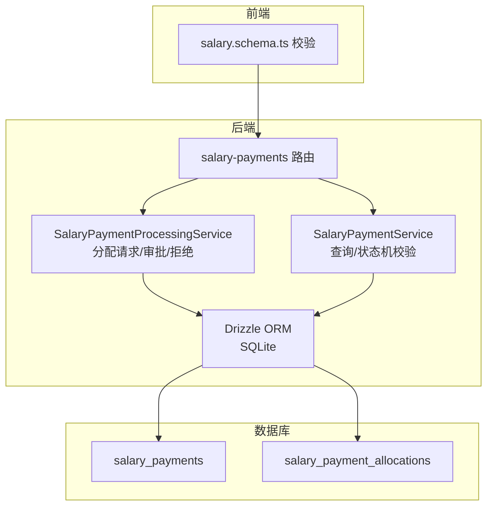
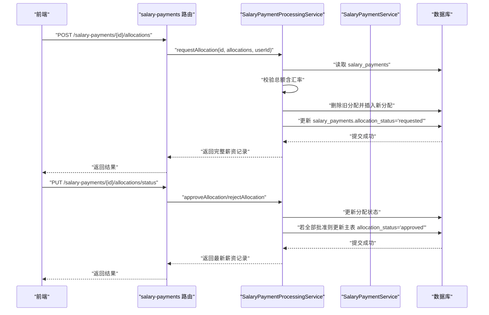
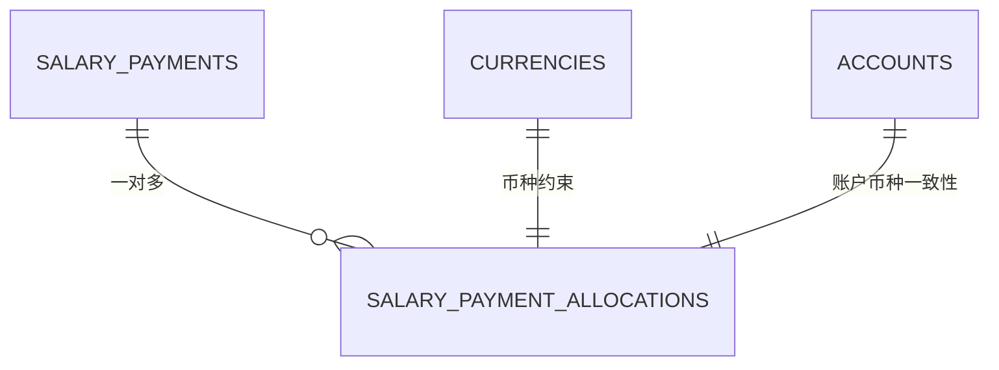
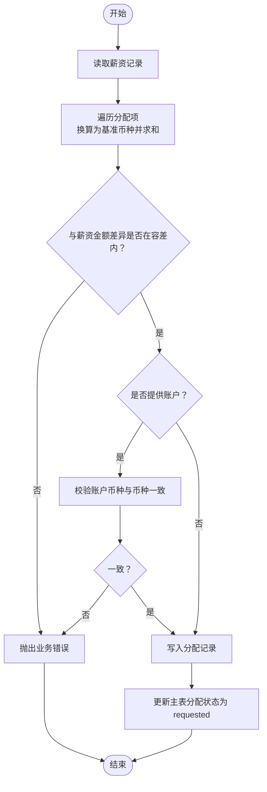
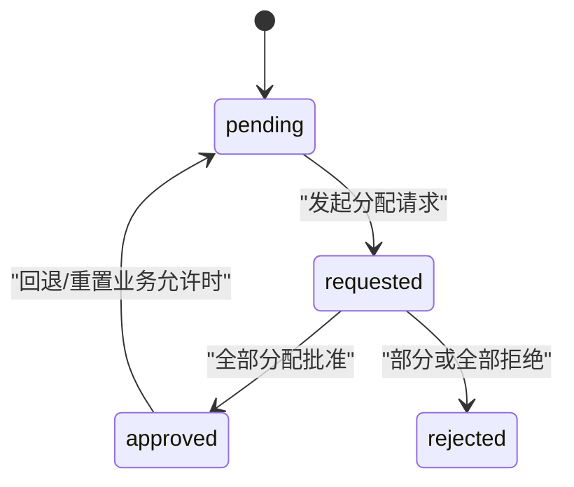
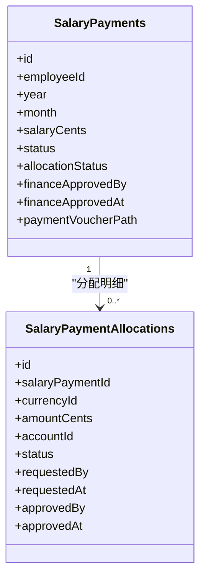
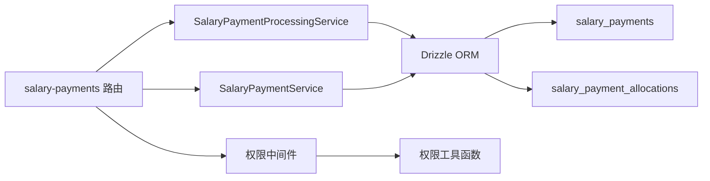

# 薪资发放分配

<cite>
**本文引用的文件**
- [schema.ts](file://backend/src/db/schema.ts)
- [schema.sql](file://backend/src/db/schema.sql)
- [salary-payments.ts](file://backend/src/routes/v2/salary-payments.ts)
- [SalaryPaymentProcessingService.ts](file://backend/src/services/SalaryPaymentProcessingService.ts)
- [SalaryPaymentService.ts](file://backend/src/services/SalaryPaymentService.ts)
- [salary.schema.ts](file://frontend/src/validations/salary.schema.ts)
- [permission.ts](file://backend/src/middleware/permission.ts)
- [permissions.ts](file://backend/src/utils/permissions.ts)
</cite>

## 目录
1. [简介](#简介)
2. [项目结构](#项目结构)
3. [核心组件](#核心组件)
4. [架构总览](#架构总览)
5. [详细组件分析](#详细组件分析)
6. [依赖关系分析](#依赖关系分析)
7. [性能考量](#性能考量)
8. [故障排查指南](#故障排查指南)
9. [结论](#结论)

## 简介
本文件面向“薪资发放分配”数据模型，围绕 salary_payment_allocations 表展开，系统性说明其结构、跨币种发放机制、审批状态流转、权限控制逻辑，以及与 salary_payments 主表的协作方式。目标是帮助读者理解如何通过单笔薪资记录按不同币种与账户进行拆分发放，并配合财务审批工作流完成合规与风控。

## 项目结构
- 后端数据库层：定义了 salary_payments 与 salary_payment_allocations 的表结构与索引约束。
- 后端服务层：SalaryPaymentProcessingService 负责分配请求、审批与拒绝；SalaryPaymentService 提供查询与状态机校验。
- 后端路由层：salary-payments 路由提供分配请求、审批/拒绝、批量审批等接口。
- 前端校验：对分配请求体进行基础校验。
- 权限控制：基于职位与部门模块的权限系统，保护敏感操作。

图表来源
- [salary-payments.ts](file://backend/src/routes/v2/salary-payments.ts#L379-L556)
- [SalaryPaymentProcessingService.ts](file://backend/src/services/SalaryPaymentProcessingService.ts#L179-L378)
- [SalaryPaymentService.ts](file://backend/src/services/SalaryPaymentService.ts#L40-L115)
- [schema.ts](file://backend/src/db/schema.ts#L286-L331)
- [schema.sql](file://backend/src/db/schema.sql#L274-L311)

章节来源
- [schema.ts](file://backend/src/db/schema.ts#L286-L331)
- [schema.sql](file://backend/src/db/schema.sql#L274-L311)
- [salary-payments.ts](file://backend/src/routes/v2/salary-payments.ts#L379-L556)

## 核心组件
- salary_payment_allocations 表：记录每笔薪资的多币种分配明细，支持按币种与账户拆分。
- salary_payments 表：主表，承载薪资周期、金额、整体状态与分配状态，以及财务审批关键字段。
- 路由与服务：提供分配请求、审批/拒绝、批量审批等能力，并在服务层执行业务规则与事务。
- 前端校验：对分配请求体进行基础校验，确保必填字段与数值范围合理。
- 权限控制：基于职位与部门模块的权限系统，保护敏感操作。

章节来源
- [schema.ts](file://backend/src/db/schema.ts#L286-L331)
- [schema.sql](file://backend/src/db/schema.sql#L274-L311)
- [salary-payments.ts](file://backend/src/routes/v2/salary-payments.ts#L379-L556)
- [SalaryPaymentProcessingService.ts](file://backend/src/services/SalaryPaymentProcessingService.ts#L179-L378)
- [SalaryPaymentService.ts](file://backend/src/services/SalaryPaymentService.ts#L40-L115)
- [salary.schema.ts](file://frontend/src/validations/salary.schema.ts#L1-L23)

## 架构总览
下图展示“分配请求—审批—状态联动”的端到端流程，包括路由、服务与数据库交互。

图表来源
- [salary-payments.ts](file://backend/src/routes/v2/salary-payments.ts#L379-L556)
- [SalaryPaymentProcessingService.ts](file://backend/src/services/SalaryPaymentProcessingService.ts#L179-L378)
- [SalaryPaymentService.ts](file://backend/src/services/SalaryPaymentService.ts#L173-L236)

## 详细组件分析

### 数据模型：salary_payment_allocations
- 字段说明
  - id：分配记录唯一标识
  - salaryPaymentId：所属薪资记录 ID，与 salary_payments.id 关联
  - currencyId：币种代码，与 currencies.code 对应
  - amountCents：以“分”为单位的金额
  - accountId：可选，指定收款账户 ID，需与币种一致
  - status：分配状态，支持 pending、approved、rejected
  - requestedBy/requestedAt：发起人与时间
  - approvedBy/approvedAt：审批人与时间
  - createdAt/updatedAt：记录创建与更新时间
- 关键约束
  - 多币种分配总额需与薪资金额保持一致（允许一定误差范围）
  - 若提供 accountId，账户币种必须与 currencyId 一致
  - 分配状态变更需遵循审批流程

图表来源
- [schema.ts](file://backend/src/db/schema.ts#L286-L331)
- [schema.sql](file://backend/src/db/schema.sql#L274-L311)

章节来源
- [schema.ts](file://backend/src/db/schema.ts#L286-L331)
- [schema.sql](file://backend/src/db/schema.sql#L274-L311)

### 跨币种发放机制
- 基准币种：系统以特定币种作为基准（例如 USDT），分配时将非基准币种金额按汇率换算为基准币种后再汇总核对。
- 总额校验：分配总金额（换算后）与薪资金额比较，允许一定百分比误差（例如 1%）。
- 汇率处理：若未提供汇率，当前实现会使用默认值；生产环境建议从系统配置或汇率服务获取。
- 账户币种一致性：若提供账户，账户币种必须与分配币种一致，否则拒绝。

图表来源
- [SalaryPaymentProcessingService.ts](file://backend/src/services/SalaryPaymentProcessingService.ts#L179-L289)

章节来源
- [SalaryPaymentProcessingService.ts](file://backend/src/services/SalaryPaymentProcessingService.ts#L179-L289)

### 审批状态与权限控制
- 分配状态
  - pending：初始状态，等待审批
  - approved：已批准
  - rejected：被拒绝
- 主表分配状态
  - pending：初始
  - requested：已发起分配请求
  - approved：所有分配已批准
- 财务审批前置条件
  - 在财务审批前，必须先批准分配（allocation_status 为 approved）
  - 若存在未批准的分配，财务审批将被阻止
- 权限控制
  - 路由层通过权限中间件保护敏感操作
  - 权限来源于职位的权限配置，结合部门模块访问范围与操作集合判断
  - 审批操作通常要求更高的权限等级或审批角色

图表来源
- [SalaryPaymentService.ts](file://backend/src/services/SalaryPaymentService.ts#L173-L236)
- [salary-payments.ts](file://backend/src/routes/v2/salary-payments.ts#L422-L556)
- [permission.ts](file://backend/src/middleware/permission.ts#L1-L43)
- [permissions.ts](file://backend/src/utils/permissions.ts#L99-L125)

章节来源
- [SalaryPaymentService.ts](file://backend/src/services/SalaryPaymentService.ts#L173-L236)
- [salary-payments.ts](file://backend/src/routes/v2/salary-payments.ts#L422-L556)
- [permission.ts](file://backend/src/middleware/permission.ts#L1-L43)
- [permissions.ts](file://backend/src/utils/permissions.ts#L99-L125)

### 与 salary_payments 主表的关联
- 主表字段要点
  - 年、月、员工、薪资金额、整体状态、分配状态、财务审批关键字段（批准人、时间、凭证等）
- 关联关系
  - salary_payment_allocations.salaryPaymentId → salary_payments.id
  - 查询薪资时，同时拉取其分配明细，便于前端展示与审计
- 状态联动
  - 分配请求 → 主表分配状态设为 requested
  - 全部分配批准 → 主表分配状态设为 approved
  - 财务审批前强制要求分配状态为 approved

图表来源
- [schema.ts](file://backend/src/db/schema.ts#L286-L331)
- [schema.sql](file://backend/src/db/schema.sql#L274-L311)
- [SalaryPaymentService.ts](file://backend/src/services/SalaryPaymentService.ts#L40-L115)

章节来源
- [schema.ts](file://backend/src/db/schema.ts#L286-L331)
- [schema.sql](file://backend/src/db/schema.sql#L274-L311)
- [SalaryPaymentService.ts](file://backend/src/services/SalaryPaymentService.ts#L40-L115)

### 前端校验与接口
- 前端对分配请求体进行基础校验，确保至少一种币种分配、币种选择有效、金额非负。
- 路由层提供：
  - 请求分配：POST /salary-payments/{id}/allocations
  - 更新分配状态：PUT /salary-payments/{id}/allocations/status
  - 批量批准/拒绝：POST /salary-payments/{id}/allocations/approve | /reject

章节来源
- [salary.schema.ts](file://frontend/src/validations/salary.schema.ts#L1-L23)
- [salary-payments.ts](file://backend/src/routes/v2/salary-payments.ts#L379-L556)

## 依赖关系分析
- 路由依赖服务：salary-payments 路由调用 SalaryPaymentProcessingService 与 SalaryPaymentService。
- 服务依赖数据库：通过 Drizzle ORM 访问 salary_payments 与 salary_payment_allocations。
- 业务规则依赖：分配请求与审批均受业务规则约束（总额校验、币种与账户一致性、状态机）。
- 权限依赖：权限中间件与权限工具函数共同决定操作是否允许。

图表来源
- [salary-payments.ts](file://backend/src/routes/v2/salary-payments.ts#L379-L556)
- [SalaryPaymentProcessingService.ts](file://backend/src/services/SalaryPaymentProcessingService.ts#L179-L378)
- [SalaryPaymentService.ts](file://backend/src/services/SalaryPaymentService.ts#L40-L115)
- [permission.ts](file://backend/src/middleware/permission.ts#L1-L43)
- [permissions.ts](file://backend/src/utils/permissions.ts#L99-L125)

章节来源
- [salary-payments.ts](file://backend/src/routes/v2/salary-payments.ts#L379-L556)
- [SalaryPaymentProcessingService.ts](file://backend/src/services/SalaryPaymentProcessingService.ts#L179-L378)
- [SalaryPaymentService.ts](file://backend/src/services/SalaryPaymentService.ts#L40-L115)
- [permission.ts](file://backend/src/middleware/permission.ts#L1-L43)
- [permissions.ts](file://backend/src/utils/permissions.ts#L99-L125)

## 性能考量
- 查询聚合：在查询薪资列表时，一次性拉取分配明细并按薪资 ID 聚合，避免 N+1 查询。
- 事务边界：分配请求与状态更新均在事务中执行，保证一致性。
- 索引与约束：salary_payments 与 salary_payment_allocations 均具备必要的索引与唯一约束，有助于查询与去重。
- 汇率计算：建议在服务层缓存常用汇率，减少重复查询与计算开销。

章节来源
- [SalaryPaymentService.ts](file://backend/src/services/SalaryPaymentService.ts#L40-L115)
- [SalaryPaymentProcessingService.ts](file://backend/src/services/SalaryPaymentProcessingService.ts#L179-L378)

## 故障排查指南
- 分配总额不匹配
  - 现象：请求分配时报错，提示换算后的分配总额与薪资金额差异超出容差。
  - 排查：确认各币种金额与汇率设置正确；检查是否存在重复或遗漏币种。
- 账户币种不匹配
  - 现象：提供账户但币种不一致导致拒绝。
  - 排查：确保 accountId 对应账户的币种与 currencyId 一致。
- 财务审批被阻塞
  - 现象：财务审批时报错，提示必须先批准货币分配。
  - 排查：确认所有分配状态均为 approved；若存在 pending 分配，需先批准。
- 权限不足
  - 现象：接口返回禁止访问。
  - 排查：确认当前用户职位是否具备相应模块与操作权限；检查部门模块访问范围。

章节来源
- [SalaryPaymentProcessingService.ts](file://backend/src/services/SalaryPaymentProcessingService.ts#L179-L378)
- [SalaryPaymentService.ts](file://backend/src/services/SalaryPaymentService.ts#L173-L236)
- [permissions.ts](file://backend/src/utils/permissions.ts#L99-L125)

## 结论
salary_payment_allocations 为“单笔薪资按币种与账户拆分发放”提供了清晰的数据载体。通过严格的总额校验、币种与账户一致性检查、以及与主表的状态联动，系统实现了灵活且可控的薪资支付策略。配合财务审批前置条件与权限控制，能够满足合规与风控要求。建议在生产环境中完善汇率来源与缓存策略，并持续优化权限配置与审计日志，以提升系统的稳定性与可维护性。