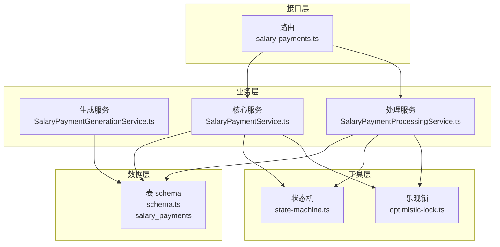
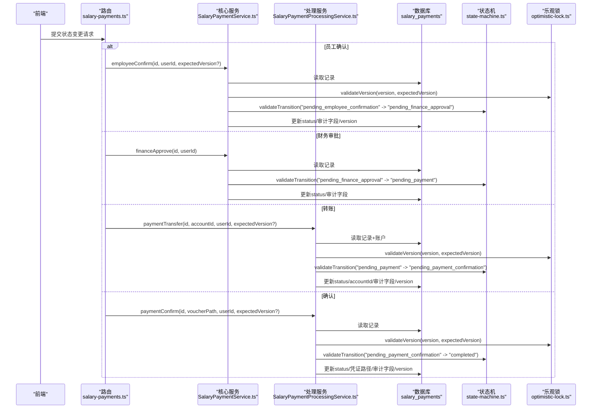
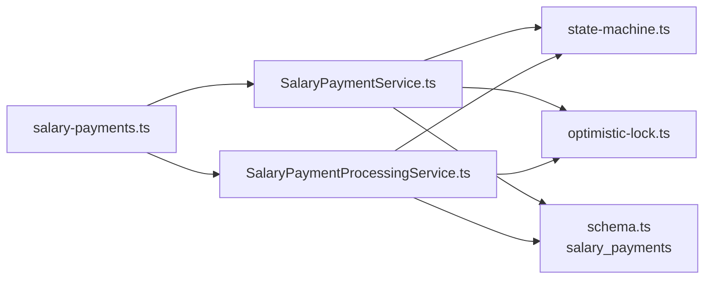

# 薪资发放记录

<cite>
**本文引用的文件**
- [schema.ts](file://backend/src/db/schema.ts)
- [state-machine.ts](file://backend/src/utils/state-machine.ts)
- [optimistic-lock.ts](file://backend/src/utils/optimistic-lock.ts)
- [SalaryPaymentService.ts](file://backend/src/services/SalaryPaymentService.ts)
- [SalaryPaymentProcessingService.ts](file://backend/src/services/SalaryPaymentProcessingService.ts)
- [SalaryPaymentGenerationService.ts](file://backend/src/services/SalaryPaymentGenerationService.ts)
- [salary-payments.ts](file://backend/src/routes/v2/salary-payments.ts)
- [SalaryPaymentService.test.ts](file://backend/test/services/SalaryPaymentService.test.ts)
- [optimistic-lock.test.ts](file://backend/test/utils/optimistic-lock.test.ts)
</cite>

## 目录
1. [简介](#简介)
2. [项目结构](#项目结构)
3. [核心组件](#核心组件)
4. [架构总览](#架构总览)
5. [详细组件分析](#详细组件分析)
6. [依赖关系分析](#依赖关系分析)
7. [性能考量](#性能考量)
8. [故障排查指南](#故障排查指南)
9. [结论](#结论)

## 简介
本文件聚焦“薪资发放记录”数据模型，围绕 salary_payments 表的结构与多状态机管理展开，系统性解析以下关键点：
- 字段语义：year、month、salaryCents、status（pending_employee_confirmation、pending_finance_approval、pending_payment、pending_payment_confirmation、completed）、allocationStatus（pending、requested、approved）。
- 状态流转：基于状态机定义的严格转换规则，以及回退策略。
- 并发控制：version 乐观锁在高并发场景下防止数据覆盖。
- 审计追踪：employeeConfirmedBy、financeApprovedBy、paymentTransferredBy 等审计字段贯穿全流程。
- 流程驱动：salary_payments 如何驱动 SalaryPaymentService 与 SalaryPaymentProcessingService 完成从生成、确认、审批到转账与确认的完整发放流程。

## 项目结构
与薪资发放记录直接相关的模块分布如下：
- 数据层：salary_payments 表定义位于数据库 schema 中，并通过唯一索引约束年月与员工维度。
- 业务层：
  - 生成服务：根据员工基础薪资、入职日期与当月请假情况计算应发金额并批量生成记录。
  - 核心服务：负责员工确认、财务审批、删除与回退等状态变更。
  - 处理服务：负责转账、确认、货币分配的请求与审批。
- 工具层：状态机与乐观锁工具，保障状态转换合法性与并发安全。
- 接口层：路由封装了对上述服务的对外接口，统一暴露状态变更动作。

图表来源
- [salary-payments.ts](file://backend/src/routes/v2/salary-payments.ts#L1-L604)
- [SalaryPaymentService.ts](file://backend/src/services/SalaryPaymentService.ts#L1-L326)
- [SalaryPaymentProcessingService.ts](file://backend/src/services/SalaryPaymentProcessingService.ts#L1-L378)
- [SalaryPaymentGenerationService.ts](file://backend/src/services/SalaryPaymentGenerationService.ts#L1-L278)
- [state-machine.ts](file://backend/src/utils/state-machine.ts#L1-L89)
- [optimistic-lock.ts](file://backend/src/utils/optimistic-lock.ts#L1-L41)
- [schema.ts](file://backend/src/db/schema.ts#L286-L316)

章节来源
- [salary-payments.ts](file://backend/src/routes/v2/salary-payments.ts#L1-L604)
- [SalaryPaymentService.ts](file://backend/src/services/SalaryPaymentService.ts#L1-L326)
- [SalaryPaymentProcessingService.ts](file://backend/src/services/SalaryPaymentProcessingService.ts#L1-L378)
- [SalaryPaymentGenerationService.ts](file://backend/src/services/SalaryPaymentGenerationService.ts#L1-L278)
- [state-machine.ts](file://backend/src/utils/state-machine.ts#L1-L89)
- [optimistic-lock.ts](file://backend/src/utils/optimistic-lock.ts#L1-L41)
- [schema.ts](file://backend/src/db/schema.ts#L286-L316)

## 核心组件
- salary_payments 表
  - 关键字段：year、month、salaryCents、status、allocationStatus、version、以及多处审计字段（employeeConfirmedBy/At、financeApprovedBy/At、paymentTransferredBy/At、paymentConfirmedBy/At、rollbackBy/At/Reason 等）。
  - 唯一索引：按 employeeId、year、month 唯一，确保单人单月仅有一条薪资记录。
- 状态机
  - 定义了从“待员工确认”到“待财务审批”、“待付款”、“待付款确认”再到“已完成”的严格顺序，且“已完成”为终态。
- 乐观锁
  - 通过 version 字段与 validateVersion/incrementVersion 实现并发控制，避免覆盖。
- 服务编排
  - 生成：根据员工薪资与考勤计算应发金额并创建记录。
  - 核心：员工确认、财务审批、删除、回退。
  - 处理：转账、确认、货币分配请求与审批。

章节来源
- [schema.ts](file://backend/src/db/schema.ts#L286-L316)
- [state-machine.ts](file://backend/src/utils/state-machine.ts#L44-L55)
- [optimistic-lock.ts](file://backend/src/utils/optimistic-lock.ts#L1-L41)
- [SalaryPaymentService.ts](file://backend/src/services/SalaryPaymentService.ts#L117-L324)
- [SalaryPaymentProcessingService.ts](file://backend/src/services/SalaryPaymentProcessingService.ts#L30-L177)
- [SalaryPaymentGenerationService.ts](file://backend/src/services/SalaryPaymentGenerationService.ts#L21-L209)

## 架构总览
薪资发放流程由“生成—确认—审批—转账—确认—完成”构成，各阶段通过状态机校验与乐观锁保障一致性；路由层将前端请求映射到具体服务方法，服务内部再与数据库交互并记录操作历史。

图表来源
- [salary-payments.ts](file://backend/src/routes/v2/salary-payments.ts#L140-L377)
- [SalaryPaymentService.ts](file://backend/src/services/SalaryPaymentService.ts#L117-L324)
- [SalaryPaymentProcessingService.ts](file://backend/src/services/SalaryPaymentProcessingService.ts#L30-L177)
- [state-machine.ts](file://backend/src/utils/state-machine.ts#L44-L55)
- [optimistic-lock.ts](file://backend/src/utils/optimistic-lock.ts#L16-L41)

## 详细组件分析

### 数据模型：salary_payments
- 结构要点
  - 主键：id
  - 关联：employeeId（外键到 employees）
  - 标识：year、month、employeeId 唯一索引，保证单人单月一条记录
  - 金额：salaryCents（单位为“分”，便于精确计算）
  - 状态：status（枚举值见下节）
  - 分配：allocationStatus（pending/requested/approved）
  - 审计：employeeConfirmedBy/At、financeApprovedBy/At、paymentTransferredBy/At、paymentConfirmedBy/At、rollbackBy/At/Reason
  - 并发：version（乐观锁）
  - 时间戳：createdAt、updatedAt
- 字段与业务含义
  - year、month：记录所属会计周期，用于唯一性与报表统计。
  - salaryCents：应发金额（分），由生成服务按工作日与请假天数计算得出。
  - status：薪资发放生命周期中的关键状态，驱动后续审批与处理。
  - allocationStatus：货币分配的生命周期状态，影响财务审批前置条件。
  - 审计字段：记录各环节操作人与时间，形成可追溯的审计链路。
  - version：乐观锁版本号，保障高并发下的数据一致性。

章节来源
- [schema.ts](file://backend/src/db/schema.ts#L286-L316)

### 状态机：salaryPaymentStateMachine
- 状态集合与合法转换
  - pending_employee_confirmation → pending_finance_approval
  - pending_finance_approval → pending_payment
  - pending_payment → pending_payment_confirmation
  - pending_payment_confirmation → completed
  - completed 为终态，不可再转换
- 路由与服务中的应用
  - 路由层在不同状态变更时调用对应服务方法。
  - 服务层在执行状态变更前调用状态机进行合法性校验。
- 回退机制
  - 支持从“待财务审批”、“待付款”、“待付款确认”回退到上一状态，但不允许从“已完成”回退。

章节来源
- [state-machine.ts](file://backend/src/utils/state-machine.ts#L44-L55)
- [SalaryPaymentService.ts](file://backend/src/services/SalaryPaymentService.ts#L262-L324)
- [SalaryPaymentProcessingService.ts](file://backend/src/services/SalaryPaymentProcessingService.ts#L118-L177)

### 并发控制：version 乐观锁
- 设计原理
  - 读取记录时携带当前 version。
  - 更新前通过 validateVersion 校验期望版本与当前版本一致。
  - 成功更新后通过 incrementVersion 递增 version。
- 作用
  - 在高并发场景下，防止多个用户同时修改同一记录导致的数据覆盖。
  - 对于未显式传入 expectedVersion 的调用，保持向后兼容（空版本号跳过校验）。
- 测试验证
  - 单测覆盖了版本号匹配与不匹配的更新行为，以及空版本号的兼容性。

章节来源
- [optimistic-lock.ts](file://backend/src/utils/optimistic-lock.ts#L16-L41)
- [SalaryPaymentService.ts](file://backend/src/services/SalaryPaymentService.ts#L117-L171)
- [SalaryPaymentProcessingService.ts](file://backend/src/services/SalaryPaymentProcessingService.ts#L30-L96)
- [optimistic-lock.test.ts](file://backend/test/utils/optimistic-lock.test.ts#L1-L47)

### 审计字段：全流程追踪
- 字段清单
  - 员工确认：employeeConfirmedBy、employeeConfirmedAt
  - 财务审批：financeApprovedBy、financeApprovedAt
  - 转账：paymentTransferredBy、paymentTransferredAt
  - 确认：paymentConfirmedBy、paymentConfirmedAt
  - 回退：rollbackBy、rollbackAt、rollbackReason
- 价值
  - 明确责任主体与时间点，便于审计与问题定位。
  - 与业务流程强绑定，确保每一步变更都有据可查。

章节来源
- [schema.ts](file://backend/src/db/schema.ts#L286-L316)
- [SalaryPaymentService.ts](file://backend/src/services/SalaryPaymentService.ts#L117-L324)
- [SalaryPaymentProcessingService.ts](file://backend/src/services/SalaryPaymentProcessingService.ts#L30-L177)

### 生成流程：SalaryPaymentGenerationService
- 输入
  - 年、月；员工列表（在职且入职日期满足条件）；员工薪资与请假记录。
- 计算
  - 工作日：当月总天数减去入职当月的剩余工作日；扣除与当月重叠的请假天数。
  - 实际薪资：按比例折算（含 USDT 优先策略）。
- 输出
  - 为每位符合条件的员工插入一条 salary_payments 记录，初始状态为“待员工确认”，allocationStatus 为“none”。

章节来源
- [SalaryPaymentGenerationService.ts](file://backend/src/services/SalaryPaymentGenerationService.ts#L21-L209)

### 核心服务：SalaryPaymentService
- 员工确认
  - 校验状态机：从“待员工确认”到“待财务审批”。
  - 设置审计字段与 version 递增。
- 财务审批
  - 校验状态机：从“待财务审批”到“待付款”。
  - 校验分配状态：若为“已请求”，需先批准货币分配；若为“已批准”，需确保所有分配均已批准。
- 删除
  - 仅允许在“待员工确认”或“待财务审批”状态下删除。
- 回退
  - 仅允许从“待财务审批”、“待付款”、“待付款确认”回退，目标状态为上一状态。

章节来源
- [SalaryPaymentService.ts](file://backend/src/services/SalaryPaymentService.ts#L117-L324)

### 处理服务：SalaryPaymentProcessingService
- 转账
  - 校验账户有效性与启用状态。
  - 校验状态机：从“待付款”到“待付款确认”。
  - 设置 accountId、审计字段与 version 递增。
- 确认
  - 校验状态机：从“待付款确认”到“已完成”。
  - 设置凭证路径、审计字段与 version 递增。
- 货币分配
  - 请求分配：校验多币种总额（允许 1% 误差），写入 salary_payment_allocations 并更新 allocationStatus 为“requested”。
  - 批量批准/拒绝：支持 approve_all 或指定分配 ID，完成后若无“待批准”项则将 allocationStatus 更新为“approved”或“rejected”。

章节来源
- [SalaryPaymentProcessingService.ts](file://backend/src/services/SalaryPaymentProcessingService.ts#L30-L378)

### 路由层：salary-payments.ts
- 列表、详情、生成、状态变更、转账、确认、分配请求与审批、删除等接口均在路由中定义。
- 路由根据请求体中的 status 字段分派到相应服务方法，确保前后端交互与业务流程一一对应。

章节来源
- [salary-payments.ts](file://backend/src/routes/v2/salary-payments.ts#L1-L604)

## 依赖关系分析
- 组件耦合
  - 路由依赖服务；服务依赖状态机与乐观锁工具；服务与数据库交互。
- 关键依赖链
  - 路由 → 核心服务/处理服务 → 数据库
  - 核心服务/处理服务 → 状态机 → 业务规则
  - 核心服务/处理服务 → 乐观锁 → 并发安全
- 外部依赖
  - Drizzle ORM（数据库访问）
  - UUID（分配记录 ID）

图表来源
- [salary-payments.ts](file://backend/src/routes/v2/salary-payments.ts#L1-L604)
- [SalaryPaymentService.ts](file://backend/src/services/SalaryPaymentService.ts#L1-L326)
- [SalaryPaymentProcessingService.ts](file://backend/src/services/SalaryPaymentProcessingService.ts#L1-L378)
- [state-machine.ts](file://backend/src/utils/state-machine.ts#L1-L89)
- [optimistic-lock.ts](file://backend/src/utils/optimistic-lock.ts#L1-L41)
- [schema.ts](file://backend/src/db/schema.ts#L286-L316)

## 性能考量
- 查询优化
  - 列表查询通过 QueryBuilder 与左连接员工与部门信息，减少 N+1 查询风险。
- 并发优化
  - 乐观锁避免不必要的重试与死锁；建议前端在提交时携带 expectedVersion，提升成功率。
- 批量处理
  - 生成服务采用事务内批量处理，降低锁竞争与 IO 开销。
- 索引与唯一性
  - salary_payments 的唯一索引可显著降低重复生成与查询成本。

章节来源
- [SalaryPaymentService.ts](file://backend/src/services/SalaryPaymentService.ts#L28-L84)
- [SalaryPaymentGenerationService.ts](file://backend/src/services/SalaryPaymentGenerationService.ts#L21-L209)
- [schema.ts](file://backend/src/db/schema.ts#L313-L316)

## 故障排查指南
- 状态转换被拒绝
  - 检查当前状态是否符合状态机定义；若不符合，需先完成前置步骤（如先“员工确认”再“财务审批”）。
- 并发更新失败
  - 若提示“数据已被其他用户修改”，请刷新页面重新获取最新 version 后重试。
- 分配校验失败
  - 多币种分配总额与应发金额差异超过 1%，请核对分配明细与汇率设置。
- 账户无效或停用
  - 转账前需确保账户存在且处于启用状态。
- 删除限制
  - 仅“待员工确认”或“待财务审批”状态可删除，其他状态需先回退或完成流程。

章节来源
- [state-machine.ts](file://backend/src/utils/state-machine.ts#L16-L42)
- [optimistic-lock.ts](file://backend/src/utils/optimistic-lock.ts#L16-L41)
- [SalaryPaymentProcessingService.ts](file://backend/src/services/SalaryPaymentProcessingService.ts#L30-L96)
- [SalaryPaymentService.ts](file://backend/src/services/SalaryPaymentService.ts#L238-L261)
- [SalaryPaymentGenerationService.ts](file://backend/src/services/SalaryPaymentGenerationService.ts#L188-L207)

## 结论
salary_payments 表通过严谨的字段设计、状态机约束与乐观锁机制，构建了高可靠、可追溯的薪资发放数据模型。配合生成、核心与处理三类服务，实现了从“生成—确认—审批—转账—确认—完成”的闭环流程。审计字段与唯一索引进一步强化了数据完整性与可审计性。建议在前端交互中始终携带 expectedVersion，以获得最佳并发体验；在分配环节严格控制多币种总额误差，确保财务合规。