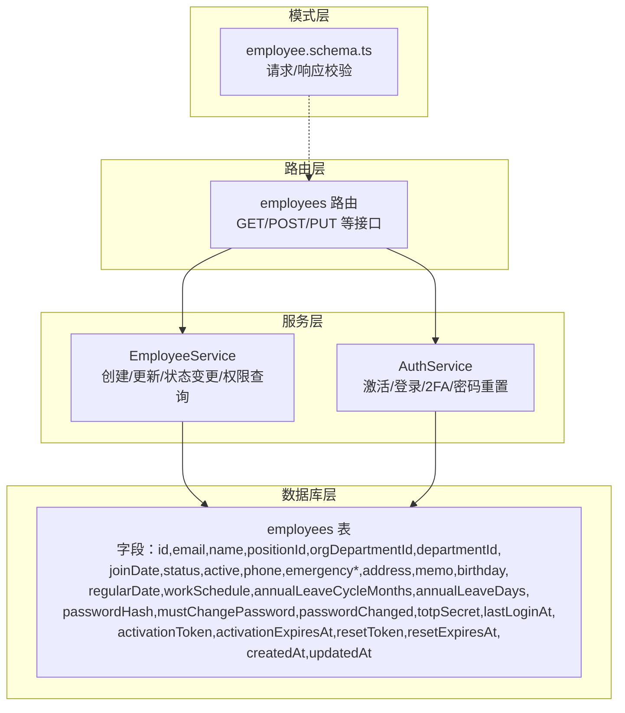
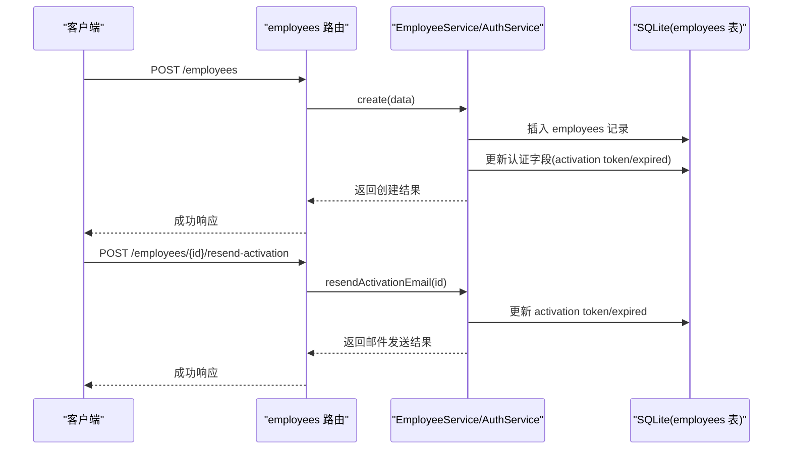
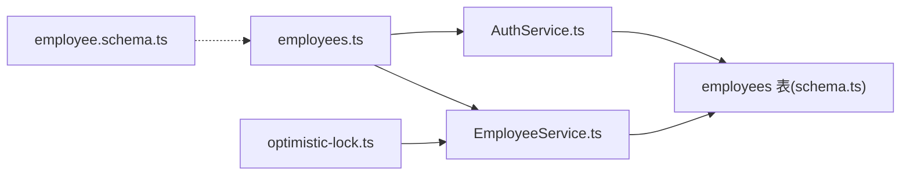

# 员工数据模型

<cite>
**本文引用的文件**
- [schema.ts](file://backend/src/db/schema.ts)
- [schema.sql](file://backend/src/db/schema.sql)
- [employees.ts](file://backend/src/routes/v2/employees.ts)
- [EmployeeService.ts](file://backend/src/services/EmployeeService.ts)
- [employee.schema.ts](file://backend/src/schemas/employee.schema.ts)
- [optimistic-lock.ts](file://backend/src/utils/optimistic-lock.ts)
- [AuthService.ts](file://backend/src/services/AuthService.ts)
- [employees.test.ts](file://backend/test/employees.test.ts)
</cite>

## 目录
1. [简介](#简介)
2. [项目结构](#项目结构)
3. [核心组件](#核心组件)
4. [架构总览](#架构总览)
5. [详细组件分析](#详细组件分析)
6. [依赖关系分析](#依赖关系分析)
7. [性能考量](#性能考量)
8. [故障排查指南](#故障排查指南)
9. [结论](#结论)

## 简介
本文件面向后端与前端开发者，系统化梳理员工数据模型（employees 表）的结构、字段语义、约束与业务含义，并结合 Drizzle ORM 的使用方式，说明认证信息从独立 users 表合并至 employees 的设计决策与影响。同时，重点解释乐观锁版本号（version 字段）在并发控制中的作用与最佳实践。

## 项目结构
- 数据模型定义位于数据库层，采用 Drizzle ORM 的 SQLite 方案，核心表为 employees。
- 路由层提供员工 CRUD、状态变更、激活与重置密码等接口。
- 服务层封装业务逻辑，包括员工创建、状态管理、权限与组织架构关联查询。
- 模式层（Zod）定义请求/响应校验规则。
- 工具层提供乐观锁校验与版本号递增工具。

图表来源
- [schema.ts](file://backend/src/db/schema.ts#L14-L48)
- [employees.ts](file://backend/src/routes/v2/employees.ts#L1-L120)
- [EmployeeService.ts](file://backend/src/services/EmployeeService.ts#L1-L120)
- [AuthService.ts](file://backend/src/services/AuthService.ts#L346-L436)
- [employee.schema.ts](file://backend/src/schemas/employee.schema.ts#L1-L118)

章节来源
- [schema.ts](file://backend/src/db/schema.ts#L14-L48)
- [schema.sql](file://backend/src/db/schema.sql#L6-L48)
- [employees.ts](file://backend/src/routes/v2/employees.ts#L1-L120)
- [EmployeeService.ts](file://backend/src/services/EmployeeService.ts#L1-L120)
- [employee.schema.ts](file://backend/src/schemas/employee.schema.ts#L1-L118)

## 核心组件
- employees 表：承载员工身份信息、组织架构、雇佣状态、薪资与福利、认证信息与系统元数据。
- Drizzle ORM 定义：使用 sqliteTable 定义各字段类型与约束。
- 路由与服务：提供员工生命周期管理与认证相关操作。
- 模式校验：确保请求参数与响应结构符合预期。
- 乐观锁工具：提供版本号校验与递增能力。

章节来源
- [schema.ts](file://backend/src/db/schema.ts#L14-L48)
- [employees.ts](file://backend/src/routes/v2/employees.ts#L120-L220)
- [EmployeeService.ts](file://backend/src/services/EmployeeService.ts#L120-L220)
- [employee.schema.ts](file://backend/src/schemas/employee.schema.ts#L1-L118)
- [optimistic-lock.ts](file://backend/src/utils/optimistic-lock.ts#L1-L41)

## 架构总览
员工数据模型贯穿“路由 -> 服务 -> 数据库”的调用链路，认证与状态变更通过 AuthService 与 EmployeeService 协作完成；Drizzle ORM 将 TS 类型映射为 SQLite 表结构，保证类型安全与约束一致性。

图表来源
- [employees.ts](file://backend/src/routes/v2/employees.ts#L155-L220)
- [EmployeeService.ts](file://backend/src/services/EmployeeService.ts#L138-L205)
- [AuthService.ts](file://backend/src/services/AuthService.ts#L346-L436)

## 详细组件分析

### employees 表字段详解
以下字段均来自 Drizzle ORM 定义与 SQL 建表脚本，涵盖身份信息、组织架构、雇佣状态、薪资与福利、认证信息与系统元数据。

- 身份信息
  - id: 主键，文本类型，唯一标识员工。
  - email: 文本类型，非空且唯一，公司邮箱（@cloudflarets.com），用于登录与系统识别。
  - name: 文本类型，员工姓名。
  - phone: 文本类型，手机号码。
  - personalEmail: 文本类型，员工真实邮箱，用于接收转发邮件与激活/重置邮件。
  - birthday: 文本类型，生日日期字符串。
  - address: 文本类型，地址。
  - emergencyContact/emergencyPhone: 紧急联系人与电话。
  - usdtAddress: 文本类型，USDT 收款地址（如适用）。
  - memo: 文本类型，备注信息。
  - workSchedule: 文本类型，工作排班（JSON 字符串或结构化存储）。

- 组织架构
  - positionId: 文本类型，职位 ID，关联 positions 表。
  - orgDepartmentId: 文本类型，组织部门 ID，关联 org_departments 表。
  - departmentId: 文本类型，部门 ID，关联 departments 表。

- 雇佣状态
  - joinDate: 文本类型，入职日期。
  - status: 文本类型，员工状态（如 probation、regular、resigned）。
  - active: 整数类型，默认 1，启用/停用标志。
  - regularDate: 文本类型，转正日期。

- 薪资与福利
  - annualLeaveCycleMonths: 整数类型，年假周期（月）。
  - annualLeaveDays: 整数类型，年假天数。

- 认证信息
  - passwordHash: 文本类型，密码哈希值（bcrypt）。
  - mustChangePassword: 整数类型，默认 0，是否强制首次登录修改密码。
  - passwordChanged: 整数类型，默认 0，是否已修改过密码。
  - totpSecret: 文本类型，TOTP 秘钥（2FA）。
  - lastLoginAt: 整数类型，最后登录时间戳。
  - activationToken/activationExpiresAt: 文本类型与整数类型，激活令牌与过期时间，用于首次激活。
  - resetToken/resetExpiresAt: 文本类型与整数类型，密码重置令牌与过期时间。

- 系统元数据
  - createdAt/updatedAt: 整数类型，创建与更新时间戳。
  - version: 整数类型，乐观锁版本号（部分表存在，employees 未显式声明，但可按需扩展）。

章节来源
- [schema.ts](file://backend/src/db/schema.ts#L14-L48)
- [schema.sql](file://backend/src/db/schema.sql#L6-L48)
- [EmployeeService.ts](file://backend/src/services/EmployeeService.ts#L138-L205)
- [AuthService.ts](file://backend/src/services/AuthService.ts#L346-L436)

### 设计决策：认证字段从 users 表合并至 employees
- 合并背景
  - 历史：users 表曾独立存放认证相关字段。
  - 现状：根据注释，users 表已合并至 employees 表，认证字段全部迁移到 employees。
- 影响与收益
  - 简化用户模型：员工即用户，避免跨表关联与维护成本。
  - 降低复杂度：登录、激活、2FA、密码重置等流程直接基于 employees。
  - 便于权限与组织架构统一管理：员工的职位、部门、组织部门与认证状态在同一表内。

章节来源
- [schema.ts](file://backend/src/db/schema.ts#L11-L13)
- [EmployeeService.ts](file://backend/src/services/EmployeeService.ts#L138-L205)
- [AuthService.ts](file://backend/src/services/AuthService.ts#L346-L436)

### Drizzle ORM 定义与使用要点
- 定义位置：backend/src/db/schema.ts 中使用 sqliteTable 定义 employees 表。
- 类型与约束：
  - text：适用于字符串字段（如 id、email、name、positionId 等）。
  - integer：适用于整数字段（如 active、annualLeaveCycleMonths、annualLeaveDays、createdAt/updatedAt 等）。
  - unique：email 字段具有唯一约束。
  - notNull：email 字段为非空。
- 使用方式：
  - 路由层通过导入 employees 表定义进行查询与更新。
  - 服务层通过 Drizzle API 执行插入、更新、条件查询与连接查询。
  - 模式层通过 Zod 校验请求体与响应体。

章节来源
- [schema.ts](file://backend/src/db/schema.ts#L14-L48)
- [employees.ts](file://backend/src/routes/v2/employees.ts#L1-L60)
- [EmployeeService.ts](file://backend/src/services/EmployeeService.ts#L1-L40)
- [employee.schema.ts](file://backend/src/schemas/employee.schema.ts#L1-L118)

### 乐观锁版本号（version 字段）在并发控制中的作用
- 适用范围：部分表（如 accounts、employee_leaves、salary_payments 等）已内置 version 字段用于乐观锁。
- employees 表现状：当前 schema.ts 未显式声明 version 字段；如需启用乐观锁，可在迁移中添加 version 字段并配合工具函数进行校验与递增。
- 工具函数：
  - validateVersion(currentVersion, expectedVersion)：若当前版本与期望版本不一致则抛出并发冲突错误。
  - incrementVersion(version)：递增版本号，用于更新成功后提交新版本。
- 最佳实践：
  - 在更新 employees 记录时，若引入 version 字段，应在读取数据时携带 version，更新时校验并递增。
  - 对于高并发场景（批量修改、状态切换），建议在服务层统一使用乐观锁工具，避免脏写。

章节来源
- [schema.ts](file://backend/src/db/schema.ts#L14-L48)
- [optimistic-lock.ts](file://backend/src/utils/optimistic-lock.ts#L1-L41)
- [EmployeeService.ts](file://backend/src/services/EmployeeService.ts#L405-L483)

### 典型业务流程与字段映射
- 员工创建
  - 路由：POST /employees
  - 服务：生成公司邮箱、设置激活令牌、写入认证字段、建立部门关联
  - 字段映射：name、personalEmail、orgDepartmentId、departmentId、positionId、joinDate、workSchedule、annualLeaveCycleMonths、annualLeaveDays、status、active、createdAt、updatedAt
- 激活账户
  - 路由：POST /employees/{id}/resend-activation
  - 服务：生成新的激活令牌与过期时间
  - 字段映射：activationToken、activationExpiresAt、updatedAt
- 状态变更
  - 路由：POST /employees/{id}/regularize、/employees/{id}/leave、/employees/{id}/rejoin
  - 服务：更新 status、active、memo、regularDate 等
  - 字段映射：status、active、memo、regularDate、joinDate
- 认证与登录
  - 服务：激活时设置 passwordHash、passwordChanged、mustChangePassword、totpSecret；登录时校验密码与 2FA
  - 字段映射：passwordHash、mustChangePassword、passwordChanged、totpSecret、lastLoginAt

章节来源
- [employees.ts](file://backend/src/routes/v2/employees.ts#L155-L220)
- [EmployeeService.ts](file://backend/src/services/EmployeeService.ts#L138-L205)
- [AuthService.ts](file://backend/src/services/AuthService.ts#L346-L436)

## 依赖关系分析
- 路由依赖服务：employees 路由导入 EmployeeService 与 AuthService，负责权限校验与业务处理。
- 服务依赖数据库：EmployeeService 与 AuthService 通过 Drizzle 访问 employees 表及关联表。
- 模式依赖路由：employee.schema.ts 的 Zod 模式用于路由层请求/响应校验。
- 工具依赖服务：optimistic-lock.ts 的工具函数被服务层用于并发控制。

图表来源
- [employees.ts](file://backend/src/routes/v2/employees.ts#L1-L120)
- [EmployeeService.ts](file://backend/src/services/EmployeeService.ts#L1-L120)
- [AuthService.ts](file://backend/src/services/AuthService.ts#L346-L436)
- [schema.ts](file://backend/src/db/schema.ts#L14-L48)
- [employee.schema.ts](file://backend/src/schemas/employee.schema.ts#L1-L118)
- [optimistic-lock.ts](file://backend/src/utils/optimistic-lock.ts#L1-L41)

## 性能考量
- 索引与查询
  - 建表脚本中包含针对 employees 的索引（如 department_id、org_department_id、active），有助于筛选与排序。
  - 建议在高频查询字段上保持索引策略，避免全表扫描。
- 字段类型选择
  - 时间戳统一使用整数类型存储，便于排序与计算。
  - JSON 结构（如 workSchedule）建议以字符串存储，避免复杂嵌套查询。
- 并发控制
  - 对关键字段（如 status、active、annualLeaveCycleMonths、annualLeaveDays）的更新建议采用乐观锁，减少锁竞争。

章节来源
- [schema.sql](file://backend/src/db/schema.sql#L313-L330)
- [EmployeeService.ts](file://backend/src/services/EmployeeService.ts#L405-L483)

## 故障排查指南
- 常见问题
  - 员工创建失败：检查 personalEmail 是否重复；确认组织部门与职位存在；确认必填字段（name、personalEmail、orgDepartmentId、positionId、joinDate）已提供。
  - 激活邮件发送失败：确认 Cloudflare 邮件路由已验证；检查 resend-activation 接口返回的错误信息。
  - 登录失败：核对密码哈希与 2FA 设置；检查 lastLoginAt 是否更新。
  - 并发冲突：若启用乐观锁，收到“数据已被其他用户修改，请刷新后重试”提示，需重新拉取最新数据并重试。
- 定位手段
  - 查看路由层日志与审计日志。
  - 使用服务层的查询方法定位具体字段值。
  - 在测试环境中复现问题，参考测试用例的断言与数据准备。

章节来源
- [employees.ts](file://backend/src/routes/v2/employees.ts#L243-L288)
- [EmployeeService.ts](file://backend/src/services/EmployeeService.ts#L257-L305)
- [AuthService.ts](file://backend/src/services/AuthService.ts#L346-L436)
- [optimistic-lock.ts](file://backend/src/utils/optimistic-lock.ts#L1-L41)
- [employees.test.ts](file://backend/test/employees.test.ts#L140-L215)

## 结论
employees 表是员工数据的核心载体，承载了身份、组织、状态、薪资与认证等全量信息。认证字段从 users 合并至 employees，简化了用户模型与权限体系。通过 Drizzle ORM 的类型约束与路由/服务层协作，能够稳定地支撑员工生命周期管理与认证流程。对于高并发场景，建议在关键字段更新中引入乐观锁，提升数据一致性与用户体验。