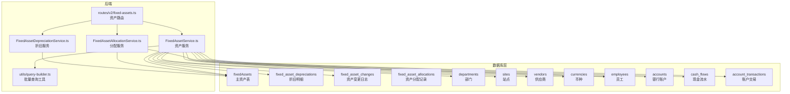
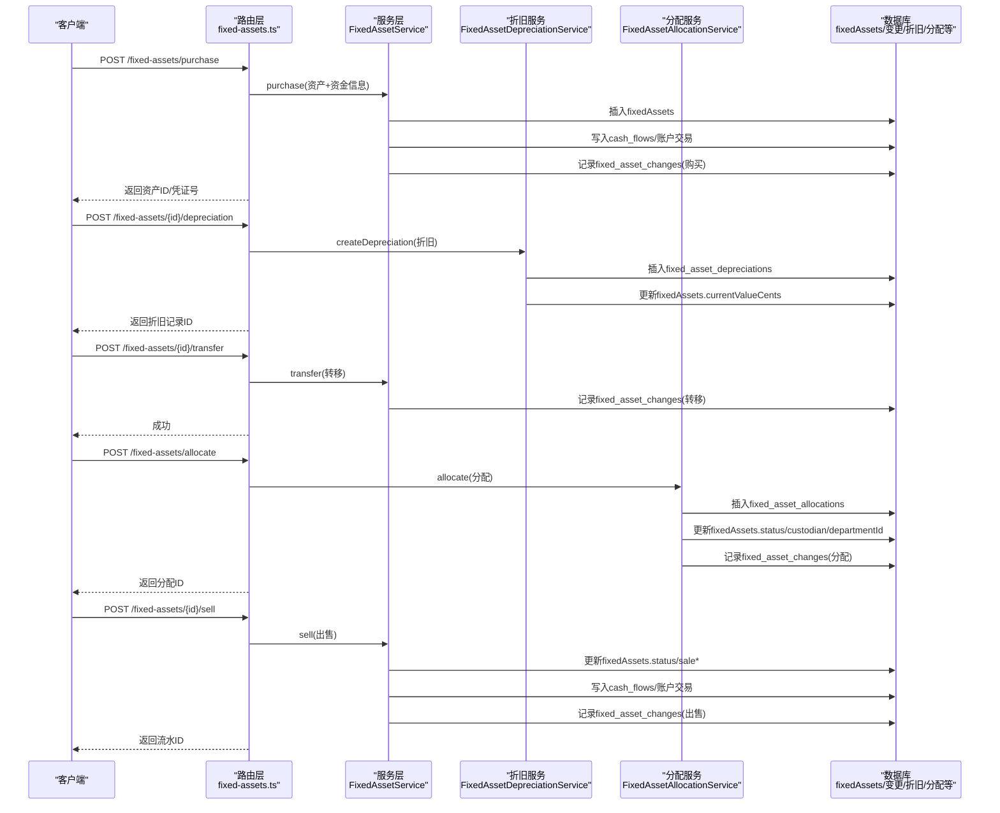
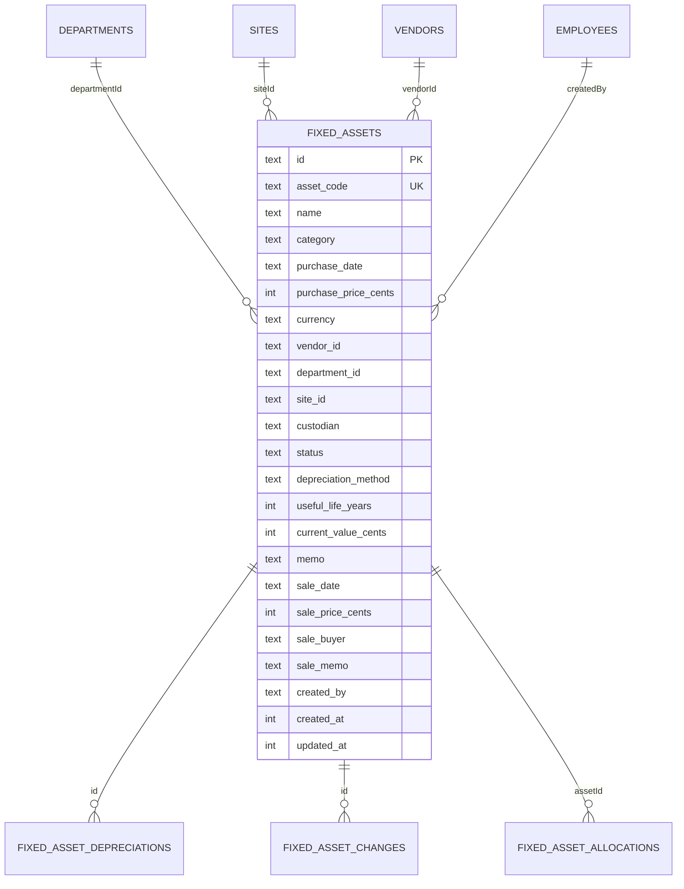
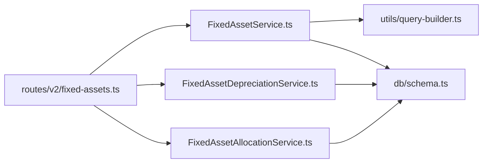

# 主资产表 (fixedAssets)

<cite>
**本文引用的文件列表**
- [schema.ts](file://backend/src/db/schema.ts)
- [fixed-assets.ts](file://backend/src/routes/v2/fixed-assets.ts)
- [FixedAssetService.ts](file://backend/src/services/FixedAssetService.ts)
- [FixedAssetDepreciationService.ts](file://backend/src/services/FixedAssetDepreciationService.ts)
- [FixedAssetAllocationService.ts](file://backend/src/services/FixedAssetAllocationService.ts)
- [business.schema.ts](file://backend/src/schemas/business.schema.ts)
- [fixedAsset.schema.ts](file://frontend/src/validations/fixedAsset.schema.ts)
- [query-builder.ts](file://backend/src/utils/query-builder.ts)
- [drizzle.config.ts](file://backend/drizzle.config.ts)
</cite>

## 目录
1. [简介](#简介)
2. [项目结构与定位](#项目结构与定位)
3. [核心组件总览](#核心组件总览)
4. [架构概览](#架构概览)
5. [详细组件分析](#详细组件分析)
6. [依赖关系分析](#依赖关系分析)
7. [性能与约束](#性能与约束)
8. [故障排查指南](#故障排查指南)
9. [结论](#结论)

## 简介
本文件系统性梳理“主资产表”（fixedAssets）的结构、业务语义、约束与Drizzle ORM映射方式，并阐明其在固定资产全生命周期管理中的核心地位。围绕资产编码、名称、采购信息、状态、折旧参数、处置信息以及使用部门、地点、保管人等关键字段，给出字段含义、数据类型、约束条件与典型流程（创建、采购入账、折旧、转移、分配/归还、出售）。同时提供Drizzle ORM定义参考路径与与其他关联表的外键关系说明，帮助开发者与产品/财务人员准确理解与使用。

## 项目结构与定位
- fixedAssets 表位于数据库层 schema 定义中，由 Drizzle ORM 维护。
- 路由层提供资产的增删改查、采购入账、折旧、转移、分配/归还、出售等接口。
- 服务层封装业务逻辑，负责校验、事务、跨表联动与审计日志。
- 前端通过 Zod Schema 校验请求体，确保入参符合后端约束。

图表来源
- [schema.ts](file://backend/src/db/schema.ts#L506-L530)
- [fixed-assets.ts](file://backend/src/routes/v2/fixed-assets.ts#L1-L120)
- [FixedAssetService.ts](file://backend/src/services/FixedAssetService.ts#L1-L120)
- [FixedAssetDepreciationService.ts](file://backend/src/services/FixedAssetDepreciationService.ts#L1-L79)
- [FixedAssetAllocationService.ts](file://backend/src/services/FixedAssetAllocationService.ts#L1-L120)
- [query-builder.ts](file://backend/src/utils/query-builder.ts#L45-L107)

章节来源
- [schema.ts](file://backend/src/db/schema.ts#L506-L530)
- [fixed-assets.ts](file://backend/src/routes/v2/fixed-assets.ts#L1-L120)
- [FixedAssetService.ts](file://backend/src/services/FixedAssetService.ts#L1-L120)
- [FixedAssetDepreciationService.ts](file://backend/src/services/FixedAssetDepreciationService.ts#L1-L79)
- [FixedAssetAllocationService.ts](file://backend/src/services/FixedAssetAllocationService.ts#L1-L120)
- [query-builder.ts](file://backend/src/utils/query-builder.ts#L45-L107)

## 核心组件总览
- 主资产表 fixedAssets：承载资产的核心元数据与当前价值。
- 关联表：
  - fixed_asset_depreciations：按期记录折旧金额、累计折旧、剩余价值。
  - fixed_asset_changes：记录资产状态、部门、站点、保管人的变更历史。
  - fixed_asset_allocations：记录资产分配给员工的生命周期。
  - departments/sites/vendors/currencies/employees/accounts/cash_flows/account_transactions：用于采购入账、出售入账时的资金流与对账。

章节来源
- [schema.ts](file://backend/src/db/schema.ts#L506-L530)
- [schema.ts](file://backend/src/db/schema.ts#L532-L542)
- [schema.ts](file://backend/src/db/schema.ts#L544-L561)
- [schema.ts](file://backend/src/db/schema.ts#L562-L574)

## 架构概览
下图展示“创建资产/采购入账”到“折旧/转移/分配/归还/出售”的关键流程与表间交互：

图表来源
- [fixed-assets.ts](file://backend/src/routes/v2/fixed-assets.ts#L613-L765)
- [FixedAssetService.ts](file://backend/src/services/FixedAssetService.ts#L313-L468)
- [FixedAssetDepreciationService.ts](file://backend/src/services/FixedAssetDepreciationService.ts#L20-L76)
- [FixedAssetAllocationService.ts](file://backend/src/services/FixedAssetAllocationService.ts#L109-L208)

## 详细组件分析

### 字段定义与业务语义
以下字段均来自数据库 schema 定义，字段名与类型、约束与默认值如下所示（仅列出与主资产表直接相关的关键字段）：

- id: 文本型，主键
- assetCode: 文本型，非空，唯一
- name: 文本型，非空
- category: 文本型（分类）
- purchaseDate: 文本型（日期字符串）
- purchasePriceCents: 整型，非空（单位分）
- currency: 文本型，长度3（币种代码，如CNY）
- vendorId: 文本型（供应商ID，外键至 vendors）
- departmentId: 文本型（部门ID，外键至 departments）
- siteId: 文本型（站点ID，外键至 sites）
- custodian: 文本型（保管人姓名）
- status: 文本型，默认“in_use”，枚举值包括 in_use/idle/maintenance/scrapped/sold
- depreciationMethod: 文本型（折旧方法）
- usefulLifeYears: 整型（预计使用年限）
- currentValueCents: 整型（当前净值，单位分）
- memo: 文本型（备注）
- saleDate: 文本型（处置日期）
- salePriceCents: 整型（处置收入，单位分）
- saleBuyer: 文本型（买方）
- saleMemo: 文本型（处置备注）
- createdBy: 文本型（创建者ID，外键至 employees）
- createdAt/updatedAt: 整型（时间戳）

业务要点
- 资产编码 assetCode 是全局唯一标识，创建时即进行唯一性校验。
- 金额统一以“分”为最小单位，便于精确计算与对账。
- currentValueCents 由折旧服务动态维护，确保与累计折旧一致。
- 处置字段 saleDate/salePriceCents/saleBuyer/saleMemo 仅在资产售出后填充。
- 状态 status 与分配/转移/折旧/处置流程强相关，需遵循业务规则。

章节来源
- [schema.ts](file://backend/src/db/schema.ts#L506-L530)

### Drizzle ORM 定义与约束
- 表定义位置：backend/src/db/schema.ts 中的 fixedAssets 定义。
- 唯一索引：assetCode 唯一。
- 默认值：status 默认 in_use；createdAt/updatedAt 由服务层写入。
- 外键关系：
  - vendorId -> vendors.id
  - departmentId -> departments.id
  - siteId -> sites.id
  - createdBy -> employees.id
- 金额字段采用整型存储“分”，避免浮点误差。

章节来源
- [schema.ts](file://backend/src/db/schema.ts#L506-L530)

### 与关联表的外键关系
- departments：部门归属
- sites：地点归属
- vendors：供应商
- currencies：币种（查询时通过 code 匹配）
- employees：创建者
- accounts/cash_flows/account_transactions：采购/出售入账时产生资金流
- fixed_asset_depreciations：折旧明细
- fixed_asset_changes：状态/部门/站点/保管人变更历史
- fixed_asset_allocations：分配/归还记录

章节来源
- [schema.ts](file://backend/src/db/schema.ts#L506-L530)
- [schema.ts](file://backend/src/db/schema.ts#L532-L542)
- [schema.ts](file://backend/src/db/schema.ts#L544-L561)
- [schema.ts](file://backend/src/db/schema.ts#L562-L574)

### 字段约束与校验（后端与前端）
- 后端约束（业务层/路由层）：
  - 资产编码唯一性校验（创建/采购时）
  - 金额字段非负（采购/出售/折旧）
  - 账户存在且启用、币种匹配（采购/出售）
  - 状态变更/分配/出售等业务前置条件校验
- 前端约束（Zod）：
  - 必填项与长度/枚举校验
  - 金额非负
  - 日期字段为合法日期

章节来源
- [FixedAssetService.ts](file://backend/src/services/FixedAssetService.ts#L201-L226)
- [FixedAssetService.ts](file://backend/src/services/FixedAssetService.ts#L332-L354)
- [FixedAssetService.ts](file://backend/src/services/FixedAssetService.ts#L470-L507)
- [FixedAssetDepreciationService.ts](file://backend/src/services/FixedAssetDepreciationService.ts#L20-L76)
- [business.schema.ts](file://backend/src/schemas/business.schema.ts#L277-L313)
- [business.schema.ts](file://backend/src/schemas/business.schema.ts#L748-L779)
- [fixedAsset.schema.ts](file://frontend/src/validations/fixedAsset.schema.ts#L1-L44)

### 典型业务流程与数据流

#### 1) 创建资产（录入基本信息）
- 路由：POST /fixed-assets
- 服务：FixedAssetService.create
- 关键动作：插入 fixedAssets，设置默认状态与当前净值，记录创建者
- 返回：资产ID与资产编码

章节来源
- [fixed-assets.ts](file://backend/src/routes/v2/fixed-assets.ts#L313-L385)
- [FixedAssetService.ts](file://backend/src/services/FixedAssetService.ts#L183-L226)

#### 2) 采购入账（生成流水与资产登记）
- 路由：POST /fixed-assets/purchase
- 服务：FixedAssetService.purchase
- 关键动作：事务内完成
  - 插入 fixedAssets
  - 写入 cash_flows（支出）
  - 写入 account_transactions
  - 记录 fixed_asset_changes（购买）
- 返回：资产ID、资产编码、流水ID、凭证号

章节来源
- [fixed-assets.ts](file://backend/src/routes/v2/fixed-assets.ts#L613-L692)
- [FixedAssetService.ts](file://backend/src/services/FixedAssetService.ts#L313-L468)

#### 3) 折旧（按期记录折旧与净值）
- 路由：POST /fixed-assets/{id}/depreciation
- 服务：FixedAssetDepreciationService.createDepreciation
- 关键动作：计算累计折旧与剩余价值，校验不超过购买价，更新资产净值
- 返回：折旧记录ID

章节来源
- [fixed-assets.ts](file://backend/src/routes/v2/fixed-assets.ts#L487-L546)
- [FixedAssetDepreciationService.ts](file://backend/src/services/FixedAssetDepreciationService.ts#L20-L76)

#### 4) 转移（变更使用部门/站点/保管人）
- 路由：POST /fixed-assets/{id}/transfer
- 服务：FixedAssetService（变更记录写入 fixed_asset_changes）
- 关键动作：记录 from/to 部门/站点/保管人与状态变化
- 返回：成功标志

章节来源
- [fixed-assets.ts](file://backend/src/routes/v2/fixed-assets.ts#L548-L611)
- [FixedAssetService.ts](file://backend/src/services/FixedAssetService.ts#L228-L286)

#### 5) 分配（分配给员工）
- 路由：POST /fixed-assets/allocate
- 服务：FixedAssetAllocationService.allocate
- 关键动作：校验资产状态，插入分配记录，更新资产状态/保管人/部门，记录变更
- 返回：分配ID

章节来源
- [fixed-assets.ts](file://backend/src/routes/v2/fixed-assets.ts#L767-L808)
- [FixedAssetAllocationService.ts](file://backend/src/services/FixedAssetAllocationService.ts#L109-L208)

#### 6) 归还（员工归还）
- 路由：POST /fixed-assets/{id}/return
- 服务：FixedAssetAllocationService.return
- 关键动作：更新分配记录的归还信息，将资产置为闲置并清空保管人，记录变更
- 返回：成功标志

章节来源
- [fixed-assets.ts](file://backend/src/routes/v2/fixed-assets.ts#L809-L888)
- [FixedAssetAllocationService.ts](file://backend/src/services/FixedAssetAllocationService.ts#L210-L288)

#### 7) 出售（生成收入流水与资产处置）
- 路由：POST /fixed-assets/{id}/sell
- 服务：FixedAssetService.sell
- 关键动作：事务内完成
  - 更新资产状态与处置信息
  - 写入 cash_flows（收入）
  - 写入 account_transactions
  - 记录 fixed_asset_changes（出售）
- 返回：成功标志与流水ID

章节来源
- [fixed-assets.ts](file://backend/src/routes/v2/fixed-assets.ts#L694-L765)
- [FixedAssetService.ts](file://backend/src/services/FixedAssetService.ts#L470-L605)

### 数据模型与关系图

图表来源
- [schema.ts](file://backend/src/db/schema.ts#L506-L530)
- [schema.ts](file://backend/src/db/schema.ts#L532-L542)
- [schema.ts](file://backend/src/db/schema.ts#L544-L561)
- [schema.ts](file://backend/src/db/schema.ts#L562-L574)

## 依赖关系分析
- 路由层依赖服务层，服务层依赖 Drizzle ORM 与数据库 schema。
- 服务层通过 QueryBuilder 批量获取关联数据，降低 N+1 查询风险。
- 采购/出售流程依赖金融服务与账户余额计算，确保资金流与资产状态一致。
- 折旧服务与分配/归还服务独立，但都通过 fixed_asset_changes 记录变更历史。

图表来源
- [fixed-assets.ts](file://backend/src/routes/v2/fixed-assets.ts#L1-L120)
- [FixedAssetService.ts](file://backend/src/services/FixedAssetService.ts#L1-L120)
- [FixedAssetDepreciationService.ts](file://backend/src/services/FixedAssetDepreciationService.ts#L1-L79)
- [FixedAssetAllocationService.ts](file://backend/src/services/FixedAssetAllocationService.ts#L1-L120)
- [query-builder.ts](file://backend/src/utils/query-builder.ts#L45-L107)
- [schema.ts](file://backend/src/db/schema.ts#L506-L530)

章节来源
- [fixed-assets.ts](file://backend/src/routes/v2/fixed-assets.ts#L1-L120)
- [FixedAssetService.ts](file://backend/src/services/FixedAssetService.ts#L1-L120)
- [FixedAssetDepreciationService.ts](file://backend/src/services/FixedAssetDepreciationService.ts#L1-L79)
- [FixedAssetAllocationService.ts](file://backend/src/services/FixedAssetAllocationService.ts#L1-L120)
- [query-builder.ts](file://backend/src/utils/query-builder.ts#L45-L107)
- [schema.ts](file://backend/src/db/schema.ts#L506-L530)

## 性能与约束
- 查询优化
  - 列表查询支持按名称/编码/保管人模糊搜索，按状态/部门/分类过滤。
  - 使用 QueryBuilder 批量提取并缓存关联数据（部门、站点、供应商、币种、员工），减少多次查询。
- 事务保证
  - 采购/出售/折旧/分配/归还等关键流程均在事务中执行，确保一致性。
- 金额精度
  - 金额统一以“分”存储，避免浮点误差；前端/后端均进行非负校验。
- 约束与默认值
  - 资产编码唯一；状态默认 in_use；当前净值初始等于购买价；创建/更新时间戳由服务层写入。

章节来源
- [FixedAssetService.ts](file://backend/src/services/FixedAssetService.ts#L25-L88)
- [query-builder.ts](file://backend/src/utils/query-builder.ts#L45-L107)
- [FixedAssetDepreciationService.ts](file://backend/src/services/FixedAssetDepreciationService.ts#L20-L76)
- [FixedAssetAllocationService.ts](file://backend/src/services/FixedAssetAllocationService.ts#L109-L208)

## 故障排查指南
- 资产编码重复
  - 现象：创建/采购时报错
  - 排查：确认 assetCode 是否已存在
  - 参考：创建/采购前的唯一性校验
- 账户不可用或币种不匹配
  - 现象：采购/出售时报错
  - 排查：确认账户存在、启用且币种一致
  - 参考：账户校验与币种匹配逻辑
- 折旧超限
  - 现象：折旧金额超过购买价时报错
  - 排查：核对累计折旧与剩余价值计算
  - 参考：折旧服务的累计折旧与剩余价值校验
- 资产仍有折旧记录
  - 现象：删除资产时报错
  - 排查：先清理折旧记录再删除
  - 参考：删除前的折旧计数检查
- 分配冲突
  - 现象：资产已分配且未归还时报错
  - 排查：先归还再重新分配
  - 参考：分配前的在库状态校验

章节来源
- [FixedAssetService.ts](file://backend/src/services/FixedAssetService.ts#L201-L226)
- [FixedAssetService.ts](file://backend/src/services/FixedAssetService.ts#L288-L310)
- [FixedAssetService.ts](file://backend/src/services/FixedAssetService.ts#L332-L354)
- [FixedAssetService.ts](file://backend/src/services/FixedAssetService.ts#L470-L507)
- [FixedAssetDepreciationService.ts](file://backend/src/services/FixedAssetDepreciationService.ts#L20-L76)
- [FixedAssetAllocationService.ts](file://backend/src/services/FixedAssetAllocationService.ts#L120-L158)

## 结论
fixedAssets 表是固定资产全生命周期管理的核心载体，承载资产的基本信息、当前价值与处置状态。通过 Drizzle ORM 的强类型定义与服务层的严谨业务控制，配合资金流与变更日志的完整记录，系统实现了从采购入账、折旧摊销、转移/分配/归还到处置出售的闭环管理。建议在实际使用中：
- 严格遵守资产编码唯一性与金额非负约束；
- 在进行状态变更、分配/归还、折旧与处置时，优先通过后端接口，确保事务与审计日志完整；
- 利用查询接口的多维过滤能力，结合前端 Zod 校验，提升数据质量与用户体验。