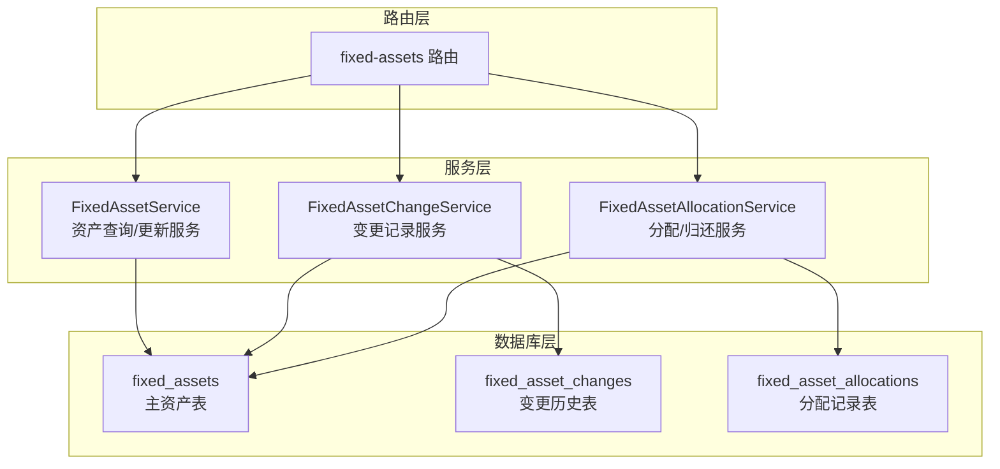
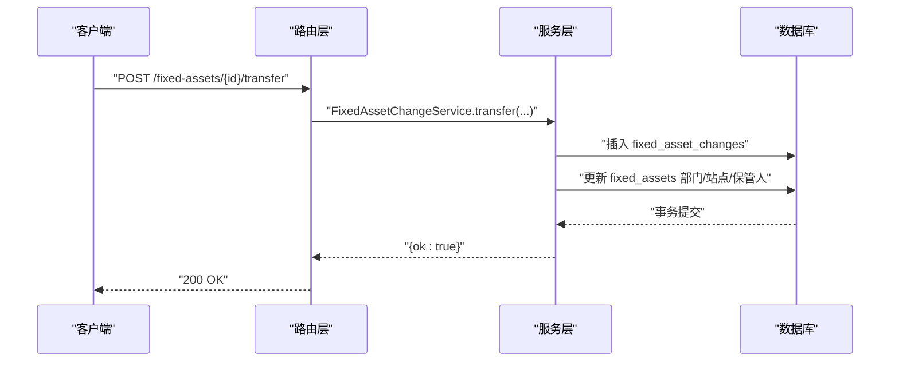
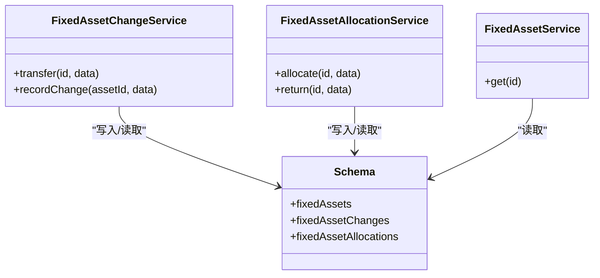
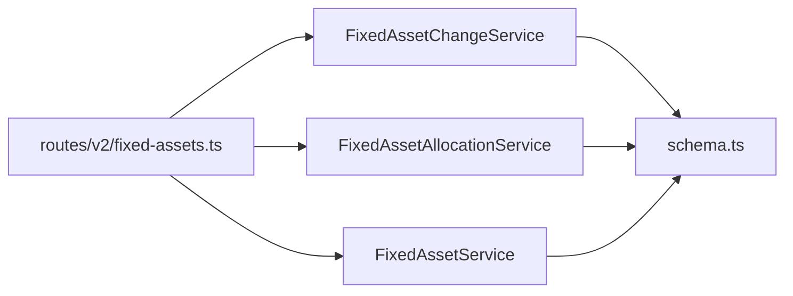

# 变更历史表 (fixedAssetChanges)

<cite>
**本文引用的文件列表**
- [schema.ts](file://backend/src/db/schema.ts)
- [FixedAssetChangeService.ts](file://backend/src/services/FixedAssetChangeService.ts)
- [FixedAssetAllocationService.ts](file://backend/src/services/FixedAssetAllocationService.ts)
- [FixedAssetService.ts](file://backend/src/services/FixedAssetService.ts)
- [fixed-assets.ts](file://backend/src/routes/v2/fixed-assets.ts)
- [FixedAssetService.test.ts](file://backend/test/services/FixedAssetService.test.ts)
- [0000_snapshot.json](file://backend/drizzle/meta/0000_snapshot.json)
</cite>

## 目录
1. [简介](#简介)
2. [项目结构](#项目结构)
3. [核心组件](#核心组件)
4. [架构总览](#架构总览)
5. [详细组件分析](#详细组件分析)
6. [依赖关系分析](#依赖关系分析)
7. [性能考量](#性能考量)
8. [故障排查指南](#故障排查指南)
9. [结论](#结论)
10. [附录](#附录)

## 简介
本技术文档围绕固定资产变更历史表 fixedAssetChanges 展开，系统性阐述其如何通过统一的变更记录模型实现对资产状态流转、调拨、分配、归还、采购、变卖等关键业务事件的审计追踪。文档重点说明：
- changeType 枚举类型及其语义边界
- changeDate 时间戳与 createdAt 审计时间戳的职责划分
- from/to 系列字段（部门、站点、保管人、状态）在记录资产状态流转中的作用
- 与主资产表 fixedAssets 的协同机制，确保资产生命周期历史的完整性
- 基于 Drizzle ORM 的表结构定义与典型变更场景的数据示例

## 项目结构
fixedAssetChanges 表位于数据库层 schema 中，由 Drizzle ORM 定义；业务侧通过服务层进行变更记录与主资产更新的事务化操作，并在路由层暴露对外接口。

图表来源
- [schema.ts](file://backend/src/db/schema.ts#L506-L560)
- [FixedAssetChangeService.ts](file://backend/src/services/FixedAssetChangeService.ts#L1-L115)
- [FixedAssetAllocationService.ts](file://backend/src/services/FixedAssetAllocationService.ts#L160-L290)
- [FixedAssetService.ts](file://backend/src/services/FixedAssetService.ts#L110-L181)
- [fixed-assets.ts](file://backend/src/routes/v2/fixed-assets.ts#L548-L611)

章节来源
- [schema.ts](file://backend/src/db/schema.ts#L506-L560)
- [fixed-assets.ts](file://backend/src/routes/v2/fixed-assets.ts#L548-L611)

## 核心组件
- 表结构定义（Drizzle ORM）
  - fixedAssetChanges：统一记录资产变更事件，包含资产标识、变更类型、变更日期、from/to 字段及审计元数据
  - fixedAssets：主资产表，承载当前资产的最新状态（部门、站点、保管人、状态等）
  - fixedAssetAllocations：资产分配/归还的明细记录，配合变更历史形成闭环
- 服务层
  - FixedAssetChangeService：封装通用变更记录能力，支持“转移”等场景
  - FixedAssetAllocationService：封装“分配/归还”场景，自动联动主资产状态与分配记录
  - FixedAssetService：查询资产详情时聚合变更历史与折旧记录，供前端展示
- 路由层
  - 提供转移、分配、归还、采购、变卖等接口，内部调用对应服务并记录审计日志

章节来源
- [schema.ts](file://backend/src/db/schema.ts#L506-L560)
- [FixedAssetChangeService.ts](file://backend/src/services/FixedAssetChangeService.ts#L1-L115)
- [FixedAssetAllocationService.ts](file://backend/src/services/FixedAssetAllocationService.ts#L160-L290)
- [FixedAssetService.ts](file://backend/src/services/FixedAssetService.ts#L110-L181)
- [fixed-assets.ts](file://backend/src/routes/v2/fixed-assets.ts#L548-L611)

## 架构总览
fixedAssetChanges 作为审计中枢，贯穿以下关键流程：
- 资产状态变更：当主资产的状态字段发生改变时，服务层自动写入一条状态变更记录
- 资产转移：调用转移服务，同时更新主资产并写入转移记录
- 资产分配/归还：分配时更新主资产状态与保管人，同时写入分配记录与变更历史；归还时更新主资产状态与保管人，写入归还记录与变更历史
- 查询展示：查询资产详情时，按变更日期与创建时间排序返回变更历史，便于追溯

图表来源
- [fixed-assets.ts](file://backend/src/routes/v2/fixed-assets.ts#L578-L611)
- [FixedAssetChangeService.ts](file://backend/src/services/FixedAssetChangeService.ts#L19-L79)

## 详细组件分析

### 表结构定义（Drizzle ORM）
- 表名：fixed_asset_changes
- 关键字段
  - id：主键
  - asset_id：外键关联主资产
  - change_type：变更类型（见下节）
  - change_date：变更发生的日期（字符串）
  - from_dept_id / to_dept_id：部门来源/去向
  - from_site_id / to_site_id：站点来源/去向
  - from_custodian / to_custodian：保管人来源/去向
  - from_status / to_status：状态来源/去向
  - memo / created_by / created_at：备注、操作人、审计时间
- 设计要点
  - 使用文本型 change_type 便于扩展与人类可读
  - change_date 与 created_at 分离，前者用于业务排序，后者用于审计
  - from/to 字段采用对称设计，覆盖部门、站点、保管人、状态四类维度

章节来源
- [schema.ts](file://backend/src/db/schema.ts#L544-L560)
- [0000_snapshot.json](file://backend/drizzle/meta/0000_snapshot.json#L1970-L2044)

### 变更类型（changeType）语义边界
- 已实现/可见类型
  - transfer：资产转移（部门、站点、保管人）
  - allocation：资产分配给员工
  - return：员工归还资产
  - status_change：状态变更（如从 in_use 到 scrapped）
- 未在上述服务中直接使用的类型
  - purchase：采购
  - sale：变卖
  - 注：这些类型在其他模块（如采购/变卖流程）可能通过其他表或流程记录，但不在本服务的显式枚举中体现

章节来源
- [FixedAssetChangeService.ts](file://backend/src/services/FixedAssetChangeService.ts#L44-L61)
- [FixedAssetAllocationService.ts](file://backend/src/services/FixedAssetAllocationService.ts#L190-L204)
- [FixedAssetAllocationService.ts](file://backend/src/services/FixedAssetAllocationService.ts#L268-L283)
- [schema.ts](file://backend/src/db/schema.ts#L544-L560)

### 时间戳与排序策略
- change_date：业务时间戳，用于表示“变更发生”的日期，查询时优先按此字段降序排列
- created_at：审计时间戳，记录“变更被记录”的时间，用于兜底排序
- 排序规则：先按 change_date 降序，再按 created_at 降序，保证同一天内多条记录的稳定顺序

章节来源
- [FixedAssetService.ts](file://backend/src/services/FixedAssetService.ts#L133-L139)

### from/to 系列字段的作用
- 部门维度：from_dept_id / to_dept_id 记录资产所在部门的来源与去向
- 站点维度：from_site_id / to_site_id 记录资产所在站点的来源与去向
- 保管人维度：from_custodian / to_custodian 记录资产保管人的来源与去向
- 状态维度：from_status / to_status 记录资产状态的来源与去向
- 作用：通过对比 from/to，清晰还原资产在各维度上的流转轨迹，便于审计与报表统计

章节来源
- [schema.ts](file://backend/src/db/schema.ts#L544-L560)
- [FixedAssetChangeService.ts](file://backend/src/services/FixedAssetChangeService.ts#L44-L61)
- [FixedAssetAllocationService.ts](file://backend/src/services/FixedAssetAllocationService.ts#L190-L204)

### 与主资产表的协同机制
- 主资产表 fixedAssets 存储资产的“当前值”，包括部门、站点、保管人、状态等
- 变更历史表 fixed_asset_changes 记录“历史快照”，即每次变更前后的 from/to 值
- 查询资产详情时，服务层会合并主资产与变更历史，前端据此渲染“从哪到哪”的流转信息

章节来源
- [schema.ts](file://backend/src/db/schema.ts#L506-L530)
- [FixedAssetService.ts](file://backend/src/services/FixedAssetService.ts#L110-L181)

### 典型变更场景与数据示例（路径指引）
- 场景一：状态变更（如从 in_use 到 scrapped）
  - 触发位置：更新资产状态时
  - 示例断言路径：[FixedAssetService.test.ts](file://backend/test/services/FixedAssetService.test.ts#L519-L552)
  - 数据要点：from_status 与 to_status 分别为 in_use 与 scrapped
- 场景二：资产转移（部门/站点/保管人）
  - 触发位置：调用转移接口
  - 服务实现路径：[FixedAssetChangeService.ts](file://backend/src/services/FixedAssetChangeService.ts#L19-L79)
  - 数据要点：from_dept_id/to_dept_id、from_site_id/to_site_id、from_custodian/to_custodian
- 场景三：资产分配（员工入职/调拨/临时借用）
  - 触发位置：分配接口
  - 服务实现路径：[FixedAssetAllocationService.ts](file://backend/src/services/FixedAssetAllocationService.ts#L160-L208)
  - 数据要点：change_type 为 allocation，from_custodian/to_custodian、from_status/to_status
- 场景四：资产归还（员工离职/其他）
  - 触发位置：归还接口
  - 服务实现路径：[FixedAssetAllocationService.ts](file://backend/src/services/FixedAssetAllocationService.ts#L210-L290)
  - 数据要点：change_type 为 return，to_custodian 为空，to_status 为 idle

章节来源
- [FixedAssetService.test.ts](file://backend/test/services/FixedAssetService.test.ts#L519-L552)
- [FixedAssetChangeService.ts](file://backend/src/services/FixedAssetChangeService.ts#L19-L79)
- [FixedAssetAllocationService.ts](file://backend/src/services/FixedAssetAllocationService.ts#L160-L208)
- [FixedAssetAllocationService.ts](file://backend/src/services/FixedAssetAllocationService.ts#L210-L290)

### 类图（代码级关系）

图表来源
- [FixedAssetChangeService.ts](file://backend/src/services/FixedAssetChangeService.ts#L1-L115)
- [FixedAssetAllocationService.ts](file://backend/src/services/FixedAssetAllocationService.ts#L160-L290)
- [FixedAssetService.ts](file://backend/src/services/FixedAssetService.ts#L110-L181)
- [schema.ts](file://backend/src/db/schema.ts#L506-L560)

## 依赖关系分析
- 组件耦合
  - FixedAssetChangeService 与 FixedAssetAllocationService 均依赖 schema 中的表定义
  - FixedAssetService 在查询资产详情时依赖固定资产与变更历史表，形成“主表+历史表”的聚合视图
- 外部依赖
  - Drizzle ORM：负责 SQLite 表结构定义与查询
  - 路由层：提供 REST 接口，触发服务层逻辑
- 潜在风险
  - 事务一致性：变更历史与主资产更新需在同一事务中完成，避免不一致
  - 字段对齐：from/to 字段需与主资产当前值保持一致，避免历史断档

图表来源
- [fixed-assets.ts](file://backend/src/routes/v2/fixed-assets.ts#L548-L611)
- [FixedAssetChangeService.ts](file://backend/src/services/FixedAssetChangeService.ts#L1-L115)
- [FixedAssetAllocationService.ts](file://backend/src/services/FixedAssetAllocationService.ts#L160-L290)
- [FixedAssetService.ts](file://backend/src/services/FixedAssetService.ts#L110-L181)
- [schema.ts](file://backend/src/db/schema.ts#L506-L560)

## 性能考量
- 查询排序：按 change_date 降序 + created_at 降序，避免全表扫描
- 索引建议：可在 change_date 与 asset_id 上建立索引以优化查询
- 事务批量：同一变更内的多表写入尽量放入单个事务，减少锁竞争
- 历史膨胀：长期保留变更历史会增长，建议定期归档或清理策略

## 故障排查指南
- 常见问题
  - 变更记录缺失：检查是否在事务中同时写入了 fixed_asset_changes 与更新主资产
  - 字段不一致：核对 from/to 字段是否与主资产当前值一致
  - 排序异常：确认查询是否按 change_date 降序 + created_at 降序
- 定位手段
  - 单元测试断言：参考状态变更测试用例，验证 from/to 字段正确性
  - 日志审计：路由层记录审计动作，结合变更历史定位问题

章节来源
- [FixedAssetService.test.ts](file://backend/test/services/FixedAssetService.test.ts#L519-L552)
- [fixed-assets.ts](file://backend/src/routes/v2/fixed-assets.ts#L578-L611)

## 结论
fixedAssetChanges 通过统一的变更记录模型，有效支撑了资产在部门、站点、保管人、状态四个维度的流转审计。配合主资产表与分配记录表，形成了从“当前值”到“历史快照”的完整生命周期视图。建议在实际落地中：
- 明确 changeType 的边界与命名规范
- 强化事务一致性保障
- 建立索引与归档策略
- 在前端展示中突出“从哪到哪”的可视化对比

## 附录

### 表结构字段对照（Drizzle ORM）
- 表名：fixed_asset_changes
- 字段
  - id：主键
  - asset_id：外键
  - change_type：变更类型
  - change_date：变更日期
  - from_dept_id / to_dept_id：部门来源/去向
  - from_site_id / to_site_id：站点来源/去向
  - from_custodian / to_custodian：保管人来源/去向
  - from_status / to_status：状态来源/去向
  - memo / created_by / created_at：备注、操作人、审计时间

章节来源
- [schema.ts](file://backend/src/db/schema.ts#L544-L560)
- [0000_snapshot.json](file://backend/drizzle/meta/0000_snapshot.json#L1970-L2044)