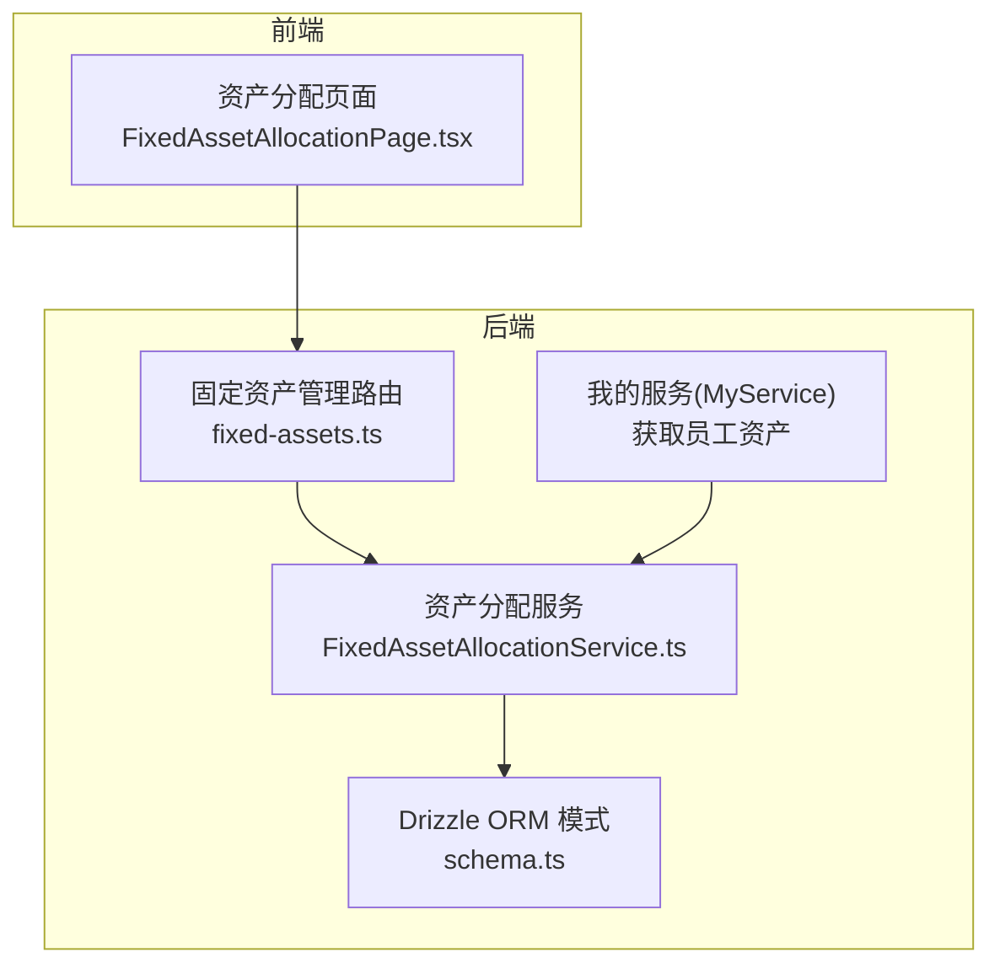
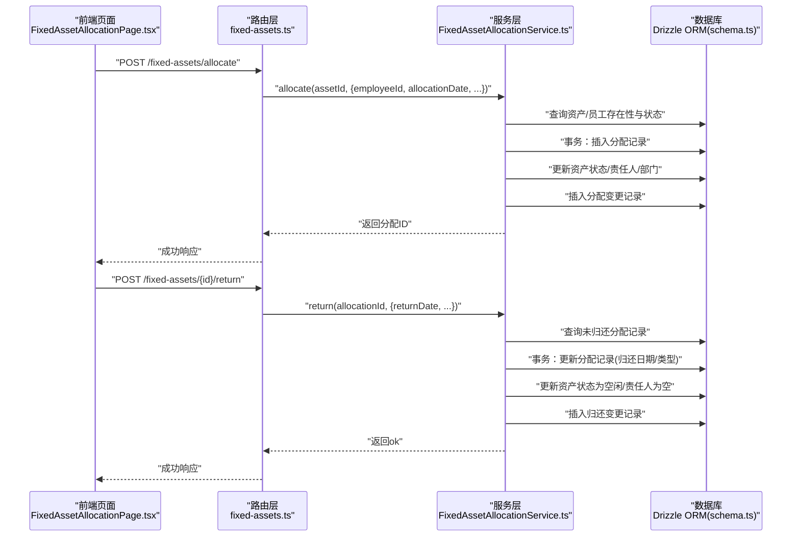
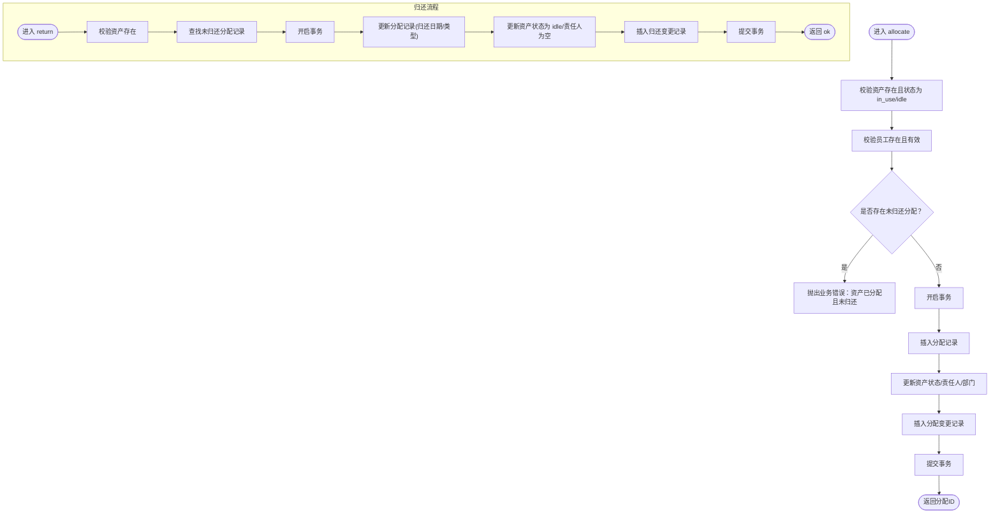
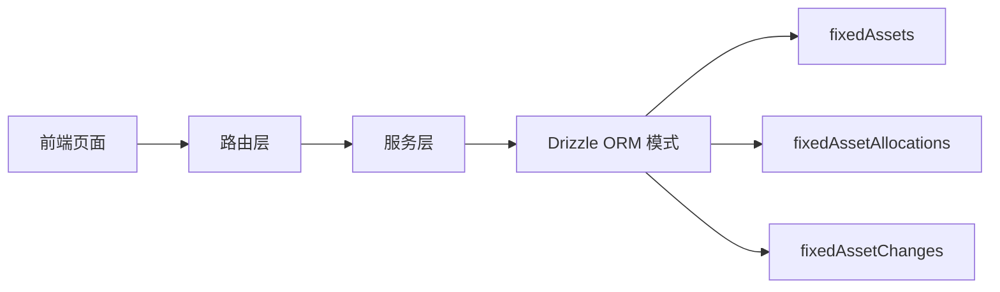

# 员工分配表 (fixedAssetAllocations)

<cite>
**本文引用的文件**
- [schema.ts](file://backend/src/db/schema.ts)
- [FixedAssetAllocationService.ts](file://backend/src/services/FixedAssetAllocationService.ts)
- [fixed-assets.ts](file://backend/src/routes/v2/fixed-assets.ts)
- [MyService.ts](file://backend/src/services/MyService.ts)
- [FixedAssetAllocationPage.tsx](file://frontend/src/features/assets/pages/FixedAssetAllocationPage.tsx)
- [business.schema.ts](file://backend/src/schemas/business.schema.ts)
- [0000_chemical_may_parker.sql](file://backend/drizzle/0000_chemical_may_parker.sql)
- [0000_snapshot.json](file://backend/drizzle/meta/0000_snapshot.json)
</cite>

## 目录
1. [简介](#简介)
2. [项目结构](#项目结构)
3. [核心组件](#核心组件)
4. [架构总览](#架构总览)
5. [详细组件分析](#详细组件分析)
6. [依赖分析](#依赖分析)
7. [性能考量](#性能考量)
8. [故障排查指南](#故障排查指南)
9. [结论](#结论)
10. [附录](#附录)

## 简介
本文件围绕“员工分配表”（fixedAssetAllocations）展开，系统性阐述该表如何管理固定资产与员工之间的分配关系，重点解释以下关键字段与业务逻辑：
- 复合关联：assetId 与 employeeId 的组合唯一性与查询约束
- 时间维度：allocationDate（分配日期）、returnDate（归还日期）
- 类型维度：allocationType（如入职分配、调拨、临时借用）、returnType（如离职归还、调拨归还等）
- 流程闭环：资产借用与归还的事务一致性、与资产状态变更及变更记录表的联动
- 前后端集成：Drizzle ORM 定义、后端服务层、路由层、前端页面与权限控制

## 项目结构
围绕固定资产分配功能，涉及的关键文件与职责如下：
- 数据模型定义：Drizzle ORM 表定义（含 fixedAssetAllocations、fixedAssets、fixedAssetChanges）
- 业务服务：FixedAssetAllocationService（分配、归还、列表查询）
- 路由接口：固定资产管理路由（分配、归还、查询分配列表）
- 前端页面：资产分配页（筛选、分配、归还）
- 权限与校验：路由层权限校验、Schema 校验、服务层业务校验
- 员工自助：MyService 中“我的资产”接口按员工维度聚合当前与已归还资产

图表来源
- [fixed-assets.ts](file://backend/src/routes/v2/fixed-assets.ts#L150-L211)
- [FixedAssetAllocationService.ts](file://backend/src/services/FixedAssetAllocationService.ts#L23-L104)
- [schema.ts](file://backend/src/db/schema.ts#L562-L574)
- [MyService.ts](file://backend/src/services/MyService.ts#L236-L262)
- [FixedAssetAllocationPage.tsx](file://frontend/src/features/assets/pages/FixedAssetAllocationPage.tsx#L25-L55)

章节来源
- [schema.ts](file://backend/src/db/schema.ts#L562-L574)
- [FixedAssetAllocationService.ts](file://backend/src/services/FixedAssetAllocationService.ts#L23-L104)
- [fixed-assets.ts](file://backend/src/routes/v2/fixed-assets.ts#L150-L211)
- [MyService.ts](file://backend/src/services/MyService.ts#L236-L262)
- [FixedAssetAllocationPage.tsx](file://frontend/src/features/assets/pages/FixedAssetAllocationPage.tsx#L25-L55)

## 核心组件
- 表结构（Drizzle ORM）
  - fixedAssetAllocations：存储每条资产与员工的分配记录，包含分配/归还时间、类型、备注、审计字段
  - fixedAssets：资产主表，分配时会更新其状态、责任人、部门等
  - fixedAssetChanges：资产变更历史，分配/归还时写入对应变更记录
- 服务层（FixedAssetAllocationService）
  - listAllocations：按资产/员工/是否归还过滤，返回带资产与员工信息的聚合结果
  - allocate：分配资产给员工，事务内写入分配记录、更新资产状态并记录变更
  - return：归还资产，事务内更新分配记录、重置资产状态并记录变更
- 路由层（fixed-assets.ts）
  - GET /fixed-assets/allocations：列出分配记录（支持按资产/员工/是否归还筛选）
  - POST /fixed-assets/allocate：分配资产
  - POST /fixed-assets/{id}/return：归还资产
- 前端页面（FixedAssetAllocationPage.tsx）
  - 支持按员工筛选、显示“未归还/已归还”状态、分配与归还弹窗
- 权限与校验（business.schema.ts、路由层）
  - 分配/归还需具备相应权限；请求体通过 Schema 校验
- 员工自助（MyService）
  - 按员工维度返回当前借用与已归还资产，内部复用 listAllocations

章节来源
- [schema.ts](file://backend/src/db/schema.ts#L506-L574)
- [FixedAssetAllocationService.ts](file://backend/src/services/FixedAssetAllocationService.ts#L23-L287)
- [fixed-assets.ts](file://backend/src/routes/v2/fixed-assets.ts#L150-L211)
- [business.schema.ts](file://backend/src/schemas/business.schema.ts#L314-L324)
- [MyService.ts](file://backend/src/services/MyService.ts#L236-L262)
- [FixedAssetAllocationPage.tsx](file://frontend/src/features/assets/pages/FixedAssetAllocationPage.tsx#L25-L55)

## 架构总览
下图展示“分配/归还”流程在各层的交互：

图表来源
- [fixed-assets.ts](file://backend/src/routes/v2/fixed-assets.ts#L767-L812)
- [FixedAssetAllocationService.ts](file://backend/src/services/FixedAssetAllocationService.ts#L109-L208)
- [FixedAssetAllocationService.ts](file://backend/src/services/FixedAssetAllocationService.ts#L213-L287)
- [schema.ts](file://backend/src/db/schema.ts#L506-L574)

## 详细组件分析

### 数据模型与字段语义
- 表：fixedAssetAllocations
  - 主键：id
  - 关联字段：assetId、employeeId（复合关联，用于唯一识别某资产在某时刻被某员工占用）
  - 时间字段：allocationDate（分配日期）、returnDate（归还日期，为空表示仍在用）
  - 类型字段：allocationType（默认入职分配）、returnType（归还类型）
  - 备注与审计：memo、createdBy、createdAt、updatedAt
- 表：fixedAssets
  - 分配/归还会更新其状态（in_use/idle）、责任人（custodian）、部门（departmentId）
- 表：fixedAssetChanges
  - 记录每次分配/归还的变更，包含变更类型、时间、前后责任人与状态

章节来源
- [schema.ts](file://backend/src/db/schema.ts#L506-L574)
- [0000_chemical_may_parker.sql](file://backend/drizzle/0000_chemical_may_parker.sql#L296-L308)
- [0000_snapshot.json](file://backend/drizzle/meta/0000_snapshot.json#L1882-L1969)

### 服务层：分配与归还流程
- 分配 allocate(assetId, payload)
  - 校验资产存在且状态为 in_use 或 idle
  - 校验员工存在且有效
  - 校验同一资产当前无未归还分配记录
  - 事务内：
    - 插入一条分配记录（默认分配类型为入职分配，可覆盖）
    - 更新资产状态为 in_use、责任人与部门
    - 写入分配变更记录
- 归还 return(allocationId, payload)
  - 校验资产存在
  - 查找该资产当前未归还的分配记录
  - 事务内：
    - 更新分配记录的归还日期与归还类型
    - 更新资产状态为 idle、责任人为空
    - 写入归还变更记录

图表来源
- [FixedAssetAllocationService.ts](file://backend/src/services/FixedAssetAllocationService.ts#L109-L208)
- [FixedAssetAllocationService.ts](file://backend/src/services/FixedAssetAllocationService.ts#L213-L287)

章节来源
- [FixedAssetAllocationService.ts](file://backend/src/services/FixedAssetAllocationService.ts#L109-L208)
- [FixedAssetAllocationService.ts](file://backend/src/services/FixedAssetAllocationService.ts#L213-L287)

### 路由层：分配与归还接口
- GET /fixed-assets/allocations
  - 支持按 assetId、employeeId、returned（true/false/undefined）过滤
  - 返回带资产名、员工名、部门名、创建人名等聚合信息
- POST /fixed-assets/allocate
  - 校验权限与请求体（分配类型枚举、日期、备注等）
  - 调用服务层完成分配
- POST /fixed-assets/{id}/return
  - 校验权限与请求体（归还类型枚举、日期、备注等）
  - 调用服务层完成归还

章节来源
- [fixed-assets.ts](file://backend/src/routes/v2/fixed-assets.ts#L150-L211)
- [fixed-assets.ts](file://backend/src/routes/v2/fixed-assets.ts#L767-L812)
- [business.schema.ts](file://backend/src/schemas/business.schema.ts#L314-L324)
- [business.schema.ts](file://backend/src/schemas/business.schema.ts#L782-L788)

### 前端页面：资产分配与归还
- 支持按员工筛选、显示“未归还/已归还”
- 分配弹窗：选择员工、分配日期、分配类型（入职/调拨/临时借用）、备注
- 归还弹窗：填写归还日期、归还类型、备注
- 页面根据权限控制“分配/归还”按钮可用性

章节来源
- [FixedAssetAllocationPage.tsx](file://frontend/src/features/assets/pages/FixedAssetAllocationPage.tsx#L25-L55)
- [FixedAssetAllocationPage.tsx](file://frontend/src/features/assets/pages/FixedAssetAllocationPage.tsx#L173-L200)
- [FixedAssetAllocationPage.tsx](file://frontend/src/features/assets/pages/FixedAssetAllocationPage.tsx#L253-L321)

### 员工自助：查询某员工当前借用的所有资产
- MyService.getAssets(userId)
  - 通过 FixedAssetAllocationService.listAllocations({ employeeId }) 获取所有分配记录
  - 过滤 returnDate 为空的记录作为“当前借用”，其余作为“已归还”
  - 返回包含资产编号/名称的结构化数据

章节来源
- [MyService.ts](file://backend/src/services/MyService.ts#L236-L262)
- [FixedAssetAllocationService.ts](file://backend/src/services/FixedAssetAllocationService.ts#L23-L104)

## 依赖分析
- 组件耦合
  - 路由层依赖服务层；服务层依赖 Drizzle ORM 模式；前端依赖路由接口
  - 服务层对 fixedAssets、fixedAssetAllocations、fixedAssetChanges 存在强依赖，保证分配/归还的事务一致性
- 外部依赖
  - Drizzle ORM（sqlite）用于数据访问
  - Hono + Zod 用于路由与请求体校验
- 潜在风险
  - 若未正确设置 returnDate，可能导致“当前借用”统计不准确
  - 若未在事务中同时更新分配记录与资产状态，可能造成数据不一致

图表来源
- [schema.ts](file://backend/src/db/schema.ts#L506-L574)
- [FixedAssetAllocationService.ts](file://backend/src/services/FixedAssetAllocationService.ts#L23-L104)
- [fixed-assets.ts](file://backend/src/routes/v2/fixed-assets.ts#L150-L211)

章节来源
- [schema.ts](file://backend/src/db/schema.ts#L506-L574)
- [FixedAssetAllocationService.ts](file://backend/src/services/FixedAssetAllocationService.ts#L23-L104)
- [fixed-assets.ts](file://backend/src/routes/v2/fixed-assets.ts#L150-L211)

## 性能考量
- 批量关联查询
  - listAllocations 在返回前会批量拉取资产、员工、部门等关联数据，减少 N+1 查询
- 索引与排序
  - 当前模式未显式声明索引；若高频按 assetId/employeeId/returnDate 查询，建议在这些列上建立索引
- 事务边界
  - 分配/归还均在单事务中完成，确保一致性但可能增加锁竞争；应避免长事务

章节来源
- [FixedAssetAllocationService.ts](file://backend/src/services/FixedAssetAllocationService.ts#L23-L104)

## 故障排查指南
- 常见错误与定位
  - “资产未分配或已归还”：归还接口找不到未归还分配记录
  - “资产已分配且未归还”：再次分配同一资产时报错
  - “员工已停用”：分配时员工状态无效
  - “只能分配使用中或闲置的资产”：资产状态不符合分配前提
- 排查步骤
  - 确认资产状态与责任人是否符合预期
  - 检查是否存在未归还的分配记录
  - 核对分配/归还时间与类型是否合理
  - 查看 fixedAssetChanges 是否正确写入

章节来源
- [FixedAssetAllocationService.ts](file://backend/src/services/FixedAssetAllocationService.ts#L120-L151)
- [FixedAssetAllocationService.ts](file://backend/src/services/FixedAssetAllocationService.ts#L222-L238)

## 结论
fixedAssetAllocations 通过 assetId 与 employeeId 的复合关联，清晰刻画了“资产—员工”的分配关系。配合 allocationDate、returnDate、allocationType、returnType 等字段，实现了从入职分配到临时借用再到归还的完整生命周期管理。服务层在事务内同步更新分配记录与资产状态，并写入变更历史，确保数据一致性与可追溯性。前端页面与路由层共同构成完整的业务闭环，配合权限与校验机制，保障系统安全与稳定。

## 附录

### Drizzle ORM 代码定义（摘自 schema.ts）
- fixedAssetAllocations
  - 字段：id、assetId、employeeId、allocationDate、allocationType、returnDate、returnType、memo、createdBy、createdAt、updatedAt
  - 默认值：allocationType 默认为“入职分配”
- fixedAssets
  - 分配/归还会更新状态、责任人、部门
- fixedAssetChanges
  - 记录分配/归还的变更类型、时间、前后责任人与状态

章节来源
- [schema.ts](file://backend/src/db/schema.ts#L506-L574)
- [0000_chemical_may_parker.sql](file://backend/drizzle/0000_chemical_may_parker.sql#L296-L308)
- [0000_snapshot.json](file://backend/drizzle/meta/0000_snapshot.json#L1882-L1969)

### 如何查询某员工当前借用的所有资产（示例路径）
- 服务层入口：FixedAssetAllocationService.listAllocations({ employeeId })
- MyService.getAssets(userId) 内部调用上述方法，并过滤 returnDate 为空的记录作为“当前借用”

章节来源
- [FixedAssetAllocationService.ts](file://backend/src/services/FixedAssetAllocationService.ts#L23-L104)
- [MyService.ts](file://backend/src/services/MyService.ts#L236-L262)