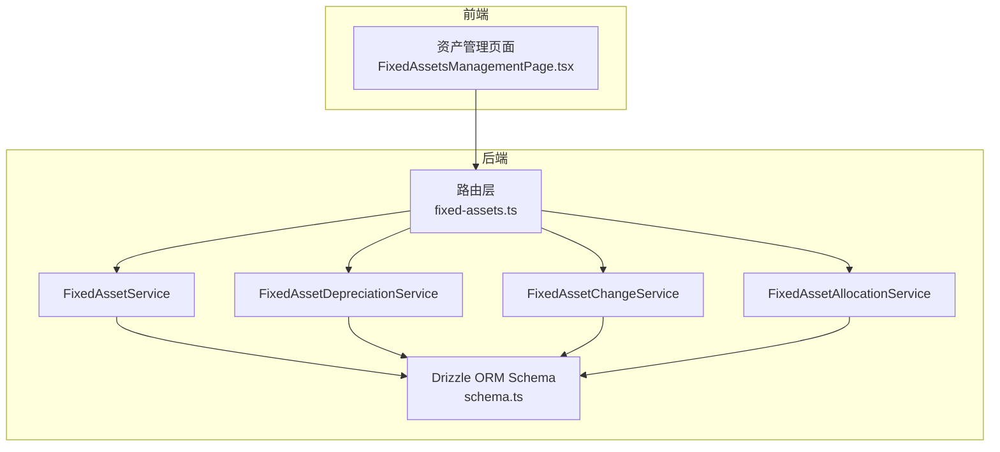
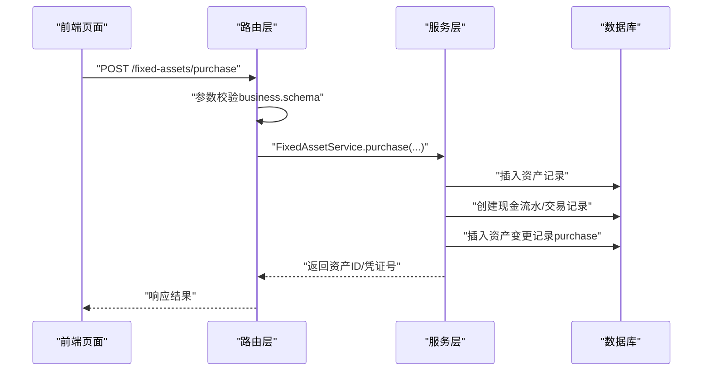
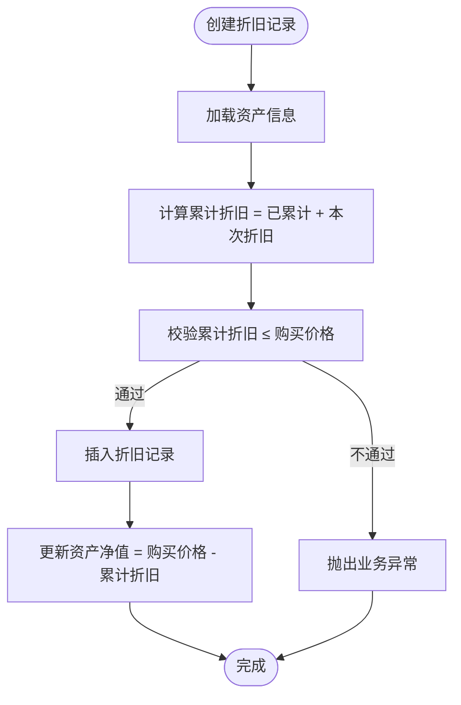
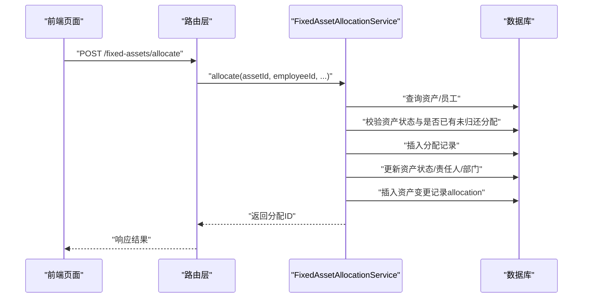
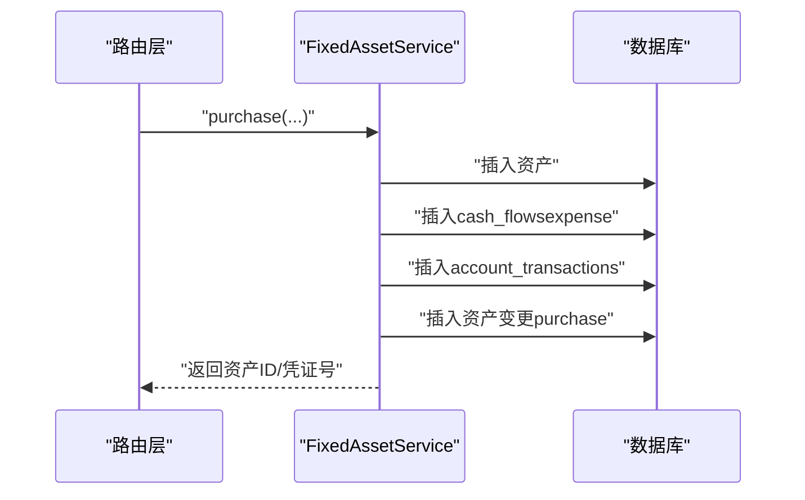
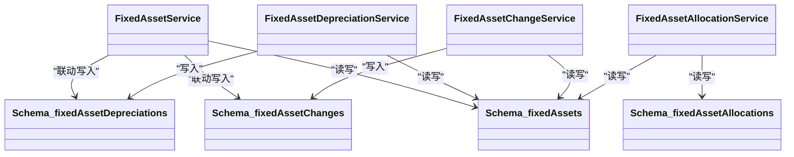

# 固定资产数据模型

<cite>
**本文引用的文件列表**
- [schema.ts](file://backend/src/db/schema.ts)
- [FixedAssetService.ts](file://backend/src/services/FixedAssetService.ts)
- [FixedAssetDepreciationService.ts](file://backend/src/services/FixedAssetDepreciationService.ts)
- [FixedAssetChangeService.ts](file://backend/src/services/FixedAssetChangeService.ts)
- [FixedAssetAllocationService.ts](file://backend/src/services/FixedAssetAllocationService.ts)
- [fixed-assets.ts](file://backend/src/routes/v2/fixed-assets.ts)
- [business.schema.ts](file://backend/src/schemas/business.schema.ts)
- [fixedAsset.schema.ts](file://frontend/src/validations/fixedAsset.schema.ts)
- [FixedAssetsManagementPage.tsx](file://frontend/src/features/assets/pages/FixedAssetsManagementPage.tsx)
- [drizzle.config.ts](file://backend/drizzle.config.ts)
- [0000_chemical_may_parker.sql](file://backend/drizzle/0000_chemical_may_parker.sql)
</cite>

## 目录
1. [简介](#简介)
2. [项目结构与入口](#项目结构与入口)
3. [核心数据模型概览](#核心数据模型概览)
4. [架构总览](#架构总览)
5. [关键组件深度解析](#关键组件深度解析)
6. [依赖关系与耦合分析](#依赖关系与耦合分析)
7. [性能与扩展性考量](#性能与扩展性考量)
8. [故障排查与常见问题](#故障排查与常见问题)
9. [结论](#结论)
10. [附录：Drizzle ORM 使用要点](#附录drizzle-orm-使用要点)

## 简介
本文件系统化梳理固定资产全生命周期数据模型，围绕主表 fixedAssets 及其关联表 fixedAssetDepreciations、fixedAssetChanges、fixedAssetAllocations 的结构与协作方式进行深入解析。重点覆盖：
- 资产全生命周期字段：采购（purchaseDate、purchasePriceCents）、折旧（depreciationMethod、usefulLifeYears）、状态（status）、处置（saleDate、salePriceCents）以及使用人/部门/地点关联
- 折旧计算记录、变更历史追踪、员工分配与归还机制
- 通过 Drizzle ORM 的数据访问层与路由层如何协同实现业务流程
- 面向开发者的最佳实践与常见问题定位

## 项目结构与入口
- 数据模型定义位于后端数据库层，采用 Drizzle ORM 的 sqliteTable 定义各表结构
- 业务服务层封装 CRUD、财务流水联动、状态机转换与审计日志
- 路由层提供 REST 接口，统一校验与权限控制
- 前端页面负责用户交互与数据展示，调用后端接口完成资产全生命周期操作

图表来源
- [fixed-assets.ts](file://backend/src/routes/v2/fixed-assets.ts#L1-L800)
- [FixedAssetService.ts](file://backend/src/services/FixedAssetService.ts#L1-L608)
- [FixedAssetDepreciationService.ts](file://backend/src/services/FixedAssetDepreciationService.ts#L1-L79)
- [FixedAssetChangeService.ts](file://backend/src/services/FixedAssetChangeService.ts#L1-L115)
- [FixedAssetAllocationService.ts](file://backend/src/services/FixedAssetAllocationService.ts#L1-L290)
- [schema.ts](file://backend/src/db/schema.ts#L506-L574)

章节来源
- [fixed-assets.ts](file://backend/src/routes/v2/fixed-assets.ts#L1-L800)
- [schema.ts](file://backend/src/db/schema.ts#L506-L574)

## 核心数据模型概览
以下为固定资产相关的核心表结构与字段说明（单位：分/元按币种转换，日期格式为“YYYY-MM-DD”）：

- 主表 fixedAssets
  - 关键字段
    - 资产标识：assetCode（唯一）
    - 基本信息：name、category、memo
    - 采购信息：purchaseDate、purchasePriceCents、currency、vendorId
    - 使用信息：departmentId、siteId、custodian、status
    - 折旧参数：depreciationMethod、usefulLifeYears、currentValueCents
    - 处置信息：saleDate、salePriceCents、saleBuyer、saleMemo
    - 审计：createdBy、createdAt、updatedAt
  - 状态枚举：in_use、idle、maintenance、scrapped、sold

- 折旧记录表 fixedAssetDepreciations
  - 关键字段
    - 关联资产：assetId
    - 折旧日期：depreciationDate
    - 金额：depreciationAmountCents
    - 累计折旧：accumulatedDepreciationCents
    - 剩余价值：remainingValueCents
    - 备注：memo
    - 审计：createdBy、createdAt

- 变更记录表 fixedAssetChanges
  - 关键字段
    - 关联资产：assetId
    - 变更类型：changeType（status_change、transfer、allocation、return、purchase、sale）
    - 变更日期：changeDate
    - 部门/站点/责任人变更：fromDeptId/toDeptId、fromSiteId/toSiteId、fromCustodian/toCustodian
    - 状态变更：fromStatus/toStatus
    - 备注：memo
    - 审计：createdBy、createdAt

- 分配记录表 fixedAssetAllocations
  - 关键字段
    - 关联资产：assetId
    - 员工：employeeId
    - 分配日期：allocationDate
    - 分配类型：allocationType（employee_onboarding、transfer、temporary）
    - 归还信息：returnDate、returnType
    - 备注：memo
    - 审计：createdBy、createdAt、updatedAt

章节来源
- [schema.ts](file://backend/src/db/schema.ts#L506-L574)

## 架构总览
固定资产全生命周期由“路由层 -> 服务层 -> 数据层”的三层协作完成。路由层负责请求校验与权限控制，服务层执行业务逻辑（含财务流水联动、状态机转换、审计日志），数据层通过 Drizzle ORM 读写 SQLite。

图表来源
- [fixed-assets.ts](file://backend/src/routes/v2/fixed-assets.ts#L613-L692)
- [FixedAssetService.ts](file://backend/src/services/FixedAssetService.ts#L313-L468)
- [business.schema.ts](file://backend/src/schemas/business.schema.ts#L748-L764)

章节来源
- [fixed-assets.ts](file://backend/src/routes/v2/fixed-assets.ts#L613-L692)
- [FixedAssetService.ts](file://backend/src/services/FixedAssetService.ts#L313-L468)

## 关键组件深度解析

### 主表 fixedAssets 字段全生命周期解读
- 采购阶段
  - purchaseDate：资产入账日期
  - purchasePriceCents：购买成本（分）
  - currency：币种代码
  - vendorId：供应商
- 使用阶段
  - departmentId/siteId/custodian：归属部门/项目、资产位置、责任人
  - status：资产状态（in_use/idle/maintenance/scrapped/sold）
  - depreciationMethod/usefulLifeYears：折旧方法与预计使用年限
  - currentValueCents：当前净值（分）
- 处置阶段
  - saleDate/salePriceCents/saleBuyer/saleMemo：出售日期、售价、买家、备注
- 关联与审计
  - createdBy/createdAt/updatedAt：创建者与时间戳

章节来源
- [schema.ts](file://backend/src/db/schema.ts#L506-L530)

### 折旧记录 fixedAssetDepreciations
- 作用：记录每次折旧的日期、金额、累计折旧与剩余价值
- 业务约束：
  - 累计折旧不得超购买价格
  - 自动同步更新主表 currentValueCents
- 事务保证：折旧记录与主表净值更新在同一事务内完成

图表来源
- [FixedAssetDepreciationService.ts](file://backend/src/services/FixedAssetDepreciationService.ts#L17-L76)

章节来源
- [FixedAssetDepreciationService.ts](file://backend/src/services/FixedAssetDepreciationService.ts#L17-L76)

### 变更记录 fixedAssetChanges
- 作用：追踪资产的各类变更（状态变更、调拨、分配、归还、采购、出售）
- 重要性：提供审计线索与历史轨迹
- 服务层自动记录：当更新资产的状态、部门、站点或责任人时，会自动生成一条 status_change 记录

章节来源
- [FixedAssetChangeService.ts](file://backend/src/services/FixedAssetChangeService.ts#L16-L112)
- [FixedAssetService.ts](file://backend/src/services/FixedAssetService.ts#L228-L286)

### 分配记录 fixedAssetAllocations
- 作用：管理资产到员工的分配与归还
- 业务规则：
  - 仅允许对 in_use 或 idle 的资产进行分配
  - 同一资产同一时刻只能存在一条未归还的分配记录
  - 分配时更新资产状态为 in_use，责任人指向员工
  - 归还时更新资产状态为 idle，清除责任人
- 服务层同时写入分配记录与资产变更记录

图表来源
- [fixed-assets.ts](file://backend/src/routes/v2/fixed-assets.ts#L767-L800)
- [FixedAssetAllocationService.ts](file://backend/src/services/FixedAssetAllocationService.ts#L106-L208)

章节来源
- [FixedAssetAllocationService.ts](file://backend/src/services/FixedAssetAllocationService.ts#L106-L208)
- [fixed-assets.ts](file://backend/src/routes/v2/fixed-assets.ts#L767-L800)

### 财务流水联动（采购/出售）
- 采购：创建资产的同时，生成一笔 expense 类型的现金流水与交易记录，并记录 purchase 变更
- 出售：更新资产状态为 sold 并生成 income 类型的现金流水与交易记录，记录 sale 变更

图表来源
- [FixedAssetService.ts](file://backend/src/services/FixedAssetService.ts#L313-L468)

章节来源
- [FixedAssetService.ts](file://backend/src/services/FixedAssetService.ts#L313-L468)

## 依赖关系与耦合分析
- 路由层依赖服务层提供的业务能力，统一进行权限校验与参数校验
- 服务层依赖 Drizzle ORM 对 schema.ts 中定义的表进行读写
- 服务层内部通过事务保证强一致性（如折旧、采购/出售、分配/归还）
- 前端通过页面组件调用后端接口，形成闭环

图表来源
- [schema.ts](file://backend/src/db/schema.ts#L506-L574)
- [FixedAssetService.ts](file://backend/src/services/FixedAssetService.ts#L1-L608)
- [FixedAssetDepreciationService.ts](file://backend/src/services/FixedAssetDepreciationService.ts#L1-L79)
- [FixedAssetChangeService.ts](file://backend/src/services/FixedAssetChangeService.ts#L1-L115)
- [FixedAssetAllocationService.ts](file://backend/src/services/FixedAssetAllocationService.ts#L1-L290)

章节来源
- [schema.ts](file://backend/src/db/schema.ts#L506-L574)
- [FixedAssetService.ts](file://backend/src/services/FixedAssetService.ts#L1-L608)
- [FixedAssetDepreciationService.ts](file://backend/src/services/FixedAssetDepreciationService.ts#L1-L79)
- [FixedAssetChangeService.ts](file://backend/src/services/FixedAssetChangeService.ts#L1-L115)
- [FixedAssetAllocationService.ts](file://backend/src/services/FixedAssetAllocationService.ts#L1-L290)

## 性能与扩展性考量
- 查询优化
  - 主表支持按资产编号、名称、责任人模糊搜索，按状态、部门、类别过滤
  - 变更与折旧记录按日期/创建时间排序，避免全表扫描
- 事务边界
  - 折旧、采购/出售、分配/归还均在事务内完成，确保数据一致性
- 扩展点
  - 可新增折旧方法策略（如年数总和法、双倍余额递减法）并在服务层实现
  - 可扩展资产分类与状态枚举，前端与后端保持一致

[本节为通用指导，无需列出具体文件来源]

## 故障排查与常见问题
- 删除资产失败
  - 若资产存在折旧记录，则不允许删除
  - 服务层会抛出业务异常提示
- 折旧金额超限
  - 累计折旧不得超过购买价格，否则抛出业务异常
- 分配冲突
  - 同一资产若存在未归还的分配记录，则不可再次分配
- 归还条件
  - 未分配或已归还的资产不可再次归还
- 参数校验
  - 路由层与服务层均进行参数校验，前端亦有表单校验

章节来源
- [FixedAssetService.ts](file://backend/src/services/FixedAssetService.ts#L288-L310)
- [FixedAssetDepreciationService.ts](file://backend/src/services/FixedAssetDepreciationService.ts#L34-L47)
- [FixedAssetAllocationService.ts](file://backend/src/services/FixedAssetAllocationService.ts#L120-L151)
- [FixedAssetAllocationService.ts](file://backend/src/services/FixedAssetAllocationService.ts#L222-L238)

## 结论
该固定资产数据模型以 fixedAssets 为核心，通过 fixedAssetDepreciations、fixedAssetChanges、fixedAssetAllocations 三张表分别承载折旧、变更与分配归还的全生命周期信息。配合 Drizzle ORM 的事务与强类型约束，实现了从采购、使用、折旧、调拨、分配到处置的完整闭环。前端页面与后端服务协同，既满足业务需求又具备良好的可维护性与扩展性。

[本节为总结性内容，无需列出具体文件来源]

## 附录：Drizzle ORM 使用要点
- 模式定义
  - 使用 sqliteTable 定义表结构，字段类型与约束清晰
  - 通过 uniqueIndex/index 为高频查询列建立索引
- 连接与迁移
  - drizzle.config.ts 指定 schema 与输出目录
  - 迁移脚本 0000_chemical_may_parker.sql 定义初始表结构
- 服务层实践
  - 使用事务包裹跨表写入，确保一致性
  - 使用 QueryBuilder 批量提取与映射关联数据，降低 N+1 查询风险
- 路由层实践
  - 统一使用 OpenAPI Schema 校验输入参数
  - 严格权限控制，结合审计日志记录关键操作

章节来源
- [drizzle.config.ts](file://backend/drizzle.config.ts#L1-L8)
- [0000_chemical_may_parker.sql](file://backend/drizzle/0000_chemical_may_parker.sql#L1-L200)
- [schema.ts](file://backend/src/db/schema.ts#L506-L574)
- [FixedAssetService.ts](file://backend/src/services/FixedAssetService.ts#L1-L608)