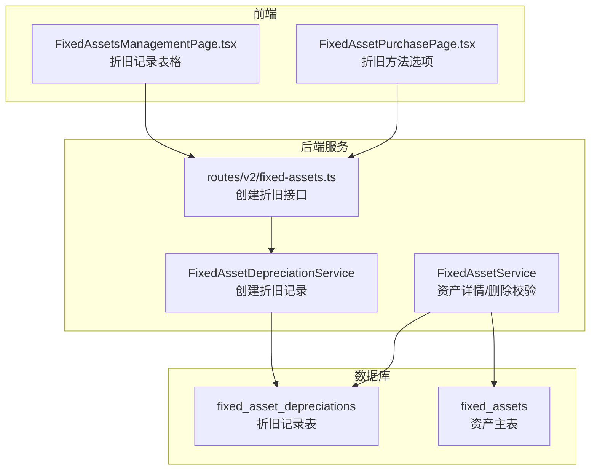
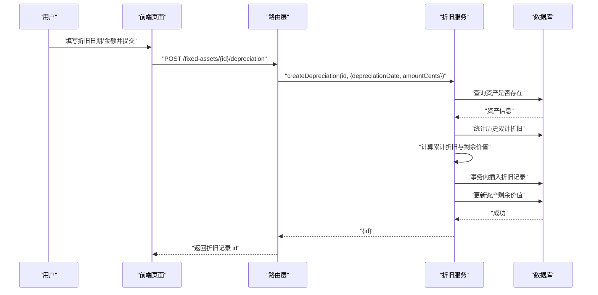
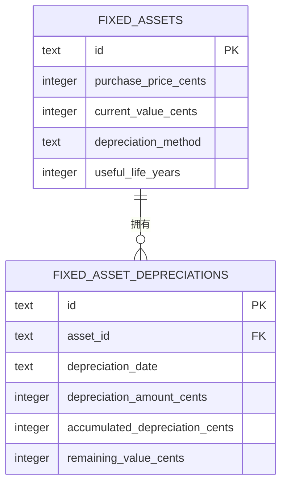
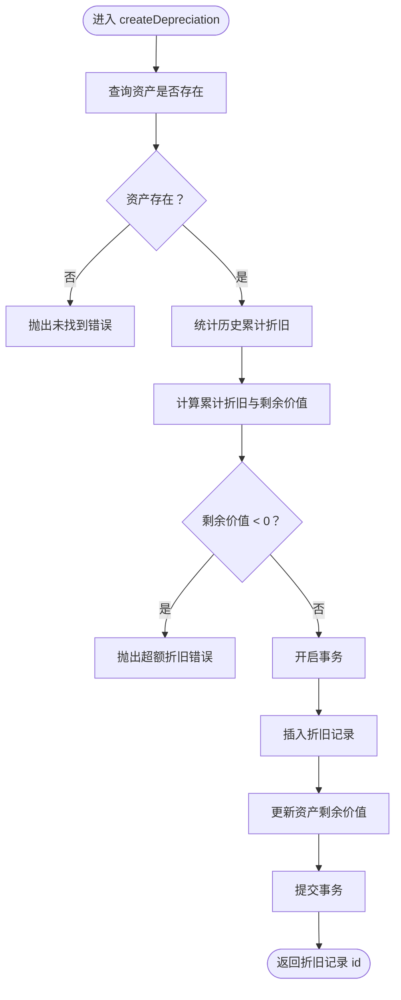
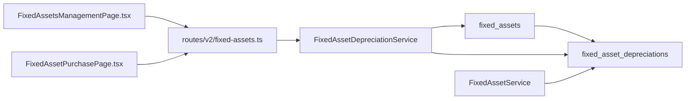

# 折旧记录表 (fixedAssetDepreciations)

<cite>
**本文引用的文件列表**
- [schema.ts](file://backend/src/db/schema.ts)
- [schema.sql](file://backend/src/db/schema.sql)
- [FixedAssetDepreciationService.ts](file://backend/src/services/FixedAssetDepreciationService.ts)
- [FixedAssetService.ts](file://backend/src/services/FixedAssetService.ts)
- [fixed-assets.ts](file://backend/src/routes/v2/fixed-assets.ts)
- [FixedAssetsManagementPage.tsx](file://frontend/src/features/assets/pages/FixedAssetsManagementPage.tsx)
- [FixedAssetPurchasePage.tsx](file://frontend/src/features/assets/pages/FixedAssetPurchasePage.tsx)
- [FixedAssetService.test.ts](file://backend/test/services/FixedAssetService.test.ts)
</cite>

## 目录
1. [简介](#简介)
2. [项目结构](#项目结构)
3. [核心组件](#核心组件)
4. [架构总览](#架构总览)
5. [详细组件分析](#详细组件分析)
6. [依赖关系分析](#依赖关系分析)
7. [性能考量](#性能考量)
8. [故障排查指南](#故障排查指南)
9. [结论](#结论)
10. [附录](#附录)

## 简介
本文件系统性阐述固定资产折旧记录表 fixedAssetDepreciations 的设计与实现，重点解释以下要点：
- 表结构字段与业务含义：assetId 外键关联、depreciationDate 折旧期间、depreciationAmountCents 当期折旧额、accumulatedDepreciationCents 累计折旧、remainingValueCents 剩余价值。
- 计算逻辑与业务规则：累计折旧与剩余价值的计算方式、折旧金额上限控制（不超过购买价格）、事务一致性保障。
- 支持多种折旧方法：当前实现以“当期折旧额”为输入，可适配直线法等不同方法的调用入口；具体方法参数（如预计使用年限、残值等）存储于资产主表，用于上层计算。
- Drizzle ORM 代码定义与典型查询场景：表结构定义、服务层插入与更新、路由层接口、前端展示与交互。

## 项目结构
围绕折旧记录表的关键文件分布如下：
- 数据库定义：schema.ts 定义了 fixed_asset_depreciations 表及字段；schema.sql 中包含 CREATE TABLE 语句。
- 服务层：FixedAssetDepreciationService 负责创建折旧记录并维护累计折旧与剩余价值。
- 路由层：fixed-assets.ts 提供创建折旧的 API 接口。
- 业务查询：FixedAssetService 在资产详情中按折旧日期倒序返回折旧明细。
- 前端页面：FixedAssetsManagementPage.tsx 展示折旧记录表格；FixedAssetPurchasePage.tsx 提供折旧方法选项。
- 测试：FixedAssetService.test.ts 验证删除资产时存在折旧记录的约束。

图表来源
- [schema.ts](file://backend/src/db/schema.ts#L506-L542)
- [schema.sql](file://backend/src/db/schema.sql#L471-L509)
- [FixedAssetDepreciationService.ts](file://backend/src/services/FixedAssetDepreciationService.ts#L1-L79)
- [FixedAssetService.ts](file://backend/src/services/FixedAssetService.ts#L110-L143)
- [fixed-assets.ts](file://backend/src/routes/v2/fixed-assets.ts#L487-L546)
- [FixedAssetsManagementPage.tsx](file://frontend/src/features/assets/pages/FixedAssetsManagementPage.tsx#L486-L500)
- [FixedAssetPurchasePage.tsx](file://frontend/src/features/assets/pages/FixedAssetPurchasePage.tsx#L26-L29)

章节来源
- [schema.ts](file://backend/src/db/schema.ts#L506-L542)
- [schema.sql](file://backend/src/db/schema.sql#L471-L509)
- [FixedAssetDepreciationService.ts](file://backend/src/services/FixedAssetDepreciationService.ts#L1-L79)
- [FixedAssetService.ts](file://backend/src/services/FixedAssetService.ts#L110-L143)
- [fixed-assets.ts](file://backend/src/routes/v2/fixed-assets.ts#L487-L546)
- [FixedAssetsManagementPage.tsx](file://frontend/src/features/assets/pages/FixedAssetsManagementPage.tsx#L486-L500)
- [FixedAssetPurchasePage.tsx](file://frontend/src/features/assets/pages/FixedAssetPurchasePage.tsx#L26-L29)

## 核心组件
- 折旧记录表 fixedAssetDepreciations 字段
  - id：主键
  - assetId：外键关联 fixed_assets.id
  - depreciationDate：折旧期间（YYYY-MM-DD）
  - depreciationAmountCents：当期折旧额（分）
  - accumulatedDepreciationCents：累计折旧（分）
  - remainingValueCents：剩余价值（分）
  - memo、createdBy、createdAt：辅助字段
- 服务层 FixedAssetDepreciationService
  - 校验资产存在性
  - 计算累计折旧与剩余价值
  - 事务内写入折旧记录并同步更新资产剩余价值
- 路由层接口
  - POST /fixed-assets/{id}/depreciation：提交折旧日期与金额，返回折旧记录 id
- 业务查询
  - 资产详情接口返回按折旧日期倒序的折旧明细
- 前端展示
  - 折旧记录表格列：折旧日期、折旧金额、累计折旧、剩余价值、备注
  - 折旧方法选项：直线法、双倍余额递减法、年数总和法、不折旧

章节来源
- [schema.ts](file://backend/src/db/schema.ts#L506-L542)
- [FixedAssetDepreciationService.ts](file://backend/src/services/FixedAssetDepreciationService.ts#L1-L79)
- [fixed-assets.ts](file://backend/src/routes/v2/fixed-assets.ts#L487-L546)
- [FixedAssetService.ts](file://backend/src/services/FixedAssetService.ts#L110-L143)
- [FixedAssetsManagementPage.tsx](file://frontend/src/features/assets/pages/FixedAssetsManagementPage.tsx#L486-L500)
- [FixedAssetPurchasePage.tsx](file://frontend/src/features/assets/pages/FixedAssetPurchasePage.tsx#L26-L29)

## 架构总览
下图展示了从用户操作到数据持久化的完整流程，以及折旧记录表与资产主表之间的关系。

图表来源
- [fixed-assets.ts](file://backend/src/routes/v2/fixed-assets.ts#L487-L546)
- [FixedAssetDepreciationService.ts](file://backend/src/services/FixedAssetDepreciationService.ts#L1-L79)
- [schema.ts](file://backend/src/db/schema.ts#L506-L542)

## 详细组件分析

### 数据模型与字段语义
- 外键关联：assetId 指向 fixed_assets.id，确保每条折旧记录归属某资产。
- 折旧期间：depreciationDate 作为折旧所属期间标识，通常为自然月末或会计期末。
- 当期折旧额：depreciationAmountCents 为本次折旧产生的金额（分），由上层根据所选折旧方法计算得出。
- 累计折旧：accumulatedDepreciationCents 为历史累计之和，用于反映资产价值减少程度。
- 剩余价值：remainingValueCents 为资产账面净值，等于购买价格减去累计折旧。
- 业务规则：
  - 累计折旧不得超出购买价格（否则拒绝创建折旧记录）。
  - 事务内同时写入折旧记录并更新资产剩余价值，保证一致性。

图表来源
- [schema.ts](file://backend/src/db/schema.ts#L506-L542)
- [schema.sql](file://backend/src/db/schema.sql#L471-L509)

章节来源
- [schema.ts](file://backend/src/db/schema.ts#L506-L542)
- [schema.sql](file://backend/src/db/schema.sql#L471-L509)

### 服务层：折旧创建流程
- 输入参数：资产 id、折旧日期、当期折旧金额（分）、备注、创建人。
- 校验与计算：
  - 查询资产是否存在。
  - 统计该资产历史累计折旧总额，加上本次金额得到新的累计折旧。
  - 用购买价格减去累计折旧得到剩余价值。
  - 若剩余价值为负，抛出业务错误（不允许超额折旧）。
- 事务执行：
  - 插入一条折旧记录，写入当期金额、累计折旧、剩余价值等字段。
  - 同步更新资产表的 current_value_cents 与 updatedAt。
- 返回：返回新建折旧记录的 id。

图表来源
- [FixedAssetDepreciationService.ts](file://backend/src/services/FixedAssetDepreciationService.ts#L1-L79)

章节来源
- [FixedAssetDepreciationService.ts](file://backend/src/services/FixedAssetDepreciationService.ts#L1-L79)

### 路由层：创建折旧接口
- 路径：POST /fixed-assets/{id}/depreciation
- 请求体字段：
  - id：路径参数（资产 id）
  - depreciationDate：YYYY-MM-DD
  - amountCents：整数，大于 0
  - memo：可选
- 响应：返回新建折旧记录 id
- 权限：需要具备“资产-固定资产-折旧”权限

章节来源
- [fixed-assets.ts](file://backend/src/routes/v2/fixed-assets.ts#L487-L546)

### 业务查询：资产详情中的折旧明细
- 查询逻辑：按资产 id 查询折旧记录，按折旧日期降序排列。
- 返回字段：包含 id、assetId、depreciationDate、depreciationAmountCents、accumulatedDepreciationCents、remainingValueCents、memo、createdBy、createdAt。
- 用途：前端资产详情页展示折旧历史。

章节来源
- [FixedAssetService.ts](file://backend/src/services/FixedAssetService.ts#L110-L143)
- [fixed-assets.ts](file://backend/src/routes/v2/fixed-assets.ts#L249-L287)

### 前端：折旧记录展示与录入
- 折旧记录表格列：折旧日期、折旧金额、累计折旧、剩余价值、备注。
- 录入弹窗：选择折旧日期与折旧金额，可添加备注。
- 折旧方法选项：直线法、双倍余额递减法、年数总和法、不折旧（用于资产主表的折旧方法字段）。

章节来源
- [FixedAssetsManagementPage.tsx](file://frontend/src/features/assets/pages/FixedAssetsManagementPage.tsx#L486-L500)
- [FixedAssetsManagementPage.tsx](file://frontend/src/features/assets/pages/FixedAssetsManagementPage.tsx#L546-L558)
- [FixedAssetPurchasePage.tsx](file://frontend/src/features/assets/pages/FixedAssetPurchasePage.tsx#L26-L29)

### 支持多种折旧方法
- 当前实现以“当期折旧金额”为输入，因此：
  - 直线法：由上层根据购买价格、残值、使用年限计算当期折旧额。
  - 加速法（双倍余额递减、年数总和）：由上层根据账面价值与方法参数计算当期折旧额。
- 方法参数（如折旧方法、使用年限）存储于资产主表，便于上层进行算法计算与展示。

章节来源
- [schema.ts](file://backend/src/db/schema.ts#L506-L530)
- [FixedAssetPurchasePage.tsx](file://frontend/src/features/assets/pages/FixedAssetPurchasePage.tsx#L26-L29)

## 依赖关系分析
- 表间依赖
  - fixed_asset_depreciations.asset_id -> fixed_assets.id
- 服务依赖
  - FixedAssetDepreciationService 依赖 fixed_assets、fixed_asset_depreciations
  - FixedAssetService 依赖 fixed_asset_depreciations（查询折旧明细）
- 路由依赖
  - routes/v2/fixed-assets.ts 依赖 FixedAssetDepreciationService 进行创建折旧
- 前端依赖
  - FixedAssetsManagementPage.tsx 展示折旧明细
  - FixedAssetPurchasePage.tsx 提供折旧方法选项

图表来源
- [schema.ts](file://backend/src/db/schema.ts#L506-L542)
- [FixedAssetDepreciationService.ts](file://backend/src/services/FixedAssetDepreciationService.ts#L1-L79)
- [FixedAssetService.ts](file://backend/src/services/FixedAssetService.ts#L110-L143)
- [fixed-assets.ts](file://backend/src/routes/v2/fixed-assets.ts#L487-L546)
- [FixedAssetsManagementPage.tsx](file://frontend/src/features/assets/pages/FixedAssetsManagementPage.tsx#L486-L500)
- [FixedAssetPurchasePage.tsx](file://frontend/src/features/assets/pages/FixedAssetPurchasePage.tsx#L26-L29)

章节来源
- [schema.ts](file://backend/src/db/schema.ts#L506-L542)
- [FixedAssetDepreciationService.ts](file://backend/src/services/FixedAssetDepreciationService.ts#L1-L79)
- [FixedAssetService.ts](file://backend/src/services/FixedAssetService.ts#L110-L143)
- [fixed-assets.ts](file://backend/src/routes/v2/fixed-assets.ts#L487-L546)
- [FixedAssetsManagementPage.tsx](file://frontend/src/features/assets/pages/FixedAssetsManagementPage.tsx#L486-L500)
- [FixedAssetPurchasePage.tsx](file://frontend/src/features/assets/pages/FixedAssetPurchasePage.tsx#L26-L29)

## 性能考量
- 查询排序：按折旧日期降序返回，避免全表扫描，建议在折旧日期字段建立索引（当前 schema 未显式声明索引，可按需评估）。
- 事务边界：创建折旧记录与更新资产剩余价值在同一事务内完成，保证强一致，但会增加写入开销，建议在高并发场景关注锁竞争。
- 计算复杂度：累计折旧统计为 O(n)（n 为该资产折旧记录数量），通常折旧记录规模可控。

## 故障排查指南
- 折旧金额超过购买价格
  - 现象：创建折旧时报错“折旧金额超过购买价格”
  - 原因：累计折旧 + 当期折旧 > 购买价格
  - 处理：核对上层计算逻辑或调整当期折旧金额
- 资产不存在
  - 现象：创建折旧时报错“资产不存在”
  - 原因：传入的资产 id 无效
  - 处理：确认资产 id 正确
- 删除资产失败
  - 现象：删除资产时报错“业务错误”，提示资产存在折旧记录
  - 原因：资产存在折旧记录，防止破坏历史数据
  - 处理：先清理或迁移折旧记录后再删除

章节来源
- [FixedAssetDepreciationService.ts](file://backend/src/services/FixedAssetDepreciationService.ts#L1-L79)
- [FixedAssetService.test.ts](file://backend/test/services/FixedAssetService.test.ts#L605-L635)

## 结论
- fixedAssetDepreciations 表通过“当期折旧额 + 累计折旧 + 剩余价值”的三元组完整记录每项资产的月度折旧明细。
- 服务层以事务保障数据一致性，严格控制累计折旧不超过购买价格。
- 折旧方法由资产主表字段与上层计算决定，当前实现以“当期折旧额”为输入，天然适配多种方法。
- 前后端协同完善：前端展示折旧明细与录入，后端提供标准接口与校验。

## 附录

### Drizzle ORM 代码定义与典型查询
- 表定义（schema.ts）
  - fixed_asset_depreciations：包含 id、asset_id、depreciation_date、depreciation_amount_cents、accumulated_depreciation_cents、remaining_value_cents、memo、created_by、created_at
- 典型查询
  - 按资产 id 查询折旧明细并按折旧日期倒序：见 FixedAssetService 的查询逻辑
  - 创建折旧记录：见 FixedAssetDepreciationService 的 createDepreciation
- 典型接口
  - POST /fixed-assets/{id}/depreciation：见 routes/v2/fixed-assets.ts

章节来源
- [schema.ts](file://backend/src/db/schema.ts#L506-L542)
- [FixedAssetService.ts](file://backend/src/services/FixedAssetService.ts#L110-L143)
- [FixedAssetDepreciationService.ts](file://backend/src/services/FixedAssetDepreciationService.ts#L1-L79)
- [fixed-assets.ts](file://backend/src/routes/v2/fixed-assets.ts#L487-L546)