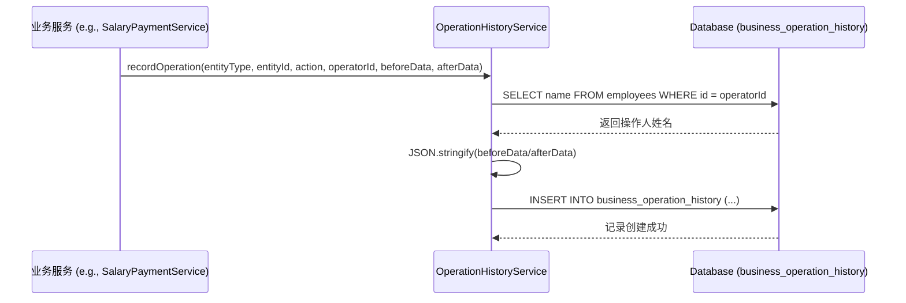

# 业务操作历史表 (business_operation_history)

<cite>
**本文档引用文件**  
- [schema.ts](file://backend/src/db/schema.ts)
- [OperationHistoryService.ts](file://backend/src/services/OperationHistoryService.ts)
- [SalaryPaymentService.ts](file://backend/src/services/SalaryPaymentService.ts)
- [ApprovalService.ts](file://backend/src/services/ApprovalService.ts)
- [auditLabels.ts](file://frontend/src/config/auditLabels.ts)
</cite>

## 目录
1. [简介](#简介)
2. [表结构与核心字段解析](#表结构与核心字段解析)
3. [数据存储机制](#数据存储机制)
4. [服务层实现与调用逻辑](#服务层实现与调用逻辑)
5. [业务场景应用示例](#业务场景应用示例)
6. [问题排查与流程回溯作用](#问题排查与流程回溯作用)
7. [与通用审计日志的对比](#与通用审计日志的对比)

## 简介

业务操作历史表（`business_operation_history`）是财务系统中用于记录关键业务实体状态变更的核心审计表。该表通过`OperationHistoryService`服务驱动，专门追踪薪资发放、借款申请、费用报销等重要业务实体的状态流转过程。与通用审计日志不同，该表专注于记录业务层面的状态变化，并通过`beforeData`和`afterData`字段以JSON格式完整保存变更前后的数据快照，为业务流程的精确回溯和问题排查提供了强有力的支持。

**Section sources**
- [schema.ts](file://backend/src/db/schema.ts#L694-L705)
- [OperationHistoryService.ts](file://backend/src/services/OperationHistoryService.ts#L8-L10)

## 表结构与核心字段解析

`business_operation_history`表的结构设计旨在全面记录每一次业务操作的关键信息，其核心字段具有明确的语义和用途。

| 字段名 | 类型 | 是否必填 | 说明 |
|-------|------|---------|------|
| id | TEXT | 是 | 唯一标识符，使用UUID生成 |
| entityType | TEXT | 是 | 业务实体类型，如'salary_payment'、'borrowing'、'reimbursement'等 |
| entityId | TEXT | 是 | 业务实体的唯一ID |
| action | TEXT | 是 | 操作动作，如'created'、'updated'、'approved'、'rejected'等 |
| operatorId | TEXT | 否 | 执行操作的用户ID |
| operatorName | TEXT | 否 | 执行操作的用户姓名 |
| beforeData | TEXT | 否 | 变更前的完整数据快照，以JSON字符串存储 |
| afterData | TEXT | 否 | 变更后的完整数据快照，以JSON字符串存储 |
| memo | TEXT | 否 | 操作备注信息 |
| createdAt | INTEGER | 是 | 操作发生的时间戳（毫秒） |

**核心字段详解：**

- **entityType**：该字段定义了被操作的业务实体类型，是区分不同业务流程的关键。例如，当处理薪资发放时，此值为`salary_payment`；处理借款时，此值为`borrowing`。这使得系统能够对不同类型的业务操作进行分类和查询。
- **entityId**：该字段与`entityType`配合使用，指向具体的业务实体记录。例如，在`salary_payment`类型的记录中，`entityId`指向`salary_payments`表中的某一条具体薪资记录。
- **action**：该字段描述了对实体执行的具体操作。常见的值包括`created`（创建）、`updated`（更新）、`approved`（审批通过）、`rejected`（拒绝）、`employee_confirmed`（员工确认）等。这些动作清晰地描绘了业务流程的各个阶段。
- **operatorId** 和 **operatorName**：这两个字段记录了执行操作的用户信息。`operatorId`是用户的唯一标识，而`operatorName`则是从`employees`表中查询到的用户姓名，便于在日志中直接显示操作人。
- **beforeData** 和 **afterData**：这是该表最核心的两个字段。它们以JSON格式存储了业务实体在操作执行前后的完整状态。例如，在审批一个报销单时，`beforeData`会记录审批前的状态（如`{"status": "pending"}`），而`afterData`会记录审批后的状态（如`{"status": "approved"}`）。这种设计使得系统能够精确地追溯任何一次状态变更的细节。

**Section sources**
- [schema.ts](file://backend/src/db/schema.ts#L694-L705)

## 数据存储机制

`business_operation_history`表的数据存储机制依赖于`OperationHistoryService`服务的`recordOperation`方法。该方法在接收到操作信息后，会执行以下步骤：

1.  **获取操作人姓名**：根据传入的`operatorId`，服务会查询`employees`表以获取对应用户的姓名（`operatorName`）。如果查询失败，服务会记录警告但继续执行，确保操作历史记录不会因次要信息缺失而中断。
2.  **序列化数据**：`beforeData`和`afterData`参数（如果存在）会被转换为JSON字符串。这是通过JavaScript的`JSON.stringify()`方法实现的，确保复杂的数据结构可以被安全地存储在数据库的TEXT字段中。
3.  **插入记录**：将所有信息，包括生成的UUID作为`id`、当前时间戳作为`createdAt`，一并插入到`business_operation_history`表中。

当从数据库读取这些记录时，`OperationHistoryService`的`getEntityHistory`和`getOperatorHistory`方法会自动将`beforeData`和`afterData`字段的JSON字符串反序列化为JavaScript对象，方便上层应用直接使用。

**Section sources**
- [OperationHistoryService.ts](file://backend/src/services/OperationHistoryService.ts#L14-L48)
- [OperationHistoryService.ts](file://backend/src/services/OperationHistoryService.ts#L54-L76)

## 服务层实现与调用逻辑

`OperationHistoryService`是驱动`business_operation_history`表的核心服务。它被设计为一个可注入的依赖，可以被其他业务服务（如`SalaryPaymentService`、`ApprovalService`）在需要时调用。



**Diagram sources**
- [OperationHistoryService.ts](file://backend/src/services/OperationHistoryService.ts#L23-L48)

**调用逻辑示例：**

在`SalaryPaymentService`中，当员工确认薪资时，会调用`employeeConfirm`方法。该方法在更新薪资记录的状态前，会先获取当前状态作为`beforeData`，然后调用`operationHistoryService.recordOperation`来记录这次操作。代码逻辑如下：

```typescript
// 伪代码，展示调用逻辑
const beforeData = { status: payment.status, version: payment.version };
await this.operationHistoryService.recordOperation(
  'salary_payment',
  id,
  'employee_confirmed',
  userId,
  beforeData,
  { status: 'pending_finance_approval' }
);
```

同样，在`ApprovalService`中，无论是审批请假、报销还是借款，都会通过`processApproval`这个通用方法来处理。在事务成功提交后，它会调用`operationHistoryService.recordOperation`来记录审批动作。

**Section sources**
- [OperationHistoryService.ts](file://backend/src/services/OperationHistoryService.ts#L8-L10)
- [SalaryPaymentService.ts](file://backend/src/services/SalaryPaymentService.ts#L157-L167)
- [ApprovalService.ts](file://backend/src/services/ApprovalService.ts#L218-L222)

## 业务场景应用示例

`business_operation_history`表在多个核心业务场景中发挥着关键作用。

### 薪资发放流程追溯

在薪资发放流程中，一笔薪资记录会经历多个状态：
1.  **创建** (`created`)：由系统或管理员创建。
2.  **员工确认** (`employee_confirmed`)：员工确认薪资明细。
3.  **财务审批** (`finance_approved`)：财务部门审批。
4.  **支付完成** (`payment_completed`)：完成支付。

每一次状态变更都会在`business_operation_history`表中生成一条记录。通过查询该薪资记录的`entityId`，可以获取其完整的操作历史，清晰地看到每一步是由谁在何时操作的，以及操作前后的状态变化。

### 借款审批流程追溯

借款流程同样依赖此表进行审计。当一个借款申请被创建、审批或拒绝时，都会记录相应的操作。`beforeData`和`afterData`字段可以记录借款金额、状态等关键信息的变化，确保整个审批过程透明可查。

### 报销流程追溯

对于费用报销，该表记录了报销单从提交、审批到支付的全过程。特别是当报销单被拒绝时，`memo`字段可以记录拒绝原因，`beforeData`和`afterData`则清晰地展示了状态从`pending`到`rejected`的转变。

**Section sources**
- [SalaryPaymentService.ts](file://backend/src/services/SalaryPaymentService.ts#L117-L171)
- [ApprovalService.ts](file://backend/src/services/ApprovalService.ts#L326-L431)

## 问题排查与流程回溯作用

`business_operation_history`表在问题排查和业务流程回溯中扮演着至关重要的角色。

- **精确追溯状态变更**：当出现数据不一致或业务状态异常时，管理员可以通过查询该表，精确地定位到是哪一次操作导致了问题。`beforeData`和`afterData`提供了变更的“快照”，使得复现问题和分析原因变得非常直接。
- **责任界定**：由于每条记录都包含了`operatorId`和`operatorName`，因此可以明确地界定每一次操作的责任人。这对于内部审计和合规性检查至关重要。
- **流程可视化**：通过将同一`entityId`的所有历史记录按时间排序，可以轻松地将一个业务实体的生命周期可视化，形成一条清晰的“时间线”，帮助理解复杂的业务流转过程。

**Section sources**
- [OperationHistoryService.ts](file://backend/src/services/OperationHistoryService.ts#L54-L76)

## 与通用审计日志的对比

`business_operation_history`表与系统中的`audit_logs`表（通用审计日志）形成了互补关系。

| 特性 | 业务操作历史表 (business_operation_history) | 通用审计日志 (audit_logs) |
|------|------------------------------------------|--------------------------|
| **关注点** | 业务实体的状态流转和数据变更 | 系统级别的操作和事件 |
| **数据粒度** | 非常细，记录变更前后的完整数据快照 | 较粗，通常只记录操作类型和实体ID |
| **数据格式** | `beforeData`和`afterData`为JSON，包含丰富数据 | `detail`字段为JSON，但内容相对简单 |
| **主要用途** | 业务流程回溯、问题排查、状态变更审计 | 安全审计、合规性检查、登录/登出追踪 |
| **前端展示** | 在业务详情页中展示操作时间线 | 在独立的“审计日志”页面中展示系统事件 |

简而言之，`audit_logs`回答了“谁在什么时候对什么做了什么操作”的问题，而`business_operation_history`则更进一步，回答了“这次操作具体改变了哪些数据”的问题。两者结合，为系统提供了全面的审计能力。

**Section sources**
- [schema.ts](file://backend/src/db/schema.ts#L694-L705)
- [schema.ts](file://backend/src/db/schema.ts#L675-L692)
- [auditLabels.ts](file://frontend/src/config/auditLabels.ts#L46-L80)