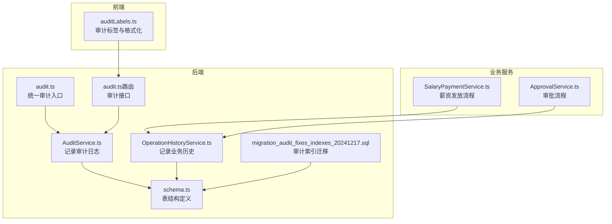
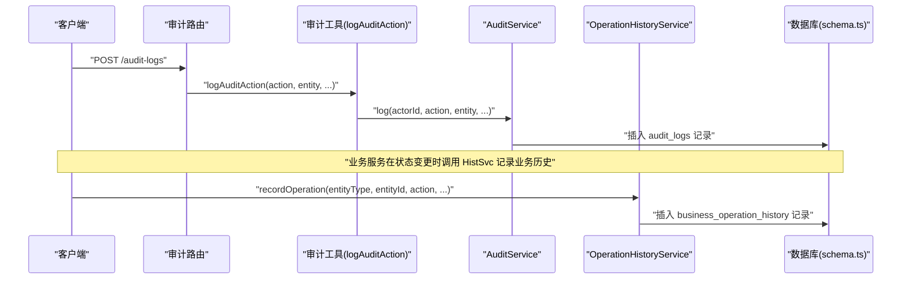
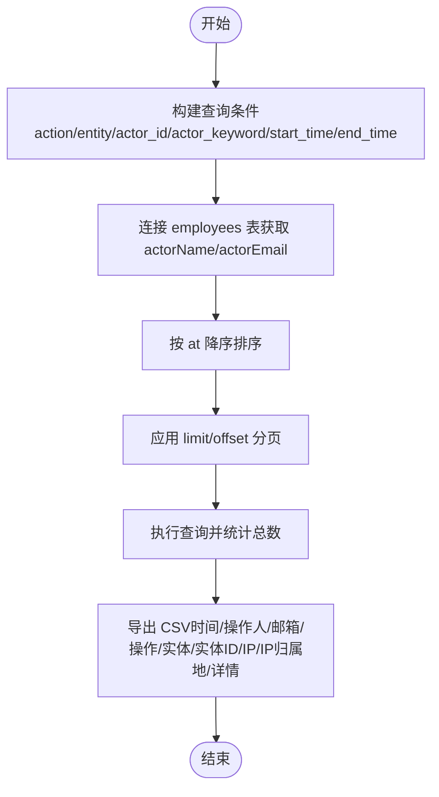
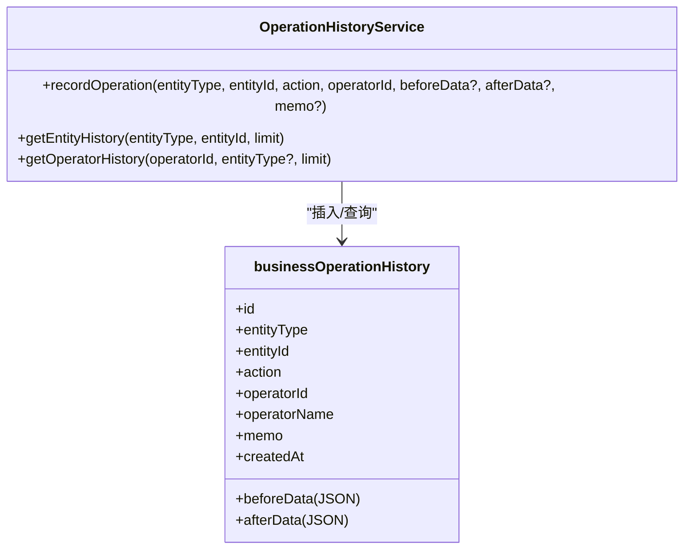
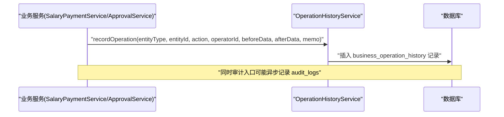
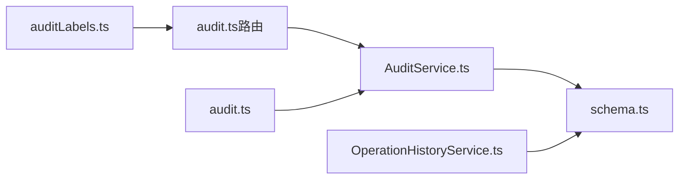

# 审计与操作历史模型

<cite>
**本文引用的文件**
- [schema.ts](file://backend/src/db/schema.ts)
- [migration_audit_fixes_indexes_20241217.sql](file://backend/src/db/migration_audit_fixes_indexes_20241217.sql)
- [AuditService.ts](file://backend/src/services/AuditService.ts)
- [OperationHistoryService.ts](file://backend/src/services/OperationHistoryService.ts)
- [audit.ts](file://backend/src/utils/audit.ts)
- [audit.ts（路由）](file://backend/src/routes/v2/audit.ts)
- [auditLabels.ts](file://frontend/src/config/auditLabels.ts)
- [SalaryPaymentService.ts](file://backend/src/services/SalaryPaymentService.ts)
- [ApprovalService.ts](file://backend/src/services/ApprovalService.ts)
</cite>

## 目录
1. [简介](#简介)
2. [项目结构](#项目结构)
3. [核心组件](#核心组件)
4. [架构总览](#架构总览)
5. [详细组件分析](#详细组件分析)
6. [依赖关系分析](#依赖关系分析)
7. [性能考量](#性能考量)
8. [故障排查指南](#故障排查指南)
9. [结论](#结论)

## 简介
本文件聚焦于系统中的两类审计与历史记录模型：
- auditLogs：通用安全审计与合规追踪表，记录“谁、何时、对什么实体做了什么、在哪里发生”的关键信息，支持基于时间与实体ID的高效查询。
- businessOperationHistory：业务操作历史表，记录业务状态变更的前后数据快照（JSON），便于业务层面的详细追溯与回溯。

两者职责清晰区分：
- auditLogs：面向安全与合规，强调可审计性与可追溯性，适合监管检查与事件复盘。
- businessOperationHistory：面向业务状态变更，强调前后数据对比，便于定位业务异常与回滚依据。

## 项目结构
围绕审计与历史模型的相关文件分布如下：
- 数据库模式定义：backend/src/db/schema.ts
- 审计索引迁移：backend/src/db/migration_audit_fixes_indexes_20241217.sql
- 后端服务层：
  - 审计服务：backend/src/services/AuditService.ts
  - 业务历史服务：backend/src/services/OperationHistoryService.ts
  - 审计工具函数：backend/src/utils/audit.ts
  - 审计路由：backend/src/routes/v2/audit.ts
- 前端配置与展示：
  - 审计标签映射：frontend/src/config/auditLabels.ts
- 业务服务使用示例：
  - 薪资发放服务：backend/src/services/SalaryPaymentService.ts
  - 审批服务：backend/src/services/ApprovalService.ts

图表来源
- [AuditService.ts](file://backend/src/services/AuditService.ts#L62-L170)
- [OperationHistoryService.ts](file://backend/src/services/OperationHistoryService.ts#L11-L49)
- [audit.ts](file://backend/src/utils/audit.ts#L33-L90)
- [audit.ts（路由）](file://backend/src/routes/v2/audit.ts#L27-L174)
- [schema.ts](file://backend/src/db/schema.ts#L675-L706)
- [migration_audit_fixes_indexes_20241217.sql](file://backend/src/db/migration_audit_fixes_indexes_20241217.sql#L6-L12)
- [auditLabels.ts](file://frontend/src/config/auditLabels.ts#L1-L103)
- [SalaryPaymentService.ts](file://backend/src/services/SalaryPaymentService.ts#L150-L171)
- [ApprovalService.ts](file://backend/src/services/ApprovalService.ts#L210-L224)

章节来源
- [schema.ts](file://backend/src/db/schema.ts#L675-L706)
- [migration_audit_fixes_indexes_20241217.sql](file://backend/src/db/migration_audit_fixes_indexes_20241217.sql#L6-L12)
- [AuditService.ts](file://backend/src/services/AuditService.ts#L62-L170)
- [OperationHistoryService.ts](file://backend/src/services/OperationHistoryService.ts#L11-L49)
- [audit.ts](file://backend/src/utils/audit.ts#L33-L90)
- [audit.ts（路由）](file://backend/src/routes/v2/audit.ts#L27-L174)
- [auditLabels.ts](file://frontend/src/config/auditLabels.ts#L1-L103)
- [SalaryPaymentService.ts](file://backend/src/services/SalaryPaymentService.ts#L150-L171)
- [ApprovalService.ts](file://backend/src/services/ApprovalService.ts#L210-L224)

## 核心组件
- auditLogs 表
  - 字段要点：id、actorId、action、entity、entityId、at、detail、ip、ipLocation
  - 索引策略：按 at（时间）与 entityId（实体ID）建立索引，满足“按时间范围检索”和“按实体ID检索”的高频查询需求
  - 用途：安全审计与合规追踪，记录操作者、动作、对象、时间、IP等关键信息
- businessOperationHistory 表
  - 字段要点：id、entityType、entityId、action、operatorId、operatorName、beforeData、afterData、memo、createdAt
  - 存储模式：beforeData/afterData 采用 JSON 文本存储，便于记录复杂结构的前后状态
  - 用途：业务状态变更的详细追溯，支持“谁在何时对什么做了什么变更”的完整上下文

章节来源
- [schema.ts](file://backend/src/db/schema.ts#L675-L706)
- [migration_audit_fixes_indexes_20241217.sql](file://backend/src/db/migration_audit_fixes_indexes_20241217.sql#L6-L12)
- [OperationHistoryService.ts](file://backend/src/services/OperationHistoryService.ts#L11-L49)

## 架构总览
审计与历史模型在系统中的调用链路如下：
- 业务服务在关键状态变更处调用业务历史服务记录 beforeData/afterData
- 请求处理过程中通过统一审计入口记录通用审计日志（含 actorId、action、entity、at、ip 等）
- 审计路由提供查询与导出能力，前端负责标签映射与详情格式化

图表来源
- [audit.ts（路由）](file://backend/src/routes/v2/audit.ts#L176-L224)
- [audit.ts](file://backend/src/utils/audit.ts#L33-L90)
- [AuditService.ts](file://backend/src/services/AuditService.ts#L62-L170)
- [OperationHistoryService.ts](file://backend/src/services/OperationHistoryService.ts#L11-L49)
- [schema.ts](file://backend/src/db/schema.ts#L675-L706)

## 详细组件分析

### auditLogs 表结构与索引策略
- 字段设计
  - actorId：操作者标识，便于关联到员工信息进行展示
  - action：标准化操作类型（如 create/update/delete/approve/reject/status_change 等）
  - entity：标准化实体类型（如 user/employee/account/cash_flow/salary_payment 等）
  - entityId：具体实体的标识，配合索引实现快速定位
  - at：Unix 时间戳，用于时间范围筛选与排序
  - detail：附加详情，通常为 JSON 文本，承载变更明细或原因
  - ip/ipLocation：记录操作来源 IP 与地理信息，增强审计可信度
- 索引策略
  - idx_audit_logs_time(at)：满足“按时间范围检索审计日志”的高频查询
  - idx_audit_logs_entity(entity_id)：满足“按实体ID检索该实体的所有审计记录”的高频查询
- 查询与导出
  - 审计路由提供分页查询、过滤条件（action/entity/actor_id/actor_keyword/start_time/end_time）以及导出 CSV 的能力
  - 前端提供标签映射与详情格式化，提升可读性

图表来源
- [AuditService.ts](file://backend/src/services/AuditService.ts#L170-L242)
- [audit.ts（路由）](file://backend/src/routes/v2/audit.ts#L27-L174)

章节来源
- [schema.ts](file://backend/src/db/schema.ts#L675-L706)
- [migration_audit_fixes_indexes_20241217.sql](file://backend/src/db/migration_audit_fixes_indexes_20241217.sql#L6-L12)
- [AuditService.ts](file://backend/src/services/AuditService.ts#L170-L242)
- [audit.ts（路由）](file://backend/src/routes/v2/audit.ts#L27-L174)
- [auditLabels.ts](file://frontend/src/config/auditLabels.ts#L1-L103)

### businessOperationHistory 表结构与 JSON 存储模式
- 字段设计
  - entityType/entityId：标识业务实体类型与具体 ID，便于按实体维度检索
  - action：标准化动作类型（如 created/updated/approved/rejected/rolled_back 等）
  - operatorId/operatorName：记录操作人信息，便于溯源
  - beforeData/afterData：JSON 文本，记录变更前后的完整数据快照
  - memo：可选备注
  - createdAt：记录时间戳，用于排序与导出
- 存储模式
  - beforeData/afterData 以 JSON 文本形式存储，便于记录复杂对象的前后对比
  - 读取时由服务层自动解析 JSON，返回给上层或前端展示
- 使用场景
  - 业务状态变更的详细追溯，如薪资发放状态流转、审批状态变更、报销流程等
  - 支持按实体维度或操作人维度查询历史，辅助问题定位与回溯

图表来源
- [OperationHistoryService.ts](file://backend/src/services/OperationHistoryService.ts#L11-L105)
- [schema.ts](file://backend/src/db/schema.ts#L694-L706)

章节来源
- [schema.ts](file://backend/src/db/schema.ts#L694-L706)
- [OperationHistoryService.ts](file://backend/src/services/OperationHistoryService.ts#L11-L105)

### 审计入口与业务服务集成
- 统一审计入口
  - 审计工具函数从请求头提取 IP 与 IP 归属地，封装 actorId、action、entity、entityId、detail、ip、ipLocation 并异步写入 audit_logs
- 业务服务集成
  - 薪资发放服务在关键状态变更（如员工确认、财务审批、回退）时调用业务历史服务记录 beforeData/afterData
  - 审批服务在审批状态变更时调用业务历史服务记录状态变化

图表来源
- [audit.ts](file://backend/src/utils/audit.ts#L33-L90)
- [SalaryPaymentService.ts](file://backend/src/services/SalaryPaymentService.ts#L150-L171)
- [ApprovalService.ts](file://backend/src/services/ApprovalService.ts#L210-L224)
- [OperationHistoryService.ts](file://backend/src/services/OperationHistoryService.ts#L11-L49)

章节来源
- [audit.ts](file://backend/src/utils/audit.ts#L33-L90)
- [SalaryPaymentService.ts](file://backend/src/services/SalaryPaymentService.ts#L150-L171)
- [ApprovalService.ts](file://backend/src/services/ApprovalService.ts#L210-L224)
- [OperationHistoryService.ts](file://backend/src/services/OperationHistoryService.ts#L11-L49)

## 依赖关系分析
- 审计服务依赖数据库模式定义与 employees 表进行人员信息关联
- 业务历史服务依赖 employees 表获取操作人姓名
- 审计路由依赖审计服务提供查询与导出能力
- 前端依赖审计标签映射与详情格式化工具提升可读性

图表来源
- [AuditService.ts](file://backend/src/services/AuditService.ts#L62-L170)
- [OperationHistoryService.ts](file://backend/src/services/OperationHistoryService.ts#L11-L49)
- [audit.ts（路由）](file://backend/src/routes/v2/audit.ts#L27-L174)
- [audit.ts](file://backend/src/utils/audit.ts#L33-L90)
- [auditLabels.ts](file://frontend/src/config/auditLabels.ts#L1-L103)
- [schema.ts](file://backend/src/db/schema.ts#L675-L706)

章节来源
- [AuditService.ts](file://backend/src/services/AuditService.ts#L62-L170)
- [OperationHistoryService.ts](file://backend/src/services/OperationHistoryService.ts#L11-L49)
- [audit.ts（路由）](file://backend/src/routes/v2/audit.ts#L27-L174)
- [audit.ts](file://backend/src/utils/audit.ts#L33-L90)
- [auditLabels.ts](file://frontend/src/config/auditLabels.ts#L1-L103)
- [schema.ts](file://backend/src/db/schema.ts#L675-L706)

## 性能考量
- 审计日志查询
  - 已建立 at 与 entity_id 索引，满足“按时间范围”和“按实体ID”检索的高频场景
  - 建议在高并发场景下控制单次查询的数据量，结合分页参数 limit/offset
- 业务历史查询
  - 建议在 entityType + entityId 上建立复合索引以优化按实体维度的查询性能（当前 schema 中未显式声明，可在迁移脚本中补充）
- JSON 存储
  - beforeData/afterData 为 JSON 文本，建议控制单条记录大小，避免超大对象导致查询与传输开销增大
- 异步审计
  - 审计入口采用 waitUntil 异步提交，避免阻塞主请求路径，提高响应速度

章节来源
- [migration_audit_fixes_indexes_20241217.sql](file://backend/src/db/migration_audit_fixes_indexes_20241217.sql#L6-L12)
- [audit.ts](file://backend/src/utils/audit.ts#L33-L90)
- [OperationHistoryService.ts](file://backend/src/services/OperationHistoryService.ts#L54-L105)

## 故障排查指南
- 审计日志为空或缺失
  - 检查审计入口是否正确提取 userId 与 IP 信息，确认服务上下文中存在 AuditService
  - 确认请求具备必要权限，审计路由对访问权限有校验
- 查询结果异常
  - 核对查询参数（action/entity/actor_id/actor_keyword/start_time/end_time）是否正确
  - 确认 at 字段为 Unix 时间戳，注意时区转换
- 业务历史缺失
  - 检查业务服务是否在关键状态变更处调用了 recordOperation
  - 确认 employees 表中是否存在对应 operatorId 的记录，否则可能无法获取 operatorName
- 导出 CSV 问题
  - 确认导出接口权限与查询参数，注意导出限制（如最大行数）

章节来源
- [audit.ts](file://backend/src/utils/audit.ts#L33-L90)
- [audit.ts（路由）](file://backend/src/routes/v2/audit.ts#L27-L174)
- [AuditService.ts](file://backend/src/services/AuditService.ts#L170-L242)
- [OperationHistoryService.ts](file://backend/src/services/OperationHistoryService.ts#L54-L105)

## 结论
- auditLogs 与 businessOperationHistory 两表分别承担“安全合规审计”与“业务状态变更追溯”的职责，互补共存
- 审计日志强调“谁、何时、对什么实体做了什么”，适合监管与合规场景
- 业务历史强调“前后数据对比”，适合业务问题定位与回溯
- 建议在现有索引基础上，针对业务历史查询场景补充复合索引，并持续优化 JSON 数据体量与查询参数，以获得更佳的性能与可维护性