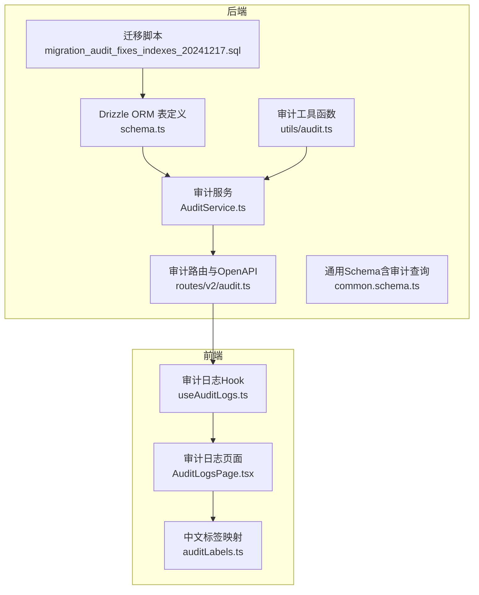
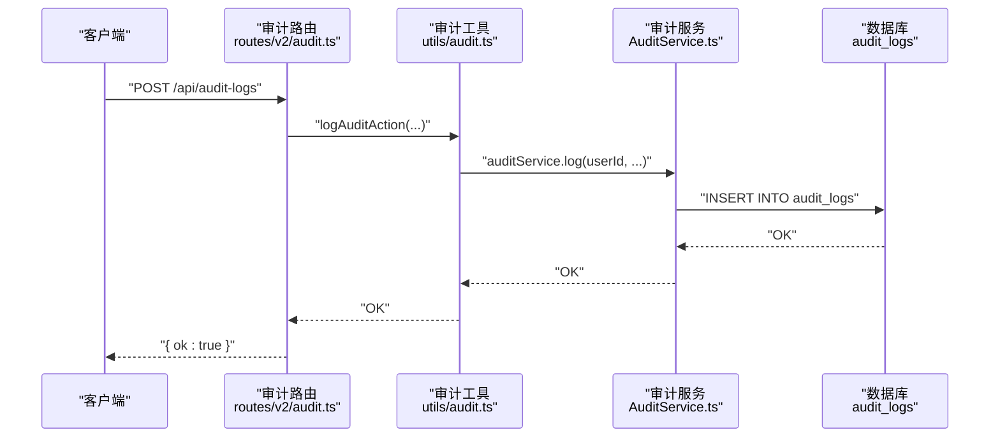
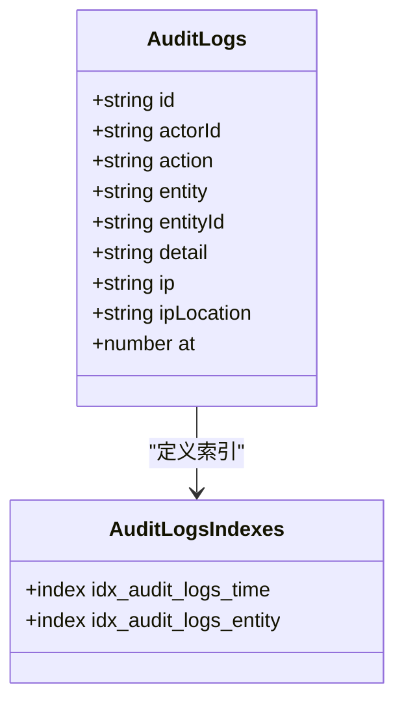
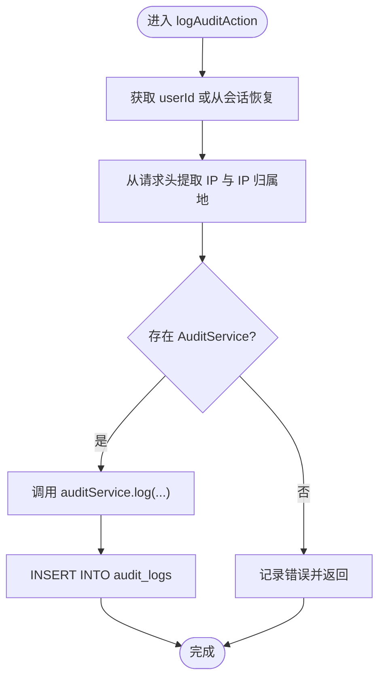
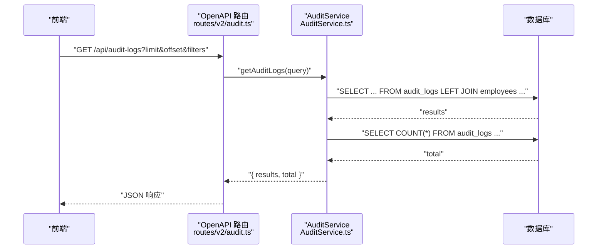
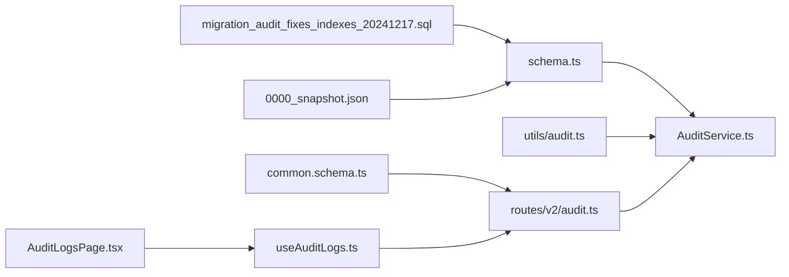

# 通用审计日志表 (audit_logs)

<cite>
**本文引用的文件列表**
- [schema.ts](file://backend/src/db/schema.ts)
- [schema.sql](file://backend/src/db/schema.sql)
- [migration_audit_fixes_indexes_20241217.sql](file://backend/src/db/migration_audit_fixes_indexes_20241217.sql)
- [0000_chemical_may_parker.sql](file://backend/drizzle/0000_chemical_may_parker.sql)
- [0000_snapshot.json](file://backend/drizzle/meta/0000_snapshot.json)
- [AuditService.ts](file://backend/src/services/AuditService.ts)
- [audit.ts](file://backend/src/routes/v2/audit.ts)
- [common.schema.ts](file://backend/src/schemas/common.schema.ts)
- [audit.ts（工具）](file://backend/src/utils/audit.ts)
- [auditLabels.ts](file://frontend/src/config/auditLabels.ts)
- [AuditLogsPage.tsx](file://frontend/src/features/system/pages/AuditLogsPage.tsx)
- [useAuditLogs.ts](file://frontend/src/hooks/business/useAuditLogs.ts)
</cite>

## 目录
1. [简介](#简介)
2. [项目结构](#项目结构)
3. [核心组件](#核心组件)
4. [架构总览](#架构总览)
5. [详细组件分析](#详细组件分析)
6. [依赖关系分析](#依赖关系分析)
7. [性能考量](#性能考量)
8. [故障排查指南](#故障排查指南)
9. [结论](#结论)
10. [附录](#附录)

## 简介
本文件系统性阐述通用审计日志表 audit_logs 的结构、用途与实现细节，重点解释以下核心字段：
- actorId：操作者标识（通常为用户ID）
- action：操作类型（如登录、创建、更新、删除、审批等）
- entity：被操作的对象类型（如用户、员工、账户、薪资发放等）
- entityId：被操作对象的唯一标识
- at：操作发生的时间戳（毫秒）
- ip：操作来源IP
- ipLocation：IP归属地（国家/城市）

该表用于记录系统级安全事件与用户操作行为，支撑合规性审计与安全监控。文档同时说明索引策略（按时间与实体ID）对查询性能的优化作用，并通过 Drizzle ORM 表定义与 OpenAPI 文档中的审计日志 API（/api/audit-logs）展示如何进行分页查询与过滤。

## 项目结构
围绕 audit_logs 的关键代码分布在后端数据库层、服务层、路由层与前端页面层：
- 数据库层：Drizzle ORM 表定义与迁移脚本
- 服务层：审计日志写入与查询服务
- 路由层：OpenAPI 定义与控制器
- 前端层：审计日志页面、查询 Hook 与标签映射

图表来源
- [schema.ts](file://backend/src/db/schema.ts#L675-L692)
- [migration_audit_fixes_indexes_20241217.sql](file://backend/src/db/migration_audit_fixes_indexes_20241217.sql#L1-L12)
- [AuditService.ts](file://backend/src/services/AuditService.ts#L1-L277)
- [audit.ts](file://backend/src/routes/v2/audit.ts#L1-L223)
- [audit.ts（工具）](file://backend/src/utils/audit.ts#L1-L90)
- [common.schema.ts](file://backend/src/schemas/common.schema.ts#L193-L205)
- [AuditLogsPage.tsx](file://frontend/src/features/system/pages/AuditLogsPage.tsx#L1-L191)
- [useAuditLogs.ts](file://frontend/src/hooks/business/useAuditLogs.ts#L49-L83)
- [auditLabels.ts](file://frontend/src/config/auditLabels.ts#L1-L263)

章节来源
- [schema.ts](file://backend/src/db/schema.ts#L675-L692)
- [migration_audit_fixes_indexes_20241217.sql](file://backend/src/db/migration_audit_fixes_indexes_20241217.sql#L1-L12)
- [AuditService.ts](file://backend/src/services/AuditService.ts#L1-L277)
- [audit.ts](file://backend/src/routes/v2/audit.ts#L1-L223)
- [audit.ts（工具）](file://backend/src/utils/audit.ts#L1-L90)
- [common.schema.ts](file://backend/src/schemas/common.schema.ts#L193-L205)
- [AuditLogsPage.tsx](file://frontend/src/features/system/pages/AuditLogsPage.tsx#L1-L191)
- [useAuditLogs.ts](file://frontend/src/hooks/business/useAuditLogs.ts#L49-L83)
- [auditLabels.ts](file://frontend/src/config/auditLabels.ts#L1-L263)

## 核心组件
- 表结构与字段
  - id：主键
  - actorId：操作者标识（可空）
  - action：操作类型（可空）
  - entity：对象类型（可空）
  - entityId：对象ID（可空）
  - detail：操作详情（JSON字符串，可空）
  - ip：来源IP（可空）
  - ipLocation：IP归属地（可空）
  - at：时间戳（整型，非空）

- 索引策略
  - idx_audit_logs_time：按 at 建立索引，优化按时间范围查询
  - idx_audit_logs_entity：按 entity_id 建立索引，优化按对象ID查询

- 数据类型与约束
  - 字段类型与约束来自 Drizzle ORM 表定义与迁移脚本
  - at 为整型且非空，适合存储毫秒级时间戳
  - detail 为文本，建议存储 JSON 字符串，便于前端解析展示

章节来源
- [schema.ts](file://backend/src/db/schema.ts#L675-L692)
- [schema.sql](file://backend/src/db/schema.sql#L128-L139)
- [0000_chemical_may_parker.sql](file://backend/drizzle/0000_chemical_may_parker.sql#L91-L104)
- [0000_snapshot.json](file://backend/drizzle/meta/0000_snapshot.json#L575-L662)
- [migration_audit_fixes_indexes_20241217.sql](file://backend/src/db/migration_audit_fixes_indexes_20241217.sql#L1-L12)

## 架构总览
审计日志从“业务操作”到“持久化记录”的整体流程如下：

图表来源
- [audit.ts](file://backend/src/routes/v2/audit.ts#L184-L223)
- [audit.ts（工具）](file://backend/src/utils/audit.ts#L33-L90)
- [AuditService.ts](file://backend/src/services/AuditService.ts#L65-L89)

## 详细组件分析

### 表定义与索引（Drizzle ORM）
- Drizzle ORM 表定义
  - 审计日志表在 schema.ts 中定义，包含主键 id 与上述字段
  - 同时定义了两个索引：idx_audit_logs_time（at）、idx_audit_logs_entity（entity_id）

- 迁移脚本与快照
  - 迁移脚本明确创建了上述索引
  - Drizzle 元数据快照中也包含 audit_logs 的列定义与索引信息

图表来源
- [schema.ts](file://backend/src/db/schema.ts#L675-L692)
- [0000_chemical_may_parker.sql](file://backend/drizzle/0000_chemical_may_parker.sql#L91-L104)
- [0000_snapshot.json](file://backend/drizzle/meta/0000_snapshot.json#L575-L662)

章节来源
- [schema.ts](file://backend/src/db/schema.ts#L675-L692)
- [0000_chemical_may_parker.sql](file://backend/drizzle/0000_chemical_may_parker.sql#L91-L104)
- [0000_snapshot.json](file://backend/drizzle/meta/0000_snapshot.json#L575-L662)

### 写入流程（日志记录）
- 审计工具函数负责从请求头提取 IP 与 IP 归属地，并调用审计服务写入
- 审计服务封装插入逻辑，统一设置 at 时间戳与 detail JSON 字符串

图表来源
- [audit.ts（工具）](file://backend/src/utils/audit.ts#L33-L90)
- [AuditService.ts](file://backend/src/services/AuditService.ts#L65-L89)

章节来源
- [audit.ts（工具）](file://backend/src/utils/audit.ts#L1-L90)
- [AuditService.ts](file://backend/src/services/AuditService.ts#L65-L89)

### 查询与过滤（OpenAPI + 服务层）
- OpenAPI 路由定义
  - GET /api/audit-logs：分页查询审计日志
  - GET /api/audit-logs/options：获取过滤选项（操作类型、对象类型、操作人）
  - GET /api/audit-logs/export：导出审计日志为 CSV
  - POST /api/audit-logs：手动创建审计日志条目

- 查询参数（来自通用 Schema）
  - action：操作类型过滤
  - entity：对象类型过滤
  - actorId：操作者ID过滤
  - actor_keyword：操作人关键词（模糊匹配）
  - start_time/end_time：时间范围过滤
  - limit/offset：分页控制

- 服务层实现要点
  - 使用条件拼接构建 WHERE 子句
  - 左连接员工表以补充操作人姓名与邮箱
  - 支持按时间倒序排序
  - 提供总数统计与分页结果

图表来源
- [audit.ts](file://backend/src/routes/v2/audit.ts#L27-L115)
- [AuditService.ts](file://backend/src/services/AuditService.ts#L182-L242)
- [common.schema.ts](file://backend/src/schemas/common.schema.ts#L193-L205)

章节来源
- [audit.ts](file://backend/src/routes/v2/audit.ts#L1-L223)
- [AuditService.ts](file://backend/src/services/AuditService.ts#L182-L242)
- [common.schema.ts](file://backend/src/schemas/common.schema.ts#L193-L205)

### 前端展示与交互
- 页面组件提供搜索过滤器（操作类型、对象类型、操作人、时间范围）
- 使用分页 Hook 将分页与过滤参数转化为查询字符串
- 使用中文标签映射将 action/entity 显示为易读文案
- 支持导出 CSV，包含时间、操作人、邮箱、操作、实体类型、实体ID、IP、IP归属地、详情等字段

章节来源
- [AuditLogsPage.tsx](file://frontend/src/features/system/pages/AuditLogsPage.tsx#L1-L191)
- [useAuditLogs.ts](file://frontend/src/hooks/business/useAuditLogs.ts#L49-L83)
- [auditLabels.ts](file://frontend/src/config/auditLabels.ts#L1-L263)

## 依赖关系分析
- 表定义依赖
  - schema.ts 定义 audit_logs 表与索引
  - 迁移脚本与快照确保索引一致性

- 服务依赖
  - AuditService 依赖 Drizzle ORM 与 employees 表（用于补充操作人信息）
  - 审计工具函数依赖请求头（Cloudflare）获取 IP 与归属地

- 路由依赖
  - 审计路由依赖通用 Schema（auditLogQuerySchema）与权限校验
  - 导出接口限制最大查询量以避免超大数据导出

图表来源
- [schema.ts](file://backend/src/db/schema.ts#L675-L692)
- [migration_audit_fixes_indexes_20241217.sql](file://backend/src/db/migration_audit_fixes_indexes_20241217.sql#L1-L12)
- [0000_snapshot.json](file://backend/drizzle/meta/0000_snapshot.json#L575-L662)
- [AuditService.ts](file://backend/src/services/AuditService.ts#L1-L277)
- [audit.ts（工具）](file://backend/src/utils/audit.ts#L1-L90)
- [audit.ts](file://backend/src/routes/v2/audit.ts#L1-L223)
- [common.schema.ts](file://backend/src/schemas/common.schema.ts#L193-L205)
- [AuditLogsPage.tsx](file://frontend/src/features/system/pages/AuditLogsPage.tsx#L1-L191)
- [useAuditLogs.ts](file://frontend/src/hooks/business/useAuditLogs.ts#L49-L83)

章节来源
- [schema.ts](file://backend/src/db/schema.ts#L675-L692)
- [migration_audit_fixes_indexes_20241217.sql](file://backend/src/db/migration_audit_fixes_indexes_20241217.sql#L1-L12)
- [0000_snapshot.json](file://backend/drizzle/meta/0000_snapshot.json#L575-L662)
- [AuditService.ts](file://backend/src/services/AuditService.ts#L1-L277)
- [audit.ts（工具）](file://backend/src/utils/audit.ts#L1-L90)
- [audit.ts](file://backend/src/routes/v2/audit.ts#L1-L223)
- [common.schema.ts](file://backend/src/schemas/common.schema.ts#L193-L205)
- [AuditLogsPage.tsx](file://frontend/src/features/system/pages/AuditLogsPage.tsx#L1-L191)
- [useAuditLogs.ts](file://frontend/src/hooks/business/useAuditLogs.ts#L49-L83)

## 性能考量
- 索引策略
  - idx_audit_logs_time（at）：优化时间范围查询与按时间倒序排序
  - idx_audit_logs_entity（entity_id）：优化按对象ID过滤与关联查询

- 查询模式
  - 常见查询包括：按时间范围、按操作类型、按对象类型、按操作人关键词、按对象ID
  - 服务层采用条件拼接与左连接，配合索引可显著提升查询效率

- 导出与分页
  - 导出接口限制最大查询量，避免一次性导出超大数据集
  - 前端分页与查询参数分离，减少后端压力

章节来源
- [migration_audit_fixes_indexes_20241217.sql](file://backend/src/db/migration_audit_fixes_indexes_20241217.sql#L1-L12)
- [AuditService.ts](file://backend/src/services/AuditService.ts#L182-L242)
- [audit.ts](file://backend/src/routes/v2/audit.ts#L102-L136)

## 故障排查指南
- 日志记录失败
  - 检查请求上下文中是否存在 userId 或会话
  - 确认 Cloudflare 请求头是否可用（用于提取 IP 与归属地）
  - 查看审计工具函数的错误日志输出

- 查询结果为空
  - 核对过滤参数（action、entity、actorId、actor_keyword、start_time、end_time）
  - 确认 at 字段为毫秒时间戳，前端传参需转换为毫秒

- 导出异常
  - 确认导出接口权限与查询量限制
  - 检查 CSV 列标题与字段映射是否一致

章节来源
- [audit.ts（工具）](file://backend/src/utils/audit.ts#L33-L90)
- [AuditService.ts](file://backend/src/services/AuditService.ts#L182-L242)
- [audit.ts](file://backend/src/routes/v2/audit.ts#L102-L136)

## 结论
audit_logs 表通过标准化的字段设计与索引策略，有效支撑了系统级安全事件与用户操作行为的记录与检索。Drizzle ORM 的表定义与迁移脚本保证了结构的一致性；OpenAPI 路由与前端页面提供了完善的查询、过滤与导出能力。结合权限控制与错误处理机制，该方案满足合规性审计与安全监控的需求。

## 附录

### 字段说明与数据类型
- id：主键（字符串）
- actorId：操作者标识（字符串，可空）
- action：操作类型（字符串，可空）
- entity：对象类型（字符串，可空）
- entityId：对象ID（字符串，可空）
- detail：操作详情（JSON字符串，可空）
- ip：来源IP（字符串，可空）
- ipLocation：IP归属地（字符串，可空）
- at：时间戳（整型，非空）

章节来源
- [schema.ts](file://backend/src/db/schema.ts#L675-L692)
- [schema.sql](file://backend/src/db/schema.sql#L128-L139)
- [0000_chemical_may_parker.sql](file://backend/drizzle/0000_chemical_may_parker.sql#L91-L104)
- [0000_snapshot.json](file://backend/drizzle/meta/0000_snapshot.json#L575-L662)

### 索引策略说明
- idx_audit_logs_time（at）：优化时间范围查询与排序
- idx_audit_logs_entity（entity_id）：优化按对象ID过滤与关联查询

章节来源
- [migration_audit_fixes_indexes_20241217.sql](file://backend/src/db/migration_audit_fixes_indexes_20241217.sql#L1-L12)
- [0000_chemical_may_parker.sql](file://backend/drizzle/0000_chemical_may_parker.sql#L102-L103)

### Drizzle ORM 表定义示例（路径）
- 表定义文件路径：[schema.ts](file://backend/src/db/schema.ts#L675-L692)

### OpenAPI 审计日志 API（/api/audit-logs）
- 查询接口：GET /api/audit-logs
  - 查询参数：action、entity、actorId、actor_keyword、start_time、end_time、limit、offset
  - 返回：results（数组）、total（数字）
- 过滤选项：GET /api/audit-logs/options
  - 返回：actions、entities、actors
- 导出接口：GET /api/audit-logs/export
  - 查询参数同上，导出 CSV 文件
- 创建接口：POST /api/audit-logs
  - 请求体：action、entity、entityId、detail
  - 返回：{ ok: true }

章节来源
- [audit.ts](file://backend/src/routes/v2/audit.ts#L27-L115)
- [audit.ts](file://backend/src/routes/v2/audit.ts#L117-L136)
- [audit.ts](file://backend/src/routes/v2/audit.ts#L184-L223)
- [common.schema.ts](file://backend/src/schemas/common.schema.ts#L193-L205)