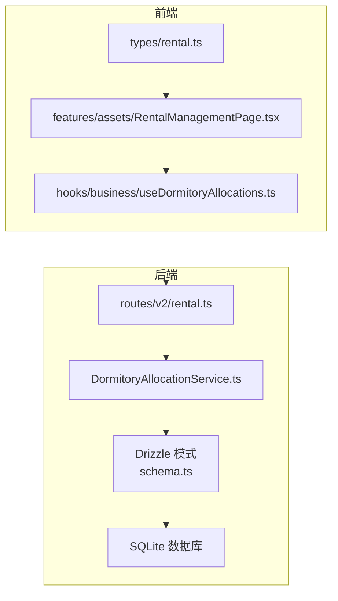
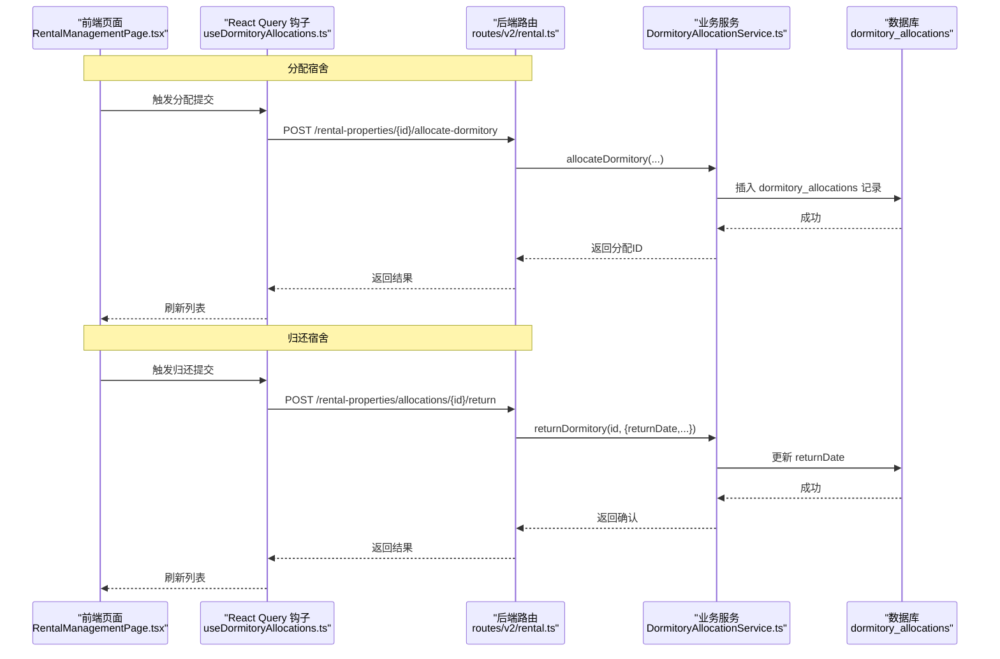
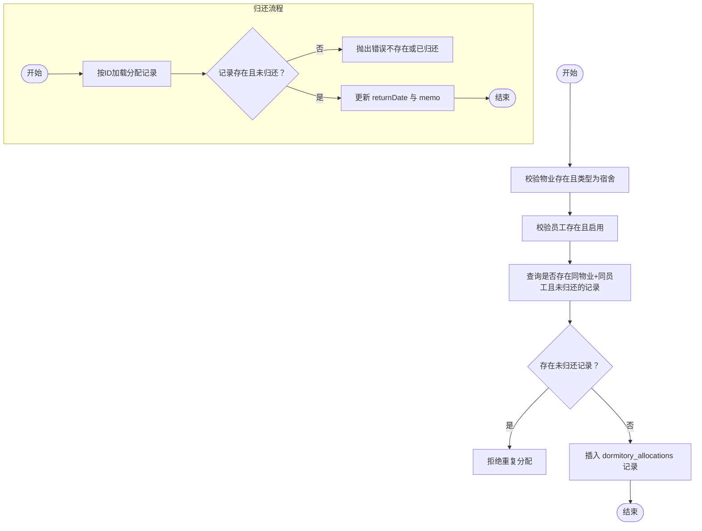
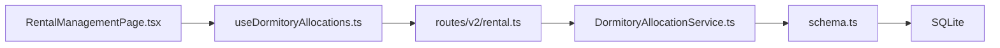

# 宿舍分配模型

<cite>
**本文引用的文件**
- [schema.ts](file://backend/src/db/schema.ts)
- [0000_chemical_may_parker.sql](file://backend/drizzle/0000_chemical_may_parker.sql)
- [DormitoryAllocationService.ts](file://backend/src/services/DormitoryAllocationService.ts)
- [rental.ts](file://backend/src/routes/v2/rental.ts)
- [useDormitoryAllocations.ts](file://frontend/src/hooks/business/useDormitoryAllocations.ts)
- [RentalManagementPage.tsx](file://frontend/src/features/assets/pages/RentalManagementPage.tsx)
- [rental.ts 类型定义](file://frontend/src/types/rental.ts)
- [0000_snapshot.json](file://backend/drizzle/meta/0000_snapshot.json)
</cite>

## 目录
1. [简介](#简介)
2. [项目结构](#项目结构)
3. [核心组件](#核心组件)
4. [架构总览](#架构总览)
5. [详细组件分析](#详细组件分析)
6. [依赖关系分析](#依赖关系分析)
7. [性能考量](#性能考量)
8. [故障排查指南](#故障排查指南)
9. [结论](#结论)
10. [附录：表结构定义示例路径](#附录表结构定义示例路径)

## 简介
本文件系统化梳理“dormitoryAllocations”（宿舍分配）数据模型，围绕以下关键字段进行深入说明：
- 员工标识：employeeId（员工ID）
- 物业标识：propertyId（宿舍物业）
- 床位定位：roomNumber（房间号）、bedNumber（床位号）
- 分配时间：allocationDate（分配日期）
- 员工承担租金：monthlyRentCents（员工承担租金）
- 归还状态：returnDate（归还日期）

同时阐明该表如何管理宿舍资源的分配与回收，解释 roomNumber 和 bedNumber 的组合唯一性约束在防止重复分配中的作用，并说明 monthlyRentCents 在员工福利核算中的应用。最后提供代码示例的文件路径，帮助快速定位实现位置。

## 项目结构
宿舍分配模型由后端数据库表、Drizzle ORM 模式、业务服务层、路由层以及前端查询与展示层共同构成。下图展示了与“dormitoryAllocations”表直接相关的模块关系与交互流程。

图表来源
- [schema.ts](file://backend/src/db/schema.ts#L641-L654)
- [0000_chemical_may_parker.sql](file://backend/drizzle/0000_chemical_may_parker.sql#L188-L201)
- [DormitoryAllocationService.ts](file://backend/src/services/DormitoryAllocationService.ts#L1-L177)
- [rental.ts](file://backend/src/routes/v2/rental.ts#L70-L123)
- [useDormitoryAllocations.ts](file://frontend/src/hooks/business/useDormitoryAllocations.ts#L1-L56)
- [RentalManagementPage.tsx](file://frontend/src/features/assets/pages/RentalManagementPage.tsx#L897-L922)
- [rental.ts 类型定义](file://frontend/src/types/rental.ts#L54-L66)

章节来源
- [schema.ts](file://backend/src/db/schema.ts#L641-L654)
- [0000_chemical_may_parker.sql](file://backend/drizzle/0000_chemical_may_parker.sql#L188-L201)
- [DormitoryAllocationService.ts](file://backend/src/services/DormitoryAllocationService.ts#L1-L177)
- [rental.ts](file://backend/src/routes/v2/rental.ts#L70-L123)
- [useDormitoryAllocations.ts](file://frontend/src/hooks/business/useDormitoryAllocations.ts#L1-L56)
- [RentalManagementPage.tsx](file://frontend/src/features/assets/pages/RentalManagementPage.tsx#L897-L922)
- [rental.ts 类型定义](file://frontend/src/types/rental.ts#L54-L66)

## 核心组件
- 数据表：dormitory_allocations
  - 字段要点：propertyId、employeeId、roomNumber、bedNumber、allocationDate、monthlyRentCents、returnDate、memo、createdBy、createdAt、updatedAt
  - 关键约束：无显式复合唯一索引；通过业务逻辑在 service 层保证同一员工在同一宿舍未归还时不可重复分配
- 业务服务：DormitoryAllocationService
  - 提供分配、归还、列表查询能力；对重复分配、已归还等场景进行校验
- 路由接口：/rental-properties/{id}/allocate-dormitory、/rental-properties/allocations/{id}/return
- 前端：React Query 钩子 useDormitoryAllocations 与页面 RentalManagementPage 展示

章节来源
- [schema.ts](file://backend/src/db/schema.ts#L641-L654)
- [DormitoryAllocationService.ts](file://backend/src/services/DormitoryAllocationService.ts#L20-L175)
- [rental.ts](file://backend/src/routes/v2/rental.ts#L125-L253)
- [useDormitoryAllocations.ts](file://frontend/src/hooks/business/useDormitoryAllocations.ts#L1-L56)
- [RentalManagementPage.tsx](file://frontend/src/features/assets/pages/RentalManagementPage.tsx#L897-L922)

## 架构总览
下图展示了从请求到数据库写入与返回的关键调用链路，涵盖分配与归还两个主要流程。

图表来源
- [rental.ts](file://backend/src/routes/v2/rental.ts#L125-L253)
- [DormitoryAllocationService.ts](file://backend/src/services/DormitoryAllocationService.ts#L80-L175)
- [useDormitoryAllocations.ts](file://frontend/src/hooks/business/useDormitoryAllocations.ts#L29-L54)
- [RentalManagementPage.tsx](file://frontend/src/features/assets/pages/RentalManagementPage.tsx#L897-L922)

## 详细组件分析

### 表结构与字段语义
- 表名：dormitory_allocations
- 字段说明（核心字段）
  - propertyId：宿舍物业标识，关联 rental_properties
  - employeeId：员工标识，关联 employees
  - roomNumber：房间号（可空）
  - bedNumber：床位号（可空）
  - allocationDate：分配日期（必填）
  - monthlyRentCents：员工承担的月租金额（单位分，可空）
  - returnDate：归还日期（可空），用于表示当前分配是否已归还
  - memo、createdBy、createdAt、updatedAt：通用审计字段

- 约束与索引
  - 无显式复合唯一索引；但通过业务规则确保同一员工在同一宿舍未归还时不可重复分配
  - 无外键约束定义于 Drizzle 模式中（见 schema.ts 与 0000_snapshot.json）

- 字段复杂度与存储
  - 字段均为标量或文本，不涉及复杂数据结构
  - monthlyRentCents 使用整数存储（分），便于精确计算与对账

章节来源
- [schema.ts](file://backend/src/db/schema.ts#L641-L654)
- [0000_chemical_may_parker.sql](file://backend/drizzle/0000_chemical_may_parker.sql#L188-L201)
- [0000_snapshot.json](file://backend/drizzle/meta/0000_snapshot.json#L1183-L1228)

### 分配与回收流程（业务逻辑）
- 分配流程
  - 校验 propertyId 对应的物业类型必须为“dormitory”
  - 校验 employeeId 对应员工存在且处于启用状态
  - 查询是否存在同一 propertyId 与 employeeId 且 returnDate 为空的记录，若存在则拒绝重复分配
  - 插入 dormitory_allocations 记录，包含 roomNumber、bedNumber、allocationDate、monthlyRentCents 等

- 归还流程
  - 根据 id 查询分配记录，若不存在或已归还则抛出错误
  - 更新 returnDate 与 memo，并刷新 updatedAt

- 列表查询
  - 支持按 propertyId、employeeId 过滤
  - 支持 returned 参数：true 表示仅显示已归还，false 表示仅显示未归还，未传则不限制

图表来源
- [DormitoryAllocationService.ts](file://backend/src/services/DormitoryAllocationService.ts#L80-L175)

章节来源
- [DormitoryAllocationService.ts](file://backend/src/services/DormitoryAllocationService.ts#L20-L175)

### 前端集成与展示
- 列表查询
  - React Query 钩子 useDormitoryAllocations 将过滤参数（propertyId、employeeId、returned）拼接到查询字符串
  - 页面 RentalManagementPage.tsx 展示房间号、床位号、分配日期、归还日期等字段

- 提交动作
  - useAllocateDormitory 与 useReturnDormitory 分别封装分配与归还的 POST 请求
  - 成功后刷新 dormitoryAllocations 与 rentalProperties 缓存

章节来源
- [useDormitoryAllocations.ts](file://frontend/src/hooks/business/useDormitoryAllocations.ts#L1-L56)
- [RentalManagementPage.tsx](file://frontend/src/features/assets/pages/RentalManagementPage.tsx#L897-L922)
- [rental.ts 类型定义](file://frontend/src/types/rental.ts#L54-L66)

### 路由与接口契约
- 获取分配列表
  - GET /rental-properties/allocations
  - 查询参数：propertyId、employeeId、returned（true/false）
  - 返回：allocation、propertyCode、propertyName、employeeName、employeeDepartmentName、createdByName 等

- 分配宿舍
  - POST /rental-properties/{id}/allocate-dormitory
  - 请求体：employeeId、roomNumber/bedNumber、allocationDate、monthlyRentCents、memo
  - 返回：分配ID

- 归还宿舍
  - POST /rental-properties/allocations/{id}/return
  - 请求体：returnDate、memo
  - 返回：ok

章节来源
- [rental.ts](file://backend/src/routes/v2/rental.ts#L70-L123)
- [rental.ts](file://backend/src/routes/v2/rental.ts#L125-L253)

## 依赖关系分析
- 模块耦合
  - routes/v2/rental.ts 依赖业务服务 DormitoryAllocationService.ts
  - DormitoryAllocationService.ts 依赖 Drizzle 模式 schema.ts 中的 dormitoryAllocations 与 rentalProperties
  - 前端 hooks 与页面依赖后端接口契约

- 外部依赖
  - Drizzle ORM（sqlite-core）用于定义表结构与查询
  - Hono + Zod 用于路由定义与请求体校验
  - React Query 用于前端缓存与并发控制

图表来源
- [rental.ts](file://backend/src/routes/v2/rental.ts#L1-L253)
- [DormitoryAllocationService.ts](file://backend/src/services/DormitoryAllocationService.ts#L1-L177)
- [schema.ts](file://backend/src/db/schema.ts#L641-L654)
- [useDormitoryAllocations.ts](file://frontend/src/hooks/business/useDormitoryAllocations.ts#L1-L56)
- [RentalManagementPage.tsx](file://frontend/src/features/assets/pages/RentalManagementPage.tsx#L897-L922)

章节来源
- [rental.ts](file://backend/src/routes/v2/rental.ts#L1-L253)
- [DormitoryAllocationService.ts](file://backend/src/services/DormitoryAllocationService.ts#L1-L177)
- [schema.ts](file://backend/src/db/schema.ts#L641-L654)
- [useDormitoryAllocations.ts](file://frontend/src/hooks/business/useDormitoryAllocations.ts#L1-L56)
- [RentalManagementPage.tsx](file://frontend/src/features/assets/pages/RentalManagementPage.tsx#L897-L922)

## 性能考量
- 查询性能
  - 列表查询支持按 propertyId、employeeId 过滤，建议在高频查询字段上建立索引（如 rental_properties.id、employees.id）
  - 排序基于 allocationDate 与 createdAt，建议在这些列上建立索引以提升排序效率

- 写入性能
  - 分配与归还均为单条记录写入，开销较小
  - 重复分配检查为单行读取，建议在 employeeId 与 propertyId 上建立复合索引以减少重复检查成本

- 前端缓存
  - React Query 默认缓存策略可减少重复请求
  - 成功后主动失效相关查询，避免陈旧数据

[本节为通用指导，无需列出具体文件来源]

## 故障排查指南
- 常见错误与处理
  - 物业不存在或非宿舍类型：分配前会校验 propertyId 与 propertyType，需确保传入正确的宿舍物业ID
  - 员工不存在或已停用：分配前会校验员工状态，需确保员工ID有效且处于启用状态
  - 重复分配：同一员工在同一宿舍未归还时不可再次分配，需先完成归还或清理历史记录
  - 已归还：对已归还的记录再次归还将触发错误，需检查 returnDate 是否为空

- 排查步骤
  - 后端日志：关注分配与归还接口的日志记录，定位异常分支
  - 数据一致性：核对 dormitory_allocations 中是否存在未归还的重复记录
  - 前端缓存：确认 React Query 缓存是否正确失效，避免看到过期数据

章节来源
- [DormitoryAllocationService.ts](file://backend/src/services/DormitoryAllocationService.ts#L80-L175)
- [rental.ts](file://backend/src/routes/v2/rental.ts#L125-L253)

## 结论
dormitoryAllocations 表通过清晰的字段设计与严格的业务校验，实现了宿舍资源的可靠分配与回收管理。尽管未在数据库层面强制 roomNumber 与 bedNumber 的组合唯一性，但通过 service 层的重复检查与 returnDate 的状态管理，有效避免了重复分配并准确反映当前占用状态。monthlyRentCents 作为员工承担租金的计量单位，便于后续在财务系统中进行核算与对账。前端通过统一的钩子与页面组件，提供了直观的查询与操作入口。

[本节为总结性内容，无需列出具体文件来源]

## 附录：表结构定义示例路径
- Drizzle 模式定义（含字段与注释）
  - [schema.ts](file://backend/src/db/schema.ts#L641-L654)
- SQL 初始化脚本（含字段与注释）
  - [0000_chemical_may_parker.sql](file://backend/drizzle/0000_chemical_may_parker.sql#L188-L201)
- Drizzle 元信息快照（字段与约束概览）
  - [0000_snapshot.json](file://backend/drizzle/meta/0000_snapshot.json#L1183-L1228)