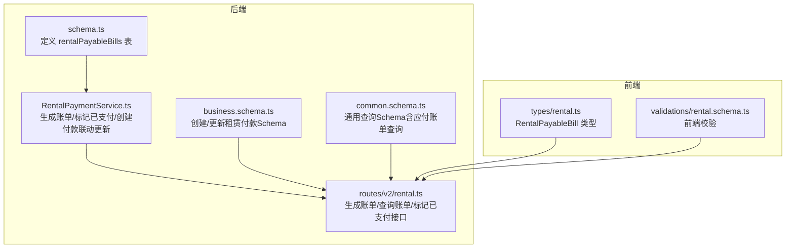
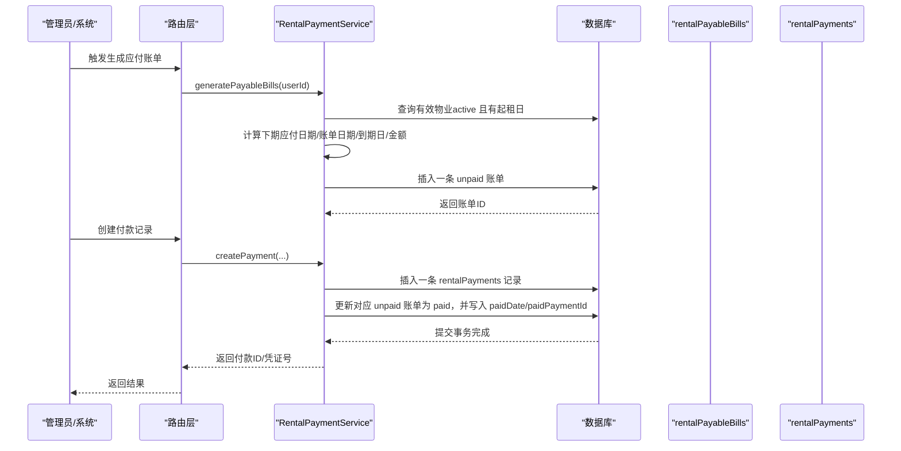
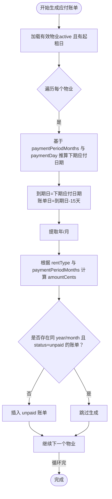
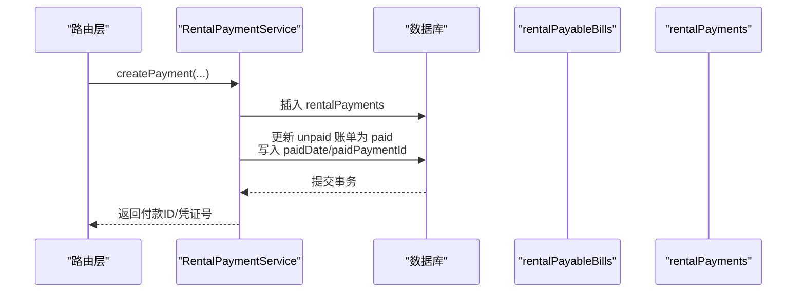
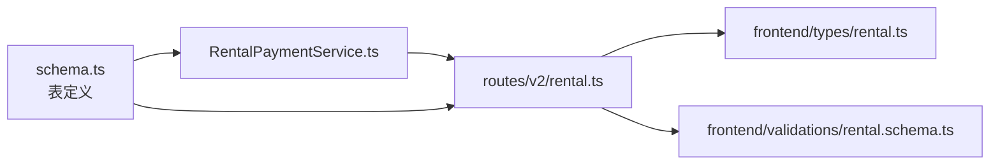

# 应付账单状态机模型

<cite>
**本文引用的文件**
- [schema.ts](file://backend/src/db/schema.ts)
- [RentalPaymentService.ts](file://backend/src/services/RentalPaymentService.ts)
- [rental.ts](file://backend/src/routes/v2/rental.ts)
- [business.schema.ts](file://backend/src/schemas/business.schema.ts)
- [common.schema.ts](file://backend/src/schemas/common.schema.ts)
- [rental.ts（前端类型）](file://frontend/src/types/rental.ts)
- [rental.schema.ts（前端验证）](file://frontend/src/validations/rental.schema.ts)
- [state-machine.ts](file://backend/src/utils/state-machine.ts)
</cite>

## 目录
1. [简介](#简介)
2. [项目结构](#项目结构)
3. [核心组件](#核心组件)
4. [架构总览](#架构总览)
5. [详细组件分析](#详细组件分析)
6. [依赖关系分析](#依赖关系分析)
7. [性能考量](#性能考量)
8. [故障排查指南](#故障排查指南)
9. [结论](#结论)
10. [附录](#附录)

## 简介
本文件聚焦于“rentalPayableBills”应付账单表的数据模型与状态机设计，系统性解析以下关键点：
- 状态字段 status 的未支付/已支付状态流转
- paidDate 与 paidPaymentId 在状态转换中的作用
- 关键业务字段的含义：billDate、dueDate、year、month、amountCents、paymentPeriodMonths
- 该表如何驱动租金提醒与支付流程
- 通过 propertyId 关联物业信息的机制
- 与 rentalPayments 表的关联关系与一致性约束

## 项目结构
围绕应付账单模型，涉及的核心文件与职责如下：
- 数据库模式定义：rentalPayableBills 表结构
- 业务服务：生成应付账单、标记已支付、创建付款并联动更新账单
- 路由接口：生成账单、查询账单、标记已支付
- 类型与校验：前后端对字段与状态的约束
- 状态机工具：通用的状态机抽象（虽未直接用于应付账单，但体现了状态机设计思想）

图表来源
- [schema.ts](file://backend/src/db/schema.ts#L656-L673)
- [RentalPaymentService.ts](file://backend/src/services/RentalPaymentService.ts#L244-L344)
- [rental.ts](file://backend/src/routes/v2/rental.ts#L717-L852)
- [business.schema.ts](file://backend/src/schemas/business.schema.ts#L626-L648)
- [common.schema.ts](file://backend/src/schemas/common.schema.ts#L226-L233)
- [rental.ts（前端类型）](file://frontend/src/types/rental.ts#L91-L111)
- [rental.schema.ts（前端验证）](file://frontend/src/validations/rental.schema.ts#L57-L67)

章节来源
- [schema.ts](file://backend/src/db/schema.ts#L656-L673)
- [RentalPaymentService.ts](file://backend/src/services/RentalPaymentService.ts#L244-L344)
- [rental.ts](file://backend/src/routes/v2/rental.ts#L717-L852)
- [business.schema.ts](file://backend/src/schemas/business.schema.ts#L626-L648)
- [common.schema.ts](file://backend/src/schemas/common.schema.ts#L226-L233)
- [rental.ts（前端类型）](file://frontend/src/types/rental.ts#L91-L111)
- [rental.schema.ts（前端验证）](file://frontend/src/validations/rental.schema.ts#L57-L67)

## 核心组件
- rentalPayableBills 表：存储每期应付租金账单，包含账单日期、到期日、计费年月、金额、状态及支付回写字段
- RentalPaymentService：负责生成应付账单、查询账单、标记已支付、以及创建付款时自动将对应账单标记为已支付
- 路由层：提供生成账单、查询账单、标记已支付的 API
- 类型与校验：前后端对字段与状态进行一致约束

章节来源
- [schema.ts](file://backend/src/db/schema.ts#L656-L673)
- [RentalPaymentService.ts](file://backend/src/services/RentalPaymentService.ts#L244-L344)
- [rental.ts](file://backend/src/routes/v2/rental.ts#L717-L852)

## 架构总览
应付账单状态机与支付流程的总体交互如下：

图表来源
- [RentalPaymentService.ts](file://backend/src/services/RentalPaymentService.ts#L244-L344)
- [RentalPaymentService.ts](file://backend/src/services/RentalPaymentService.ts#L113-L211)
- [schema.ts](file://backend/src/db/schema.ts#L605-L621)
- [schema.ts](file://backend/src/db/schema.ts#L656-L673)

## 详细组件分析

### 表结构与字段语义
- 表名：rentalPayableBills
- 关键字段与业务含义
  - propertyId：关联的物业ID，用于驱动提醒与支付流程
  - billDate：账单日期（通常早于到期日若干天，作为提醒节点）
  - dueDate：到期日（应付款截止日期）
  - year/month：计费期间（年/月）
  - amountCents：应付金额（以分为单位）
  - currency：币种
  - paymentPeriodMonths：付款周期（月），用于计算应付金额与下期账单时间推进
  - status：状态，枚举 unpaid/paid
  - paidDate：实际支付日期（当 status=paid 时写入）
  - paidPaymentId：关联的付款记录ID（当 status=paid 时写入）
  - memo/createdBy/createdAt/updatedAt：审计与备注字段

章节来源
- [schema.ts](file://backend/src/db/schema.ts#L656-L673)

### 状态机设计：status 字段的未支付/已支付流转
- 状态集合：unpaid、paid
- 允许的转换：
  - unpaid → paid（由系统生成账单或人工标记）
  - paid 不再允许回退至 unpaid（终态）
- paidDate 与 paidPaymentId 的作用
  - 当状态变为 paid 时，系统写入 paidDate（支付日期）与 paidPaymentId（关联的付款记录ID），形成账单与付款的一致性绑定
- 业务意义
  - 通过 paidDate 可追溯实际支付时间
  - 通过 paidPaymentId 可建立账单与付款的强关联，便于对账与审计

章节来源
- [RentalPaymentService.ts](file://backend/src/services/RentalPaymentService.ts#L191-L208)
- [RentalPaymentService.ts](file://backend/src/services/RentalPaymentService.ts#L373-L397)
- [schema.ts](file://backend/src/db/schema.ts#L656-L673)

### 生成应付账单：billDate/dueDate/year/month/amountCents/paymentPeriodMonths 的计算逻辑
- 生成时机：调用 generatePayableBills(userId)
- 关键步骤
  - 遍历所有状态为 active 且存在 leaseStartDate 的物业
  - 基于 paymentPeriodMonths 与 paymentDay 推算“下期应付日期”
  - 账单日期 = 下期应付日期 - 15 天（作为提醒窗口）
  - 到期日 = 下期应付日期
  - 年/月 = 下期应付日期的年/月
  - 金额计算：
    - 若 rentType=yearly：amountCents = round(yearlyRentCents / (12 / paymentPeriodMonths))
    - 若 rentType=monthly：amountCents = round(monthlyRentCents × paymentPeriodMonths)
  - 若同一年/月的 unpaid 账单已存在，则跳过
  - 插入一条 status=unpaid 的账单记录
- 业务意义
  - 自动化生成未来期次的应付账单，避免遗漏
  - 通过 paymentPeriodMonths 实现灵活的“多月合并计费”

图表来源
- [RentalPaymentService.ts](file://backend/src/services/RentalPaymentService.ts#L244-L344)

章节来源
- [RentalPaymentService.ts](file://backend/src/services/RentalPaymentService.ts#L244-L344)

### 支付流程联动：创建付款记录时自动标记账单为已支付
- 路径：创建付款记录 createPayment(...)
- 事务内执行
  - 插入一条 rentalPayments 记录
  - 更新对应 propertyId/year/month 且 status=unpaid 的 rentalPayableBills 为 paid，并写入 paidDate 与 paidPaymentId
- 业务意义
  - 保证账单与付款的一致性，避免重复支付或对账差异
  - 通过 paidPaymentId 可快速定位付款凭证

图表来源
- [RentalPaymentService.ts](file://backend/src/services/RentalPaymentService.ts#L113-L211)
- [schema.ts](file://backend/src/db/schema.ts#L605-L621)
- [schema.ts](file://backend/src/db/schema.ts#L656-L673)

章节来源
- [RentalPaymentService.ts](file://backend/src/services/RentalPaymentService.ts#L113-L211)

### 与 rentalPayments 的关联关系
- 关联键：rentalPayableBills.paidPaymentId ←→ rentalPayments.id
- 业务价值
  - 通过 paidPaymentId 可直接关联到付款记录，实现账单-付款双向追溯
  - 通过 propertyId 关联物业，实现按物业维度的提醒与统计

章节来源
- [schema.ts](file://backend/src/db/schema.ts#L605-L621)
- [schema.ts](file://backend/src/db/schema.ts#L656-L673)

### 与 propertyId 的关联与提醒机制
- propertyId 用于：
  - 关联 rentalProperties，获取物业名称、地址、房东等信息
  - 驱动提醒：billDate 作为提醒节点，dueDate 作为到期节点
- 前端类型中包含 propertyCode/propertyName 等字段，便于展示

章节来源
- [RentalPaymentService.ts](file://backend/src/services/RentalPaymentService.ts#L346-L371)
- [rental.ts（前端类型）](file://frontend/src/types/rental.ts#L91-L111)

### 前后端类型与校验
- 后端 Schema 对应付账单查询参数进行约束（propertyId/status/startDate/endDate）
- 前端类型定义了 RentalPayableBill 的字段结构，包括 status/paidDate/paidPaymentId 等
- 前端校验对创建/更新付款等字段进行约束，确保数据质量

章节来源
- [common.schema.ts](file://backend/src/schemas/common.schema.ts#L226-L233)
- [rental.ts（前端类型）](file://frontend/src/types/rental.ts#L91-L111)
- [rental.schema.ts（前端验证）](file://frontend/src/validations/rental.schema.ts#L57-L67)

## 依赖关系分析
- 模式依赖
  - rentalPayableBills 依赖 rentalProperties（propertyId 关联）
  - rentalPayments 与 rentalPayableBills 通过 paidPaymentId/paidDate/paidDate 建立间接关联
- 服务依赖
  - RentalPaymentService 依赖 schema.ts 中的表定义与 drizzle ORM
  - 路由层依赖 RentalPaymentService 与业务 Schema
- 前后端依赖
  - 前端类型与验证与后端 Schema 保持一致，确保字段与约束一致

图表来源
- [schema.ts](file://backend/src/db/schema.ts#L576-L621)
- [RentalPaymentService.ts](file://backend/src/services/RentalPaymentService.ts#L244-L344)
- [rental.ts](file://backend/src/routes/v2/rental.ts#L717-L852)
- [rental.ts（前端类型）](file://frontend/src/types/rental.ts#L91-L111)
- [rental.schema.ts（前端验证）](file://frontend/src/validations/rental.schema.ts#L57-L67)

章节来源
- [schema.ts](file://backend/src/db/schema.ts#L576-L621)
- [RentalPaymentService.ts](file://backend/src/services/RentalPaymentService.ts#L244-L344)
- [rental.ts](file://backend/src/routes/v2/rental.ts#L717-L852)

## 性能考量
- 生成账单的批量计算：按 active 且有起租日的物业逐条推算，注意在大规模物业场景下的循环开销
- 查询账单：按 dueDate 范围与 status 进行过滤，建议在 dueDate 上建立索引以提升查询效率
- 事务一致性：创建付款与更新账单在同一事务内完成，避免中间状态不一致
- 前端渲染：列表查询返回 propertyCode/propertyName 等字段，减少二次查询

[本节为通用指导，无需列出具体文件来源]

## 故障排查指南
- 无法生成账单
  - 检查物业状态是否为 active 且 leaseStartDate 存在
  - 检查 paymentPeriodMonths 与 paymentDay 是否合理
- 重复生成账单
  - 系统会在同一年/月存在 unpaid 账单时跳过生成，请确认是否已有对应账单
- 无法标记已支付
  - 若账单已为 paid，再次标记会报错；请先确认当前状态
- 付款后账单未更新
  - 确认 createPayment 的 propertyId/year/month 与账单匹配
  - 检查事务是否成功提交

章节来源
- [RentalPaymentService.ts](file://backend/src/services/RentalPaymentService.ts#L244-L344)
- [RentalPaymentService.ts](file://backend/src/services/RentalPaymentService.ts#L373-L397)

## 结论
- rentalPayableBills 通过 unpaid/paid 状态机实现了清晰的账单生命周期管理
- paidDate 与 paidPaymentId 的引入，确保了账单与付款的强关联与可追溯性
- 通过 billDate/dueDate/year/month/amountCents/paymentPeriodMonths 等字段，系统实现了自动化的应付账单生成与灵活的计费周期
- 与 rentalPayments 的关联关系完善了财务闭环，配合 propertyId 的关联，支撑了按物业维度的提醒与统计

[本节为总结性内容，无需列出具体文件来源]

## 附录

### 表定义示例（路径引用）
- rentalPayableBills 表定义路径：[schema.ts](file://backend/src/db/schema.ts#L656-L673)
- rentalPayments 表定义路径：[schema.ts](file://backend/src/db/schema.ts#L605-L621)

### API 示例（路径引用）
- 生成应付账单接口：[routes/v2/rental.ts](file://backend/src/routes/v2/rental.ts#L717-L763)
- 查询应付账单接口：[routes/v2/rental.ts](file://backend/src/routes/v2/rental.ts#L765-L815)
- 标记账单已支付接口：[routes/v2/rental.ts](file://backend/src/routes/v2/rental.ts#L817-L852)
- 创建付款记录接口：[routes/v2/rental.ts](file://backend/src/routes/v2/rental.ts#L538-L614)