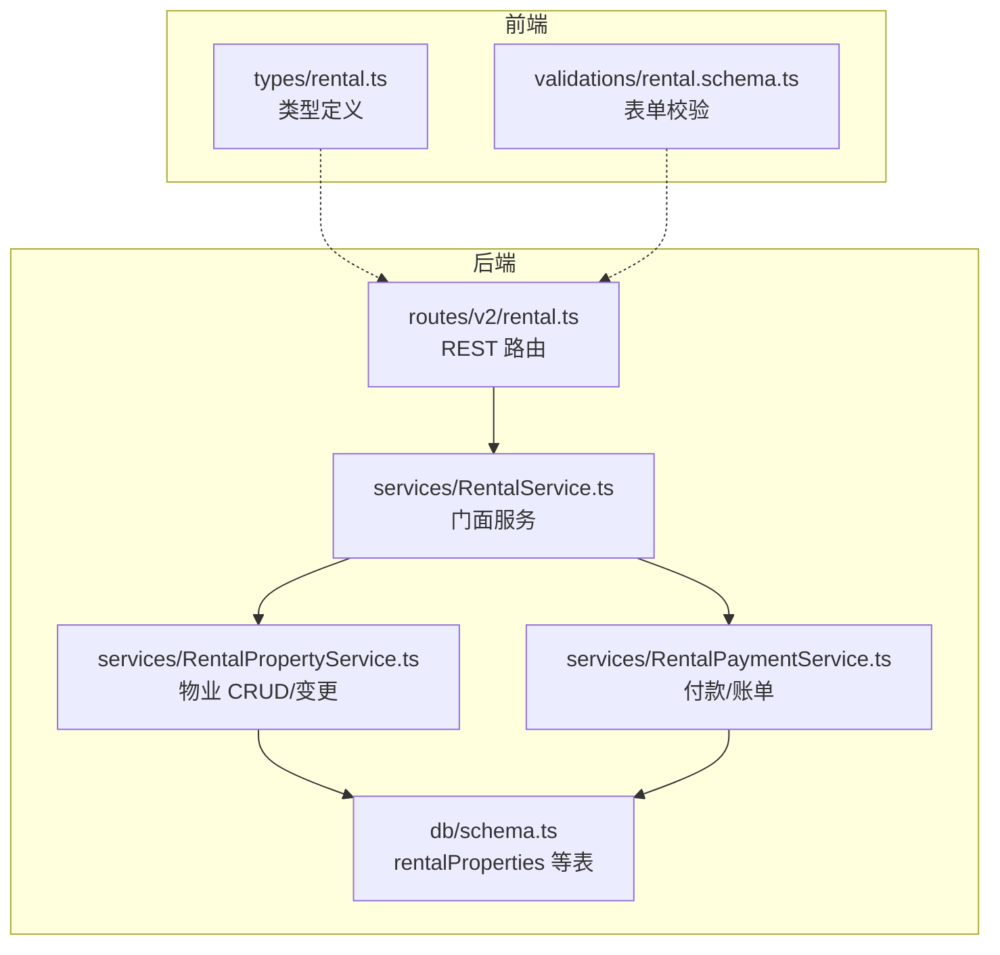
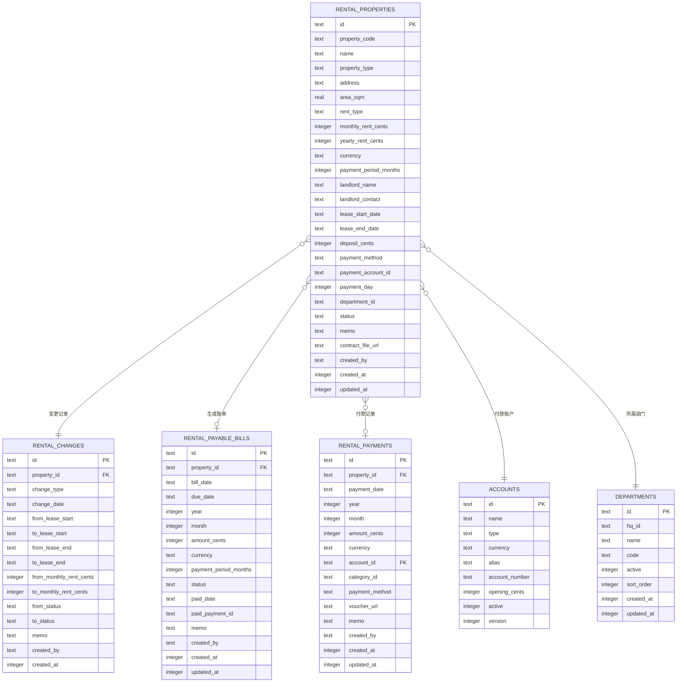
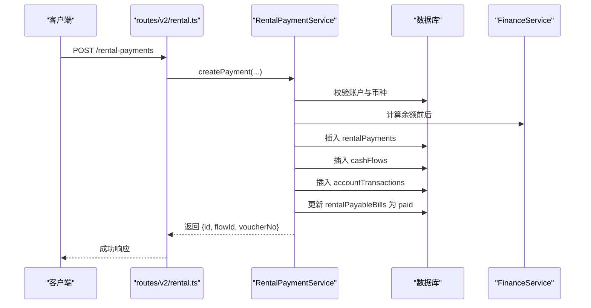
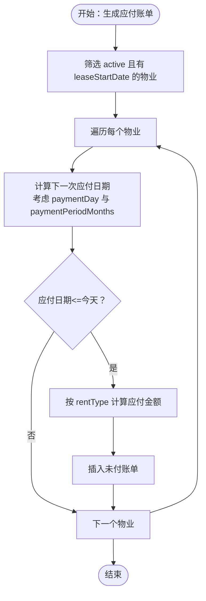
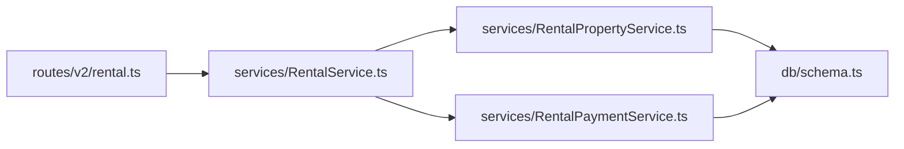

# 物业信息模型

<cite>
**本文引用的文件**
- [schema.ts](file://backend/src/db/schema.ts)
- [RentalPropertyService.ts](file://backend/src/services/RentalPropertyService.ts)
- [RentalService.ts](file://backend/src/services/RentalService.ts)
- [RentalPaymentService.ts](file://backend/src/services/RentalPaymentService.ts)
- [rental.ts（后端路由）](file://backend/src/routes/v2/rental.ts)
- [rental.ts（前端类型）](file://frontend/src/types/rental.ts)
- [rental.schema.ts（前端校验）](file://frontend/src/validations/rental.schema.ts)
- [business.schema.ts](file://backend/src/schemas/business.schema.ts)
- [rental.test.ts（测试）](file://backend/test/routes/rental.test.ts)
</cite>

## 目录
1. [简介](#简介)
2. [项目结构](#项目结构)
3. [核心组件](#核心组件)
4. [架构总览](#架构总览)
5. [详细组件分析](#详细组件分析)
6. [依赖关系分析](#依赖关系分析)
7. [性能考量](#性能考量)
8. [故障排查指南](#故障排查指南)
9. [结论](#结论)
10. [附录](#附录)

## 简介
本文件系统性梳理并文档化“rentalProperties”表的数据模型，覆盖字段定义、业务含义、与财务流程的集成方式，以及如何通过表结构支撑租赁合同全生命周期管理。重点说明：
- 字段清单与约束：propertyCode、name、propertyType、address、areaSqm、rentType、monthlyRentCents/yearlyRentCents、lease周期、depositCents、paymentDay、paymentPeriodMonths、contractFileUrl、paymentAccountId、status 等
- 生命周期管理：通过 status 字段跟踪物业状态（active/inactive），通过 rentalChanges 记录关键字段变更
- 财务集成：paymentAccountId 关联财务账户，生成应付账单与付款记录时联动现金流与会计分录
- 分期付款场景：paymentPeriodMonths 在应付账单生成与金额计算中的作用

## 项目结构
围绕“rentalProperties”表的关键文件分布如下：
- 数据库模式定义：backend/src/db/schema.ts
- 业务服务层：RentalPropertyService、RentalService、RentalPaymentService
- 路由与接口：backend/src/routes/v2/rental.ts
- 前端类型与校验：frontend/src/types/rental.ts、frontend/src/validations/rental.schema.ts
- 通用业务 Schema：backend/src/schemas/business.schema.ts
- 测试：backend/test/routes/rental.test.ts

图表来源
- [rental.ts（后端路由）](file://backend/src/routes/v2/rental.ts#L1-L120)
- [RentalService.ts](file://backend/src/services/RentalService.ts#L1-L60)
- [RentalPropertyService.ts](file://backend/src/services/RentalPropertyService.ts#L1-L60)
- [RentalPaymentService.ts](file://backend/src/services/RentalPaymentService.ts#L1-L60)
- [schema.ts](file://backend/src/db/schema.ts#L576-L603)
- [rental.ts（前端类型）](file://frontend/src/types/rental.ts#L1-L60)
- [rental.schema.ts（前端校验）](file://frontend/src/validations/rental.schema.ts#L1-L40)

章节来源
- [schema.ts](file://backend/src/db/schema.ts#L576-L603)
- [RentalPropertyService.ts](file://backend/src/services/RentalPropertyService.ts#L1-L60)
- [RentalService.ts](file://backend/src/services/RentalService.ts#L1-L60)
- [RentalPaymentService.ts](file://backend/src/services/RentalPaymentService.ts#L1-L60)
- [rental.ts（后端路由）](file://backend/src/routes/v2/rental.ts#L1-L120)
- [rental.ts（前端类型）](file://frontend/src/types/rental.ts#L1-L60)
- [rental.schema.ts（前端校验）](file://frontend/src/validations/rental.schema.ts#L1-L40)

## 核心组件
- rentalProperties 表：承载物业基本信息、计租规则、合同周期、押金、付款安排与状态
- rentalChanges 表：记录关键字段变更历史，用于审计与追溯
- rentalPayableBills 表：基于租赁周期与 paymentPeriodMonths 自动生成应付账单
- rentalPayments 表：实际付款记录，与 cashFlows、accountTransactions 集成财务流水
- 服务层：
  - RentalPropertyService：负责物业 CRUD、变更记录
  - RentalService：门面服务，聚合属性、付款、分配等查询
  - RentalPaymentService：负责账单生成、付款创建与财务入账

章节来源
- [schema.ts](file://backend/src/db/schema.ts#L576-L673)
- [RentalPropertyService.ts](file://backend/src/services/RentalPropertyService.ts#L1-L120)
- [RentalService.ts](file://backend/src/services/RentalService.ts#L1-L60)
- [RentalPaymentService.ts](file://backend/src/services/RentalPaymentService.ts#L1-L120)

## 架构总览
下图展示“rentalProperties”表与其相关表之间的关系，以及与服务层的交互。

图表来源
- [schema.ts](file://backend/src/db/schema.ts#L576-L673)

章节来源
- [schema.ts](file://backend/src/db/schema.ts#L576-L673)

## 详细组件分析

### 字段定义与业务语义
以下字段均来自 rentalProperties 表，结合服务层与路由逻辑进行说明：

- propertyCode（物业编码）：唯一标识，创建时校验重复
- name（名称）：物业名称
- propertyType（物业类型）：支持 office、dormitory、warehouse、other；前端类型定义包含 office、dormitory
- address（地址）：物理地址
- areaSqm（面积）：单位平方米
- rentType（租金类型）：monthly 或 yearly
- monthlyRentCents/yearlyRentCents（租金金额）：以“分”为最小单位；根据 rentType 进行校验
- leaseStartDate/leaseEndDate（租赁周期）：合同起止日期，用于账单生成与到期判断
- depositCents（押金）：以“分”为单位
- paymentDay（付款日）：每月固定付款日，默认 1
- paymentPeriodMonths（付款周期）：默认 1，表示按月或按多个月周期计费
- currency（币种）：三字母代码
- paymentAccountId（付款账户）：关联财务账户，用于付款与入账
- departmentId（部门）：仅当 propertyType 为 office 时允许设置
- status（状态）：active/inactive；生成账单时仅对 active 且有 leaseStartDate 的物业生效
- contractFileUrl（合同文件）：合同电子版链接
- memo（备注）、createdBy/createdAt/updatedAt（审计字段）

章节来源
- [schema.ts](file://backend/src/db/schema.ts#L576-L603)
- [business.schema.ts](file://backend/src/schemas/business.schema.ts#L90-L142)
- [rental.schema.ts（前端校验）](file://frontend/src/validations/rental.schema.ts#L1-L40)
- [rental.ts（前端类型）](file://frontend/src/types/rental.ts#L1-L60)

### 租赁合同全生命周期管理
- 物业状态跟踪
  - status 字段控制是否参与账单生成与后续流程
  - 关键字段变更（如 status、monthlyRentCents、leaseStartDate/End、rentType）会写入 rentalChanges 表
- 合同文件存储
  - contractFileUrl 字段保存合同文件 URL
- 与财务账户关联
  - paymentAccountId 指向 accounts 表，确保付款账户有效且币种一致

章节来源
- [RentalPropertyService.ts](file://backend/src/services/RentalPropertyService.ts#L158-L211)
- [RentalPaymentService.ts](file://backend/src/services/RentalPaymentService.ts#L53-L120)
- [schema.ts](file://backend/src/db/schema.ts#L576-L603)

### 应付账单生成与付款流程
- 账单生成（generatePayableBills）
  - 仅对 status=active 且 leaseStartDate 存在的物业
  - 基于 lease 周期、paymentDay 与 paymentPeriodMonths 推算下一次应付日期
  - 根据 rentType 计算应付金额：年租按比例折算为多月金额，月租按 paymentPeriodMonths 累加
- 付款创建（createPayment）
  - 校验账户有效性与币种一致性
  - 事务内写入 rentalPayments，并生成 cashFlows 与 accountTransactions
  - 同步更新对应应付账单为 paid 状态

图表来源
- [rental.ts（后端路由）](file://backend/src/routes/v2/rental.ts#L538-L614)
- [RentalPaymentService.ts](file://backend/src/services/RentalPaymentService.ts#L53-L211)

章节来源
- [RentalPaymentService.ts](file://backend/src/services/RentalPaymentService.ts#L244-L344)
- [RentalPaymentService.ts](file://backend/src/services/RentalPaymentService.ts#L53-L211)
- [rental.ts（后端路由）](file://backend/src/routes/v2/rental.ts#L538-L614)

### paymentPeriodMonths 在分期付款场景中的应用
- 生成账单时，按 paymentPeriodMonths 推算应付周期并计算应付金额
- 年租模式下，将年租金按 12 月折算为多月金额
- 月租模式下，按 paymentPeriodMonths 累加月租

图表来源
- [RentalPaymentService.ts](file://backend/src/services/RentalPaymentService.ts#L244-L344)

章节来源
- [RentalPaymentService.ts](file://backend/src/services/RentalPaymentService.ts#L244-L344)

### 代码示例路径（表结构定义）
- rentalProperties 表定义：[schema.ts](file://backend/src/db/schema.ts#L576-L603)
- rentalPayableBills 表定义：[schema.ts](file://backend/src/db/schema.ts#L656-L673)
- rentalPayments 表定义：[schema.ts](file://backend/src/db/schema.ts#L605-L621)
- rentalChanges 表定义：[schema.ts](file://backend/src/db/schema.ts#L623-L640)

章节来源
- [schema.ts](file://backend/src/db/schema.ts#L576-L673)

### 前后端类型与校验
- 前端类型定义：RentalProperty、DormitoryAllocation、RentalPayment、RentalPayableBill
- 前端校验规则：propertyType、rentType、金额非负、日期合法性、币种长度等

章节来源
- [rental.ts（前端类型）](file://frontend/src/types/rental.ts#L1-L144)
- [rental.schema.ts（前端校验）](file://frontend/src/validations/rental.schema.ts#L1-L83)
- [business.schema.ts](file://backend/src/schemas/business.schema.ts#L90-L142)

## 依赖关系分析
- 路由层依赖服务层，服务层依赖数据库模式与工具类
- 服务层内部协作：RentalService 作为门面，委托 RentalPropertyService 与 RentalPaymentService
- 财务集成：RentalPaymentService 在事务中写入 rentalPayments、cashFlows、accountTransactions

图表来源
- [rental.ts（后端路由）](file://backend/src/routes/v2/rental.ts#L1-L60)
- [RentalService.ts](file://backend/src/services/RentalService.ts#L1-L60)
- [RentalPropertyService.ts](file://backend/src/services/RentalPropertyService.ts#L1-L60)
- [RentalPaymentService.ts](file://backend/src/services/RentalPaymentService.ts#L1-L60)
- [schema.ts](file://backend/src/db/schema.ts#L576-L673)

章节来源
- [rental.ts（后端路由）](file://backend/src/routes/v2/rental.ts#L1-L120)
- [RentalService.ts](file://backend/src/services/RentalService.ts#L1-L60)
- [RentalPropertyService.ts](file://backend/src/services/RentalPropertyService.ts#L1-L60)
- [RentalPaymentService.ts](file://backend/src/services/RentalPaymentService.ts#L1-L60)
- [schema.ts](file://backend/src/db/schema.ts#L576-L673)

## 性能考量
- 索引与查询
  - rentalProperties：建议对 propertyCode、status、departmentId 建立索引以提升查询效率
  - rentalPayments：按 propertyId/year/month 维度查询频繁，可考虑复合索引
  - rentalPayableBills：按 propertyId/status/dueDate 查询频繁，建议相应索引
- 事务边界
  - 付款创建涉及多表写入，采用事务保证一致性，避免跨表数据不一致
- 分页与排序
  - 列表查询按时间倒序，前端分页时建议使用游标分页减少偏移量带来的性能问题

[本节为通用指导，无需具体文件引用]

## 故障排查指南
- 创建物业时报错“重复的物业代码”
  - 检查 propertyCode 是否唯一；服务层在创建前进行唯一性校验
- 更新物业关键字段导致异常
  - 关键字段变更会写入 rentalChanges；若变更异常，检查变更记录与业务规则
- 生成应付账单未产生记录
  - 确认物业 status=active 且 leaseStartDate 存在；paymentPeriodMonths 合法；paymentDay 与当前日期推算逻辑
- 付款创建失败
  - 检查 paymentAccountId 对应账户是否存在、是否启用、币种是否匹配；rentalPayments 是否已存在当月记录

章节来源
- [RentalPropertyService.ts](file://backend/src/services/RentalPropertyService.ts#L111-L156)
- [RentalPropertyService.ts](file://backend/src/services/RentalPropertyService.ts#L158-L211)
- [RentalPaymentService.ts](file://backend/src/services/RentalPaymentService.ts#L244-L344)
- [RentalPaymentService.ts](file://backend/src/services/RentalPaymentService.ts#L53-L120)

## 结论
rentalProperties 表通过清晰的字段设计与配套的变更记录、账单与付款流程，完整支撑了租赁合同的全生命周期管理。paymentPeriodMonths 在分期付款场景中扮演关键角色，既影响账单生成周期，也决定应付金额的计算方式。配合 paymentAccountId 与财务流水表，实现了从合同到付款的闭环管理。

[本节为总结，无需具体文件引用]

## 附录

### 字段对照表
- propertyCode：唯一编码
- name：名称
- propertyType：office/dormitory/warehouse/other
- address：地址
- areaSqm：面积（平方米）
- rentType：monthly/yearly
- monthlyRentCents/yearlyRentCents：租金（分）
- leaseStartDate/leaseEndDate：租赁周期
- depositCents：押金（分）
- paymentDay：付款日
- paymentPeriodMonths：付款周期（月）
- currency：币种
- paymentAccountId：付款账户
- departmentId：部门（仅 office 类型）
- status：active/inactive
- contractFileUrl：合同文件 URL
- memo、createdBy、createdAt、updatedAt：审计字段

章节来源
- [schema.ts](file://backend/src/db/schema.ts#L576-L603)
- [business.schema.ts](file://backend/src/schemas/business.schema.ts#L90-L142)
- [rental.ts（前端类型）](file://frontend/src/types/rental.ts#L1-L60)
- [rental.schema.ts（前端校验）](file://frontend/src/validations/rental.schema.ts#L1-L40)