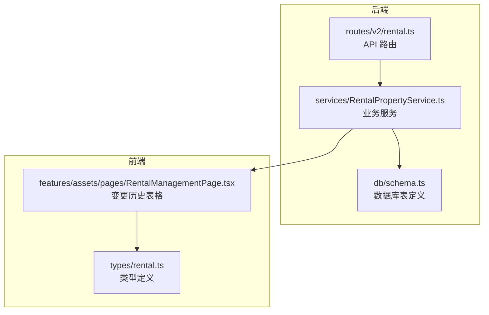
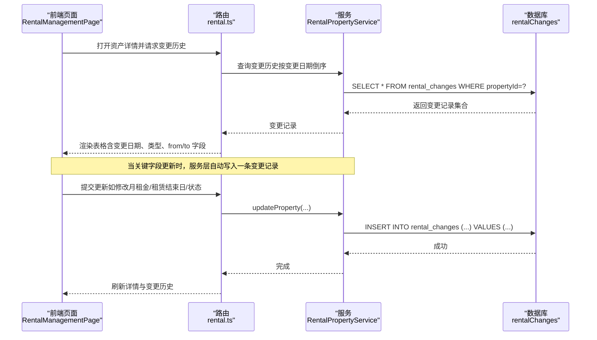
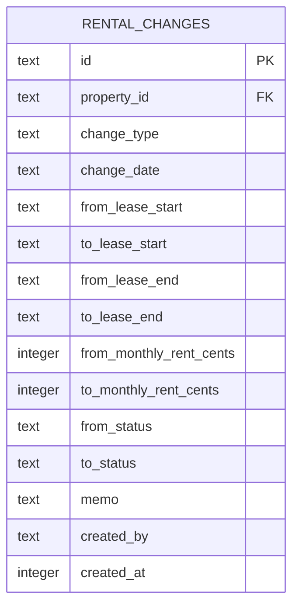
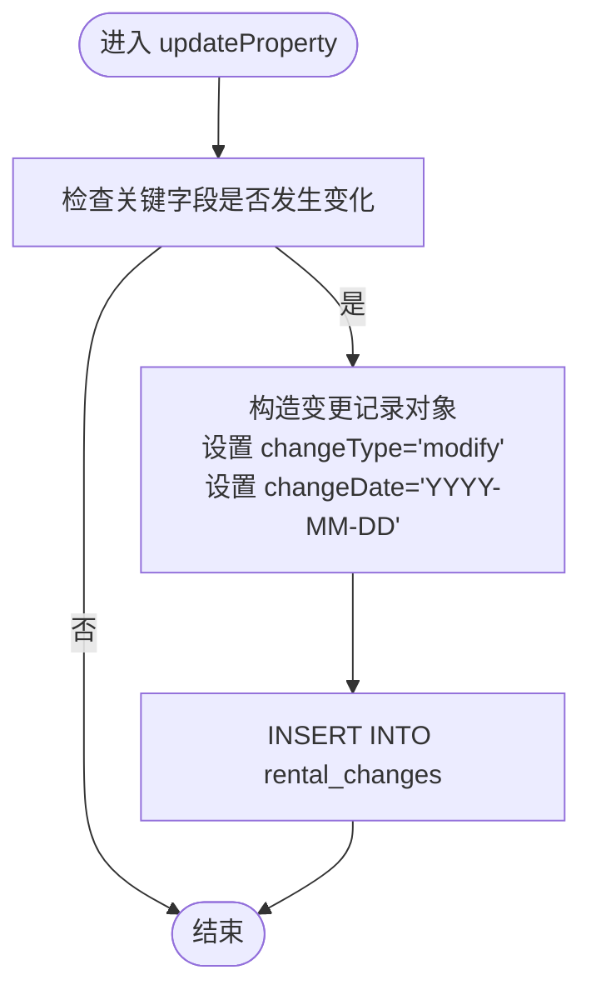
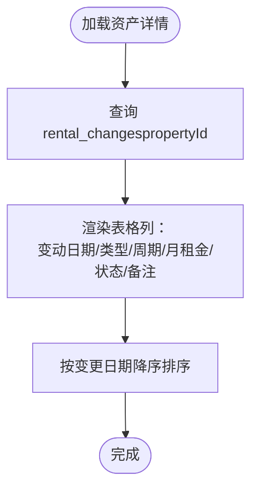
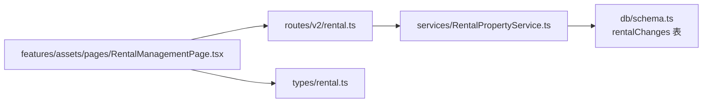

# 租赁变更历史模型

<cite>
**本文引用的文件**
- [backend/src/db/schema.ts](file://backend/src/db/schema.ts)
- [backend/src/services/RentalPropertyService.ts](file://backend/src/services/RentalPropertyService.ts)
- [backend/src/routes/v2/rental.ts](file://backend/src/routes/v2/rental.ts)
- [frontend/src/types/rental.ts](file://frontend/src/types/rental.ts)
- [frontend/src/features/assets/pages/RentalManagementPage.tsx](file://frontend/src/features/assets/pages/RentalManagementPage.tsx)
</cite>

## 目录
1. [简介](#简介)
2. [项目结构](#项目结构)
3. [核心组件](#核心组件)
4. [架构总览](#架构总览)
5. [详细组件分析](#详细组件分析)
6. [依赖关系分析](#依赖关系分析)
7. [性能考量](#性能考量)
8. [故障排查指南](#故障排查指南)
9. [结论](#结论)

## 简介
本文件系统性阐述“rentalChanges”表的数据模型与版本化管理机制，围绕变更类型（changeType）、变更日期（changeDate）以及 from/to 字段对（如租赁周期、月租金、状态等）进行结构化说明。重点解释该表如何通过记录变更前后状态差异，构建完整的审计轨迹；并结合合同续约、租金调整等业务场景，给出实现路径与可视化流程图，帮助读者快速理解与落地。

## 项目结构
- 后端数据库层：定义了 rentalChanges 表结构，包含主键、外键关联属性、变更类型与日期、以及多组 from/to 字段。
- 业务服务层：RentalPropertyService 在关键字段更新时自动写入变更记录，形成版本化审计。
- 前端展示层：RentalManagementPage 展示变更历史，按日期排序，支持从后端返回的 snake_case 或前端兼容字段渲染。

图表来源
- [backend/src/routes/v2/rental.ts](file://backend/src/routes/v2/rental.ts#L255-L285)
- [backend/src/services/RentalPropertyService.ts](file://backend/src/services/RentalPropertyService.ts#L158-L211)
- [backend/src/db/schema.ts](file://backend/src/db/schema.ts#L623-L639)
- [frontend/src/features/assets/pages/RentalManagementPage.tsx](file://frontend/src/features/assets/pages/RentalManagementPage.tsx#L936-L1031)
- [frontend/src/types/rental.ts](file://frontend/src/types/rental.ts#L113-L142)

章节来源
- [backend/src/db/schema.ts](file://backend/src/db/schema.ts#L623-L639)
- [backend/src/services/RentalPropertyService.ts](file://backend/src/services/RentalPropertyService.ts#L158-L211)
- [frontend/src/features/assets/pages/RentalManagementPage.tsx](file://frontend/src/features/assets/pages/RentalManagementPage.tsx#L936-L1031)

## 核心组件
- 数据模型：rentalChanges 表用于记录租赁资产的每次关键变更，包括变更类型、变更日期、以及多组 from/to 字段对。
- 业务服务：当租赁资产的关键字段发生变更时，服务层自动插入一条变更记录，确保审计可追溯。
- 前端展示：页面以表格形式展示变更历史，支持按日期排序与类型推断。

章节来源
- [backend/src/db/schema.ts](file://backend/src/db/schema.ts#L623-L639)
- [backend/src/services/RentalPropertyService.ts](file://backend/src/services/RentalPropertyService.ts#L178-L210)
- [frontend/src/features/assets/pages/RentalManagementPage.tsx](file://frontend/src/features/assets/pages/RentalManagementPage.tsx#L936-L1031)

## 架构总览
下图展示了从 API 请求到服务层写入数据库，再到前端渲染变更历史的完整流程。

图表来源
- [backend/src/routes/v2/rental.ts](file://backend/src/routes/v2/rental.ts#L255-L285)
- [backend/src/services/RentalPropertyService.ts](file://backend/src/services/RentalPropertyService.ts#L158-L211)
- [frontend/src/features/assets/pages/RentalManagementPage.tsx](file://frontend/src/features/assets/pages/RentalManagementPage.tsx#L936-L1031)

## 详细组件分析

### 数据模型：rentalChanges 表
- 主键与外键
  - id：主键，唯一标识一次变更记录。
  - propertyId：外键，指向 rental_properties 的 id，表示该变更属于哪条资产。
- 变更元数据
  - changeType：变更类型，枚举值包括 modify、renew、terminate、transfer 等。
  - changeDate：变更日期，字符串格式（YYYY-MM-DD），用于时间线排序。
- 关键字段对（from/to）
  - 租赁周期：fromLeaseStart/toLeaseStart、fromLeaseEnd/toLeaseEnd
  - 月租金：fromMonthlyRentCents/toMonthlyRentCents（单位为分）
  - 状态：fromStatus/toStatus（如 active/expired/terminated）
- 其他字段
  - memo：备注
  - createdBy：创建者
  - createdAt：创建时间戳

图表来源
- [backend/src/db/schema.ts](file://backend/src/db/schema.ts#L623-L639)

章节来源
- [backend/src/db/schema.ts](file://backend/src/db/schema.ts#L623-L639)

### 业务服务：变更记录写入逻辑
- 触发条件
  - 当以下任一关键字段发生变更时，服务层会写入一条变更记录：
    - status
    - monthlyRentCents
    - yearlyRentCents
    - rentType
    - leaseStartDate
    - leaseEndDate
- 写入字段映射
  - changeType 固定为 modify（当前实现）
  - changeDate 使用当前日期（YYYY-MM-DD）
  - fromXxx 与 toXxx 字段分别取自更新前与更新后的值
  - memo、createdBy、createdAt 由调用方传入或服务层填充

图表来源
- [backend/src/services/RentalPropertyService.ts](file://backend/src/services/RentalPropertyService.ts#L178-L210)

章节来源
- [backend/src/services/RentalPropertyService.ts](file://backend/src/services/RentalPropertyService.ts#L178-L210)

### 前端展示：变更历史表格
- 字段映射
  - 变动日期：优先显示 change_date，否则回退到 changedAt
  - 变动类型：若存在 change_type，则按 renew/terminate/modify/transfer 显示中文；否则根据 from/to 状态或结束日推断类型
  - 租赁周期：原/新 租赁开始/结束日期
  - 月租金：原/新 月租金（分）
  - 状态：原/新 状态
  - 备注：memo
- 排序规则
  - 按变更日期降序排列，便于查看最新变更

图表来源
- [frontend/src/features/assets/pages/RentalManagementPage.tsx](file://frontend/src/features/assets/pages/RentalManagementPage.tsx#L936-L1031)
- [backend/src/services/RentalPropertyService.ts](file://backend/src/services/RentalPropertyService.ts#L241-L248)

章节来源
- [frontend/src/features/assets/pages/RentalManagementPage.tsx](file://frontend/src/features/assets/pages/RentalManagementPage.tsx#L936-L1031)
- [backend/src/services/RentalPropertyService.ts](file://backend/src/services/RentalPropertyService.ts#L241-L248)

### 类型定义：前端接口契约
- 前端类型 RentalPropertyChange 包含：
  - propertyId、from/to 字段对（名称、地址、面积、租金类型、月租金、付款周期、币种、起止日期、状态）
  - memo、contractFileUrl、changedBy、changedByName、changedAt
- 该类型用于前端表格渲染与兼容后端返回的 snake_case 字段

章节来源
- [frontend/src/types/rental.ts](file://frontend/src/types/rental.ts#L113-L142)

## 依赖关系分析
- 路由层依赖服务层：路由处理请求并调用服务方法获取/写入数据。
- 服务层依赖数据库层：通过 Drizzle ORM 对 rentalChanges 表进行查询与插入。
- 前端依赖类型定义与页面组件：表格列渲染依赖 RentalPropertyChange 类型与页面逻辑。

图表来源
- [backend/src/routes/v2/rental.ts](file://backend/src/routes/v2/rental.ts#L255-L285)
- [backend/src/services/RentalPropertyService.ts](file://backend/src/services/RentalPropertyService.ts#L158-L211)
- [backend/src/db/schema.ts](file://backend/src/db/schema.ts#L623-L639)
- [frontend/src/features/assets/pages/RentalManagementPage.tsx](file://frontend/src/features/assets/pages/RentalManagementPage.tsx#L936-L1031)
- [frontend/src/types/rental.ts](file://frontend/src/types/rental.ts#L113-L142)

章节来源
- [backend/src/routes/v2/rental.ts](file://backend/src/routes/v2/rental.ts#L255-L285)
- [backend/src/services/RentalPropertyService.ts](file://backend/src/services/RentalPropertyService.ts#L158-L211)
- [backend/src/db/schema.ts](file://backend/src/db/schema.ts#L623-L639)
- [frontend/src/features/assets/pages/RentalManagementPage.tsx](file://frontend/src/features/assets/pages/RentalManagementPage.tsx#L936-L1031)
- [frontend/src/types/rental.ts](file://frontend/src/types/rental.ts#L113-L142)

## 性能考量
- 查询排序：按变更日期降序，索引建议在 change_date 上建立索引以提升排序与筛选性能。
- 写入频率：仅在关键字段变更时写入，避免频繁写入导致的性能压力。
- 前端渲染：表格分页与列宽控制有助于大数据量下的渲染性能。

## 故障排查指南
- 未见变更记录
  - 检查 updateProperty 是否触发了关键字段变更判断
  - 确认 changeType 是否为 modify（当前实现固定）
- 日期显示异常
  - 确认后端返回字段为 change_date 或前端回退到 changedAt
- 类型推断不准确
  - 若 change_type 缺失，系统会基于状态与结束日推断类型，检查 from/to 状态与结束日是否正确

章节来源
- [backend/src/services/RentalPropertyService.ts](file://backend/src/services/RentalPropertyService.ts#L178-L210)
- [frontend/src/features/assets/pages/RentalManagementPage.tsx](file://frontend/src/features/assets/pages/RentalManagementPage.tsx#L936-L1031)

## 结论
rentalChanges 表通过“变更类型 + 变更日期 + 多组 from/to 字段对”的设计，实现了对租赁资产关键维度的版本化追踪。服务层在关键字段更新时自动写入审计记录，前端以表格形式直观展示变更历史，支持按日期排序与类型推断。该方案适用于合同续约、租金调整、状态变更等业务场景，能够有效支撑审计与合规需求。