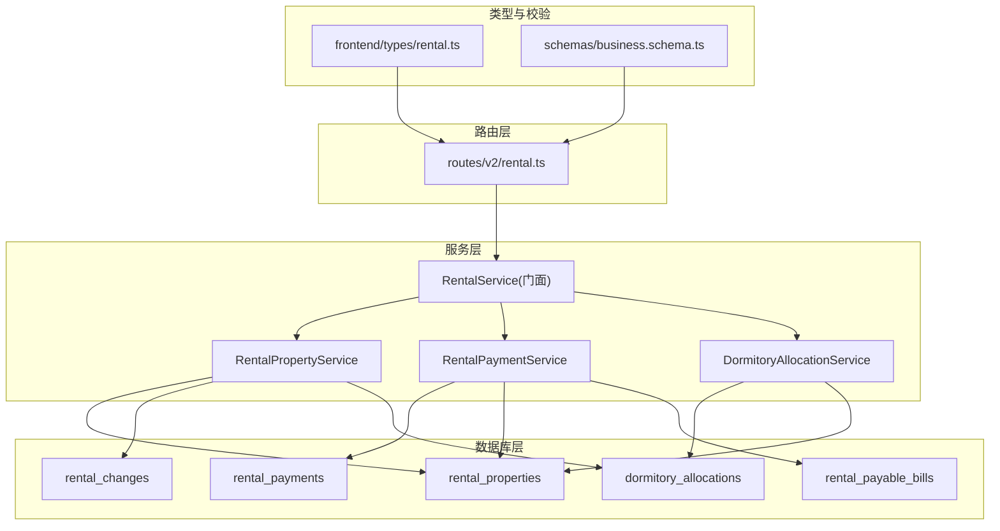
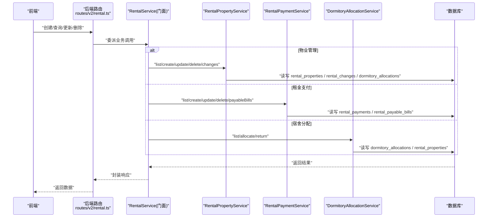
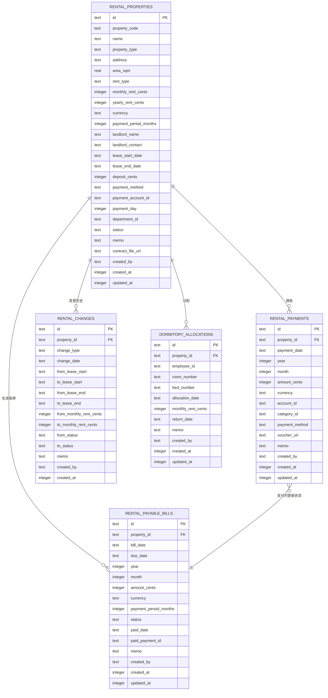
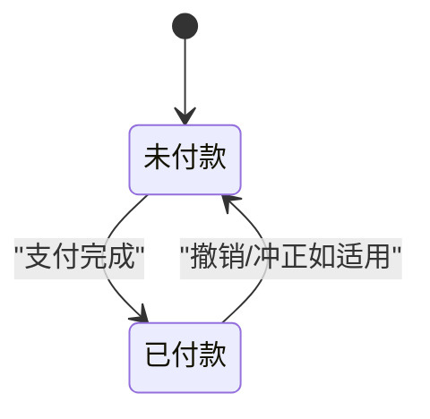
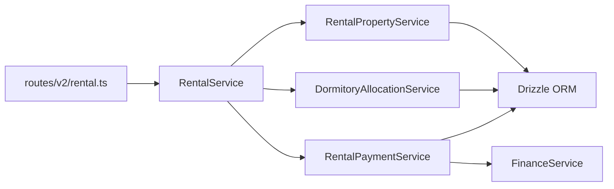

# 租赁管理数据模型

<cite>
**本文引用的文件**
- [schema.ts](file://backend/src/db/schema.ts)
- [schema.sql](file://backend/src/db/schema.sql)
- [RentalPropertyService.ts](file://backend/src/services/RentalPropertyService.ts)
- [RentalPaymentService.ts](file://backend/src/services/RentalPaymentService.ts)
- [DormitoryAllocationService.ts](file://backend/src/services/DormitoryAllocationService.ts)
- [RentalService.ts](file://backend/src/services/RentalService.ts)
- [rental.ts（后端路由）](file://backend/src/routes/v2/rental.ts)
- [rental.ts（前端类型）](file://frontend/src/types/rental.ts)
- [business.schema.ts](file://backend/src/schemas/business.schema.ts)
- [0000_snapshot.json](file://backend/drizzle/meta/0000_snapshot.json)
</cite>

## 目录
1. [引言](#引言)
2. [项目结构](#项目结构)
3. [核心组件](#核心组件)
4. [架构总览](#架构总览)
5. [详细组件分析](#详细组件分析)
6. [依赖分析](#依赖分析)
7. [性能考虑](#性能考虑)
8. [故障排查指南](#故障排查指南)
9. [结论](#结论)
10. [附录](#附录)

## 引言
本文件系统化梳理租赁管理数据模型，聚焦以下五张核心表：
- rentalProperties：物业信息（含属性类型、计租方式、周期、金额、合同与付款账户等）
- rentalPayments：付款记录（按年/月聚合）
- rentalChanges：合同变更历史（起止时间、租金、状态等）
- dormitoryAllocations：宿舍分配（房间/床铺、分配/归还、月租）
- rentalPayableBills：应付账单（账单日、到期日、周期、状态机 unpaid/paid）

文档解释各表结构、字段语义、约束与索引策略，并通过服务层与路由层展示如何协同支撑“租赁合同管理、租金支付、宿舍分配”三大核心功能。同时给出表定义的代码路径，便于快速定位实现。

## 项目结构
围绕租赁管理的数据模型与服务层组织如下：
- 数据模型定义：backend/src/db/schema.ts 与 backend/src/db/schema.sql
- 服务层：RentalPropertyService、RentalPaymentService、DormitoryAllocationService
- 门面服务：RentalService 组合上述服务
- 路由层：/backend/src/routes/v2/rental.ts 提供 CRUD 与业务流程接口
- 类型定义：frontend/src/types/rental.ts 描述前端交互数据结构
- 校验 Schema：backend/src/schemas/business.schema.ts 定义请求体校验规则
- Drizzle 迁移快照：backend/drizzle/meta/0000_snapshot.json 映射列名与类型

图表来源
- [schema.ts](file://backend/src/db/schema.ts#L576-L673)
- [RentalPropertyService.ts](file://backend/src/services/RentalPropertyService.ts#L1-L291)
- [RentalPaymentService.ts](file://backend/src/services/RentalPaymentService.ts#L1-L400)
- [DormitoryAllocationService.ts](file://backend/src/services/DormitoryAllocationService.ts#L1-L177)
- [RentalService.ts](file://backend/src/services/RentalService.ts#L1-L100)
- [rental.ts（后端路由）](file://backend/src/routes/v2/rental.ts#L1-L852)
- [business.schema.ts](file://backend/src/schemas/business.schema.ts#L90-L142)

章节来源
- [schema.ts](file://backend/src/db/schema.ts#L576-L673)
- [RentalService.ts](file://backend/src/services/RentalService.ts#L1-L100)
- [rental.ts（后端路由）](file://backend/src/routes/v2/rental.ts#L1-L852)

## 核心组件
本节对五张表进行结构与关系解析，并结合服务层方法说明其协作方式。

- rentalProperties（物业）
  - 关键字段：propertyCode、name、propertyType、address、areaSqm、rentType、monthlyRentCents、yearlyRentCents、currency、paymentPeriodMonths、landlordName、landlordContact、leaseStartDate、leaseEndDate、depositCents、paymentMethod、paymentAccountId、paymentDay、departmentId、status、memo、contractFileUrl、createdBy、createdAt、updatedAt
  - 作用：承载所有租赁物业的基础信息，决定计租周期、付款周期、币种与付款账户等
  - 服务关联：RentalPropertyService 提供查询、创建、更新、删除、变更记录查询与创建

- rentalPayments（付款记录）
  - 关键字段：propertyId、paymentDate、year、month、amountCents、currency、accountId、categoryId、paymentMethod、voucherUrl、memo、createdBy、createdAt、updatedAt
  - 作用：记录每笔租金支付，按年/月聚合，与应付账单联动
  - 服务关联：RentalPaymentService 提供查询、创建（事务内写入现金流与会计分录）、更新、删除

- rentalChanges（合同变更历史）
  - 关键字段：propertyId、changeType、changeDate、fromLeaseStart、toLeaseStart、fromLeaseEnd、toLeaseEnd、fromMonthlyRentCents、toMonthlyRentCents、fromStatus、toStatus、memo、createdBy、createdAt
  - 作用：追踪合同关键字段变更，支持审计与回溯
  - 服务关联：RentalPropertyService 提供变更记录查询与创建

- dormitoryAllocations（宿舍分配）
  - 关键字段：propertyId、employeeId、roomNumber、bedNumber、allocationDate、monthlyRentCents、returnDate、memo、createdBy、createdAt、updatedAt
  - 作用：记录员工宿舍分配与归还，支持按未归还条件过滤
  - 服务关联：DormitoryAllocationService 提供分配、归还、查询

- rentalPayableBills（应付账单）
  - 关键字段：propertyId、billDate、dueDate、year、month、amountCents、currency、paymentPeriodMonths、status、paidDate、paidPaymentId、memo、createdBy、createdAt、updatedAt
  - 作用：按周期生成应付账单，维护 unpaid/paid 状态机
  - 服务关联：RentalPaymentService 提供账单生成、查询、标记已付

章节来源
- [schema.ts](file://backend/src/db/schema.ts#L576-L673)
- [RentalPropertyService.ts](file://backend/src/services/RentalPropertyService.ts#L1-L291)
- [RentalPaymentService.ts](file://backend/src/services/RentalPaymentService.ts#L1-L400)
- [DormitoryAllocationService.ts](file://backend/src/services/DormitoryAllocationService.ts#L1-L177)

## 架构总览
下图展示“表-服务-路由”的整体交互，体现三大核心功能的协同：

图表来源
- [RentalService.ts](file://backend/src/services/RentalService.ts#L1-L100)
- [RentalPropertyService.ts](file://backend/src/services/RentalPropertyService.ts#L1-L291)
- [RentalPaymentService.ts](file://backend/src/services/RentalPaymentService.ts#L1-L400)
- [DormitoryAllocationService.ts](file://backend/src/services/DormitoryAllocationService.ts#L1-L177)
- [rental.ts（后端路由）](file://backend/src/routes/v2/rental.ts#L1-L852)

## 详细组件分析

### 表结构与关系图

图表来源
- [schema.ts](file://backend/src/db/schema.ts#L576-L673)
- [schema.sql](file://backend/src/db/schema.sql#L545-L592)
- [0000_snapshot.json](file://backend/drizzle/meta/0000_snapshot.json#L1224-L1276)
- [0000_snapshot.json](file://backend/drizzle/meta/0000_snapshot.json#L2684-L2798)
- [0000_snapshot.json](file://backend/drizzle/meta/0000_snapshot.json#L2799-L2922)
- [0000_snapshot.json](file://backend/drizzle/meta/0000_snapshot.json#L2923-L3037)

章节来源
- [schema.ts](file://backend/src/db/schema.ts#L576-L673)
- [schema.sql](file://backend/src/db/schema.sql#L545-L592)
- [0000_snapshot.json](file://backend/drizzle/meta/0000_snapshot.json#L1224-L1276)

### 物业信息（rentalProperties）
- 字段要点
  - propertyType：office、dormitory、apartment、warehouse
  - rentType：monthly/yearly
  - paymentPeriodMonths：付款周期（默认1个月）
  - paymentDay：每月固定付款日（默认1）
  - currency：币种
  - leaseStartDate/leaseEndDate：租期起止
  - paymentAccountId：付款账户
  - status：active/inactive
- 服务行为
  - 列表/详情：联结部门、账户、币种、创建人，统计未归还分配数量
  - 创建：校验重复 propertyCode，按 propertyType 决定是否填充 departmentId
  - 更新：若关键字段变化自动记录变更历史
  - 删除：禁止存在付款记录时删除，并级联清理变更与分配

章节来源
- [schema.ts](file://backend/src/db/schema.ts#L576-L603)
- [RentalPropertyService.ts](file://backend/src/services/RentalPropertyService.ts#L1-L291)
- [business.schema.ts](file://backend/src/schemas/business.schema.ts#L90-L142)

### 付款记录（rentalPayments）
- 字段要点
  - 按年/月聚合，避免重复
  - 与账户、分类、币种关联
- 服务行为
  - 列表：联结物业、账户、分类、创建人
  - 创建：事务内写入 rental_payments、cash_flows、account_transactions，并根据到期账单更新状态为 paid
  - 更新/删除：常规更新与删除

章节来源
- [schema.ts](file://backend/src/db/schema.ts#L605-L621)
- [RentalPaymentService.ts](file://backend/src/services/RentalPaymentService.ts#L1-L211)

### 合同变更历史（rentalChanges）
- 字段要点
  - changeType：modify/renew/terminate
  - 记录 from/to 的关键字段对比
- 服务行为
  - 列表：按变更日期倒序
  - 创建：当更新关键字段时自动插入一条变更记录

章节来源
- [schema.ts](file://backend/src/db/schema.ts#L623-L639)
- [RentalPropertyService.ts](file://backend/src/services/RentalPropertyService.ts#L241-L289)

### 宿舍分配（dormitoryAllocations）
- 字段要点
  - roomNumber/bedNumber：房间/床铺标识
  - returnDate：归还时间
  - monthlyRentCents：分配时的月租
- 服务行为
  - 分配：校验物业类型为 dormitory、员工有效、同一员工同一物业未归还未存在
  - 归还：更新 returnDate 与 memo
  - 查询：支持按 returned 筛选（未归还/已归还）

章节来源
- [schema.ts](file://backend/src/db/schema.ts#L641-L654)
- [DormitoryAllocationService.ts](file://backend/src/services/DormitoryAllocationService.ts#L1-L177)

### 应付账单（rentalPayableBills）状态机
- 字段要点
  - billDate/dueDate：账单日/到期日
  - status：unpaid/paid
  - paidDate/paidPaymentId：支付完成时回填
- 服务行为
  - 生成：遍历有效物业，基于租期与付款周期计算下一期账单，生成 unpaid 账单
  - 查询：支持按状态、日期范围筛选
  - 标记已付：将 unpaid 账单置为 paid

图表来源
- [schema.ts](file://backend/src/db/schema.ts#L656-L673)
- [RentalPaymentService.ts](file://backend/src/services/RentalPaymentService.ts#L244-L398)

章节来源
- [schema.ts](file://backend/src/db/schema.ts#L656-L673)
- [RentalPaymentService.ts](file://backend/src/services/RentalPaymentService.ts#L244-L398)

### 代码示例路径（表定义）
- 物业表定义
  - [schema.ts](file://backend/src/db/schema.ts#L576-L603)
  - [schema.sql](file://backend/src/db/schema.sql#L545-L573)
  - [0000_snapshot.json](file://backend/drizzle/meta/0000_snapshot.json#L3038-L3076)
- 付款记录表定义
  - [schema.ts](file://backend/src/db/schema.ts#L605-L621)
  - [schema.sql](file://backend/src/db/schema.sql#L575-L592)
  - [0000_snapshot.json](file://backend/drizzle/meta/0000_snapshot.json#L2923-L3031)
- 合同变更表定义
  - [schema.ts](file://backend/src/db/schema.ts#L623-L639)
  - [0000_snapshot.json](file://backend/drizzle/meta/0000_snapshot.json#L2684-L2798)
- 宿舍分配表定义
  - [schema.ts](file://backend/src/db/schema.ts#L641-L654)
  - [0000_snapshot.json](file://backend/drizzle/meta/0000_snapshot.json#L1224-L1276)
- 应付账单表定义
  - [schema.ts](file://backend/src/db/schema.ts#L656-L673)
  - [schema.sql](file://backend/src/db/schema.sql#L593-L612)
  - [0000_snapshot.json](file://backend/drizzle/meta/0000_snapshot.json#L2799-L2922)

## 依赖分析
- 服务耦合
  - RentalService 作为门面，组合 RentalPropertyService、RentalPaymentService、DormitoryAllocationService，降低路由层复杂度
- 外部依赖
  - Drizzle ORM 用于 SQLite 操作
  - FinanceService（在 RentalPaymentService 中使用）负责余额计算与会计分录
- 接口契约
  - 路由层通过 OpenAPI Schema 校验请求体，确保字段合法性
  - 前端类型定义与后端 Schema 对齐，保证前后端一致

图表来源
- [RentalService.ts](file://backend/src/services/RentalService.ts#L1-L100)
- [RentalPropertyService.ts](file://backend/src/services/RentalPropertyService.ts#L1-L291)
- [RentalPaymentService.ts](file://backend/src/services/RentalPaymentService.ts#L1-L211)
- [DormitoryAllocationService.ts](file://backend/src/services/DormitoryAllocationService.ts#L1-L177)
- [rental.ts（后端路由）](file://backend/src/routes/v2/rental.ts#L1-L852)

章节来源
- [RentalService.ts](file://backend/src/services/RentalService.ts#L1-L100)
- [RentalPropertyService.ts](file://backend/src/services/RentalPropertyService.ts#L1-L291)
- [RentalPaymentService.ts](file://backend/src/services/RentalPaymentService.ts#L1-L211)
- [DormitoryAllocationService.ts](file://backend/src/services/DormitoryAllocationService.ts#L1-L177)
- [rental.ts（后端路由）](file://backend/src/routes/v2/rental.ts#L1-L852)

## 性能考虑
- 查询优化
  - 在 rental_payments 上按 property_id/year/month 建立复合索引可显著提升按期查询性能（当前 schema.ts 未显式声明，但迁移脚本中存在相关索引定义片段）
  - 在 dormitory_allocations 上按 property_id、employee_id、return_date 建立索引，支持快速筛选未归还分配
- 事务与一致性
  - 支付创建采用事务，确保 rental_payments、cash_flows、account_transactions 一致性
- 状态机与批处理
  - 应付账单生成按有效物业批量处理，注意在大体量场景下的分页与并发控制

[本节为通用指导，无需列出具体文件来源]

## 故障排查指南
- 物业重复创建
  - 现象：创建时报错“物业代码重复”
  - 处理：检查 propertyCode 是否唯一
  - 参考
    - [RentalPropertyService.ts](file://backend/src/services/RentalPropertyService.ts#L111-L118)
- 物业删除失败
  - 现象：删除时报错“无法删除，该物业还有付款记录”
  - 处理：先清理相关付款记录再删除
  - 参考
    - [RentalPropertyService.ts](file://backend/src/services/RentalPropertyService.ts#L223-L231)
- 付款重复
  - 现象：同一年/月重复创建付款
  - 处理：确认 year/month 唯一性约束
  - 参考
    - [RentalPaymentService.ts](file://backend/src/services/RentalPaymentService.ts#L76-L89)
- 账单已支付
  - 现象：标记已付时报错“账单已支付”
  - 处理：检查账单状态
  - 参考
    - [RentalPaymentService.ts](file://backend/src/services/RentalPaymentService.ts#L373-L384)
- 宿舍分配冲突
  - 现象：同一员工在同一物业重复分配
  - 处理：检查未归还条件
  - 参考
    - [DormitoryAllocationService.ts](file://backend/src/services/DormitoryAllocationService.ts#L114-L127)

章节来源
- [RentalPropertyService.ts](file://backend/src/services/RentalPropertyService.ts#L111-L118)
- [RentalPropertyService.ts](file://backend/src/services/RentalPropertyService.ts#L223-L231)
- [RentalPaymentService.ts](file://backend/src/services/RentalPaymentService.ts#L76-L89)
- [RentalPaymentService.ts](file://backend/src/services/RentalPaymentService.ts#L373-L384)
- [DormitoryAllocationService.ts](file://backend/src/services/DormitoryAllocationService.ts#L114-L127)

## 结论
本数据模型围绕“物业—付款—账单—分配”四条主线构建，通过服务层与路由层的清晰职责划分，实现了租赁合同管理、租金支付与宿舍分配的闭环。rentalPayableBills 的 unpaid/paid 状态机与事务化的支付流程保障了财务一致性；RentalPropertyService 的变更历史记录增强了审计能力；dormitoryAllocations 的未归还过滤提升了查询效率。建议在生产环境中补充必要的索引与并发控制，以进一步提升性能与稳定性。

[本节为总结性内容，无需列出具体文件来源]

## 附录
- 前端类型定义参考
  - [frontend/types/rental.ts](file://frontend/src/types/rental.ts#L1-L144)
- 路由与校验
  - [routes/v2/rental.ts](file://backend/src/routes/v2/rental.ts#L1-L852)
  - [business.schema.ts](file://backend/src/schemas/business.schema.ts#L90-L142)
  - [business.schema.ts](file://backend/src/schemas/business.schema.ts#L626-L648)
  - [business.schema.ts](file://backend/src/schemas/business.schema.ts#L651-L661)