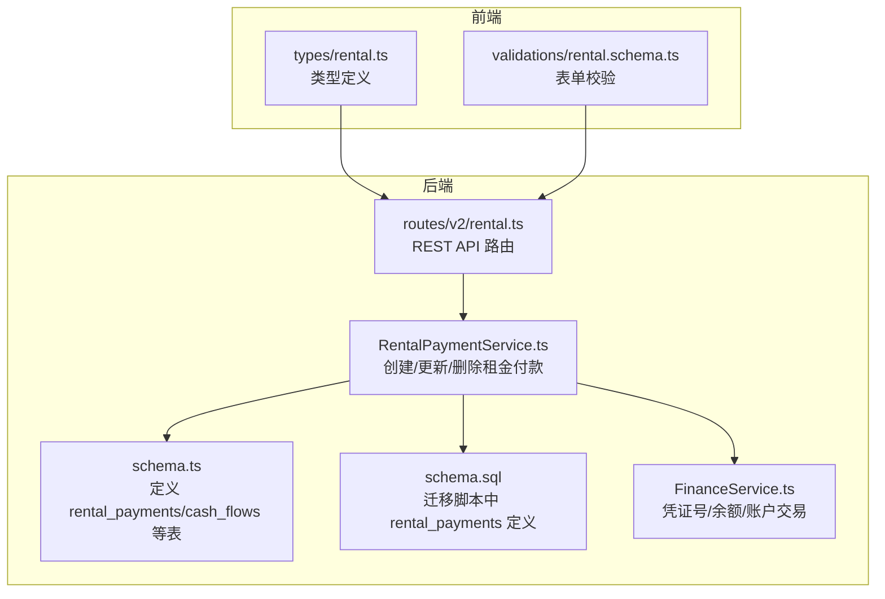
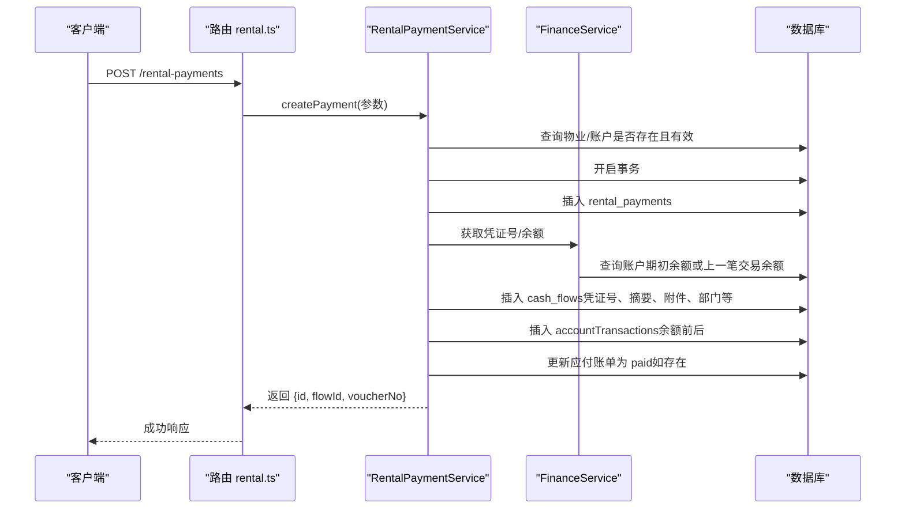
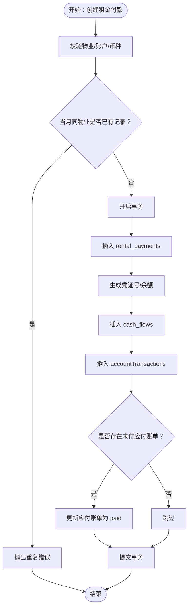
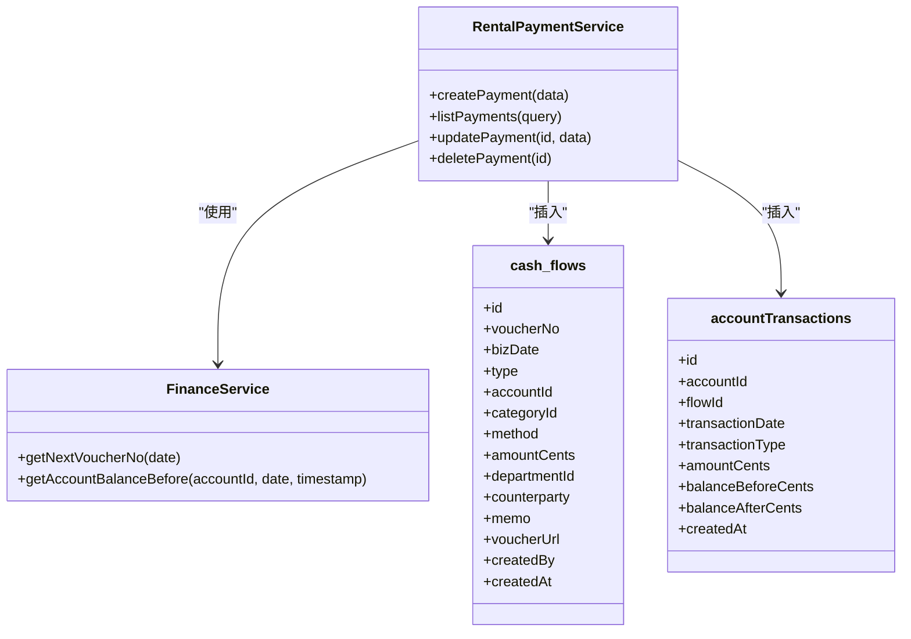
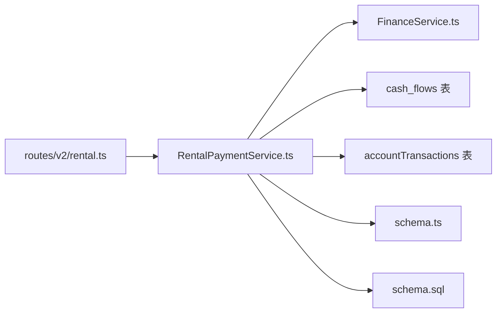

# 租金付款记录模型

<cite>
**本文引用的文件**
- [schema.ts](file://backend/src/db/schema.ts)
- [schema.sql](file://backend/src/db/schema.sql)
- [RentalPaymentService.ts](file://backend/src/services/RentalPaymentService.ts)
- [FinanceService.ts](file://backend/src/services/FinanceService.ts)
- [rental.ts](file://backend/src/routes/v2/rental.ts)
- [0000_chemical_may_parker.sql](file://backend/drizzle/0000_chemical_may_parker.sql)
- [rental.ts（前端类型）](file://frontend/src/types/rental.ts)
- [rental.schema.ts（前端校验）](file://frontend/src/validations/rental.schema.ts)
</cite>

## 目录
1. [简介](#简介)
2. [项目结构](#项目结构)
3. [核心组件](#核心组件)
4. [架构总览](#架构总览)
5. [详细组件分析](#详细组件分析)
6. [依赖分析](#依赖分析)
7. [性能考虑](#性能考虑)
8. [故障排查指南](#故障排查指南)
9. [结论](#结论)
10. [附录](#附录)

## 简介
本文件系统性梳理“租金付款记录”模型（rentalPayments 表）的设计与实现，围绕以下关键点展开：
- 字段语义与约束：propertyId、paymentDate、year/month（会计期间）、amountCents、currency、accountId、categoryId 等
- 凭证附件与操作追溯：voucherUrl、createdBy
- 与现金流表（cash_flows）的集成关系：凭证号生成、会计分录、账户余额链路
- 按期对账机制：通过 year 和 month 字段实现月度对账
- 财务审计作用：结合审计日志与业务操作历史，支撑可追溯性与合规性

## 项目结构
围绕“租金付款记录”的核心文件分布如下：
- 数据库模式定义：schema.ts 与 schema.sql
- 业务服务：RentalPaymentService.ts
- 财务服务：FinanceService.ts（凭证号生成、余额计算、账户交易记录）
- 接口路由：routes/v2/rental.ts
- 前端类型与校验：frontend/src/types/rental.ts、frontend/src/validations/rental.schema.ts



图表来源
- [schema.ts](file://backend/src/db/schema.ts#L605-L621)
- [schema.sql](file://backend/src/db/schema.sql#L575-L592)
- [RentalPaymentService.ts](file://backend/src/services/RentalPaymentService.ts#L1-L211)
- [FinanceService.ts](file://backend/src/services/FinanceService.ts#L25-L40)
- [rental.ts](file://backend/src/routes/v2/rental.ts#L538-L614)
- [rental.ts（前端类型）](file://frontend/src/types/rental.ts#L68-L89)
- [rental.schema.ts（前端校验）](file://frontend/src/validations/rental.schema.ts#L57-L67)

章节来源
- [schema.ts](file://backend/src/db/schema.ts#L605-L621)
- [schema.sql](file://backend/src/db/schema.sql#L575-L592)
- [RentalPaymentService.ts](file://backend/src/services/RentalPaymentService.ts#L1-L211)
- [FinanceService.ts](file://backend/src/services/FinanceService.ts#L25-L40)
- [rental.ts](file://backend/src/routes/v2/rental.ts#L538-L614)
- [rental.ts（前端类型）](file://frontend/src/types/rental.ts#L68-L89)
- [rental.schema.ts（前端校验）](file://frontend/src/validations/rental.schema.ts#L57-L67)

## 核心组件
- rentalPayments 表：记录每次租金支付的完整财务信息，含会计期间（year/month）、金额（amountCents）、币种（currency）、付款账户（accountId）、费用类别（categoryId）、凭证附件（voucherUrl）、操作人（createdBy）等
- cash_flows 表：与 rentalPayments 集成，生成凭证号、登记会计分录、记录摘要与附件
- accountTransactions 表：记录账户交易明细，用于余额链路与对账
- RentalPaymentService：封装创建/查询/更新/删除租金付款的业务流程，事务内联动 cash_flows 与 accountTransactions
- FinanceService：提供凭证号生成、余额计算、账户交易记录插入等通用财务能力

章节来源
- [schema.ts](file://backend/src/db/schema.ts#L605-L621)
- [schema.ts](file://backend/src/db/schema.ts#L159-L188)
- [schema.ts](file://backend/src/db/schema.ts#L190-L206)
- [RentalPaymentService.ts](file://backend/src/services/RentalPaymentService.ts#L1-L211)
- [FinanceService.ts](file://backend/src/services/FinanceService.ts#L25-L40)

## 架构总览
下图展示了“创建租金付款”时的关键调用链与数据流，体现 rentalPayments 与 cash_flows 的集成关系。



图表来源
- [rental.ts](file://backend/src/routes/v2/rental.ts#L538-L614)
- [RentalPaymentService.ts](file://backend/src/services/RentalPaymentService.ts#L53-L211)
- [FinanceService.ts](file://backend/src/services/FinanceService.ts#L25-L40)

## 详细组件分析

### 表结构与字段语义
- 表名：rental_payments
- 关键字段
  - propertyId：关联“租赁物业”（外键到 rental_properties.id）
  - paymentDate：付款日期（字符串，YYYY-MM-DD）
  - year/month：会计期间（整数），用于月度对账与报表
  - amountCents：付款金额（整数，单位为“分”，便于精确存储）
  - currency：币种（字符串）
  - accountId：付款账户（外键到 accounts.id）
  - categoryId：费用类别（外键到 categories.id，可空）
  - paymentMethod：付款方式（字符串，如 bank_transfer、cash、check）
  - voucherUrl：凭证附件（字符串，可空）
  - memo：备注（字符串，可空）
  - createdBy：创建人（字符串，可空）
  - createdAt/updatedAt：创建与更新时间戳（整数）

```mermaid
erDiagram
RENTAL_PAYMENTS {
text id PK
text property_id FK
text payment_date
int year
int month
int amount_cents
text currency
text account_id FK
text category_id
text payment_method
text voucher_url
text memo
text created_by
int created_at
int updated_at
}
RENTAL_PROPERTIES {
text id PK
}
ACCOUNTS {
text id PK
}
CATEGORIES {
text id PK
}
RENTAL_PAYMENTS }o--|| RENTAL_PROPERTIES : "propertyId -> id"
RENTAL_PAYMENTS }o--|| ACCOUNTS : "accountId -> id"
RENTAL_PAYMENTS }o--o|| CATEGORIES : "categoryId -> id"
```

图表来源
- [schema.ts](file://backend/src/db/schema.ts#L605-L621)
- [schema.sql](file://backend/src/db/schema.sql#L575-L592)

章节来源
- [schema.ts](file://backend/src/db/schema.ts#L605-L621)
- [schema.sql](file://backend/src/db/schema.sql#L575-L592)

### 业务流程与集成关系
- 创建流程要点
  - 校验物业与账户存在且有效（币种匹配）
  - 校验当月同物业无重复付款记录
  - 事务内插入 rental_payments
  - 使用 FinanceService 生成凭证号（基于 bizDate 计数序列），插入 cash_flows
  - 插入 accountTransactions，记录余额前后
  - 更新对应应付账单为 paid（如存在）
- 更新/删除流程
  - 支持更新 paymentDate、amountCents、voucherUrl、memo 等字段
  - 删除时返回被删除记录



图表来源
- [RentalPaymentService.ts](file://backend/src/services/RentalPaymentService.ts#L53-L211)
- [FinanceService.ts](file://backend/src/services/FinanceService.ts#L25-L40)

章节来源
- [RentalPaymentService.ts](file://backend/src/services/RentalPaymentService.ts#L53-L211)
- [FinanceService.ts](file://backend/src/services/FinanceService.ts#L25-L40)

### 与 cash_flows 的集成
- 凭证号生成：FinanceService.getNextVoucherNo 基于 bizDate（paymentDate）统计当日流水数量，生成 JZYYYYMMDD-NNN 格式的凭证号
- 会计分录：cash_flows 中 type='expense'，departmentId 来自物业，counterparty 来自物业 landlordName，memo 包含支付对象与附加说明，voucherUrl 保存附件
- 余额链路：FinanceService.getAccountBalanceBefore 基于 accountTransactions 计算某时刻前的余额，用于 accountTransactions 的 balanceBefore/balanceAfter



图表来源
- [RentalPaymentService.ts](file://backend/src/services/RentalPaymentService.ts#L53-L211)
- [FinanceService.ts](file://backend/src/services/FinanceService.ts#L25-L40)
- [schema.ts](file://backend/src/db/schema.ts#L159-L188)
- [schema.ts](file://backend/src/db/schema.ts#L190-L206)

章节来源
- [RentalPaymentService.ts](file://backend/src/services/RentalPaymentService.ts#L53-L211)
- [FinanceService.ts](file://backend/src/services/FinanceService.ts#L25-L40)
- [schema.ts](file://backend/src/db/schema.ts#L159-L188)
- [schema.ts](file://backend/src/db/schema.ts#L190-L206)

### 按期对账与 year/month 字段
- 年度/月份字段用于：
  - 列表查询：按 propertyId/year/month 过滤
  - 报表统计：按月汇总支出
  - 应付账单匹配：与 rental_payable_bills 的 year/month 对齐，自动标记为 paid
- 对账建议：
  - 月末核对 cash_flows 与 accountTransactions 的余额一致性
  - 以 year/month 为维度比对应付账单与实付记录

章节来源
- [RentalPaymentService.ts](file://backend/src/services/RentalPaymentService.ts#L23-L51)
- [RentalPaymentService.ts](file://backend/src/services/RentalPaymentService.ts#L191-L208)

### 凭证附件与操作追溯
- voucherUrl：保存附件链接，便于审计与归档
- createdBy：记录操作人，配合审计日志与业务操作历史，形成完整追溯链
- 前端类型与校验：
  - 类型定义包含 paymentDate、amountCents、currency、accountId、categoryId、paymentMethod、memo 等字段
  - 表单校验要求 paymentDate 有效、amountCents > 0、currency 必填、accountId 必填等

章节来源
- [schema.ts](file://backend/src/db/schema.ts#L605-L621)
- [rental.ts（前端类型）](file://frontend/src/types/rental.ts#L68-L89)
- [rental.schema.ts（前端校验）](file://frontend/src/validations/rental.schema.ts#L57-L67)

### 实际代码示例（路径引用）
- 表定义（Drizzle ORM）
  - [rental_payments 表定义](file://backend/src/db/schema.ts#L605-L621)
- 表定义（SQL 迁移）
  - [rental_payments 表定义（迁移脚本）](file://backend/drizzle/0000_chemical_may_parker.sql#L460-L476)
- 业务服务：创建流程
  - [RentalPaymentService.createPayment](file://backend/src/services/RentalPaymentService.ts#L53-L211)
- 业务服务：查询流程
  - [RentalPaymentService.listPayments](file://backend/src/services/RentalPaymentService.ts#L23-L51)
- 财务服务：凭证号与余额
  - [FinanceService.getNextVoucherNo](file://backend/src/services/FinanceService.ts#L25-L39)
  - [FinanceService.getAccountBalanceBefore](file://backend/src/services/FinanceService.ts#L41-L68)
- 接口路由：创建/更新/删除
  - [POST /rental-payments](file://backend/src/routes/v2/rental.ts#L538-L614)
  - [PUT /rental-payments/{id}](file://backend/src/routes/v2/rental.ts#L616-L643)
  - [DELETE /rental-payments/{id}](file://backend/src/routes/v2/rental.ts#L667-L713)

## 依赖分析
- 组件耦合
  - RentalPaymentService 依赖 FinanceService、cash_flows、accountTransactions
  - 路由层仅负责参数校验与调用服务层
- 外部依赖
  - Drizzle ORM 与 SQLite（D1）
  - 前端 Zod 校验与类型定义



图表来源
- [rental.ts](file://backend/src/routes/v2/rental.ts#L538-L614)
- [RentalPaymentService.ts](file://backend/src/services/RentalPaymentService.ts#L1-L211)
- [FinanceService.ts](file://backend/src/services/FinanceService.ts#L25-L40)
- [schema.ts](file://backend/src/db/schema.ts#L605-L621)
- [schema.sql](file://backend/src/db/schema.sql#L575-L592)

章节来源
- [rental.ts](file://backend/src/routes/v2/rental.ts#L538-L614)
- [RentalPaymentService.ts](file://backend/src/services/RentalPaymentService.ts#L1-L211)
- [FinanceService.ts](file://backend/src/services/FinanceService.ts#L25-L40)
- [schema.ts](file://backend/src/db/schema.ts#L605-L621)
- [schema.sql](file://backend/src/db/schema.sql#L575-L592)

## 性能考虑
- 查询优化
  - 按 year/month/year+month 过滤时，建议在 rental_payments 上建立复合索引（year, month）以提升月度对账效率
- 事务与并发
  - 创建付款时使用事务保证 rental_payments、cash_flows、accountTransactions 的一致性
  - FinanceService 通过乐观锁（账户版本号）避免并发写入导致的余额计算偏差
- 凭证号生成
  - 基于 bizDate 的计数序列生成凭证号，避免跨天冲突

章节来源
- [RentalPaymentService.ts](file://backend/src/services/RentalPaymentService.ts#L113-L211)
- [FinanceService.ts](file://backend/src/services/FinanceService.ts#L146-L170)

## 故障排查指南
- 重复付款
  - 现象：当月同物业重复创建
  - 处理：服务层在创建前校验 year+month+propertyId 的唯一性
  - 参考路径：[重复校验逻辑](file://backend/src/services/RentalPaymentService.ts#L76-L89)
- 账户无效或币种不匹配
  - 现象：账户不存在或币种不一致
  - 处理：创建前校验账户存在且 active，且 currency 与付款币种一致
  - 参考路径：[账户校验逻辑](file://backend/src/services/RentalPaymentService.ts#L91-L104)
- 余额不足
  - 现象：支出导致余额不足
  - 处理：FinanceService 在创建流水前计算余额并校验
  - 参考路径：[余额校验逻辑](file://backend/src/services/FinanceService.ts#L172-L186)
- 凭证号异常
  - 现象：凭证号重复或格式异常
  - 处理：FinanceService.getNextVoucherNo 基于 bizDate 计数生成，确保唯一性
  - 参考路径：[凭证号生成](file://backend/src/services/FinanceService.ts#L25-L39)
- 对账不平
  - 现象：cash_flows 与 accountTransactions 余额不一致
  - 处理：核对 accountTransactions 的 balanceBefore/balanceAfter 计算链路，确认无遗漏交易
  - 参考路径：[余额计算](file://backend/src/services/FinanceService.ts#L41-L68)

章节来源
- [RentalPaymentService.ts](file://backend/src/services/RentalPaymentService.ts#L76-L104)
- [FinanceService.ts](file://backend/src/services/FinanceService.ts#L25-L39)
- [FinanceService.ts](file://backend/src/services/FinanceService.ts#L41-L68)

## 结论
rentalPayments 表通过 year/month、amountCents、currency、accountId、categoryId 等字段，完整记录每次租金支付的财务要素；通过与 cash_flows、accountTransactions 的紧密集成，实现了凭证号生成、会计分录登记与余额链路维护；year/month 字段为月度对账提供了天然支撑。结合 createdBy 与凭证附件，满足财务审计的可追溯性需求。

## 附录
- 表定义（Drizzle ORM）
  - [rental_payments 表定义](file://backend/src/db/schema.ts#L605-L621)
- 表定义（SQL 迁移）
  - [rental_payments 表定义（迁移脚本）](file://backend/drizzle/0000_chemical_may_parker.sql#L460-L476)
- 业务服务
  - [RentalPaymentService.createPayment](file://backend/src/services/RentalPaymentService.ts#L53-L211)
  - [RentalPaymentService.listPayments](file://backend/src/services/RentalPaymentService.ts#L23-L51)
- 财务服务
  - [FinanceService.getNextVoucherNo](file://backend/src/services/FinanceService.ts#L25-L39)
  - [FinanceService.getAccountBalanceBefore](file://backend/src/services/FinanceService.ts#L41-L68)
- 接口路由
  - [POST /rental-payments](file://backend/src/routes/v2/rental.ts#L538-L614)
  - [PUT /rental-payments/{id}](file://backend/src/routes/v2/rental.ts#L616-L643)
  - [DELETE /rental-payments/{id}](file://backend/src/routes/v2/rental.ts#L667-L713)
- 前端类型与校验
  - [RentalPayment 类型](file://frontend/src/types/rental.ts#L68-L89)
  - [创建租金付款校验](file://frontend/src/validations/rental.schema.ts#L57-L67)