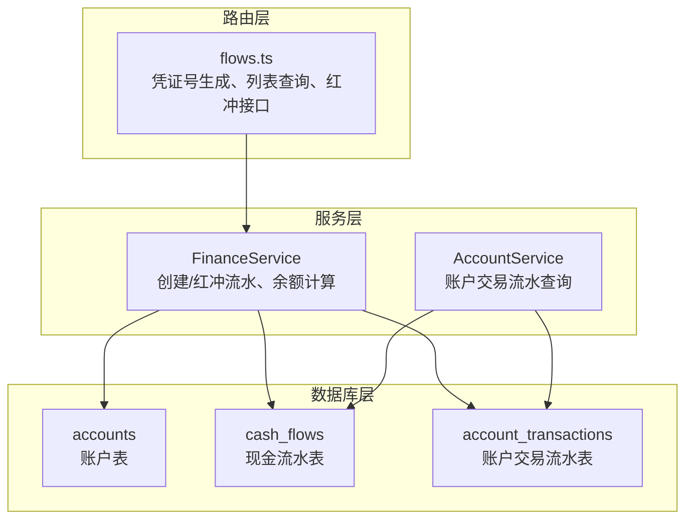
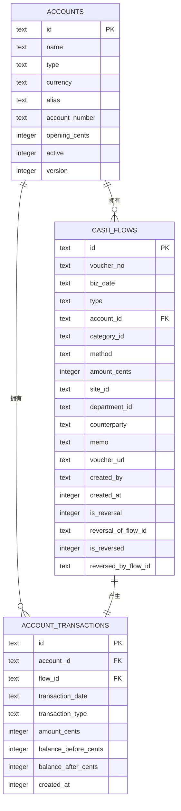
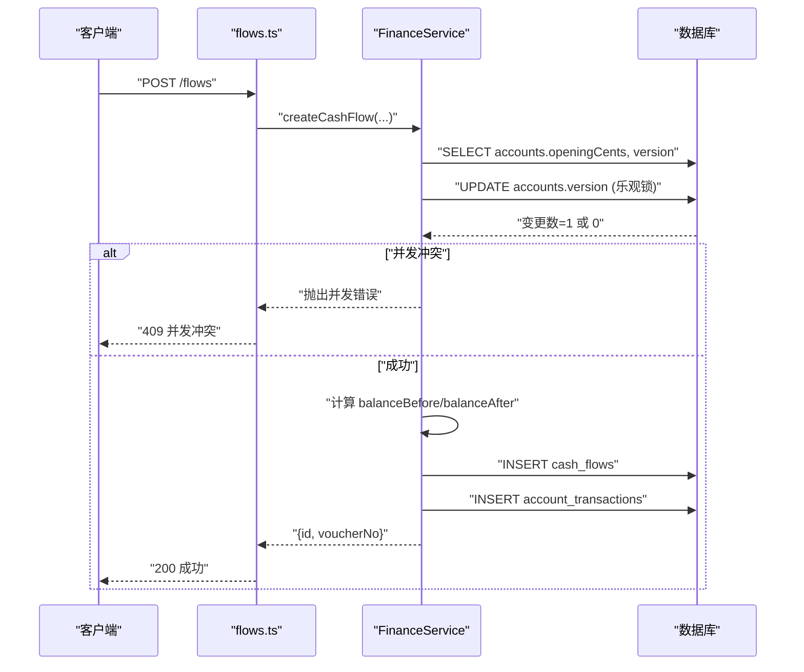
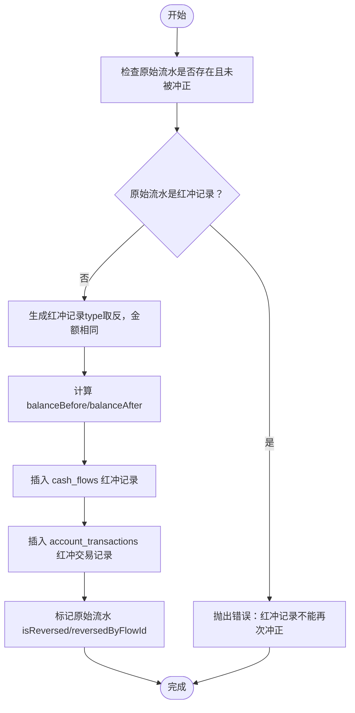
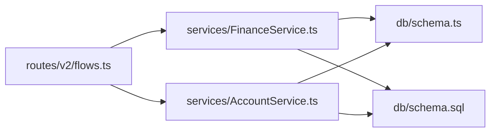

# 财务数据模型

<cite>
**本文引用的文件**
- [schema.ts](file://backend/src/db/schema.ts)
- [schema.sql](file://backend/src/db/schema.sql)
- [migration_add_cash_flow_reversal_fields.sql](file://backend/src/db/migration_add_cash_flow_reversal_fields.sql)
- [FinanceService.ts](file://backend/src/services/FinanceService.ts)
- [AccountService.ts](file://backend/src/services/AccountService.ts)
- [flows.ts](file://backend/src/routes/v2/flows.ts)
- [optimistic-lock.ts](file://backend/src/utils/optimistic-lock.ts)
- [0000_snapshot.json](file://backend/drizzle/meta/0000_snapshot.json)
</cite>

## 目录
1. [简介](#简介)
2. [项目结构](#项目结构)
3. [核心组件](#核心组件)
4. [架构总览](#架构总览)
5. [详细组件分析](#详细组件分析)
6. [依赖分析](#依赖分析)
7. [性能考虑](#性能考虑)
8. [故障排查指南](#故障排查指南)
9. [结论](#结论)

## 简介
本文件系统性梳理财务数据模型中的三张核心表：accounts（账户表）、cashFlows（现金流水表）、accountTransactions（账户交易流水表）。重点解析：
- accounts 表的账户类型（type）、币种（currency）、期初余额（openingCents）与乐观锁版本号（version）；
- cashFlows 表的业务日期（bizDate）、金额（amountCents）、红冲机制（isReversal、reversalOfFlowId）与索引策略；
- accountTransactions 表的交易流水与余额追踪机制；
- 三者之间的关联关系（accountId、flowId）；
- 如何通过这些表实现完整的财务流水追踪与账户余额计算；
- 提供实际代码示例路径，展示表定义与索引创建。

## 项目结构
财务数据模型由数据库层（Drizzle ORM + SQLite）与服务层（FinanceService、AccountService）共同支撑，路由层（flows.ts）对外暴露接口。核心表定义位于 schema.ts 与 schema.sql，并通过迁移脚本补充红冲相关字段与索引。

图表来源
- [schema.ts](file://backend/src/db/schema.ts#L139-L206)
- [schema.sql](file://backend/src/db/schema.sql#L173-L216)
- [FinanceService.ts](file://backend/src/services/FinanceService.ts#L1-L200)
- [AccountService.ts](file://backend/src/services/AccountService.ts#L43-L82)
- [flows.ts](file://backend/src/routes/v2/flows.ts#L1-L200)

章节来源
- [schema.ts](file://backend/src/db/schema.ts#L139-L206)
- [schema.sql](file://backend/src/db/schema.sql#L173-L216)

## 核心组件
- accounts（账户表）
  - 关键字段：id、name、type、currency、alias、accountNumber、openingCents、active、version
  - 作用：存储账户基础信息与期初余额，version 字段用于乐观锁
- cashFlows（现金流水表）
  - 关键字段：id、voucherNo、bizDate、type、accountId、categoryId、method、amountCents、siteId、departmentId、counterparty、memo、voucherUrl、createdBy、createdAt、isReversal、reversalOfFlowId、isReversed、reversedByFlowId
  - 作用：记录每笔资金变动，支持红冲机制
- accountTransactions（账户交易流水表）
  - 关键字段：id、accountId、flowId、transactionDate、transactionType、amountCents、balanceBeforeCents、balanceAfterCents、createdAt
  - 作用：按时间序列记录账户余额变化，支持余额回溯与报表

章节来源
- [schema.ts](file://backend/src/db/schema.ts#L139-L206)
- [schema.sql](file://backend/src/db/schema.sql#L173-L216)

## 架构总览
下图展示三表之间的关系与数据流向，以及服务层如何通过事务保证一致性。

图表来源
- [schema.ts](file://backend/src/db/schema.ts#L139-L206)
- [schema.sql](file://backend/src/db/schema.sql#L173-L216)

## 详细组件分析

### accounts 表
- 字段语义
  - type：账户类型（如银行、现金等），用于区分不同资产/负债类别
  - currency：币种代码（如 CNY、USD），用于多币种管理
  - openingCents：期初余额（单位分），作为余额计算的基准
  - version：乐观锁版本号，用于并发写入保护
- 并发控制
  - 在创建流水时，先读取 accounts.openingCents 与 version，再通过更新 version 实现“虚拟互斥”，若变更数为 0，则判定并发冲突并提示重试
- 余额计算
  - 账户当前余额不直接持久化于 accounts，而是通过 accountTransactions 历史流水动态计算

章节来源
- [schema.ts](file://backend/src/db/schema.ts#L139-L149)
- [FinanceService.ts](file://backend/src/services/FinanceService.ts#L139-L165)
- [optimistic-lock.ts](file://backend/src/utils/optimistic-lock.ts#L1-L41)

### cashFlows 表
- 字段语义
  - bizDate：业务发生日期，用于排序与报表筛选
  - amountCents：金额（单位分），正负表示收入/支出
  - 红冲相关：isReversal（是否为红冲记录）、reversalOfFlowId（冲正的原始流水ID）、isReversed（是否已被冲正）、reversedByFlowId（冲正记录ID）
- 红冲机制
  - 对原始流水执行红冲时，生成一条反向流水（type 取反，金额相同），同时标记原始流水 isReversed 与 reversedByFlowId
  - 红冲记录自身 isReversal 设为 1，并记录 reversalOfFlowId
  - 测试覆盖包括：禁止重复红冲、禁止对红冲记录再次红冲、报表排除红冲记录等
- 索引策略
  - 代码中定义了复合索引 idx_cash_flows_account_biz(accountId, bizDate) 与单列索引 idx_cash_flows_type(type)
  - 迁移脚本补充了 idx_cash_flows_reversal(reversalOfFlowId)，用于快速定位冲正关系
  - Drizzle 快照也显示了上述索引的存在

章节来源
- [schema.ts](file://backend/src/db/schema.ts#L159-L188)
- [schema.sql](file://backend/src/db/schema.sql#L187-L203)
- [migration_add_cash_flow_reversal_fields.sql](file://backend/src/db/migration_add_cash_flow_reversal_fields.sql#L1-L18)
- [0000_snapshot.json](file://backend/drizzle/meta/0000_snapshot.json#L1008-L1028)
- [FinanceService.ts](file://backend/src/services/FinanceService.ts#L300-L437)
- [flows.ts](file://backend/src/routes/v2/flows.ts#L494-L565)

### accountTransactions 表
- 字段语义
  - accountId、flowId：与 accounts、cashFlows 的关联键
  - transactionDate、transactionType、amountCents：记录交易发生的时间、类型与金额
  - balanceBeforeCents、balanceAfterCents：交易前/后余额（单位分）
  - createdAt：记录创建时间，用于同一天内多条流水的精确排序
- 余额追踪
  - 余额计算规则：余额 = 期初余额 + 累计收入 - 累计支出
  - 通过 getAccountBalanceBefore(accountId, date, timestamp) 查找指定时间点之前最近一条交易的 balanceAfterCents，若无则取 accounts.openingCents
- 索引策略
  - idx_acc_tx_account_date(accountId, transactionDate)：加速按账户与日期范围的查询

章节来源
- [schema.ts](file://backend/src/db/schema.ts#L190-L206)
- [schema.sql](file://backend/src/db/schema.sql#L205-L216)
- [FinanceService.ts](file://backend/src/services/FinanceService.ts#L41-L68)
- [0000_snapshot.json](file://backend/drizzle/meta/0000_snapshot.json#L1-L88)
- [AccountService.ts](file://backend/src/services/AccountService.ts#L43-L82)

### 三表关联关系与数据流
- 关联键
  - cashFlows.accountId → accounts.id
  - accountTransactions.accountId → accounts.id
  - accountTransactions.flowId → cashFlows.id
- 数据流
  - 创建流水：FinanceService 先通过乐观锁更新 accounts.version，再计算 balanceBefore/balanceAfter，插入 cashFlows 与 accountTransactions
  - 红冲流水：FinanceService 生成反向流水并标记原始流水，同时插入对应的 accountTransactions 记录
  - 查询账户交易：AccountService 通过 accountTransactions.flowId 左连接 cashFlows 与 categories，返回带凭证号、摘要、摘要等信息的明细

图表来源
- [flows.ts](file://backend/src/routes/v2/flows.ts#L1-L200)
- [FinanceService.ts](file://backend/src/services/FinanceService.ts#L70-L228)

章节来源
- [FinanceService.ts](file://backend/src/services/FinanceService.ts#L70-L228)
- [AccountService.ts](file://backend/src/services/AccountService.ts#L43-L82)

### 红冲流程（反向抵销）

图表来源
- [FinanceService.ts](file://backend/src/services/FinanceService.ts#L300-L437)
- [migration_add_cash_flow_reversal_fields.sql](file://backend/src/db/migration_add_cash_flow_reversal_fields.sql#L1-L18)

章节来源
- [FinanceService.ts](file://backend/src/services/FinanceService.ts#L300-L437)
- [migration_add_cash_flow_reversal_fields.sql](file://backend/src/db/migration_add_cash_flow_reversal_fields.sql#L1-L18)

## 依赖分析
- 组件耦合
  - FinanceService 同时依赖 accounts、cashFlows、accountTransactions，负责余额计算与事务一致性
  - AccountService 依赖 accountTransactions 与 cashFlows，提供账户交易明细查询
  - flows.ts 路由层调用 FinanceService 与 AccountService，暴露凭证号生成、列表查询与红冲接口
- 外部依赖
  - Drizzle ORM（sqlite-core）用于表定义与索引声明
  - SQLite（D1）用于运行时执行 SQL 与事务
- 循环依赖
  - 未发现循环依赖，模块职责清晰

图表来源
- [flows.ts](file://backend/src/routes/v2/flows.ts#L1-L200)
- [FinanceService.ts](file://backend/src/services/FinanceService.ts#L1-L200)
- [AccountService.ts](file://backend/src/services/AccountService.ts#L43-L82)
- [schema.ts](file://backend/src/db/schema.ts#L139-L206)
- [schema.sql](file://backend/src/db/schema.sql#L173-L216)

章节来源
- [flows.ts](file://backend/src/routes/v2/flows.ts#L1-L200)
- [FinanceService.ts](file://backend/src/services/FinanceService.ts#L1-L200)
- [AccountService.ts](file://backend/src/services/AccountService.ts#L43-L82)
- [schema.ts](file://backend/src/db/schema.ts#L139-L206)
- [schema.sql](file://backend/src/db/schema.sql#L173-L216)

## 性能考虑
- 索引设计
  - cashFlows
    - idx_cash_flows_account_biz(accountId, bizDate)：按账户+业务日期高效查询
    - idx_cash_flows_type(type)：按流水类型快速筛选
    - idx_cash_flows_reversal(reversalOfFlowId)：快速定位冲正关系
  - accountTransactions
    - idx_acc_tx_account_date(accountId, transactionDate)：按账户与日期范围查询
- 查询优化建议
  - 在高频查询场景（如账户交易明细、流水列表）优先使用复合索引
  - 报表查询时避免 SELECT *，仅选择必要字段
  - 红冲报表应排除 isReversal=1 的记录，避免重复计算
- 并发控制
  - 通过 accounts.version 的乐观锁，确保同一账户的流水串行化写入，降低余额计算竞争条件

章节来源
- [schema.ts](file://backend/src/db/schema.ts#L183-L206)
- [schema.sql](file://backend/src/db/schema.sql#L313-L330)
- [migration_add_cash_flow_reversal_fields.sql](file://backend/src/db/migration_add_cash_flow_reversal_fields.sql#L1-L18)
- [0000_snapshot.json](file://backend/drizzle/meta/0000_snapshot.json#L1008-L1028)

## 故障排查指南
- 并发冲突（409）
  - 现象：创建流水时报“账户状态已更变（并发冲突），请重试”
  - 原因：多个请求同时写入同一账户，乐观锁更新 accounts.version 失败
  - 处理：提示用户刷新页面后重试
- 余额不足（400）
  - 现象：支出流水报“账户余额不足”
  - 原因：balanceBefore < amountCents
  - 处理：检查账户期初余额与历史交易，或调整支出金额
- 红冲异常
  - 现象：重复红冲或对红冲记录再次红冲
  - 原因：业务校验未通过
  - 处理：确保原始流水未被冲正，且非红冲记录本身
- 报表重复统计
  - 现象：报表中出现红冲记录导致重复统计
  - 处理：查询时排除 isReversal=1 的记录

章节来源
- [FinanceService.ts](file://backend/src/services/FinanceService.ts#L172-L186)
- [FinanceService.ts](file://backend/src/services/FinanceService.ts#L300-L437)
- [flows.ts](file://backend/src/routes/v2/flows.ts#L494-L565)

## 结论
本财务数据模型通过 accounts、cashFlows、accountTransactions 三表协同，实现了：
- 以期初余额与历史交易流水为基础的余额计算；
- 以乐观锁与事务保障的并发安全；
- 以红冲机制为核心的差错修复能力；
- 以复合索引优化的查询性能。
配合服务层与路由层的统一处理，能够稳定支撑日常财务流水的录入、查询与报表需求。