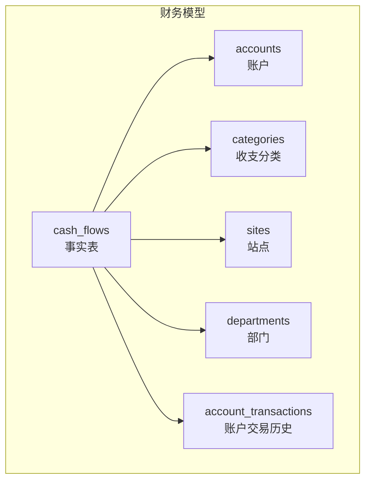
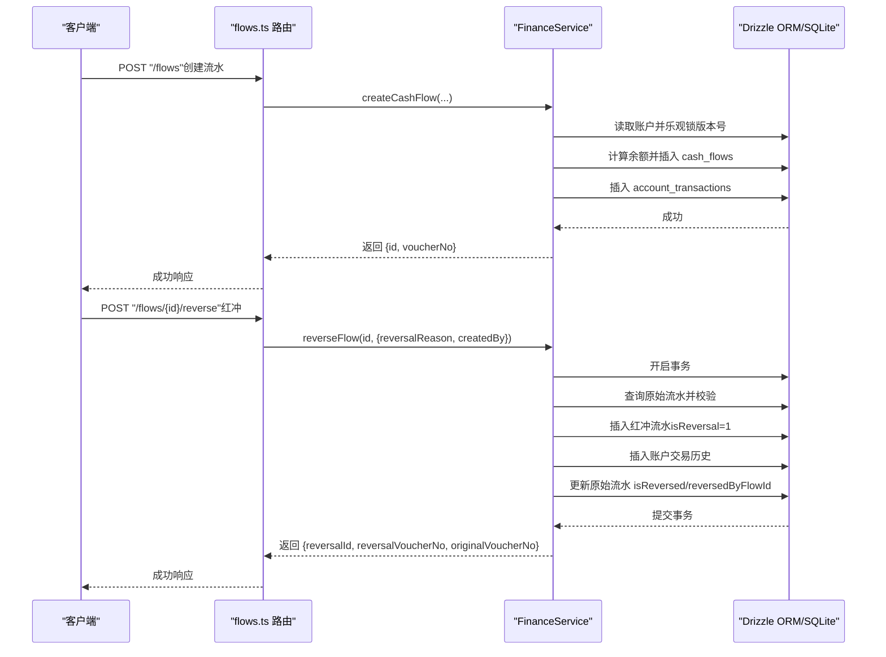
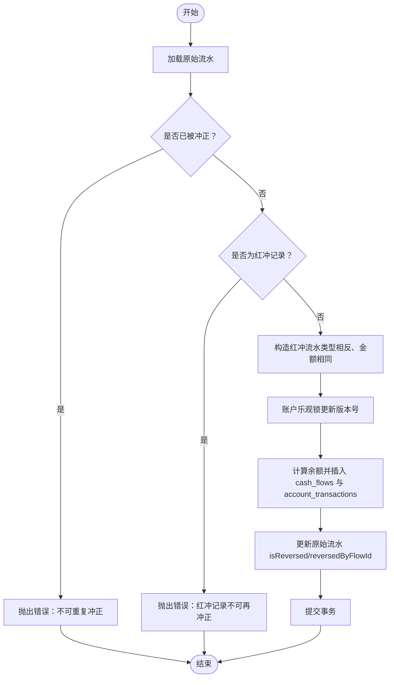
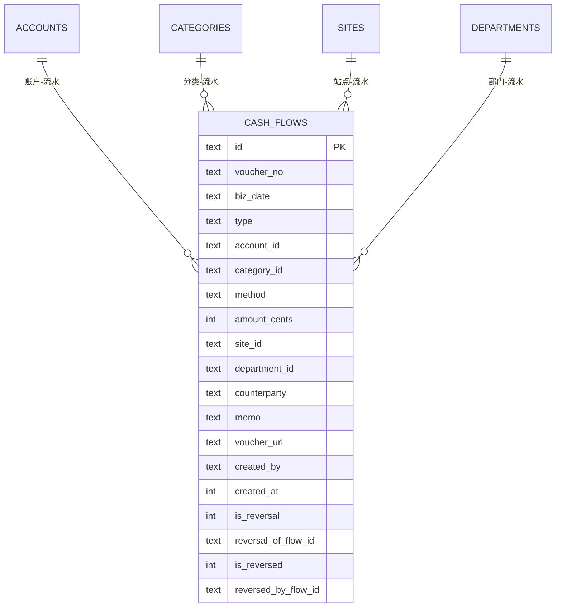
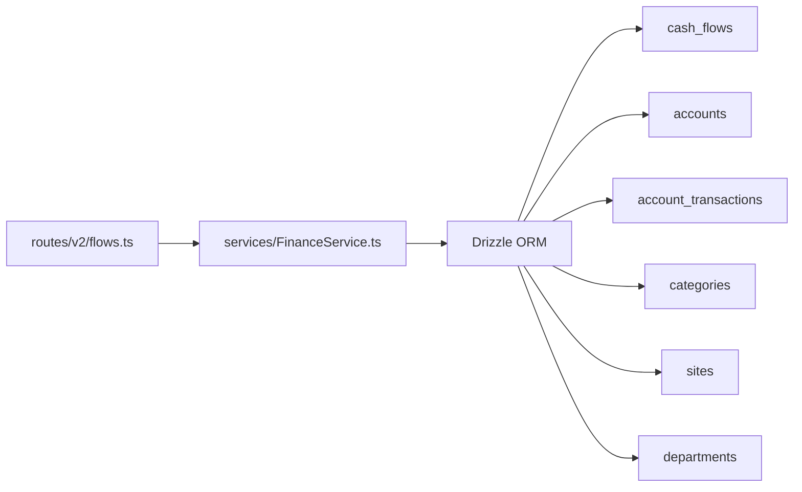

# 财务流水表 (cash_flows)

<cite>
**本文引用的文件**
- [schema.ts](file://backend/src/db/schema.ts)
- [schema.sql](file://backend/src/db/schema.sql)
- [0000_chemical_may_parker.sql](file://backend/drizzle/0000_chemical_may_parker.sql)
- [migration_add_cash_flow_reversal_fields.sql](file://backend/src/db/migration_add_cash_flow_reversal_fields.sql)
- [flows.ts](file://backend/src/routes/v2/flows.ts)
- [FinanceService.ts](file://backend/src/services/FinanceService.ts)
- [business.schema.ts](file://backend/src/schemas/business.schema.ts)
</cite>

## 目录
1. [简介](#简介)
2. [项目结构与定位](#项目结构与定位)
3. [核心组件](#核心组件)
4. [架构总览](#架构总览)
5. [详细组件分析](#详细组件分析)
6. [依赖关系分析](#依赖关系分析)
7. [性能考量](#性能考量)
8. [故障排查指南](#故障排查指南)
9. [结论](#结论)
10. [附录](#附录)

## 简介
本文件围绕财务核心事实表“cash_flows”（现金流水）进行系统化深度文档化，目标包括：
- 明确表结构与关键字段语义：bizDate（业务日期，决定记账期间）、amountCents（金额，以分为单位）、type（流水类型，如收入、支出、转账等）、accountId（关联账户）等。
- 深入解析红冲机制：isReversal（标记是否为红冲凭证）、reversalOfFlowId（指向被冲销的原始流水ID）、isReversed（标记原始流水是否已被冲销）、reversedByFlowId（指向冲销该流水的凭证ID），并给出典型业务场景与数据一致性保障策略。
- 解释索引设计目的：idxAccountBiz（账户+业务日期复合索引）、idxType（类型索引）、idxReversal（红冲关联索引）等，说明如何优化按账户和日期查询的性能。
- 提供表结构定义与索引创建的代码示例路径，便于快速定位实现位置。

## 项目结构与定位
cash_flows 是财务模块的事实表，承载所有资金变动的明细记录。它与账户表（accounts）、分类表（categories）、站点表（sites）、部门表（departments）等主数据存在外键关联；同时通过 account_transactions 维护账户维度的历史余额快照，用于余额校验与对账。

图表来源
- [schema.ts](file://backend/src/db/schema.ts#L159-L206)
- [schema.sql](file://backend/src/db/schema.sql#L186-L216)

章节来源
- [schema.ts](file://backend/src/db/schema.ts#L159-L206)
- [schema.sql](file://backend/src/db/schema.sql#L186-L216)

## 核心组件
- 表结构与字段
  - 主键：id
  - 凭证信息：voucherNo（凭证号）、voucherUrl（凭证URL集合，JSON存储）
  - 业务要素：bizDate（业务日期，决定记账期间）、type（流水类型，如 income、expense）、amountCents（金额，以分为单位）、method（支付方式）
  - 关联信息：accountId（账户）、categoryId（分类）、siteId（站点）、departmentId（部门）、counterparty（对方方）、memo（摘要）
  - 创建元数据：createdBy（创建人）、createdAt（创建时间）
  - 红冲字段：isReversal、reversalOfFlowId、isReversed、reversedByFlowId
- 红冲流程
  - 由路由 flows.ts 的 “/flows/{id}/reverse” 触发，调用 FinanceService.reverseFlow 实现。
  - 在事务中完成：插入红冲流水、写入账户交易历史、更新原始流水的 isReversed/reversedByFlowId 标记。
- 索引
  - idx_cash_flows_account_biz(account_id, biz_date)
  - idx_cash_flows_type(type)
  - idx_cash_flows_reversal(reversal_of_flow_id)

章节来源
- [schema.ts](file://backend/src/db/schema.ts#L159-L188)
- [schema.sql](file://backend/src/db/schema.sql#L186-L203)
- [0000_chemical_may_parker.sql](file://backend/drizzle/0000_chemical_may_parker.sql#L142-L161)
- [migration_add_cash_flow_reversal_fields.sql](file://backend/src/db/migration_add_cash_flow_reversal_fields.sql#L1-L18)
- [flows.ts](file://backend/src/routes/v2/flows.ts#L494-L565)
- [FinanceService.ts](file://backend/src/services/FinanceService.ts#L285-L437)

## 架构总览
cash_flows 作为事实表，贯穿“凭证录入—余额校验—账户历史—红冲处理”的全链路。

图表来源
- [flows.ts](file://backend/src/routes/v2/flows.ts#L326-L425)
- [flows.ts](file://backend/src/routes/v2/flows.ts#L494-L565)
- [FinanceService.ts](file://backend/src/services/FinanceService.ts#L70-L229)
- [FinanceService.ts](file://backend/src/services/FinanceService.ts#L285-L437)

## 详细组件分析

### 字段语义与业务含义
- bizDate（业务日期）
  - 作用：决定记账期间，用于按日统计与对账。
  - 影响：配合 idxAccountBiz 实现按账户+日期高效查询。
- amountCents（金额，以分为单位）
  - 作用：统一计量单位，避免浮点误差；与账户余额历史（account_transactions）联动。
- type（流水类型）
  - 取值：income（收入）、expense（支出）。
  - 影响：决定余额增减方向（收入+，支出-）。
- accountId（关联账户）
  - 作用：与 accounts 表关联，形成事实-维度关系。
  - 影响：余额校验与账户维度报表的基础。
- 其他常用字段
  - categoryId、siteId、departmentId、counterparty、memo、method、voucherNo、voucherUrl、createdBy、createdAt。

章节来源
- [schema.ts](file://backend/src/db/schema.ts#L159-L188)
- [schema.sql](file://backend/src/db/schema.sql#L186-L203)
- [FinanceService.ts](file://backend/src/services/FinanceService.ts#L70-L229)

### 红冲机制详解
- 设计目标
  - 以“反向记账”方式抵消错误或重复的原始流水，保持账簿可追溯性。
- 关键字段
  - isReversal：1 表示该条为红冲凭证。
  - reversalOfFlowId：指向被冲销的原始流水ID。
  - isReversed：1 表示原始流水已被冲销。
  - reversedByFlowId：指向冲销该流水的红冲凭证ID。
- 业务流程
  - 校验原始流水存在且未被冲正，且自身不是红冲记录。
  - 生成新的红冲流水，类型与原始相反，金额相同，memo中记录原凭证号与冲正原因。
  - 插入账户交易历史，更新原始流水的 isReversed/reversedByFlowId。
- 数据一致性保障
  - 使用事务包裹红冲全流程，确保原子性。
  - 对账户执行乐观锁版本号更新，避免并发写导致的余额错乱。
  - 通过 account_transactions 严格记录余额快照，保证余额校验与对账准确。

图表来源
- [FinanceService.ts](file://backend/src/services/FinanceService.ts#L285-L437)

章节来源
- [flows.ts](file://backend/src/routes/v2/flows.ts#L494-L565)
- [FinanceService.ts](file://backend/src/services/FinanceService.ts#L285-L437)
- [migration_add_cash_flow_reversal_fields.sql](file://backend/src/db/migration_add_cash_flow_reversal_fields.sql#L1-L18)

### 红冲典型业务场景
- 场景一：重复入账
  - 原始流水为一笔误录的收入，后续通过红冲抵消。
  - 结果：原始流水标记为已冲正，红冲流水抵消该笔金额。
- 场景二：金额错误
  - 原始流水金额多录或少录，通过红冲生成正确金额的流水，并在 memo 中注明原因。
- 场景三：收款方向错误
  - 原始流水为“支出”，应为“收入”，通过红冲纠正方向与金额。
- 数据一致性要点
  - 红冲后，原始流水与红冲流水在业务上相互关联，便于审计与追溯。
  - 余额校验基于 account_transactions 的余额快照，确保跨时间点的准确性。

章节来源
- [FinanceService.ts](file://backend/src/services/FinanceService.ts#L285-L437)

### 索引设计与性能优化
- idxAccountBiz（账户+业务日期）
  - 目的：加速按账户与业务日期范围的流水查询，常用于报表与对账。
  - 实现：复合索引 (account_id, biz_date)。
- idxType（流水类型）
  - 目的：加速按收入/支出类型的筛选。
- idxReversal（红冲关联）
  - 目的：加速查询某原始流水的所有红冲记录或反向查询某红冲对应的原始流水。
- 索引来源
  - Drizzle 定义：schema.ts 中的 index(...)。
  - SQL 迁移：schema.sql 与 0000_chemical_may_parker.sql 中的 CREATE INDEX。
  - 后续补充：migration_add_cash_flow_reversal_fields.sql 增加 idx_cash_flows_reversal。

图表来源
- [schema.ts](file://backend/src/db/schema.ts#L159-L206)
- [schema.sql](file://backend/src/db/schema.sql#L186-L216)

章节来源
- [schema.ts](file://backend/src/db/schema.ts#L159-L188)
- [schema.sql](file://backend/src/db/schema.sql#L313-L330)
- [0000_chemical_may_parker.sql](file://backend/drizzle/0000_chemical_may_parker.sql#L142-L161)
- [migration_add_cash_flow_reversal_fields.sql](file://backend/src/db/migration_add_cash_flow_reversal_fields.sql#L1-L18)

### 表结构定义与索引创建示例路径
- Drizzle 定义（推荐用于新开发与迁移管理）
  - 表结构与索引定义：[schema.ts](file://backend/src/db/schema.ts#L159-L188)
- SQL 迁移（传统 SQL 方式）
  - 原始表结构与基础索引：[schema.sql](file://backend/src/db/schema.sql#L186-L203)、[schema.sql](file://backend/src/db/schema.sql#L313-L330)
  - 历史迁移脚本（含 cash_flows 表与索引）：[0000_chemical_may_parker.sql](file://backend/drizzle/0000_chemical_may_parker.sql#L142-L161)
  - 红冲字段与索引迁移：[migration_add_cash_flow_reversal_fields.sql](file://backend/src/db/migration_add_cash_flow_reversal_fields.sql#L1-L18)

章节来源
- [schema.ts](file://backend/src/db/schema.ts#L159-L188)
- [schema.sql](file://backend/src/db/schema.sql#L186-L203)
- [schema.sql](file://backend/src/db/schema.sql#L313-L330)
- [0000_chemical_may_parker.sql](file://backend/drizzle/0000_chemical_may_parker.sql#L142-L161)
- [migration_add_cash_flow_reversal_fields.sql](file://backend/src/db/migration_add_cash_flow_reversal_fields.sql#L1-L18)

## 依赖关系分析
- 路由层
  - flows.ts 提供凭证创建、列表查询、红冲等接口，调用 FinanceService。
- 服务层
  - FinanceService 负责业务规则：余额校验、乐观锁、红冲事务、账户历史记录。
- 数据层
  - Drizzle ORM 映射 cash_flows、accounts、account_transactions、categories、sites、departments 等表。
- 外部依赖
  - R2 存储凭证图片（上传/下载接口），与 cash_flows.voucherUrl 字段配合使用。

图表来源
- [flows.ts](file://backend/src/routes/v2/flows.ts#L1-L205)
- [FinanceService.ts](file://backend/src/services/FinanceService.ts#L1-L68)
- [schema.ts](file://backend/src/db/schema.ts#L159-L206)

章节来源
- [flows.ts](file://backend/src/routes/v2/flows.ts#L1-L205)
- [FinanceService.ts](file://backend/src/services/FinanceService.ts#L1-L68)
- [schema.ts](file://backend/src/db/schema.ts#L159-L206)

## 性能考量
- 查询热点
  - 按账户+业务日期范围查询：建议使用 idxAccountBiz；若需按类型过滤，可结合 idxType。
  - 红冲关联查询：使用 idxReversal 快速定位某原始流水的红冲记录或反向定位。
- 写入热点
  - 创建流水与红冲均涉及账户乐观锁与账户交易历史写入，建议：
    - 控制批量写入节奏，避免高并发下的版本号竞争。
    - 使用事务封装，减少中间态。
- 存储与索引
  - 凭证 URL 采用 JSON 存储，注意查询时的 JSON 解析成本；必要时可拆分独立字段或建立虚拟列索引（视数据库能力而定）。

[本节为通用性能建议，不直接分析具体文件]

## 故障排查指南
- 常见错误与定位
  - 余额不足：创建流水时报错，检查账户余额与历史交易（account_transactions）。
  - 并发冲突：乐观锁失败，提示账户状态已变更，请重试。
  - 重复冲正：原始流水已被冲正，禁止再次冲正。
  - 红冲记录再冲正：红冲记录本身不可再冲正。
- 排查步骤
  - 确认原始流水是否存在且状态正常。
  - 检查 cash_flows 中 isReversed/isReversed 标记与 reversedByFlowId/reversalOfFlowId 关系。
  - 核对 account_transactions 中余额快照是否连续、一致。
- 相关实现参考
  - 创建流水与余额校验：[FinanceService.ts](file://backend/src/services/FinanceService.ts#L70-L229)
  - 红冲流程与事务：[FinanceService.ts](file://backend/src/services/FinanceService.ts#L285-L437)
  - 路由权限与审计日志：[flows.ts](file://backend/src/routes/v2/flows.ts#L494-L565)

章节来源
- [FinanceService.ts](file://backend/src/services/FinanceService.ts#L70-L229)
- [FinanceService.ts](file://backend/src/services/FinanceService.ts#L285-L437)
- [flows.ts](file://backend/src/routes/v2/flows.ts#L494-L565)

## 结论
cash_flows 作为财务核心事实表，通过 bizDate、amountCents、type、accountId 等关键字段清晰刻画每笔资金变动；借助账户维度的历史余额快照（account_transactions）与严格的事务与乐观锁机制，确保在高并发下仍能维持数据一致性。红冲机制完善地覆盖了冲正流程与数据关联标记，满足审计与追溯需求。合理的索引设计进一步提升了按账户+日期与类型查询的性能表现。

[本节为总结性内容，不直接分析具体文件]

## 附录
- 表结构与索引定义路径
  - Drizzle 定义：[schema.ts](file://backend/src/db/schema.ts#L159-L188)
  - SQL 迁移（原始）：[schema.sql](file://backend/src/db/schema.sql#L186-L203)、[schema.sql](file://backend/src/db/schema.sql#L313-L330)
  - 历史迁移（cash_flows 与索引）：[0000_chemical_may_parker.sql](file://backend/drizzle/0000_chemical_may_parker.sql#L142-L161)
  - 红冲字段与索引迁移：[migration_add_cash_flow_reversal_fields.sql](file://backend/src/db/migration_add_cash_flow_reversal_fields.sql#L1-L18)
- 业务接口与权限
  - 创建流水与列表查询：[flows.ts](file://backend/src/routes/v2/flows.ts#L97-L205)
  - 红冲接口与审计日志：[flows.ts](file://backend/src/routes/v2/flows.ts#L494-L565)
  - 凭证上传/下载：[flows.ts](file://backend/src/routes/v2/flows.ts#L207-L324)
- 数据模型与字段约束
  - 字段定义与约束：[schema.ts](file://backend/src/db/schema.ts#L159-L188)
  - 类型枚举与校验：[business.schema.ts](file://backend/src/schemas/business.schema.ts#L1-L40)