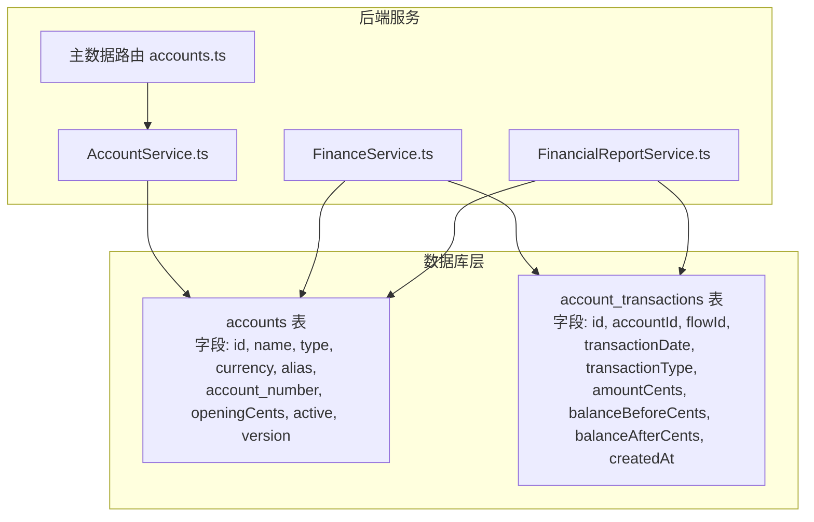
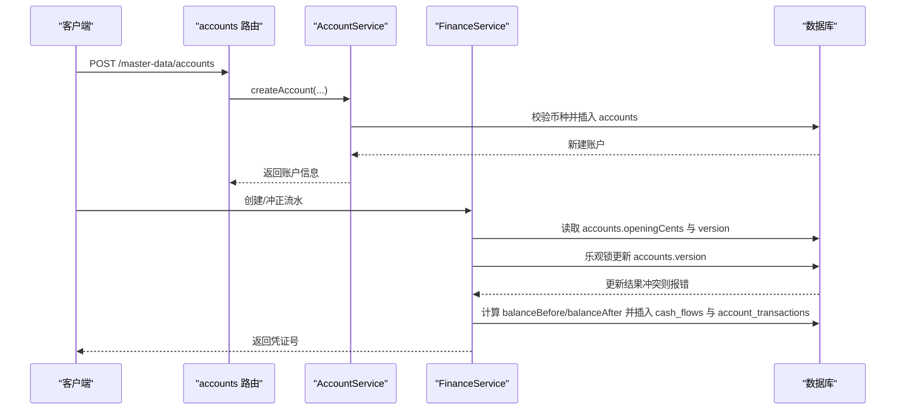
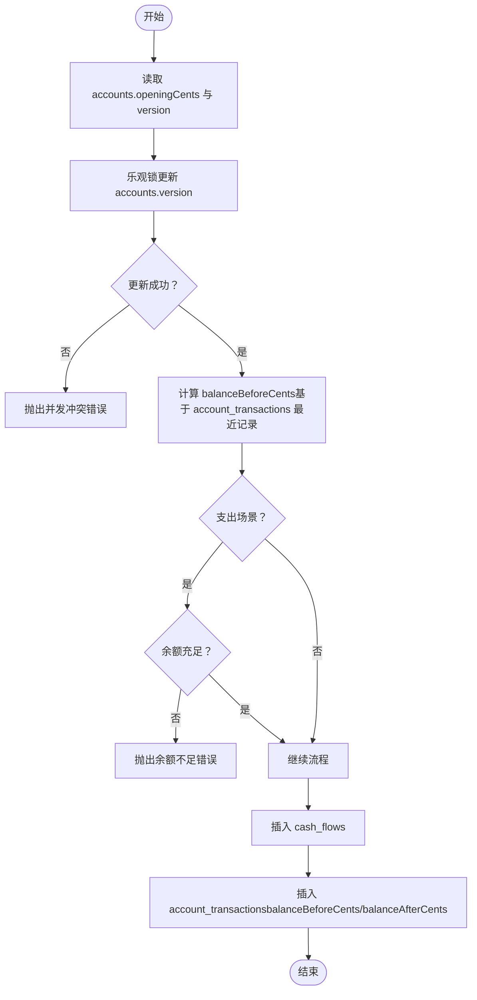
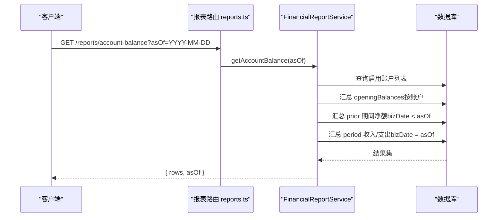
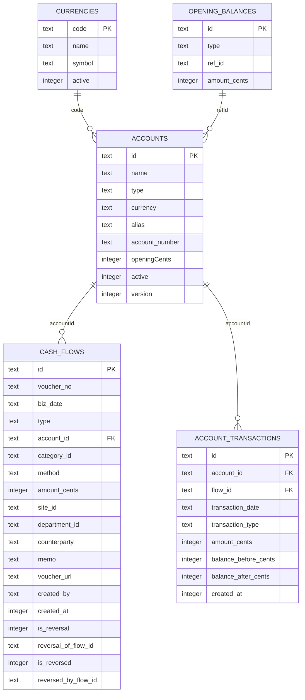

# 账户表 (accounts)

<cite>
**本文引用的文件**
- [backend/src/db/schema.ts](file://backend/src/db/schema.ts)
- [backend/drizzle/0000_chemical_may_parker.sql](file://backend/drizzle/0000_chemical_may_parker.sql)
- [backend/src/schemas/master-data.schema.ts](file://backend/src/schemas/master-data.schema.ts)
- [backend/src/routes/v2/master-data/accounts.ts](file://backend/src/routes/v2/master-data/accounts.ts)
- [backend/src/services/AccountService.ts](file://backend/src/services/AccountService.ts)
- [backend/src/services/FinanceService.ts](file://backend/src/services/FinanceService.ts)
- [backend/src/services/FinancialReportService.ts](file://backend/src/services/FinancialReportService.ts)
- [backend/src/routes/v2/reports.ts](file://backend/src/routes/v2/reports.ts)
</cite>

## 目录
1. [简介](#简介)
2. [项目结构](#项目结构)
3. [核心组件](#核心组件)
4. [架构总览](#架构总览)
5. [详细组件分析](#详细组件分析)
6. [依赖关系分析](#依赖关系分析)
7. [性能考量](#性能考量)
8. [故障排查指南](#故障排查指南)
9. [结论](#结论)

## 简介
本文件围绕财务系统中的“账户表（accounts）”进行系统化说明，重点覆盖以下字段：
- name：账户名称
- type：账户类型（如现金、银行、虚拟账户等）
- currency：币种代码
- openingCents：期初余额（以分为单位）
- active：是否启用
- version：乐观锁版本号，用于并发控制

同时阐述该表在系统中的定位：作为所有资金流动的起点与终点，支撑账户余额计算与财务报表生成；并通过 accountTransactions 表维护账户余额的准确性。

## 项目结构
账户表位于后端数据库模式定义中，配合 Drizzle ORM 的 schema.ts 文件与迁移脚本 0000_chemical_may_parker.sql 定义表结构。主数据路由 accounts.ts 提供账户的增删改查接口；AccountService 负责业务逻辑；FinanceService 在创建/冲正流水时通过乐观锁与 accountTransactions 维护余额一致性；FinancialReportService 与报表路由共同生成账户余额报表。

图表来源
- [backend/src/db/schema.ts](file://backend/src/db/schema.ts#L139-L149)
- [backend/drizzle/0000_chemical_may_parker.sql](file://backend/drizzle/0000_chemical_may_parker.sql#L30-L41)
- [backend/src/routes/v2/master-data/accounts.ts](file://backend/src/routes/v2/master-data/accounts.ts#L1-L310)
- [backend/src/services/AccountService.ts](file://backend/src/services/AccountService.ts#L1-L168)
- [backend/src/services/FinanceService.ts](file://backend/src/services/FinanceService.ts#L1-L443)
- [backend/src/services/FinancialReportService.ts](file://backend/src/services/FinancialReportService.ts#L165-L250)

章节来源
- [backend/src/db/schema.ts](file://backend/src/db/schema.ts#L139-L149)
- [backend/drizzle/0000_chemical_may_parker.sql](file://backend/drizzle/0000_chemical_may_parker.sql#L30-L41)
- [backend/src/routes/v2/master-data/accounts.ts](file://backend/src/routes/v2/master-data/accounts.ts#L1-L310)

## 核心组件
- 数据模型（Drizzle ORM 定义）
  - accounts 表：包含 id、name、type、currency、alias、account_number、openingCents、active、version 等字段。
  - account_transactions 表：记录每笔交易对某账户余额的影响，包含 balanceBeforeCents、balanceAfterCents 等关键字段。
- 业务服务
  - AccountService：提供账户查询、创建、更新、删除等能力，并校验币种有效性。
  - FinanceService：在创建/冲正流水时，使用乐观锁与 accountTransactions 维护余额一致性。
  - FinancialReportService：按账户维度汇总期初、期间流入/流出与期末余额，支撑报表生成。
- 接口路由
  - accounts 路由：提供账户列表、交易明细、创建、更新、删除等接口。

章节来源
- [backend/src/db/schema.ts](file://backend/src/db/schema.ts#L139-L149)
- [backend/src/services/AccountService.ts](file://backend/src/services/AccountService.ts#L1-L168)
- [backend/src/services/FinanceService.ts](file://backend/src/services/FinanceService.ts#L1-L443)
- [backend/src/services/FinancialReportService.ts](file://backend/src/services/FinancialReportService.ts#L165-L250)
- [backend/src/routes/v2/master-data/accounts.ts](file://backend/src/routes/v2/master-data/accounts.ts#L1-L310)

## 架构总览
账户表在系统中的职责与交互如下：
- 作为资金入口/出口：所有现金流（cash_flows）均关联到某个账户。
- 余额一致性保障：通过 account_transactions 维护逐笔交易前后的余额，避免直接在 accounts 中存储“当前余额”带来的并发风险。
- 并发控制：在创建/冲正流水时，使用 accounts.version 字段实现乐观锁，防止并发写入导致的余额错误。
- 报表生成：FinancialReportService 依据 accounts、cash_flows、account_transactions 计算账户余额，输出报表。

图表来源
- [backend/src/routes/v2/master-data/accounts.ts](file://backend/src/routes/v2/master-data/accounts.ts#L177-L214)
- [backend/src/services/AccountService.ts](file://backend/src/services/AccountService.ts#L84-L116)
- [backend/src/services/FinanceService.ts](file://backend/src/services/FinanceService.ts#L146-L229)

## 详细组件分析

### 字段定义与业务语义
- id
  - 类型：文本（text）
  - 约束：主键
  - 业务含义：账户唯一标识
- name
  - 类型：文本（text）
  - 约束：非空
  - 业务含义：账户名称，用于展示与检索
- type
  - 类型：文本（text）
  - 约束：非空；枚举值来自前端校验（cash、bank、credit_card、other）
  - 业务含义：账户类型，决定资金流向与报表分类
- currency
  - 类型：文本（text）
  - 约束：非空；长度为3（ISO币种代码）
  - 业务含义：账户币种；创建账户时需校验币种存在且启用
- alias
  - 类型：文本（text）
  - 约束：可空
  - 业务含义：账户别名或简称
- account_number
  - 类型：文本（text）
  - 约束：可空
  - 业务含义：银行账号或其他账户编号
- openingCents
  - 类型：整数（integer）
  - 约束：默认0；非负
  - 业务含义：期初余额（分），作为历史余额计算的基线
- active
  - 类型：整数（0/1）
  - 约束：默认1；0/1
  - 业务含义：是否启用；报表与筛选常用
- version
  - 类型：整数（integer）
  - 约束：默认1
  - 业务含义：乐观锁版本号，用于并发控制

章节来源
- [backend/drizzle/0000_chemical_may_parker.sql](file://backend/drizzle/0000_chemical_may_parker.sql#L30-L41)
- [backend/src/db/schema.ts](file://backend/src/db/schema.ts#L139-L149)
- [backend/src/schemas/master-data.schema.ts](file://backend/src/schemas/master-data.schema.ts#L52-L70)
- [backend/src/services/AccountService.ts](file://backend/src/services/AccountService.ts#L84-L116)

### Drizzle ORM 定义示例（路径）
- accounts 表定义位置：[backend/src/db/schema.ts](file://backend/src/db/schema.ts#L139-L149)
- 迁移脚本定义位置：[backend/drizzle/0000_chemical_may_parker.sql](file://backend/drizzle/0000_chemical_may_parker.sql#L30-L41)

说明：以上两处定义了 accounts 表的字段、约束与默认值。若需在代码中引用该表，请参考上述路径。

### 余额准确性与 accountTransactions 维护
- 余额计算链路
  - 期初：从 accounts.openingCents 开始
  - 期间：根据 cash_flows 汇总收入/支出
  - 期末：期初 + 期间净额
- 逐笔记录
  - 每笔交易在 account_transactions 中记录：
    - balanceBeforeCents：交易发生前余额
    - balanceAfterCents：交易发生后余额
    - amountCents：交易金额（分）
    - transactionDate：交易日期
- 并发控制
  - 在创建/冲正流水时，FinanceService 使用 accounts.version 实施乐观锁，避免并发写入导致的余额错误

图表来源
- [backend/src/services/FinanceService.ts](file://backend/src/services/FinanceService.ts#L146-L229)

章节来源
- [backend/src/services/FinanceService.ts](file://backend/src/services/FinanceService.ts#L146-L229)

### 财务报表与账户余额
- 报表维度
  - 按账户维度汇总：期初、期间收入、期间支出、期末余额
- 计算逻辑
  - 期初：从 openingBalances（按账户归集）与 prior 期间净额（bizDate < asOf）合计
  - 期间：按 bizDate = asOf 的收入/支出分别求和
  - 期末：期初 + 期间收入 - 期间支出
- 路由与服务
  - 报表路由：/reports/account-balance
  - 服务方法：FinancialReportService.getAccountBalance

图表来源
- [backend/src/routes/v2/reports.ts](file://backend/src/routes/v2/reports.ts#L479-L515)
- [backend/src/services/FinancialReportService.ts](file://backend/src/services/FinancialReportService.ts#L165-L250)

章节来源
- [backend/src/routes/v2/reports.ts](file://backend/src/routes/v2/reports.ts#L479-L515)
- [backend/src/services/FinancialReportService.ts](file://backend/src/services/FinancialReportService.ts#L165-L250)

### 主数据接口与权限
- 列表与过滤
  - 支持 activeOnly、accountType、currency、search 等过滤条件
- 创建/更新/删除
  - 创建时校验币种存在且启用，默认 active=1，openingCents 默认0
  - 更新时支持 name、type、currency、alias、accountNumber、active
  - 删除前检查是否存在流水记录，避免破坏数据完整性

章节来源
- [backend/src/routes/v2/master-data/accounts.ts](file://backend/src/routes/v2/master-data/accounts.ts#L1-L310)
- [backend/src/services/AccountService.ts](file://backend/src/services/AccountService.ts#L1-L168)
- [backend/src/schemas/master-data.schema.ts](file://backend/src/schemas/master-data.schema.ts#L52-L70)

## 依赖关系分析
- 表间依赖
  - accounts 与 currencies：通过 currency 外键关联，创建账户时需校验币种有效
  - accounts 与 cash_flows：cash_flows.accountId 关联 accounts.id
  - accounts 与 account_transactions：account_transactions.accountId 关联 accounts.id
- 服务依赖
  - AccountService 依赖 accounts、currencies
  - FinanceService 依赖 accounts、cash_flows、account_transactions
  - FinancialReportService 依赖 accounts、cash_flows、account_transactions、openingBalances

图表来源
- [backend/src/db/schema.ts](file://backend/src/db/schema.ts#L139-L206)
- [backend/drizzle/0000_chemical_may_parker.sql](file://backend/drizzle/0000_chemical_may_parker.sql#L30-L41)

章节来源
- [backend/src/db/schema.ts](file://backend/src/db/schema.ts#L139-L206)
- [backend/drizzle/0000_chemical_may_parker.sql](file://backend/drizzle/0000_chemical_may_parker.sql#L30-L41)

## 性能考量
- 索引与查询
  - account_transactions 已建立按 accountId 与 transaction_date 的复合索引，有利于按账户分页查询与排序
- 余额计算
  - 报表按日期切片聚合，建议在 biz_date 上保持良好统计分布，避免极端日期导致的扫描压力
- 并发写入
  - 通过 accounts.version 的乐观锁降低写入冲突概率；若冲突频繁，可考虑批量提交或减少热点账户的并发写入

[本节为通用指导，无需列出具体文件来源]

## 故障排查指南
- 创建账户时报错“币种不存在”
  - 可能原因：传入的 currency 未启用或不存在
  - 处理建议：确认币种已在 currencies 中存在且 active=1
  - 参考路径：[backend/src/services/AccountService.ts](file://backend/src/services/AccountService.ts#L92-L98)
- 删除账户失败
  - 可能原因：账户仍有流水记录
  - 处理建议：先清理相关 cash_flows，再删除账户
  - 参考路径：[backend/src/services/AccountService.ts](file://backend/src/services/AccountService.ts#L152-L165)
- 创建流水时提示“并发冲突”
  - 可能原因：多个请求同时写入同一账户
  - 处理建议：重试请求或降低并发
  - 参考路径：[backend/src/services/FinanceService.ts](file://backend/src/services/FinanceService.ts#L158-L165)
- 余额不足
  - 可能原因：账户可用余额小于支出金额
  - 处理建议：检查 account_transactions 中最近余额与交易历史
  - 参考路径：[backend/src/services/FinanceService.ts](file://backend/src/services/FinanceService.ts#L173-L186)

章节来源
- [backend/src/services/AccountService.ts](file://backend/src/services/AccountService.ts#L92-L98)
- [backend/src/services/AccountService.ts](file://backend/src/services/AccountService.ts#L152-L165)
- [backend/src/services/FinanceService.ts](file://backend/src/services/FinanceService.ts#L158-L186)

## 结论
账户表（accounts）是财务系统的核心基础表，承载着账户基本信息、期初余额与并发控制机制。通过与 cash_flows 和 account_transactions 的协同，系统实现了严谨的余额计算与一致性保障；借助 FinancialReportService，能够按账户维度生成准确的余额报表。建议在实际使用中：
- 明确账户类型与币种范围，确保数据规范性
- 严格遵循乐观锁策略，避免并发写入冲突
- 依托 account_transactions 的逐笔记录，保证报表与审计可追溯