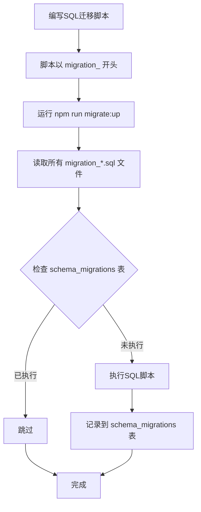
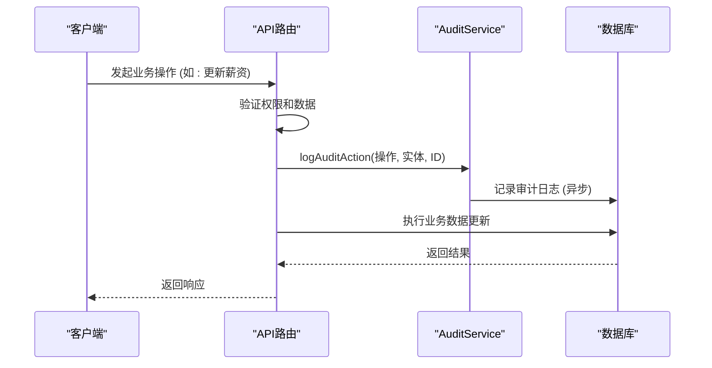

# 数据库设计

<cite>
**本文档引用的文件**  
- [schema.ts](file://backend/src/db/schema.ts)
- [drizzle.config.ts](file://backend/drizzle.config.ts)
- [migrate-up.ts](file://backend/scripts/migrate-up.ts)
- [optimistic-lock.ts](file://backend/src/utils/optimistic-lock.ts)
- [audit.ts](file://backend/src/utils/audit.ts)
- [index.ts](file://backend/src/db/index.ts)
- [db.ts](file://backend/src/utils/db.ts)
- [migration_add_salary_tables.sql](file://backend/src/db/migration_add_salary_tables.sql)
- [migration_add_cash_flow_reversal_fields.sql](file://backend/src/db/migration_add_cash_flow_reversal_fields.sql)
- [migration_add_departments_sort_order.sql](file://backend/src/db/migration_add_departments_sort_order.sql)
- [employees.ts](file://backend/src/routes/v2/employees.ts)
- [flows.ts](file://backend/src/routes/v2/flows.ts)
- [fixed-assets.ts](file://backend/src/routes/v2/fixed-assets.ts)
</cite>

## 目录
1. [引言](#引言)
2. [数据库模式定义](#数据库模式定义)
3. [核心数据模型](#核心数据模型)
4. [表间关系与ER图](#表间关系与er图)
5. [索引策略](#索引策略)
6. [数据库迁移机制](#数据库迁移机制)
7. [乐观锁机制](#乐观锁机制)
8. [审计日志机制](#审计日志机制)
9. [结论](#结论)

## 引言

本数据库设计文档详细描述了基于Drizzle ORM的财务管理系统数据库架构。系统采用SQLite作为底层数据库，通过Drizzle ORM进行模式定义和类型安全的数据库操作。文档重点解析了`schema.ts`中定义的主要数据模型，包括员工、账户、财务流水、固定资产、租赁物业、薪资记录等实体，以及它们之间的关系和约束。同时，文档还说明了数据库迁移流程、乐观锁机制和审计日志记录机制，为系统的开发、维护和扩展提供全面的技术参考。

**Section sources**
- [schema.ts](file://backend/src/db/schema.ts#L1-L706)

## 数据库模式定义

数据库模式在`backend/src/db/schema.ts`文件中定义，使用Drizzle ORM的`sqliteTable`函数创建所有数据表。Drizzle ORM提供了一种类型安全的方式来定义数据库模式，确保在TypeScript代码中对数据库的操作与模式定义保持一致。

数据库配置在`backend/drizzle.config.ts`中指定，该文件定义了使用SQLite方言，模式文件为`./src/db/schema.ts`，迁移文件输出目录为`./drizzle`。这使得Drizzle Kit工具能够根据TypeScript模式文件自动生成SQL迁移脚本。

数据库连接通过`backend/src/db/index.ts`中的`createDb`函数创建，该函数接收一个D1Database实例并返回一个Drizzle ORM数据库实例，同时将所有在`schema.ts`中定义的表作为模式传入。

**Section sources**
- [schema.ts](file://backend/src/db/schema.ts#L1-L706)
- [drizzle.config.ts](file://backend/drizzle.config.ts#L1-L8)
- [index.ts](file://backend/src/db/index.ts#L1-L7)

## 核心数据模型

本系统定义了多个核心数据模型，每个模型都对应一个数据库表，用于存储特定领域的业务数据。

### 员工与组织模型

`employees`表是系统的核心实体之一，存储了所有员工的信息。该表不仅包含员工的个人信息（如姓名、联系方式、紧急联系人），还合并了原有的用户认证信息（如`passwordHash`、`totpSecret`），实现了员工与用户的统一管理。此外，该表通过`positionId`、`orgDepartmentId`和`departmentId`字段与职位和部门建立关联，支持复杂的组织架构管理。

`positions`表定义了系统中的所有职位，包含职位代码、名称、级别、职能角色等信息，并通过`permissions`字段存储JSON格式的权限配置。`departments`和`headquarters`表分别管理普通部门和总部，而`orgDepartments`表则用于管理项目部门或组织部门，支持更灵活的组织结构。

**Section sources**
- [schema.ts](file://backend/src/db/schema.ts#L14-L109)

### 财务与账户模型

`accounts`表代表了系统中的所有资金账户，如银行账户、现金账户等。每个账户都有名称、类型、币种等属性。`cashFlows`表是财务流水的核心，记录了每一笔收入或支出的详细信息，包括业务日期、金额、关联账户、分类、交易对方等。为了支持财务冲正（红冲）操作，该表还包含了`isReversal`、`reversalOfFlowId`等字段。

`accountTransactions`表记录了账户的每一次余额变动，与`cashFlows`表形成一对多的关系，确保了账户余额的准确计算。`accountTransfers`表则专门用于记录账户间的转账操作，支持不同币种间的汇率转换。

**Section sources**
- [schema.ts](file://backend/src/db/schema.ts#L139-L190)
- [schema.ts](file://backend/src/db/schema.ts#L159-L188)
- [schema.ts](file://backend/src/db/schema.ts#L190-L206)
- [schema.ts](file://backend/src/db/schema.ts#L448-L476)

### 薪资与福利模型

`employeeSalaries`和`employeeAllowances`表分别存储了员工的薪资和津贴信息。这些表记录了薪资类型（试用期/正式）、币种、金额和生效日期，支持员工薪资的动态调整。

`salaryPayments`表是薪资发放的核心，记录了每个月每个员工的薪资发放状态，包括待员工确认、待财务审批、待支付等多个状态。该表通过`employeeId`、`year`和`month`的唯一索引确保了每个员工每月只能有一条薪资记录。`allowancePayments`表则用于记录津贴的发放。

**Section sources**
- [schema.ts](file://backend/src/db/schema.ts#L220-L239)
- [schema.ts](file://backend/src/db/schema.ts#L241-L267)
- [schema.ts](file://backend/src/db/schema.ts#L286-L316)
- [schema.ts](file://backend/src/db/schema.ts#L241-L267)

### 固定资产与租赁模型

`fixedAssets`表管理了公司的所有固定资产，包括资产编码、名称、类别、购买日期、价格、折旧方法等信息。`fixedAssetDepreciations`表记录了每项资产的折旧明细，`fixedAssetChanges`表则跟踪了资产状态、位置等变更历史。

`rentalProperties`表用于管理租赁的物业，如办公室、宿舍等，记录了物业类型、地址、租金、租期等信息。`rentalPayments`表记录了租金的支付情况，`dormitoryAllocations`表则专门用于管理宿舍的分配。

**Section sources**
- [schema.ts](file://backend/src/db/schema.ts#L506-L574)
- [schema.ts](file://backend/src/db/schema.ts#L532-L542)
- [schema.ts](file://backend/src/db/schema.ts#L544-L560)
- [schema.ts](file://backend/src/db/schema.ts#L576-L603)
- [schema.ts](file://backend/src/db/schema.ts#L605-L621)
- [schema.ts](file://backend/src/db/schema.ts#L641-L654)

## 表间关系与ER图

系统中的数据模型通过外键和逻辑关联形成了复杂的网状结构。以下是主要的表间关系：

```mermaid
erDiagram
employees ||--o{ employeeSalaries : "has"
employees ||--o{ employeeAllowances : "has"
employees ||--o{ employeeLeaves : "has"
employees ||--o{ fixedAssetAllocations : "allocates"
employees ||--o{ dormitoryAllocations : "allocates"
employees ||--o{ salaryPayments : "receives"
employees ||--o{ expenseReimbursements : "submits"
employees ||--o{ borrowings : "borrows"
employees ||--o{ sessions : "has"
employees ||--o{ trustedDevices : "has"
positions }o--|| employees : "assigned_to"
departments }o--|| employees : "belongs_to"
orgDepartments }o--|| employees : "belongs_to"
departments }o--|| sites : "manages"
departments }o--|| rentalProperties : "manages"
departments }o--|| cashFlows : "owns"
vendors }o--|| fixedAssets : "supplied_by"
vendors }o--|| arApDocs : "related_to"
accounts ||--o{ cashFlows : "records"
accounts ||--o{ accountTransactions : "has"
accounts ||--o{ accountTransfers : "from"
accounts ||--o{ accountTransfers : "to"
accounts ||--o{ siteBills : "paid_from"
accounts ||--o{ rentalPayments : "paid_from"
accounts ||--o{ repayments : "repaid_to"
categories }o--|| cashFlows : "categorized_as"
categories }o--|| siteBills : "categorized_as"
categories }o--|| arApDocs : "categorized_as"
sites ||--o{ cashFlows : "related_to"
sites ||--o{ siteBills : "has"
sites ||--o{ fixedAssets : "located_at"
fixedAssets ||--o{ fixedAssetDepreciations : "has"
fixedAssets ||--o{ fixedAssetChanges : "has"
fixedAssetAllocations }o--|| fixedAssets : "allocated_to"
dormitoryAllocations }o--|| rentalProperties : "allocated_in"
rentalProperties ||--o{ rentalPayments : "has"
rentalProperties ||--o{ rentalChanges : "has"
rentalProperties ||--o{ rentalPayableBills : "has"
borrowing }o--|| repayments : "repaid_by"
arApDocs ||--o{ settlements : "settled_by"
cashFlows ||--o{ settlements : "settled_by"
salaryPayments ||--o{ salaryPaymentAllocations : "has"
```

**Diagram sources**
- [schema.ts](file://backend/src/db/schema.ts#L14-L706)

## 索引策略

为了优化查询性能，系统在多个表上创建了索引。索引策略主要基于查询模式和外键关联。

在`cashFlows`表上，创建了`idxAccountBiz`复合索引（`accountId`, `bizDate`），用于加速按账户和业务日期查询流水的性能。`idxType`索引（`type`）用于快速筛选收入或支出流水。`idxReversal`索引（`reversalOfFlowId`）则用于高效查询被冲正的原始流水。

在`accountTransactions`表上，创建了`idxAccountDate`复合索引（`accountId`, `transactionDate`），以支持按账户和交易日期查询交易记录。

在`salaryPayments`和`allowancePayments`表上，创建了基于`employeeId`、`year`和`month`的唯一索引，这不仅保证了数据的唯一性，也极大地提升了按员工和月份查询薪资或津贴记录的性能。

**Section sources**
- [schema.ts](file://backend/src/db/schema.ts#L183-L187)
- [schema.ts](file://backend/src/db/schema.ts#L203-L205)
- [schema.ts](file://backend/src/db/schema.ts#L259-L265)
- [schema.ts](file://backend/src/db/schema.ts#L313-L315)

## 数据库迁移机制

系统采用自定义的迁移脚本`backend/scripts/migrate-up.ts`来管理数据库模式的演进。该脚本遵循“迁移即代码”的原则，将所有模式变更记录在`src/db`目录下的SQL文件中，文件名以`migration_`开头，如`migration_add_salary_tables.sql`。

迁移流程如下：
1.  **生成迁移文件**：开发人员手动编写SQL脚本，描述对数据库模式的变更（如添加表、修改列、创建索引）。
2.  **执行迁移**：运行`npm run migrate:up`命令，`migrate-up.ts`脚本会读取`src/db`目录下所有以`migration_`开头的SQL文件，并按文件名排序。
3.  **检查与执行**：脚本通过查询`schema_migrations`表来检查每个迁移文件是否已执行。如果未执行，则使用`wrangler d1 execute`命令执行该SQL文件。
4.  **记录历史**：迁移成功执行后，脚本会将迁移文件的名称、校验和和执行时间记录到`schema_migrations`表中，防止重复执行。

该机制确保了数据库模式变更的可追溯性和一致性，支持在本地和远程（Cloudflare D1）环境中安全地应用迁移。

**Diagram sources**
- [migrate-up.ts](file://backend/scripts/migrate-up.ts#L1-L183)
- [migration_add_salary_tables.sql](file://backend/src/db/migration_add_salary_tables.sql#L1-L21)
- [migration_add_cash_flow_reversal_fields.sql](file://backend/src/db/migration_add_cash_flow_reversal_fields.sql#L1-L18)
- [migration_add_departments_sort_order.sql](file://backend/src/db/migration_add_departments_sort_order.sql#L1-L9)

**Section sources**
- [migrate-up.ts](file://backend/scripts/migrate-up.ts#L1-L183)
- [migration_add_salary_tables.sql](file://backend/src/db/migration_add_salary_tables.sql#L1-L21)

## 乐观锁机制

为了防止并发更新导致的数据冲突，系统在多个关键业务表中实现了乐观锁机制。`accounts`、`employeeLeaves`、`borrowings`、`expenseReimbursements`和`salaryPayments`表都包含一个`version`字段（整数类型，默认值为1），作为乐观锁的版本号。

该机制通过`backend/src/utils/optimistic-lock.ts`中的工具函数实现：
- `validateVersion(currentVersion, expectedVersion)`：在更新数据前，验证数据库中的当前版本号是否与客户端期望的版本号一致。如果不一致，则抛出并发修改错误。
- `incrementVersion(version)`：在更新数据时，将版本号递增。

当用户A和用户B同时加载同一条记录时，他们看到的版本号相同。当用户A先提交更新时，数据库中的版本号会递增。当用户B尝试提交时，其期望的版本号已过时，`validateVersion`函数会抛出错误，提示用户B“数据已被其他用户修改，请刷新后重试”，从而避免了数据覆盖。

**Section sources**
- [schema.ts](file://backend/src/db/schema.ts#L148)
- [schema.ts](file://backend/src/db/schema.ts#L281)
- [schema.ts](file://backend/src/db/schema.ts#L380)
- [schema.ts](file://backend/src/db/schema.ts#L406)
- [schema.ts](file://backend/src/db/schema.ts#L309)
- [optimistic-lock.ts](file://backend/src/utils/optimistic-lock.ts#L1-L41)

## 审计日志机制

系统通过`auditLogs`表和`businessOperationHistory`表实现了全面的审计日志功能，用于记录所有关键业务操作，满足安全和合规要求。

`auditLogs`表记录了由`backend/src/utils/audit.ts`中的`logAuditAction`函数触发的审计事件。该函数在API路由中被调用，记录操作者（`actorId`）、操作类型（`action`）、操作对象（`entity`）、对象ID（`entityId`）、操作时间（`at`）以及IP地址和地理位置信息。例如，在创建员工、修改薪资或支付租金时，都会调用此函数记录日志。

`businessOperationHistory`表则更侧重于业务流程的追踪，记录了实体（如薪资发放、借款）的状态变更历史，包括操作前后的数据快照（`beforeData`, `afterData`），这对于追踪审批流程和问题排查至关重要。

**Diagram sources**
- [audit.ts](file://backend/src/utils/audit.ts#L1-L90)
- [schema.ts](file://backend/src/db/schema.ts#L675-L692)
- [schema.ts](file://backend/src/db/schema.ts#L694-L705)

**Section sources**
- [audit.ts](file://backend/src/utils/audit.ts#L1-L90)
- [schema.ts](file://backend/src/db/schema.ts#L675-L705)
- [employees.ts](file://backend/src/routes/v2/employees.ts#L1-L200)
- [flows.ts](file://backend/src/routes/v2/flows.ts#L1-L200)
- [fixed-assets.ts](file://backend/src/routes/v2/fixed-assets.ts#L1-L200)

## 结论

本数据库设计文档全面阐述了基于Drizzle ORM的财务管理系统数据库架构。系统通过清晰的模式定义、合理的表间关系、高效的索引策略和完善的迁移机制，构建了一个健壮、可维护的数据存储层。乐观锁机制有效防止了并发更新冲突，确保了数据一致性。审计日志机制则提供了完整的操作追溯能力，增强了系统的安全性和合规性。整体设计充分考虑了业务需求和系统性能，为财务业务的稳定运行提供了坚实的数据基础。