# 数据库设计

<cite>
**本文档引用的文件**   
- [schema.sql](file://backend/src/db/schema.sql)
- [schema.ts](file://backend/src/db/schema.ts)
- [migration_expand_permissions.sql](file://backend/src/db/archive/migration_expand_permissions.sql)
- [migration_performance_indexes.sql](file://backend/src/db/archive/migration_performance_indexes.sql)
- [migration_unify_positions.sql](file://backend/src/db/archive/migration_unify_positions.sql)
- [migration_remove_users_name.sql](file://backend/src/db/archive/migration_remove_users_name.sql)
- [migration_sessions.sql](file://backend/src/db/archive/migration_sessions.sql)
- [migration_add_audit_ip.sql](file://backend/src/db/archive/migration_add_audit_ip.sql)
- [drizzle.config.ts](file://backend/drizzle.config.ts)
</cite>

## 目录
1. [简介](#简介)
2. [核心数据表结构](#核心数据表结构)
3. [实体关系图（ERD）](#实体关系图erd)
4. [数据库演进历史](#数据库演进历史)
5. [数据完整性与业务规则](#数据完整性与业务规则)
6. [性能优化建议](#性能优化建议)
7. [结论](#结论)

## 简介
本文件详细描述了财务系统（caiwu-main）的数据库设计。该系统采用SQLite作为数据库引擎，并使用Drizzle ORM进行模式定义和迁移管理。数据库设计遵循清晰的分层原则，将用户认证信息与员工业务信息分离，支持多层级的组织架构（总部、项目、部门），并实现了精细化的基于职位的权限控制系统。本文档基于`schema.sql`和`schema.ts`文件，结合`archive`目录下的迁移脚本，全面阐述了核心数据表、表间关系、数据库演进过程以及性能优化策略。

**Section sources**
- [schema.sql](file://backend/src/db/schema.sql)
- [schema.ts](file://backend/src/db/schema.ts)
- [drizzle.config.ts](file://backend/drizzle.config.ts)

## 核心数据表结构
本节详细描述了系统中的核心数据表，包括其字段、数据类型、主外键约束和索引。

### users 表
`users`表专用于用户认证，不包含员工的业务信息。
- **字段**:
  - `id`: TEXT, 主键，用户唯一标识。
  - `email`: TEXT, NOT NULL, UNIQUE, 用户登录邮箱。
  - `password_hash`: TEXT, 密码哈希值。
  - `active`: INTEGER, 默认值1，表示用户是否激活。
  - `must_change_password`: INTEGER, 默认值0，强制用户首次登录后修改密码。
  - `position_id`: TEXT, 外键，关联`positions`表，表示用户的职位。
  - `department_id`: TEXT, 外键，关联`departments`表，表示用户所属的项目。
  - `org_department_id`: TEXT, 外键，关联`org_departments`表，表示用户所属的组织部门。
  - `created_at`: INTEGER, 记录创建时间戳（毫秒）。
- **索引**:
  - `idx_users_email`: 在`email`字段上创建唯一索引，确保邮箱唯一性并加速登录查询。
- **业务规则**: 该表不存储`name`字段，员工姓名存储在`employees`表中，实现了认证与业务数据的分离。

**Section sources**
- [schema.sql](file://backend/src/db/schema.sql#L4-L17)
- [schema.ts](file://backend/src/db/schema.ts#L11-L24)

### employees 表
`employees`表是员工信息的核心业务表，包含所有与员工相关的业务数据。
- **字段**:
  - `id`: TEXT, 主键，员工唯一标识。
  - `email`: TEXT, NOT NULL, UNIQUE, 员工邮箱。
  - `name`: TEXT, NOT NULL, 员工姓名。
  - `position_id`: TEXT, 外键，关联`positions`表。
  - `org_department_id`: TEXT, 外键，关联`org_departments`表。
  - `department_id`: TEXT, 外键，关联`departments`表。
  - `join_date`: TEXT, 入职日期。
  - `probation_salary_cents`, `regular_salary_cents`: INTEGER, 试用期和正式薪资（以分为单位）。
  - `living_allowance_cents`, `housing_allowance_cents`, `transportation_allowance_cents`, `meal_allowance_cents`: INTEGER, 各类津贴（以分为单位）。
  - `status`: TEXT, 员工状态（如在职、离职）。
  - `phone`, `address`, `birthday`: TEXT, 员工联系方式和基本信息。
  - `work_schedule`: TEXT, 工作排班。
  - `annual_leave_days`: INTEGER, 年假天数。
  - `created_at`, `updated_at`: INTEGER, 创建和更新时间戳。
- **索引**:
  - `idx_employees_department_id`, `idx_employees_org_department_id`: 在部门ID上创建索引，加速按部门查询员工。
  - `idx_employees_active`: 在`active`字段上创建索引，加速查询在职员工。

**Section sources**
- [schema.sql](file://backend/src/db/schema.sql#L20-L49)
- [schema.ts](file://backend/src/db/schema.ts#L26-L56)

### positions 表
`positions`表定义了系统的职位体系，是权限管理的基础。
- **字段**:
  - `id`: TEXT, 主键，职位唯一标识。
  - `code`: TEXT, NOT NULL, UNIQUE, 职位代码（如`hq_manager`, `project_finance`），用于程序逻辑。
  - `name`: TEXT, NOT NULL, 职位名称（如“总部主管”）。
  - `level`: INTEGER, NOT NULL, 职位层级（1-总部，2-项目，3-组）。
  - `function_role`: TEXT, NOT NULL, 职能角色（如`director`, `hr`, `finance`, `developer`），用于统一权限检查。
  - `can_manage_subordinates`: INTEGER, 默认值0，表示该职位是否可以管理下属。
  - `permissions`: TEXT, JSON字符串，存储该职位的详细权限配置。
  - `active`: INTEGER, 默认值1，表示职位是否启用。
  - `created_at`, `updated_at`: INTEGER, 创建和更新时间戳。
- **业务规则**: 权限系统通过`function_role`和`permissions`字段实现，`permissions`字段的JSON结构定义了该职位在各个模块（如财务、人事、系统）的具体操作权限。

**Section sources**
- [schema.sql](file://backend/src/db/schema.sql#L52-L65)
- [schema.ts](file://backend/src/db/schema.ts#L58-L71)

### departments 表
`departments`表代表“项目”级别的部门。
- **字段**:
  - `id`: TEXT, 主键。
  - `hq_id`: TEXT, 外键，关联`headquarters`表，表示该项目所属的总部。
  - `name`: TEXT, NOT NULL, 项目名称。
  - `code`: TEXT, 项目代码。
  - `active`: INTEGER, 默认值1，表示项目是否活跃。
  - `created_at`, `updated_at`: INTEGER, 时间戳。
- **关系**: 一个`headquarters`可以有多个`departments`。

**Section sources**
- [schema.sql](file://backend/src/db/schema.sql#L68-L76)
- [schema.ts](file://backend/src/db/schema.ts#L73-L81)

### org_departments 表
`org_departments`表代表组织内的具体部门，是`departments`的子级，支持树形结构。
- **字段**:
  - `id`: TEXT, 主键。
  - `project_id`: TEXT, 外键，关联`departments`表，表示该组织部门所属的项目。
  - `parent_id`: TEXT, 外键，关联自身，实现树形结构。
  - `name`: TEXT, NOT NULL, 部门名称。
  - `allowed_modules`: TEXT, JSON数组，配置该部门可访问的功能模块。
  - `allowed_positions`: TEXT, JSON数组，限制该部门可用的职位ID。
  - `default_position_id`: TEXT, 外键，为新加入该部门的员工设置默认职位。
  - `active`: INTEGER, 默认值1。
  - `sort_order`: INTEGER, 默认值0，用于排序。
  - `created_at`, `updated_at`: INTEGER, 时间戳。
- **索引**:
  - `idx_org_departments_parent_id`, `idx_org_departments_project_id`: 加速树形结构和项目层级的查询。

**Section sources**
- [schema.sql](file://backend/src/db/schema.sql#L79-L93)
- [schema.ts](file://backend/src/db/schema.ts#L102-L116)

### accounts 表
`accounts`表定义了财务系统中的所有账户。
- **字段**:
  - `id`: TEXT, 主键。
  - `name`: TEXT, NOT NULL, 账户名称。
  - `type`: TEXT, NOT NULL, 账户类型（如现金、银行、虚拟）。
  - `currency`: TEXT, NOT NULL, 关联`currencies.code`，账户的币种。
  - `opening_cents`: INTEGER, 默认值0，期初余额（以分为单位）。
  - `active`: INTEGER, 默认值1，账户是否启用。
- **业务规则**: 账户是现金流（`cash_flows`）和账户交易（`account_transactions`）的基础。

**Section sources**
- [schema.sql](file://backend/src/db/schema.sql#L159-L168)
- [schema.ts](file://backend/src/db/schema.ts#L146-L155)

### cash_flows 表
`cash_flows`表记录了所有的现金流（收入和支出）。
- **字段**:
  - `id`: TEXT, 主键。
  - `voucher_no`: TEXT, 凭证号。
  - `biz_date`: TEXT, NOT NULL, 业务日期。
  - `type`: TEXT, NOT NULL, 类型（'income', 'expense'）。
  - `account_id`: TEXT, NOT NULL, 外键，关联`accounts`表。
  - `category_id`: TEXT, 外键，关联`categories`表，表示收支类别。
  - `amount_cents`: INTEGER, NOT NULL, 金额（以分为单位）。
  - `department_id`: TEXT, 外键，关联`departments`表，用于项目级财务核算。
  - `site_id`: TEXT, 外键，关联`sites`表，用于站点级财务核算。
  - `created_by`: TEXT, 外键，关联`users.id`，记录创建人。
  - `created_at`: INTEGER, 创建时间戳。
- **索引**:
  - `idx_cash_flows_account_id`, `idx_cash_flows_biz_date`, `idx_cash_flows_type`: 基础索引。
  - `idx_cash_flows_biz_date_dept`, `idx_cash_flows_dept_date`: 复合索引，优化按日期和部门的财务报表查询。

**Section sources**
- [schema.sql](file://backend/src/db/schema.sql#L171-L187)
- [schema.ts](file://backend/src/db/schema.ts#L165-L181)

## 实体关系图（ERD）
以下ER图展示了核心数据表之间的关系。

```mermaid
erDiagram
users ||--o{ sessions : "has"
users ||--o{ employees : "has"
users }|--|| positions : "holds"
users }|--|| departments : "belongs_to"
users }|--|| org_departments : "belongs_to"
users ||--o{ borrowings : "creates"
users ||--o{ repayments : "creates"
users ||--o{ audit_logs : "triggers"
users ||--o{ trusted_devices : "has"
employees }|--|| positions : "holds"
employees }|--|| departments : "belongs_to"
employees }|--|| org_departments : "belongs_to"
employees ||--o{ employee_salaries : "has"
employees ||--o{ employee_allowances : "has"
employees ||--o{ employee_leaves : "requests"
employees ||--o{ expense_reimbursements : "submits"
employees ||--o{ salary_payments : "receives"
employees ||--o{ fixed_asset_allocations : "uses"
employees ||--o{ dormitory_allocations : "lives_in"
employees ||--o{ attendance_records : "generates"
positions }|--o{ employees : "held_by"
positions }|--o{ user_departments : "assigned_in"
positions }|--o{ org_departments : "default_for"
departments }|--o{ org_departments : "contains"
departments }|--o{ sites : "manages"
departments }|--o{ cash_flows : "for"
departments }|--o{ ar_ap_docs : "for"
departments }|--o{ site_bills : "for"
departments }|--o{ rental_properties : "manages"
org_departments }|--o{ employees : "contains"
org_departments }|--o{ user_departments : "has"
org_departments }|--o{ fixed_assets : "owns"
org_departments }|--o{ rental_properties : "owns"
accounts ||--o{ cash_flows : "holds"
accounts ||--o{ account_transactions : "has"
accounts ||--o{ account_transfers : "from/to"
accounts ||--o{ borrowings : "from"
accounts ||--o{ repayments : "to"
accounts ||--o{ site_bills : "paid_from"
accounts ||--o{ rental_payments : "paid_from"
accounts ||--o{ salary_payment_allocations : "funds"
categories }|--o{ cash_flows : "categorized_as"
categories }|--o{ site_bills : "categorized_as"
categories }|--o{ rental_payments : "categorized_as"
cash_flows ||--o{ account_transactions : "generates"
cash_flows ||--o{ settlements : "settles"
ar_ap_docs ||--o{ settlements : "settled_by"
ar_ap_docs ||--o{ cash_flows : "settled_by"
borrowings ||--o{ repayments : "repaid_by"
borrowings ||--o{ cash_flows : "generates"
fixed_assets }|--o{ fixed_asset_depreciations : "has"
fixed_assets }|--o{ fixed_asset_changes : "has"
fixed_assets }|--o{ fixed_asset_allocations : "allocated_to"
fixed_assets }|--o{ cash_flows : "generates"
fixed_assets }|--o{ vendors : "purchased_from"
rental_properties }|--o{ rental_payments : "has"
rental_properties }|--o{ rental_changes : "has"
rental_properties }|--o{ rental_payable_bills : "has"
rental_properties }|--o{ dormitory_allocations : "has"
rental_properties }|--o{ cash_flows : "generates"
salary_payments }|--o{ salary_payment_allocations : "has"
salary_payments }|--o{ cash_flows : "generates"
vendors }|--o{ fixed_assets : "supplies"
vendors }|--o{ ar_ap_docs : "with"
```

**Diagram sources**
- [schema.sql](file://backend/src/db/schema.sql)
- [schema.ts](file://backend/src/db/schema.ts)

## 数据库演进历史
数据库通过一系列迁移脚本（migration）进行演进，以下是关键变更的分析。

### 权限系统重构
`migration_expand_permissions.sql`脚本对权限系统进行了重大扩展和规范化。
- **变更内容**:
  - 为`positions`表的`permissions`字段添加了`finance`和`system`模块的详细权限。
  - `finance`模块新增了`salary`, `allowance`, `site_bill`等子模块的权限。
  - `system`模块新增了`account`, `category`, `currency`, `headquarters`等子模块的权限。
  - 为所有预设职位（如`hq_director`, `project_finance`）更新了完整的权限JSON配置。
- **目的**: 实现统一的权限检查逻辑，确保不同层级的管理者（总部、项目）能够访问其职责范围内的所有财务和系统配置功能。

**Section sources**
- [migration_expand_permissions.sql](file://backend/src/db/archive/migration_expand_permissions.sql)

### 职位体系扁平化
`migration_unify_positions.sql`脚本对职位代码和角色进行了统一和扁平化处理。
- **变更内容**:
  - 将`hq_director`和`project_director`统一为`hq_manager`和`project_manager`，并确保`function_role`为`director`。
  - 将`team_developer`和`team_member`统一为`team_engineer`，并确保`function_role`为`developer`。
  - 更新了`employees`表中所有受影响员工的`position_id`。
- **目的**: 消除职位命名的歧义，建立清晰、一致的职位体系，简化前端逻辑和权限判断。

**Section sources**
- [migration_unify_positions.sql](file://backend/src/db/archive/migration_unify_positions.sql)

### 认证与业务数据分离
`migration_remove_users_name.sql`脚本将用户姓名从认证表中移除。
- **变更内容**:
  - 从`users`表中删除了`name`字段。
  - 所有员工的姓名信息统一存储在`employees`表中。
- **目的**: 遵循关注点分离原则，`users`表仅负责认证，`employees`表负责所有员工的业务信息，提高了数据一致性和可维护性。

**Section sources**
- [migration_remove_users_name.sql](file://backend/src/db/archive/migration_remove_users_name.sql)

### 其他关键变更
- `migration_sessions.sql`: 为`sessions`表添加了`ip_address`, `user_agent`, `created_at`, `last_active_at`等字段，增强了会话管理和安全审计能力。
- `migration_add_audit_ip.sql`: 为`audit_logs`表添加了`ip`和`ip_location`字段，记录操作者的IP地址和地理位置，提升了审计日志的完整性。
- `migration_performance_indexes.sql`: 创建了多个复合索引，如`idx_cash_flows_biz_date_dept`，显著提升了按日期和部门查询财务数据的性能。

**Section sources**
- [migration_sessions.sql](file://backend/src/db/archive/migration_sessions.sql)
- [migration_add_audit_ip.sql](file://backend/src/db/archive/migration_add_audit_ip.sql)
- [migration_performance_indexes.sql](file://backend/src/db/archive/migration_performance_indexes.sql)

## 数据完整性与业务规则
数据库设计通过多种机制确保数据的完整性和业务规则的实现。

### 主外键约束
所有表都通过主键（PRIMARY KEY）确保记录的唯一性。外键（FOREIGN KEY）约束确保了引用的完整性，例如：
- `employees.department_id` 必须引用 `departments.id`。
- `cash_flows.account_id` 必须引用 `accounts.id`。
- `salary_payments.employee_id` 必须引用 `employees.id`。

### 唯一性约束
- `users.email` 和 `employees.email` 都有UNIQUE约束，确保邮箱地址的唯一性。
- `positions.code` 有UNIQUE约束，确保职位代码的唯一性。
- `fixed_assets.asset_code` 有UNIQUE约束，确保资产编码的唯一性。

### 默认值与非空约束
- `active`字段普遍使用`DEFAULT 1`，默认为激活状态。
- `created_at`字段在创建记录时自动填充时间戳。
- 关键业务字段如`employees.name`, `cash_flows.amount_cents`, `cash_flows.biz_date`等都标记为`NOT NULL`，防止关键信息缺失。

### JSON字段实现灵活配置
- `positions.permissions`: 使用JSON字符串存储复杂的权限配置，避免了为每个权限创建单独字段的繁琐。
- `org_departments.allowed_modules` 和 `allowed_positions`: 使用JSON数组实现部门级别的功能和职位白名单配置，提供了极大的灵活性。

**Section sources**
- [schema.sql](file://backend/src/db/schema.sql)
- [schema.ts](file://backend/src/db/schema.ts)

## 性能优化建议
基于现有的索引设计和查询模式，提出以下性能优化建议。

### 查询索引策略
- **财务报表查询**: 对于按日期和部门/站点聚合的查询（如月度收支报表），应确保使用复合索引。现有索引`idx_cash_flows_biz_date_dept`和`idx_cash_flows_biz_date_site`已为此类查询优化。
- **员工相关查询**: 查询特定员工的薪资、津贴、请假记录时，应利用`idx_employee_salaries_emp_id`、`idx_employee_allowances_emp_id`、`idx_employee_leaves_emp_status_date`等索引。
- **状态过滤查询**: 对于状态为`pending`的记录查询（如待审批的报销、借款），应使用`idx_expense_reimbursements_status`、`idx_borrowings_created_at`等索引。

### 潜在优化点
- **account_transfers 表**: 该表在`schema.sql`中未定义，但在`schema.ts`中存在。应确保为`from_account_id`, `to_account_id`, `transfer_date`等字段创建适当的索引。
- **大数据量表的分区**: 如果`cash_flows`或`audit_logs`表的数据量持续增长，可以考虑按`biz_date`或`at`字段进行时间分区，以提升历史数据查询性能。
- **避免N+1查询**: 在应用层，应使用JOIN或批量查询来获取关联数据，避免为每个主记录单独查询其关联记录。

**Section sources**
- [schema.sql](file://backend/src/db/schema.sql#L297-L423)
- [migration_performance_indexes.sql](file://backend/src/db/archive/migration_performance_indexes.sql)

## 结论
该财务系统的数据库设计结构清晰、扩展性强。通过将认证与业务数据分离、建立多层级的组织架构、实现基于职位的精细化权限控制，系统能够有效支持复杂的业务场景。数据库的演进历史表明，设计是持续优化和规范化的。现有的索引策略已针对核心查询进行了优化。对于DBA和高级开发者而言，理解`positions`表的`function_role`和`permissions`字段是掌握权限系统的关键，而利用好复合索引则是保证系统高性能运行的基础。