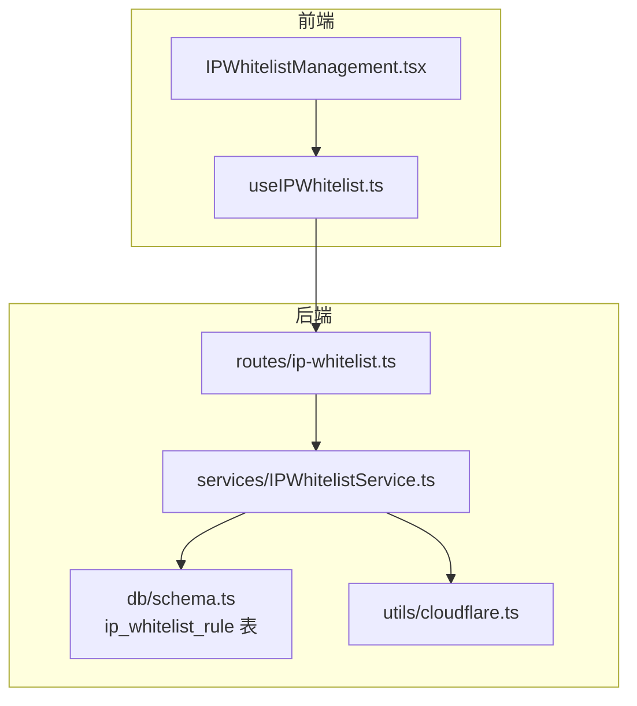
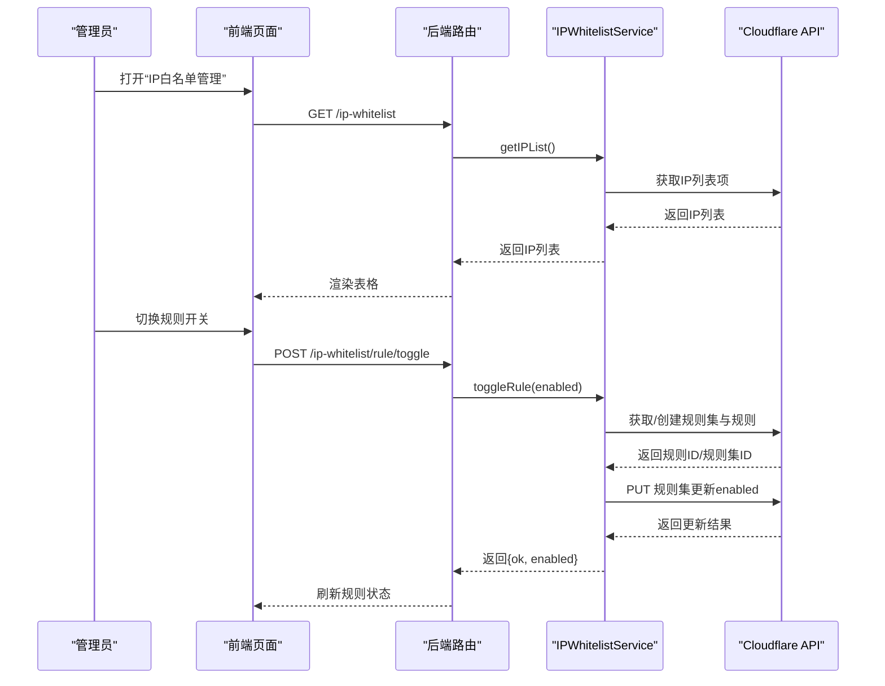
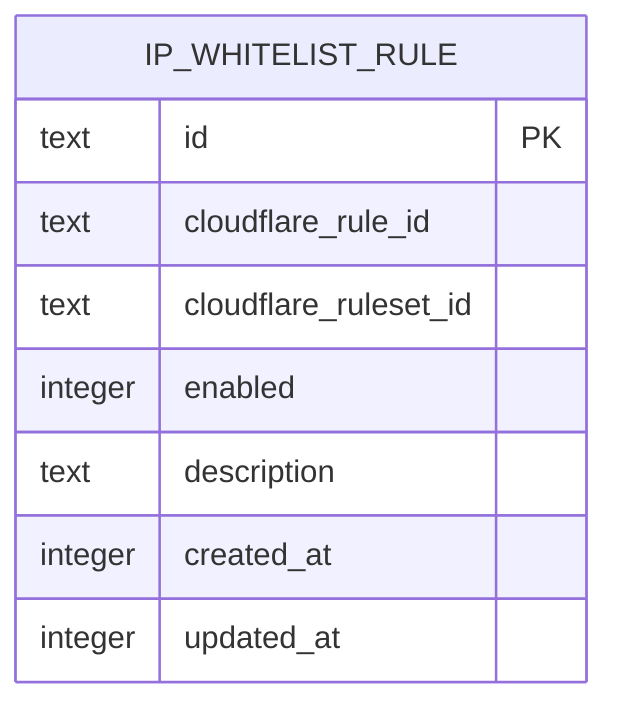
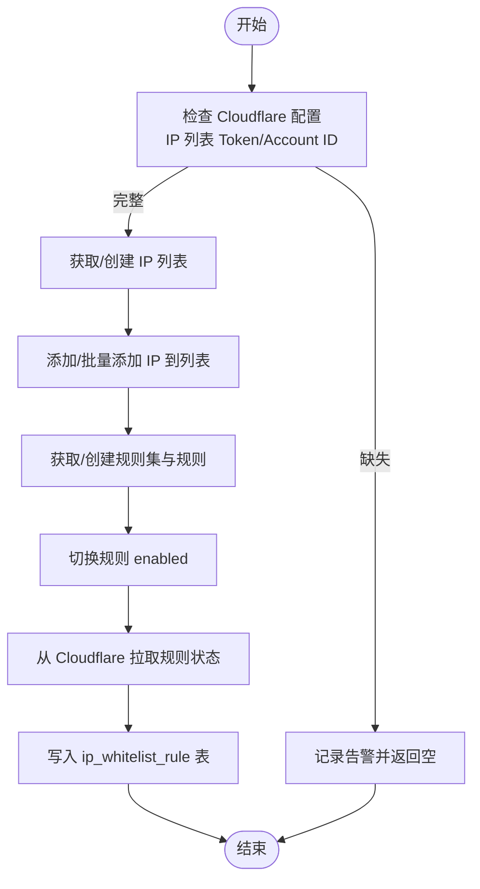
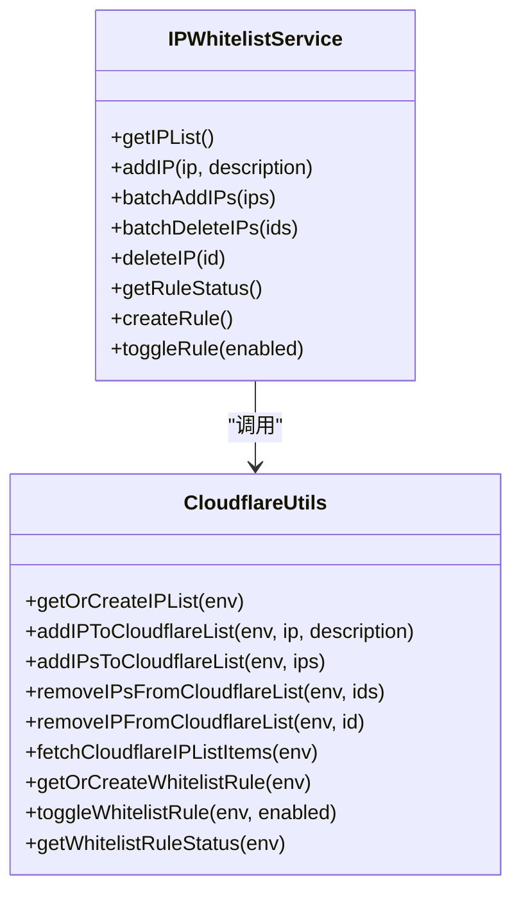
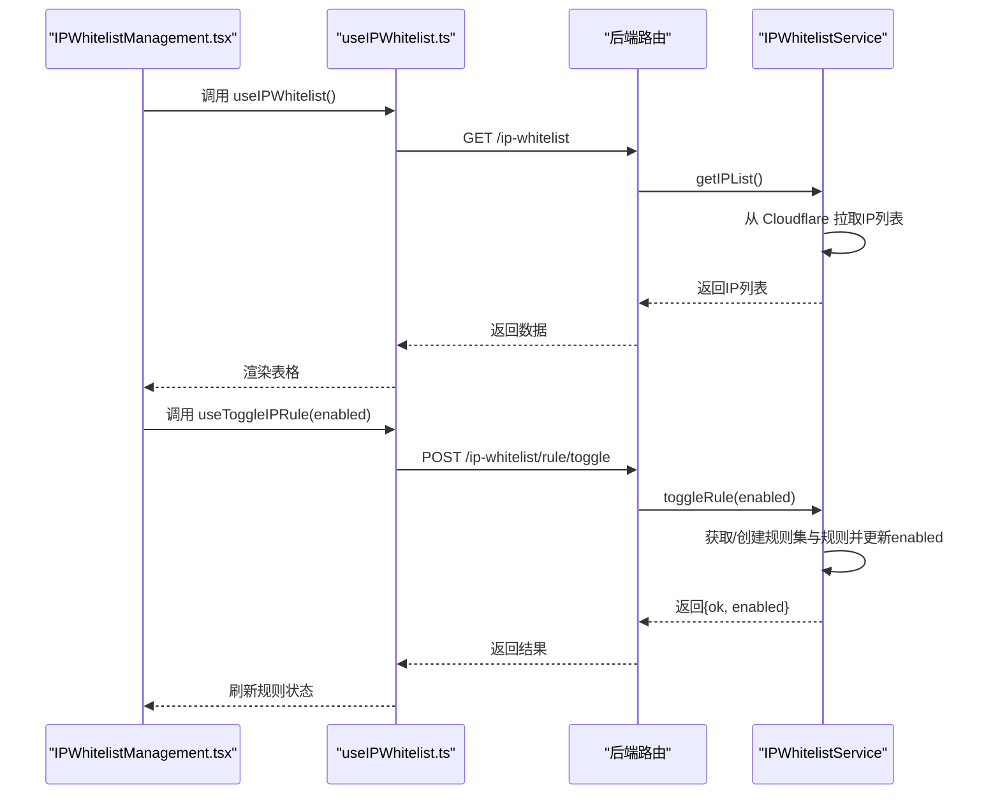
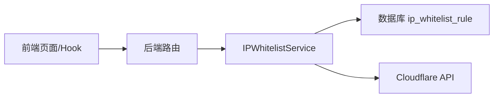

# IP白名单

<cite>
**本文引用的文件**
- [backend/src/db/schema.ts](file://backend/src/db/schema.ts)
- [backend/src/routes/ip-whitelist.ts](file://backend/src/routes/ip-whitelist.ts)
- [backend/src/services/IPWhitelistService.ts](file://backend/src/services/IPWhitelistService.ts)
- [backend/src/utils/cloudflare.ts](file://backend/src/utils/cloudflare.ts)
- [frontend/src/features/system/pages/IPWhitelistManagement.tsx](file://frontend/src/features/system/pages/IPWhitelistManagement.tsx)
- [frontend/src/hooks/business/useIPWhitelist.ts](file://frontend/src/hooks/business/useIPWhitelist.ts)
- [frontend/src/validations/ipWhitelist.schema.ts](file://frontend/src/validations/ipWhitelist.schema.ts)
- [backend/test/routes/ip-whitelist.test.ts](file://backend/test/routes/ip-whitelist.test.ts)
- [backend/.cloudflare-tokens](file://backend/.cloudflare-tokens)
</cite>

## 目录
1. [简介](#简介)
2. [项目结构](#项目结构)
3. [核心组件](#核心组件)
4. [架构总览](#架构总览)
5. [详细组件分析](#详细组件分析)
6. [依赖关系分析](#依赖关系分析)
7. [性能考量](#性能考量)
8. [故障排查指南](#故障排查指南)
9. [结论](#结论)
10. [附录](#附录)

## 简介
本文件面向系统管理员与开发人员，系统化阐述“IP白名单”功能的数据模型与实现机制，重点说明以下内容：
- ip_whitelist_rule 表的字段设计与用途
- 如何与 Cloudflare 安全规则集成，实现网络访问控制
- 前端配置界面与后端接口的交互流程
- 配置流程与安全策略建议

## 项目结构
IP白名单功能由前端页面、业务 Hook、后端路由与服务层、以及与 Cloudflare 的集成工具共同组成。核心文件如下：
- 数据模型：backend/src/db/schema.ts 中定义了 ip_whitelist_rule 表
- 前端页面：frontend/src/features/system/pages/IPWhitelistManagement.tsx
- 前端 Hook：frontend/src/hooks/business/useIPWhitelist.ts
- 后端路由：backend/src/routes/ip-whitelist.ts
- 业务服务：backend/src/services/IPWhitelistService.ts
- Cloudflare 集成：backend/src/utils/cloudflare.ts
- 测试：backend/test/routes/ip-whitelist.test.ts
- Cloudflare 凭据示例：backend/.cloudflare-tokens

图表来源
- [frontend/src/features/system/pages/IPWhitelistManagement.tsx](file://frontend/src/features/system/pages/IPWhitelistManagement.tsx#L1-L359)
- [frontend/src/hooks/business/useIPWhitelist.ts](file://frontend/src/hooks/business/useIPWhitelist.ts#L1-L151)
- [backend/src/routes/ip-whitelist.ts](file://backend/src/routes/ip-whitelist.ts#L1-L329)
- [backend/src/services/IPWhitelistService.ts](file://backend/src/services/IPWhitelistService.ts#L1-L138)
- [backend/src/db/schema.ts](file://backend/src/db/schema.ts#L454-L462)
- [backend/src/utils/cloudflare.ts](file://backend/src/utils/cloudflare.ts#L1-L120)

章节来源
- [frontend/src/features/system/pages/IPWhitelistManagement.tsx](file://frontend/src/features/system/pages/IPWhitelistManagement.tsx#L1-L359)
- [frontend/src/hooks/business/useIPWhitelist.ts](file://frontend/src/hooks/business/useIPWhitelist.ts#L1-L151)
- [backend/src/routes/ip-whitelist.ts](file://backend/src/routes/ip-whitelist.ts#L1-L329)
- [backend/src/services/IPWhitelistService.ts](file://backend/src/services/IPWhitelistService.ts#L1-L138)
- [backend/src/db/schema.ts](file://backend/src/db/schema.ts#L454-L462)
- [backend/src/utils/cloudflare.ts](file://backend/src/utils/cloudflare.ts#L1-L120)

## 核心组件
- 数据模型：ip_whitelist_rule 表
  - 字段说明
    - id：主键，字符串
    - cloudflareRuleId：Cloudflare 自定义规则 ID
    - cloudflareRulesetId：Cloudflare 规则集 ID
    - enabled：布尔型（以整数存储），表示规则是否启用
    - description：描述
    - createdAt / updatedAt：时间戳
- 业务服务：IPWhitelistService
  - 提供获取/创建/切换 Cloudflare 自定义规则状态的能力，并与 IP 列表进行联动
- 路由与控制器：ip_whitelistRoutes
  - 提供获取白名单、增删改、批量增删、同步、查询与切换规则状态等接口
- 前端页面与 Hook
  - 提供规则状态卡片、IP 列表表格、批量导入/导出、同步按钮等
  - Hook 封装了查询与变更规则状态、增删改、批量操作、同步等 API

章节来源
- [backend/src/db/schema.ts](file://backend/src/db/schema.ts#L454-L462)
- [backend/src/services/IPWhitelistService.ts](file://backend/src/services/IPWhitelistService.ts#L1-L138)
- [backend/src/routes/ip-whitelist.ts](file://backend/src/routes/ip-whitelist.ts#L1-L329)
- [frontend/src/features/system/pages/IPWhitelistManagement.tsx](file://frontend/src/features/system/pages/IPWhitelistManagement.tsx#L1-L359)
- [frontend/src/hooks/business/useIPWhitelist.ts](file://frontend/src/hooks/business/useIPWhitelist.ts#L1-L151)

## 架构总览
IP白名单通过 Cloudflare 自定义规则实现网络访问控制。核心流程：
- 在 Cloudflare Zone 的 http_request_firewall_custom 阶段创建/获取规则集，并在其中添加一条规则：当客户端源 IP 不在名为 caiwu_whitelist 的 IP 列表时，执行 block 动作
- IP 白名单项存储在 Cloudflare IP 列表中；规则状态与规则集 ID 存储在数据库的 ip_whitelist_rule 表中
- 前端通过后端接口查询与切换规则状态，同时对 IP 列表进行增删改与批量操作

图表来源
- [frontend/src/features/system/pages/IPWhitelistManagement.tsx](file://frontend/src/features/system/pages/IPWhitelistManagement.tsx#L1-L359)
- [backend/src/routes/ip-whitelist.ts](file://backend/src/routes/ip-whitelist.ts#L267-L329)
- [backend/src/services/IPWhitelistService.ts](file://backend/src/services/IPWhitelistService.ts#L117-L136)
- [backend/src/utils/cloudflare.ts](file://backend/src/utils/cloudflare.ts#L494-L750)

## 详细组件分析

### 数据模型：ip_whitelist_rule 表
- 字段设计与用途
  - id：唯一标识，用于持久化规则状态
  - cloudflareRuleId：Cloudflare 自定义规则 ID，用于定位具体规则
  - cloudflareRulesetId：Cloudflare 规则集 ID，用于定位规则集并进行整体更新
  - enabled：规则启用状态（整数形式布尔值），用于控制规则是否生效
  - description：可选描述，便于审计与维护
  - createdAt / updatedAt：记录创建与更新时间，便于审计追踪
- 设计要点
  - 该表用于持久化“规则状态”，而非“IP 列表项”。IP 列表项直接存储在 Cloudflare IP 列表中，规则状态与规则集 ID 存于此表
  - 字段命名与 Cloudflare 资源一一对应，便于与外部系统对齐

图表来源
- [backend/src/db/schema.ts](file://backend/src/db/schema.ts#L454-L462)

章节来源
- [backend/src/db/schema.ts](file://backend/src/db/schema.ts#L454-L462)

### 与 Cloudflare 的集成机制
- IP 列表管理
  - 通过 getOrCreateIPList 自动查找或创建名为 “caiwu_whitelist” 的 IP 列表
  - 支持添加单个或批量 IP 到列表，并处理 Cloudflare API 的同步/异步响应差异
- 自定义规则管理
  - 通过 getOrCreateWhitelistRule 获取/创建 http_request_firewall_custom 阶段的规则集，并在其中添加一条规则：表达式为 “not ip.src in $caiwu_whitelist”，动作 block，默认禁用
  - 通过 toggleWhitelistRule 更新规则集，仅修改规则的 enabled 字段，避免破坏其他规则
  - 通过 getWhitelistRuleStatus 从 Cloudflare 拉取规则状态，若不存在则自动创建
- 规则状态持久化
  - 服务层返回规则状态与 ID，前端据此展示与切换；规则状态与 ID 会写入数据库 ip_whitelist_rule 表，便于审计与恢复

图表来源
- [backend/src/utils/cloudflare.ts](file://backend/src/utils/cloudflare.ts#L1-L120)
- [backend/src/utils/cloudflare.ts](file://backend/src/utils/cloudflare.ts#L118-L211)
- [backend/src/utils/cloudflare.ts](file://backend/src/utils/cloudflare.ts#L213-L308)
- [backend/src/utils/cloudflare.ts](file://backend/src/utils/cloudflare.ts#L310-L456)
- [backend/src/utils/cloudflare.ts](file://backend/src/utils/cloudflare.ts#L494-L750)
- [backend/src/utils/cloudflare.ts](file://backend/src/utils/cloudflare.ts#L751-L876)

章节来源
- [backend/src/utils/cloudflare.ts](file://backend/src/utils/cloudflare.ts#L1-L120)
- [backend/src/utils/cloudflare.ts](file://backend/src/utils/cloudflare.ts#L118-L211)
- [backend/src/utils/cloudflare.ts](file://backend/src/utils/cloudflare.ts#L213-L308)
- [backend/src/utils/cloudflare.ts](file://backend/src/utils/cloudflare.ts#L310-L456)
- [backend/src/utils/cloudflare.ts](file://backend/src/utils/cloudflare.ts#L494-L750)
- [backend/src/utils/cloudflare.ts](file://backend/src/utils/cloudflare.ts#L751-L876)

### 后端路由与服务层
- 路由职责
  - GET /ip-whitelist：获取当前 Cloudflare IP 列表项
  - POST /ip-whitelist：新增单个 IP
  - POST /ip-whitelist/batch：批量新增 IP
  - DELETE /ip-whitelist/batch：批量删除 IP
  - POST /ip-whitelist/sync：从 Cloudflare 同步计数（不再存储到数据库）
  - DELETE /ip-whitelist/{id}：删除单个 IP
  - GET /ip-whitelist/rule：获取规则状态
  - POST /ip-whitelist/rule/toggle：切换规则启用/禁用
- 服务层职责
  - 统一封装 Cloudflare API 调用，负责去重校验、批量处理、错误处理与返回标准化
  - 提供规则创建、切换、状态查询能力，并将规则状态与 ID 写入数据库

图表来源
- [backend/src/services/IPWhitelistService.ts](file://backend/src/services/IPWhitelistService.ts#L1-L138)
- [backend/src/utils/cloudflare.ts](file://backend/src/utils/cloudflare.ts#L1-L120)
- [backend/src/utils/cloudflare.ts](file://backend/src/utils/cloudflare.ts#L118-L211)
- [backend/src/utils/cloudflare.ts](file://backend/src/utils/cloudflare.ts#L213-L308)
- [backend/src/utils/cloudflare.ts](file://backend/src/utils/cloudflare.ts#L310-L456)
- [backend/src/utils/cloudflare.ts](file://backend/src/utils/cloudflare.ts#L494-L750)
- [backend/src/utils/cloudflare.ts](file://backend/src/utils/cloudflare.ts#L751-L876)

章节来源
- [backend/src/routes/ip-whitelist.ts](file://backend/src/routes/ip-whitelist.ts#L1-L329)
- [backend/src/services/IPWhitelistService.ts](file://backend/src/services/IPWhitelistService.ts#L1-L138)

### 前端交互与校验
- 页面功能
  - 展示规则状态卡片（含规则表达式、规则ID、启用/停用状态）
  - 展示 IP 白名单列表，支持刷新、同步、批量删除、单条删除
  - 支持添加单个 IP 与批量导入 IP
- 校验逻辑
  - 支持 IPv4 与 IPv6 地址（含 CIDR），批量导入时逐行校验
- Hook 行为
  - 封装查询、创建规则、切换规则、增删改、批量操作、同步等 API
  - 对批量操作返回的错误进行聚合提示

图表来源
- [frontend/src/features/system/pages/IPWhitelistManagement.tsx](file://frontend/src/features/system/pages/IPWhitelistManagement.tsx#L1-L359)
- [frontend/src/hooks/business/useIPWhitelist.ts](file://frontend/src/hooks/business/useIPWhitelist.ts#L1-L151)
- [backend/src/routes/ip-whitelist.ts](file://backend/src/routes/ip-whitelist.ts#L267-L329)
- [backend/src/services/IPWhitelistService.ts](file://backend/src/services/IPWhitelistService.ts#L117-L136)

章节来源
- [frontend/src/features/system/pages/IPWhitelistManagement.tsx](file://frontend/src/features/system/pages/IPWhitelistManagement.tsx#L1-L359)
- [frontend/src/hooks/business/useIPWhitelist.ts](file://frontend/src/hooks/business/useIPWhitelist.ts#L1-L151)
- [frontend/src/validations/ipWhitelist.schema.ts](file://frontend/src/validations/ipWhitelist.schema.ts#L1-L33)

## 依赖关系分析
- 组件耦合
  - 前端 UI 依赖 Hook，Hook 依赖后端 API；后端路由依赖服务层，服务层依赖 Cloudflare 工具
  - 数据库仅存储规则状态与 ID，IP 列表项存储在 Cloudflare，降低本地存储复杂度
- 外部依赖
  - Cloudflare API：IP 列表与自定义规则
  - wrangler secrets：Cloudflare Token 与 Zone/Account 配置（示例见 .cloudflare-tokens）

图表来源
- [frontend/src/features/system/pages/IPWhitelistManagement.tsx](file://frontend/src/features/system/pages/IPWhitelistManagement.tsx#L1-L359)
- [frontend/src/hooks/business/useIPWhitelist.ts](file://frontend/src/hooks/business/useIPWhitelist.ts#L1-L151)
- [backend/src/routes/ip-whitelist.ts](file://backend/src/routes/ip-whitelist.ts#L1-L329)
- [backend/src/services/IPWhitelistService.ts](file://backend/src/services/IPWhitelistService.ts#L1-L138)
- [backend/src/db/schema.ts](file://backend/src/db/schema.ts#L454-L462)
- [backend/src/utils/cloudflare.ts](file://backend/src/utils/cloudflare.ts#L1-L120)

章节来源
- [backend/src/db/schema.ts](file://backend/src/db/schema.ts#L454-L462)
- [backend/src/utils/cloudflare.ts](file://backend/src/utils/cloudflare.ts#L1-L120)
- [backend/.cloudflare-tokens](file://backend/.cloudflare-tokens#L1-L38)

## 性能考量
- API 调用频率
  - IP 列表与规则状态查询建议合理缓存，避免频繁调用 Cloudflare API
- 批量操作
  - 批量添加/删除 IP 时，应尽量减少网络往返次数，服务层已封装批量 API 并处理异步响应
- 规则更新
  - 规则启用/禁用通过整体更新规则集实现，仅修改目标规则字段，避免影响其他规则

[本节为通用指导，无需特定文件来源]

## 故障排查指南
- 常见问题
  - Cloudflare 凭据缺失：检查 .cloudflare-tokens 中的 Token 与 Zone/Account 配置是否正确
  - 规则未创建：首次切换开关会自动创建规则集与规则，若失败需检查权限与网络
  - IP 添加失败：检查 IP 格式、是否重复、Cloudflare API 返回错误
- 排查步骤
  - 前端：查看规则状态卡片与消息提示，确认是否触发了自动创建
  - 后端：查看服务层日志，确认 Cloudflare API 返回码与错误信息
  - 数据库：核对 ip_whitelist_rule 表中规则状态与 ID 是否与 Cloudflare 一致

章节来源
- [backend/src/utils/cloudflare.ts](file://backend/src/utils/cloudflare.ts#L1-L120)
- [backend/src/utils/cloudflare.ts](file://backend/src/utils/cloudflare.ts#L494-L750)
- [backend/src/utils/cloudflare.ts](file://backend/src/utils/cloudflare.ts#L751-L876)
- [backend/.cloudflare-tokens](file://backend/.cloudflare-tokens#L1-L38)

## 结论
本方案通过 Cloudflare 自定义规则与 IP 列表实现细粒度的网络访问控制，将规则状态持久化至数据库，既满足审计需求，又充分利用 Cloudflare 的全球边缘能力。前端提供直观的操作界面，后端统一抽象 Cloudflare API，确保一致性与可维护性。

[本节为总结，无需特定文件来源]

## 附录

### 字段设计与用途说明（ip_whitelist_rule 表）
- id：规则状态记录的唯一标识
- cloudflareRuleId：指向 Cloudflare 自定义规则的 ID
- cloudflareRulesetId：指向 Cloudflare 规则集的 ID
- enabled：规则启用状态（整数布尔）
- description：规则描述
- createdAt / updatedAt：记录创建与更新时间

章节来源
- [backend/src/db/schema.ts](file://backend/src/db/schema.ts#L454-L462)

### 配置流程（系统管理员）
- 准备 Cloudflare 凭据
  - 在 .cloudflare-tokens 中配置 CF_IP_LISTS_TOKEN、CF_FIREWALL_TOKEN、CF_ACCOUNT_ID、CF_ZONE_ID
- 初始化规则
  - 在前端页面点击“启用”开关，系统会自动创建规则集与规则
- 维护白名单
  - 在“IP白名单列表”中添加/删除/批量导入 IP
  - 使用“从 Cloudflare 同步”按钮核对数量
- 审计与监控
  - 关注规则状态卡片与消息提示，必要时在 Cloudflare 控制台查看规则详情

章节来源
- [frontend/src/features/system/pages/IPWhitelistManagement.tsx](file://frontend/src/features/system/pages/IPWhitelistManagement.tsx#L1-L359)
- [backend/src/utils/cloudflare.ts](file://backend/src/utils/cloudflare.ts#L1-L120)
- [backend/.cloudflare-tokens](file://backend/.cloudflare-tokens#L1-L38)

### 安全策略建议
- 最小权限原则：为不同服务分配最小必要的 Token 权限
- 分离环境：生产与测试环境使用独立的 Zone/Account 与 Token
- 审计日志：结合系统审计日志与 Cloudflare 日志，定期审查规则变更
- 回滚预案：规则启停与 IP 变更应具备快速回滚能力

[本节为通用建议，无需特定文件来源]