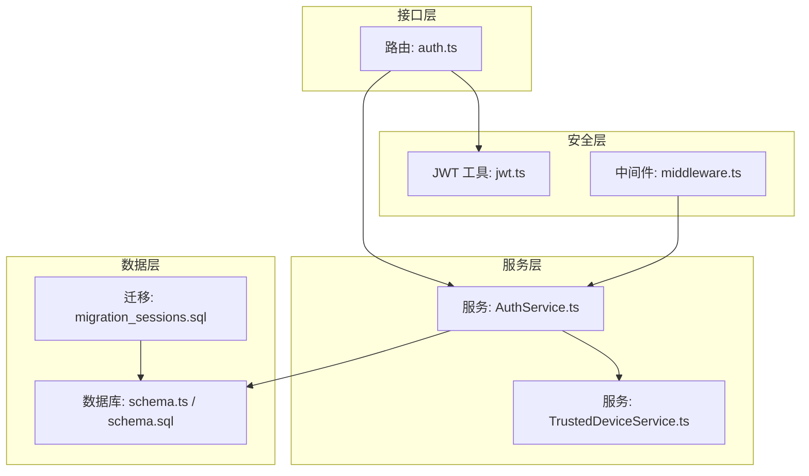
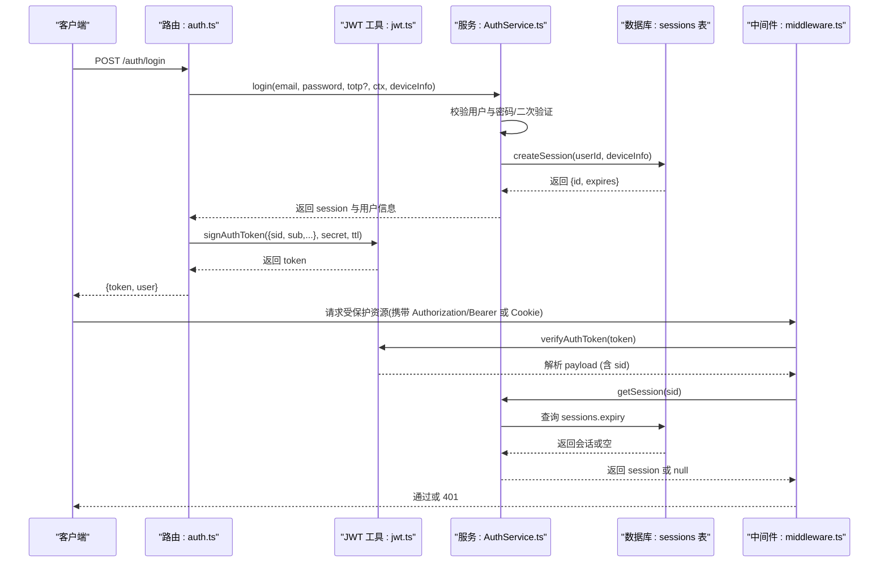
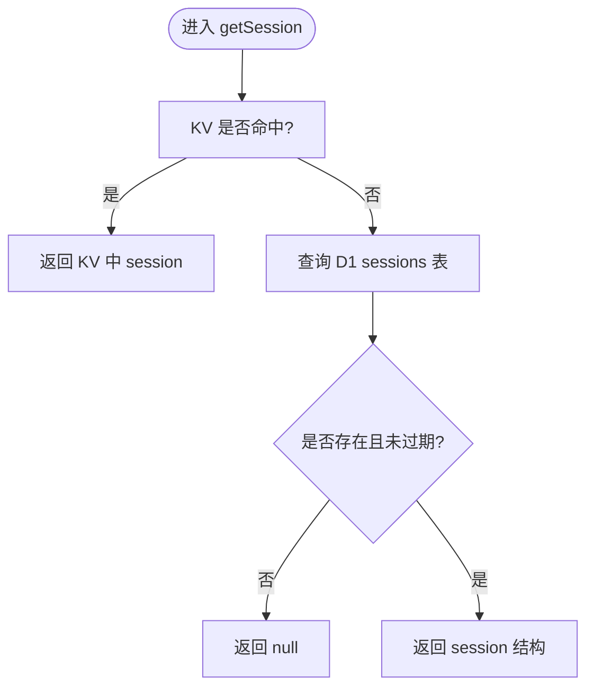
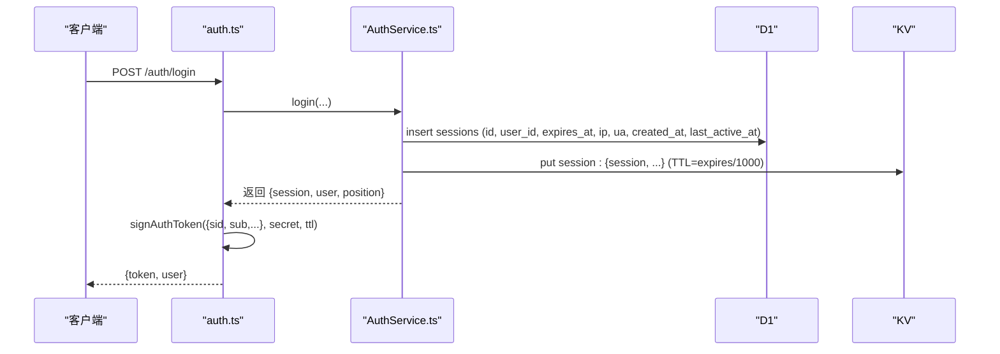
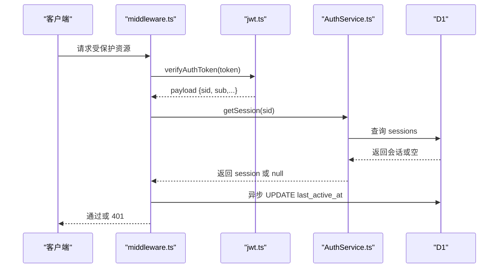
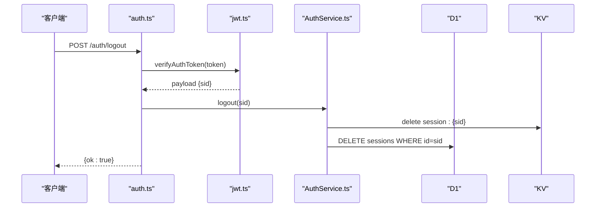
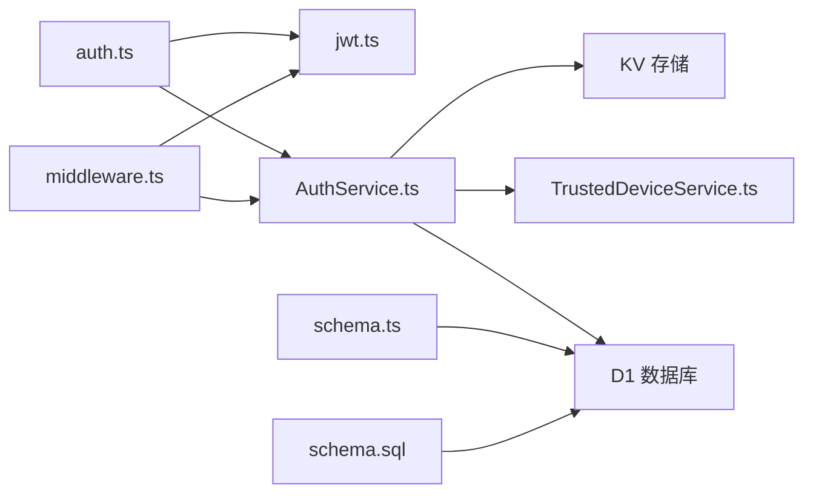

# 会话管理

<cite>
**本文引用的文件**
- [schema.ts](file://backend/src/db/schema.ts)
- [schema.sql](file://backend/src/db/schema.sql)
- [migration_sessions.sql](file://backend/src/db/archive/migration_sessions.sql)
- [AuthService.ts](file://backend/src/services/AuthService.ts)
- [auth.ts](file://backend/src/routes/auth.ts)
- [jwt.ts](file://backend/src/utils/jwt.ts)
- [middleware.ts](file://backend/src/middleware.ts)
- [auth.test.ts](file://backend/test/routes/auth.test.ts)
- [TrustedDeviceService.ts](file://backend/src/services/TrustedDeviceService.ts)
</cite>

## 目录
1. [简介](#简介)
2. [项目结构](#项目结构)
3. [核心组件](#核心组件)
4. [架构总览](#架构总览)
5. [详细组件分析](#详细组件分析)
6. [依赖关系分析](#依赖关系分析)
7. [性能考量](#性能考量)
8. [故障排查指南](#故障排查指南)
9. [结论](#结论)
10. [附录](#附录)

## 简介
本文件聚焦“会话管理”的数据模型与实现，围绕 sessions 表字段设计（id、user_id、expires_at、ip_address、user_agent 等）进行深入说明，并结合 auth.ts 登录流程，解释会话的创建、验证与销毁过程。同时阐述会话过期机制与安全设计（IP 地址与用户代理记录），并给出系统管理员的最佳实践与安全建议。

## 项目结构
会话管理相关的核心代码分布在以下模块：
- 数据层：sessions 表定义与迁移脚本
- 服务层：AuthService 负责会话生命周期管理
- 接口层：auth 路由处理登录、登出、获取当前用户信息
- 安全层：JWT 工具负责令牌签发与校验；中间件负责会话校验与活跃度维护
- 设备信任：TrustedDeviceService 支持信任设备与新设备二次验证

图表来源
- [auth.ts](file://backend/src/routes/auth.ts#L1-L120)
- [jwt.ts](file://backend/src/utils/jwt.ts#L56-L118)
- [middleware.ts](file://backend/src/middleware.ts#L33-L80)
- [AuthService.ts](file://backend/src/services/AuthService.ts#L133-L207)
- [TrustedDeviceService.ts](file://backend/src/services/TrustedDeviceService.ts#L1-L167)
- [schema.ts](file://backend/src/db/schema.ts#L125-L133)
- [schema.sql](file://backend/src/db/schema.sql#L95-L104)
- [migration_sessions.sql](file://backend/src/db/archive/migration_sessions.sql#L1-L18)

章节来源
- [auth.ts](file://backend/src/routes/auth.ts#L1-L120)
- [jwt.ts](file://backend/src/utils/jwt.ts#L56-L118)
- [middleware.ts](file://backend/src/middleware.ts#L33-L80)
- [AuthService.ts](file://backend/src/services/AuthService.ts#L133-L207)
- [TrustedDeviceService.ts](file://backend/src/services/TrustedDeviceService.ts#L1-L167)
- [schema.ts](file://backend/src/db/schema.ts#L125-L133)
- [schema.sql](file://backend/src/db/schema.sql#L95-L104)
- [migration_sessions.sql](file://backend/src/db/archive/migration_sessions.sql#L1-L18)

## 核心组件
- sessions 表：存储会话元数据，包含会话标识、用户关联、过期时间、来源 IP 与 UA 等
- AuthService：负责登录创建会话、会话查询与销毁、单点登录清理
- JWT 工具：签发与校验短期令牌，承载会话标识 sid
- 中间件：统一鉴权入口，校验令牌并加载会话上下文，异步更新活跃时间
- TrustedDeviceService：设备指纹与信任设备管理，支持新设备二次验证

章节来源
- [schema.ts](file://backend/src/db/schema.ts#L125-L133)
- [AuthService.ts](file://backend/src/services/AuthService.ts#L133-L207)
- [jwt.ts](file://backend/src/utils/jwt.ts#L56-L118)
- [middleware.ts](file://backend/src/middleware.ts#L33-L80)
- [TrustedDeviceService.ts](file://backend/src/services/TrustedDeviceService.ts#L1-L167)

## 架构总览
下图展示登录到会话验证的整体流程，以及会话过期与安全控制的关键节点。

图表来源
- [auth.ts](file://backend/src/routes/auth.ts#L59-L121)
- [jwt.ts](file://backend/src/utils/jwt.ts#L72-L118)
- [AuthService.ts](file://backend/src/services/AuthService.ts#L133-L207)
- [middleware.ts](file://backend/src/middleware.ts#L33-L80)

## 详细组件分析

### 数据模型：sessions 表字段设计
- 字段说明
  - id：会话主键，用于在 JWT 中携带的 sid，作为会话标识
  - user_id：外键关联用户，建立会话与用户的映射
  - expires_at：会话过期时间戳（毫秒），用于快速判断会话是否过期
  - ip_address：登录时记录的客户端 IP（可能来自代理头）
  - user_agent：登录时记录的用户代理字符串
  - created_at：会话创建时间戳（毫秒）
  - last_active_at：会话最后活跃时间戳（毫秒），用于审计与维护

- 迁移增强
  - 迁移脚本为 sessions 表新增了 ip_address、user_agent、created_at、last_active_at 字段，并补充索引以优化查询性能

- 索引策略
  - idx_sessions_user_id：按用户维度快速定位其会话
  - idx_sessions_expires_at：按过期时间快速筛选过期会话

章节来源
- [schema.ts](file://backend/src/db/schema.ts#L125-L133)
- [schema.sql](file://backend/src/db/schema.sql#L95-L104)
- [migration_sessions.sql](file://backend/src/db/archive/migration_sessions.sql#L1-L18)

### 会话过期机制
- 令牌过期（短期）
  - JWT 工具为令牌设置 TTL，默认 2 小时，exp 字段用于校验过期
- 会话过期（持久）
  - AuthService 在创建会话时设置 expires_at 为当前时间 + 7 天
  - getSession 时若发现 expires_at 小于当前时间，则判定为过期并返回空

图表来源
- [AuthService.ts](file://backend/src/services/AuthService.ts#L177-L198)

章节来源
- [jwt.ts](file://backend/src/utils/jwt.ts#L56-L71)
- [AuthService.ts](file://backend/src/services/AuthService.ts#L133-L175)
- [AuthService.ts](file://backend/src/services/AuthService.ts#L177-L198)

### 安全设计：IP 地址与用户代理记录
- 登录时记录
  - 登录接口从请求头中提取 CF-Connecting-IP、X-Forwarded-For、User-Agent，并传递给 AuthService.createSession
  - createSession 将 ip_address 与 user_agent 写入 sessions 表
- 审计与通知
  - 登录成功后记录审计日志，包含设备 IP
  - 可选发送登录通知邮件（由系统配置控制）

章节来源
- [auth.ts](file://backend/src/routes/auth.ts#L64-L71)
- [AuthService.ts](file://backend/src/services/AuthService.ts#L118-L131)
- [AuthService.ts](file://backend/src/services/AuthService.ts#L151-L175)

### 登录流程：创建会话与令牌
- 关键步骤
  - 验证用户身份与密码；必要时进行 TOTP 二次验证
  - 创建会话：删除该用户旧会话（单点登录），写入 D1 并同步 KV 缓存
  - 签发 JWT：payload 包含 sid（会话 id）、sub（用户 id）等，设置 exp
  - 返回 token 与用户信息

图表来源
- [auth.ts](file://backend/src/routes/auth.ts#L59-L121)
- [AuthService.ts](file://backend/src/services/AuthService.ts#L133-L175)
- [jwt.ts](file://backend/src/utils/jwt.ts#L72-L90)

章节来源
- [auth.ts](file://backend/src/routes/auth.ts#L59-L121)
- [AuthService.ts](file://backend/src/services/AuthService.ts#L133-L175)
- [jwt.ts](file://backend/src/utils/jwt.ts#L72-L90)

### 会话验证与活跃度维护
- 验证流程
  - 中间件从 Authorization 或 Cookie 提取令牌，调用 verifyAuthToken 校验签名与过期
  - 使用 payload.sid 调用 AuthService.getSession 获取会话
  - 若会话不存在或已过期，返回 401
- 活跃度维护
  - 成功验证后，异步更新 sessions.last_active_at 为当前时间，避免频繁写入阻塞请求

图表来源
- [middleware.ts](file://backend/src/middleware.ts#L33-L80)
- [jwt.ts](file://backend/src/utils/jwt.ts#L92-L118)
- [AuthService.ts](file://backend/src/services/AuthService.ts#L177-L198)

章节来源
- [middleware.ts](file://backend/src/middleware.ts#L33-L80)
- [jwt.ts](file://backend/src/utils/jwt.ts#L92-L118)
- [AuthService.ts](file://backend/src/services/AuthService.ts#L177-L198)

### 登出流程：销毁会话
- 关键步骤
  - 从 Authorization 或 Cookie 提取令牌并校验
  - 使用 payload.sid 调用 AuthService.logout
  - 从 KV 与 D1 同步删除对应会话记录
  - 清理历史 Cookie

图表来源
- [auth.ts](file://backend/src/routes/auth.ts#L301-L316)
- [AuthService.ts](file://backend/src/services/AuthService.ts#L200-L207)

章节来源
- [auth.ts](file://backend/src/routes/auth.ts#L301-L316)
- [AuthService.ts](file://backend/src/services/AuthService.ts#L200-L207)

### 设备信任与新设备二次验证
- 设备指纹
  - TrustedDeviceService 使用 userId、ip、ua 组合生成设备指纹（SHA-256）
- 信任设备
  - 若设备在 90 天内被标记为信任，则后续登录无需二次验证
  - 若设备未被信任，需进行 TOTP 验证并通过后加入信任列表
- 定期清理
  - 可定期清理过期信任设备记录

章节来源
- [TrustedDeviceService.ts](file://backend/src/services/TrustedDeviceService.ts#L1-L167)
- [AuthService.ts](file://backend/src/services/AuthService.ts#L66-L107)

## 依赖关系分析
- 组件耦合
  - auth.ts 依赖 jwt.ts 与 AuthService.ts
  - AuthService.ts 依赖 TrustedDeviceService.ts、Drizzle D1 与 KV
  - middleware.ts 依赖 jwt.ts 与 AuthService.ts
  - 数据层 schema.ts 与 schema.sql 定义 sessions 表结构
- 外部依赖
  - Cloudflare Workers KV 用于高性能缓存
  - Drizzle ORM 用于 D1 数据库操作
  - Web Crypto API 用于 JWT 签名与设备指纹计算

图表来源
- [auth.ts](file://backend/src/routes/auth.ts#L1-L120)
- [jwt.ts](file://backend/src/utils/jwt.ts#L56-L118)
- [middleware.ts](file://backend/src/middleware.ts#L33-L80)
- [AuthService.ts](file://backend/src/services/AuthService.ts#L1-L306)
- [TrustedDeviceService.ts](file://backend/src/services/TrustedDeviceService.ts#L1-L167)
- [schema.ts](file://backend/src/db/schema.ts#L125-L133)
- [schema.sql](file://backend/src/db/schema.sql#L95-L104)

章节来源
- [auth.ts](file://backend/src/routes/auth.ts#L1-L120)
- [jwt.ts](file://backend/src/utils/jwt.ts#L56-L118)
- [middleware.ts](file://backend/src/middleware.ts#L33-L80)
- [AuthService.ts](file://backend/src/services/AuthService.ts#L1-L306)
- [TrustedDeviceService.ts](file://backend/src/services/TrustedDeviceService.ts#L1-L167)
- [schema.ts](file://backend/src/db/schema.ts#L125-L133)
- [schema.sql](file://backend/src/db/schema.sql#L95-L104)

## 性能考量
- KV 优先策略
  - getSession 优先从 KV 读取，命中率高、延迟低；未命中再回退 D1
- TTL 与过期
  - KV TTL 与会话过期时间一致，避免冗余数据
- 异步更新活跃度
  - 中间件在响应后异步更新 last_active_at，减少请求路径开销
- 索引优化
  - sessions 表对 user_id 与 expires_at 建立索引，提升查询效率

章节来源
- [AuthService.ts](file://backend/src/services/AuthService.ts#L177-L198)
- [middleware.ts](file://backend/src/middleware.ts#L33-L80)
- [schema.sql](file://backend/src/db/schema.sql#L297-L305)

## 故障排查指南
- 401 未授权
  - 检查 Authorization 头或 Cookie 是否正确传递
  - 校验 AUTH_JWT_SECRET 是否配置正确
  - 确认 token 未过期（exp 校验）
- 会话不存在或过期
  - 确认 payload.sid 是否有效
  - 检查 D1 中 sessions.expiry 是否小于当前时间
- 登录后无法访问受保护资源
  - 确认中间件已正确执行并调用 getSession
  - 检查 KV 是否成功写入 session 数据
- 设备信任问题
  - 检查 TrustedDeviceService 是否正确生成设备指纹
  - 确认 90 天信任有效期逻辑正常

章节来源
- [jwt.ts](file://backend/src/utils/jwt.ts#L92-L118)
- [AuthService.ts](file://backend/src/services/AuthService.ts#L177-L207)
- [middleware.ts](file://backend/src/middleware.ts#L33-L80)
- [TrustedDeviceService.ts](file://backend/src/services/TrustedDeviceService.ts#L1-L167)

## 结论
本系统采用“JWT 短期令牌 + D1/KV 持久会话”的双层设计，既保证了令牌的高效校验，又确保会话具备持久化与审计能力。通过记录 IP 与 UA、引入信任设备机制与活跃度维护，显著提升了会话安全性与可观测性。建议管理员结合本文最佳实践，持续监控会话健康状态并定期清理过期数据。

## 附录

### 最佳实践与安全建议（面向系统管理员）
- 令牌与会话分离
  - 使用短 TTL 的 JWT 承载 sid，配合长 TTL 的会话存储，降低令牌泄露风险
- 单点登录策略
  - 登录时清理同一用户的历史会话，避免会话劫持与并发滥用
- 设备信任与二次验证
  - 对新设备强制 TOTP 验证，并将可信设备指纹纳入信任列表
- 审计与告警
  - 登录事件记录 IP、UA 与地理位置信息；异常登录触发告警
- 数据清理
  - 定期清理过期会话与信任设备，保持数据库整洁
- 环境配置
  - 正确配置 AUTH_JWT_SECRET、Cloudflare KV 与 D1 连接参数
- 监控指标
  - 关注 KV 命中率、会话过期比例、活跃度分布与异常登录次数