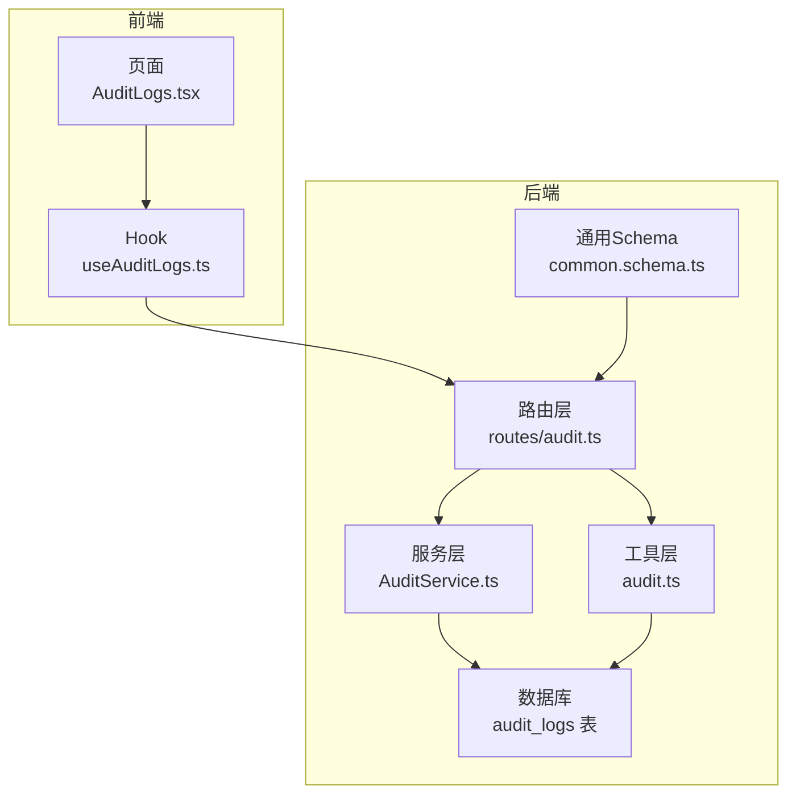
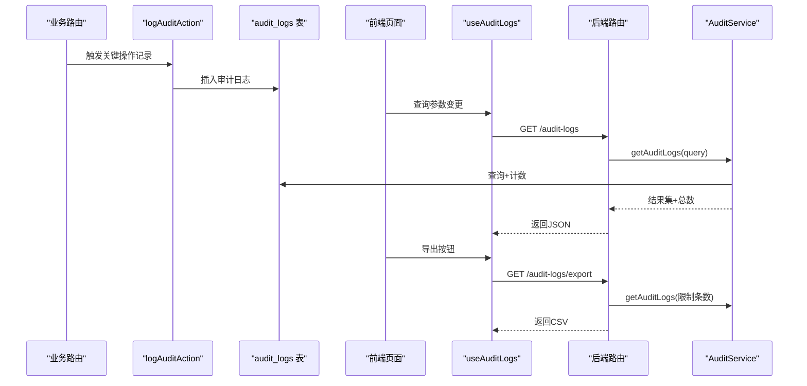
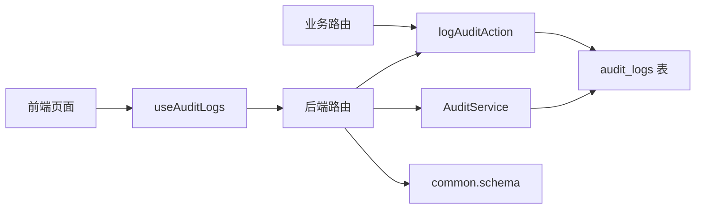

# 审计日志

<cite>
**本文引用的文件**
- [schema.ts](file://backend/src/db/schema.ts)
- [audit.ts](file://backend/src/utils/audit.ts)
- [AuditService.ts](file://backend/src/services/AuditService.ts)
- [audit.ts（路由）](file://backend/src/routes/audit.ts)
- [common.schema.ts](file://backend/src/schemas/common.schema.ts)
- [useAuditLogs.ts](file://frontend/src/hooks/business/useAuditLogs.ts)
- [AuditLogs.tsx](file://frontend/src/features/system/pages/AuditLogs.tsx)
- [audit.test.ts](file://backend/test/routes/audit.test.ts)
- [migration_add_audit_ip.sql](file://backend/src/db/archive/migration_add_audit_ip.sql)
- [employee-salaries.ts](file://backend/src/routes/employee-salaries.ts)
- [borrowings.ts](file://backend/src/routes/borrowings.ts)
</cite>

## 目录
1. [简介](#简介)
2. [项目结构](#项目结构)
3. [核心组件](#核心组件)
4. [架构总览](#架构总览)
5. [组件详解](#组件详解)
6. [依赖关系分析](#依赖关系分析)
7. [性能与扩展性](#性能与扩展性)
8. [故障排查指南](#故障排查指南)
9. [结论](#结论)
10. [附录：字段与接口规范](#附录字段与接口规范)

## 简介
本文件面向安全工程师与系统维护人员，系统化梳理审计日志子系统的数据模型、记录机制、查询与导出流程，并给出合规性建议与分析方法。重点覆盖：
- audit_logs 表字段设计与语义
- logAuditAction 工具函数如何记录关键操作
- AuditService 如何提供查询与筛选能力
- 前端 useAuditLogs Hook 的查询与导出流程
- 审计日志的分析方法与合规建议

## 项目结构
审计日志相关代码分布于后端数据库层、服务层、路由层与前端 Hook 页面层，形成“记录—存储—查询—展示”的闭环。

图表来源
- [schema.ts](file://backend/src/db/schema.ts#L633-L644)
- [audit.ts](file://backend/src/utils/audit.ts#L36-L91)
- [AuditService.ts](file://backend/src/services/AuditService.ts#L1-L113)
- [audit.ts（路由）](file://backend/src/routes/audit.ts#L1-L161)
- [common.schema.ts](file://backend/src/schemas/common.schema.ts#L190-L201)
- [useAuditLogs.ts](file://frontend/src/hooks/business/useAuditLogs.ts#L1-L116)
- [AuditLogs.tsx](file://frontend/src/features/system/pages/AuditLogs.tsx#L1-L182)

章节来源
- [schema.ts](file://backend/src/db/schema.ts#L633-L644)
- [audit.ts](file://backend/src/utils/audit.ts#L36-L91)
- [AuditService.ts](file://backend/src/services/AuditService.ts#L1-L113)
- [audit.ts（路由）](file://backend/src/routes/audit.ts#L1-L161)
- [common.schema.ts](file://backend/src/schemas/common.schema.ts#L190-L201)
- [useAuditLogs.ts](file://frontend/src/hooks/business/useAuditLogs.ts#L1-L116)
- [AuditLogs.tsx](file://frontend/src/features/system/pages/AuditLogs.tsx#L1-L182)

## 核心组件
- 数据模型：audit_logs 表
- 记录工具：logAuditAction
- 查询服务：AuditService
- 路由接口：审计日志列表、筛选选项、导出
- 前端 Hook：useAuditLogs、useAuditLogOptions、useExportAuditLogs
- 页面：审计日志管理页

章节来源
- [schema.ts](file://backend/src/db/schema.ts#L633-L644)
- [audit.ts](file://backend/src/utils/audit.ts#L36-L91)
- [AuditService.ts](file://backend/src/services/AuditService.ts#L1-L113)
- [audit.ts（路由）](file://backend/src/routes/audit.ts#L1-L161)
- [useAuditLogs.ts](file://frontend/src/hooks/business/useAuditLogs.ts#L1-L116)
- [AuditLogs.tsx](file://frontend/src/features/system/pages/AuditLogs.tsx#L1-L182)

## 架构总览
审计日志从“业务操作”出发，经由工具层写入数据库；前端通过 Hook 发起查询与导出请求，后端路由校验权限并调用服务层执行查询或生成 CSV 导出。

图表来源
- [audit.ts](file://backend/src/utils/audit.ts#L36-L91)
- [AuditService.ts](file://backend/src/services/AuditService.ts#L1-L113)
- [audit.ts（路由）](file://backend/src/routes/audit.ts#L42-L161)
- [useAuditLogs.ts](file://frontend/src/hooks/business/useAuditLogs.ts#L1-L116)
- [AuditLogs.tsx](file://frontend/src/features/system/pages/AuditLogs.tsx#L1-L182)

## 组件详解

### 数据模型：audit_logs 表
- 字段说明
  - id：审计日志唯一标识
  - actorId：操作者用户ID（可能为空，用于系统级或匿名操作）
  - action：操作动作（如 create、update、delete、approve、reject、export 等）
  - entity：实体类型（如 employee_salary、borrowing、repayment、ar_ap_doc 等）
  - entityId：实体ID（具体被操作的对象ID）
  - at：时间戳（毫秒，UTC）
  - detail：操作详情（JSON字符串，便于检索与回溯）
  - ip：客户端IP（来自 Cloudflare 请求头或代理头）
  - ipLocation：IP归属地（城市、国家等）

- 设计要点
  - 采用 SQLite + Drizzle ORM，字段类型与约束清晰
  - 新增 ip 与 ip_location 字段，支持地理溯源
  - 时间字段使用整型毫秒，便于排序与范围查询

章节来源
- [schema.ts](file://backend/src/db/schema.ts#L633-L644)
- [migration_add_audit_ip.sql](file://backend/src/db/archive/migration_add_audit_ip.sql#L1-L5)

### 记录工具：logAuditAction
- 功能
  - 自动提取请求头中的客户端IP与归属地
  - 优先使用上下文中的 userId，否则尝试从会话 cookie 中解析
  - 异步写入审计日志，使用 waitUntil 提升可靠性
  - 失败时记录错误但不阻塞主流程

- 关键行为
  - 从请求头读取 cf-connecting-ip、x-forwarded-for、cf-ipcountry、cf-ipcity
  - 通过 Drizzle 插入 audit_logs，填充 at、detail、ip、ipLocation
  - 对 actorId、entityId、detail、ip、ipLocation 缺省值进行空处理

章节来源
- [audit.ts](file://backend/src/utils/audit.ts#L1-L92)

### 查询服务：AuditService
- 能力
  - 支持按 action、entity、actor_id、actor_keyword（模糊匹配用户邮箱或员工姓名）、时间范围过滤
  - 内联 actorName 与 actorEmail（通过 users、employees 关联）
  - 支持分页 limit/offset
  - 提供统计总数
  - 提供筛选选项：去重的动作、实体、操作者列表

- 性能与复杂度
  - 基于条件拼接 where 子句，使用 Drizzle 的 eq、or、gte、lte
  - 计数单独执行一次统计查询，避免重复扫描
  - 默认 limit 100，offset 0，避免一次性返回过多数据

章节来源
- [AuditService.ts](file://backend/src/services/AuditService.ts#L1-L113)

### 后端路由：审计日志接口
- 接口清单
  - GET /audit-logs：查询审计日志列表（含总数）
  - GET /audit-logs/options：获取筛选选项（动作、实体、操作者）
  - GET /audit-logs/export：导出 CSV（最多 10000 条），并记录一次导出审计日志

- 权限控制
  - 查询与选项：需要 system.audit.view 权限
  - 导出：需要 system.audit.export 权限

- 导出细节
  - 生成 UTF-8 BOM 的 CSV 文件
  - 列顺序：时间、操作人、邮箱、操作、实体类型、实体ID、IP地址、IP归属地、详情
  - 导出完成后记录一次 export 操作日志

章节来源
- [audit.ts（路由）](file://backend/src/routes/audit.ts#L1-L161)
- [common.schema.ts](file://backend/src/schemas/common.schema.ts#L190-L201)

### 前端 Hook 与页面
- useAuditLogs
  - 构造查询参数（limit、offset、action、entity、actor_keyword、start_time、end_time）
  - 使用 React Query 缓存与占位数据，避免表格闪烁
  - 返回 results 与 total

- useAuditLogOptions
  - 获取动作、实体、操作者的下拉选项

- useExportAuditLogs
  - 发起导出请求，下载 CSV Blob 并触发浏览器下载

- AuditLogs 页面
  - 提供筛选器：动作、实体、操作人关键词、时间范围
  - 分页与刷新
  - 导出按钮触发导出流程

章节来源
- [useAuditLogs.ts](file://frontend/src/hooks/business/useAuditLogs.ts#L1-L116)
- [AuditLogs.tsx](file://frontend/src/features/system/pages/AuditLogs.tsx#L1-L182)

### 实际业务记录示例
- 薪资记录：新增、更新、删除均记录审计日志，entity 为 employee_salary，entityId 为对应记录ID
- 借还记录：创建借款、创建还款、审批/拒绝等关键节点均有审计日志，entity 为 borrowing/repayment

章节来源
- [employee-salaries.ts](file://backend/src/routes/employee-salaries.ts#L120-L140)
- [borrowings.ts](file://backend/src/routes/borrowings.ts#L160-L180)
- [borrowings.ts](file://backend/src/routes/borrowings.ts#L254-L310)

## 依赖关系分析
- 后端
  - 路由依赖权限校验与服务层
  - 服务层依赖 Drizzle ORM 与 schema 定义
  - 工具层依赖请求上下文与会话解析
  - 测试对路由与工具层进行 mock

- 前端
  - 页面依赖 Hook，Hook 依赖 API 客户端
  - Hook 与页面共同构成查询与导出 UI 流程

图表来源
- [audit.ts](file://backend/src/utils/audit.ts#L36-L91)
- [AuditService.ts](file://backend/src/services/AuditService.ts#L1-L113)
- [audit.ts（路由）](file://backend/src/routes/audit.ts#L1-L161)
- [common.schema.ts](file://backend/src/schemas/common.schema.ts#L190-L201)
- [useAuditLogs.ts](file://frontend/src/hooks/business/useAuditLogs.ts#L1-L116)
- [AuditLogs.tsx](file://frontend/src/features/system/pages/AuditLogs.tsx#L1-L182)

章节来源
- [audit.test.ts](file://backend/test/routes/audit.test.ts#L1-L100)

## 性能与扩展性
- 查询性能
  - 使用分页 limit/offset，避免一次性返回大量数据
  - 统计总数单独查询，减少重复扫描
  - 建议在 at、action、entity、actorId 上建立索引以优化过滤与排序

- 导出性能
  - 导出限制最大 10000 条，防止超大数据量导出导致内存压力
  - CSV 生成在服务端完成，前端仅负责下载

- 可扩展性
  - detail 字段为 JSON 字符串，便于扩展结构化详情
  - ip/ip_location 字段支持地理溯源与异常登录检测

[本节为通用建议，无需列出章节来源]

## 故障排查指南
- 日志记录失败
  - 现象：业务操作已执行，但审计日志缺失
  - 排查：确认 logAuditAction 是否被调用；检查请求上下文中是否存在 userId 或会话 cookie；查看 waitUntil 是否可用；关注工具层错误日志

- 查询无结果
  - 现象：前端筛选后无数据
  - 排查：确认查询参数是否正确（action、entity、actor_keyword、start_time、end_time）；检查服务层条件拼接；确认数据库中是否存在匹配记录

- 导出异常
  - 现象：导出接口报错或下载内容为空
  - 排查：确认导出接口权限；检查服务层导出查询是否超过限制；核对 CSV 生成逻辑与响应头

- 权限不足
  - 现象：403 Forbidden
  - 排查：确认当前用户是否具备 system.audit.view 或 system.audit.export 权限

章节来源
- [audit.ts](file://backend/src/utils/audit.ts#L61-L91)
- [audit.ts（路由）](file://backend/src/routes/audit.ts#L63-L161)
- [AuditService.ts](file://backend/src/services/AuditService.ts#L1-L113)

## 结论
该审计日志系统以清晰的数据模型、可靠的记录工具、完善的查询与导出能力，支撑了财务系统的合规与安全需求。通过 actorId、entity、entityId、at、detail、ip、ipLocation 等字段，能够有效还原关键业务操作的上下文。建议在生产环境中完善索引策略与日志保留策略，持续监控异常导出与高风险操作。

[本节为总结，无需列出章节来源]

## 附录：字段与接口规范

### audit_logs 表字段
- id：字符串，主键
- actorId：字符串，可空
- action：字符串，可空
- entity：字符串，可空
- entityId：字符串，可空
- at：整数，非空（毫秒时间戳）
- detail：字符串，可空
- ip：字符串，可空
- ipLocation：字符串，可空

章节来源
- [schema.ts](file://backend/src/db/schema.ts#L633-L644)
- [migration_add_audit_ip.sql](file://backend/src/db/archive/migration_add_audit_ip.sql#L1-L5)

### 审计日志记录流程（工具层）
- 输入：请求上下文、动作、实体、实体ID、详情
- 处理：提取 IP 与归属地、解析 actorId、异步插入数据库
- 输出：无（失败时记录错误日志）

章节来源
- [audit.ts](file://backend/src/utils/audit.ts#L36-L91)

### 审计日志查询接口（后端）
- GET /audit-logs
  - 查询参数：action、entity、actorId、actor_keyword、startTime、endTime、limit、offset
  - 返回：results（包含 id、actorId、action、entity、entityId、at、detail、ip、ipLocation、actorName、actorEmail）、total
- GET /audit-logs/options
  - 返回：actions、entities、actors（id、name、email）
- GET /audit-logs/export
  - 查询参数同上，导出 CSV（最多 10000 条）

章节来源
- [audit.ts（路由）](file://backend/src/routes/audit.ts#L42-L161)
- [common.schema.ts](file://backend/src/schemas/common.schema.ts#L190-L201)

### 前端查询与导出流程
- useAuditLogs：构造查询参数并发起请求，返回 results 与 total
- useAuditLogOptions：获取筛选选项
- useExportAuditLogs：发起导出请求并下载 CSV

章节来源
- [useAuditLogs.ts](file://frontend/src/hooks/business/useAuditLogs.ts#L1-L116)
- [AuditLogs.tsx](file://frontend/src/features/system/pages/AuditLogs.tsx#L1-L182)

### 审计日志分析方法与合规建议
- 分析方法
  - 时间序列：按 at 排序，识别高频操作时段与异常峰值
  - 操作人画像：统计 actorId/actorName/actorEmail 的操作频次与类型
  - 地理溯源：结合 ip 与 ipLocation，识别异地登录与异常访问
  - 实体追踪：按 entity 与 entityId 聚合，定位高风险业务对象
  - 详情回溯：解析 detail 的 JSON 内容，复原操作前后的关键字段变化

- 合规建议
  - 留存策略：根据法规要求设定审计日志保留周期
  - 访问控制：严格限制导出与查询权限，最小授权原则
  - 异常告警：对批量导出、异常时间段操作、跨地域频繁访问等设置阈值告警
  - 审计闭环：将导出行为本身也纳入审计，确保可追溯

[本节为通用建议，无需列出章节来源]