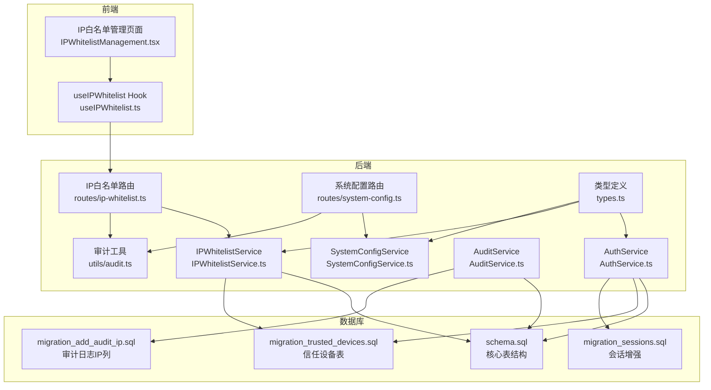
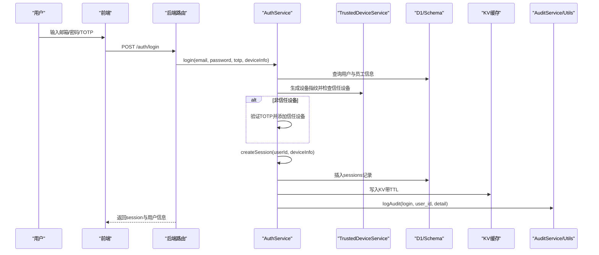
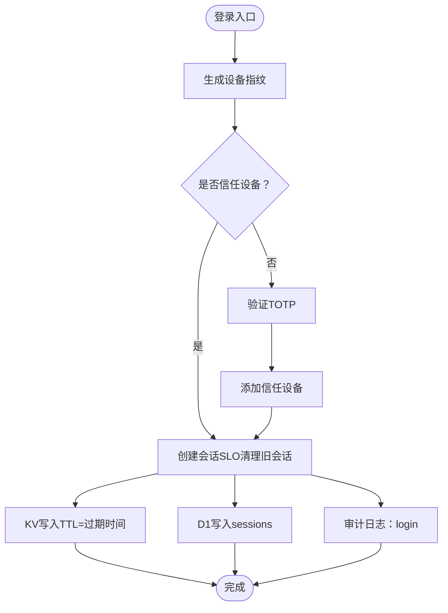
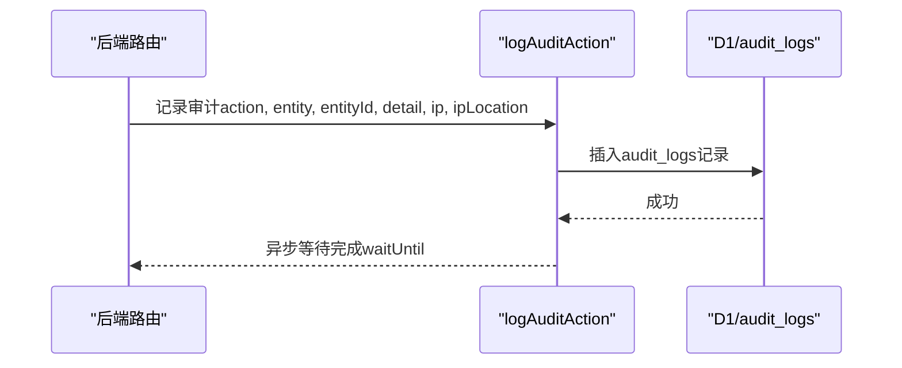
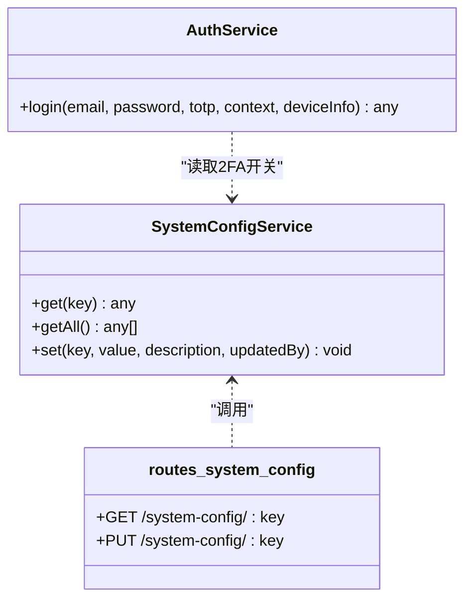
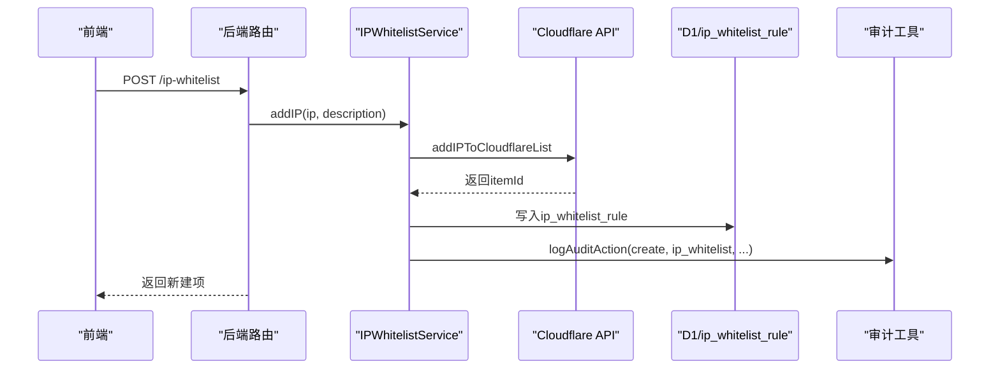
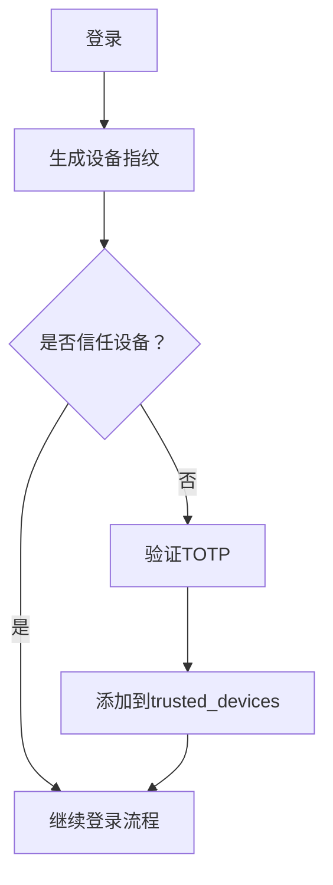
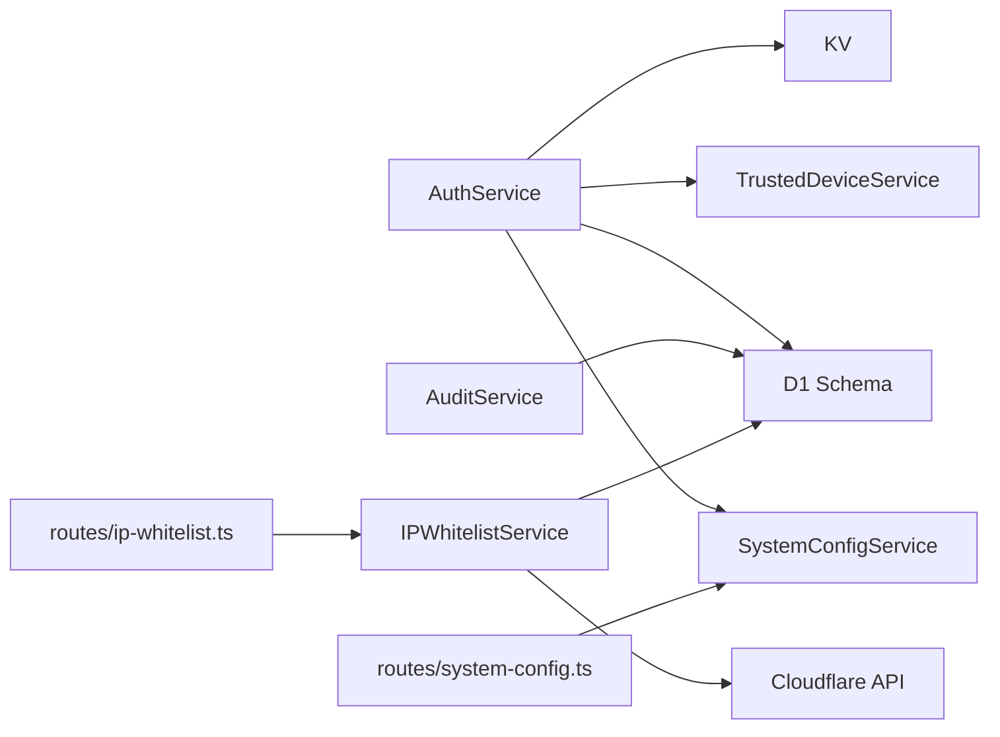

# 系统核心数据模型

<cite>
**本文引用的文件**
- [schema.sql](file://backend/src/db/schema.sql)
- [migration_trusted_devices.sql](file://backend/src/db/migration_trusted_devices.sql)
- [migration_add_audit_ip.sql](file://backend/src/db/archive/migration_add_audit_ip.sql)
- [migration_sessions.sql](file://backend/src/db/archive/migration_sessions.sql)
- [AuthService.ts](file://backend/src/services/AuthService.ts)
- [AuditService.ts](file://backend/src/services/AuditService.ts)
- [SystemConfigService.ts](file://backend/src/services/SystemConfigService.ts)
- [IPWhitelistService.ts](file://backend/src/services/IPWhitelistService.ts)
- [routes/ip-whitelist.ts](file://backend/src/routes/ip-whitelist.ts)
- [routes/system-config.ts](file://backend/src/routes/system-config.ts)
- [utils/audit.ts](file://backend/src/utils/audit.ts)
- [types.ts](file://backend/src/types.ts)
- [IPWhitelistManagement.tsx](file://frontend/src/features/system/pages/IPWhitelistManagement.tsx)
- [useIPWhitelist.ts](file://frontend/src/hooks/business/useIPWhitelist.ts)
</cite>

## 目录
1. [简介](#简介)
2. [项目结构](#项目结构)
3. [核心组件](#核心组件)
4. [架构总览](#架构总览)
5. [详细组件分析](#详细组件分析)
6. [依赖关系分析](#依赖关系分析)
7. [性能考量](#性能考量)
8. [故障排查指南](#故障排查指南)
9. [结论](#结论)

## 简介
本文件聚焦系统核心数据模型，围绕以下主题展开：
- sessions（会话）：过期机制与安全设计（含单点登录、设备指纹与信任设备）
- audit_logs（审计日志）：记录关键操作的 actor、action、entity、entity_id、detail、ip、ip_location、at
- system_config（系统配置）：键值对设计与动态配置的应用
- ip_whitelist_rule（IP白名单）：与 Cloudflare 规则联动的白名单机制
- 结合 migration_trusted_devices.sql，阐述信任设备机制的数据模型与流程

目标读者为系统管理员与安全工程师，提供运维与审计依据。

## 项目结构
后端采用 Drizzle ORM + D1 数据库，配合 KV 缓存实现高性能会话存储；前端通过 API 调用后端接口，实现系统配置与 IP 白名单的可视化管理。

图表来源
- [schema.sql](file://backend/src/db/schema.sql#L95-L126)
- [migration_trusted_devices.sql](file://backend/src/db/migration_trusted_devices.sql#L1-L17)
- [migration_add_audit_ip.sql](file://backend/src/db/archive/migration_add_audit_ip.sql#L1-L5)
- [migration_sessions.sql](file://backend/src/db/archive/migration_sessions.sql#L1-L19)
- [AuthService.ts](file://backend/src/services/AuthService.ts#L1-L306)
- [AuditService.ts](file://backend/src/services/AuditService.ts#L1-L113)
- [SystemConfigService.ts](file://backend/src/services/SystemConfigService.ts#L1-L60)
- [IPWhitelistService.ts](file://backend/src/services/IPWhitelistService.ts#L1-L138)
- [routes/ip-whitelist.ts](file://backend/src/routes/ip-whitelist.ts#L1-L329)
- [routes/system-config.ts](file://backend/src/routes/system-config.ts#L1-L197)
- [utils/audit.ts](file://backend/src/utils/audit.ts#L1-L92)
- [types.ts](file://backend/src/types.ts#L1-L88)

章节来源
- [schema.sql](file://backend/src/db/schema.sql#L95-L126)
- [migration_trusted_devices.sql](file://backend/src/db/migration_trusted_devices.sql#L1-L17)
- [migration_add_audit_ip.sql](file://backend/src/db/archive/migration_add_audit_ip.sql#L1-L5)
- [migration_sessions.sql](file://backend/src/db/archive/migration_sessions.sql#L1-L19)
- [AuthService.ts](file://backend/src/services/AuthService.ts#L1-L306)
- [AuditService.ts](file://backend/src/services/AuditService.ts#L1-L113)
- [SystemConfigService.ts](file://backend/src/services/SystemConfigService.ts#L1-L60)
- [IPWhitelistService.ts](file://backend/src/services/IPWhitelistService.ts#L1-L138)
- [routes/ip-whitelist.ts](file://backend/src/routes/ip-whitelist.ts#L1-L329)
- [routes/system-config.ts](file://backend/src/routes/system-config.ts#L1-L197)
- [utils/audit.ts](file://backend/src/utils/audit.ts#L1-L92)
- [types.ts](file://backend/src/types.ts#L1-L88)

## 核心组件
- sessions（会话）
  - 字段：id、user_id、expires_at、ip_address、user_agent、created_at、last_active_at
  - 过期机制：登录创建会话时设定过期时间（默认7天），KV 与 D1 双写，KV TTL 与过期时间一致
  - 安全设计：单点登录（SLO）策略，同一用户旧会话在新登录时被清理；支持设备指纹识别信任设备，降低新设备登录的 TOTP 验证频率
- audit_logs（审计日志）
  - 字段：id、actor_id、action、entity、entity_id、detail、ip、ip_location、at
  - 记录内容：关键操作的执行者、动作、目标实体、目标ID、详情JSON、来源IP与IP归属地、时间戳
- system_config（系统配置）
  - 字段：key（PK）、value、description、updated_at
  - 设计：键值对存储，value 支持字符串或 JSON 解析；提供统一的读取与更新接口，便于动态配置
- ip_whitelist_rule（IP白名单）
  - 字段：id、cloudflare_rule_id、cloudflare_ruleset_id、enabled、description、created_at、updated_at
  - 机制：与 Cloudflare IP List 规则联动，支持启用/停用、创建规则、批量增删、同步等操作

章节来源
- [schema.sql](file://backend/src/db/schema.sql#L95-L126)
- [migration_add_audit_ip.sql](file://backend/src/db/archive/migration_add_audit_ip.sql#L1-L5)
- [migration_sessions.sql](file://backend/src/db/archive/migration_sessions.sql#L1-L19)
- [SystemConfigService.ts](file://backend/src/services/SystemConfigService.ts#L1-L60)
- [IPWhitelistService.ts](file://backend/src/services/IPWhitelistService.ts#L1-L138)

## 架构总览
下图展示“登录—会话—信任设备—审计日志”的关键流程，以及“系统配置—动态开关—审计日志”的配置流。

图表来源
- [AuthService.ts](file://backend/src/services/AuthService.ts#L1-L306)
- [AuditService.ts](file://backend/src/services/AuditService.ts#L1-L113)
- [utils/audit.ts](file://backend/src/utils/audit.ts#L1-L92)
- [schema.sql](file://backend/src/db/schema.sql#L95-L126)
- [migration_sessions.sql](file://backend/src/db/archive/migration_sessions.sql#L1-L19)

## 详细组件分析

### 会话（sessions）模型与过期机制
- 表结构要点
  - 主键：id
  - 外键：user_id 引用 users 表
  - 关键字段：expires_at、ip_address、user_agent、created_at、last_active_at
- 过期与单点登录（SLO）
  - 登录创建会话时设定过期时间（默认7天）
  - 同一用户的新会话会先删除其旧会话（KV 与 D1 均清理）
  - KV TTL 与 expires_at 保持一致，保证 KV 与 D1 的一致性
- 设备指纹与信任设备
  - 登录时根据 user_id、ip、user_agent 生成设备指纹
  - 若非信任设备且开启 2FA，则需 TOTP 验证并通过后加入信任设备
  - 信任设备在90天内有效，后续登录可跳过 TOTP
- 安全建议
  - 定期清理过期会话（KV 自动过期，D1 侧保留以便审计）
  - 对异常 IP/UA 的会话进行审计标记与告警
  - 严格控制会话生命周期，避免长期有效会话

图表来源
- [AuthService.ts](file://backend/src/services/AuthService.ts#L133-L175)
- [AuthService.ts](file://backend/src/services/AuthService.ts#L177-L207)
- [migration_sessions.sql](file://backend/src/db/archive/migration_sessions.sql#L1-L19)
- [utils/audit.ts](file://backend/src/utils/audit.ts#L36-L92)

章节来源
- [schema.sql](file://backend/src/db/schema.sql#L95-L104)
- [migration_sessions.sql](file://backend/src/db/archive/migration_sessions.sql#L1-L19)
- [AuthService.ts](file://backend/src/services/AuthService.ts#L133-L207)
- [utils/audit.ts](file://backend/src/utils/audit.ts#L36-L92)

### 审计日志（audit_logs）模型与记录规范
- 表结构要点
  - 主键：id
  - 关键字段：actor_id、action、entity、entity_id、detail、ip、ip_location、at
- 记录内容规范
  - actor：操作执行者（用户ID）
  - action：操作类型（如 login、logout、update、create、delete 等）
  - entity/entity_id：被操作的实体与ID
  - detail：JSON 字符串，记录变更前后摘要或上下文
  - ip/ip_location：来源IP与IP归属地（由工具函数从 Cloudflare 请求头解析）
  - at：毫秒级时间戳
- 查询与聚合
  - 提供按 action、entity、actor、时间范围、关键词（员工名/邮箱）过滤
  - 支持分页与总数统计
- 审计触发点
  - 登录/登出、系统配置更新、IP 白名单增删改、绑定 TOTP 等关键操作均记录审计

图表来源
- [routes/system-config.ts](file://backend/src/routes/system-config.ts#L136-L149)
- [routes/ip-whitelist.ts](file://backend/src/routes/ip-whitelist.ts#L109-L112)
- [routes/ip-whitelist.ts](file://backend/src/routes/ip-whitelist.ts#L148-L153)
- [routes/ip-whitelist.ts](file://backend/src/routes/ip-whitelist.ts#L191-L196)
- [routes/ip-whitelist.ts](file://backend/src/routes/ip-whitelist.ts#L228-L230)
- [routes/ip-whitelist.ts](file://backend/src/routes/ip-whitelist.ts#L262-L264)
- [routes/ip-whitelist.ts](file://backend/src/routes/ip-whitelist.ts#L325-L327)
- [utils/audit.ts](file://backend/src/utils/audit.ts#L36-L92)
- [AuditService.ts](file://backend/src/services/AuditService.ts#L1-L113)

章节来源
- [schema.sql](file://backend/src/db/schema.sql#L114-L125)
- [migration_add_audit_ip.sql](file://backend/src/db/archive/migration_add_audit_ip.sql#L1-L5)
- [AuditService.ts](file://backend/src/services/AuditService.ts#L1-L113)
- [utils/audit.ts](file://backend/src/utils/audit.ts#L1-L92)

### 系统配置（system_config）模型与动态配置
- 表结构要点
  - 主键：key
  - 字段：value（字符串或 JSON）、description、updated_at
- 动态配置能力
  - 读取：按 key 获取配置，value 支持 JSON 解析
  - 更新：按 key 写入，若存在则更新；记录更新时间与更新人
  - 应用：如 2FA 开关（示例：'2fa_enabled'），在登录流程中读取并决定是否强制 TOTP 验证
- 审计关联
  - 更新系统配置会触发审计日志，记录 key 与 value

图表来源
- [SystemConfigService.ts](file://backend/src/services/SystemConfigService.ts#L1-L60)
- [routes/system-config.ts](file://backend/src/routes/system-config.ts#L136-L149)
- [AuthService.ts](file://backend/src/services/AuthService.ts#L62-L65)

章节来源
- [schema.sql](file://backend/src/db/schema.sql#L106-L112)
- [SystemConfigService.ts](file://backend/src/services/SystemConfigService.ts#L1-L60)
- [routes/system-config.ts](file://backend/src/routes/system-config.ts#L136-L149)
- [AuthService.ts](file://backend/src/services/AuthService.ts#L62-L65)

### IP白名单（ip_whitelist_rule）模型与 Cloudflare 集成
- 表结构要点
  - 主键：id
  - 字段：cloudflare_rule_id、cloudflare_ruleset_id、enabled、description、created_at、updated_at
- 与 Cloudflare 的集成
  - 通过服务方法与 Cloudflare API 交互，实现规则创建、启用/停用、IP 列表增删与同步
  - 前端页面展示规则状态与 IP 列表，并支持批量操作
- 审计关联
  - IP 白名单的创建、批量创建、批量删除、同步、删除、规则启停等操作均记录审计

图表来源
- [routes/ip-whitelist.ts](file://backend/src/routes/ip-whitelist.ts#L76-L113)
- [IPWhitelistService.ts](file://backend/src/services/IPWhitelistService.ts#L29-L56)
- [IPWhitelistManagement.tsx](file://frontend/src/features/system/pages/IPWhitelistManagement.tsx#L1-L359)
- [useIPWhitelist.ts](file://frontend/src/hooks/business/useIPWhitelist.ts#L1-L151)

章节来源
- [schema.sql](file://backend/src/db/schema.sql#L444-L453)
- [IPWhitelistService.ts](file://backend/src/services/IPWhitelistService.ts#L1-L138)
- [routes/ip-whitelist.ts](file://backend/src/routes/ip-whitelist.ts#L1-L329)
- [IPWhitelistManagement.tsx](file://frontend/src/features/system/pages/IPWhitelistManagement.tsx#L1-L359)
- [useIPWhitelist.ts](file://frontend/src/hooks/business/useIPWhitelist.ts#L1-L151)

### 信任设备（trusted_devices）模型与流程
- 表结构要点
  - 主键：id（设备唯一标识）
  - 字段：user_id、device_fingerprint、device_name、ip_address、user_agent、last_used_at、created_at
  - 约束：(user_id, device_fingerprint) 唯一
  - 索引：user_id、(user_id, device_fingerprint)
- 流程说明
  - 登录时生成设备指纹，若非信任设备且开启 2FA，则需 TOTP 验证并通过后将设备加入信任设备表
  - 信任设备有效期为90天（由服务层逻辑控制），后续登录可跳过 TOTP
- 安全建议
  - 定期清理过期信任设备记录
  - 对异常设备指纹或频繁更换设备的账户进行审计与风险评估

图表来源
- [migration_trusted_devices.sql](file://backend/src/db/migration_trusted_devices.sql#L1-L17)
- [AuthService.ts](file://backend/src/services/AuthService.ts#L66-L107)

章节来源
- [migration_trusted_devices.sql](file://backend/src/db/migration_trusted_devices.sql#L1-L17)
- [AuthService.ts](file://backend/src/services/AuthService.ts#L66-L107)

## 依赖关系分析
- 组件耦合
  - AuthService 依赖 SystemConfigService（读取 2FA 开关）、TrustedDeviceService（设备指纹与信任设备）
  - AuditService 依赖 D1 schema 中的 audit_logs 表，提供审计查询与选项
  - IPWhitelistService 依赖 Cloudflare API，同时维护 ip_whitelist_rule 表
  - 前端通过路由与服务层交互，间接依赖 D1 schema 与 KV
- 外部依赖
  - Cloudflare IP Lists 与 Firewall Rules API
  - KV 存储（会话缓存）
- 潜在循环依赖
  - 当前文件未见直接循环依赖；注意在扩展服务时避免路由与服务互相依赖

图表来源
- [AuthService.ts](file://backend/src/services/AuthService.ts#L1-L306)
- [SystemConfigService.ts](file://backend/src/services/SystemConfigService.ts#L1-L60)
- [IPWhitelistService.ts](file://backend/src/services/IPWhitelistService.ts#L1-L138)
- [routes/ip-whitelist.ts](file://backend/src/routes/ip-whitelist.ts#L1-L329)
- [routes/system-config.ts](file://backend/src/routes/system-config.ts#L1-L197)

章节来源
- [AuthService.ts](file://backend/src/services/AuthService.ts#L1-L306)
- [SystemConfigService.ts](file://backend/src/services/SystemConfigService.ts#L1-L60)
- [IPWhitelistService.ts](file://backend/src/services/IPWhitelistService.ts#L1-L138)
- [routes/ip-whitelist.ts](file://backend/src/routes/ip-whitelist.ts#L1-L329)
- [routes/system-config.ts](file://backend/src/routes/system-config.ts#L1-L197)

## 性能考量
- 会话读写
  - KV 作为高性能缓存，D1 作为持久化备份；KV TTL 与过期时间一致，避免陈旧数据
  - 会话查询优先 KV，降级 D1；索引覆盖 user_id 与 expires_at
- 审计日志
  - 审计日志写入采用异步 waitUntil，避免阻塞主流程
  - 审计查询支持多条件过滤与分页，建议在高频查询上使用索引
- IP 白名单
  - Cloudflare API 调用为外部依赖，批量操作时应考虑重试与并发限制
- 系统配置
  - 配置读取为轻量查询，建议在前端做合理缓存

[本节为通用指导，不涉及具体文件分析]

## 故障排查指南
- 会话无法登录或频繁掉线
  - 检查 KV 是否正常写入与过期；确认 KV TTL 与 expires_at 一致
  - 检查是否存在 SLO 导致旧会话被清理
  - 核对设备指纹生成逻辑与 UA/IP 是否稳定
- 审计日志缺失
  - 确认审计工具是否正确解析 Cloudflare 请求头（ip/ip_location）
  - 检查审计写入是否在 waitUntil 中完成
- 系统配置更新无效
  - 确认 key 是否正确；value 是否为合法 JSON
  - 检查路由权限与调用链路
- IP 白名单规则异常
  - 检查 Cloudflare API Token 与 Account/Zones 配置
  - 确认规则启停状态与 IP 列表同步结果

章节来源
- [AuthService.ts](file://backend/src/services/AuthService.ts#L177-L207)
- [utils/audit.ts](file://backend/src/utils/audit.ts#L1-L92)
- [routes/system-config.ts](file://backend/src/routes/system-config.ts#L136-L149)
- [IPWhitelistService.ts](file://backend/src/services/IPWhitelistService.ts#L1-L138)

## 结论
本文档梳理了系统核心数据模型：sessions、audit_logs、system_config、ip_whitelist_rule，并结合 migration_trusted_devices.sql 阐述了信任设备机制。通过对会话过期与安全设计、审计日志记录规范、系统配置动态化能力、IP 白名单与 Cloudflare 集成的深入分析，为系统管理员与安全工程师提供了运维与审计依据。建议在生产环境中持续监控会话与审计指标，定期清理过期数据，并完善异常告警与审计回溯机制。