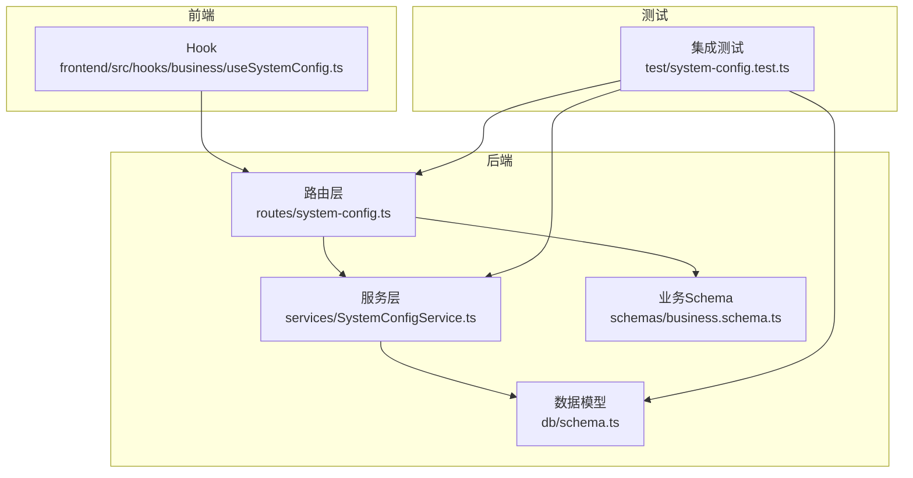
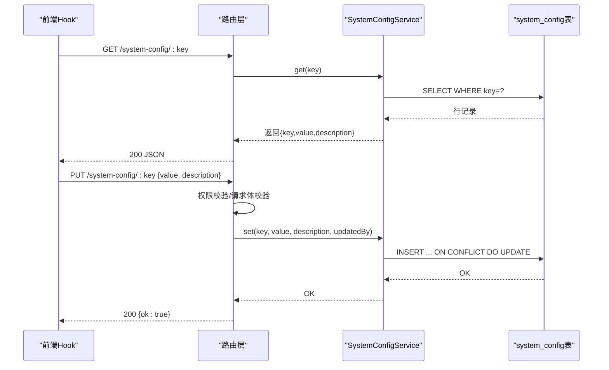
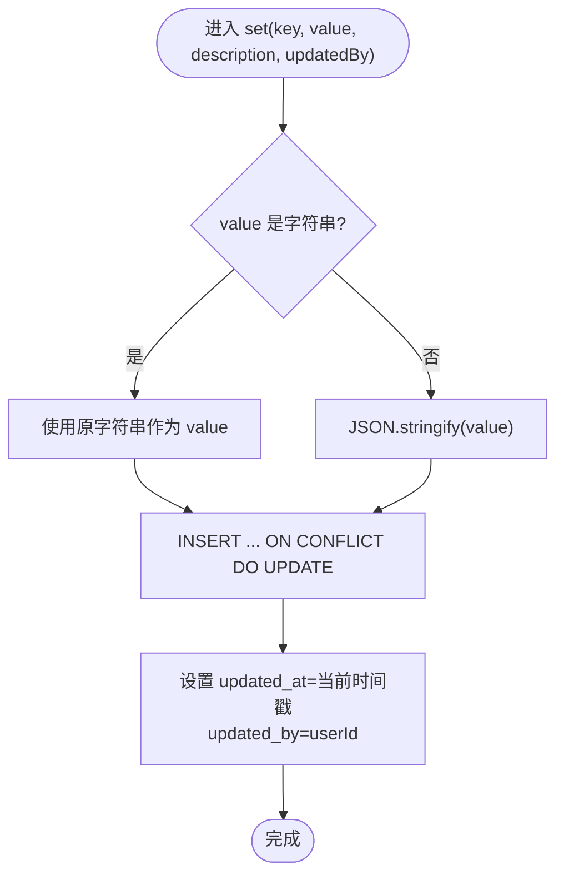
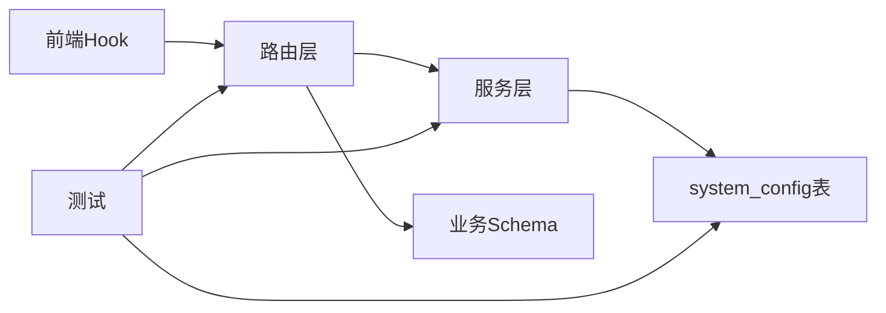

# 系统配置

<cite>
**本文引用的文件**
- [backend/src/db/schema.ts](file://backend/src/db/schema.ts)
- [backend/src/services/SystemConfigService.ts](file://backend/src/services/SystemConfigService.ts)
- [backend/src/routes/system-config.ts](file://backend/src/routes/system-config.ts)
- [backend/src/schemas/business.schema.ts](file://backend/src/schemas/business.schema.ts)
- [backend/test/system-config.test.ts](file://backend/test/system-config.test.ts)
- [frontend/src/hooks/business/useSystemConfig.ts](file://frontend/src/hooks/business/useSystemConfig.ts)
</cite>

## 目录
1. [简介](#简介)
2. [项目结构](#项目结构)
3. [核心组件](#核心组件)
4. [架构总览](#架构总览)
5. [详细组件分析](#详细组件分析)
6. [依赖关系分析](#依赖关系分析)
7. [性能考量](#性能考量)
8. [故障排查指南](#故障排查指南)
9. [结论](#结论)
10. [附录](#附录)

## 简介
本文件面向系统管理员与开发人员，系统性梳理“系统配置”数据模型与服务层实现，重点说明 system_config 表的键值对设计（key、value、description、updated_at、updated_by），以及 SystemConfigService 如何实现配置的读取、写入与 JSON 值解析。同时，结合路由层与前端 Hook 的使用方式，阐述该表在动态配置管理中的应用场景（如系统参数、业务规则的运行时调整），并给出最佳实践与版本控制建议。

## 项目结构
围绕系统配置的关键文件分布如下：
- 数据模型：backend/src/db/schema.ts 定义 system_config 表结构
- 服务层：backend/src/services/SystemConfigService.ts 提供 CRUD 与 JSON 解析
- 路由层：backend/src/routes/system-config.ts 暴露配置读取、批量读取、更新接口，并进行权限校验与审计日志
- 前端 Hook：frontend/src/hooks/business/useSystemConfig.ts 提供查询与更新的 React Query 封装
- 校验 Schema：backend/src/schemas/business.schema.ts 定义配置更新请求体的校验规则
- 测试：backend/test/system-config.test.ts 展示典型用法与断言

图表来源
- [backend/src/routes/system-config.ts](file://backend/src/routes/system-config.ts#L1-L196)
- [backend/src/services/SystemConfigService.ts](file://backend/src/services/SystemConfigService.ts#L1-L60)
- [backend/src/db/schema.ts](file://backend/src/db/schema.ts#L1-L10)
- [backend/src/schemas/business.schema.ts](file://backend/src/schemas/business.schema.ts#L548-L556)
- [frontend/src/hooks/business/useSystemConfig.ts](file://frontend/src/hooks/business/useSystemConfig.ts#L1-L41)
- [backend/test/system-config.test.ts](file://backend/test/system-config.test.ts#L1-L62)

章节来源
- [backend/src/db/schema.ts](file://backend/src/db/schema.ts#L1-L10)
- [backend/src/services/SystemConfigService.ts](file://backend/src/services/SystemConfigService.ts#L1-L60)
- [backend/src/routes/system-config.ts](file://backend/src/routes/system-config.ts#L1-L196)
- [backend/src/schemas/business.schema.ts](file://backend/src/schemas/business.schema.ts#L548-L556)
- [frontend/src/hooks/business/useSystemConfig.ts](file://frontend/src/hooks/business/useSystemConfig.ts#L1-L41)
- [backend/test/system-config.test.ts](file://backend/test/system-config.test.ts#L1-L62)

## 核心组件
- system_config 表：用于存储系统级键值对配置，支持描述信息与变更审计
- SystemConfigService：封装数据库访问与 JSON 值解析/序列化，提供 get/getAll/set
- 路由层：提供 /system-config/:key 的 GET/PUT 接口，以及 /system-config 的批量 GET 接口；内置权限校验与审计日志
- 前端 Hook：useSystemConfig 与 useUpdateSystemConfig，提供缓存与失效策略

章节来源
- [backend/src/db/schema.ts](file://backend/src/db/schema.ts#L1-L10)
- [backend/src/services/SystemConfigService.ts](file://backend/src/services/SystemConfigService.ts#L1-L60)
- [backend/src/routes/system-config.ts](file://backend/src/routes/system-config.ts#L1-L196)
- [frontend/src/hooks/business/useSystemConfig.ts](file://frontend/src/hooks/business/useSystemConfig.ts#L1-L41)

## 架构总览
系统配置的调用链路如下：
- 前端通过 Hook 发起请求
- 路由层进行权限校验与请求体校验
- 服务层执行数据库操作，自动处理 JSON 值的解析与序列化
- 写入时记录 updated_at 与 updated_by 字段，并产生审计日志

图表来源
- [backend/src/routes/system-config.ts](file://backend/src/routes/system-config.ts#L33-L196)
- [backend/src/services/SystemConfigService.ts](file://backend/src/services/SystemConfigService.ts#L9-L58)
- [backend/src/schemas/business.schema.ts](file://backend/src/schemas/business.schema.ts#L548-L556)

## 详细组件分析

### 数据模型：system_config 表
- 字段说明
  - key：主键，字符串，唯一标识一个配置项
  - value：文本，存储配置值；服务层在读取时尝试 JSON.parse，失败则原样返回
  - description：文本，可空，用于描述配置用途
  - updated_at：整型时间戳，记录最近一次更新时间
  - updated_by：字符串，记录最后更新用户ID或标识
- 设计要点
  - 使用文本存储 value，便于灵活保存任意 JSON 结构；服务层负责解析与序列化
  - updated_at 与 updated_by 便于审计追踪与版本回溯
  - 主键约束确保同一 key 的唯一性，避免重复配置

章节来源
- [backend/src/db/schema.ts](file://backend/src/db/schema.ts#L1-L10)

### 服务层：SystemConfigService
- get(key)
  - 查询单条记录；若 value 是合法 JSON 字符串，则解析为对象/数组/布尔等；否则返回原始字符串
- getAll()
  - 查询全部记录，逐条尝试 JSON 解析
- set(key, value, description, updatedBy)
  - 若 value 为字符串则直接存储；否则 JSON.stringify 序列化
  - 插入或冲突更新，同时更新 updated_at 与 updated_by
- 错误处理
  - get/getAll 在解析失败时回退为原始字符串，保证健壮性
  - set 使用 INSERT ... ON CONFLICT DO UPDATE，避免并发写入异常

图表来源
- [backend/src/services/SystemConfigService.ts](file://backend/src/services/SystemConfigService.ts#L37-L58)

章节来源
- [backend/src/services/SystemConfigService.ts](file://backend/src/services/SystemConfigService.ts#L1-L60)

### 路由层：系统配置接口
- GET /system-config/email-notification/enabled
  - 读取特定键值，返回布尔开关状态（内部逻辑将 true/字符串 "true" 视为启用）
- GET /system-config
  - 返回所有配置项的 key->value 映射
- PUT /system-config/:key
  - 更新指定键的配置，支持传入 value 与 description
- 权限与审计
  - 更新接口要求具备 system.config.update 权限
  - 更新后记录审计日志，包含实体、实体ID与变更详情

章节来源
- [backend/src/routes/system-config.ts](file://backend/src/routes/system-config.ts#L33-L196)

### 前端 Hook：useSystemConfig 与 useUpdateSystemConfig
- useSystemConfig(key)
  - 通过 React Query 缓存查询结果，默认 5 分钟过期
- useUpdateSystemConfig()
  - 提交 PUT 请求更新配置，成功后使对应 key 的查询缓存失效

章节来源
- [frontend/src/hooks/business/useSystemConfig.ts](file://frontend/src/hooks/business/useSystemConfig.ts#L1-L41)

### 业务 Schema：配置更新请求体校验
- updateSystemConfigSchema
  - value: 任意类型（z.any()）
  - description: 可选字符串
- 作用
  - 保障请求体结构与类型约束，便于路由层统一校验

章节来源
- [backend/src/schemas/business.schema.ts](file://backend/src/schemas/business.schema.ts#L548-L556)

### 测试用例：系统配置 API
- 初始化 schema 并插入一条初始配置
- 断言 GET /system-config/email-notification/enabled 返回 { enabled: true }
- 其他受保护接口需鉴权，测试中可通过模拟会话或登录绕过

章节来源
- [backend/test/system-config.test.ts](file://backend/test/system-config.test.ts#L1-L62)

## 依赖关系分析
- 路由层依赖服务层与业务 Schema
- 服务层依赖数据模型（Drizzle ORM）
- 前端 Hook 依赖路由层提供的 API
- 测试覆盖路由、服务与数据模型

图表来源
- [backend/src/routes/system-config.ts](file://backend/src/routes/system-config.ts#L1-L196)
- [backend/src/services/SystemConfigService.ts](file://backend/src/services/SystemConfigService.ts#L1-L60)
- [backend/src/db/schema.ts](file://backend/src/db/schema.ts#L1-L10)
- [backend/src/schemas/business.schema.ts](file://backend/src/schemas/business.schema.ts#L548-L556)
- [frontend/src/hooks/business/useSystemConfig.ts](file://frontend/src/hooks/business/useSystemConfig.ts#L1-L41)
- [backend/test/system-config.test.ts](file://backend/test/system-config.test.ts#L1-L62)

## 性能考量
- JSON 解析开销
  - 读取时对每个 value 尝试 JSON.parse，复杂度 O(n)（n 为字符串长度）。建议仅在必要时使用复杂 JSON 结构，避免过大对象频繁解析
- 缓存策略
  - 前端默认 5 分钟缓存，减少重复请求；更新后主动失效，保证一致性
- 并发写入
  - 服务层使用 INSERT ... ON CONFLICT DO UPDATE，避免竞态；建议在高并发场景下配合幂等键与重试策略

[本节为通用指导，无需列出具体文件来源]

## 故障排查指南
- 读取到的 value 类型不符合预期
  - 检查数据库中 value 是否为合法 JSON 字符串；若非 JSON，服务层将返回原始字符串
  - 参考路径：[backend/src/services/SystemConfigService.ts](file://backend/src/services/SystemConfigService.ts#L9-L35)
- 更新后未生效
  - 确认已正确传入 value 与 description；检查 updated_at 与 updated_by 是否更新
  - 参考路径：[backend/src/services/SystemConfigService.ts](file://backend/src/services/SystemConfigService.ts#L37-L58)
- 权限不足导致 403
  - 确认当前用户具备 system.config.view 或 system.config.update 权限
  - 参考路径：[backend/src/routes/system-config.ts](file://backend/src/routes/system-config.ts#L84-L151)
- 审计日志缺失
  - 更新接口会记录审计动作；确认日志模块正常工作
  - 参考路径：[backend/src/routes/system-config.ts](file://backend/src/routes/system-config.ts#L136-L150)
- 前端缓存未刷新
  - 更新成功后应触发查询失效；检查 useUpdateSystemConfig 的 onSuccess 处理
  - 参考路径：[frontend/src/hooks/business/useSystemConfig.ts](file://frontend/src/hooks/business/useSystemConfig.ts#L26-L41)

章节来源
- [backend/src/services/SystemConfigService.ts](file://backend/src/services/SystemConfigService.ts#L1-L60)
- [backend/src/routes/system-config.ts](file://backend/src/routes/system-config.ts#L84-L151)
- [frontend/src/hooks/business/useSystemConfig.ts](file://frontend/src/hooks/business/useSystemConfig.ts#L26-L41)

## 结论
system_config 表通过 key-value 的简洁设计，为系统参数与业务规则的动态配置提供了高效、可审计的支撑。SystemConfigService 在读取时自动解析 JSON，在写入时统一序列化并记录变更元数据，配合路由层的权限与审计机制，形成完整的配置生命周期闭环。前端 Hook 提供了良好的缓存与失效策略，便于在运行时平滑调整系统行为。

[本节为总结性内容，无需列出具体文件来源]

## 附录

### 字段用途与最佳实践
- key
  - 建议采用语义化命名，如 email_notification_enabled、enable_feature_xxx
  - 保持唯一性，避免重复键
- value
  - 优先使用简单类型（布尔、数字、字符串）；复杂结构建议 JSON 化
  - 避免存储敏感信息；如需加密，请在应用层处理
- description
  - 记录用途、默认值、影响范围与注意事项
- updated_at / updated_by
  - 用于审计追踪；建议在 UI 中展示最近修改人与时间
- 版本控制建议
  - 为关键配置增加版本号字段（可在 value 中嵌套版本信息），以便回滚与迁移
  - 对重大变更发布前先在灰度环境验证，逐步扩大范围
  - 记录每次变更的变更原因、影响面与回滚预案

[本节为通用指导，无需列出具体文件来源]