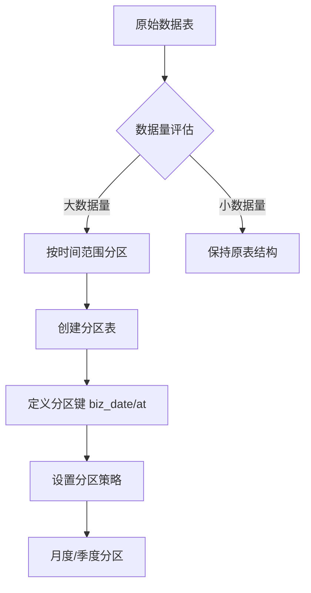
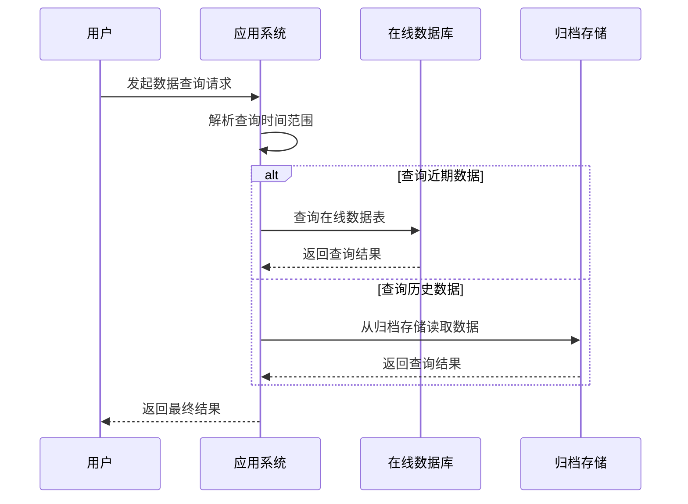
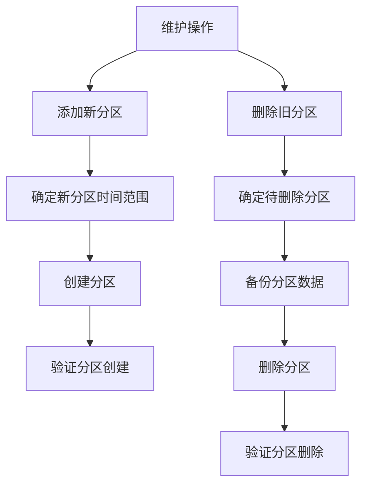

# 数据分区与归档

<cite>
**本文档引用的文件**   
- [schema.ts](file://backend/src/db/schema.ts)
- [AuditService.ts](file://backend/src/services/AuditService.ts)
- [migrate-existing.ts](file://backend/scripts/migrate-existing.ts)
</cite>

## 目录
1. [引言](#引言)
2. [核心表结构分析](#核心表结构分析)
3. [数据分区策略](#数据分区策略)
4. [数据归档流程](#数据归档流程)
5. [分区表维护操作](#分区表维护操作)
6. [查询与索引影响评估](#查询与索引影响评估)
7. [自动化归档调度建议](#自动化归档调度建议)
8. [结论](#结论)

## 引言
本文件旨在为财务系统中的大数据量表（如cash_flows、audit_logs）制定数据分区与归档策略。通过分析schema.ts中的表结构设计，结合AuditService.ts中的审计日志处理逻辑和migrate-existing.ts中的历史数据迁移实践，本文将详细说明在线数据与归档数据的分离策略，以及归档流程的具体实施方法。

## 核心表结构分析
通过对schema.ts文件的分析，我们重点关注cash_flows和audit_logs两个核心表的结构设计。

**Section sources**
- [schema.ts](file://backend/src/db/schema.ts#L159-L188)
- [schema.ts](file://backend/src/db/schema.ts#L675-L692)

## 数据分区策略
基于schema.ts中的表结构设计，我们建议对cash_flows和audit_logs表采用按时间范围分区的策略。对于cash_flows表，可以按月或按季度进行分区，以优化财务数据的查询性能。audit_logs表同样建议按时间分区，便于审计日志的管理和查询。

**Diagram sources **
- [schema.ts](file://backend/src/db/schema.ts#L159-L188)
- [schema.ts](file://backend/src/db/schema.ts#L675-L692)

**Section sources**
- [schema.ts](file://backend/src/db/schema.ts#L159-L188)
- [schema.ts](file://backend/src/db/schema.ts#L675-L692)

## 数据归档流程
结合AuditService.ts中的审计日志处理逻辑和migrate-existing.ts中的历史数据迁移实践，我们提出以下数据归档流程：

1. **数据导出**：使用系统提供的导出功能，将指定时间范围内的数据导出为CSV格式。
2. **冷存储**：将导出的数据文件存储到成本较低的冷存储系统中，如对象存储服务。
3. **查询路由机制**：在应用层实现查询路由，根据查询的时间范围自动选择查询在线数据表或归档数据。

**Diagram sources **
- [AuditService.ts](file://backend/src/services/AuditService.ts#L170-L276)
- [migrate-existing.ts](file://backend/scripts/migrate-existing.ts#L122-L131)

**Section sources**
- [AuditService.ts](file://backend/src/services/AuditService.ts#L170-L276)
- [migrate-existing.ts](file://backend/scripts/migrate-existing.ts#L122-L131)

## 分区表维护操作
为确保分区表的正常运行，需要定期执行以下维护操作：

1. **添加新分区**：在每个月初或每个季度初，为即将到来的时间段创建新的分区。
2. **删除旧分区**：根据数据保留策略，定期删除超过保留期限的旧分区。

**Diagram sources **
- [migrate-existing.ts](file://backend/scripts/migrate-existing.ts#L122-L131)

**Section sources**
- [migrate-existing.ts](file://backend/scripts/migrate-existing.ts#L122-L131)

## 查询与索引影响评估
实施分区和归档策略后，对现有查询和索引的影响需要进行评估。主要影响包括：

- **查询性能**：分区后，查询特定时间范围的数据将更加高效。
- **索引维护**：需要为每个分区维护相应的索引，以保证查询性能。
- **复杂查询**：跨分区的复杂查询可能需要额外的优化。

**Section sources**
- [schema.ts](file://backend/src/db/schema.ts#L183-L187)
- [schema.ts](file://backend/src/db/schema.ts#L688-L691)

## 自动化归档调度建议
为提高数据管理效率，建议制定自动化的归档调度策略：

1. **监控数据增长**：定期监控cash_flows和audit_logs表的数据增长趋势。
2. **自动归档**：设置定时任务，自动执行数据归档流程。
3. **告警机制**：当数据量接近预设阈值时，触发告警通知管理员。

**Section sources**
- [migrate-existing.ts](file://backend/scripts/migrate-existing.ts#L92-L136)

## 结论
通过实施上述数据分区与归档策略，可以有效管理财务系统中的大数据量表，提高查询性能，降低存储成本。建议结合系统实际情况，逐步实施并持续优化该策略。