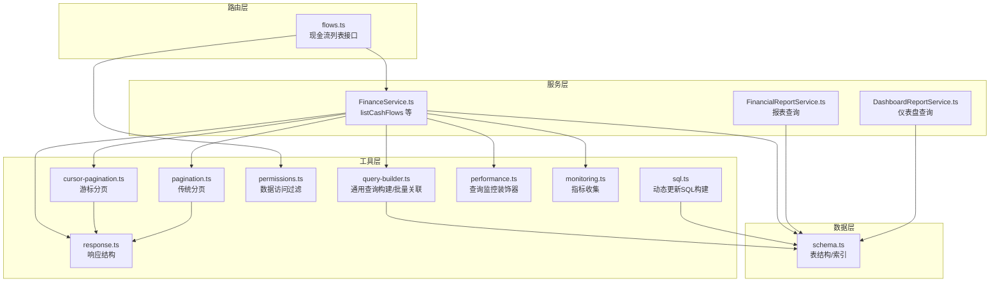
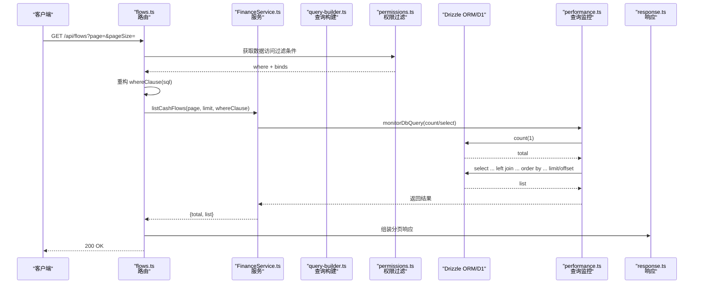
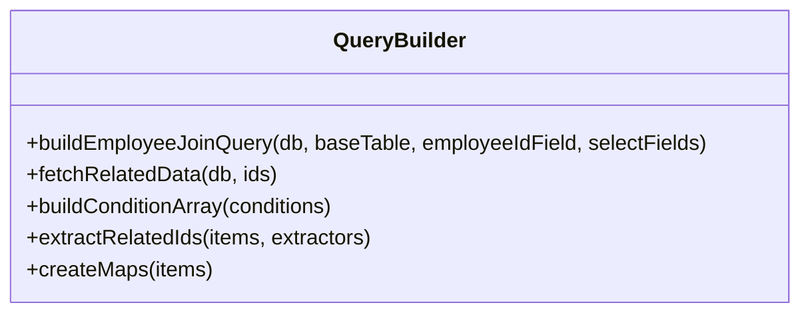
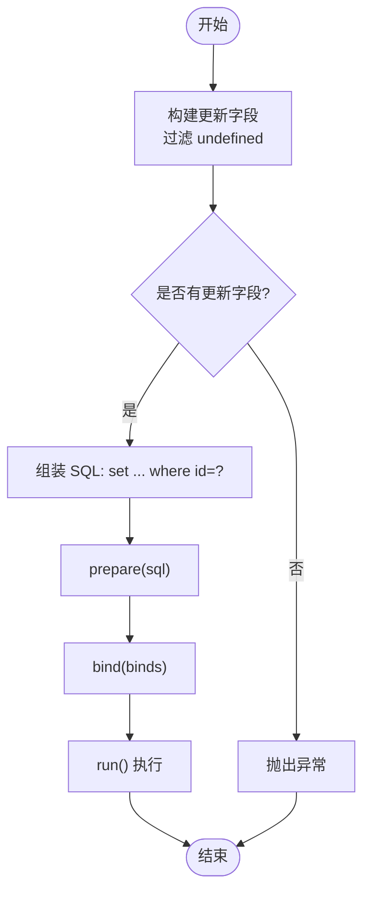
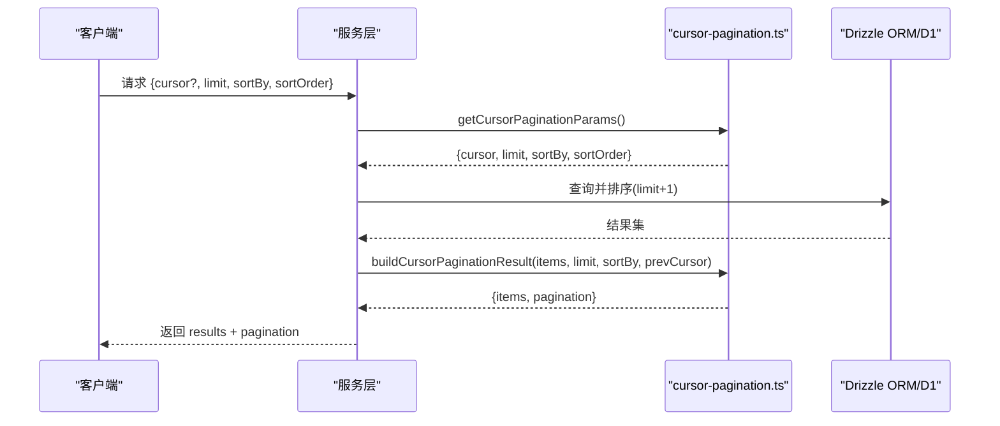
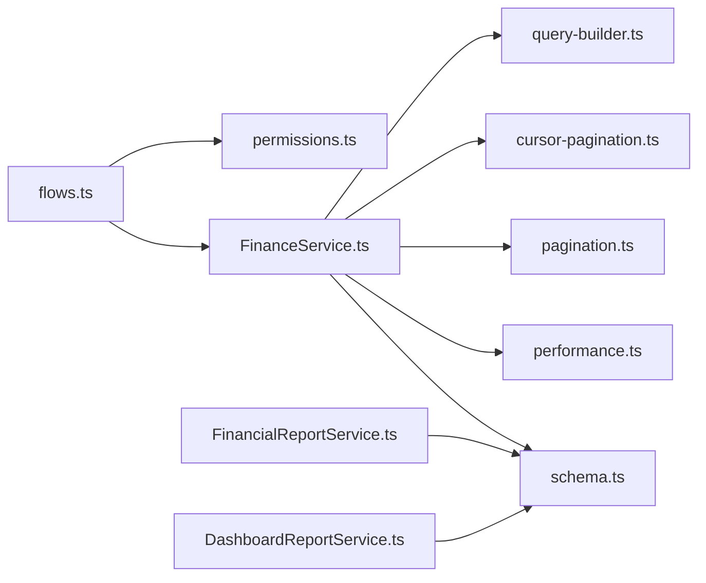

# 查询性能优化

<cite>
**本文引用的文件**
- [schema.ts](file://backend/src/db/schema.ts)
- [query-builder.ts](file://backend/src/utils/query-builder.ts)
- [sql.ts](file://backend/src/utils/sql.ts)
- [cursor-pagination.ts](file://backend/src/utils/cursor-pagination.ts)
- [pagination.ts](file://backend/src/utils/pagination.ts)
- [permissions.ts](file://backend/src/utils/permissions.ts)
- [response.ts](file://backend/src/utils/response.ts)
- [performance.ts](file://backend/src/middleware/performance.ts)
- [monitoring.ts](file://backend/src/utils/monitoring.ts)
- [flows.ts](file://backend/src/routes/v2/flows.ts)
- [FinanceService.ts](file://backend/src/services/FinanceService.ts)
- [FinancialReportService.ts](file://backend/src/services/FinancialReportService.ts)
- [DashboardReportService.ts](file://backend/src/services/DashboardReportService.ts)
</cite>

## 目录
1. [简介](#简介)
2. [项目结构](#项目结构)
3. [核心组件](#核心组件)
4. [架构总览](#架构总览)
5. [详细组件分析](#详细组件分析)
6. [依赖关系分析](#依赖关系分析)
7. [性能考量](#性能考量)
8. [故障排查指南](#故障排查指南)
9. [结论](#结论)
10. [附录](#附录)

## 简介
本指南围绕财务系统的查询性能优化展开，结合 schema.ts 的表结构与索引设计、query-builder.ts 与 sql.ts 的查询构造逻辑，系统分析常见慢查询模式，并给出针对性优化策略。重点覆盖：
- WHERE 条件顺序与选择性优化
- 函数索引失效与替代方案
- JOIN 与子查询的合理使用
- 分页性能陷阱与基于游标的分页（cursor-pagination.ts）方案
- SQL 重写示例与参数化查询最佳实践
- 查询缓存与监控体系

## 项目结构
后端采用 Drizzle ORM + Cloudflare D1，查询路径通常为路由 -> 服务层 -> ORM 查询 -> 数据库；权限过滤与分页逻辑分别在工具层与服务层实现。



图表来源
- [flows.ts](file://backend/src/routes/v2/flows.ts#L128-L174)
- [FinanceService.ts](file://backend/src/services/FinanceService.ts#L240-L268)
- [FinancialReportService.ts](file://backend/src/services/FinancialReportService.ts#L135-L163)
- [DashboardReportService.ts](file://backend/src/services/DashboardReportService.ts#L131-L146)
- [query-builder.ts](file://backend/src/utils/query-builder.ts#L1-L177)
- [cursor-pagination.ts](file://backend/src/utils/cursor-pagination.ts#L1-L218)
- [pagination.ts](file://backend/src/utils/pagination.ts#L1-L35)
- [permissions.ts](file://backend/src/utils/permissions.ts#L184-L263)
- [sql.ts](file://backend/src/utils/sql.ts#L1-L80)
- [response.ts](file://backend/src/utils/response.ts#L1-L132)
- [performance.ts](file://backend/src/middleware/performance.ts#L71-L112)
- [monitoring.ts](file://backend/src/utils/monitoring.ts#L93-L201)
- [schema.ts](file://backend/src/db/schema.ts#L1-L706)

章节来源
- [flows.ts](file://backend/src/routes/v2/flows.ts#L128-L174)
- [FinanceService.ts](file://backend/src/services/FinanceService.ts#L240-L268)
- [schema.ts](file://backend/src/db/schema.ts#L1-L706)

## 核心组件
- 表结构与索引（schema.ts）
  - 现金流表 cash_flows：复合索引 idx_cash_flows_account_biz(accountId,bizDate)、idx_cash_flows_type(type)、idx_cash_flows_reversal(reversalOfFlowId)，有助于按账户+日期、类型、冲正关系快速检索。
  - 账户交易表 account_transactions：复合索引 idx_acc_tx_account_date(accountId,transactionDate)，有利于按账户+日期聚合/排序。
  - 审计日志 audit_logs：索引 idx_audit_logs_time(at)、idx_audit_logs_entity(entityId)，便于审计追踪。
  - 其他业务表（员工、部门、组织部门、供应商、站点、类别、薪资、报销、借款、资产等）均具备主键与常用字段索引，支撑多表关联与过滤。
- 查询构建与批量关联（query-builder.ts）
  - 提供员工关联查询链式封装，自动左连接员工、部门、组织部门、职位表。
  - 支持并行批量获取关联数据（Promise.all），降低 N+1 查询风险。
  - 条件数组构建与 ID 提取，便于后续批量查询与映射。
- 动态 SQL 更新（sql.ts）
  - 构建动态更新语句，支持字段白名单与绑定参数，避免拼接注入风险。
- 分页工具
  - 传统分页（pagination.ts）：基于 offset/limit，适合小数据量或需要总数的场景。
  - 游标分页（cursor-pagination.ts）：基于游标值的“下一页”定位，避免 offset 的性能问题，适合大数据量与前后滑动翻页。
- 权限过滤（permissions.ts）
  - 根据用户职位层级生成 SQL 过滤条件，支持部门/组织/个人维度，保障数据安全与查询效率。
- 响应结构（response.ts）
  - 统一分页与游标分页响应结构，便于前端稳定消费。
- 性能监控（performance.ts、monitoring.ts）
  - 数据库查询耗时记录与慢查询告警；HTTP 请求耗时与内存使用记录；指标统计与导出。

章节来源
- [schema.ts](file://backend/src/db/schema.ts#L159-L206)
- [schema.ts](file://backend/src/db/schema.ts#L675-L692)
- [query-builder.ts](file://backend/src/utils/query-builder.ts#L1-L177)
- [sql.ts](file://backend/src/utils/sql.ts#L1-L80)
- [pagination.ts](file://backend/src/utils/pagination.ts#L1-L35)
- [cursor-pagination.ts](file://backend/src/utils/cursor-pagination.ts#L1-L218)
- [permissions.ts](file://backend/src/utils/permissions.ts#L184-L263)
- [response.ts](file://backend/src/utils/response.ts#L1-L132)
- [performance.ts](file://backend/src/middleware/performance.ts#L71-L112)
- [monitoring.ts](file://backend/src/utils/monitoring.ts#L93-L201)

## 架构总览
以下序列图展示“现金流列表”接口的典型调用链，体现权限过滤、分页与查询监控的协作。



图表来源
- [flows.ts](file://backend/src/routes/v2/flows.ts#L128-L174)
- [FinanceService.ts](file://backend/src/services/FinanceService.ts#L240-L268)
- [permissions.ts](file://backend/src/utils/permissions.ts#L184-L263)
- [performance.ts](file://backend/src/middleware/performance.ts#L71-L112)
- [response.ts](file://backend/src/utils/response.ts#L32-L89)

## 详细组件分析

### 组件A：查询构建与批量关联（query-builder.ts）
- 关键能力
  - 构建员工关联查询：自动左连接员工、部门、组织部门、职位表，减少重复代码。
  - 并行批量获取关联数据：对部门、员工、币种、供应商、站点进行 inArray 批量查询，Promise.all 并发执行，显著降低往返次数。
  - 条件数组构建：过滤 undefined/null 条件，避免无效查询片段。
  - ID 提取与去重：从结果集中抽取关联 ID，生成 Set 去重，再转数组，便于后续批量查询与映射。
- 性能影响
  - 并行批量查询可显著降低 N+1 查询带来的延迟。
  - 条件过滤避免冗余 SQL 片段，减少执行计划抖动。
- 使用建议
  - 在需要多表关联的列表查询中优先使用该工具，确保只查询必要字段。
  - 结合权限过滤与分页，避免一次性拉取过多数据。



图表来源
- [query-builder.ts](file://backend/src/utils/query-builder.ts#L1-L177)

章节来源
- [query-builder.ts](file://backend/src/utils/query-builder.ts#L1-L177)

### 组件B：动态 SQL 更新（sql.ts）
- 关键能力
  - 动态更新字段构建：以字段映射对象为输入，仅对非 undefined 字段生成更新片段，避免更新无关字段。
  - 动态 SQL 组装：将更新片段与 where id=? 绑定，形成最终 SQL。
  - 执行更新：prepare + bind + run，保证参数化执行。
- 性能与安全
  - 参数化绑定有效防止 SQL 注入，同时提升缓存命中率。
  - 仅更新必要字段，减少写放大与锁竞争。
- 最佳实践
  - 业务侧先过滤出需要更新的字段，再交由该工具生成 SQL。
  - 对于大事务，建议拆分为多次小事务，降低锁持有时间。



图表来源
- [sql.ts](file://backend/src/utils/sql.ts#L1-L80)

章节来源
- [sql.ts](file://backend/src/utils/sql.ts#L1-L80)

### 组件C：权限过滤（permissions.ts）
- 关键能力
  - 根据职位层级生成 SQL 过滤条件：
    - 总部人员(level=1)：全局可见。
    - 项目人员(level=2)：按部门过滤。
    - 组长(team_leader)：按组织部门过滤；若表无组字段则退化为按 owner 过滤。
    - 工程师/其他：仅本人数据。
  - 支持自定义列名与别名，适配不同表结构。
- 性能影响
  - 过滤条件直接进入 WHERE，可利用现有索引（如部门、组织部门、创建人）提升查询效率。
  - 避免跨部门/跨组扫描，减少结果集规模。
- 使用建议
  - 在路由层或服务层接收上下文后立即生成过滤条件，再传入查询。
  - 对 cash_flows 等表，注意 ownerColumn 与 deptColumn 的选择，避免不必要的全表扫描。

```mermaid
flowchart TD
A["获取用户职位与员工信息"] --> B{"职位层级?"}
B --> |总部(level=1)| C["where: 1=1"]
B --> |项目(level=2)| D["where: deptColumn = ?"]
B --> |组长(team_leader)| E{"是否跳过组过滤?"}
E --> |是| F["where: ownerColumn = ?"]
E --> |否| G["where: orgDeptColumn = ?"]
B --> |其他| H["where: ownerColumn = ?"]
C --> I["返回 {where, binds}"]
D --> I
F --> I
G --> I
H --> I
```

图表来源
- [permissions.ts](file://backend/src/utils/permissions.ts#L184-L263)

章节来源
- [permissions.ts](file://backend/src/utils/permissions.ts#L184-L263)

### 组件D：分页工具（pagination.ts vs cursor-pagination.ts）
- 传统分页（pagination.ts）
  - 基于 page/pageSize 计算 offset，适合需要总数与页码导航的场景。
  - 性能陷阱：offset 越大，数据库需跳过越多行，I/O 与排序成本上升。
- 游标分页（cursor-pagination.ts）
  - 基于游标值（排序字段+id）定位下一页，无需 count 与 offset。
  - 性能优势：常数级时间复杂度，适合大数据量与前后滑动翻页。
  - 响应结构：包含 hasNext/hasPrev/nextCursor/prevCursor/limit。
- 使用建议
  - 列表页默认使用游标分页；若必须显示总数或页码导航，再考虑传统分页。
  - 游标生成时包含排序字段与 id，确保唯一性与稳定性。



图表来源
- [cursor-pagination.ts](file://backend/src/utils/cursor-pagination.ts#L1-L218)
- [response.ts](file://backend/src/utils/response.ts#L92-L132)

章节来源
- [pagination.ts](file://backend/src/utils/pagination.ts#L1-L35)
- [cursor-pagination.ts](file://backend/src/utils/cursor-pagination.ts#L1-L218)
- [response.ts](file://backend/src/utils/response.ts#L92-L132)

### 组件E：查询监控与指标（performance.ts、monitoring.ts）
- 查询监控装饰器
  - monitorDbQuery 包裹数据库查询，记录耗时与慢查询事件，便于定位热点。
- 指标收集
  - 记录 HTTP 请求耗时、响应大小、内存使用等指标，支持统计分析。
- 使用建议
  - 对高频查询（如现金流列表、报表）启用监控装饰器。
  - 结合慢查询告警阈值（如 500ms）进行告警与根因分析。

章节来源
- [performance.ts](file://backend/src/middleware/performance.ts#L71-L112)
- [monitoring.ts](file://backend/src/utils/monitoring.ts#L93-L201)

## 依赖关系分析
- 路由层依赖权限过滤与分页工具，服务层依赖 ORM 与查询监控，工具层依赖 schema 定义。
- 查询链路耦合度低，职责清晰：路由负责参数校验与响应封装；服务层负责业务逻辑与查询编排；工具层提供复用能力；数据层提供表结构与索引。



图表来源
- [flows.ts](file://backend/src/routes/v2/flows.ts#L128-L174)
- [FinanceService.ts](file://backend/src/services/FinanceService.ts#L240-L268)
- [query-builder.ts](file://backend/src/utils/query-builder.ts#L1-L177)
- [cursor-pagination.ts](file://backend/src/utils/cursor-pagination.ts#L1-L218)
- [pagination.ts](file://backend/src/utils/pagination.ts#L1-L35)
- [permissions.ts](file://backend/src/utils/permissions.ts#L184-L263)
- [schema.ts](file://backend/src/db/schema.ts#L1-L706)

章节来源
- [flows.ts](file://backend/src/routes/v2/flows.ts#L128-L174)
- [FinanceService.ts](file://backend/src/services/FinanceService.ts#L240-L268)

## 性能考量

### 常见慢查询模式与优化策略
- WHERE 条件顺序与选择性
  - 优先放置高选择性的过滤条件（如主键、唯一索引、带索引的精确过滤），减少扫描范围。
  - 对于 cash_flows，若按账户+日期过滤，建议将 accountId 放在前面，利用 idx_cash_flows_account_biz。
- 函数索引失效
  - 避免在 WHERE 中对列使用函数（如 date(biz_date)），这会导致索引失效。
  - 替代方案：在入库时存储 biz_date 的日期部分，或在查询时使用范围比较（>= 开始日，< 下一日）。
- JOIN 与子查询
  - 优先使用内连接与合适的 ON 条件，避免笛卡尔积。
  - 子查询尽量下推为 JOIN，或使用 EXISTS/IN 时确保关联列有索引。
- 分页性能陷阱
  - offset/limit：大数据量时 offset 越大越慢。推荐使用游标分页。
  - 若必须使用 offset，建议限制最大页码或提供上限。
- 索引利用
  - cash_flows：accountId+bizDate、type、reversalOfFlowId 索引可用于常见过滤与关联。
  - account_transactions：accountId+transactionDate 索引用于账户余额与明细查询。
  - audit_logs：at、entityId 索引用于审计追踪。

章节来源
- [schema.ts](file://backend/src/db/schema.ts#L159-L206)
- [schema.ts](file://backend/src/db/schema.ts#L675-L692)

### SQL 重写示例（思路）
- 低效：WHERE DATE(biz_date) = ? 或 WHERE YEAR(created_at) = 2024
  - 重写：WHERE biz_date BETWEEN '2024-01-01' AND '2024-12-31 23:59:59'
- 低效：ORDER BY RAND() 或 OFFSET 大页码
  - 重写：游标分页，基于上次记录的排序字段与 id 生成下一页条件
- 低效：N+1 查询
  - 重写：使用 query-builder 的批量关联与并行查询，减少往返

[本节为通用优化指导，不直接分析具体文件，故不附“章节来源”]

### 参数化查询最佳实践
- 使用绑定参数（?）传递过滤值，避免字符串拼接。
- 对动态更新，使用字段白名单与绑定数组，确保只更新必要字段。
- 在权限过滤中，where 与 binds 成对出现，避免硬编码字符串。

章节来源
- [sql.ts](file://backend/src/utils/sql.ts#L1-L80)
- [permissions.ts](file://backend/src/utils/permissions.ts#L184-L263)

## 故障排查指南
- 慢查询定位
  - 启用 monitorDbQuery，关注 db.query.slow 指标，结合查询名称定位热点。
  - 检查是否存在未命中索引的 WHERE 条件（如函数包裹列）。
- 分页异常
  - 游标解码失败：确认 cursor 是否为 base64 编码的 JSON，且包含排序字段与 id。
  - 页码过大导致慢：切换为游标分页或限制最大页码。
- 权限过滤无效
  - 确认用户职位与员工信息是否正确注入上下文。
  - 检查表别名与列名是否与 schema 一致（驼峰命名）。
- 响应结构不一致
  - 游标分页使用 CursorPaginationMeta，传统分页使用 PaginationMeta，确保前端消费一致。

章节来源
- [performance.ts](file://backend/src/middleware/performance.ts#L71-L112)
- [cursor-pagination.ts](file://backend/src/utils/cursor-pagination.ts#L1-L218)
- [permissions.ts](file://backend/src/utils/permissions.ts#L184-L263)
- [response.ts](file://backend/src/utils/response.ts#L32-L89)

## 结论
通过合理的表结构与索引设计、参数化查询、权限过滤与游标分页，以及完善的性能监控与指标统计，可以系统性地提升查询性能与稳定性。建议在高频接口上强制启用监控与游标分页，并持续基于指标进行回归优化。

[本节为总结性内容，不直接分析具体文件，故不附“章节来源”]

## 附录

### 附录A：典型查询路径与优化要点
- 现金流列表
  - 路由：flows.ts
  - 服务：FinanceService.listCashFlows
  - 优化：权限过滤 + 游标分页 + 复合索引利用（accountId,bizDate）
- 报表查询
  - 服务：FinancialReportService、DashboardReportService
  - 优化：JOIN 时使用有索引的关联列，避免函数索引失效

章节来源
- [flows.ts](file://backend/src/routes/v2/flows.ts#L128-L174)
- [FinanceService.ts](file://backend/src/services/FinanceService.ts#L240-L268)
- [FinancialReportService.ts](file://backend/src/services/FinancialReportService.ts#L135-L163)
- [DashboardReportService.ts](file://backend/src/services/DashboardReportService.ts#L131-L146)