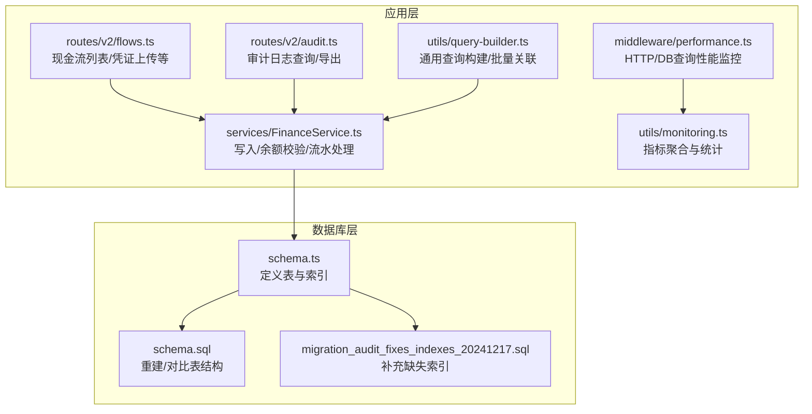
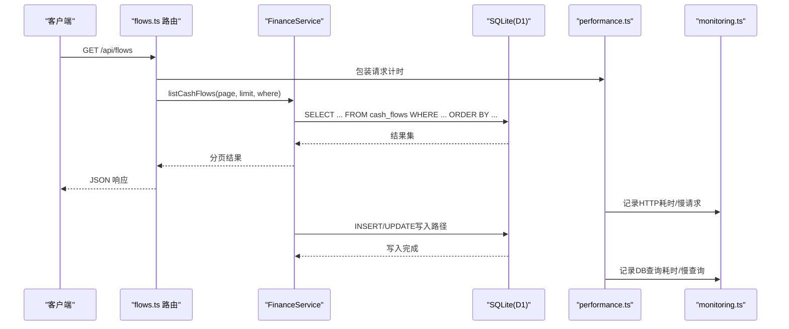
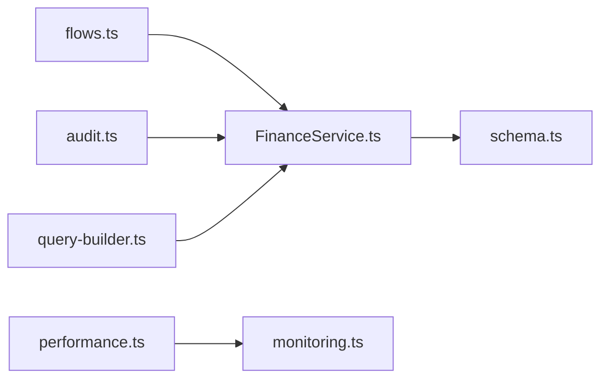

# 索引与性能优化

<cite>
**本文引用的文件**
- [schema.ts](file://backend/src/db/schema.ts)
- [schema.sql](file://backend/src/db/schema.sql)
- [migration_audit_fixes_indexes_20241217.sql](file://backend/src/db/migration_audit_fixes_indexes_20241217.sql)
- [flows.ts](file://backend/src/routes/v2/flows.ts)
- [audit.ts](file://backend/src/routes/v2/audit.ts)
- [performance.ts](file://backend/src/middleware/performance.ts)
- [monitoring.ts](file://backend/src/utils/monitoring.ts)
- [query-builder.ts](file://backend/src/utils/query-builder.ts)
- [FinanceService.ts](file://backend/src/services/FinanceService.ts)
</cite>

## 目录
1. [简介](#简介)
2. [项目结构](#项目结构)
3. [核心组件](#核心组件)
4. [架构总览](#架构总览)
5. [详细组件分析](#详细组件分析)
6. [依赖关系分析](#依赖关系分析)
7. [性能考量](#性能考量)
8. [故障排查指南](#故障排查指南)
9. [结论](#结论)
10. [附录](#附录)

## 简介
本文件聚焦于数据库性能优化，围绕 schema.ts 中的索引定义（如 idx_cash_flows_account_biz）与专用迁移脚本 migration_audit_fixes_indexes_20241217.sql，系统性阐述关键查询路径的索引设计原则，解释复合索引选择、覆盖索引应用场景以及索引对写入性能的影响；同时提供性能监控方法（慢查询指标、执行计划解读）与针对大数据量表（cash_flows、audit_logs）的分区与归档建议。

## 项目结构
- 后端数据库层采用 Drizzle ORM + SQLite（Cloudflare Workers D1），通过 schema.ts 定义表结构与索引，通过 schema.sql 重建/对比表结构，通过迁移脚本补充缺失索引。
- 路由层 flows.ts 与 audit.ts 展示典型查询场景（分页列表、审计日志导出等），服务层 FinanceService.ts 展示高频写入与余额校验逻辑。
- 性能中间件 performance.ts 与监控工具 monitoring.ts 提供慢查询与指标采集能力。

图表来源
- [schema.ts](file://backend/src/db/schema.ts#L160-L188)
- [schema.sql](file://backend/src/db/schema.sql#L187-L216)
- [migration_audit_fixes_indexes_20241217.sql](file://backend/src/db/migration_audit_fixes_indexes_20241217.sql#L1-L13)
- [flows.ts](file://backend/src/routes/v2/flows.ts#L128-L205)
- [audit.ts](file://backend/src/routes/v2/audit.ts#L53-L60)
- [performance.ts](file://backend/src/middleware/performance.ts#L47-L130)
- [monitoring.ts](file://backend/src/utils/monitoring.ts#L93-L364)
- [query-builder.ts](file://backend/src/utils/query-builder.ts#L1-L177)
- [FinanceService.ts](file://backend/src/services/FinanceService.ts#L1-L200)

章节来源
- [schema.ts](file://backend/src/db/schema.ts#L160-L188)
- [schema.sql](file://backend/src/db/schema.sql#L187-L216)
- [migration_audit_fixes_indexes_20241217.sql](file://backend/src/db/migration_audit_fixes_indexes_20241217.sql#L1-L13)
- [flows.ts](file://backend/src/routes/v2/flows.ts#L128-L205)
- [audit.ts](file://backend/src/routes/v2/audit.ts#L53-L60)
- [performance.ts](file://backend/src/middleware/performance.ts#L47-L130)
- [monitoring.ts](file://backend/src/utils/monitoring.ts#L93-L364)
- [query-builder.ts](file://backend/src/utils/query-builder.ts#L1-L177)
- [FinanceService.ts](file://backend/src/services/FinanceService.ts#L1-L200)

## 核心组件
- 现有索引与表结构
  - cash_flows 表：复合索引 idx_cash_flows_account_biz(account_id, biz_date)，单列索引 idx_cash_flows_type(type)。
  - account_transactions 表：复合索引 idx_acc_tx_account_date(account_id, transaction_date)。
  - audit_logs 表：单列索引 idx_audit_logs_time(at)，idx_audit_logs_entity(entity_id)。
- 迁移脚本补充的索引
  - account_transactions(idx_acc_tx_account_date)
  - audit_logs(idx_audit_logs_time, idx_audit_logs_entity)
  - cash_flows(idx_cash_flows_account_biz, idx_cash_flows_type)

章节来源
- [schema.ts](file://backend/src/db/schema.ts#L160-L188)
- [schema.sql](file://backend/src/db/schema.sql#L187-L216)
- [migration_audit_fixes_indexes_20241217.sql](file://backend/src/db/migration_audit_fixes_indexes_20241217.sql#L1-L13)

## 架构总览
下图展示关键查询路径与索引的关系，以及性能监控如何贯穿请求生命周期。

图表来源
- [flows.ts](file://backend/src/routes/v2/flows.ts#L128-L205)
- [performance.ts](file://backend/src/middleware/performance.ts#L47-L130)
- [monitoring.ts](file://backend/src/utils/monitoring.ts#L93-L364)
- [FinanceService.ts](file://backend/src/services/FinanceService.ts#L1-L200)

## 详细组件分析

### 现有索引与查询路径
- cash_flows
  - 复合索引 idx_cash_flows_account_biz(account_id, biz_date)：用于按账户+业务日期范围检索，适合“账户流水明细”与“账单核对”等场景。
  - 单列索引 idx_cash_flows_type(type)：用于按收入/支出类型过滤。
- account_transactions
  - 复合索引 idx_acc_tx_account_date(account_id, transaction_date)：用于按账户+交易日期检索，适合余额计算与历史明细查询。
- audit_logs
  - 单列索引 idx_audit_logs_time(at)：用于按时间排序与筛选。
  - 单列索引 idx_audit_logs_entity(entity_id)：用于按实体ID过滤。

章节来源
- [schema.ts](file://backend/src/db/schema.ts#L160-L188)
- [schema.sql](file://backend/src/db/schema.sql#L187-L216)
- [migration_audit_fixes_indexes_20241217.sql](file://backend/src/db/migration_audit_fixes_indexes_20241217.sql#L1-L13)

### 路由与服务中的关键查询
- 现金流列表（flows.ts）
  - 使用 getDataAccessFilter 动态拼接 where 条件，并通过分页接口返回。
  - 关键字段：created_by、department_id（用于权限过滤），以及 biz_date、type、account_id 等。
- 审计日志查询（audit.ts）
  - 支持按 action、entity、actor、时间范围等过滤，导出 CSV。
- 余额计算与写入（FinanceService.ts）
  - 读取账户历史交易以计算余额，写入 cash_flows 与 account_transactions。
  - 使用乐观锁版本号防止并发写入导致的余额不一致。

章节来源
- [flows.ts](file://backend/src/routes/v2/flows.ts#L128-L205)
- [audit.ts](file://backend/src/routes/v2/audit.ts#L53-L60)
- [FinanceService.ts](file://backend/src/services/FinanceService.ts#L1-L200)

### 复合索引选择原则
- 前缀匹配优先：当查询条件包含 account_id 且常伴随 biz_date 或 transaction_date 时，复合索引能显著减少回表与排序成本。
- 等值 + 范围：account_id 等值匹配 + biz_date/transaction_date 范围扫描，复合索引可覆盖排序与过滤。
- 选择性与基数：type 等低选择性的列单独建立索引，配合复合索引可提升过滤效率。

章节来源
- [schema.ts](file://backend/src/db/schema.ts#L160-L188)
- [schema.sql](file://backend/src/db/schema.sql#L187-L216)

### 覆盖索引应用场景
- 高频查询仅需少量列：通过复合索引覆盖查询所需列，避免回表，降低 IO。
- 排序与过滤合一：当 ORDER BY 与 WHERE 使用同一复合索引前缀时，可避免额外排序开销。
- 审计日志导出：按 at 与 entity_id 过滤并排序，可利用现有单列索引；若导出频繁，可评估是否将常用字段纳入复合索引以覆盖导出场景。

章节来源
- [audit.ts](file://backend/src/routes/v2/audit.ts#L53-L60)
- [schema.ts](file://backend/src/db/schema.ts#L675-L692)

### 写入性能与索引权衡
- 写入放大：新增索引会增加 INSERT/UPDATE/DELETE 的维护成本，尤其在高并发写入场景（如大量现金流）需谨慎评估。
- 乐观锁与写入串行化：FinanceService 对 accounts 的 version 字段进行更新以实现串行化，避免余额计算竞争，但也会带来额外写入。
- 建议：对写入密集表，优先保证主键与必要唯一约束；对读多写少的表（如审计日志）可适度增加索引。

章节来源
- [FinanceService.ts](file://backend/src/services/FinanceService.ts#L146-L166)
- [schema.ts](file://backend/src/db/schema.ts#L139-L149)

### 性能监控与执行计划解读
- 慢查询指标
  - HTTP 请求：超过 1000ms 记录慢请求指标，包含 method、path、status。
  - DB 查询：超过 500ms 记录慢查询指标，包含 query 名称。
- 指标统计
  - getMetricStats 支持按名称与时间窗口统计 count、avg、min、max、p95、p99。
- 执行计划解读
  - SQLite/Drizzle 不直接暴露 EXPLAIN，可通过监控指标定位慢查询；结合路由与服务层调用栈，定位具体查询函数名与参数。

章节来源
- [performance.ts](file://backend/src/middleware/performance.ts#L47-L130)
- [monitoring.ts](file://backend/src/utils/monitoring.ts#L237-L270)

### 大数据量表的分区与归档建议
- 分区策略（建议）
  - 按 biz_date/year-month 切分：将历史数据迁移到独立表或使用视图聚合，减少主表扫描范围。
  - 按 account_id 哈希分区：适用于跨账户查询较少的场景，降低热点。
- 归档方案（建议）
  - 审计日志：按月/季度归档至独立表，保留最近 N 个月的热数据在主表。
  - 现金流：按年归档，保留近 2-3 年的明细，其余压缩统计或只保留摘要。
- 影响评估
  - 分区/归档会增加维护复杂度，需评估查询路径是否仍能命中索引；必要时调整复合索引前缀以适配新结构。

[本节为概念性建议，不直接分析具体文件，故无章节来源]

## 依赖关系分析
- 路由层依赖服务层，服务层依赖 Drizzle ORM 与 schema 定义。
- 性能中间件与监控工具贯穿请求与数据库调用链，形成闭环监控。
- 查询构建器工具提供批量关联与条件构建，减少重复代码与潜在性能问题。

图表来源
- [flows.ts](file://backend/src/routes/v2/flows.ts#L128-L205)
- [audit.ts](file://backend/src/routes/v2/audit.ts#L53-L60)
- [FinanceService.ts](file://backend/src/services/FinanceService.ts#L1-L200)
- [schema.ts](file://backend/src/db/schema.ts#L160-L188)
- [performance.ts](file://backend/src/middleware/performance.ts#L47-L130)
- [monitoring.ts](file://backend/src/utils/monitoring.ts#L93-L364)
- [query-builder.ts](file://backend/src/utils/query-builder.ts#L1-L177)

## 性能考量
- 索引设计
  - 以查询路径为中心：先看高频 WHERE/ORDER BY/JOIN 字段，再决定复合索引顺序。
  - 保持前缀选择性：将区分度高的列放在前面，例如 account_id 在 account_id+date 组合中优先。
- 写入优化
  - 减少不必要的索引变更：批量导入时可临时禁用非关键索引，导入后再重建。
  - 控制事务粒度：长事务会放大锁竞争，尽量缩短事务时间。
- 监控与回归
  - 建立慢查询与慢请求指标基线，定期复盘异常波动。
  - 对新增索引进行 A/B 对比，观察写入延迟与查询耗时变化。

[本节提供通用指导，不直接分析具体文件，故无章节来源]

## 故障排查指南
- 快速定位
  - 查看 performance.ts 记录的慢请求与慢查询指标，确认是否命中预期索引。
  - 使用 monitoring.ts 的 getMetricStats 获取 p95/p99，识别尾部延迟。
- 常见问题
  - 查询未命中索引：检查 WHERE 条件是否与复合索引前缀一致；避免在列上使用函数或隐式转换。
  - 写入延迟上升：检查是否存在大量并发写入与乐观锁冲突；评估是否需要分区/归档。
- 建议流程
  - 采集指标 -> 定位慢查询 -> 分析执行路径 -> 评估索引/分区/归档 -> 回归验证。

章节来源
- [performance.ts](file://backend/src/middleware/performance.ts#L47-L130)
- [monitoring.ts](file://backend/src/utils/monitoring.ts#L237-L270)
- [FinanceService.ts](file://backend/src/services/FinanceService.ts#L146-L166)

## 结论
- 现有索引基本覆盖了高频查询路径（账户+日期、类型过滤、审计日志时间与实体过滤）。
- 建议在保证写入性能的前提下，逐步完善覆盖索引与分区/归档策略，以应对持续增长的数据规模。
- 通过性能中间件与监控工具形成闭环，持续跟踪与优化。

[本节为总结性内容，不直接分析具体文件，故无章节来源]

## 附录
- 关键索引清单
  - cash_flows: idx_cash_flows_account_biz(account_id, biz_date), idx_cash_flows_type(type)
  - account_transactions: idx_acc_tx_account_date(account_id, transaction_date)
  - audit_logs: idx_audit_logs_time(at), idx_audit_logs_entity(entity_id)
- 相关迁移脚本
  - migration_audit_fixes_indexes_20241217.sql 补充了上述索引。

章节来源
- [schema.ts](file://backend/src/db/schema.ts#L160-L188)
- [schema.sql](file://backend/src/db/schema.sql#L187-L216)
- [migration_audit_fixes_indexes_20241217.sql](file://backend/src/db/migration_audit_fixes_indexes_20241217.sql#L1-L13)