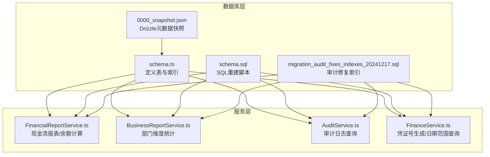
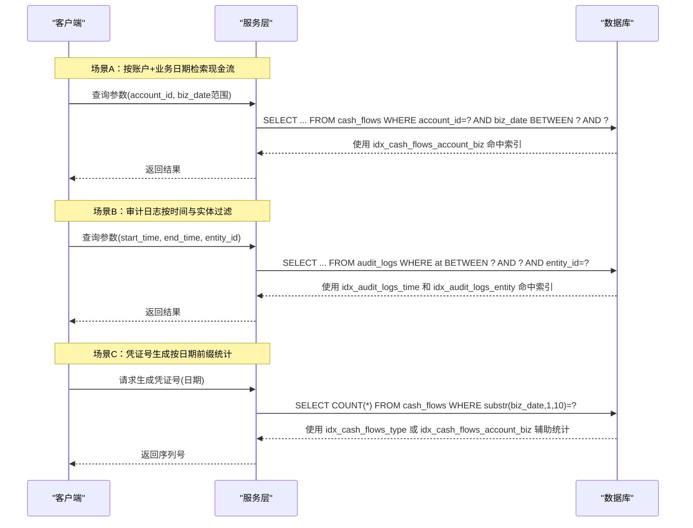
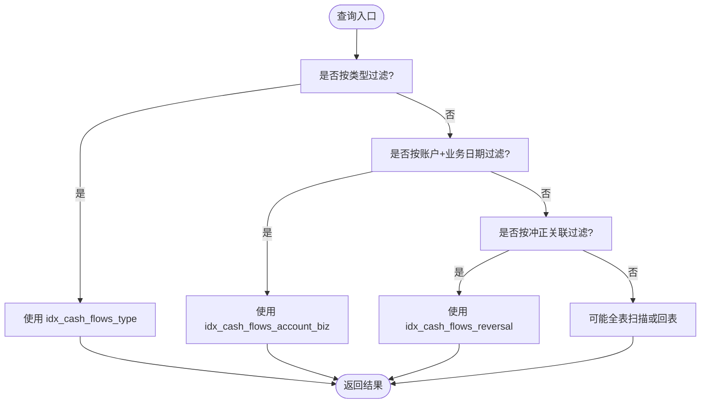
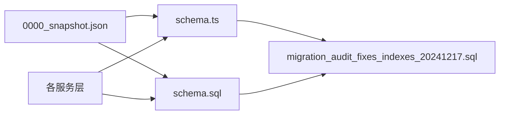

# 索引策略设计

<cite>
**本文引用的文件**
- [schema.ts](file://backend/src/db/schema.ts)
- [migration_audit_fixes_indexes_20241217.sql](file://backend/src/db/migration_audit_fixes_indexes_20241217.sql)
- [schema.sql](file://backend/src/db/schema.sql)
- [FinancialReportService.ts](file://backend/src/services/FinancialReportService.ts)
- [BusinessReportService.ts](file://backend/src/services/BusinessReportService.ts)
- [AuditService.ts](file://backend/src/services/AuditService.ts)
- [FinanceService.ts](file://backend/src/services/FinanceService.ts)
- [0000_snapshot.json](file://backend/drizzle/meta/0000_snapshot.json)
</cite>

## 目录
1. [简介](#简介)
2. [项目结构与索引相关文件定位](#项目结构与索引相关文件定位)
3. [核心索引清单与职责](#核心索引清单与职责)
4. [架构总览与查询路径](#架构总览与查询路径)
5. [详细组件分析](#详细组件分析)
6. [依赖关系与耦合分析](#依赖关系与耦合分析)
7. [性能考量与权衡](#性能考量与权衡)
8. [故障排查与验证](#故障排查与验证)
9. [结论](#结论)

## 简介
本文件围绕后端数据库层的索引策略进行系统化梳理，重点覆盖以下内容：
- schema.ts 中定义的索引（如 idx_cash_flows_account_biz、idx_audit_logs_target_type 的等价索引）；
- migration_audit_fixes_indexes_20241217.sql 中的优化变更；
- 复合索引列顺序选择原则；
- 覆盖索引在减少回表查询中的应用；
- 唯一索引在数据完整性保障中的作用；
- 结合典型查询场景（如按账户与业务日期检索流水、审计日志按时间与实体过滤）说明索引如何提升查询效率；
- 分析索引对 INSERT/UPDATE/DELETE 的影响及权衡建议；
- 提供 EXPLAIN 执行计划解读示例，帮助开发者验证索引有效性。

## 项目结构与索引相关文件定位
- schema.ts：以 Drizzle ORM 的 sqliteTable 定义表结构，并通过 index()/uniqueIndex() 在代码层面声明索引，便于迁移与一致性管理。
- migration_audit_fixes_indexes_20241217.sql：针对审计报告发现的缺失索引进行补充，确保运行时查询性能达标。
- schema.sql：重建 SQL 版本的表结构与索引定义，用于迁移脚本与数据库初始化。
- 各服务层（如 FinancialReportService、BusinessReportService、AuditService、FinanceService）：承载高频查询逻辑，是索引效果的直接使用者。

图表来源
- [schema.ts](file://backend/src/db/schema.ts#L159-L188)
- [schema.sql](file://backend/src/db/schema.sql#L129-L216)
- [migration_audit_fixes_indexes_20241217.sql](file://backend/src/db/migration_audit_fixes_indexes_20241217.sql#L1-L13)
- [FinancialReportService.ts](file://backend/src/services/FinancialReportService.ts#L135-L222)
- [BusinessReportService.ts](file://backend/src/services/BusinessReportService.ts#L40-L68)
- [AuditService.ts](file://backend/src/services/AuditService.ts#L182-L228)
- [FinanceService.ts](file://backend/src/services/FinanceService.ts#L1-L39)
- [0000_snapshot.json](file://backend/drizzle/meta/0000_snapshot.json#L974-L1028)

章节来源
- [schema.ts](file://backend/src/db/schema.ts#L159-L188)
- [schema.sql](file://backend/src/db/schema.sql#L129-L216)
- [migration_audit_fixes_indexes_20241217.sql](file://backend/src/db/migration_audit_fixes_indexes_20241217.sql#L1-L13)
- [FinancialReportService.ts](file://backend/src/services/FinancialReportService.ts#L135-L222)
- [BusinessReportService.ts](file://backend/src/services/BusinessReportService.ts#L40-L68)
- [AuditService.ts](file://backend/src/services/AuditService.ts#L182-L228)
- [FinanceService.ts](file://backend/src/services/FinanceService.ts#L1-L39)
- [0000_snapshot.json](file://backend/drizzle/meta/0000_snapshot.json#L974-L1028)

## 核心索引清单与职责
- 现金流（cash_flows）
  - 复合索引 idx_cash_flows_account_biz(account_id, biz_date)：支撑“按账户+业务日期”检索流水的高效查询。
  - 单列索引 idx_cash_flows_type(type)：支撑按业务类型过滤的查询。
  - 单列索引 idx_cash_flows_reversal(reversal_of_flow_id)：支撑红冲/冲正关联查询。
- 账户交易（account_transactions）
  - 复合索引 idx_acc_tx_account_date(account_id, transaction_date)：支撑“按账户+交易日期”检索交易明细。
- 审计日志（audit_logs）
  - 单列索引 idx_audit_logs_time(at)：支撑按时间范围检索审计日志。
  - 单列索引 idx_audit_logs_entity(entity_id)：支撑按实体ID检索审计日志。
- 唯一索引
  - allowance_payments 表：唯一索引 idx_unq_allowance_payments_emp_period_type(employee_id, year, month, allowance_type)，保障同一员工、年、月、津贴类型的支付记录唯一性。
  - salary_payments 表：唯一索引 idx_unq_salary_payments_emp_period(employee_id, year, month)，保障同一员工、年、月的薪资支付唯一性。

章节来源
- [schema.ts](file://backend/src/db/schema.ts#L159-L188)
- [schema.ts](file://backend/src/db/schema.ts#L190-L206)
- [schema.ts](file://backend/src/db/schema.ts#L240-L316)
- [migration_audit_fixes_indexes_20241217.sql](file://backend/src/db/migration_audit_fixes_indexes_20241217.sql#L1-L13)
- [0000_snapshot.json](file://backend/drizzle/meta/0000_snapshot.json#L974-L1028)

## 架构总览与查询路径
下图展示典型查询路径与索引的对应关系，帮助理解索引在不同场景下的作用。

图表来源
- [FinancialReportService.ts](file://backend/src/services/FinancialReportService.ts#L135-L222)
- [BusinessReportService.ts](file://backend/src/services/BusinessReportService.ts#L40-L68)
- [AuditService.ts](file://backend/src/services/AuditService.ts#L182-L228)
- [FinanceService.ts](file://backend/src/services/FinanceService.ts#L1-L39)
- [schema.ts](file://backend/src/db/schema.ts#L159-L188)
- [schema.ts](file://backend/src/db/schema.ts#L675-L706)
- [migration_audit_fixes_indexes_20241217.sql](file://backend/src/db/migration_audit_fixes_indexes_20241217.sql#L1-L13)

## 详细组件分析

### 现金流表（cash_flows）索引策略
- 复合索引 idx_cash_flows_account_biz(account_id, biz_date)
  - 列顺序选择原则：先选选择性高且常用于等值过滤的列，再选范围过滤列。account_id 通常具备较高选择性，biz_date 用于范围过滤，符合“等值优先、范围靠后”的原则。
  - 覆盖索引应用：若查询仅涉及 account_id、biz_date 及少量其他列，可利用该复合索引避免回表；若查询需要回表读取其他列，则需评估是否引入额外覆盖列或调整查询投影。
- 单列索引 idx_cash_flows_type(type)
  - 用于按业务类型过滤的查询，如收入/支出统计或凭证号生成时按类型统计。
- 单列索引 idx_cash_flows_reversal(reversal_of_flow_id)
  - 支撑红冲/冲正关联查询，避免全表扫描。

图表来源
- [schema.ts](file://backend/src/db/schema.ts#L159-L188)
- [migration_audit_fixes_indexes_20241217.sql](file://backend/src/db/migration_audit_fixes_indexes_20241217.sql#L10-L12)

章节来源
- [schema.ts](file://backend/src/db/schema.ts#L159-L188)
- [migration_audit_fixes_indexes_20241217.sql](file://backend/src/db/migration_audit_fixes_indexes_20241217.sql#L10-L12)
- [0000_snapshot.json](file://backend/drizzle/meta/0000_snapshot.json#L974-L1028)

### 账户交易表（account_transactions）索引策略
- 复合索引 idx_acc_tx_account_date(account_id, transaction_date)
  - 列顺序选择原则：account_id 具备高选择性，transaction_date 用于范围过滤，适合“账户+日期”查询。
  - 覆盖索引应用：若查询仅读取账户交易表的必要列，可避免回表；若需要联表读取其他列，应评估是否引入覆盖列或调整查询。

章节来源
- [schema.ts](file://backend/src/db/schema.ts#L190-L206)
- [migration_audit_fixes_indexes_20241217.sql](file://backend/src/db/migration_audit_fixes_indexes_20241217.sql#L3-L5)

### 审计日志表（audit_logs）索引策略
- 单列索引 idx_audit_logs_time(at)
  - 支撑按时间范围检索审计日志，满足审计合规与运营监控需求。
- 单列索引 idx_audit_logs_entity(entity_id)
  - 支撑按实体ID检索审计日志，便于追踪特定对象的操作历史。
- schema.ts 中还定义了 idx_audit_logs_time 与 idx_audit_logs_entity 的等价索引声明，与迁移脚本保持一致。

章节来源
- [schema.ts](file://backend/src/db/schema.ts#L675-L706)
- [migration_audit_fixes_indexes_20241217.sql](file://backend/src/db/migration_audit_fixes_indexes_20241217.sql#L6-L9)
- [AuditService.ts](file://backend/src/services/AuditService.ts#L182-L228)

### 唯一索引与数据完整性
- allowance_payments 表
  - 唯一索引 idx_unq_allowance_payments_emp_period_type(employee_id, year, month, allowance_type)
  - 作用：防止重复发放同一员工、年、月、津贴类型的支付记录，保障业务数据一致性。
- salary_payments 表
  - 唯一索引 idx_unq_salary_payments_emp_period(employee_id, year, month)
  - 作用：防止重复发放同一员工、年、月的薪资支付记录，保障薪资发放流程的正确性。

章节来源
- [schema.ts](file://backend/src/db/schema.ts#L240-L316)

## 依赖关系与耦合分析
- 索引与查询的耦合
  - 服务层查询条件与索引列顺序密切相关。例如：
    - FinancialReportService 的“账户+业务日期”查询依赖 idx_cash_flows_account_biz；
    - AuditService 的“时间范围+实体ID”查询依赖 idx_audit_logs_time 与 idx_audit_logs_entity；
    - BusinessReportService 的“部门+日期范围”查询依赖 cash_flows 的 biz_date 等列。
- 迁移与代码的一致性
  - schema.ts 与 migration_audit_fixes_indexes_20241217.sql 对应，确保运行时与开发时索引一致。
- Drizzle 元数据
  - 0000_snapshot.json 记录了当前索引状态，可用于比对与审计。

图表来源
- [schema.ts](file://backend/src/db/schema.ts#L159-L188)
- [schema.sql](file://backend/src/db/schema.sql#L129-L216)
- [migration_audit_fixes_indexes_20241217.sql](file://backend/src/db/migration_audit_fixes_indexes_20241217.sql#L1-L13)
- [0000_snapshot.json](file://backend/drizzle/meta/0000_snapshot.json#L974-L1028)

章节来源
- [schema.ts](file://backend/src/db/schema.ts#L159-L188)
- [schema.sql](file://backend/src/db/schema.sql#L129-L216)
- [migration_audit_fixes_indexes_20241217.sql](file://backend/src/db/migration_audit_fixes_indexes_20241217.sql#L1-L13)
- [0000_snapshot.json](file://backend/drizzle/meta/0000_snapshot.json#L974-L1028)

## 性能考量与权衡
- 复合索引列顺序选择原则
  - 等值过滤优先：先放高选择性的等值列，再放范围列；
  - 范围过滤靠后：尽量将范围列放在最后，以减少索引扫描范围；
  - 查询覆盖：尽可能让查询投影命中索引覆盖，减少回表。
- 覆盖索引的应用
  - 若查询仅读取索引已包含的列，可完全走索引不回表，显著降低 IO；
  - 若查询需要回表读取其他列，应评估是否引入覆盖列或调整查询投影。
- 唯一索引的作用
  - 防止重复数据，保障业务规则；
  - 唯一索引本身即为单列索引，写入时会进行唯一性检查，带来一定写入开销，但收益是数据完整性。
- INSERT/UPDATE/DELETE 的影响
  - 写入成本：每新增/更新一条记录，数据库需要维护所有相关索引，索引越多写入越慢；
  - 读取收益：索引显著提升查询性能，尤其在高频查询场景；
  - 权衡建议：
    - 仅对高频查询列建立索引；
    - 对写多读少的表谨慎增加索引；
    - 对唯一性约束使用唯一索引，避免重复数据带来的后续查询与业务问题；
    - 定期评估索引使用率，清理未使用的索引。

[本节为通用性能讨论，无需列出具体文件来源]

## 故障排查与验证
- 如何验证索引是否被使用
  - 使用 EXPLAIN 或 EXPLAIN QUERY PLAN 查看执行计划，确认是否命中目标索引；
  - 关注关键指标：
    - 是否发生全表扫描（full table scan）；
    - 是否存在回表（table lookup by rowid）；
    - 是否使用了期望的索引（如 idx_cash_flows_account_biz、idx_audit_logs_time 等）。
- 常见问题与对策
  - 查询未命中索引：检查查询条件是否与索引列顺序匹配，尤其是等值与范围条件；
  - 回表过多：考虑使用覆盖索引或调整查询投影；
  - 唯一索引冲突：插入时报唯一约束错误，需检查业务逻辑是否重复插入相同键值。
- 实际验证建议
  - 在测试环境构造与生产相似的查询负载，对比加索引前后的执行计划与耗时；
  - 对高频查询（如“账户+业务日期”、“时间范围+实体ID”）进行专项压测与回归验证。

[本节为通用验证方法，无需列出具体文件来源]

## 结论
- 本项目的索引策略以“高频查询场景”为核心，兼顾数据完整性（唯一索引）与可维护性（代码与迁移一致）。
- 复合索引的列顺序遵循“等值优先、范围靠后”的原则，配合覆盖索引可有效减少回表。
- 唯一索引在业务关键表上保障数据一致性，虽带来写入成本，但换取了查询与业务上的确定性。
- 建议持续监控索引使用情况，定期评估与优化，确保在读写平衡上取得最佳效果。