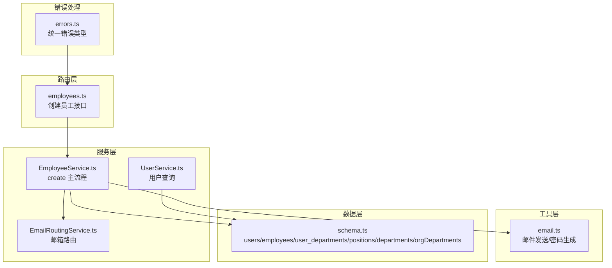
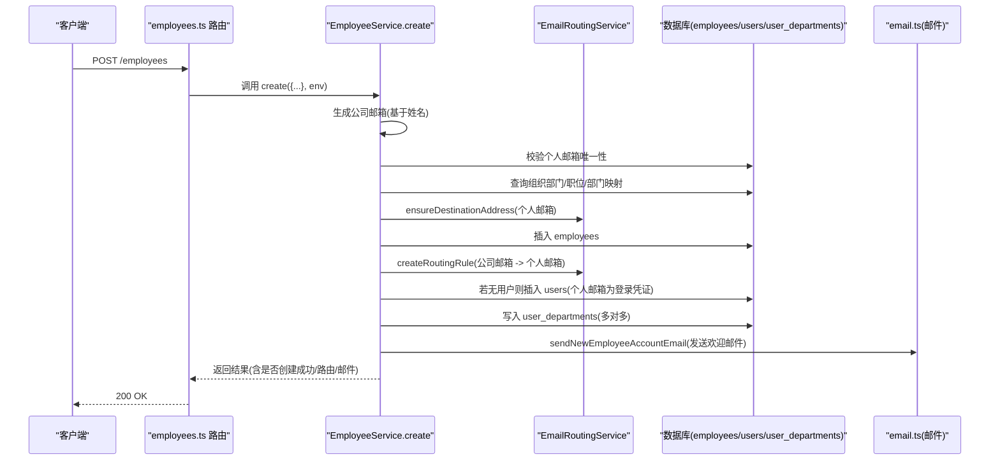
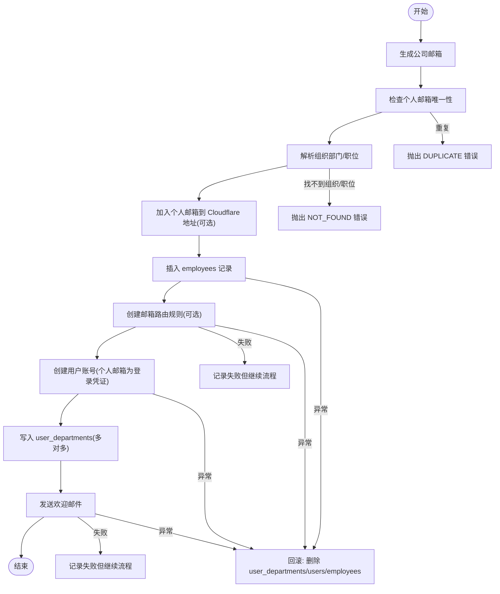
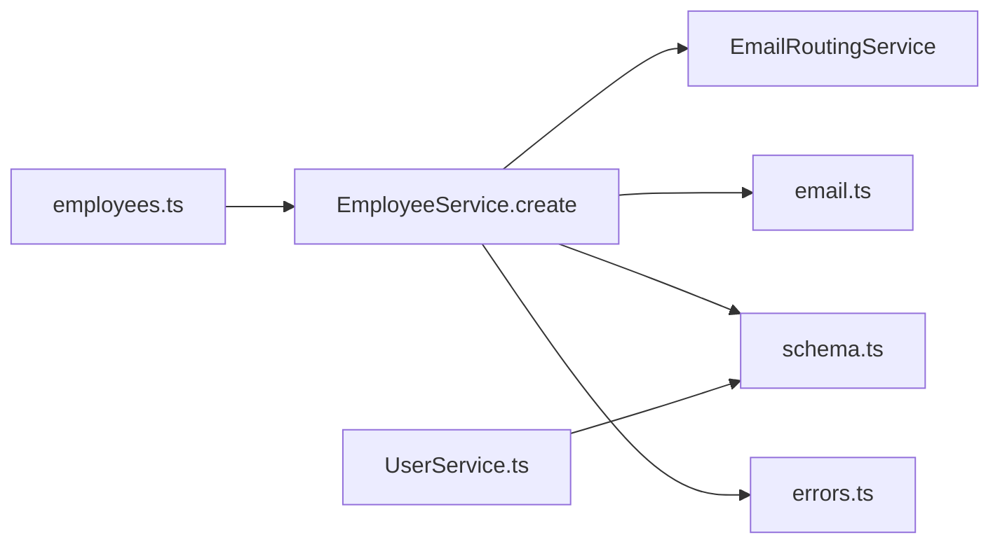

# 用户与员工创建流程

<cite>
**本文引用的文件**
- [EmployeeService.ts](file://backend/src/services/EmployeeService.ts)
- [EmailRoutingService.ts](file://backend/src/services/EmailRoutingService.ts)
- [email.ts](file://backend/src/utils/email.ts)
- [employees.ts](file://backend/src/routes/employees.ts)
- [auth.ts](file://backend/src/routes/auth.ts)
- [UserService.ts](file://backend/src/services/UserService.ts)
- [schema.ts](file://backend/src/db/schema.ts)
- [employee.schema.ts](file://backend/src/schemas/employee.schema.ts)
- [errors.ts](file://backend/src/utils/errors.ts)
- [EmployeeService.test.ts](file://backend/test/services/EmployeeService.test.ts)
</cite>

## 目录
1. [简介](#简介)
2. [项目结构](#项目结构)
3. [核心组件](#核心组件)
4. [架构总览](#架构总览)
5. [详细组件分析](#详细组件分析)
6. [依赖分析](#依赖分析)
7. [性能考虑](#性能考虑)
8. [故障排查指南](#故障排查指南)
9. [结论](#结论)

## 简介
本文件面向开发者，系统性阐述“用户与员工创建流程”，重点聚焦 EmployeeService.create 方法的实现逻辑与关键步骤，包括：
- 如何基于员工姓名生成公司邮箱
- 如何检查个人邮箱唯一性
- 如何获取组织部门与职位信息并确定实际部门
- 如何生成初始密码并以个人邮箱作为登录凭证创建用户账号
- 如何通过 EmailRoutingService 创建邮箱路由规则，将公司邮箱邮件转发到个人邮箱
- 如何在创建完成后发送包含初始密码的欢迎邮件
- 在创建流程中可能出现的错误（如邮箱冲突、部门不存在等）及最佳实践
- 回滚机制如何确保数据一致性

## 项目结构
围绕“用户与员工创建”的关键代码分布在以下模块：
- 路由层：employees.ts 提供创建员工接口，调用服务层
- 服务层：EmployeeService.ts 实现创建员工的完整流程；EmailRoutingService.ts 负责邮箱路由；UserService.ts 提供用户查询能力
- 工具层：email.ts 提供邮件发送工具（含生成随机密码、欢迎邮件、密码重置邮件）
- 数据层：schema.ts 定义 users、employees、user_departments、positions、departments、orgDepartments 等核心表结构
- 错误处理：errors.ts 提供统一错误类型与中间件
- 测试：EmployeeService.test.ts 展示迁移场景与断言

图表来源
- [employees.ts](file://backend/src/routes/employees.ts#L92-L161)
- [EmployeeService.ts](file://backend/src/services/EmployeeService.ts#L15-L249)
- [EmailRoutingService.ts](file://backend/src/services/EmailRoutingService.ts#L1-L248)
- [email.ts](file://backend/src/utils/email.ts#L190-L273)
- [schema.ts](file://backend/src/db/schema.ts#L11-L123)
- [errors.ts](file://backend/src/utils/errors.ts#L34-L54)

章节来源
- [employees.ts](file://backend/src/routes/employees.ts#L92-L161)
- [EmployeeService.ts](file://backend/src/services/EmployeeService.ts#L15-L249)
- [EmailRoutingService.ts](file://backend/src/services/EmailRoutingService.ts#L1-L248)
- [email.ts](file://backend/src/utils/email.ts#L190-L273)
- [schema.ts](file://backend/src/db/schema.ts#L11-L123)
- [errors.ts](file://backend/src/utils/errors.ts#L34-L54)

## 核心组件
- EmployeeService.create：负责员工创建主流程，包括公司邮箱生成、个人邮箱唯一性校验、组织部门与职位解析、用户账号创建、邮箱路由规则创建、欢迎邮件发送以及回滚
- EmailRoutingService：负责公司邮箱前缀生成、个人邮箱加入 Cloudflare Email Routing 地址、创建/删除/列举路由规则
- email.ts：提供 generateRandomPassword、sendNewEmployeeAccountEmail、sendPasswordResetEmail 等工具函数
- employees.ts：定义创建员工的 API 接口，调用 EmployeeService.create 并记录审计日志
- UserService：提供用户查询、部门与组织部门解析、多部门关联查询等能力
- schema.ts：定义 users、employees、user_departments、positions、departments、orgDepartments 等表结构
- errors.ts：统一错误类型（NOT_FOUND、DUPLICATE、VALIDATION_ERROR、BUSINESS_ERROR、INTERNAL_ERROR）

章节来源
- [EmployeeService.ts](file://backend/src/services/EmployeeService.ts#L15-L249)
- [EmailRoutingService.ts](file://backend/src/services/EmailRoutingService.ts#L1-L248)
- [email.ts](file://backend/src/utils/email.ts#L190-L273)
- [employees.ts](file://backend/src/routes/employees.ts#L92-L161)
- [UserService.ts](file://backend/src/services/UserService.ts#L1-L183)
- [schema.ts](file://backend/src/db/schema.ts#L11-L123)
- [errors.ts](file://backend/src/utils/errors.ts#L34-L54)

## 架构总览
下图展示“创建员工”端到端调用链路与数据流：

图表来源
- [employees.ts](file://backend/src/routes/employees.ts#L118-L161)
- [EmployeeService.ts](file://backend/src/services/EmployeeService.ts#L49-L249)
- [EmailRoutingService.ts](file://backend/src/services/EmailRoutingService.ts#L78-L162)
- [email.ts](file://backend/src/utils/email.ts#L213-L273)
- [schema.ts](file://backend/src/db/schema.ts#L11-L123)

## 详细组件分析

### EmployeeService.create 方法详解
- 输入参数：包含员工姓名、个人邮箱、组织部门、可选部门、职位、入职日期等
- 输出结果：返回新员工 id、公司邮箱、个人邮箱、是否创建用户账号、用户角色、是否发送邮件、是否创建邮箱路由、初始密码（仅当创建用户账号时）
- 关键步骤与要点：
  1) 生成公司邮箱
     - 通过 EmailRoutingService.generateCompanyEmail 基于员工姓名生成前缀，并与现有邮箱去重
     - 参考路径：[EmployeeService.ts](file://backend/src/services/EmployeeService.ts#L49-L60)，[EmailRoutingService.ts](file://backend/src/services/EmailRoutingService.ts#L33-L53)
  2) 检查个人邮箱唯一性
     - 在 employees 表按 personalEmail 查询，若存在则抛出 DUPLICATE 错误
     - 参考路径：[EmployeeService.ts](file://backend/src/services/EmployeeService.ts#L61-L66)，[errors.ts](file://backend/src/utils/errors.ts#L34-L54)
  3) 解析组织部门与职位
     - 读取 orgDepartments 确定实际部门：优先使用传入 departmentId，否则使用 orgDepartment.projectId，若仍为空则回退到“总部”部门
     - 读取 positions 获取 functionRole 作为用户角色
     - 参考路径：[EmployeeService.ts](file://backend/src/services/EmployeeService.ts#L67-L88)，[schema.ts](file://backend/src/db/schema.ts#L102-L116)
  4) 个人邮箱加入 Cloudflare Email Routing 地址（可选）
     - 当环境变量提供 CF_API_TOKEN 和 CF_ACCOUNT_ID 时，调用 ensureDestinationAddress
     - 参考路径：[EmployeeService.ts](file://backend/src/services/EmployeeService.ts#L92-L100)，[EmailRoutingService.ts](file://backend/src/services/EmailRoutingService.ts#L78-L109)
  5) 创建员工记录
     - 插入 employees，状态初始化为 probation，active=1
     - 参考路径：[EmployeeService.ts](file://backend/src/services/EmployeeService.ts#L107-L139)，[schema.ts](file://backend/src/db/schema.ts#L26-L56)
  6) 创建邮箱路由规则
     - 当环境变量提供 CF_API_TOKEN 和 CF_ZONE_ID 时，调用 createRoutingRule，将公司邮箱转发到个人邮箱
     - 参考路径：[EmployeeService.ts](file://backend/src/services/EmployeeService.ts#L141-L154)，[EmailRoutingService.ts](file://backend/src/services/EmailRoutingService.ts#L111-L162)
  7) 创建用户账号
     - 使用 generateRandomPassword 生成初始密码并 bcrypt 加密
     - 若 users 中不存在以 personalEmail 为登录凭证的用户，则插入 users，并设置 mustChangePassword=1
     - 同步写入 user_departments（多对多），departmentId 来自上一步解析
     - 参考路径：[EmployeeService.ts](file://backend/src/services/EmployeeService.ts#L155-L191)，[email.ts](file://backend/src/utils/email.ts#L190-L211)，[schema.ts](file://backend/src/db/schema.ts#L118-L123)
  8) 发送欢迎邮件
     - 通过 sendNewEmployeeAccountEmail 发送包含登录地址、登录邮箱、初始密码的邮件
     - 参考路径：[EmployeeService.ts](file://backend/src/services/EmployeeService.ts#L193-L214)，[email.ts](file://backend/src/utils/email.ts#L213-L273)
  9) 错误处理与回滚
     - try/catch 包裹整个流程，若异常发生，按逆序删除已创建记录（user_departments -> users -> employees），并重新抛出原始错误
     - 参考路径：[EmployeeService.ts](file://backend/src/services/EmployeeService.ts#L107-L248)

图表来源
- [EmployeeService.ts](file://backend/src/services/EmployeeService.ts#L49-L249)
- [EmailRoutingService.ts](file://backend/src/services/EmailRoutingService.ts#L78-L162)
- [email.ts](file://backend/src/utils/email.ts#L190-L273)
- [errors.ts](file://backend/src/utils/errors.ts#L34-L54)

章节来源
- [EmployeeService.ts](file://backend/src/services/EmployeeService.ts#L15-L249)
- [EmailRoutingService.ts](file://backend/src/services/EmailRoutingService.ts#L1-L248)
- [email.ts](file://backend/src/utils/email.ts#L190-L273)
- [errors.ts](file://backend/src/utils/errors.ts#L34-L54)

### EmailRoutingService 组件
- generateCompanyEmail：将姓名转换为邮箱前缀，结合域名生成唯一邮箱，冲突时追加计数器
- ensureDestinationAddress/createDestinationAddress：将个人邮箱加入 Cloudflare Email Routing 地址，触发验证
- createRoutingRule/deleteRoutingRule/listRoutingRules：创建/删除/列举路由规则，匹配 to=公司邮箱，动作 forward=个人邮箱
- 注意：该服务依赖 Cloudflare API，需正确配置 CF_ACCOUNT_ID、CF_ZONE_ID、CF_EMAIL_TOKEN

章节来源
- [EmailRoutingService.ts](file://backend/src/services/EmailRoutingService.ts#L33-L247)

### 邮件发送工具 email.ts
- generateRandomPassword：生成包含大小写字母、数字、特殊字符的随机密码
- sendNewEmployeeAccountEmail：发送新员工账号信息邮件，包含登录地址、登录邮箱、初始密码
- sendPasswordResetEmail：发送密码重置邮件（用于后续重置场景）

章节来源
- [email.ts](file://backend/src/utils/email.ts#L190-L324)

### 路由层 employees.ts
- 定义创建员工接口，校验权限，调用 EmployeeService.create，并记录审计日志
- 返回字段包含 id、email、personalEmail、userAccountCreated、userRole、emailSent、emailRoutingCreated

章节来源
- [employees.ts](file://backend/src/routes/employees.ts#L92-L161)

### 用户查询服务 UserService.ts
- getUserEmployeeId：根据个人邮箱查找员工 id（用于登录后识别员工）
- getUserPosition：根据个人邮箱关联 employees 与 positions，返回职位信息与功能角色
- getUserDepartmentIds：优先读取 user_departments 多对多表，兼容旧的 users.department_id 字段
- getUserOrgDepartmentId：从员工记录获取 org_department_id（权威来源）

章节来源
- [UserService.ts](file://backend/src/services/UserService.ts#L1-L183)

### 数据模型 schema.ts
- users：email 唯一，支持 mustChangePassword、positionId、departmentId、orgDepartmentId 等
- employees：email 唯一，保存 personalEmail、departmentId、orgDepartmentId、positionId 等
- user_departments：维护用户与部门的多对多关系
- positions/departments/orgDepartments：职位、部门、组织部门

章节来源
- [schema.ts](file://backend/src/db/schema.ts#L11-L123)

### API 定义与响应
- 创建员工请求体包含：name、personalEmail、orgDepartmentId、departmentId、positionId、joinDate 等
- 响应体包含：id、email、personalEmail、userAccountCreated、userRole、emailSent、emailRoutingCreated

章节来源
- [employee.schema.ts](file://backend/src/schemas/employee.schema.ts#L85-L121)

## 依赖分析
- EmployeeService.create 依赖：
  - EmailRoutingService：生成公司邮箱、创建/删除路由规则、加入目的地地址
  - email.ts：生成随机密码、发送欢迎邮件
  - schema.ts：读写 employees、users、user_departments、positions、departments、orgDepartments
  - errors.ts：抛出 NOT_FOUND、DUPLICATE 等业务错误
- 路由层 employees.ts 依赖 EmployeeService.create，并记录审计日志
- UserService.ts 依赖 schema.ts 的表结构，用于用户查询与多部门关联

图表来源
- [EmployeeService.ts](file://backend/src/services/EmployeeService.ts#L15-L249)
- [EmailRoutingService.ts](file://backend/src/services/EmailRoutingService.ts#L1-L248)
- [email.ts](file://backend/src/utils/email.ts#L190-L273)
- [schema.ts](file://backend/src/db/schema.ts#L11-L123)
- [errors.ts](file://backend/src/utils/errors.ts#L34-L54)
- [employees.ts](file://backend/src/routes/employees.ts#L92-L161)
- [UserService.ts](file://backend/src/services/UserService.ts#L1-L183)

## 性能考虑
- 批量查询与去重：生成公司邮箱前先拉取全部 employees.email 进行去重，建议在高并发场景下优化为按需去重或缓存策略
- 事务与原子性：D1 不支持传统事务，采用 try/catch + 逆序删除实现回滚；建议在可能的情况下合并写入，减少往返
- 外部依赖：Cloudflare Email Routing API 调用可能成为瓶颈，建议增加超时与重试策略
- 密码哈希：bcrypt hash 在创建用户时执行，建议在高并发场景下评估 CPU 开销

[本节为通用指导，无需列出具体文件来源]

## 故障排查指南
- 邮箱冲突（个人邮箱重复）
  - 现象：抛出 DUPLICATE 错误
  - 处理：确认个人邮箱唯一性，必要时清理历史数据或引导用户更换邮箱
  - 参考路径：[EmployeeService.ts](file://backend/src/services/EmployeeService.ts#L61-L66)，[errors.ts](file://backend/src/utils/errors.ts#L34-L54)
- 组织部门不存在
  - 现象：抛出 NOT_FOUND('组织部门')
  - 处理：检查 orgDepartmentId 是否正确，或在创建前预校验 orgDepartments
  - 参考路径：[EmployeeService.ts](file://backend/src/services/EmployeeService.ts#L67-L71)
- 职位不存在
  - 现象：抛出 NOT_FOUND('职位')
  - 处理：检查 positionId 是否正确，或在创建前预校验 positions
  - 参考路径：[EmployeeService.ts](file://backend/src/services/EmployeeService.ts#L83-L87)
- 部门解析失败
  - 现象：departmentId 为空且无法找到“总部”
  - 处理：确保存在名为“总部”的部门，或传入有效的 departmentId
  - 参考路径：[EmployeeService.ts](file://backend/src/services/EmployeeService.ts#L73-L81)
- 邮箱路由创建失败
  - 现象：emailRoutingCreated=false，控制台输出错误日志
  - 处理：检查 CF_API_TOKEN、CF_ZONE_ID 配置，确认 Cloudflare 账户权限
  - 参考路径：[EmployeeService.ts](file://backend/src/services/EmployeeService.ts#L141-L154)，[EmailRoutingService.ts](file://backend/src/services/EmailRoutingService.ts#L111-L162)
- 欢迎邮件发送失败
  - 现象：email_sent=false，控制台输出错误日志
  - 处理：检查 EMAIL_SERVICE 与 EMAIL_TOKEN 配置
  - 参考路径：[EmployeeService.ts](file://backend/src/services/EmployeeService.ts#L193-L214)，[email.ts](file://backend/src/utils/email.ts#L101-L140)
- 回滚失败
  - 现象：回滚阶段删除失败，控制台输出错误日志
  - 处理：检查数据库连接与权限，必要时手动清理残留数据
  - 参考路径：[EmployeeService.ts](file://backend/src/services/EmployeeService.ts#L229-L244)

章节来源
- [EmployeeService.ts](file://backend/src/services/EmployeeService.ts#L61-L81)
- [EmailRoutingService.ts](file://backend/src/services/EmailRoutingService.ts#L111-L162)
- [email.ts](file://backend/src/utils/email.ts#L101-L140)
- [errors.ts](file://backend/src/utils/errors.ts#L34-L54)

## 结论
- EmployeeService.create 将“公司邮箱生成、个人邮箱唯一性校验、组织部门与职位解析、用户账号创建、邮箱路由规则创建、欢迎邮件发送”串联为一个完整的员工创建流程
- 通过 EmailRoutingService 与 Cloudflare Email Routing 集成，确保公司邮箱邮件能转发到个人邮箱
- 通过 UserService 的多对多关系 user_departments，实现用户与部门的灵活关联
- 通过 try/catch + 逆序删除实现回滚，保障数据一致性
- 建议在生产环境中完善外部依赖的超时与重试、监控与告警，以及对高并发场景下的批量优化