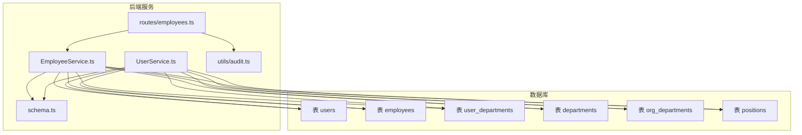
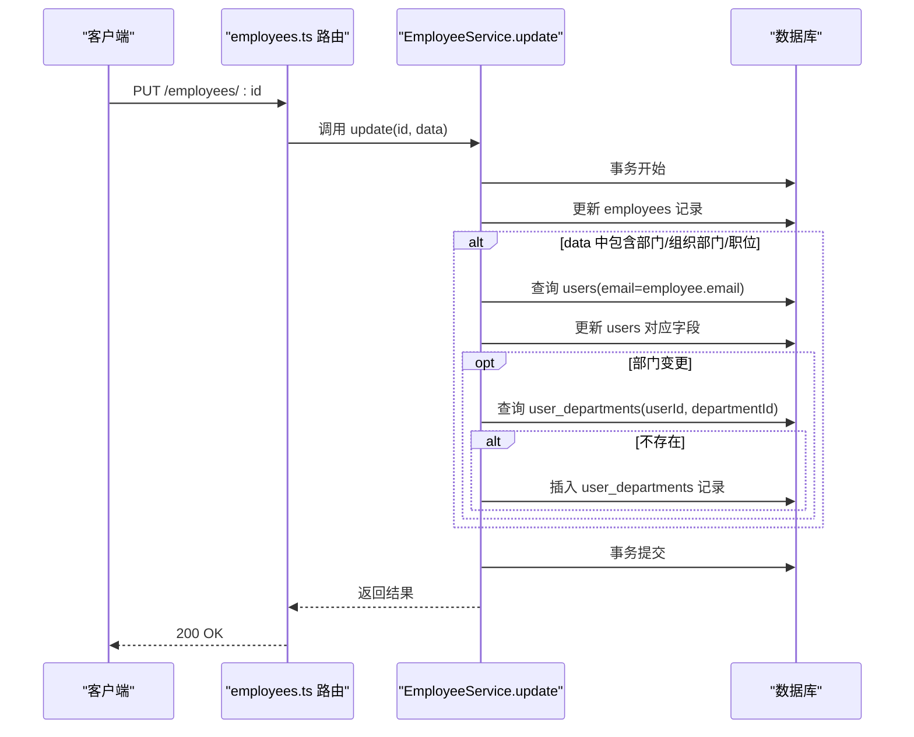
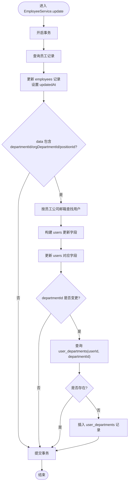
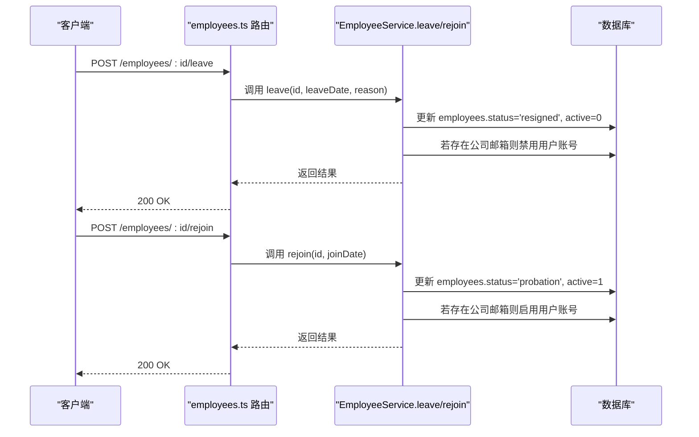
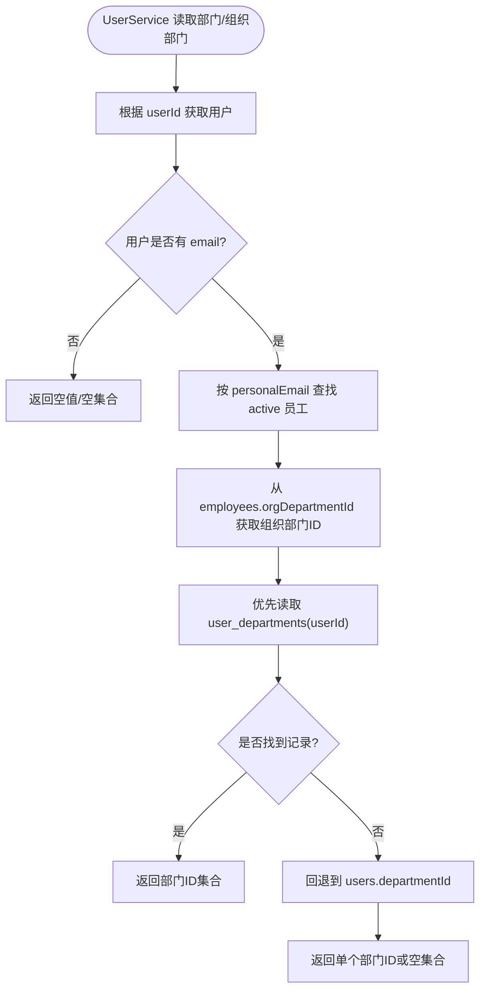
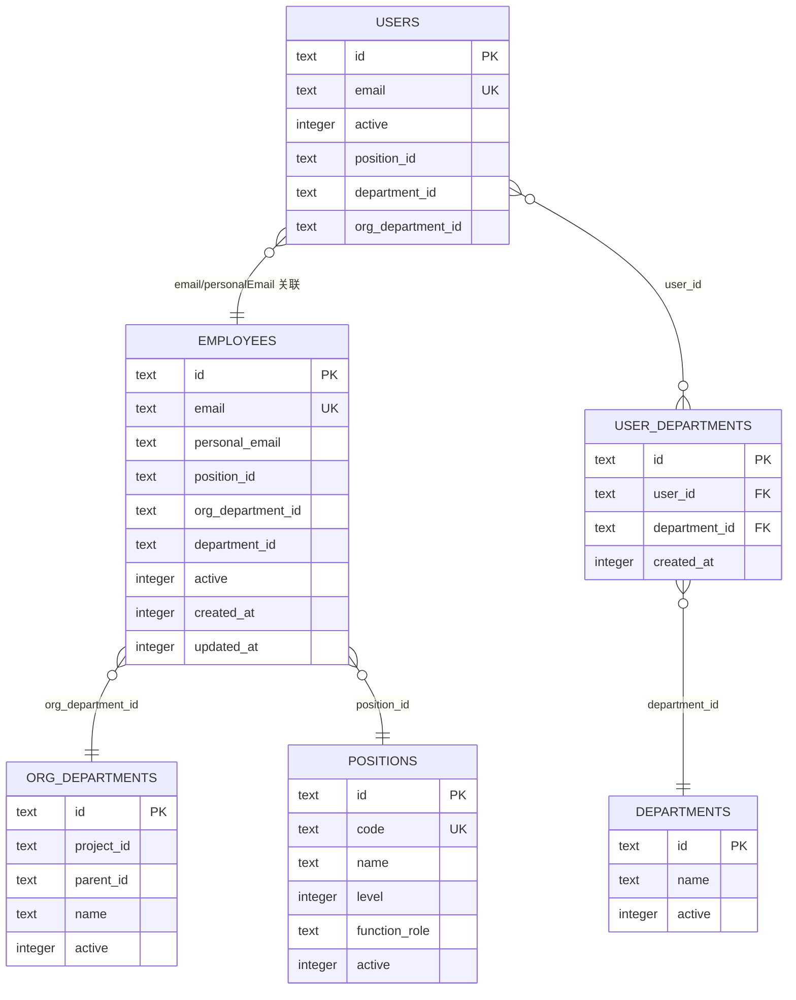
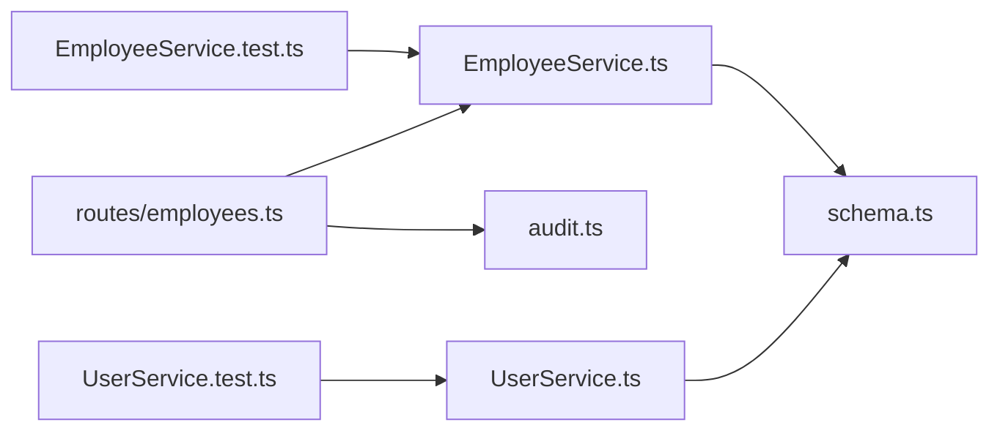

# 用户与员工数据同步

<cite>
**本文引用的文件**
- [EmployeeService.ts](file://backend/src/services/EmployeeService.ts)
- [UserService.ts](file://backend/src/services/UserService.ts)
- [schema.ts](file://backend/src/db/schema.ts)
- [employees.ts](file://backend/src/routes/employees.ts)
- [audit.ts](file://backend/src/utils/audit.ts)
- [EmployeeService.test.ts](file://backend/test/services/EmployeeService.test.ts)
- [UserService.test.ts](file://backend/test/services/UserService.test.ts)
</cite>

## 目录
1. [简介](#简介)
2. [项目结构](#项目结构)
3. [核心组件](#核心组件)
4. [架构总览](#架构总览)
5. [详细组件分析](#详细组件分析)
6. [依赖分析](#依赖分析)
7. [性能考量](#性能考量)
8. [故障排查指南](#故障排查指南)
9. [结论](#结论)
10. [附录](#附录)

## 简介
本文件聚焦于“用户与员工数据同步”机制，围绕 EmployeeService.update 方法展开，系统性说明：
- 当员工的人事信息（部门、职位）更新时，如何自动同步到关联用户账号的权限信息；
- 在更新员工记录后，如何检查并同步 users 表中的 positionId、departmentId 和 orgDepartmentId 字段；
- user_departments 多对多关系表的维护逻辑，包括在部门变更时添加新的部门关联记录；
- 在员工离职（leave）和复职（rejoin）操作中，如何通过更新 employees 和 users 表的 active 字段来同步账号状态；
- 开发者在业务逻辑中正确处理用户-员工数据一致性的最佳实践，包括事务管理、错误处理和审计日志记录。

## 项目结构
本项目采用分层架构，后端服务位于 backend/src，数据库模式定义在 backend/src/db/schema.ts，业务服务集中在 backend/src/services，HTTP 路由集中在 backend/src/routes。用户与员工同步逻辑主要分布在 EmployeeService.ts 与 UserService.ts 中，并通过路由 employees.ts 提供对外接口。

图表来源
- [EmployeeService.ts](file://backend/src/services/EmployeeService.ts#L423-L493)
- [UserService.ts](file://backend/src/services/UserService.ts#L1-L183)
- [schema.ts](file://backend/src/db/schema.ts#L11-L124)
- [employees.ts](file://backend/src/routes/employees.ts#L207-L271)
- [audit.ts](file://backend/src/utils/audit.ts#L36-L92)

章节来源
- [EmployeeService.ts](file://backend/src/services/EmployeeService.ts#L423-L493)
- [UserService.ts](file://backend/src/services/UserService.ts#L1-L183)
- [schema.ts](file://backend/src/db/schema.ts#L11-L124)
- [employees.ts](file://backend/src/routes/employees.ts#L207-L271)

## 核心组件
- EmployeeService.update：负责员工信息更新与用户账号同步，事务内执行，确保一致性。
- EmployeeService.leave / rejoin：负责员工状态变更与用户账号启用/禁用。
- UserService：负责从用户视角查询员工的职位、组织部门、部门集合等，读取 user_departments 与 employees 的权威数据。
- 路由 employees.ts：对外暴露更新、离职、复职等接口，并记录审计日志。
- 数据库 schema.ts：定义 users、employees、user_departments、departments、org_departments、positions 等表结构。

章节来源
- [EmployeeService.ts](file://backend/src/services/EmployeeService.ts#L423-L546)
- [UserService.ts](file://backend/src/services/UserService.ts#L1-L183)
- [employees.ts](file://backend/src/routes/employees.ts#L207-L377)
- [schema.ts](file://backend/src/db/schema.ts#L11-L124)

## 架构总览
用户与员工数据同步的关键路径如下：
- 更新员工信息时，若涉及部门、组织部门或职位字段，则在事务内同步更新 users 表对应字段；
- 若部门发生变更，检查 user_departments 是否已存在该关联，不存在则插入一条新记录；
- 离职时，将 employees.status 设为“resigned”，employees.active 设为 0，并同时禁用用户账号；
- 复职时，将 employees.status 设为“probation”，employees.active 设为 1，并启用用户账号；
- 路由层在每次关键操作后记录审计日志，便于追踪。

图表来源
- [employees.ts](file://backend/src/routes/employees.ts#L207-L271)
- [EmployeeService.ts](file://backend/src/services/EmployeeService.ts#L448-L493)

## 详细组件分析

### EmployeeService.update 同步逻辑
- 事务管理：使用数据库事务包裹员工更新与用户同步，保证原子性。
- 条件同步：仅当 data 中包含 departmentId、orgDepartmentId 或 positionId 时，才同步 users 表。
- 字段映射：将 data 中的部门、组织部门、职位映射到 users 表的对应字段。
- 多对多关系维护：当 departmentId 变更时，检查 user_departments 是否已存在该关联；若不存在则插入一条新记录。
- 返回值：返回更新后的员工 id，供上层使用。

图表来源
- [EmployeeService.ts](file://backend/src/services/EmployeeService.ts#L448-L493)

章节来源
- [EmployeeService.ts](file://backend/src/services/EmployeeService.ts#L448-L493)

### 离职与复职操作
- 离职（leave）：将 employees.status 设为“resigned”，employees.active 设为 0，并同时禁用用户账号（users.active=0）。
- 复职（rejoin）：将 employees.status 设为“probation”，employees.active 设为 1，并启用用户账号（users.active=1）。
- 路由层在每次操作后记录审计日志，便于审计追踪。

图表来源
- [employees.ts](file://backend/src/routes/employees.ts#L334-L377)
- [EmployeeService.ts](file://backend/src/services/EmployeeService.ts#L510-L546)

章节来源
- [EmployeeService.ts](file://backend/src/services/EmployeeService.ts#L510-L546)
- [employees.ts](file://backend/src/routes/employees.ts#L334-L377)

### UserService 读取一致性保障
- 从 employees 表读取 orgDepartmentId 作为权威来源，避免用户表字段过期导致权限判断错误。
- 优先读取 user_departments 多对多表，若不存在则回退到用户表的旧字段 departmentId。
- 通过 personalEmail 与 employees.personalEmail 关联，确保只匹配有效员工。

图表来源
- [UserService.ts](file://backend/src/services/UserService.ts#L137-L182)

章节来源
- [UserService.ts](file://backend/src/services/UserService.ts#L137-L182)

### 数据模型与关系
users、employees、user_departments、departments、org_departments、positions 的核心字段与关系如下：

图表来源
- [schema.ts](file://backend/src/db/schema.ts#L11-L124)

章节来源
- [schema.ts](file://backend/src/db/schema.ts#L11-L124)

## 依赖分析
- EmployeeService 依赖 schema.ts 中的表定义，以及 drizzle-orm 进行数据库操作。
- UserService 依赖 schema.ts 中的表定义，用于从 user_departments 与 employees 读取权威数据。
- 路由 employees.ts 依赖 EmployeeService 并在关键操作后调用审计工具记录日志。
- 测试文件 EmployeeService.test.ts 与 UserService.test.ts 验证迁移与部门读取逻辑，间接验证同步一致性。

图表来源
- [EmployeeService.ts](file://backend/src/services/EmployeeService.ts#L1-L120)
- [UserService.ts](file://backend/src/services/UserService.ts#L1-L60)
- [employees.ts](file://backend/src/routes/employees.ts#L1-L60)
- [audit.ts](file://backend/src/utils/audit.ts#L36-L92)
- [EmployeeService.test.ts](file://backend/test/services/EmployeeService.test.ts#L1-L100)
- [UserService.test.ts](file://backend/test/services/UserService.test.ts#L1-L53)

章节来源
- [EmployeeService.ts](file://backend/src/services/EmployeeService.ts#L1-L120)
- [UserService.ts](file://backend/src/services/UserService.ts#L1-L60)
- [employees.ts](file://backend/src/routes/employees.ts#L1-L60)
- [audit.ts](file://backend/src/utils/audit.ts#L36-L92)
- [EmployeeService.test.ts](file://backend/test/services/EmployeeService.test.ts#L1-L100)
- [UserService.test.ts](file://backend/test/services/UserService.test.ts#L1-L53)

## 性能考量
- 事务范围：EmployeeService.update 使用事务包裹员工更新与用户同步，减少多次往返数据库带来的锁竞争与不一致风险。
- 查询优化：在部门变更时，先查询 user_departments 是否已存在该关联，避免重复插入；同时仅在 departmentId 变化时进行额外查询与插入。
- 读取优化：UserService 优先从 user_departments 读取部门集合，若不存在则回退到旧字段，兼顾历史兼容性与性能。
- 审计日志：审计写入采用异步等待（waitUntil），避免阻塞主流程，提升接口响应速度。

[本节为通用指导，无需具体文件分析]

## 故障排查指南
- 同步未生效
  - 检查调用 EmployeeService.update 时是否传入了 departmentId、orgDepartmentId 或 positionId。
  - 确认 employees.email 与 users.email 的关联是否正确，且 employees 为有效员工（active=1）。
  - 若部门变更未写入 user_departments，请确认是否存在并发插入冲突或重复键约束。
- 离职/复职无效
  - 确认 employees 表中存在对应的员工记录，且 employees.email 存在。
  - 检查 users 表中是否存在与 employees.email 对应的用户记录。
- 审计日志缺失
  - 确认路由层在相应操作后调用了审计记录函数，并检查执行上下文是否支持 waitUntil。
- 测试验证
  - 使用测试用例验证迁移与部门读取逻辑，确保 user_departments 与 users/employees 的一致性。

章节来源
- [EmployeeService.ts](file://backend/src/services/EmployeeService.ts#L448-L493)
- [EmployeeService.ts](file://backend/src/services/EmployeeService.ts#L510-L546)
- [UserService.ts](file://backend/src/services/UserService.ts#L137-L182)
- [audit.ts](file://backend/src/utils/audit.ts#L61-L92)
- [EmployeeService.test.ts](file://backend/test/services/EmployeeService.test.ts#L39-L98)
- [UserService.test.ts](file://backend/test/services/UserService.test.ts#L38-L52)

## 结论
- EmployeeService.update 通过事务确保员工与用户数据的一致性，仅在必要字段变更时同步 users 表，并维护 user_departments 多对多关系。
- 离职与复职操作通过统一更新 employees 与 users 的 active 字段实现账号状态同步。
- UserService 以 employees 为权威来源读取组织部门与部门集合，兼顾 user_departments 新表与旧字段的兼容。
- 路由层在关键操作后记录审计日志，便于问题定位与合规审计。

[本节为总结，无需具体文件分析]

## 附录

### 最佳实践清单
- 事务管理
  - 所有涉及 employees 与 users 的联合更新必须在事务内执行，确保原子性。
- 错误处理
  - 在事务中捕获异常并回滚，避免部分更新导致的数据不一致。
- 审计日志
  - 在每次关键操作（更新、离职、复职）后记录审计日志，保留操作人、实体、详情与 IP 信息。
- 兼容性
  - 读取组织部门与部门集合时优先使用 user_departments，不存在时回退到 users.dept 字段。
- 字段一致性
  - 严格以 employees 为准更新 users 的 positionId、departmentId、orgDepartmentId，避免用户表字段过期。

[本节为通用指导，无需具体文件分析]