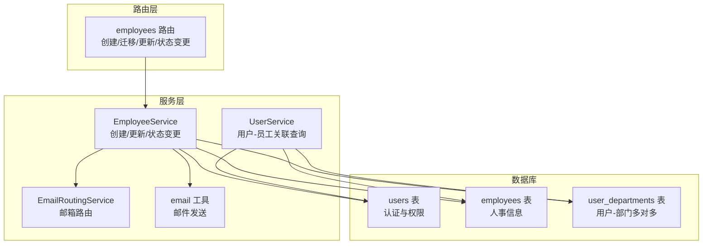
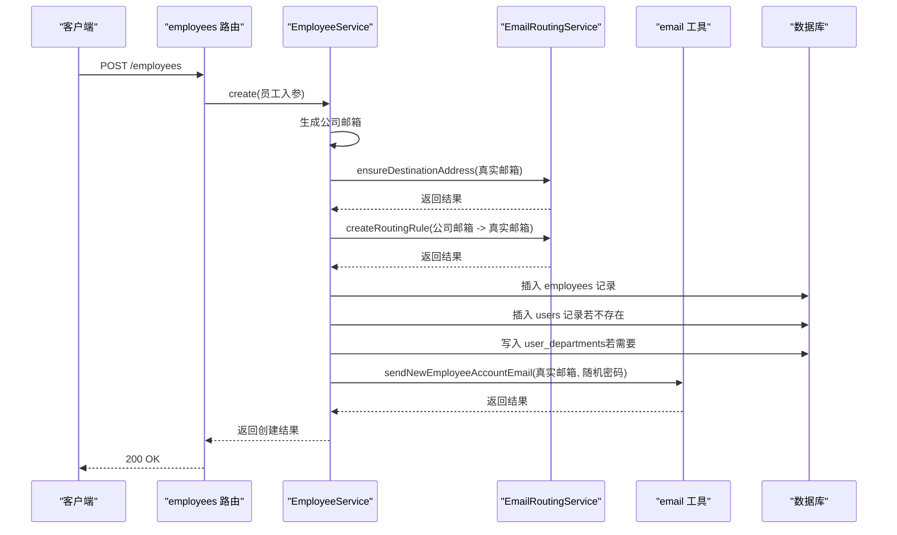
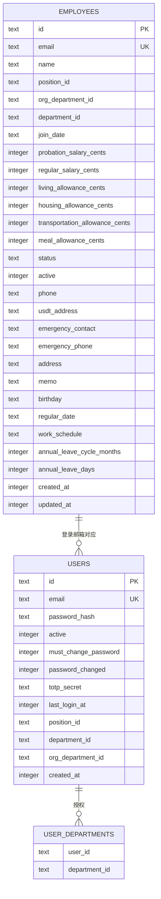
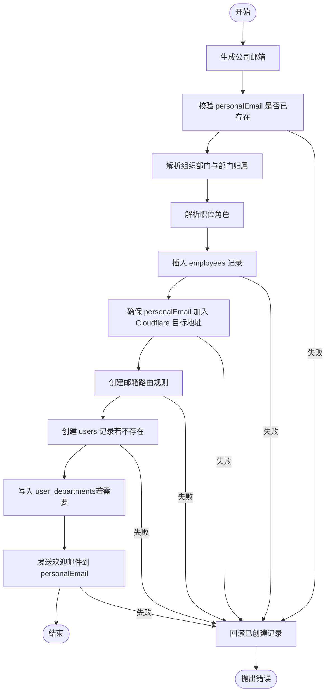
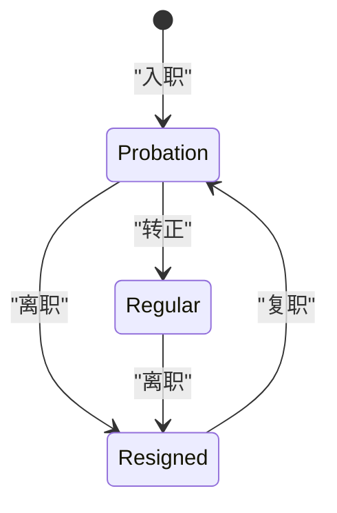
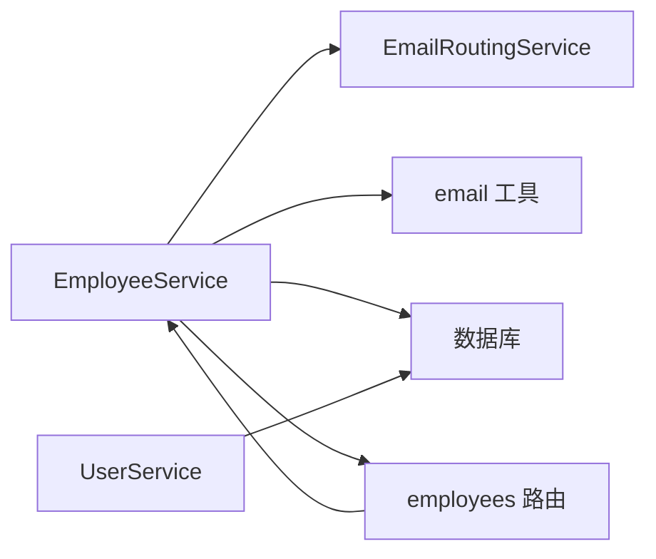

# 用户与员工模型

<cite>
**本文引用的文件**
- [schema.ts](file://backend/src/db/schema.ts)
- [schema.sql](file://backend/src/db/schema.sql)
- [EmployeeService.ts](file://backend/src/services/EmployeeService.ts)
- [UserService.ts](file://backend/src/services/UserService.ts)
- [employees.ts](file://backend/src/routes/employees.ts)
- [employee.schema.ts](file://backend/src/schemas/employee.schema.ts)
- [EmailRoutingService.ts](file://backend/src/services/EmailRoutingService.ts)
- [email.ts](file://backend/src/utils/email.ts)
</cite>

## 目录
1. [简介](#简介)
2. [项目结构](#项目结构)
3. [核心组件](#核心组件)
4. [架构总览](#架构总览)
5. [详细组件分析](#详细组件分析)
6. [依赖关系分析](#依赖关系分析)
7. [性能考量](#性能考量)
8. [故障排查指南](#故障排查指南)
9. [结论](#结论)
10. [附录](#附录)

## 简介
本文件面向开发者，系统性阐述“用户与员工分离模型”的设计与实现。该模型将认证与人事信息解耦：users 表专注认证与权限，employees 表承载业务核心的人事信息。通过 EmployeeService.create 方法，系统在创建员工时同步完成用户账号创建、邮箱路由规则生成与欢迎邮件发送，形成闭环流程。本文将深入解析表结构、字段语义、服务层实现与最佳实践，帮助读者在开发中正确处理用户-员工关联关系、数据查询、状态同步与权限继承。

## 项目结构
围绕用户与员工分离模型的关键文件与职责如下：
- 数据库模式
  - schema.ts：以 Drizzle ORM 方式定义 users 与 employees 表及关联表
  - schema.sql：SQLite 原生建表脚本，体现字段约束与索引
- 服务层
  - EmployeeService.ts：员工生命周期管理，含创建、更新、入职转正、离职/复职、权限继承等
  - UserService.ts：基于 users 表的认证与权限查询，支持从用户推导员工信息
  - EmailRoutingService.ts：Cloudflare Email Routing 集成，负责公司邮箱生成与路由规则维护
  - email.ts：邮件发送工具，封装欢迎邮件、密码重置邮件等
- 路由层
  - employees.ts：对外暴露创建员工、迁移用户为员工、更新员工、状态变更等接口
- 校验层
  - employee.schema.ts：OpenAPI Schema，约束创建/更新/查询参数

图表来源
- [schema.ts](file://backend/src/db/schema.ts#L1-L124)
- [EmployeeService.ts](file://backend/src/services/EmployeeService.ts#L1-L249)
- [UserService.ts](file://backend/src/services/UserService.ts#L1-L183)
- [EmailRoutingService.ts](file://backend/src/services/EmailRoutingService.ts#L1-L248)
- [email.ts](file://backend/src/utils/email.ts#L101-L140)
- [employees.ts](file://backend/src/routes/employees.ts#L93-L161)

章节来源
- [schema.ts](file://backend/src/db/schema.ts#L1-L124)
- [schema.sql](file://backend/src/db/schema.sql#L1-L49)
- [employees.ts](file://backend/src/routes/employees.ts#L93-L161)

## 核心组件
- users 表（认证与权限）
  - 关键字段：id、email（唯一）、passwordHash、active、mustChangePassword、passwordChanged、totpSecret、lastLoginAt、positionId、departmentId、orgDepartmentId、createdAt
  - 设计要点：将 name 从 users 中移出，统一存储在 employees，实现“认证信息”与“业务信息”的分离
- employees 表（业务核心）
  - 关键字段：id、email（唯一）、name、positionId、orgDepartmentId、departmentId、joinDate、status、active、phone、usdtAddress、emergencyContact、emergencyPhone、address、memo、birthday、regularDate、workSchedule、annualLeaveCycleMonths、annualLeaveDays、createdAt、updatedAt
  - 设计要点：集中存储员工的人事信息、薪资与补贴、考勤排班、年假周期与天数等
- user_departments 表（用户-部门多对多）
  - 设计要点：支持用户跨部门授权，提升权限控制灵活性

章节来源
- [schema.ts](file://backend/src/db/schema.ts#L1-L124)
- [schema.sql](file://backend/src/db/schema.sql#L1-L49)

## 架构总览
用户与员工分离的核心在于“以员工为中心”的业务数据与“以用户为中心”的认证数据之间的桥接。EmployeeService 在创建员工时，同时完成：
- 公司邮箱生成与 Cloudflare 邮件路由规则创建
- 用户账号创建（使用员工真实邮箱作为登录邮箱）
- 欢迎邮件发送
- 用户与部门、职位信息同步

图表来源
- [employees.ts](file://backend/src/routes/employees.ts#L118-L161)
- [EmployeeService.ts](file://backend/src/services/EmployeeService.ts#L12-L249)
- [EmailRoutingService.ts](file://backend/src/services/EmailRoutingService.ts#L78-L162)
- [email.ts](file://backend/src/utils/email.ts#L216-L273)

## 详细组件分析

### users 表与 employees 表的关系
- 关联方式
  - 认证登录邮箱：users.email 通常与员工的真实邮箱一致（创建时可选择使用真实邮箱作为登录邮箱）
  - 业务主邮箱：employees.email 为系统生成的公司邮箱（@cloudflarets.com），用于对外沟通与路由转发
  - 一对一映射：通过 employees.personalEmail 与 users.email 的一致性，建立用户与员工的强关联
- 查询与权限
  - UserService 通过 users.email 与 employees.personalEmail 的匹配，推导用户的职位、部门、组织部门与权限
  - 通过 user_departments 实现用户对多个部门的授权

图表来源
- [schema.ts](file://backend/src/db/schema.ts#L1-L124)
- [schema.sql](file://backend/src/db/schema.sql#L1-L49)

章节来源
- [UserService.ts](file://backend/src/services/UserService.ts#L1-L183)
- [schema.ts](file://backend/src/db/schema.ts#L1-L124)

### EmployeeService.create 流程详解
- 输入参数
  - 必填：name、personalEmail、orgDepartmentId、positionId、joinDate
  - 可选：departmentId、phone、usdtAddress、address、emergencyContact、emergencyPhone、memo、workSchedule、annualLeaveCycleMonths、annualLeaveDays
- 关键步骤
  1) 生成公司邮箱：基于员工姓名生成唯一 @cloudflarets.com 邮箱，避免重复
  2) 校验真实邮箱：确保 personalEmail 在 employees 中未被占用
  3) 解析组织部门与部门归属：根据 orgDepartmentId 推导实际 departmentId；若无则回退到“总部”
  4) 解析职位角色：读取 positions.functionRole 作为用户角色标识
  5) 创建员工记录：写入 employees，设置状态为 probation，初始化薪资与补贴为 0
  6) 创建邮箱路由：将公司邮箱转发到 personalEmail；必要时先确保 personalEmail 已加入 Cloudflare 目标地址
  7) 创建用户账号：若 users 中不存在以 personalEmail 为 email 的用户，则创建用户记录，设置 mustChangePassword=1，同步 positionId、departmentId、orgDepartmentId
  8) 写入用户-部门关联：若 departmentId 存在，写入 user_departments
  9) 发送欢迎邮件：通过 email 工具向 personalEmail 发送欢迎邮件，包含登录地址与随机密码
  10) 错误回滚：若任一步骤失败，按逆序删除已创建的 records 并抛出异常

图表来源
- [EmployeeService.ts](file://backend/src/services/EmployeeService.ts#L12-L249)
- [EmailRoutingService.ts](file://backend/src/services/EmailRoutingService.ts#L78-L162)
- [email.ts](file://backend/src/utils/email.ts#L216-L273)

章节来源
- [EmployeeService.ts](file://backend/src/services/EmployeeService.ts#L12-L249)

### 员工状态变更与用户状态同步
- 离职（leave）：将 employees.status 设为 resigned、active=0，并禁用 users.active
- 复职（rejoin）：将 employees.status 设为 probation、active=1，并启用 users.active
- 迁移（migrateFromUser）：将现有 users 记录转换为 employees，并同步职位、部门、组织部门信息

图表来源
- [EmployeeService.ts](file://backend/src/services/EmployeeService.ts#L497-L546)

章节来源
- [EmployeeService.ts](file://backend/src/services/EmployeeService.ts#L497-L546)

### 权限继承与查询
- 用户职位与权限
  - UserService 通过 users.email 与 employees.personalEmail 的匹配，关联 users、employees、positions，读取 functionRole、permissions 等
  - 通过 user_departments 与 departments，支持用户对多个部门的授权
- 组织层级与下级范围
  - 通过 positions.level 与 employees.departmentId/orgDepartmentId，计算当前用户的下级员工集合

章节来源
- [UserService.ts](file://backend/src/services/UserService.ts#L41-L183)

## 依赖关系分析
- 组件耦合
  - EmployeeService 依赖 EmailRoutingService 与 email 工具，用于邮箱路由与邮件发送
  - UserService 依赖 users、employees、positions、user_departments、departments，用于用户-员工关联与权限查询
- 外部依赖
  - Cloudflare Email Routing API：用于创建/删除路由规则与目标地址
  - Cloudflare Worker（EMAIL_SERVICE）：用于异步发送邮件

图表来源
- [EmployeeService.ts](file://backend/src/services/EmployeeService.ts#L1-L249)
- [UserService.ts](file://backend/src/services/UserService.ts#L1-L183)
- [EmailRoutingService.ts](file://backend/src/services/EmailRoutingService.ts#L1-L248)
- [email.ts](file://backend/src/utils/email.ts#L101-L140)
- [employees.ts](file://backend/src/routes/employees.ts#L93-L161)

## 性能考量
- 索引建议
  - users(email)：加速登录与用户查询
  - employees(department_id)、employees(org_department_id)、employees(active)：加速员工列表与筛选
  - org_departments(parent_id)、org_departments(project_id)：加速组织树查询
  - user_departments(department_id)：加速用户多部门授权查询
- 查询优化
  - 使用左连接与条件过滤，避免 N+1 查询
  - 对高频查询字段（如 joinDate、status、active）建立索引
- 异步任务
  - 邮件发送通过 EMAIL_SERVICE Worker 异步执行，降低请求延迟

章节来源
- [schema.sql](file://backend/src/db/schema.sql#L297-L314)

## 故障排查指南
- 邮件发送失败
  - 检查 EMAIL_SERVICE 与 EMAIL_TOKEN 是否配置
  - 查看 email 工具返回的错误信息与状态码
- 邮箱路由创建失败
  - 检查 CF_ACCOUNT_ID、CF_ZONE_ID、CF_API_TOKEN 是否正确
  - 确认 personalEmail 已加入 Cloudflare 目标地址
- 用户账号创建失败
  - 检查 personalEmail 是否已被占用
  - 确认 positions 与 orgDepartments 的存在性
- 状态同步问题
  - 离职/复职后检查 users.active 是否同步更新
  - 核对 employees.email 与 users.email 的一致性

章节来源
- [email.ts](file://backend/src/utils/email.ts#L101-L140)
- [EmailRoutingService.ts](file://backend/src/services/EmailRoutingService.ts#L78-L162)
- [EmployeeService.ts](file://backend/src/services/EmployeeService.ts#L497-L546)

## 结论
用户与员工分离模型通过 users 与 employees 的清晰分工，实现了认证与业务信息的解耦。EmployeeService.create 将“创建员工”、“创建用户”、“生成邮箱路由”、“发送欢迎邮件”整合为一个原子流程，既保证了用户体验，也便于审计与回滚。配合 UserService 的权限查询与组织层级计算，系统在权限继承与数据一致性方面具备良好扩展性。

## 附录

### 最佳实践清单
- 数据查询
  - 优先使用 employees.email 作为业务主邮箱，users.email 作为登录邮箱
  - 查询用户权限时，通过 users.email 与 employees.personalEmail 做内连接
- 状态同步
  - 员工状态变更（离职/复职）必须同步更新 users.active
  - 更新员工部门/职位时，同步更新 users 中的对应字段与 user_departments
- 权限继承
  - 通过 positions.level 与 employees.departmentId/orgDepartmentId 计算下级范围
  - 使用 user_departments 支持用户跨部门授权
- 邮件与路由
  - 创建员工时务必确保 personalEmail 已加入 Cloudflare 目标地址
  - 邮件发送失败时记录错误日志并重试或回滚

章节来源
- [EmployeeService.ts](file://backend/src/services/EmployeeService.ts#L423-L493)
- [UserService.ts](file://backend/src/services/UserService.ts#L1-L183)
- [EmailRoutingService.ts](file://backend/src/services/EmailRoutingService.ts#L78-L162)
- [email.ts](file://backend/src/utils/email.ts#L216-L273)