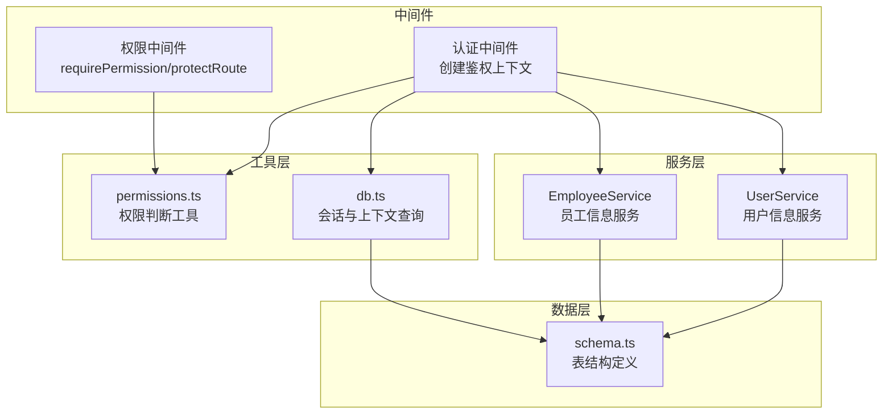
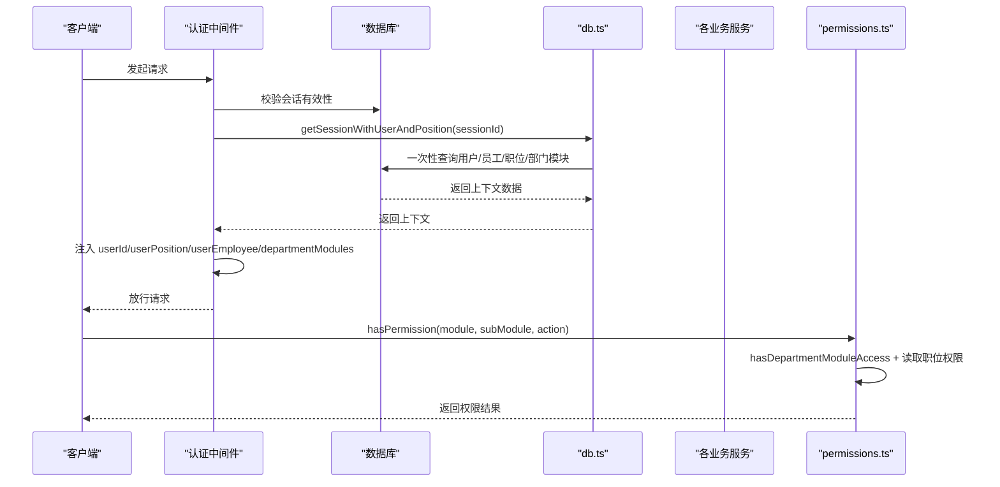
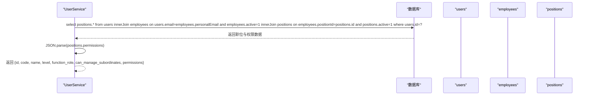
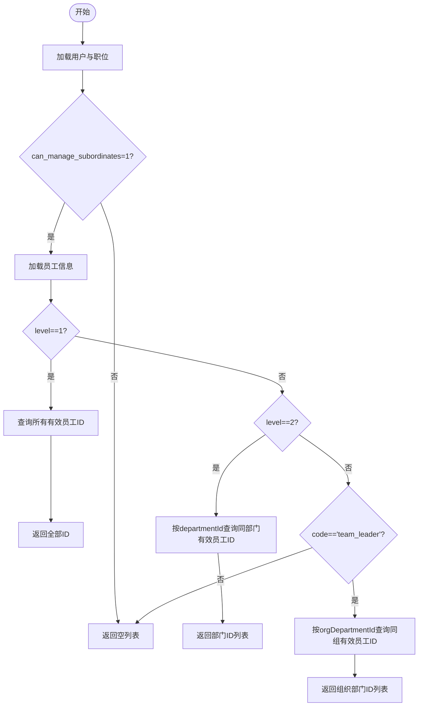
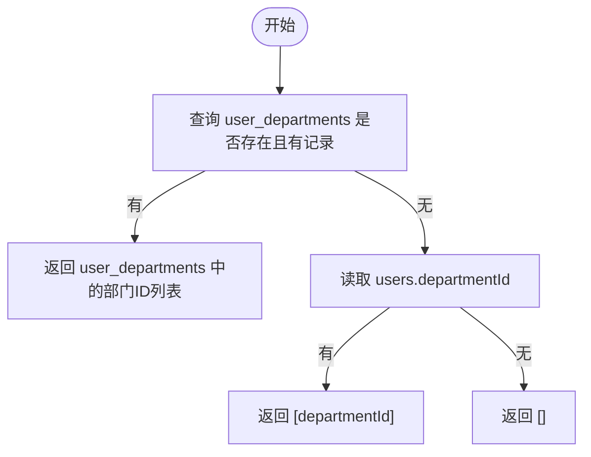
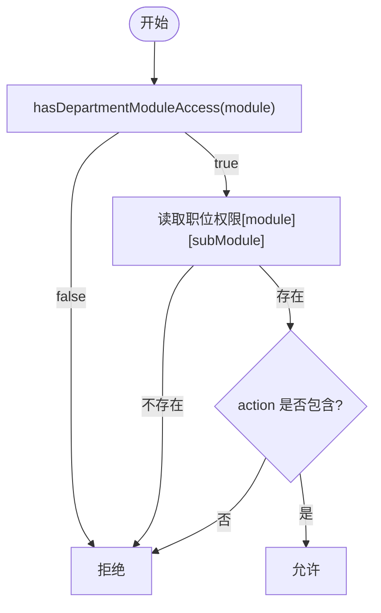
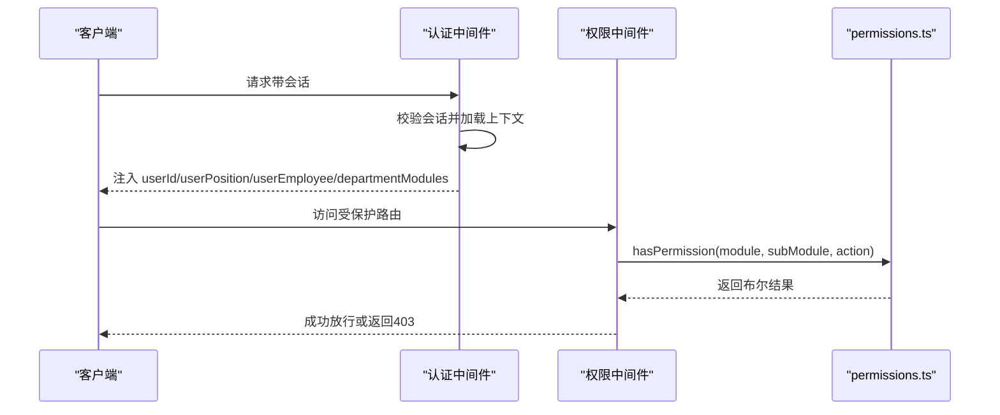
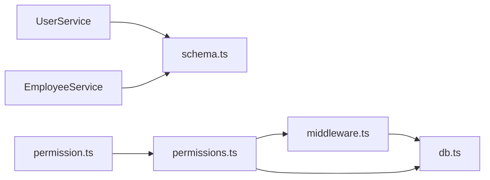

# 用户权限继承机制

<cite>
**本文引用的文件**
- [UserService.ts](file://backend/src/services/UserService.ts)
- [schema.ts](file://backend/src/db/schema.ts)
- [middleware.ts](file://backend/src/middleware.ts)
- [permissions.ts](file://backend/src/utils/permissions.ts)
- [db.ts](file://backend/src/utils/db.ts)
- [EmployeeService.ts](file://backend/src/services/EmployeeService.ts)
- [permission.ts](file://backend/src/middleware/permission.ts)
- [AuthService.ts](file://backend/src/routes/auth.ts)
</cite>

## 目录
1. [引言](#引言)
2. [项目结构](#项目结构)
3. [核心组件](#核心组件)
4. [架构总览](#架构总览)
5. [详细组件分析](#详细组件分析)
6. [依赖关系分析](#依赖关系分析)
7. [性能考量](#性能考量)
8. [故障排查指南](#故障排查指南)
9. [结论](#结论)
10. [附录](#附录)

## 引言
本文件系统化解析系统的用户权限继承机制，重点围绕以下目标展开：
- 说明 UserService.getUserPosition 如何通过员工记录获取用户的真实职位与权限，强调必须基于 employees 表（使用 personalEmail 匹配）而非 users 表中的 positionId，以确保权限分配的准确性与安全性。
- 解释 RBAC 系统中“职位权限”与“员工归属”的分离设计，以及为何必须通过员工记录来确定 function_role 和权限配置。
- 详解 getSubordinateEmployeeIds 方法如何依据用户职位级别（HQ、项目经理、组长）确定其可管理的下属员工范围。
- 说明 isHQUser 与 getUserDepartmentIds 等方法如何处理新旧数据模型的兼容性问题。
- 提供在中间件与业务逻辑中正确获取与验证用户权限的最佳实践。

## 项目结构
后端采用分层架构：
- 中间件层负责鉴权与权限预加载，将用户、员工、职位、部门模块等上下文注入到请求上下文中。
- 服务层封装业务逻辑，如用户、员工、审批等。
- 工具层提供通用权限判断、SQL 查询优化与上下文构建。
- 数据层定义表结构与关系，支撑权限继承与数据访问控制。

图表来源
- [middleware.ts](file://backend/src/middleware.ts#L1-L82)
- [permission.ts](file://backend/src/middleware/permission.ts#L1-L39)
- [permissions.ts](file://backend/src/utils/permissions.ts#L1-L330)
- [db.ts](file://backend/src/utils/db.ts#L1-L222)
- [UserService.ts](file://backend/src/services/UserService.ts#L1-L183)
- [EmployeeService.ts](file://backend/src/services/EmployeeService.ts#L547-L593)
- [schema.ts](file://backend/src/db/schema.ts#L11-L124)

章节来源
- [middleware.ts](file://backend/src/middleware.ts#L1-L82)
- [permission.ts](file://backend/src/middleware/permission.ts#L1-L39)
- [permissions.ts](file://backend/src/utils/permissions.ts#L1-L330)
- [db.ts](file://backend/src/utils/db.ts#L1-L222)
- [UserService.ts](file://backend/src/services/UserService.ts#L1-L183)
- [EmployeeService.ts](file://backend/src/services/EmployeeService.ts#L547-L593)
- [schema.ts](file://backend/src/db/schema.ts#L11-L124)

## 核心组件
- 用户信息服务（UserService）：提供用户基本信息、员工映射、职位信息、部门与组织部门信息、总部判定等能力。
- 员工信息服务（EmployeeService）：提供下属员工 ID 列表、员工维度的权限与访问范围判断。
- 权限工具（permissions.ts）：提供 hasPermission、hasDepartmentModuleAccess、getDataAccessFilter 等权限判断与数据访问过滤能力。
- 会话与上下文（db.ts）：一次性加载用户、员工、职位、部门模块等上下文，减少重复查询。
- 认证中间件（middleware.ts）：从会话中解析用户身份，并将用户位置、员工、职位、部门模块写入上下文。
- 权限中间件（permission.ts）：在路由层快速校验模块/子模块/动作权限。

章节来源
- [UserService.ts](file://backend/src/services/UserService.ts#L1-L183)
- [EmployeeService.ts](file://backend/src/services/EmployeeService.ts#L547-L593)
- [permissions.ts](file://backend/src/utils/permissions.ts#L1-L330)
- [db.ts](file://backend/src/utils/db.ts#L115-L222)
- [middleware.ts](file://backend/src/middleware.ts#L1-L82)
- [permission.ts](file://backend/src/middleware/permission.ts#L1-L39)

## 架构总览
系统通过“会话 + 上下文”的方式，在请求生命周期内完成用户身份与权限的预加载，避免在每个业务方法中重复查询。

图表来源
- [middleware.ts](file://backend/src/middleware.ts#L1-L82)
- [db.ts](file://backend/src/utils/db.ts#L115-L222)
- [permissions.ts](file://backend/src/utils/permissions.ts#L1-L330)

## 详细组件分析

### 用户职位与权限继承：UserService.getUserPosition
- 设计要点
  - 通过 users.email 与 employees.personalEmail 进行关联，确保使用“个人邮箱”作为权威匹配键，避免 users.positionId 可能存在的过期或不一致。
  - 仅连接有效的员工与职位记录，保证权限来源真实有效。
  - 将职位的 permissions 字段解析为对象，供上层直接使用。
- 关键路径
  - 从 users -> employees(personalEmail) -> positions(positionId)，最终返回 id、code、name、level、function_role、can_manage_subordinates、permissions。
- 安全性与准确性
  - 优先从员工记录获取职位，而非 users.positionId，防止历史数据不一致导致的权限误判。
  - 对 permissions 的 JSON 解析进行容错处理，避免异常中断。

图表来源
- [UserService.ts](file://backend/src/services/UserService.ts#L41-L81)
- [schema.ts](file://backend/src/db/schema.ts#L11-L124)

章节来源
- [UserService.ts](file://backend/src/services/UserService.ts#L41-L81)
- [schema.ts](file://backend/src/db/schema.ts#L11-L124)

### 下属员工范围：EmployeeService.getSubordinateEmployeeIds
- 设计要点
  - 依据用户职位的 level 与 code，结合员工的 departmentId/orgDepartmentId，限定可管理范围：
    - level=1（总部）：所有有效员工。
    - level=2（项目经理）：同部门的有效员工。
    - code='team_leader'（组长）：同组织部门的有效员工。
  - 仅当职位具备 can_manage_subordinates 才允许管理。
- 处理流程

图表来源
- [EmployeeService.ts](file://backend/src/services/EmployeeService.ts#L547-L593)

章节来源
- [EmployeeService.ts](file://backend/src/services/EmployeeService.ts#L547-L593)

### 总部判定与部门兼容性：isHQUser 与 getUserDepartmentIds
- isHQUser
  - 优先检查 user_departments 与 departments 的关联，判断用户是否属于“总部”部门。
  - 若新表不存在或无记录，则回退到 users.departmentId 字段，再查 departments.name 是否为“总部”，以兼容旧数据模型。
- getUserDepartmentIds
  - 优先读取 user_departments 多部门关联表，返回用户所属的所有部门 ID。
  - 若表不存在则回退到 users.departmentId，兼容旧模型；若无旧字段则返回空数组。
- 设计意义
  - 在迁移期间保证功能可用，避免因表缺失或字段缺失导致权限判断失败。

图表来源
- [UserService.ts](file://backend/src/services/UserService.ts#L153-L176)
- [UserService.ts](file://backend/src/services/UserService.ts#L83-L108)

章节来源
- [UserService.ts](file://backend/src/services/UserService.ts#L83-L108)
- [UserService.ts](file://backend/src/services/UserService.ts#L153-L176)

### 组织部门与组级权限：getUserGroupId 与 getUserOrgDepartmentId
- getUserOrgDepartmentId
  - 从 employees.orgDepartmentId 获取用户所在组织部门 ID，强调必须来自员工记录，确保权威性。
- getUserGroupId
  - 通过 orgDepartments.parentId 是否为空判断某组织部门是否为“组”（即存在父部门），从而识别用户所在组的组 ID。

章节来源
- [UserService.ts](file://backend/src/services/UserService.ts#L137-L151)
- [UserService.ts](file://backend/src/services/UserService.ts#L110-L136)

### 权限判断与数据访问控制：permissions.ts
- hasPermission
  - 先检查部门模块访问权限（总部人员跳过），再检查职位对具体模块/子模块/动作的权限。
- hasDepartmentModuleAccess
  - 总部人员默认允许访问；非总部人员需满足部门 allowed_modules 的白名单规则（支持前缀匹配）。
- getDataAccessFilter
  - 根据用户职位层级生成 SQL 过滤条件：
    - level=1：可访问所有数据。
    - level=2：仅本部门数据。
    - code='team_leader'：仅本组数据。
    - 其他：仅本人数据。
- canManageSubordinates / isHeadquartersStaff / isProjectStaff / isTeamMember
  - 提供便捷的层级判断。

图表来源
- [permissions.ts](file://backend/src/utils/permissions.ts#L55-L114)

章节来源
- [permissions.ts](file://backend/src/utils/permissions.ts#L1-L330)

### 中间件与权限中间件：认证与路由保护
- 认证中间件
  - 从会话中解析用户身份，调用 getSessionWithUserAndPosition 一次性加载用户、员工、职位、部门模块信息，并写入上下文。
- 权限中间件
  - requirePermission 与 protectRoute 在路由层快速校验模块/子模块/动作权限，未通过则抛出禁止访问错误。

图表来源
- [middleware.ts](file://backend/src/middleware.ts#L1-L82)
- [permission.ts](file://backend/src/middleware/permission.ts#L1-L39)
- [permissions.ts](file://backend/src/utils/permissions.ts#L80-L114)

章节来源
- [middleware.ts](file://backend/src/middleware.ts#L1-L82)
- [permission.ts](file://backend/src/middleware/permission.ts#L1-L39)
- [permissions.ts](file://backend/src/utils/permissions.ts#L1-L330)

### 登录与上下文注入：AuthService 与中间件
- 登录成功后，服务端构建包含用户与职位信息的响应载荷，认证中间件随后将这些信息写入上下文，供后续权限判断使用。

章节来源
- [AuthService.ts](file://backend/src/routes/auth.ts#L37-L74)
- [middleware.ts](file://backend/src/middleware.ts#L48-L71)

## 依赖关系分析
- UserService 依赖 schema.ts 中的 users、employees、positions、userDepartments、departments、orgDepartments 表。
- EmployeeService 依赖 employees、departments、orgDepartments、positions、users。
- permissions.ts 依赖中间件注入的上下文（userPosition、userEmployee、departmentModules）。
- db.ts 一次性查询用户、员工、职位、部门模块，减少多次往返。
- 认证中间件依赖 db.ts 的上下文加载函数。

图表来源
- [UserService.ts](file://backend/src/services/UserService.ts#L1-L183)
- [EmployeeService.ts](file://backend/src/services/EmployeeService.ts#L547-L593)
- [permissions.ts](file://backend/src/utils/permissions.ts#L1-L330)
- [db.ts](file://backend/src/utils/db.ts#L115-L222)
- [middleware.ts](file://backend/src/middleware.ts#L1-L82)
- [permission.ts](file://backend/src/middleware/permission.ts#L1-L39)

章节来源
- [UserService.ts](file://backend/src/services/UserService.ts#L1-L183)
- [EmployeeService.ts](file://backend/src/services/EmployeeService.ts#L547-L593)
- [permissions.ts](file://backend/src/utils/permissions.ts#L1-L330)
- [db.ts](file://backend/src/utils/db.ts#L115-L222)
- [middleware.ts](file://backend/src/middleware.ts#L1-L82)
- [permission.ts](file://backend/src/middleware/permission.ts#L1-L39)

## 性能考量
- 一次性上下文加载：通过 getSessionWithUserAndPosition 在认证阶段一次性拉取用户、员工、职位、部门模块，避免后续业务方法重复查询。
- 缓存策略：认证中间件将会话数据写入 KV 缓存，提升二次请求的响应速度。
- 条件过滤：权限工具的 getDataAccessFilter 生成精确的 WHERE 条件，减少不必要的数据扫描。
- 建议
  - 在高频权限判断场景中，尽量复用已注入的上下文，避免额外查询。
  - 对部门模块白名单进行合理配置，避免过多通配符导致权限判断复杂度上升。

[本节为通用建议，无需列出具体文件来源]

## 故障排查指南
- 用户登录后无法获取职位信息
  - 检查是否存在与 users.email 匹配的 employees.personalEmail 且员工状态为有效的记录。
  - 确认 employees.positionId 对应的 positions 是否存在且 active=1。
- 权限判断总是失败
  - 确认 hasDepartmentModuleAccess 是否被总部人员绕过，或部门 allowed_modules 是否包含所需模块。
  - 检查职位 permissions 结构是否符合预期，JSON 解析是否报错。
- 下属员工列表为空
  - 确认用户职位是否具备 can_manage_subordinates。
  - 检查用户是否正确关联到部门或组织部门。
- 总部判定错误
  - 若 user_departments 表不存在，确认 users.departmentId 是否指向“总部”。

章节来源
- [UserService.ts](file://backend/src/services/UserService.ts#L41-L81)
- [permissions.ts](file://backend/src/utils/permissions.ts#L55-L114)
- [EmployeeService.ts](file://backend/src/services/EmployeeService.ts#L547-L593)
- [UserService.ts](file://backend/src/services/UserService.ts#L83-L108)

## 结论
本系统通过“员工记录 + 职位权限”的双因子设计，确保权限来源权威可靠。UserService.getUserPosition 明确要求从 employees 表匹配 personalEmail 并关联 positions，杜绝 users.positionId 的潜在不一致风险。配合认证中间件的一次性上下文加载与权限工具的模块/动作权限判断，形成高效、安全、可维护的 RBAC 权限体系。同时，isHQUser 与 getUserDepartmentIds 等方法通过新旧模型兼容策略，保障迁移过程中的连续性与稳定性。

[本节为总结性内容，无需列出具体文件来源]

## 附录

### 最佳实践清单
- 在业务逻辑中，始终通过认证中间件提供的上下文获取用户与职位信息，避免直接查询 users.positionId。
- 使用 permissions.ts 的 hasPermission 与 getDataAccessFilter 进行权限与数据访问控制，不要绕过中间件。
- 对部门 allowed_modules 与职位 permissions 进行最小权限配置，避免过度授权。
- 在迁移期间，保持对 user_departments 与 users.departmentId 的兼容判断，确保功能稳定。

[本节为通用建议，无需列出具体文件来源]