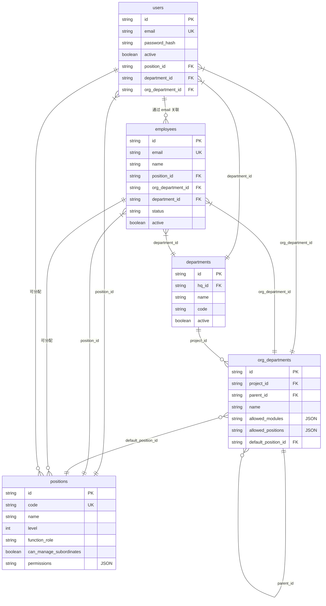
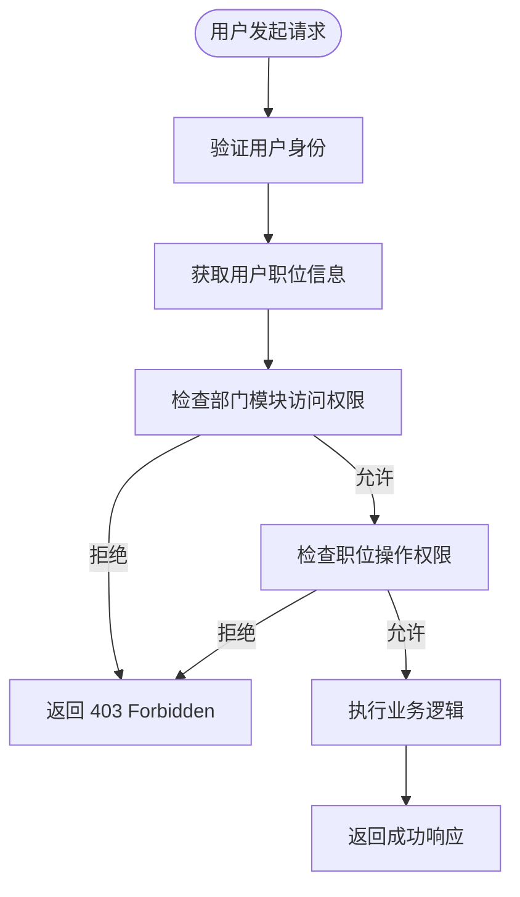
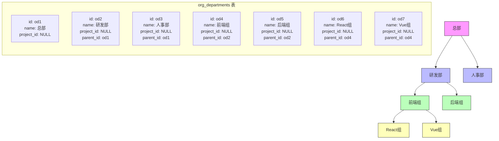

# 组织架构数据模型

<cite>
**本文档引用的文件**
- [schema.sql](file://backend/src/db/schema.sql)
- [migration_remove_users_name.sql](file://backend/src/db/archive/migration_remove_users_name.sql)
- [migration_unify_positions.sql](file://backend/src/db/archive/migration_unify_positions.sql)
- [migration_dept_positions.sql](file://backend/src/db/archive/migration_dept_positions.sql)
- [org-departments.ts](file://backend/src/routes/master-data/org-departments.ts)
- [positions.ts](file://backend/src/routes/master-data/positions.ts)
- [PositionService.ts](file://backend/src/services/PositionService.ts)
- [MasterDataService.ts](file://backend/src/services/MasterDataService.ts)
- [master-data.schema.ts](file://backend/src/schemas/master-data.schema.ts)
- [permissions.ts](file://backend/src/utils/permissions.ts)
</cite>

## 目录
1. [简介](#简介)
2. [核心表结构与关系](#核心表结构与关系)
3. [用户与员工分离设计](#用户与员工分离设计)
4. [职位体系与权限控制](#职位体系与权限控制)
5. [部门与组织部门树形结构](#部门与组织部门树形结构)
6. [数据模型演进](#数据模型演进)
7. [查询最佳实践](#查询最佳实践)

## 简介
本文档详细阐述了财务系统中组织架构数据模型的设计与实现。该模型以`users`（用户）、`employees`（员工）、`positions`（职位）、`departments`（项目/部门）和`org_departments`（组织部门）等核心表为基础，构建了一个灵活、可扩展的组织管理框架。文档将深入解析各表的结构、相互关系，以及支撑系统权限控制和数据访问隔离的关键设计模式。

## 核心表结构与关系

**图表来源**
- [schema.sql](file://backend/src/db/schema.sql#L4-L93)

**本节来源**
- [schema.sql](file://backend/src/db/schema.sql#L4-L93)

## 用户与员工分离设计

该系统采用了“用户”与“员工”分离的设计模式，将系统认证信息与业务核心信息解耦。

- **`users` 表**：专注于系统认证和会话管理。它存储了`email`、`password_hash`、`active`状态以及与认证相关的`position_id`、`department_id`等字段。此表不包含员工的姓名等业务信息。
- **`employees` 表**：作为业务核心，包含了员工的全部信息，如`name`、`join_date`、`salary`、`status`、联系方式等。所有与人事、薪酬、考勤相关的业务逻辑都围绕此表展开。

这种设计模式的优势在于：
1.  **职责分离**：认证逻辑与业务逻辑清晰分离，提高了代码的可维护性。
2.  **数据安全**：敏感的认证信息（如密码哈希）与业务信息物理隔离。
3.  **灵活性**：允许一个用户账号在不同上下文中扮演不同角色（尽管当前实现中通过外键关联，但设计上为未来扩展提供了可能）。

两个表通过`email`字段进行关联，确保了用户身份与员工身份的一致性。

**本节来源**
- [schema.sql](file://backend/src/db/schema.sql#L4-L49)
- [migration_remove_users_name.sql](file://backend/src/db/archive/migration_remove_users_name.sql)

## 职位体系与权限控制

### 职位层级结构

`positions`表定义了系统的职位体系，其核心设计体现在`level`字段上，形成了一个三层的层级结构：
- **`level = 1`**：总部（Headquarters）职位，如`hq_manager`（总部主管），拥有跨项目的全局管理权限。
- **`level = 2`**：项目（Project）职位，如`project_manager`（项目主管），负责管理单个项目的团队和事务。
- **`level = 3`**：组（Team）职位，如`team_leader`（组长）和`team_engineer`（工程师），用于管理项目内的研发小组。

这种层级结构清晰地划分了管理范围，是实现数据访问控制的基础。

### 功能角色与权限机制

`positions`表通过`function_role`和`permissions`字段实现了精细化的权限控制。

- **`function_role`**：标识职位的职能类别，如`director`（主管）、`finance`（财务）、`hr`（人事）、`developer`（开发）。此字段用于在业务逻辑中快速判断用户的角色，例如在审批流中确定审批人资格。
- **`permissions`**：一个JSON字段，存储了该职位在各个功能模块（如`finance`、`hr`、`asset`）下的具体操作权限（如`view`、`create`、`approve`）。当用户发起请求时，系统会结合`function_role`和`permissions`来判断其是否有权执行该操作。

权限验证的核心逻辑在`permissions.ts`工具文件中实现，通过`hasPermission`函数检查用户职位的权限配置。

**图表来源**
- [schema.sql](file://backend/src/db/schema.sql#L51-L65)
- [permissions.ts](file://backend/src/utils/permissions.ts#L88-L114)

**本节来源**
- [schema.sql](file://backend/src/db/schema.sql#L51-L65)
- [PositionService.ts](file://backend/src/services/PositionService.ts)
- [permissions.ts](file://backend/src/utils/permissions.ts)

## 部门与组织部门树形结构

### 概念区分

系统中存在两个关键的“部门”概念：
- **`departments`**：代表“项目”或“分公司”级别的实体。它是组织架构的顶层划分，通常与独立的财务核算单位或业务单元对应。
- **`org_departments`**：代表“组织部门”，是一个树形结构，用于在`departments`之下构建更细粒度的组织单元，如“研发部”、“财务部”、“前端组”等。

### 树形结构设计

`org_departments`表通过`parent_id`字段实现了树形结构：
- `parent_id`指向同一表中的另一个`org_department`，形成父子关系。
- `project_id`字段将整个树绑定到一个特定的`departments`（项目）上。如果`project_id`为`NULL`，则表示该组织部门属于“总部”。
- `sort_order`字段用于控制同级部门的显示顺序。

这种设计支持了复杂的组织架构，如“总部 > 研发部 > 前端组”或“项目A > 财务部”。

### JSON字段的业务含义

`org_departments`表中的JSON字段是实现灵活配置的关键：
- **`allowed_modules`**：一个JSON数组，定义了该组织部门可以访问的功能模块。例如，`["finance", "hr.leave"]`表示该部门只能使用财务和人事请假功能。在查询时，系统会解析此字段并与用户职位权限进行交集计算，以确定最终的访问权限。
- **`allowed_positions`**：一个JSON数组，限制了该组织部门内可以分配的职位ID。这确保了组织架构的合规性，防止在错误的部门创建不合适的职位。
- **`default_position_id`**：指定了在该组织部门下创建新员工时的默认职位。

**图表来源**
- [schema.sql](file://backend/src/db/schema.sql#L78-L93)
- [org-departments.ts](file://backend/src/routes/master-data/org-departments.ts)

**本节来源**
- [schema.sql](file://backend/src/db/schema.sql#L68-L93)
- [org-departments.ts](file://backend/src/routes/master-data/org-departments.ts)
- [MasterDataService.ts](file://backend/src/services/MasterDataService.ts#L548-L583)

## 数据模型演进

组织架构数据模型是通过一系列数据库迁移脚本逐步演进的。

- **`migration_remove_users_name.sql`**：此脚本标志着“用户与员工分离”设计的实施。它从`users`表中移除了`name`字段，将员工姓名信息完全迁移到`employees`表中，强化了职责分离的原则。
- **`migration_unify_positions.sql`**：此脚本对职位体系进行了标准化和统一。它将旧的、不一致的职位代码（如`hq_director`）合并或重命名为标准代码（如`hq_manager`），并确保`function_role`字段的准确性，解决了历史遗留的职位混乱问题。
- **`migration_dept_positions.sql`**：此脚本扩展了`org_departments`表的功能，增加了`allowed_positions`和`default_position_id`字段，为组织部门引入了更精细的职位配置能力。

这些迁移脚本记录了数据模型从简单到复杂、从混乱到规范的演进过程。

**本节来源**
- [migration_remove_users_name.sql](file://backend/src/db/archive/migration_remove_users_name.sql)
- [migration_unify_positions.sql](file://backend/src/db/archive/migration_unify_positions.sql)
- [migration_dept_positions.sql](file://backend/src/db/archive/migration_dept_positions.sql)

## 查询最佳实践

在代码中查询组织架构数据时，应遵循以下最佳实践：

1.  **使用服务层封装**：避免直接在路由中编写数据库查询。应通过`MasterDataService`等服务类来封装数据访问逻辑，如`getOrgDepartments()`和`getAvailablePositions()`方法，保证了代码的复用性和一致性。
2.  **利用权限工具函数**：在进行任何数据查询前，应使用`permissions.ts`中的`hasPermission`或`getDataAccessFilter`函数来检查用户权限。`getDataAccessFilter`函数能根据用户职位自动生成SQL查询的WHERE子句，确保数据访问的安全性。
3.  **解析JSON字段**：在从`org_departments`表查询`allowed_modules`或`allowed_positions`时，务必在应用层将JSON字符串解析为对象或数组，以便进行逻辑判断。
4.  **处理关联查询**：当需要获取包含关联信息（如部门名称、职位名称）的数据时，应在服务层使用JOIN查询或在应用层进行数据映射，避免在前端进行复杂的关联处理。

**本节来源**
- [MasterDataService.ts](file://backend/src/services/MasterDataService.ts)
- [permissions.ts](file://backend/src/utils/permissions.ts)
- [org-departments.ts](file://backend/src/routes/master-data/org-departments.ts)