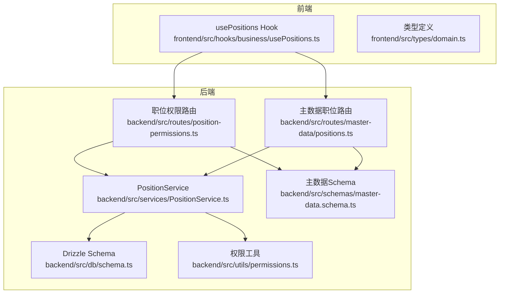
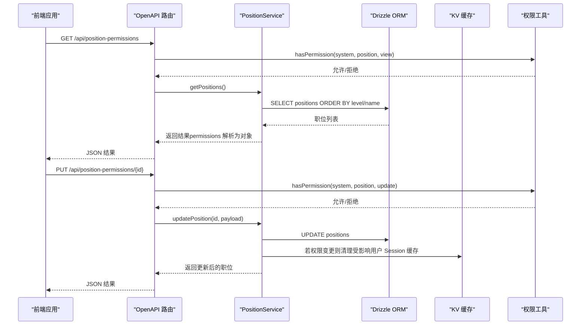
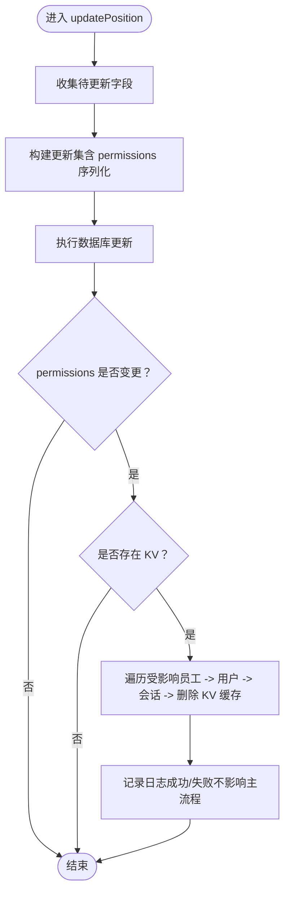
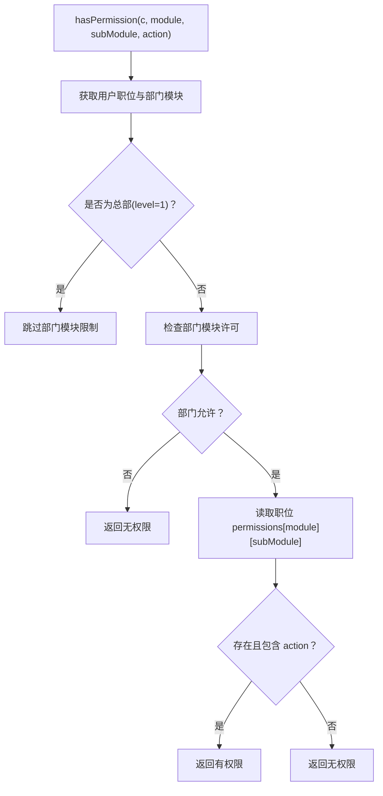
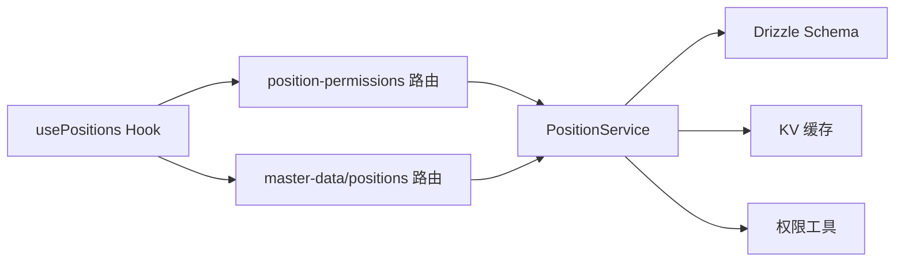

# 职位层级体系

<cite>
**本文引用的文件**
- [PositionService.ts](file://backend/src/services/PositionService.ts)
- [position-permissions.ts](file://backend/src/routes/position-permissions.ts)
- [positions.ts](file://backend/src/routes/master-data/positions.ts)
- [schema.ts](file://backend/src/db/schema.ts)
- [permissions.ts](file://backend/src/utils/permissions.ts)
- [master-data.schema.ts](file://backend/src/schemas/master-data.schema.ts)
- [usePositions.ts](file://frontend/src/hooks/business/usePositions.ts)
- [domain.ts](file://frontend/src/types/domain.ts)
- [position-permissions.ts](file://backend/src/routes/position-permissions.ts)
- [MasterDataService.ts](file://backend/src/services/MasterDataService.ts)
- [migration_position_replacement.sql](file://backend/src/db/archive/migration_position_replacement.sql)
- [migration_support_positions.sql](file://backend/src/db/archive/migration_support_positions.sql)
- [openapi.json](file://backend/openapi.json)
</cite>

## 目录
1. [引言](#引言)
2. [项目结构](#项目结构)
3. [核心组件](#核心组件)
4. [架构总览](#架构总览)
5. [详细组件分析](#详细组件分析)
6. [依赖关系分析](#依赖关系分析)
7. [性能考量](#性能考量)
8. [故障排查指南](#故障排查指南)
9. [结论](#结论)
10. [附录](#附录)

## 引言
本文件系统性阐述“职位层级体系”，围绕数据库表 positions 的 level 字段与 function_role 字段展开，结合 PositionService 的实现，详解职位的创建、更新、删除与查询流程；特别说明 updatePosition 权限变更时自动清除相关用户 Session 缓存的机制；解释 permissions 字段以 JSON 字符串存储的结构与解析方式；并为前端开发者提供在 hooks（如 usePositions）中使用职位数据的最佳实践，以及如何基于职位层级控制功能模块访问权限。

## 项目结构
后端采用分层设计：
- 路由层：提供职位与权限相关的 API（OpenAPI 路由）
- 服务层：PositionService 提供职位 CRUD 与会话失效逻辑
- 数据层：Drizzle ORM 映射 positions 表
- 权限工具：统一的权限判断与访问范围控制
- 前端：hooks 用于拉取职位数据，类型定义明确字段语义

图表来源
- [position-permissions.ts](file://backend/src/routes/position-permissions.ts#L1-L207)
- [positions.ts](file://backend/src/routes/master-data/positions.ts#L1-L65)
- [PositionService.ts](file://backend/src/services/PositionService.ts#L1-L180)
- [schema.ts](file://backend/src/db/schema.ts#L58-L71)
- [permissions.ts](file://backend/src/utils/permissions.ts#L1-L330)
- [master-data.schema.ts](file://backend/src/schemas/master-data.schema.ts#L136-L152)
- [usePositions.ts](file://frontend/src/hooks/business/usePositions.ts#L1-L27)
- [domain.ts](file://frontend/src/types/domain.ts#L26-L49)

章节来源
- [position-permissions.ts](file://backend/src/routes/position-permissions.ts#L1-L207)
- [positions.ts](file://backend/src/routes/master-data/positions.ts#L1-L65)
- [PositionService.ts](file://backend/src/services/PositionService.ts#L1-L180)
- [schema.ts](file://backend/src/db/schema.ts#L58-L71)
- [permissions.ts](file://backend/src/utils/permissions.ts#L1-L330)
- [master-data.schema.ts](file://backend/src/schemas/master-data.schema.ts#L136-L152)
- [usePositions.ts](file://frontend/src/hooks/business/usePositions.ts#L1-L27)
- [domain.ts](file://frontend/src/types/domain.ts#L26-L49)

## 核心组件
- positions 表与字段
  - level：1-总部、2-项目、3-组
  - function_role：职能角色，枚举值包括 director、hr、finance、admin、developer、support、member
  - permissions：JSON 字符串，存储权限配置
- PositionService
  - 查询：返回职位列表与详情，自动将 permissions 从字符串解析为对象
  - 创建：校验 code 唯一，写入 permissions 为 JSON 字符串
  - 更新：支持多字段更新，若 permissions 变更且存在 KV，则触发会话缓存失效
  - 删除：软删除，禁止删除仍被员工或用户使用的职位
- 权限工具
  - hasPermission：按模块/子模块/动作进行权限判断
  - isHeadquartersStaff/isProjectStaff/isTeamMember：按 level 判断
  - getDataAccessFilter：按 level 生成数据访问范围过滤条件
- 前端 hooks
  - usePositions：标准化拉取职位列表，支持多种响应包装形态

章节来源
- [schema.ts](file://backend/src/db/schema.ts#L58-L71)
- [PositionService.ts](file://backend/src/services/PositionService.ts#L14-L113)
- [permissions.ts](file://backend/src/utils/permissions.ts#L80-L146)
- [usePositions.ts](file://frontend/src/hooks/business/usePositions.ts#L1-L27)

## 架构总览
职位权限体系由“路由—服务—数据—权限工具”构成，前端通过 hooks 获取职位数据，后端在权限判断与数据访问范围上统一由权限工具处理。

图表来源
- [position-permissions.ts](file://backend/src/routes/position-permissions.ts#L32-L171)
- [PositionService.ts](file://backend/src/services/PositionService.ts#L73-L113)
- [permissions.ts](file://backend/src/utils/permissions.ts#L80-L114)

## 详细组件分析

### positions 表与字段语义
- level（层级）
  - 1：总部
  - 2：项目
  - 3：组
- function_role（职能角色）
  - 枚举值：director、hr、finance、admin、developer、support、member
- permissions（权限配置）
  - JSON 字符串，运行时由服务层解析为对象
  - 结构约定：模块 -> 子模块 -> 动作数组（如 ["view","create","update","delete"]）

章节来源
- [schema.ts](file://backend/src/db/schema.ts#L58-L71)
- [master-data.schema.ts](file://backend/src/schemas/master-data.schema.ts#L136-L152)
- [PositionService.ts](file://backend/src/services/PositionService.ts#L20-L36)

### PositionService 实现要点
- getPositions/getPosition
  - 自动将 permissions 从字符串解析为对象，便于前端直接消费
- createPosition
  - 校验 code 唯一
  - 将 permissions 序列化为 JSON 字符串入库
- updatePosition
  - 支持多字段增量更新
  - 若 permissions 发生变化且存在 KV，则调用私有方法清理受影响用户的 Session 缓存
- deletePosition
  - 软删除前检查是否存在仍在职的员工或用户关联该职位，避免误删

图表来源
- [PositionService.ts](file://backend/src/services/PositionService.ts#L73-L160)

章节来源
- [PositionService.ts](file://backend/src/services/PositionService.ts#L14-L178)

### 权限判断与访问范围控制
- hasPermission
  - 先检查部门模块许可（总部 level=1 跳过），再检查职位权限配置中的模块/子模块/动作
- isHeadquartersStaff/isProjectStaff/isTeamMember
  - 基于 level 的便捷判断
- getDataAccessFilter
  - 依据 level 生成 SQL 过滤条件，限制数据可见范围
- canManageSubordinates/canViewEmployee/canApproveApplication
  - 基于职位 code 与 can_manage_subordinates 的细粒度控制

图表来源
- [permissions.ts](file://backend/src/utils/permissions.ts#L80-L114)

章节来源
- [permissions.ts](file://backend/src/utils/permissions.ts#L1-L330)

### 前端 hooks 使用最佳实践
- usePositions
  - 默认缓存 1 小时
  - select 处理多种后端响应包装形态（数组、标准包装、DRF 分页）
  - 返回 Position[]，包含 level、function_role、permissions 等字段
- 建议
  - 在需要按层级控制菜单/按钮显隐时，使用 isHeadquartersStaff/isProjectStaff/isTeamMember
  - 在需要按模块/动作控制功能时，使用 hasPermission
  - 对于数据访问，建议在查询接口处使用 getDataAccessFilter 生成的过滤条件

章节来源
- [usePositions.ts](file://frontend/src/hooks/business/usePositions.ts#L1-L27)
- [domain.ts](file://frontend/src/types/domain.ts#L26-L49)
- [permissions.ts](file://backend/src/utils/permissions.ts#L266-L322)

### 职位层级与权限示例
- 总部负责人（level=1，function_role=director）
  - 拥有系统内广泛权限，可跨部门/项目管理
- 项目客服（level=2，function_role=support）
  - 仅限本项目客服相关模块访问
- 客服组员（level=3，function_role=support）
  - 仅限自身中心与少量客服模块访问
- 开发者（function_role=developer）
  - 通常仅限自身中心与少量通用模块

章节来源
- [migration_position_replacement.sql](file://backend/src/db/archive/migration_position_replacement.sql#L77-L115)
- [migration_position_replacement.sql](file://backend/src/db/archive/migration_position_replacement.sql#L428-L450)
- [migration_support_positions.sql](file://backend/src/db/archive/migration_support_positions.sql#L1-L96)

## 依赖关系分析
- 路由依赖权限工具进行访问控制
- 服务层依赖 Drizzle ORM 访问数据库，依赖 KV 清理会话缓存
- 前端 hooks 依赖后端 API，类型定义确保字段一致性

图表来源
- [position-permissions.ts](file://backend/src/routes/position-permissions.ts#L1-L207)
- [positions.ts](file://backend/src/routes/master-data/positions.ts#L1-L65)
- [PositionService.ts](file://backend/src/services/PositionService.ts#L1-L180)
- [schema.ts](file://backend/src/db/schema.ts#L58-L71)
- [permissions.ts](file://backend/src/utils/permissions.ts#L1-L330)
- [usePositions.ts](file://frontend/src/hooks/business/usePositions.ts#L1-L27)

章节来源
- [position-permissions.ts](file://backend/src/routes/position-permissions.ts#L1-L207)
- [positions.ts](file://backend/src/routes/master-data/positions.ts#L1-L65)
- [PositionService.ts](file://backend/src/services/PositionService.ts#L1-L180)
- [schema.ts](file://backend/src/db/schema.ts#L58-L71)
- [permissions.ts](file://backend/src/utils/permissions.ts#L1-L330)
- [usePositions.ts](file://frontend/src/hooks/business/usePositions.ts#L1-L27)

## 性能考量
- 职位查询默认按 sort_order 与 name 排序，建议在前端使用分页或虚拟化表格减少渲染压力
- 权限判断 hasPermission 为纯内存计算，复杂度与权限树深度线性相关，建议保持权限树简洁
- 会话缓存失效涉及多次数据库查询与 KV 删除，建议在权限变更频率较低的场景使用

## 故障排查指南
- 职位更新后权限未生效
  - 检查是否传入了 permissions 字段且服务层已序列化
  - 确认 KV 是否可用，若不可用则不会清理会话缓存
  - 建议强制刷新页面或重新登录以加载最新权限
- 无法删除职位
  - 系统提示仍有员工或用户关联该职位，需先解除关联后再删除
- 前端显示权限异常
  - 确认 usePositions 返回的 permissions 结构符合预期（模块->子模块->动作数组）
  - 检查 hasPermission 参数（module/subModule/action）是否与后端一致

章节来源
- [PositionService.ts](file://backend/src/services/PositionService.ts#L115-L178)
- [permissions.ts](file://backend/src/utils/permissions.ts#L80-L114)
- [usePositions.ts](file://frontend/src/hooks/business/usePositions.ts#L1-L27)

## 结论
职位层级体系通过 level 与 function_role 明确组织层级与职能角色，配合 permissions 的模块化权限配置，实现了灵活而可控的访问控制。PositionService 在权限变更时自动清理会话缓存，确保权限生效及时；前端 hooks 提供统一的数据获取与解析能力。建议在实际业务中遵循“最小权限原则”，合理划分模块与动作，并通过层级与职能角色组合实现精细化权限治理。

## 附录

### permissions 字段结构与解析
- 存储形式：JSON 字符串
- 运行时解析：服务层在返回前将字符串解析为对象
- 前端类型：PermissionConfig 为模块到子模块到动作数组的映射

章节来源
- [PositionService.ts](file://backend/src/services/PositionService.ts#L20-L36)
- [domain.ts](file://frontend/src/types/domain.ts#L42-L48)

### OpenAPI 与路由规范
- 职位 CRUD 路由均受权限保护（system.position.view/create/update/delete）
- 职位列表与详情返回结构与 Schema 一致

章节来源
- [position-permissions.ts](file://backend/src/routes/position-permissions.ts#L32-L171)
- [master-data.schema.ts](file://backend/src/schemas/master-data.schema.ts#L136-L152)
- [openapi.json](file://backend/openapi.json#L12422-L12733)

### 基于职位层级控制功能模块访问权限
- 模块访问控制：hasDepartmentModuleAccess
- 具体操作权限：hasPermission
- 数据访问范围：getDataAccessFilter
- 层级判断：isHeadquartersStaff/isProjectStaff/isTeamMember

章节来源
- [permissions.ts](file://backend/src/utils/permissions.ts#L50-L114)
- [permissions.ts](file://backend/src/utils/permissions.ts#L266-L322)