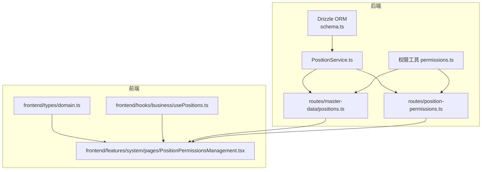
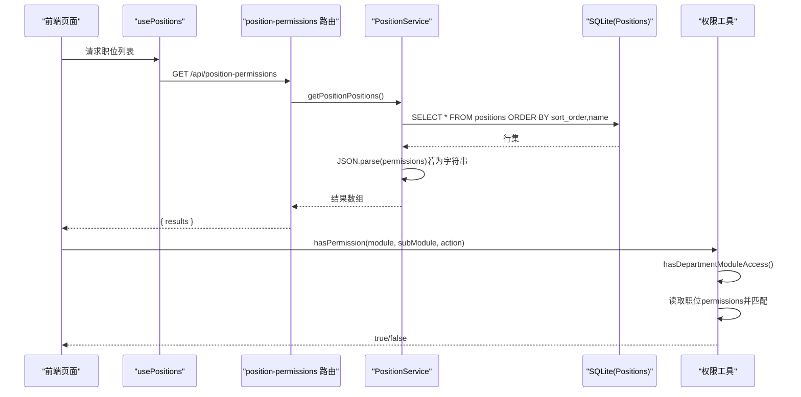
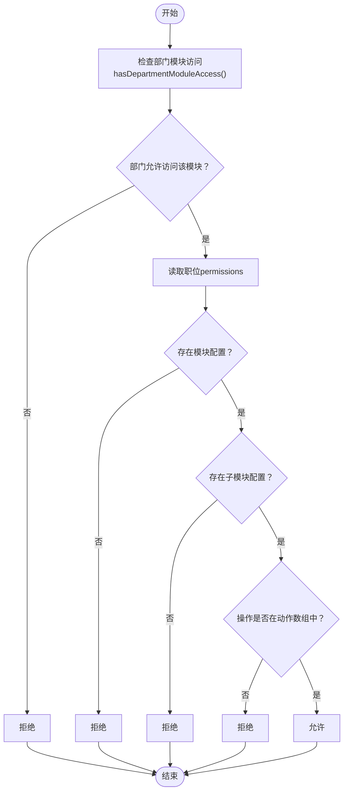
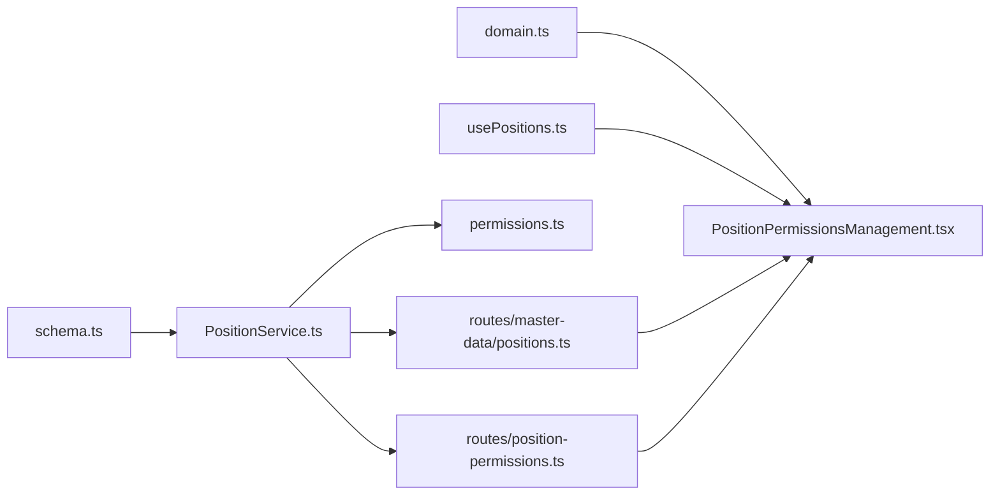

# 职位数据模型

<cite>
**本文引用的文件**
- [schema.ts](file://backend/src/db/schema.ts)
- [master-data.schema.ts](file://backend/src/schemas/master-data.schema.ts)
- [PositionService.ts](file://backend/src/services/PositionService.ts)
- [permissions.ts](file://backend/src/utils/permissions.ts)
- [positions.ts](file://backend/src/routes/master-data/positions.ts)
- [position-permissions.ts](file://backend/src/routes/position-permissions.ts)
- [domain.ts](file://frontend/src/types/domain.ts)
- [PositionPermissionsManagement.tsx](file://frontend/src/features/system/pages/PositionPermissionsManagement.tsx)
- [usePositions.ts](file://frontend/src/hooks/business/usePositions.ts)
- [migration_expand_permissions.sql](file://backend/src/db/archive/migration_expand_permissions.sql)
- [migration_flatten_positions.sql](file://backend/src/db/migration_flatten_positions.sql)
</cite>

## 目录
1. [简介](#简介)
2. [项目结构](#项目结构)
3. [核心组件](#核心组件)
4. [架构总览](#架构总览)
5. [详细组件分析](#详细组件分析)
6. [依赖关系分析](#依赖关系分析)
7. [性能考量](#性能考量)
8. [故障排查指南](#故障排查指南)
9. [结论](#结论)
10. [附录](#附录)

## 简介
本文件系统性梳理“职位”数据模型，围绕后端数据库表 positions 的字段定义与约束、前端类型定义与使用、以及权限体系的实现进行深入说明。重点覆盖以下内容：
- positions 表字段：id、code、name、level（1-总部 2-项目 3-组）、function_role（director/hr/finance/admin/developer）、permissions（JSON字符串存储）、sort_order 和 active。
- level 字段在组织架构中的层级含义与访问控制边界。
- function_role 如何影响权限分类与默认权限集。
- permissions 字段的 JSON 结构与模块/子模块/操作权限的映射。
- schema.ts 中 Drizzle ORM 对字段类型、约束与默认值的定义。
- 前端 domain.ts 中 Position 接口的使用指导与最佳实践。

## 项目结构
职位数据模型贯穿后端数据库层、服务层、路由层与前端类型层，形成完整的读写链路与权限校验闭环。

图表来源
- [schema.ts](file://backend/src/db/schema.ts#L58-L71)
- [PositionService.ts](file://backend/src/services/PositionService.ts#L14-L46)
- [permissions.ts](file://backend/src/utils/permissions.ts#L80-L114)
- [positions.ts](file://backend/src/routes/master-data/positions.ts#L1-L65)
- [position-permissions.ts](file://backend/src/routes/position-permissions.ts#L32-L86)
- [domain.ts](file://frontend/src/types/domain.ts#L26-L39)
- [usePositions.ts](file://frontend/src/hooks/business/usePositions.ts#L10-L26)
- [PositionPermissionsManagement.tsx](file://frontend/src/features/system/pages/PositionPermissionsManagement.tsx#L1-L120)

章节来源
- [schema.ts](file://backend/src/db/schema.ts#L58-L71)
- [domain.ts](file://frontend/src/types/domain.ts#L26-L39)

## 核心组件
- 数据库表 positions：定义职位的核心字段与约束，支撑权限与组织层级判断。
- Drizzle ORM 映射：在 schema.ts 中声明字段类型、非空与唯一约束、默认值。
- 服务层 PositionService：封装 CRUD、权限 JSON 序列化/反序列化、会话缓存失效。
- 权限工具 permissions.ts：基于职位权限 JSON 实现模块/子模块/操作的权限判定。
- 路由层：
  - master-data/positions.ts：提供职位列表与可用职位查询。
  - position-permissions.ts：提供系统维度的职位管理接口（CRUD+审计日志）。
- 前端类型 domain.ts：定义 Position 接口及 PermissionConfig 结构，用于类型安全消费。
- 前端页面 PositionPermissionsManagement.tsx：可视化展示与编辑职位权限，驱动权限配置工作流。

章节来源
- [schema.ts](file://backend/src/db/schema.ts#L58-L71)
- [PositionService.ts](file://backend/src/services/PositionService.ts#L14-L46)
- [permissions.ts](file://backend/src/utils/permissions.ts#L80-L114)
- [positions.ts](file://backend/src/routes/master-data/positions.ts#L1-L65)
- [position-permissions.ts](file://backend/src/routes/position-permissions.ts#L32-L86)
- [domain.ts](file://frontend/src/types/domain.ts#L26-L39)
- [PositionPermissionsManagement.tsx](file://frontend/src/features/system/pages/PositionPermissionsManagement.tsx#L1-L120)

## 架构总览
职位权限体系的关键流程如下：

图表来源
- [position-permissions.ts](file://backend/src/routes/position-permissions.ts#L32-L55)
- [PositionService.ts](file://backend/src/services/PositionService.ts#L14-L46)
- [permissions.ts](file://backend/src/utils/permissions.ts#L80-L114)
- [usePositions.ts](file://frontend/src/hooks/business/usePositions.ts#L10-L26)

## 详细组件分析

### positions 表字段定义与约束
- 字段与类型
  - id: 文本型，主键
  - code: 文本型，非空且唯一
  - name: 文本型，非空
  - level: 整数型，非空；取值 1-总部、2-项目、3-组
  - function_role: 文本型，非空；取值 director/hr/finance/admin/developer
  - can_manage_subordinates: 整数型，默认 0；用于审批/管理边界
  - description: 文本型，可空
  - permissions: 文本型，可空；JSON 字符串形式存储权限配置
  - sort_order: 整数型，默认 0；用于排序
  - active: 整数型，默认 1；逻辑删除标记
  - createdAt/updatedAt: 整数型，时间戳
- 约束与默认值
  - 唯一键：code 唯一
  - 默认值：active=1、sort_order=0、can_manage_subordinates=0
  - 非空：id、code、name、level、function_role
- 作用
  - level 与 function_role 共同决定组织层级与职能角色，进而影响权限范围与访问边界。
  - permissions 采用 JSON 字符串存储，便于灵活扩展模块与操作集合。

章节来源
- [schema.ts](file://backend/src/db/schema.ts#L58-L71)

### Drizzle ORM 定义与约束
- 在 schema.ts 中，positions 表通过 sqliteTable 定义，字段类型与约束与 SQLite 对应：
  - text('id').primaryKey()
  - text('code').notNull().unique()
  - text('name').notNull()
  - integer('level').notNull()
  - text('function_role').notNull()
  - integer('can_manage_subordinates').default(0)
  - text('description')
  - text('permissions')
  - integer('sort_order').default(0)
  - integer('active').default(1)
  - integer('createdAt/updatedAt')
- 服务层对 permissions 的处理
  - 查询时：若 permissions 为字符串则解析为对象，保证上层消费一致性。
  - 写入时：将对象序列化为 JSON 字符串入库。

章节来源
- [schema.ts](file://backend/src/db/schema.ts#L58-L71)
- [PositionService.ts](file://backend/src/services/PositionService.ts#L14-L46)

### 前端类型定义与使用
- domain.ts 中的 Position 接口
  - 字段：id、code、name、level、function_role、can_manage_subordinates、permissions、createdAt、updatedAt
  - permissions 类型：PermissionConfig，即模块到子模块到操作数组的映射
- 前端页面 PositionPermissionsManagement.tsx
  - 展示权限配置：按模块/子模块/操作渲染复选框，支持全选/部分选/清空
  - 编辑权限：将内存中的权限对象回写到后端 PUT /api/position-permissions/{id}
  - 使用 usePositions Hook 获取职位列表，并按 sort_order 排序展示
- 最佳实践
  - 仅在需要时解析 permissions（避免重复解析），并在提交前确保为对象
  - 使用受控组件维护权限变更，提交后刷新列表

章节来源
- [domain.ts](file://frontend/src/types/domain.ts#L26-L39)
- [PositionPermissionsManagement.tsx](file://frontend/src/features/system/pages/PositionPermissionsManagement.tsx#L1-L120)
- [usePositions.ts](file://frontend/src/hooks/business/usePositions.ts#L10-L26)

### 权限 JSON 结构与模块/操作映射
- 结构
  - 键：模块名（如 finance、hr、asset、site、report、system、self）
  - 值：子模块到操作数组的映射（如 finance.flow -> ["view","create","update","export"]）
- 常见模块与典型操作
  - finance：flow、transfer、ar、ap、borrowing、salary、allowance、site_bill
  - hr：employee、salary、leave、reimbursement
  - asset：fixed、rental
  - site：info、bill
  - report：view、export
  - system：user、position、department、audit、config、account、category、currency、headquarters
  - self：leave、reimbursement、salary、asset、borrowing
- 操作示例
  - view、create、update、delete、export、approve、reject、allocate、view_sensitive

章节来源
- [PositionPermissionsManagement.tsx](file://frontend/src/features/system/pages/PositionPermissionsManagement.tsx#L28-L96)
- [migration_expand_permissions.sql](file://backend/src/db/archive/migration_expand_permissions.sql#L1-L309)

### level 字段的层级含义与访问边界
- 层级定义
  - 1：总部
  - 2：项目
  - 3：组
- 访问边界
  - 总部人员（level=1）：不受部门模块限制，可访问所有模块
  - 项目人员（level=2）：仅能访问本项目（department_id）范围内的数据
  - 组成员（level=3）：仅能访问本组（org_department_id）范围内的数据
  - 工程师（team_engineer）：仅能访问自己的数据
- 例外与特殊角色
  - team_leader：可审批本组工程师的请假/报销，且拥有更多 HR/报表权限
  - project_director：在项目维度具备更强的审批与导出能力

章节来源
- [permissions.ts](file://backend/src/utils/permissions.ts#L124-L146)
- [permissions.ts](file://backend/src/utils/permissions.ts#L286-L322)
- [migration_flatten_positions.sql](file://backend/src/db/migration_flatten_positions.sql#L1-L149)

### function_role 与权限分类
- 取值
  - director、hr、finance、admin、developer
- 影响
  - function_role 与 level 共同决定默认权限集合（迁移脚本中已为各角色配置了典型权限）
  - 前端页面按模块/子模块/操作进行可视化配置，便于管理员按角色快速赋权

章节来源
- [migration_expand_permissions.sql](file://backend/src/db/archive/migration_expand_permissions.sql#L1-L309)
- [migration_flatten_positions.sql](file://backend/src/db/migration_flatten_positions.sql#L1-L149)

### 服务层与路由层的交互
- 列表与详情
  - GET /api/positions：返回所有职位，按 sort_order/name 排序
  - GET /api/positions/available：按 org_departmentId 返回可用职位
- 系统管理接口
  - GET/POST/PUT/DELETE /api/position-permissions：系统维度的职位管理（CRUD）
  - 写入时进行权限校验（system.position.*）
- 权限校验
  - 所有接口均通过 hasPermission 进行权限判定
  - 更新权限时，若存在 KV，则清理受影响用户的 Session 缓存，强制下次请求重新加载权限

章节来源
- [positions.ts](file://backend/src/routes/master-data/positions.ts#L1-L65)
- [position-permissions.ts](file://backend/src/routes/position-permissions.ts#L32-L206)
- [PositionService.ts](file://backend/src/services/PositionService.ts#L105-L160)
- [permissions.ts](file://backend/src/utils/permissions.ts#L80-L114)

### 权限判定流程（算法）

图表来源
- [permissions.ts](file://backend/src/utils/permissions.ts#L80-L114)

## 依赖关系分析
- 后端耦合
  - schema.ts 与 PositionService：ORM 定义与业务逻辑强耦合，确保字段类型与默认值一致
  - permissions.ts 与 routes：权限判定贯穿路由层，保证接口安全
  - PositionService 与 KV：权限更新后清理会话缓存，降低权限滞后风险
- 前端耦合
  - domain.ts 与页面：类型定义保障 UI 与数据结构一致
  - usePositions 与页面：数据获取与展示解耦，便于扩展

图表来源
- [schema.ts](file://backend/src/db/schema.ts#L58-L71)
- [PositionService.ts](file://backend/src/services/PositionService.ts#L14-L46)
- [permissions.ts](file://backend/src/utils/permissions.ts#L80-L114)
- [positions.ts](file://backend/src/routes/master-data/positions.ts#L1-L65)
- [position-permissions.ts](file://backend/src/routes/position-permissions.ts#L32-L86)
- [domain.ts](file://frontend/src/types/domain.ts#L26-L39)
- [usePositions.ts](file://frontend/src/hooks/business/usePositions.ts#L10-L26)
- [PositionPermissionsManagement.tsx](file://frontend/src/features/system/pages/PositionPermissionsManagement.tsx#L1-L120)

## 性能考量
- 查询排序
  - positions 查询按 sort_order 与 name 排序，有利于前端稳定展示与导航
- JSON 解析
  - 服务层在返回前解析 permissions，避免重复解析；前端编辑时使用内存对象，减少多次序列化开销
- 缓存与失效
  - 更新权限后清理受影响用户的 Session 缓存，避免权限陈旧导致的额外重试与错误
- 数据量
  - 职位数量通常较小，排序与简单过滤对性能影响有限；建议在前端做分页与懒加载优化

[本节为通用性能讨论，无需列出具体文件来源]

## 故障排查指南
- 常见问题
  - 职位 code 重复：创建/更新时若 code 已存在会报重复错误
  - 职位被占用：删除前需确认未分配给员工或用户
  - 权限未生效：更新权限后需等待会话缓存失效或主动触发清理
  - 权限解析异常：permissions 为字符串时需确保 JSON 格式合法
- 排查步骤
  - 后端：检查 position-permissions 路由权限校验与 PositionService 的 CRUD 行为
  - 前端：确认 usePositions 的数据结构与页面渲染逻辑，核对模块/子模块/操作映射
  - 迁移：参考迁移脚本验证默认权限是否符合预期

章节来源
- [PositionService.ts](file://backend/src/services/PositionService.ts#L47-L104)
- [position-permissions.ts](file://backend/src/routes/position-permissions.ts#L115-L169)
- [migration_expand_permissions.sql](file://backend/src/db/archive/migration_expand_permissions.sql#L1-L309)

## 结论
职位数据模型通过清晰的字段定义、严格的 Drizzle ORM 约束、灵活的 JSON 权限结构与完善的前后端协作，构建了可演进的权限体系。level 与 function_role 决定了访问边界与默认权限，permissions 则提供了细粒度的模块/子模块/操作授权能力。配合迁移脚本与前端可视化页面，管理员可以高效地维护与优化权限配置，满足总部、项目与组三级组织架构下的差异化需求。

[本节为总结性内容，无需列出具体文件来源]

## 附录

### 字段与类型对照（schema.ts）
- id: text(primary key)
- code: text(not null, unique)
- name: text(not null)
- level: integer(not null)
- function_role: text(not null)
- can_manage_subordinates: integer(default 0)
- description: text
- permissions: text
- sort_order: integer(default 0)
- active: integer(default 1)
- createdAt/updatedAt: integer

章节来源
- [schema.ts](file://backend/src/db/schema.ts#L58-L71)

### 前端 Position 接口要点
- 字段：id、code、name、level、function_role、can_manage_subordinates、permissions、createdAt、updatedAt
- permissions 类型：模块 -> 子模块 -> 操作数组
- 使用建议：在页面中以树形结构展示，支持批量勾选与清空；提交前确保为对象而非字符串

章节来源
- [domain.ts](file://frontend/src/types/domain.ts#L26-L39)
- [PositionPermissionsManagement.tsx](file://frontend/src/features/system/pages/PositionPermissionsManagement.tsx#L1-L120)

### 默认权限参考（迁移脚本）
- 总部/项目/组角色的典型权限已在迁移脚本中固化，可作为新增/调整权限的参考基线
- 建议：新增角色时沿用相同模块/子模块命名规范，确保前端页面与后端校验一致

章节来源
- [migration_expand_permissions.sql](file://backend/src/db/archive/migration_expand_permissions.sql#L1-L309)
- [migration_flatten_positions.sql](file://backend/src/db/migration_flatten_positions.sql#L1-L149)