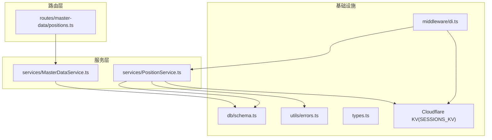
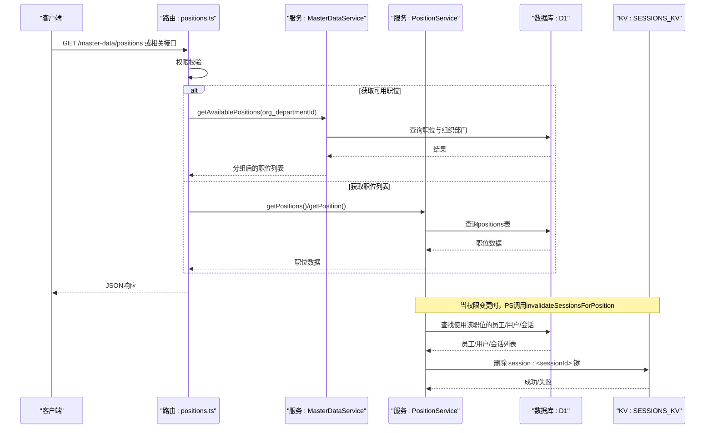
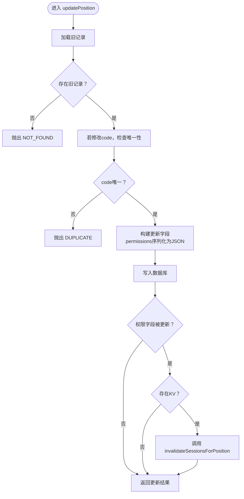
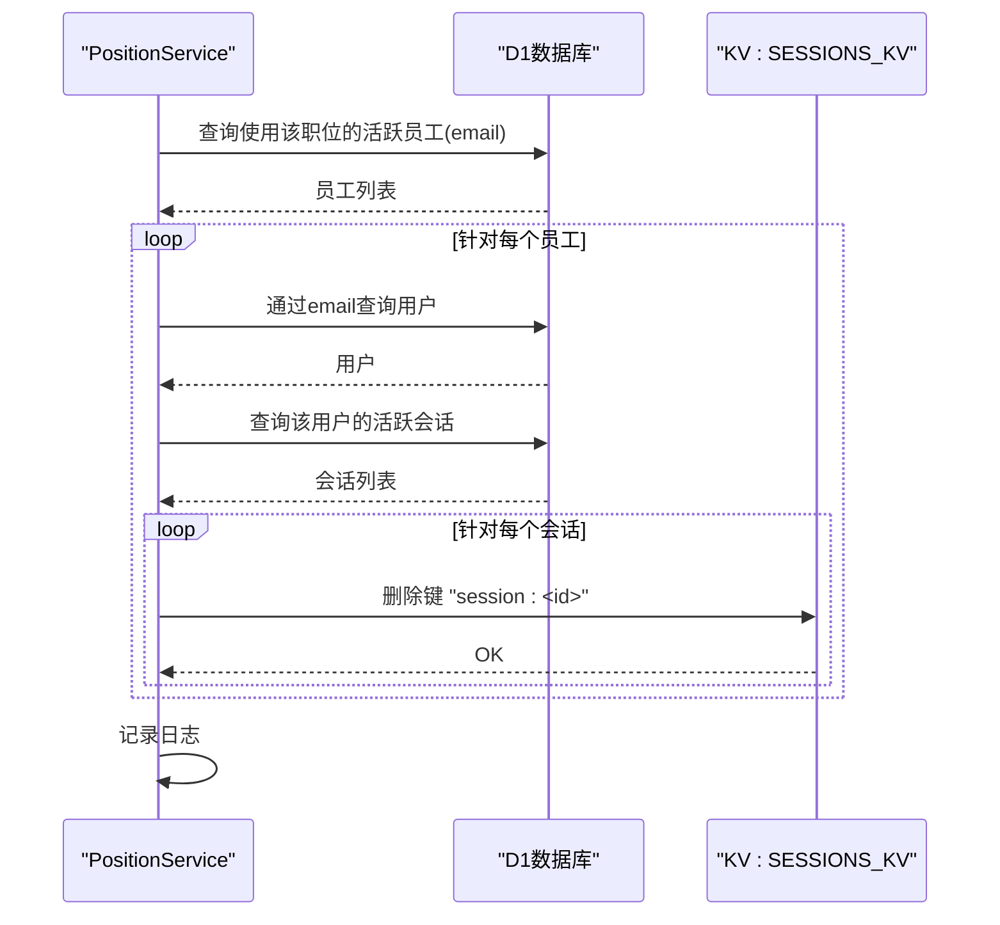
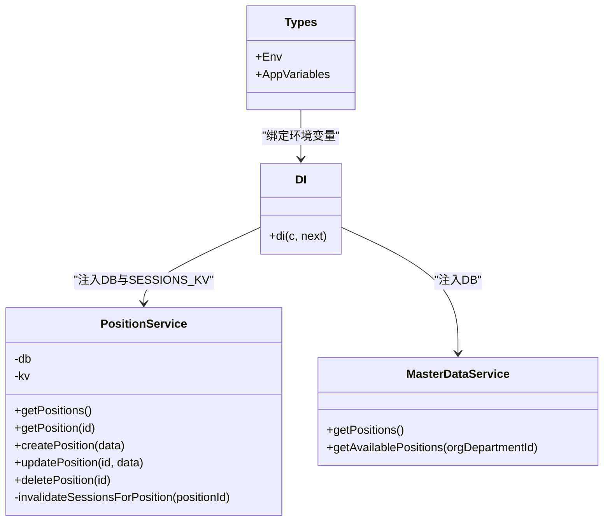
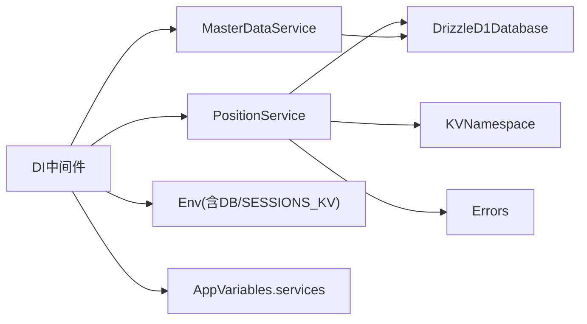

# 职位服务逻辑

<cite>
**本文引用的文件**
- [PositionService.ts](file://backend/src/services/PositionService.ts)
- [di.ts](file://backend/src/middleware/di.ts)
- [MasterDataService.ts](file://backend/src/services/MasterDataService.ts)
- [positions.ts](file://backend/src/routes/master-data/positions.ts)
- [schema.ts](file://backend/src/db/schema.ts)
- [errors.ts](file://backend/src/utils/errors.ts)
- [types.ts](file://backend/src/types.ts)
- [cloudflare.ts](file://backend/src/utils/cloudflare.ts)
</cite>

## 目录
1. [简介](#简介)
2. [项目结构](#项目结构)
3. [核心组件](#核心组件)
4. [架构总览](#架构总览)
5. [详细组件分析](#详细组件分析)
6. [依赖关系分析](#依赖关系分析)
7. [性能考量](#性能考量)
8. [故障排查指南](#故障排查指南)
9. [结论](#结论)
10. [附录](#附录)

## 简介
本文件聚焦于职位服务(PositionService)的实现与使用，围绕以下关键点进行深入解析：
- 方法族：getPositions、getPosition、createPosition、updatePosition、deletePosition
- 权限变更后的会话缓存失效机制：invalidateSessionsForPosition
- 通过KVNamespace与Cloudflare Workers KV集成实现缓存失效
- 唯一性校验与软删除策略
- DI容器在di.ts中的初始化与依赖注入
- 服务层调用最佳实践与异常处理策略

## 项目结构
职位服务位于后端服务层，配合数据库模式、错误处理工具与依赖注入中间件共同工作。路由层通过MasterDataService暴露“可用职位”等接口，而PositionService专注于职位实体的增删改查与权限变更后的会话清理。

图表来源
- [positions.ts](file://backend/src/routes/master-data/positions.ts#L1-L65)
- [MasterDataService.ts](file://backend/src/services/MasterDataService.ts#L466-L544)
- [PositionService.ts](file://backend/src/services/PositionService.ts#L1-L180)
- [schema.ts](file://backend/src/db/schema.ts#L58-L71)
- [errors.ts](file://backend/src/utils/errors.ts#L1-L114)
- [types.ts](file://backend/src/types.ts#L1-L88)
- [di.ts](file://backend/src/middleware/di.ts#L25-L75)

章节来源
- [positions.ts](file://backend/src/routes/master-data/positions.ts#L1-L65)
- [MasterDataService.ts](file://backend/src/services/MasterDataService.ts#L466-L544)
- [PositionService.ts](file://backend/src/services/PositionService.ts#L1-L180)
- [schema.ts](file://backend/src/db/schema.ts#L58-L71)
- [errors.ts](file://backend/src/utils/errors.ts#L1-L114)
- [types.ts](file://backend/src/types.ts#L1-L88)
- [di.ts](file://backend/src/middleware/di.ts#L25-L75)

## 核心组件
- PositionService：提供职位的查询、创建、更新、删除与权限变更后的会话缓存失效能力。
- MasterDataService：提供“可用职位”等组织维度的职位筛选与分组能力，其内部调用数据库模式查询职位。
- DI中间件：在请求生命周期内初始化数据库与各服务实例，并注入到上下文变量中，供路由使用。
- 错误工具：统一的错误类型与全局错误处理器，保证服务层与路由层的一致性。
- 数据库模式：positions表定义了职位的唯一性约束、排序字段与软删除标志。

章节来源
- [PositionService.ts](file://backend/src/services/PositionService.ts#L1-L180)
- [MasterDataService.ts](file://backend/src/services/MasterDataService.ts#L466-L544)
- [di.ts](file://backend/src/middleware/di.ts#L25-L75)
- [errors.ts](file://backend/src/utils/errors.ts#L1-L114)
- [schema.ts](file://backend/src/db/schema.ts#L58-L71)

## 架构总览
职位服务在Hono应用中的调用链路如下：
- 路由层接收请求，进行权限校验后调用MasterDataService或PositionService
- 服务层通过Drizzle ORM访问SQLite(D1)，执行查询/更新/删除
- 当权限发生变更时，服务层通过KVNamespace删除受影响用户的会话缓存键
- DI中间件负责服务实例化与注入，确保每个请求拥有独立的服务上下文

图表来源
- [positions.ts](file://backend/src/routes/master-data/positions.ts#L1-L65)
- [MasterDataService.ts](file://backend/src/services/MasterDataService.ts#L466-L544)
- [PositionService.ts](file://backend/src/services/PositionService.ts#L1-L180)
- [schema.ts](file://backend/src/db/schema.ts#L58-L71)

## 详细组件分析

### PositionService 类与方法族
- 构造函数
  - 接收DrizzleD1Database与可选的KVNamespace(SESSIONS_KV)
  - 用于数据库操作与会话缓存失效
- getPositions
  - 查询所有职位，按排序字段与名称排序
  - 将permissions字符串解析为JSON对象返回
- getPosition
  - 按ID查询职位，不存在则抛出“资源不存在”
  - 同样对permissions进行解析
- createPosition
  - 唯一性校验：根据code检查重复
  - 写入新记录，permissions序列化为JSON
  - 返回生成的ID与传入数据
- updatePosition
  - 先查旧记录，不存在则抛出“资源不存在”
  - 若修改code，需确保新code在同表中唯一
  - 收集更新字段，permissions序列化为JSON
  - 若权限字段被更新且存在KV，则调用invalidateSessionsForPosition
  - 返回更新后的数据
- deletePosition
  - 检查是否仍有员工或用户关联该职位，若有则抛出“业务错误”
  - 执行软删除：将active置为0，更新时间戳
  - 返回ok:true
- invalidateSessionsForPosition
  - 查找使用该职位的活跃员工
  - 通过邮箱定位用户，再查询其所有活跃会话
  - 逐个删除KV中以“session:<id>”命名的键
  - 发生异常时记录日志但不中断主流程

图表来源
- [PositionService.ts](file://backend/src/services/PositionService.ts#L73-L113)
- [PositionService.ts](file://backend/src/services/PositionService.ts#L115-L160)

章节来源
- [PositionService.ts](file://backend/src/services/PositionService.ts#L1-L180)

### 权限变更与会话缓存失效机制
- 触发条件：当updatePosition的permissions字段被更新且服务构造时提供了KVNamespace
- 失效范围：针对使用该职位的活跃员工，逐一定位其用户与会话，删除KV中的session键
- 容错策略：捕获异常并记录日志，不影响主流程的权限更新成功

图表来源
- [PositionService.ts](file://backend/src/services/PositionService.ts#L115-L160)

章节来源
- [PositionService.ts](file://backend/src/services/PositionService.ts#L115-L160)

### Cloudflare Workers KV 集成与失效策略
- KV命名空间：通过环境变量SESSIONS_KV注入到PositionService
- 失效键名：采用“session:<id>”的键前缀
- 集成方式：在invalidateSessionsForPosition中直接调用KV的删除接口
- 注意：KV操作失败不会中断主流程，避免因缓存清理失败导致业务回滚

章节来源
- [di.ts](file://backend/src/middleware/di.ts#L35-L45)
- [PositionService.ts](file://backend/src/services/PositionService.ts#L115-L160)
- [types.ts](file://backend/src/types.ts#L1-L18)

### 唯一性校验与软删除策略
- 唯一性校验
  - createPosition：以code为唯一键，若重复则抛出“重复”
  - updatePosition：若修改code，需确保新code在同表中唯一
- 软删除
  - deletePosition：若仍有员工或用户关联该职位则拒绝；否则将active置为0并更新时间戳

章节来源
- [PositionService.ts](file://backend/src/services/PositionService.ts#L38-L71)
- [PositionService.ts](file://backend/src/services/PositionService.ts#L73-L113)
- [PositionService.ts](file://backend/src/services/PositionService.ts#L162-L178)
- [schema.ts](file://backend/src/db/schema.ts#L58-L71)

### DI容器初始化与依赖注入
- 初始化步骤
  - 在中间件中创建数据库连接
  - 实例化各服务，其中PositionService接收DB与SESSIONS_KV
  - 将服务集合注入到上下文变量services中
- 使用方式
  - 路由通过c.get('services').position获取PositionService实例
  - 路由通过c.get('services').masterData获取MasterDataService实例

图表来源
- [di.ts](file://backend/src/middleware/di.ts#L25-L75)
- [types.ts](file://backend/src/types.ts#L1-L88)
- [PositionService.ts](file://backend/src/services/PositionService.ts#L1-L180)
- [MasterDataService.ts](file://backend/src/services/MasterDataService.ts#L466-L544)

章节来源
- [di.ts](file://backend/src/middleware/di.ts#L25-L75)
- [types.ts](file://backend/src/types.ts#L1-L88)

### 路由与服务层协作
- 路由positions.ts中，部分接口通过MasterDataService提供“可用职位”列表，内部会根据组织部门层级与allowedPositions进行过滤与分组
- 职位列表与详情通常由PositionService提供，但路由中示例展示了通过MasterDataService获取可用职位的场景

章节来源
- [positions.ts](file://backend/src/routes/master-data/positions.ts#L1-L65)
- [MasterDataService.ts](file://backend/src/services/MasterDataService.ts#L466-L544)

## 依赖关系分析
- PositionService依赖
  - DrizzleD1Database：执行数据库查询与更新
  - KVNamespace：执行会话缓存键删除
  - 错误工具：抛出统一错误类型
- MasterDataService依赖
  - DrizzleD1Database：执行数据库查询
  - 与positions表交互，支持职位过滤与分组
- DI中间件依赖
  - Env：包含DB与SESSIONS_KV
  - AppVariables：注入services集合

图表来源
- [PositionService.ts](file://backend/src/services/PositionService.ts#L1-L180)
- [MasterDataService.ts](file://backend/src/services/MasterDataService.ts#L466-L544)
- [di.ts](file://backend/src/middleware/di.ts#L25-L75)
- [types.ts](file://backend/src/types.ts#L1-L88)
- [errors.ts](file://backend/src/utils/errors.ts#L1-L114)

章节来源
- [PositionService.ts](file://backend/src/services/PositionService.ts#L1-L180)
- [MasterDataService.ts](file://backend/src/services/MasterDataService.ts#L466-L544)
- [di.ts](file://backend/src/middleware/di.ts#L25-L75)
- [types.ts](file://backend/src/types.ts#L1-L88)
- [errors.ts](file://backend/src/utils/errors.ts#L1-L114)

## 性能考量
- 查询优化
  - getPositions与getPosition对positions表进行排序与解析，建议在positions表上维护合适的索引（如code、sortOrder、name）以提升查询效率
- 更新与缓存失效
  - updatePosition在权限变更时触发invalidateSessionsForPosition，可能产生多次KV删除操作；建议在高并发场景下评估KV写入压力
- 软删除
  - deletePosition采用软删除，避免物理删除带来的连锁影响，但需定期清理历史数据或在查询时注意active字段过滤

[本节为通用指导，无需特定文件来源]

## 故障排查指南
- 常见错误类型
  - NOT_FOUND：查询职位不存在
  - DUPLICATE：职位code重复
  - BUSINESS_ERROR：删除时仍有员工或用户关联
- 错误处理策略
  - 服务层抛出统一错误，路由层通过全局错误处理器返回标准JSON
  - invalidateSessionsForPosition捕获异常并记录日志，不影响主流程
- 排查要点
  - 确认KV命名空间SESSIONS_KV已正确注入
  - 检查positions表的唯一性约束与软删除字段
  - 核对updatePosition的权限字段是否被正确序列化

章节来源
- [errors.ts](file://backend/src/utils/errors.ts#L1-L114)
- [PositionService.ts](file://backend/src/services/PositionService.ts#L1-L180)

## 结论
PositionService围绕职位实体提供了完整的CRUD能力，并在权限变更时通过KVNamespace实现会话缓存失效，确保权限更新的即时生效。配合DI容器的依赖注入与统一错误处理，服务层具备良好的可维护性与扩展性。建议在生产环境中关注KV写入压力与数据库索引优化，以保障性能与一致性。

[本节为总结性内容，无需特定文件来源]

## 附录
- 关键路径参考
  - getPositions：[PositionService.ts](file://backend/src/services/PositionService.ts#L14-L24)
  - getPosition：[PositionService.ts](file://backend/src/services/PositionService.ts#L26-L36)
  - createPosition：[PositionService.ts](file://backend/src/services/PositionService.ts#L38-L71)
  - updatePosition：[PositionService.ts](file://backend/src/services/PositionService.ts#L73-L113)
  - deletePosition：[PositionService.ts](file://backend/src/services/PositionService.ts#L162-L178)
  - invalidateSessionsForPosition：[PositionService.ts](file://backend/src/services/PositionService.ts#L115-L160)
  - DI初始化：[di.ts](file://backend/src/middleware/di.ts#L25-L75)
  - 错误工具：[errors.ts](file://backend/src/utils/errors.ts#L1-L114)
  - 数据库模式：[schema.ts](file://backend/src/db/schema.ts#L58-L71)