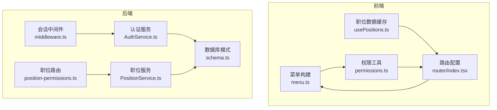
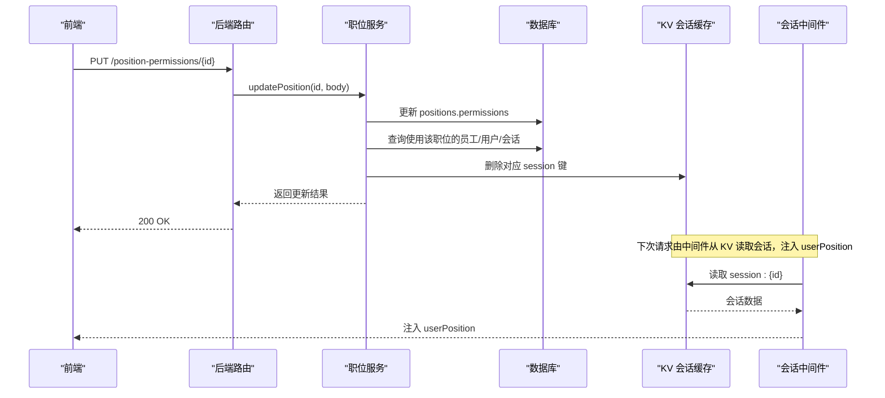
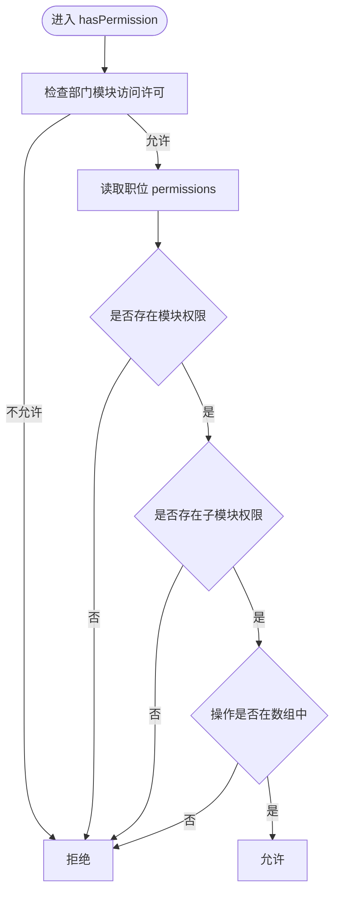
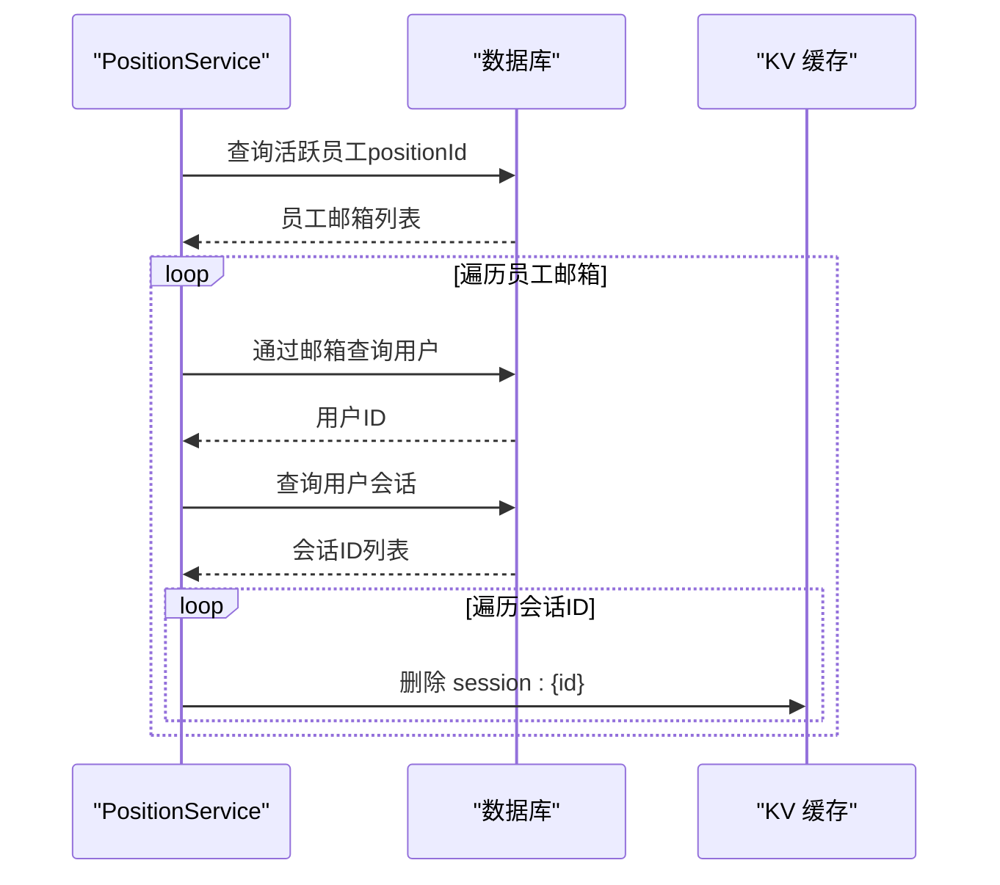
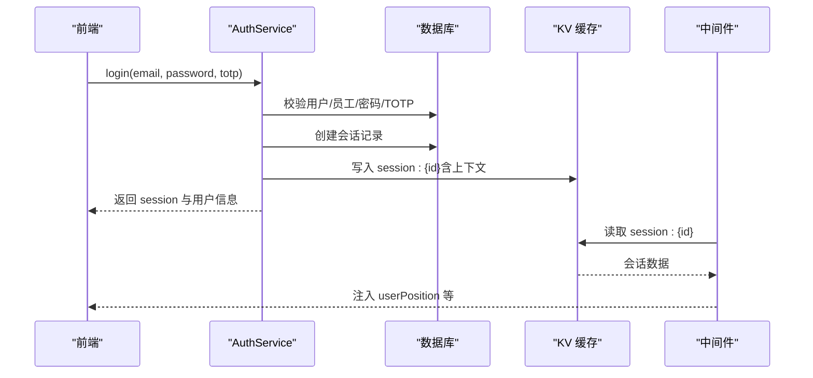
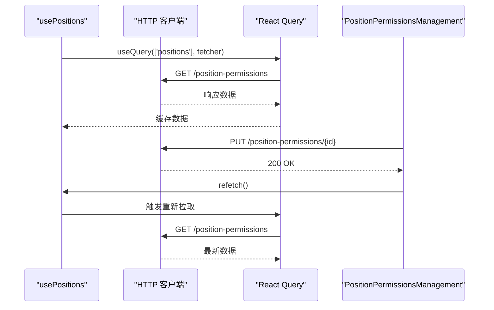
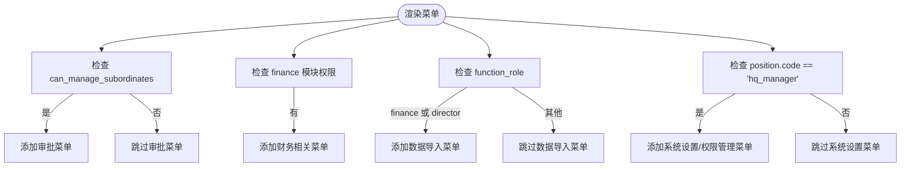
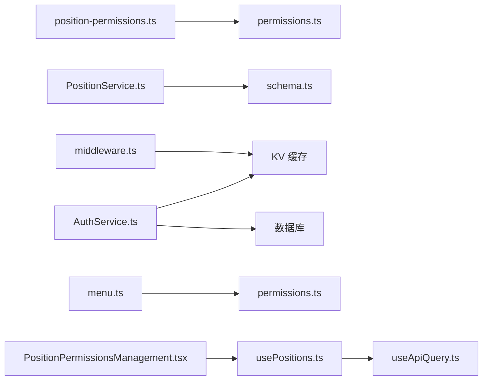

# 职位权限控制

<cite>
**本文引用的文件**
- [backend/src/utils/permissions.ts](file://backend/src/utils/permissions.ts)
- [backend/src/services/PositionService.ts](file://backend/src/services/PositionService.ts)
- [backend/src/routes/position-permissions.ts](file://backend/src/routes/position-permissions.ts)
- [backend/src/services/AuthService.ts](file://backend/src/services/AuthService.ts)
- [backend/src/middleware.ts](file://backend/src/middleware.ts)
- [backend/src/db/schema.ts](file://backend/src/db/schema.ts)
- [frontend/src/utils/permissions.ts](file://frontend/src/utils/permissions.ts)
- [frontend/src/hooks/business/usePositions.ts](file://frontend/src/hooks/business/usePositions.ts)
- [frontend/src/utils/useApiQuery.ts](file://frontend/src/utils/useApiQuery.ts)
- [frontend/src/config/menu.ts](file://frontend/src/config/menu.ts)
- [frontend/src/features/system/pages/PositionPermissionsManagement.tsx](file://frontend/src/features/system/pages/PositionPermissionsManagement.tsx)
- [frontend/src/router/index.tsx](file://frontend/src/router/index.tsx)
- [backend/openapi.json](file://backend/openapi.json)
</cite>

## 目录
1. [简介](#简介)
2. [项目结构](#项目结构)
3. [核心组件](#核心组件)
4. [架构总览](#架构总览)
5. [详细组件分析](#详细组件分析)
6. [依赖关系分析](#依赖关系分析)
7. [性能考量](#性能考量)
8. [故障排查指南](#故障排查指南)
9. [结论](#结论)
10. [附录](#附录)

## 简介
本文件围绕“职位权限控制”主题，系统性阐述基于职位的权限体系（RBAC）如何通过 function_role 与 permissions 字段实现；详述在 updatePosition 时权限变更触发 Session 缓存清除的完整流程（从员工表到用户表再到会话表的关联查询）；解释前端 usePositions Hook 如何通过 React Query 缓存职位数据并在权限变更后自动重新获取最新数据；说明权限控制在前端路由与组件渲染中的应用（如根据 function_role 控制菜单项的显示）；并提供权限配置的最佳实践与常见问题解决方案。

## 项目结构
- 后端采用 Hono + Drizzle ORM + Cloudflare Workers/KV 架构，权限校验集中在中间件与服务层，职位与权限存储于 SQLite 表 positions。
- 前端使用 React + Ant Design + React Router + React Query，权限控制贯穿菜单构建、页面路由与组件渲染。

图表来源
- [frontend/src/config/menu.ts](file://frontend/src/config/menu.ts#L63-L236)
- [frontend/src/router/index.tsx](file://frontend/src/router/index.tsx#L78-L151)
- [frontend/src/hooks/business/usePositions.ts](file://frontend/src/hooks/business/usePositions.ts#L1-L27)
- [frontend/src/utils/permissions.ts](file://frontend/src/utils/permissions.ts#L1-L100)
- [backend/src/middleware.ts](file://backend/src/middleware.ts#L33-L71)
- [backend/src/services/AuthService.ts](file://backend/src/services/AuthService.ts#L133-L175)
- [backend/src/services/PositionService.ts](file://backend/src/services/PositionService.ts#L112-L179)
- [backend/src/routes/position-permissions.ts](file://backend/src/routes/position-permissions.ts#L130-L171)
- [backend/src/db/schema.ts](file://backend/src/db/schema.ts#L58-L71)

章节来源
- [frontend/src/config/menu.ts](file://frontend/src/config/menu.ts#L63-L236)
- [frontend/src/router/index.tsx](file://frontend/src/router/index.tsx#L78-L151)
- [frontend/src/hooks/business/usePositions.ts](file://frontend/src/hooks/business/usePositions.ts#L1-L27)
- [frontend/src/utils/permissions.ts](file://frontend/src/utils/permissions.ts#L1-L100)
- [backend/src/middleware.ts](file://backend/src/middleware.ts#L33-L71)
- [backend/src/services/AuthService.ts](file://backend/src/services/AuthService.ts#L133-L175)
- [backend/src/services/PositionService.ts](file://backend/src/services/PositionService.ts#L112-L179)
- [backend/src/routes/position-permissions.ts](file://backend/src/routes/position-permissions.ts#L130-L171)
- [backend/src/db/schema.ts](file://backend/src/db/schema.ts#L58-L71)

## 核心组件
- 后端权限工具：提供 hasPermission、canManageSubordinates、isHeadquartersStaff 等方法，用于模块级与操作级权限判断。
- 职位服务：提供职位 CRUD 与权限变更后的 Session 缓存失效逻辑。
- 认证服务：登录时构建会话上下文（含职位信息），并写入 KV 缓存。
- 前端权限工具：提供 hasPermission、usePermissions 等，供菜单与组件使用。
- 前端职位 Hook：通过 React Query 缓存职位列表，支持选择器与刷新策略。

章节来源
- [backend/src/utils/permissions.ts](file://backend/src/utils/permissions.ts#L80-L114)
- [backend/src/services/PositionService.ts](file://backend/src/services/PositionService.ts#L112-L179)
- [backend/src/services/AuthService.ts](file://backend/src/services/AuthService.ts#L133-L175)
- [frontend/src/utils/permissions.ts](file://frontend/src/utils/permissions.ts#L1-L100)
- [frontend/src/hooks/business/usePositions.ts](file://frontend/src/hooks/business/usePositions.ts#L1-L27)

## 架构总览
职位权限控制的端到端流程：
- 登录阶段：认证服务加载用户全量上下文（含职位与员工信息），写入 KV 会话缓存。
- 请求阶段：中间件从 KV 读取会话，注入 userPosition、userEmployee 等变量，供权限工具判断。
- 职位变更阶段：更新职位权限后，服务层遍历使用该职位的员工、用户与会话，删除 KV 中对应会话键，强制下次请求重新加载权限。
- 前端阶段：usePositions 通过 React Query 缓存职位数据；当职位变更成功后，Mutation 成功回调触发全局缓存失效，前端自动重新拉取最新职位数据。

图表来源
- [backend/src/routes/position-permissions.ts](file://backend/src/routes/position-permissions.ts#L130-L171)
- [backend/src/services/PositionService.ts](file://backend/src/services/PositionService.ts#L112-L179)
- [backend/src/middleware.ts](file://backend/src/middleware.ts#L33-L71)
- [backend/src/services/AuthService.ts](file://backend/src/services/AuthService.ts#L133-L175)

## 详细组件分析

### 后端权限工具与职位模型
- 职位模型包含：code、name、level（1总部/2项目/3组）、function_role（职能角色）、can_manage_subordinates（是否可管理下级）、permissions（JSON 权限配置）、active 等。
- 权限判断流程：
  1) 检查部门模块访问许可（总部人员跳过）；
  2) 在职位 permissions 中按模块/子模块/操作进行匹配。
- 管理能力与层级判断：canManageSubordinates、isHeadquartersStaff、isProjectStaff、isTeamMember、hasPositionCode 等辅助函数。

图表来源
- [backend/src/utils/permissions.ts](file://backend/src/utils/permissions.ts#L80-L114)
- [backend/src/db/schema.ts](file://backend/src/db/schema.ts#L58-L71)

章节来源
- [backend/src/utils/permissions.ts](file://backend/src/utils/permissions.ts#L80-L114)
- [backend/src/db/schema.ts](file://backend/src/db/schema.ts#L58-L71)

### 职位服务与 Session 缓存失效
- updatePosition 后调用私有方法 invalidateSessionsForPosition：
  1) 查询使用该职位的活跃员工；
  2) 通过员工邮箱查找用户；
  3) 查找用户的所有活跃会话；
  4) 删除 KV 中的 session 键。
- 该流程确保权限变更后，受影响用户的下一次请求会重新加载权限上下文。

图表来源
- [backend/src/services/PositionService.ts](file://backend/src/services/PositionService.ts#L112-L179)

章节来源
- [backend/src/services/PositionService.ts](file://backend/src/services/PositionService.ts#L112-L179)

### 认证服务与会话上下文
- 登录成功后，创建会话并写入 KV；KV 中包含完整的上下文（含 position、employee、departmentModules 等）。
- 中间件从 KV 读取会话，注入 userPosition、userEmployee、departmentModules 等变量，供权限工具使用。

图表来源
- [backend/src/services/AuthService.ts](file://backend/src/services/AuthService.ts#L133-L175)
- [backend/src/middleware.ts](file://backend/src/middleware.ts#L33-L71)

章节来源
- [backend/src/services/AuthService.ts](file://backend/src/services/AuthService.ts#L133-L175)
- [backend/src/middleware.ts](file://backend/src/middleware.ts#L33-L71)

### 前端职位 Hook 与 React Query
- usePositions 通过 useApiQuery 缓存职位列表，默认 staleTime 1 小时，select 支持多种响应格式适配。
- PositionPermissionsManagement 页面在编辑权限提交成功后调用 refetch，确保菜单与组件渲染使用最新权限。

图表来源
- [frontend/src/hooks/business/usePositions.ts](file://frontend/src/hooks/business/usePositions.ts#L1-L27)
- [frontend/src/utils/useApiQuery.ts](file://frontend/src/utils/useApiQuery.ts#L1-L94)
- [frontend/src/features/system/pages/PositionPermissionsManagement.tsx](file://frontend/src/features/system/pages/PositionPermissionsManagement.tsx#L286-L336)

章节来源
- [frontend/src/hooks/business/usePositions.ts](file://frontend/src/hooks/business/usePositions.ts#L1-L27)
- [frontend/src/utils/useApiQuery.ts](file://frontend/src/utils/useApiQuery.ts#L1-L94)
- [frontend/src/features/system/pages/PositionPermissionsManagement.tsx](file://frontend/src/features/system/pages/PositionPermissionsManagement.tsx#L286-L336)

### 前端菜单与组件渲染中的权限控制
- 菜单构建：buildMenuItems 根据 hasPermission 与 function_role 动态生成菜单项，例如“数据导入”仅对财务或负责人开放，“系统设置/权限管理”仅总部主管可见。
- 路由配置：PrivateRoute 与懒加载组件保证受保护页面的安全访问；菜单项与路由路径一一对应。

图表来源
- [frontend/src/config/menu.ts](file://frontend/src/config/menu.ts#L63-L236)
- [frontend/src/utils/permissions.ts](file://frontend/src/utils/permissions.ts#L1-L100)
- [frontend/src/router/index.tsx](file://frontend/src/router/index.tsx#L78-L151)

章节来源
- [frontend/src/config/menu.ts](file://frontend/src/config/menu.ts#L63-L236)
- [frontend/src/utils/permissions.ts](file://frontend/src/utils/permissions.ts#L1-L100)
- [frontend/src/router/index.tsx](file://frontend/src/router/index.tsx#L78-L151)

## 依赖关系分析
- 后端：
  - 职位路由依赖权限工具 hasPermission 进行鉴权；
  - 职位服务依赖数据库 schema 中 positions/users/employees/sessions 表；
  - 认证服务依赖 KV 与数据库，中间件依赖 KV 读取会话。
- 前端：
  - 菜单与组件依赖权限工具 hasPermission；
  - 职位数据依赖 usePositions 与 useApiQuery；
  - 路由与菜单联动，确保导航安全。

图表来源
- [backend/src/routes/position-permissions.ts](file://backend/src/routes/position-permissions.ts#L130-L171)
- [backend/src/utils/permissions.ts](file://backend/src/utils/permissions.ts#L80-L114)
- [backend/src/services/PositionService.ts](file://backend/src/services/PositionService.ts#L112-L179)
- [backend/src/db/schema.ts](file://backend/src/db/schema.ts#L58-L71)
- [backend/src/services/AuthService.ts](file://backend/src/services/AuthService.ts#L133-L175)
- [backend/src/middleware.ts](file://backend/src/middleware.ts#L33-L71)
- [frontend/src/config/menu.ts](file://frontend/src/config/menu.ts#L63-L236)
- [frontend/src/utils/permissions.ts](file://frontend/src/utils/permissions.ts#L1-L100)
- [frontend/src/hooks/business/usePositions.ts](file://frontend/src/hooks/business/usePositions.ts#L1-L27)
- [frontend/src/utils/useApiQuery.ts](file://frontend/src/utils/useApiQuery.ts#L1-L94)
- [frontend/src/features/system/pages/PositionPermissionsManagement.tsx](file://frontend/src/features/system/pages/PositionPermissionsManagement.tsx#L286-L336)

章节来源
- [backend/src/routes/position-permissions.ts](file://backend/src/routes/position-permissions.ts#L130-L171)
- [backend/src/utils/permissions.ts](file://backend/src/utils/permissions.ts#L80-L114)
- [backend/src/services/PositionService.ts](file://backend/src/services/PositionService.ts#L112-L179)
- [backend/src/db/schema.ts](file://backend/src/db/schema.ts#L58-L71)
- [backend/src/services/AuthService.ts](file://backend/src/services/AuthService.ts#L133-L175)
- [backend/src/middleware.ts](file://backend/src/middleware.ts#L33-L71)
- [frontend/src/config/menu.ts](file://frontend/src/config/menu.ts#L63-L236)
- [frontend/src/utils/permissions.ts](file://frontend/src/utils/permissions.ts#L1-L100)
- [frontend/src/hooks/business/usePositions.ts](file://frontend/src/hooks/business/usePositions.ts#L1-L27)
- [frontend/src/utils/useApiQuery.ts](file://frontend/src/utils/useApiQuery.ts#L1-L94)
- [frontend/src/features/system/pages/PositionPermissionsManagement.tsx](file://frontend/src/features/system/pages/PositionPermissionsManagement.tsx#L286-L336)

## 性能考量
- KV 会话缓存：登录后将完整上下文写入 KV，中间件直接从 KV 读取，避免每次请求都查询数据库，显著降低延迟。
- 职位数据缓存：usePositions 默认 1 小时缓存，减少前端重复请求；编辑权限成功后通过 refetch 立即刷新。
- 权限判断：hasPermission 为 O(1) 结构化查找，避免复杂 SQL，提升运行时性能。
- 会话失效：invalidateSessionsForPosition 仅针对受影响用户批量删除 KV 会话键，避免全量扫描。

[本节为通用指导，不涉及具体文件分析]

## 故障排查指南
- 登录后权限未生效
  - 检查 KV 中是否存在 session 键；若缺失，确认 AuthService.createSession 是否成功写入。
  - 检查中间件是否正确从 KV 读取并注入 userPosition。
- 职位权限更新后仍显示旧权限
  - 确认 PositionService.updatePosition 是否调用了 invalidateSessionsForPosition；
  - 确认 KV 中对应 session 键已被删除；
  - 前端是否在提交成功后调用 refetch。
- 菜单不显示或按钮不可见
  - 检查 hasPermission 参数（模块/子模块/操作）是否与职位 permissions 配置一致；
  - 检查 function_role 与 position.code 是否满足特定菜单的可见条件。

章节来源
- [backend/src/services/AuthService.ts](file://backend/src/services/AuthService.ts#L133-L175)
- [backend/src/middleware.ts](file://backend/src/middleware.ts#L33-L71)
- [backend/src/services/PositionService.ts](file://backend/src/services/PositionService.ts#L112-L179)
- [frontend/src/utils/permissions.ts](file://frontend/src/utils/permissions.ts#L1-L100)
- [frontend/src/features/system/pages/PositionPermissionsManagement.tsx](file://frontend/src/features/system/pages/PositionPermissionsManagement.tsx#L286-L336)

## 结论
本系统通过 function_role 与 permissions 字段实现了清晰的职位权限模型，结合 KV 会话缓存与中间件注入，确保权限判断高效可靠。updatePosition 时的 Session 缓存失效机制保障了权限变更的实时性；前端通过 React Query 缓存职位数据并在权限变更后自动刷新，配合菜单与路由的权限控制，形成从前端到后端的完整权限闭环。

[本节为总结性内容，不涉及具体文件分析]

## 附录

### OpenAPI 中的职位与权限字段
- 职位对象包含：id、code、name、level、function_role、can_manage_subordinates、permissions、sort_order、active 等字段。
- 职位权限更新接口支持传入 permissions 字段，用于覆盖当前职位的操作权限集合。

章节来源
- [backend/openapi.json](file://backend/openapi.json#L1936-L2083)
- [backend/openapi.json](file://backend/openapi.json#L2049-L2150)
- [backend/openapi.json](file://backend/openapi.json#L12387-L12440)
- [backend/openapi.json](file://backend/openapi.json#L12596-L12652)