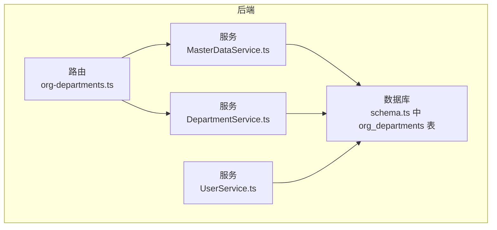
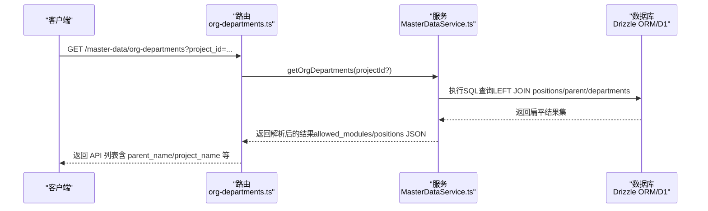
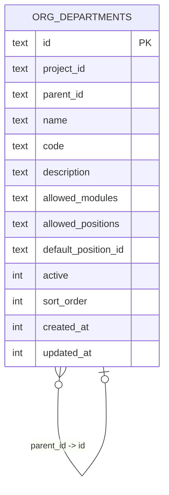
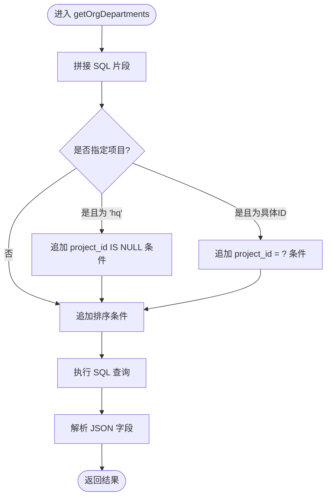
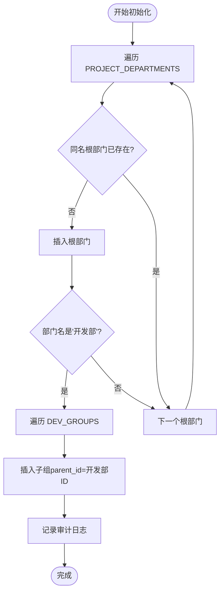
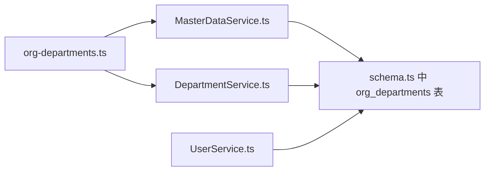

# 组织架构树形结构

<cite>
**本文引用的文件**
- [org-departments.ts](file://backend/src/routes/master-data/org-departments.ts)
- [MasterDataService.ts](file://backend/src/services/MasterDataService.ts)
- [DepartmentService.ts](file://backend/src/services/DepartmentService.ts)
- [schema.ts](file://backend/src/db/schema.ts)
- [master-data.schema.ts](file://backend/src/schemas/master-data.schema.ts)
- [DepartmentService.test.ts](file://backend/test/services/DepartmentService.test.ts)
- [UserService.ts](file://backend/src/services/UserService.ts)
</cite>

## 目录
1. [引言](#引言)
2. [项目结构](#项目结构)
3. [核心组件](#核心组件)
4. [架构总览](#架构总览)
5. [详细组件分析](#详细组件分析)
6. [依赖关系分析](#依赖关系分析)
7. [性能考量](#性能考量)
8. [故障排查指南](#故障排查指南)
9. [结论](#结论)

## 引言
本文件围绕组织架构树形结构展开，系统性说明 org_departments 表通过 parentId 字段实现的无限层级嵌套能力；解释如何通过一次 SQL 查询与业务层映射构建完整树；结合 MasterDataService.getOrgDepartments 方法展示按项目维度查询与层级排序；并阐述“开发部”自动创建子组（前端组、后端组等）的实现逻辑。最后给出最佳实践、性能优化建议与常见查询模式，帮助读者在实际项目中高效构建与维护树形组织架构。

## 项目结构
组织架构相关的核心文件分布如下：
- 数据模型：backend/src/db/schema.ts 定义了 org_departments 表结构，包含 id、project_id、parent_id、name、code、description、allowed_modules、allowed_positions、default_position_id、active、sort_order 等字段。
- 服务层：backend/src/services/MasterDataService.ts 提供查询组织部门列表与详情的能力；backend/src/services/DepartmentService.ts 负责默认组织部门的初始化与“开发部”子组的自动创建。
- 路由层：backend/src/routes/master-data/org-departments.ts 对外暴露组织部门列表与详情接口，并将服务层结果映射为 API 响应。
- 校验与类型：backend/src/schemas/master-data.schema.ts 定义了组织部门的请求/响应 Schema。
- 测试用例：backend/test/services/DepartmentService.test.ts 验证默认部门创建与子组生成逻辑。
- 用户服务：backend/src/services/UserService.ts 展示如何识别用户所在部门是否为子组（parent_id 非空）。

图表来源
- [org-departments.ts](file://backend/src/routes/master-data/org-departments.ts#L1-L125)
- [MasterDataService.ts](file://backend/src/services/MasterDataService.ts#L548-L606)
- [DepartmentService.ts](file://backend/src/services/DepartmentService.ts#L76-L151)
- [schema.ts](file://backend/src/db/schema.ts#L102-L116)
- [UserService.ts](file://backend/src/services/UserService.ts#L123-L151)

章节来源
- [org-departments.ts](file://backend/src/routes/master-data/org-departments.ts#L1-L125)
- [MasterDataService.ts](file://backend/src/services/MasterDataService.ts#L548-L606)
- [DepartmentService.ts](file://backend/src/services/DepartmentService.ts#L76-L151)
- [schema.ts](file://backend/src/db/schema.ts#L102-L116)
- [master-data.schema.ts](file://backend/src/schemas/master-data.schema.ts#L155-L169)
- [DepartmentService.test.ts](file://backend/test/services/DepartmentService.test.ts#L1-L59)
- [UserService.ts](file://backend/src/services/UserService.ts#L123-L151)

## 核心组件
- 数据表结构：org_departments 表通过 parent_id 实现父子关系，支持无限层级嵌套；project_id 可为空（总部级）或指向具体项目；active 控制启用状态；sort_order 用于层级内排序。
- 服务查询：MasterDataService.getOrgDepartments 支持按项目过滤（支持 'hq' 特殊值），返回结果包含父部门名、默认职位名、项目名等扩展信息，并对 allowed_modules/allowed_positions 进行 JSON 解析。
- 默认部门初始化：DepartmentService.createDefaultOrgDepartments 在新项目初始化时批量插入默认部门；当部门名为“开发部”时，自动为其创建一组子组（前端组、后端组、测试组、产品组、美术组、运维组），并设置相应的 allowed_modules/allowed_positions/default_position_id。
- 路由接口：org-departments 路由提供列表与详情接口，调用 MasterDataService 并进行字段映射。
- 类型与校验：master-data.schema.ts 定义了组织部门的字段约束与可选扩展字段（如 parent_name、project_name）。

章节来源
- [schema.ts](file://backend/src/db/schema.ts#L102-L116)
- [MasterDataService.ts](file://backend/src/services/MasterDataService.ts#L548-L606)
- [DepartmentService.ts](file://backend/src/services/DepartmentService.ts#L76-L151)
- [org-departments.ts](file://backend/src/routes/master-data/org-departments.ts#L1-L125)
- [master-data.schema.ts](file://backend/src/schemas/master-data.schema.ts#L155-L169)

## 架构总览
组织架构树形结构的端到端流程如下：
- 路由层接收请求，解析 project_id 参数；
- 调用 MasterDataService.getOrgDepartments 获取扁平化列表；
- 服务层执行一次 SQL 查询，使用 LEFT JOIN 关联 positions、org_departments、departments，按项目优先、sort_order、name 排序；
- 返回的数据在路由层映射为 API 结构；
- 前端根据 parentId 将扁平数据转换为树形结构。

图表来源
- [org-departments.ts](file://backend/src/routes/master-data/org-departments.ts#L36-L79)
- [MasterDataService.ts](file://backend/src/services/MasterDataService.ts#L548-L606)

章节来源
- [org-departments.ts](file://backend/src/routes/master-data/org-departments.ts#L36-L79)
- [MasterDataService.ts](file://backend/src/services/MasterDataService.ts#L548-L606)

## 详细组件分析

### 数据模型与树形结构
- 表结构要点
  - 主键 id：唯一标识每个组织部门
  - project_id：项目标识，可为空（总部级）
  - parent_id：父节点 id，空表示根节点
  - allowed_modules/allowed_positions：JSON 字符串，分别表示模块权限与允许的职位集合
  - default_position_id：默认职位 id
  - active/sort_order：启用状态与排序权重
- 树形层级
  - 任意节点的 parent_id 指向其直接父节点
  - 通过递归遍历或一次性扁平查询+映射即可还原整棵树
  - 支持无限层级嵌套，仅受数据库与应用内存限制

图表来源
- [schema.ts](file://backend/src/db/schema.ts#L102-L116)

章节来源
- [schema.ts](file://backend/src/db/schema.ts#L102-L116)

### 查询与排序：MasterDataService.getOrgDepartments
- 查询范围
  - 支持按项目过滤，传入 'hq' 表示总部级部门；传入具体项目 id 过滤该项目下的部门；未传参则返回所有启用的部门。
- 关联与扩展
  - LEFT JOIN positions 获取 default_position_name
  - LEFT JOIN org_departments 获取 parent.name（父部门名）
  - LEFT JOIN departments 获取 project.name（项目名）
- 排序规则
  - 先按 project_id 是否为空（总部优先于项目），再按 sort_order 升序，最后按 name 升序
- 输出处理
  - 将 allowed_modules/allowed_positions 从 JSON 字符串解析为对象数组或 null

图表来源
- [MasterDataService.ts](file://backend/src/services/MasterDataService.ts#L548-L606)

章节来源
- [MasterDataService.ts](file://backend/src/services/MasterDataService.ts#L548-L606)

### 默认部门初始化与“开发部”子组
- 初始化流程
  - 遍历 PROJECT_DEPARTMENTS 配置，按项目或总部（project_id 为空）检查是否存在同名且启用的根部门
  - 若不存在则插入根部门，并记录审计日志
- “开发部”子组自动创建
  - 当部门名为“开发部”时，循环 DEV_GROUPS 配置，以当前开发部 id 作为 parent_id 插入各子组
  - 子组设置默认 allowed_modules/allowed_positions/default_position_id，便于后续权限与职位绑定

图表来源
- [DepartmentService.ts](file://backend/src/services/DepartmentService.ts#L76-L151)

章节来源
- [DepartmentService.ts](file://backend/src/services/DepartmentService.ts#L76-L151)
- [DepartmentService.test.ts](file://backend/test/services/DepartmentService.test.ts#L1-L59)

### 路由层：组织部门列表与详情
- 列表接口
  - 请求参数：project_id（可选）
  - 响应：results 数组，包含 id、project_id、parentId、name、code、description、allowed_modules、allowed_positions、default_position_id、active、sortOrder、default_position_name、parent_name、project_name 等
- 详情接口
  - 请求参数：id
  - 响应：单个组织部门对象，包含扩展字段 default_position_name

章节来源
- [org-departments.ts](file://backend/src/routes/master-data/org-departments.ts#L1-L125)

### 用户服务中的子组识别
- 通过查询 org_departments 表，判断某员工所在部门的 parent_id 是否非空，从而识别该部门是否为子组（团队级）。

章节来源
- [UserService.ts](file://backend/src/services/UserService.ts#L123-L151)

## 依赖关系分析
- 路由依赖服务：org-departments 路由依赖 MasterDataService 进行查询，依赖 DepartmentService 进行默认部门初始化。
- 服务依赖数据库：MasterDataService 使用 Drizzle ORM 的 sql 模板与 db.run 执行原生 SQL；DepartmentService 使用 Drizzle ORM 的 insert/select 等操作。
- 数据模型依赖：org_departments 表被多处服务与路由引用，形成强耦合但职责清晰的分层。

图表来源
- [org-departments.ts](file://backend/src/routes/master-data/org-departments.ts#L1-L125)
- [MasterDataService.ts](file://backend/src/services/MasterDataService.ts#L548-L606)
- [DepartmentService.ts](file://backend/src/services/DepartmentService.ts#L76-L151)
- [schema.ts](file://backend/src/db/schema.ts#L102-L116)
- [UserService.ts](file://backend/src/services/UserService.ts#L123-L151)

章节来源
- [org-departments.ts](file://backend/src/routes/master-data/org-departments.ts#L1-L125)
- [MasterDataService.ts](file://backend/src/services/MasterDataService.ts#L548-L606)
- [DepartmentService.ts](file://backend/src/services/DepartmentService.ts#L76-L151)
- [schema.ts](file://backend/src/db/schema.ts#L102-L116)
- [UserService.ts](file://backend/src/services/UserService.ts#L123-L151)

## 性能考量
- 单次扁平查询构建树
  - 采用一次 SQL 查询返回扁平结果，避免 N+1 查询问题；随后在业务层或前端按 parentId 组装树，时间复杂度 O(n)，空间复杂度 O(n)。
- 排序与索引
  - 排序基于 project_id IS NULL 优先、sort_order、name，建议在 sort_order 与 project_id 上建立复合索引以提升查询性能。
- JSON 字段解析
  - allowed_modules/allowed_positions 为 JSON 字符串，服务层统一解析为对象数组或 null，避免重复解析与字符串比较。
- 分页与过滤
  - 当前实现返回全量启用部门；若数据量较大，建议引入分页与按需过滤（如按项目、按名称关键字）。
- 缓存策略
  - 对于不频繁变动的组织架构，可在应用层缓存查询结果，设置合理过期时间，降低数据库压力。

[本节为通用性能建议，无需特定文件引用]

## 故障排查指南
- 部门不存在
  - 详情查询未命中时会抛出“部门不存在”的错误；请确认 id 是否正确、是否已被禁用（active=0）。
- 子组缺失
  - 若“开发部”缺少子组，请检查 DepartmentService 是否成功执行默认初始化；可通过测试用例验证子组数量与名称。
- 权限字段异常
  - allowed_modules/allowed_positions 为 JSON 字符串，若前端期望对象，请确认服务层解析逻辑是否生效；同时检查路由层映射是否正确。
- 用户所属子组识别失败
  - 若用户所在部门被识别为子组（parent_id 非空），请确认该部门确实挂载在“开发部”之下，且 parent_id 正确。

章节来源
- [MasterDataService.ts](file://backend/src/services/MasterDataService.ts#L585-L606)
- [DepartmentService.test.ts](file://backend/test/services/DepartmentService.test.ts#L1-L59)
- [UserService.ts](file://backend/src/services/UserService.ts#L123-L151)

## 结论
本项目通过 org_departments 表的 parent_id 字段实现了灵活的无限层级树形组织架构。MasterDataService 的一次 SQL 查询与排序策略，配合 DepartmentService 的默认初始化与“开发部”子组自动创建机制，形成了从数据建模到业务落地的完整闭环。建议在生产环境中关注索引设计、JSON 字段解析一致性与缓存策略，以确保大规模场景下的性能与稳定性。