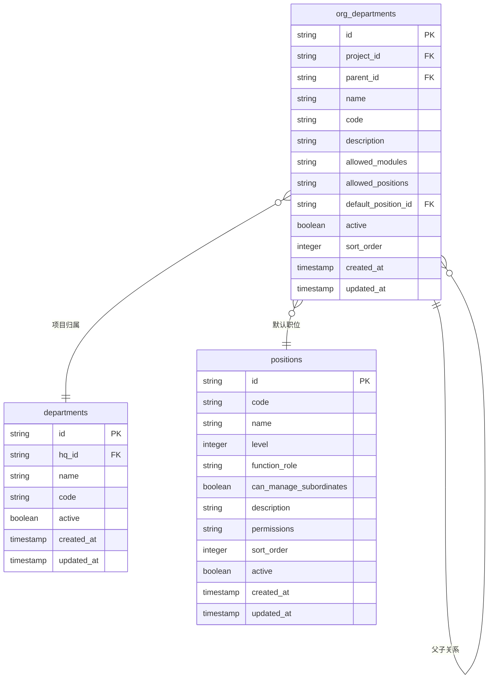
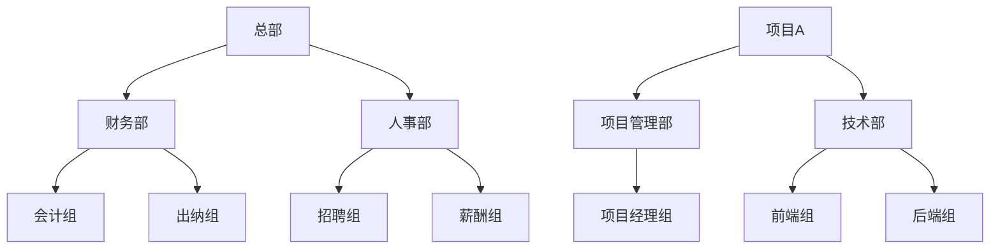
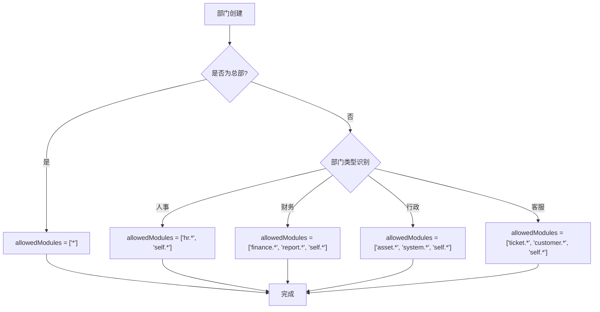
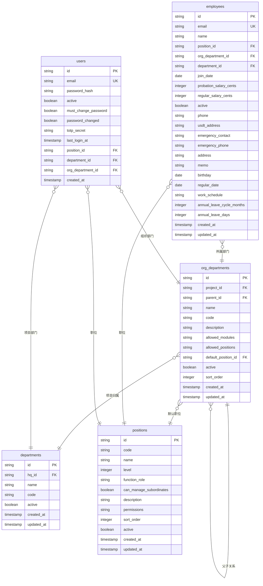

# 组织部门数据模型

<cite>
**本文档引用的文件**   
- [schema.ts](file://backend/src/db/schema.ts)
- [org-departments.ts](file://backend/src/routes/master-data/org-departments.ts)
- [master-data.schema.ts](file://backend/src/schemas/master-data.schema.ts)
- [MasterDataService.ts](file://backend/src/services/MasterDataService.ts)
- [schema.sql](file://backend/src/db/schema.sql)
- [migration_department_modules.sql](file://backend/src/db/archive/migration_department_modules.sql)
- [migration_dept_positions.sql](file://backend/src/db/archive/migration_dept_positions.sql)
</cite>

## 目录
1. [简介](#简介)
2. [核心表结构](#核心表结构)
3. [字段定义详解](#字段定义详解)
4. [组织架构设计](#组织架构设计)
5. [权限控制机制](#权限控制机制)
6. [数据库关系图](#数据库关系图)

## 简介
组织部门数据模型是系统权限和组织架构管理的核心。该模型通过`org_departments`表实现多层级的组织架构管理，支持项目和总部两种实体类型。每个组织部门可独立配置可访问的功能模块和可用职位范围，实现精细化的权限控制。该模型与员工、职位等核心业务数据紧密关联，为系统提供灵活的组织管理能力。

## 核心表结构
`org_departments`表是组织部门数据模型的核心，存储所有组织部门的详细信息。该表通过`projectId`字段区分项目部门和总部部门，通过`parentId`字段实现树形结构的多层级管理。`allowedModules`和`allowedPositions`两个JSON字段提供了灵活的权限配置能力。

**图表来源**
- [schema.sql](file://backend/src/db/schema.sql#L78-L93)
- [schema.ts](file://backend/src/db/schema.ts#L102-L116)

## 字段定义详解
`org_departments`表包含以下关键字段：

**id**: 部门唯一标识符，使用UUID格式，作为主键。

**projectId**: 项目ID，关联`departments`表。当值为NULL时，表示该部门属于总部；当有具体值时，表示该部门属于特定项目。

**parentId**: 父级部门ID，实现树形结构的多层级管理。通过此字段可以构建无限层级的组织架构。

**name**: 部门名称，必填字段，用于标识部门。

**code**: 部门代码，可选字段，用于系统内部标识。

**description**: 部门描述，可选字段，提供部门的详细说明。

**allowedModules**: 允许访问的功能模块，JSON格式字符串。配置该部门可访问的功能模块，如`finance.ar`、`self.*`等。

**allowedPositions**: 允许使用的职位，JSON格式字符串。限制该部门内可用的职位范围。

**defaultPositionId**: 默认职位ID，关联`positions`表。新员工加入该部门时的默认职位。

**active**: 状态标识，1表示启用，0表示禁用。

**sortOrder**: 排序序号，用于控制部门在列表中的显示顺序。

**createdAt** 和 **updatedAt**: 创建时间和更新时间戳。

**Section sources**
- [schema.ts](file://backend/src/db/schema.ts#L102-L116)
- [schema.sql](file://backend/src/db/schema.sql#L78-L93)

## 组织架构设计
组织部门模型采用树形结构设计，通过`parentId`字段实现多层级的部门管理。这种设计支持无限层级的组织架构，能够满足复杂企业的组织管理需求。

### 树形结构实现
树形结构通过`parentId`字段实现，每个部门可以有零个或多个子部门，同时只能有一个父部门。根节点部门的`parentId`为NULL。这种设计允许构建复杂的组织架构，如：
- 总部
  - 财务部
    - 会计组
    - 出纳组
  - 人事部
    - 招聘组
    - 薪酬组

### 项目与总部的区别
系统中存在两种类型的部门实体：项目和总部。

**departments表**（项目/总部）：代表项目或总部实体，是组织架构的顶层容器。每个项目或总部可以包含多个组织部门。

**org_departments表**（组织部门）：代表项目内的具体组织架构部门，是实际的业务部门。组织部门必须归属于某个项目或总部。

这种设计将项目/总部的实体管理与内部组织架构管理分离，提供了更高的灵活性和可扩展性。

**图表来源**
- [MasterDataService.ts](file://backend/src/services/MasterDataService.ts#L548-L607)
- [org-departments.ts](file://backend/src/routes/master-data/org-departments.ts)

## 权限控制机制
组织部门模型通过`allowedModules`和`allowedPositions`两个JSON字段实现精细化的权限控制。

### 功能模块控制
`allowedModules`字段控制部门可访问的功能模块。该字段存储JSON数组，包含允许访问的模块标识符。例如：
- `["hr.*", "self.*"]`：人事类部门，可访问人事模块和自我服务模块
- `["finance.*", "report.*", "self.*"]`：财务类部门，可访问财务模块、报表模块和自我服务模块
- `["*"]`：总部级部门，可访问所有模块

系统通过通配符`*`支持模块级别的权限控制，如`finance.ar`表示财务模块的应收管理功能。

### 职位范围限制
`allowedPositions`字段限制部门内可用的职位范围。该字段存储JSON数组，包含允许使用的职位ID。当部门配置了此字段后，该部门下的员工只能选择这些职位。

**图表来源**
- [migration_department_modules.sql](file://backend/src/db/archive/migration_department_modules.sql)
- [migration_dept_positions.sql](file://backend/src/db/archive/migration_dept_positions.sql)
- [MasterDataService.ts](file://backend/src/services/MasterDataService.ts#L472-L544)

## 数据库关系图
组织部门数据模型与其他核心表存在紧密的关系。

**图表来源**
- [schema.sql](file://backend/src/db/schema.sql)
- [schema.ts](file://backend/src/db/schema.ts)