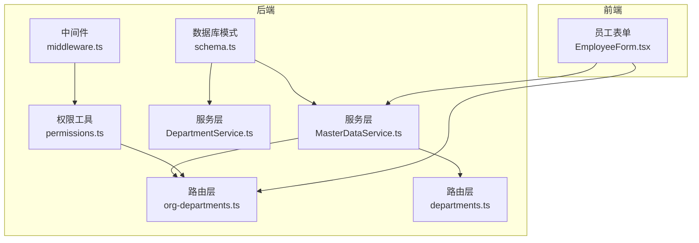
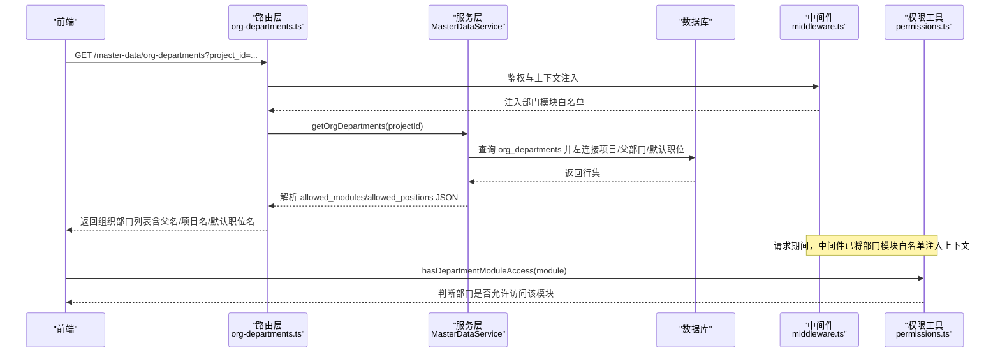
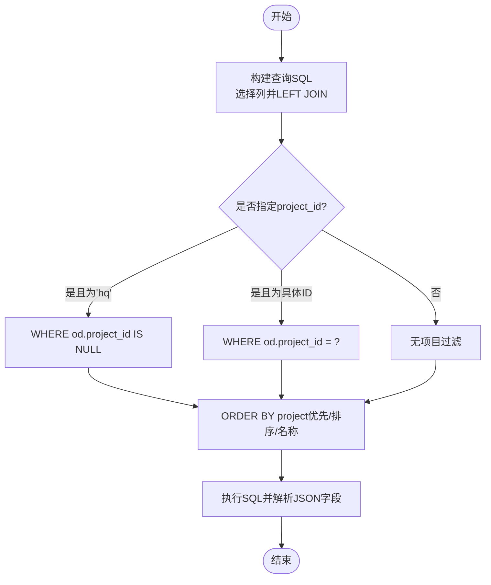
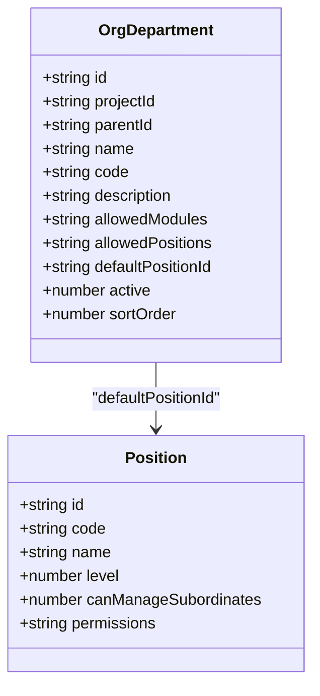
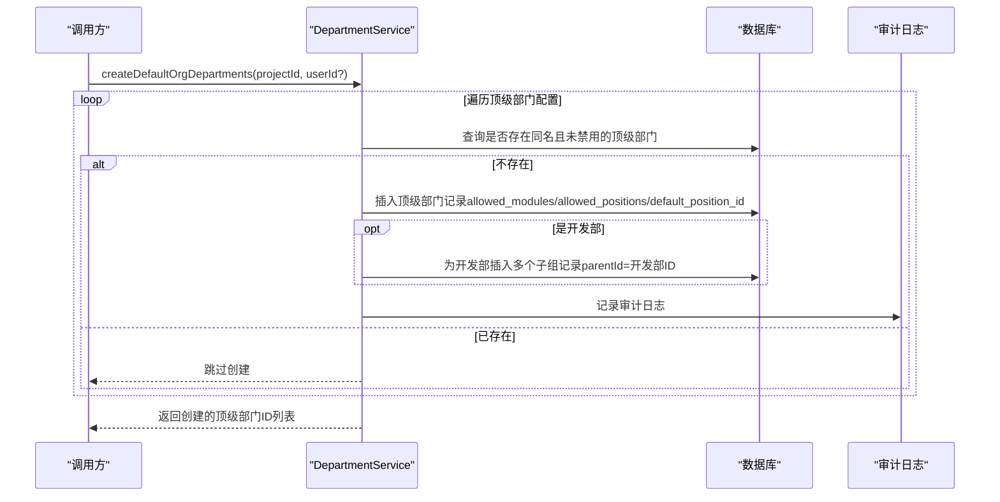
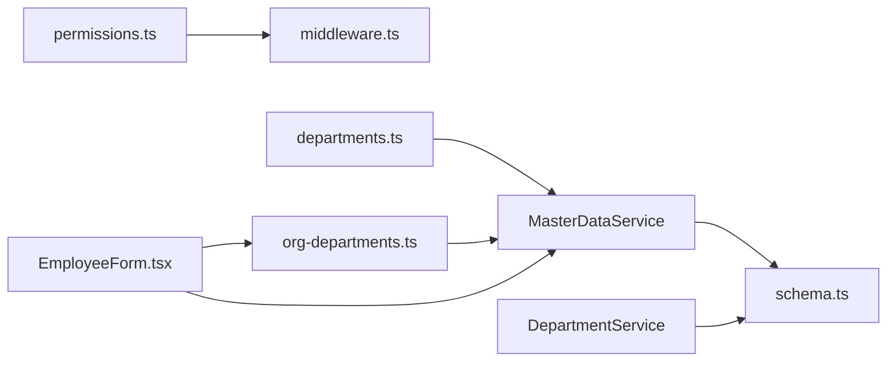

# 部门与组织架构

<cite>
**本文引用的文件**
- [schema.ts](file://backend/src/db/schema.ts)
- [DepartmentService.ts](file://backend/src/services/DepartmentService.ts)
- [MasterDataService.ts](file://backend/src/services/MasterDataService.ts)
- [org-departments.ts](file://backend/src/routes/master-data/org-departments.ts)
- [departments.ts](file://backend/src/routes/master-data/departments.ts)
- [permissions.ts](file://backend/src/utils/permissions.ts)
- [middleware.ts](file://backend/src/middleware.ts)
- [master-data.schema.ts](file://backend/src/schemas/master-data.schema.ts)
- [migration_department_modules.sql](file://backend/src/db/archive/migration_department_modules.sql)
- [migration_dept_positions.sql](file://backend/src/db/archive/migration_dept_positions.sql)
- [migration_create_support_depts.sql](file://backend/src/db/archive/migration_create_support_depts.sql)
- [EmployeeForm.tsx](file://frontend/src/features/employees/components/forms/EmployeeForm.tsx)
</cite>

## 目录
1. [简介](#简介)
2. [项目结构](#项目结构)
3. [核心组件](#核心组件)
4. [架构总览](#架构总览)
5. [详细组件分析](#详细组件分析)
6. [依赖分析](#依赖分析)
7. [性能考虑](#性能考虑)
8. [故障排查指南](#故障排查指南)
9. [结论](#结论)
10. [附录](#附录)

## 简介
本文件面向开发者与实施人员，系统性阐述财务系统中的“部门与组织架构”设计与实现，重点包括：
- departments 表（项目/总部）与 org_departments 表（组织部门）的差异与关联
- org_departments 的树形结构设计（parentId）与多层级管理能力
- allowed_modules 与 allowed_positions 两个 JSON 字段的业务用途与使用方式
- 结合 DepartmentService.createDefaultOrgDepartments 方法，说明新项目创建时如何自动初始化默认组织部门结构
- 查询组织架构树、验证部门权限与管理子部门的最佳实践

## 项目结构
围绕“部门与组织架构”的关键代码分布在以下模块：
- 数据库模式：定义 departments、org_departments 及其字段
- 服务层：MasterDataService 提供组织部门查询；DepartmentService 提供默认组织部门初始化
- 路由层：组织部门列表/详情接口
- 权限工具：基于部门模块白名单与职位权限的双重校验
- 中间件：在请求上下文中注入部门模块白名单，供权限校验使用
- 前端集成：员工表单中按项目/总部维度拉取组织部门与可用职位

图表来源
- [schema.ts](file://backend/src/db/schema.ts#L102-L116)
- [MasterDataService.ts](file://backend/src/services/MasterDataService.ts#L548-L607)
- [DepartmentService.ts](file://backend/src/services/DepartmentService.ts#L76-L151)
- [org-departments.ts](file://backend/src/routes/master-data/org-departments.ts#L1-L125)
- [departments.ts](file://backend/src/routes/master-data/departments.ts#L1-L327)
- [permissions.ts](file://backend/src/utils/permissions.ts#L44-L122)
- [middleware.ts](file://backend/src/middleware.ts#L63-L71)
- [EmployeeForm.tsx](file://frontend/src/features/employees/components/forms/EmployeeForm.tsx#L33-L56)

章节来源
- [schema.ts](file://backend/src/db/schema.ts#L102-L116)
- [MasterDataService.ts](file://backend/src/services/MasterDataService.ts#L548-L607)
- [DepartmentService.ts](file://backend/src/services/DepartmentService.ts#L76-L151)
- [org-departments.ts](file://backend/src/routes/master-data/org-departments.ts#L1-L125)
- [departments.ts](file://backend/src/routes/master-data/departments.ts#L1-L327)
- [permissions.ts](file://backend/src/utils/permissions.ts#L44-L122)
- [middleware.ts](file://backend/src/middleware.ts#L63-L71)
- [EmployeeForm.tsx](file://frontend/src/features/employees/components/forms/EmployeeForm.tsx#L33-L56)

## 核心组件
- departments 表（项目/总部）
  - 用于标识“项目”或“总部”的实体，通常作为 org_departments 的项目级根节点或 HQ 层级
  - 字段示例：id、hqId、name、code、active、createdAt、updatedAt
- org_departments 表（组织部门）
  - 树形组织结构的核心，支持多层级父子关系（parentId）
  - 关键字段：id、projectId（项目ID或为空表示总部）、parentId（父节点）、name、code、description、allowedModules（JSON字符串）、allowedPositions（JSON字符串）、defaultPositionId、active、sortOrder、createdAt、updatedAt
- MasterDataService
  - 提供组织部门查询（含树形排序、项目/HQ 过滤、左右连接获取项目名/父部门名等）
  - 提供可用职位查询（按部门 allowed_positions 过滤）
- DepartmentService
  - 新项目初始化默认组织部门结构（顶级部门+开发部子组），并记录审计日志
- 权限工具与中间件
  - 中间件将“部门允许的模块白名单”注入上下文
  - hasDepartmentModuleAccess 与 hasPermission 实现“部门模块白名单 × 职位权限”的双重校验

章节来源
- [schema.ts](file://backend/src/db/schema.ts#L73-L81)
- [schema.ts](file://backend/src/db/schema.ts#L102-L116)
- [MasterDataService.ts](file://backend/src/services/MasterDataService.ts#L548-L607)
- [MasterDataService.ts](file://backend/src/services/MasterDataService.ts#L466-L531)
- [DepartmentService.ts](file://backend/src/services/DepartmentService.ts#L76-L151)
- [permissions.ts](file://backend/src/utils/permissions.ts#L44-L122)
- [middleware.ts](file://backend/src/middleware.ts#L63-L71)

## 架构总览
组织架构的读取与权限校验流程如下：

图表来源
- [org-departments.ts](file://backend/src/routes/master-data/org-departments.ts#L36-L79)
- [MasterDataService.ts](file://backend/src/services/MasterDataService.ts#L548-L607)
- [middleware.ts](file://backend/src/middleware.ts#L63-L71)
- [permissions.ts](file://backend/src/utils/permissions.ts#L44-L122)

## 详细组件分析

### departments 表与 org_departments 表的差异与联系
- 差异
  - departments：用于“项目/总部”的概念实体，常作为 org_departments 的项目根节点或 HQ 层级
  - org_departments：组织部门树，支持多层级父子关系（parentId），并承载“功能模块白名单”和“职位白名单”
- 联系
  - org_departments.projectId 可指向 departments.id（项目），或为空表示总部层级
  - 查询时通过 LEFT JOIN departments 获取项目名称，便于前端展示

章节来源
- [schema.ts](file://backend/src/db/schema.ts#L73-L81)
- [schema.ts](file://backend/src/db/schema.ts#L102-L116)
- [MasterDataService.ts](file://backend/src/services/MasterDataService.ts#L548-L607)

### org_departments 的树形结构与多层级管理
- 设计要点
  - 通过 parentId 建立父子关系，支持任意层级
  - 排序通过 sortOrder 与 name 控制输出顺序
  - 支持按 project_id 过滤（含 HQ 场景：project_id 为空）
- 查询逻辑
  - getOrgDepartments：拼接 SQL，LEFT JOIN 获取项目名、父部门名、默认职位名，并对结果进行 allowed_modules/allowed_positions 的 JSON 解析
  - getOrgDepartment：按 id 查询并解析 JSON 字段

图表来源
- [MasterDataService.ts](file://backend/src/services/MasterDataService.ts#L548-L607)

章节来源
- [MasterDataService.ts](file://backend/src/services/MasterDataService.ts#L548-L607)

### allowed_modules 与 allowed_positions 的业务用途
- allowed_modules（JSON 字符串）
  - 定义部门可访问的功能模块集合，支持通配符（如 "finance.*"）
  - 中间件将部门模块白名单注入上下文，hasDepartmentModuleAccess 在权限校验前进行模块级放行判断
  - 若未配置，默认视为允许全部（["*"]）
- allowed_positions（JSON 字符串）
  - 定义部门内可用的职位 ID 白名单，用于限制员工入职时可选的职位范围
  - MasterDataService.getAvailablePositions 会根据部门配置过滤职位列表
- 迁移与默认值
  - migration_department_modules.sql 为 org_departments 添加 allowed_modules 并批量初始化
  - migration_dept_positions.sql 添加 allowed_positions 与 default_position_id
  - migration_create_support_depts.sql 为现有项目插入客服部等默认部门及其 allowed_modules/allowed_positions

图表来源
- [schema.ts](file://backend/src/db/schema.ts#L102-L116)
- [master-data.schema.ts](file://backend/src/schemas/master-data.schema.ts#L154-L169)
- [migration_department_modules.sql](file://backend/src/db/archive/migration_department_modules.sql#L1-L31)
- [migration_dept_positions.sql](file://backend/src/db/archive/migration_dept_positions.sql#L1-L12)
- [migration_create_support_depts.sql](file://backend/src/db/archive/migration_create_support_depts.sql#L39-L73)

章节来源
- [permissions.ts](file://backend/src/utils/permissions.ts#L44-L122)
- [MasterDataService.ts](file://backend/src/services/MasterDataService.ts#L466-L531)
- [master-data.schema.ts](file://backend/src/schemas/master-data.schema.ts#L154-L169)
- [migration_department_modules.sql](file://backend/src/db/archive/migration_department_modules.sql#L1-L31)
- [migration_dept_positions.sql](file://backend/src/db/archive/migration_dept_positions.sql#L1-L12)
- [migration_create_support_depts.sql](file://backend/src/db/archive/migration_create_support_depts.sql#L39-L73)

### 新项目创建时的默认组织部门初始化
- 触发时机
  - 通过 DepartmentService.createDefaultOrgDepartments(projectId, userId?) 实现
- 初始化策略
  - 顶级部门：固定清单（如项目管理部、项目人事、项目财务、项目行政、客服部、开发部）
  - 开发部：额外创建前端组、后端组、测试组、产品组、美术组、运维组等子组
  - 每个部门写入 allowed_modules、allowed_positions、default_position_id 等字段
  - 对每个创建的部门记录审计日志
- 注意事项
  - 仅在同项目/同名称且未被禁用的情况下去重创建
  - 子组的 parentId 指向对应顶级部门

图表来源
- [DepartmentService.ts](file://backend/src/services/DepartmentService.ts#L76-L151)

章节来源
- [DepartmentService.ts](file://backend/src/services/DepartmentService.ts#L76-L151)

### 查询组织架构树、验证部门权限与管理子部门的最佳实践
- 查询组织架构树
  - 使用 MasterDataService.getOrgDepartments(projectId?)，传入 "hq" 表示总部层级
  - 输出包含 parent_name、project_name、default_position_name，便于前端渲染树形结构
- 验证部门权限
  - 中间件已将部门模块白名单注入上下文
  - 使用 hasDepartmentModuleAccess(module) 判断模块是否在白名单内
  - 再使用 hasPermission(module, subModule, action) 判断职位是否具备该操作权限
- 管理子部门
  - 创建子部门时设置 parentId 指向父部门
  - 通过 sortOrder 控制同级排序
  - 如需限制子部门可用职位，可在子部门配置 allowed_positions
- 前端集成
  - 员工表单按项目/总部维度拉取组织部门列表与可用职位
  - 通过 api.orgDepartments?project_id=... 与 api.positionsAvailable?org_departmentId=... 获取数据

章节来源
- [MasterDataService.ts](file://backend/src/services/MasterDataService.ts#L548-L607)
- [permissions.ts](file://backend/src/utils/permissions.ts#L44-L122)
- [middleware.ts](file://backend/src/middleware.ts#L63-L71)
- [EmployeeForm.tsx](file://frontend/src/features/employees/components/forms/EmployeeForm.tsx#L33-L56)

## 依赖分析
- 组件耦合
  - MasterDataService 依赖 schema.ts 中的表定义与 drizzle-orm 查询
  - DepartmentService 依赖 org_departments 表与审计日志工具
  - 路由层依赖服务层与权限工具
  - 中间件依赖会话与职位信息，向权限工具提供部门模块白名单
- 外部依赖
  - 前端通过 API 调用后端接口，依赖 OpenAPI 路由与 schema 校验

图表来源
- [MasterDataService.ts](file://backend/src/services/MasterDataService.ts#L548-L607)
- [DepartmentService.ts](file://backend/src/services/DepartmentService.ts#L76-L151)
- [org-departments.ts](file://backend/src/routes/master-data/org-departments.ts#L1-L125)
- [departments.ts](file://backend/src/routes/master-data/departments.ts#L1-L327)
- [permissions.ts](file://backend/src/utils/permissions.ts#L44-L122)
- [middleware.ts](file://backend/src/middleware.ts#L63-L71)
- [EmployeeForm.tsx](file://frontend/src/features/employees/components/forms/EmployeeForm.tsx#L33-L56)

章节来源
- [MasterDataService.ts](file://backend/src/services/MasterDataService.ts#L548-L607)
- [DepartmentService.ts](file://backend/src/services/DepartmentService.ts#L76-L151)
- [org-departments.ts](file://backend/src/routes/master-data/org-departments.ts#L1-L125)
- [departments.ts](file://backend/src/routes/master-data/departments.ts#L1-L327)
- [permissions.ts](file://backend/src/utils/permissions.ts#L44-L122)
- [middleware.ts](file://backend/src/middleware.ts#L63-L71)
- [EmployeeForm.tsx](file://frontend/src/features/employees/components/forms/EmployeeForm.tsx#L33-L56)

## 性能考虑
- 查询优化
  - 组织部门查询使用 LEFT JOIN 获取项目名/父部门名/默认职位名，建议在相关列建立索引以提升排序与连接性能
  - JSON 字段解析（allowed_modules/allowed_positions）在服务层完成，避免前端重复解析
- 缓存与会话
  - 中间件通过 KV 缓存会话与用户信息，减少数据库压力
- 分页与过滤
  - 前端在拉取组织部门列表时可传入 project_id，减少不必要的全量数据传输

[本节为通用建议，无需特定文件来源]

## 故障排查指南
- 问题：部门模块白名单未生效
  - 检查中间件是否正确注入 departmentModules
  - 确认 hasDepartmentModuleAccess 的调用路径
- 问题：职位不可见或不可选
  - 检查 org_departments.allowed_positions 是否配置了允许的职位 ID
  - 确认 MasterDataService.getAvailablePositions 的过滤逻辑
- 问题：新增子部门后树形显示异常
  - 检查 parentId 设置是否正确
  - 检查 sortOrder 与 name 排序是否符合预期
- 问题：新项目未生成默认组织部门
  - 检查 DepartmentService.createDefaultOrgDepartments 的调用时机与 projectId
  - 确认去重逻辑（同项目/同名/未禁用）是否命中

章节来源
- [middleware.ts](file://backend/src/middleware.ts#L63-L71)
- [permissions.ts](file://backend/src/utils/permissions.ts#L44-L122)
- [MasterDataService.ts](file://backend/src/services/MasterDataService.ts#L466-L531)
- [DepartmentService.ts](file://backend/src/services/DepartmentService.ts#L76-L151)

## 结论
本系统通过 departments 与 org_departments 的分层设计，实现了“项目/总部”与“组织部门树”的清晰分离。借助 allowed_modules 与 allowed_positions 的 JSON 字段，系统在功能模块与职位范围两方面提供了灵活而可控的权限边界。配合 DepartmentService 的默认初始化与 MasterDataService 的树形查询，开发者可以快速搭建并维护多项目的组织架构，同时通过中间件与权限工具确保访问控制的一致性与安全性。

[本节为总结，无需特定文件来源]

## 附录
- 关键字段说明
  - org_departments.allowedModules：部门可访问模块白名单（JSON 字符串，支持通配符）
  - org_departments.allowedPositions：部门可用职位白名单（JSON 字符串，职位ID数组）
  - org_departments.defaultPositionId：新员工默认职位
- 迁移脚本参考
  - 允许模块初始化：migration_department_modules.sql
  - 职位白名单与默认职位：migration_dept_positions.sql
  - 客服部等默认部门：migration_create_support_depts.sql

章节来源
- [migration_department_modules.sql](file://backend/src/db/archive/migration_department_modules.sql#L1-L31)
- [migration_dept_positions.sql](file://backend/src/db/archive/migration_dept_positions.sql#L1-L12)
- [migration_create_support_depts.sql](file://backend/src/db/archive/migration_create_support_depts.sql#L39-L73)