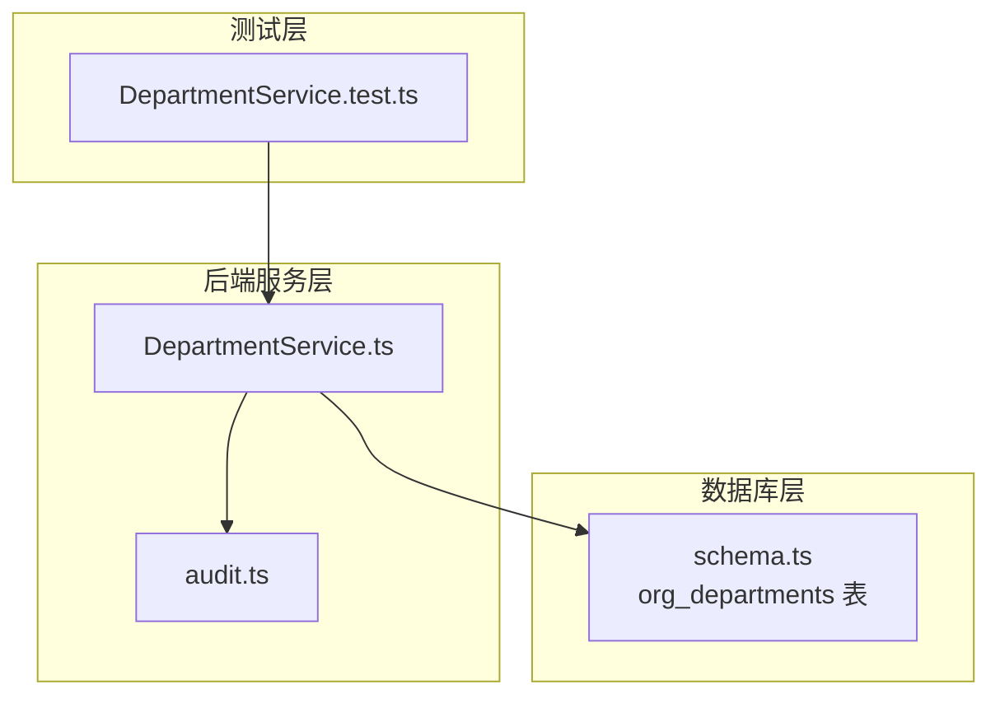
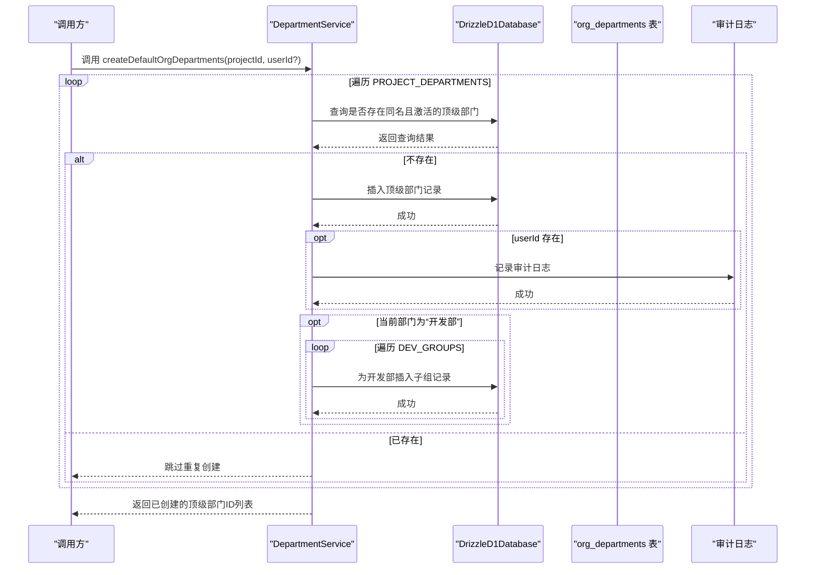
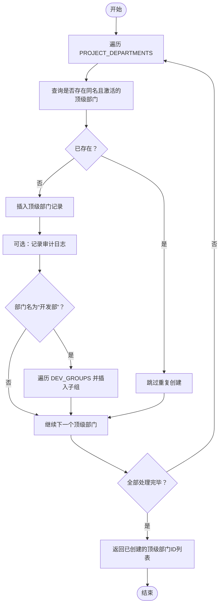
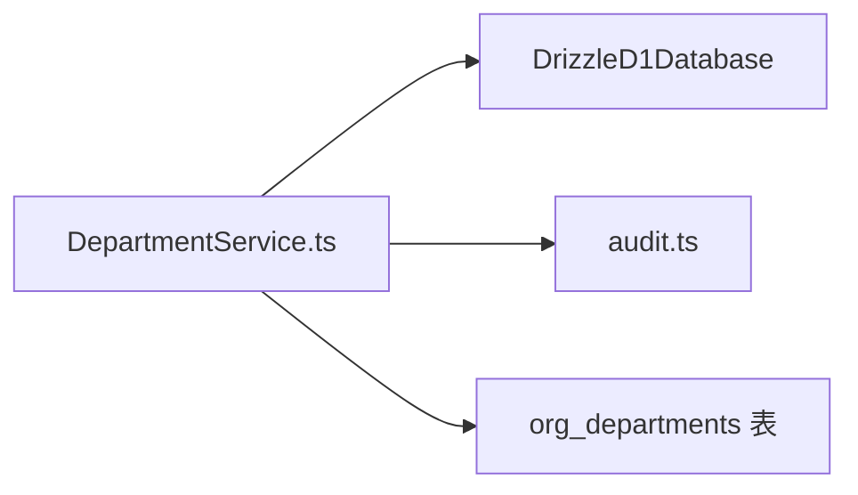

# 部门初始化与默认配置

<cite>
**本文引用的文件列表**
- [DepartmentService.ts](file://backend/src/services/DepartmentService.ts)
- [DepartmentService.test.ts](file://backend/test/services/DepartmentService.test.ts)
- [schema.ts](file://backend/src/db/schema.ts)
- [audit.ts](file://backend/src/utils/audit.ts)
</cite>

## 目录
1. [引言](#引言)
2. [项目结构](#项目结构)
3. [核心组件](#核心组件)
4. [架构总览](#架构总览)
5. [详细组件分析](#详细组件分析)
6. [依赖关系分析](#依赖关系分析)
7. [性能考量](#性能考量)
8. [故障排查指南](#故障排查指南)
9. [结论](#结论)
10. [附录](#附录)

## 引言
本文件围绕“部门初始化与默认配置”主题，系统化阐述 DepartmentService.createDefaultOrgDepartments 方法如何为新项目自动创建标准的默认部门结构（例如项目管理部、项目人事、项目财务、项目行政、客服部、开发部），以及开发部的特殊处理逻辑（自动初始化前端组、后端组等子组）。文档同时结合测试用例说明该方法的幂等性设计，确保重复调用不会产生重复数据；并提供初始化流程的时序图与最佳实践建议，帮助读者快速理解与正确使用该功能。

## 项目结构
与“部门初始化与默认配置”直接相关的核心文件与职责如下：
- 后端服务层：DepartmentService.ts 定义了默认部门常量与创建逻辑
- 数据库模式：schema.ts 定义了 org_departments 表结构
- 审计日志：audit.ts 提供审计日志记录能力
- 测试用例：DepartmentService.test.ts 验证默认部门创建与幂等性

图表来源
- [DepartmentService.ts](file://backend/src/services/DepartmentService.ts#L1-L152)
- [schema.ts](file://backend/src/db/schema.ts#L102-L116)
- [audit.ts](file://backend/src/utils/audit.ts#L36-L91)
- [DepartmentService.test.ts](file://backend/test/services/DepartmentService.test.ts#L1-L59)

章节来源
- [DepartmentService.ts](file://backend/src/services/DepartmentService.ts#L1-L152)
- [schema.ts](file://backend/src/db/schema.ts#L102-L116)
- [audit.ts](file://backend/src/utils/audit.ts#L36-L91)
- [DepartmentService.test.ts](file://backend/test/services/DepartmentService.test.ts#L1-L59)

## 核心组件
- 默认部门常量 PROJECT_DEPARTMENTS：定义项目级默认部门的标准配置（名称、编码、排序、模块权限、默认岗位等）
- 开发部子组常量 DEV_GROUPS：定义开发部下的子组（前端组、后端组、测试组、产品组、美术组、运维组）
- DepartmentService.createDefaultOrgDepartments：核心创建方法，负责按 PROJECT_DEPARTMENTS 逐个创建部门，并在遇到“开发部”时自动创建其子组
- 幂等性保障：通过查询同名部门是否存在，避免重复插入
- 审计日志：在成功创建每个部门后记录审计日志

章节来源
- [DepartmentService.ts](file://backend/src/services/DepartmentService.ts#L8-L74)
- [DepartmentService.ts](file://backend/src/services/DepartmentService.ts#L80-L151)
- [audit.ts](file://backend/src/utils/audit.ts#L36-L91)

## 架构总览
下图展示“默认部门初始化”的整体调用链路与数据流。

图表来源
- [DepartmentService.ts](file://backend/src/services/DepartmentService.ts#L80-L151)
- [schema.ts](file://backend/src/db/schema.ts#L102-L116)
- [audit.ts](file://backend/src/utils/audit.ts#L36-L91)

## 详细组件分析

### 默认部门配置常量 PROJECT_DEPARTMENTS
- 定义了项目级默认部门集合，包含以下关键字段：
  - 名称、编码、描述
  - allowed_modules（允许访问的模块）
  - allowed_positions（允许的岗位）
  - default_position_id（默认岗位ID）
  - sort_order（排序权重）
- 典型部门包括：项目管理部、项目人事、项目财务、项目行政、客服部、开发部
- 开发部的 default_position_id 为空，表示其作为父级组织单位，不直接绑定默认岗位

章节来源
- [DepartmentService.ts](file://backend/src/services/DepartmentService.ts#L8-L74)

### 开发部子组常量 DEV_GROUPS
- 定义开发部的子组集合，包含前端组、后端组、测试组、产品组、美术组、运维组
- 子组的 allowed_modules 通常设置为自管理模块，allowed_positions 包含团队负责人与工程师等角色
- 子组的 default_position_id 指向团队工程师，便于后续人员分配与权限继承

章节来源
- [DepartmentService.ts](file://backend/src/services/DepartmentService.ts#L66-L74)

### 创建默认部门的核心逻辑 createDefaultOrgDepartments
- 输入参数：
  - projectId：项目ID；若为 null 则创建总部级默认部门
  - userId：可选，用于审计日志记录
- 关键步骤：
  - 遍历 PROJECT_DEPARTMENTS
  - 查询是否存在同名且激活的顶级部门（parentId 为空，且 project_id 或 null 匹配）
  - 若不存在，则生成 UUID 并插入一条顶级部门记录，同时更新 createdIds
  - 若当前部门为“开发部”，则遍历 DEV_GROUPS，为开发部插入多个子组记录
  - 若 userId 存在，记录审计日志
  - 返回本次创建的顶级部门ID列表

图表来源
- [DepartmentService.ts](file://backend/src/services/DepartmentService.ts#L80-L151)

章节来源
- [DepartmentService.ts](file://backend/src/services/DepartmentService.ts#L80-L151)

### 幂等性设计与测试验证
- 幂等性保障机制：
  - 在插入前执行“按名称+项目ID+顶级部门”条件查询，若存在则跳过插入
  - 通过“同名且激活”的约束，避免重复数据
- 测试用例验证：
  - 首次调用 createDefaultOrgDepartments 后，统计 org_departments 数量
  - 再次调用后数量不变，证明幂等性生效

章节来源
- [DepartmentService.test.ts](file://backend/test/services/DepartmentService.test.ts#L45-L58)

### 审计日志集成
- 在成功创建每个顶级部门后，若传入 userId，则调用审计日志工具记录一次审计事件
- 审计内容包含项目ID、部门名称与编码等关键信息，便于后续审计与追溯

章节来源
- [DepartmentService.ts](file://backend/src/services/DepartmentService.ts#L138-L146)
- [audit.ts](file://backend/src/utils/audit.ts#L36-L91)

### 数据模型与表结构
- org_departments 表字段要点：
  - id、project_id、parent_id、name、code、description
  - allowed_modules、allowed_positions、default_position_id
  - active、sort_order、createdAt、updatedAt
- 顶级部门 parent_id 为空；子组 parent_id 指向对应父部门

章节来源
- [schema.ts](file://backend/src/db/schema.ts#L102-L116)

## 依赖关系分析
- 组件耦合与内聚：
  - DepartmentService 对数据库层（DrizzleD1Database）与审计工具（audit.ts）有直接依赖
  - 默认配置常量与业务逻辑内聚在服务类内部，便于维护与扩展
- 外部依赖与集成点：
  - 通过 Drizzle ORM 访问 SQLite 数据库
  - 通过审计工具记录审计日志，支持异步等待以避免阻塞请求
- 潜在循环依赖：
  - 服务层仅单向依赖审计工具，无循环依赖风险

图表来源
- [DepartmentService.ts](file://backend/src/services/DepartmentService.ts#L1-L152)
- [audit.ts](file://backend/src/utils/audit.ts#L36-L91)
- [schema.ts](file://backend/src/db/schema.ts#L102-L116)

章节来源
- [DepartmentService.ts](file://backend/src/services/DepartmentService.ts#L1-L152)
- [audit.ts](file://backend/src/utils/audit.ts#L36-L91)
- [schema.ts](file://backend/src/db/schema.ts#L102-L116)

## 性能考量
- 查询去重成本低：按项目ID、名称、激活状态与顶级部门条件查询，具备明确过滤条件，适合建立索引以优化性能
- 批量插入：顶级部门与子组均采用逐条插入，整体开销与部门数量线性相关
- 审计日志异步化：审计日志记录通过执行上下文等待机制异步提交，避免阻塞主流程
- 建议：
  - 为 org_departments 的 (project_id, name, parent_id, active) 组合建立复合索引，提升幂等性检查效率
  - 控制默认部门数量，避免一次性创建过多顶级部门导致批量插入压力

[本节为通用性能建议，无需特定文件来源]

## 故障排查指南
- 症状：重复调用 createDefaultOrgDepartments 后部门数量异常增长
  - 排查：确认幂等性检查条件是否满足（名称、项目ID、顶级部门、激活状态）
  - 参考：测试用例对幂等性的断言
- 症状：开发部未生成子组
  - 排查：确认当前部门名称为“开发部”，且 DEV_GROUPS 常量未被修改
  - 参考：开发部特殊处理逻辑
- 症状：审计日志缺失
  - 排查：确认调用时传入了 userId；检查审计工具是否正常工作
  - 参考：审计日志记录位置

章节来源
- [DepartmentService.test.ts](file://backend/test/services/DepartmentService.test.ts#L45-L58)
- [DepartmentService.ts](file://backend/src/services/DepartmentService.ts#L116-L136)
- [audit.ts](file://backend/src/utils/audit.ts#L36-L91)

## 结论
DepartmentService.createDefaultOrgDepartments 提供了标准化、可扩展、可审计的默认部门初始化能力。通过 PROJECT_DEPARTMENTS 与 DEV_GROUPS 常量定义标准配置，并在创建时进行幂等性检查，确保重复调用不会产生重复数据。开发部的特殊处理逻辑进一步完善了组织结构的完整性。配合审计日志与测试用例，该功能具备良好的可维护性与可验证性。

[本节为总结性内容，无需特定文件来源]

## 附录

### 最佳实践
- 在创建默认部门前，确保项目ID或总部标识正确传递，以便生成正确的默认部门层级
- 如需扩展默认部门，请在 PROJECT_DEPARTMENTS 中新增条目，并保持 allowed_modules、allowed_positions、default_position_id 的一致性
- 对于需要额外子组的部门，可在 DEV_GROUPS 类似的常量中定义，并在 createDefaultOrgDepartments 中增加对应的分支逻辑
- 生产环境建议开启审计日志，并为关键表建立合适的索引以提升查询性能

[本节为通用最佳实践，无需特定文件来源]