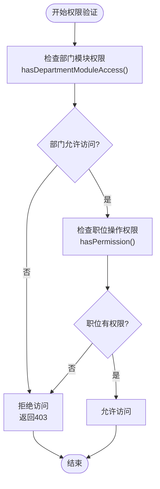
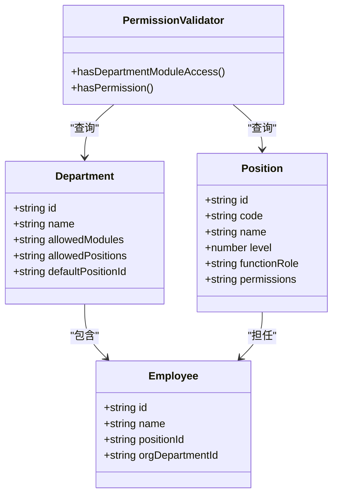
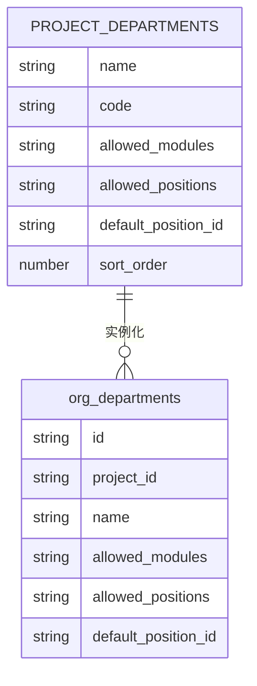
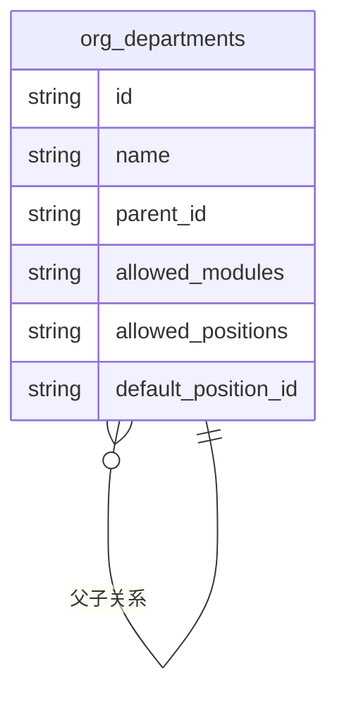
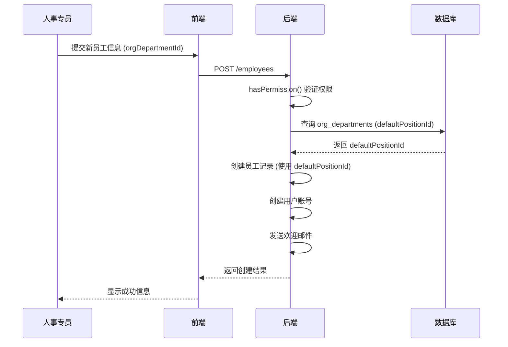

# 部门权限与模块控制

<cite>
**本文档引用文件**  
- [DepartmentService.ts](file://backend/src/services/DepartmentService.ts)
- [permissions.ts](file://backend/src/utils/permissions.ts)
- [master-data.schema.ts](file://backend/src/schemas/master-data.schema.ts)
- [EmployeeService.ts](file://backend/src/services/EmployeeService.ts)
- [org_departments](file://backend/db/schema.sql)
- [migration_dept_presets.sql](file://backend/db/archive/migration_dept_presets.sql)
- [migration_create_support_depts.sql](file://backend/db/archive/migration_create_support_depts.sql)
- [migration_dept_positions.sql](file://backend/db/archive/migration_dept_positions.sql)
</cite>

## 目录
1. [引言](#引言)
2. [核心字段说明](#核心字段说明)
3. [权限控制机制](#权限控制机制)
4. [配置示例分析](#配置示例分析)
5. [默认职位分配](#默认职位分配)
6. [最佳实践与配置模式](#最佳实践与配置模式)

## 引言

本系统通过精细化的部门权限与模块控制机制，实现组织架构与功能权限的深度隔离。核心在于`org_departments`表中的`allowedModules`、`allowedPositions`和`defaultPositionId`三个字段，它们共同构成了部门级权限控制的基础。该机制确保不同部门只能访问其职责范围内的功能模块，并限制其可分配的职位，从而保障系统的安全性与合规性。

**Section sources**
- [DepartmentService.ts](file://backend/src/services/DepartmentService.ts#L8-64)
- [master-data.schema.ts](file://backend/src/schemas/master-data.schema.ts#L157-L169)

## 核心字段说明

### allowedModules 字段

`allowedModules`字段是实现细粒度功能权限隔离的核心。它存储一个JSON格式的字符串数组，定义了该部门可以访问的功能模块列表。

- **数据类型**：`string`（JSON字符串）
- **作用**：控制部门可访问的功能模块，如`finance.ar`、`finance.ap`、`self.*`等。
- **通配符支持**：
  - `*`：表示允许访问所有模块。
  - `module.*`：表示允许访问该模块下的所有子模块。

例如，`["finance.*", "report.*", "self.*"]`表示该部门可以访问财务、报表和个人中心的所有功能。

**Section sources**
- [master-data.schema.ts](file://backend/src/schemas/master-data.schema.ts#L164)
- [permissions.ts](file://backend/src/utils/permissions.ts#L55-L78)

### allowedPositions 字段

`allowedPositions`字段用于限制部门内可分配的职位范围，确保组织架构的合规性。

- **数据类型**：`string`（JSON字符串）
- **作用**：定义该部门允许使用的职位ID列表，防止分配不符合部门职能的职位。
- **合规性保障**：通过预设的职位列表，确保部门内的职位分配符合公司组织架构和管理规范。

例如，`["pos-project-staff"]`表示该部门只能分配“项目专员”这一职位。

**Section sources**
- [master-data.schema.ts](file://backend/src/schemas/master-data.schema.ts#L165)
- [migration_dept_positions.sql](file://backend/db/archive/migration_dept_positions.sql#L7)

### defaultPositionId 字段

`defaultPositionId`字段在员工创建时起到关键作用，用于指定新员工的默认职位。

- **数据类型**：`string`（UUID）
- **作用**：当创建新员工时，若未明确指定职位，则自动分配此字段指定的默认职位。
- **自动化分配**：简化员工入职流程，确保新员工在创建时即拥有一个合理的初始职位。

例如，`pos-project-staff`作为默认职位，确保所有新加入的项目员工初始职位为“项目专员”。

**Section sources**
- [master-data.schema.ts](file://backend/src/schemas/master-data.schema.ts#L166)
- [migration_dept_positions.sql](file://backend/db/archive/migration_dept_positions.sql#L10)

## 权限控制机制

### 模块访问权限验证

系统的权限验证流程结合了部门允许的模块和职位的具体权限，采用“交集”原则进行判断。

**Diagram sources**
- [permissions.ts](file://backend/src/utils/permissions.ts#L88-L114)

#### 部门模块权限检查

`hasDepartmentModuleAccess`函数负责检查用户所在部门是否允许访问指定模块。

- **总部人员豁免**：`level=1`的总部人员不受部门模块限制，可访问所有模块。
- **通配符匹配**：支持`*`和`module.*`两种通配符，实现灵活的权限配置。
- **逻辑流程**：
  1. 若部门模块列表包含`*`，则允许访问。
  2. 否则，检查请求的模块是否精确匹配或前缀匹配列表中的任一模块。

#### 职位操作权限检查

`hasPermission`函数在通过部门检查后，进一步验证职位是否具有执行特定操作的权限。

- **权限结构**：基于`"module.subModule.action"`的三级结构。
- **数据来源**：从`positions`表的`permissions`字段中读取JSON配置。

### 部门与职位的协同控制

部门和职位的权限控制是协同工作的，共同决定最终的访问权限。

**Diagram sources**
- [org_departments](file://backend/db/schema.sql)
- [positions](file://backend/db/schema.sql)
- [permissions.ts](file://backend/src/utils/permissions.ts)

## 配置示例分析

### PROJECT_DEPARTMENTS 配置

`PROJECT_DEPARTMENTS`常量定义了项目级别的标准部门配置模板。

**Diagram sources**
- [DepartmentService.ts](file://backend/src/services/DepartmentService.ts#L9-L64)

#### 配置项详解

| 部门名称 | allowed_modules | allowed_positions | default_position_id | 说明 |
| :--- | :--- | :--- | :--- | :--- |
| 项目管理部 | `["*"]` | `["pos-project-manager", "pos-project-staff"]` | `pos-project-staff` | 拥有所有权限，可分配经理和专员 |
| 项目人事 | `["hr.*", "report.*", "self.*"]` | `["pos-project-staff"]` | `pos-project-staff` | 仅限人事、报表和个人中心 |
| 项目财务 | `["finance.*", "report.*", "self.*"]` | `["pos-project-staff"]` | `pos-project-staff` | 仅限财务、报表和个人中心 |
| 客服部 | `["finance.ar", "finance.ap", "self.*"]` | `["pos-project-staff"]` | `pos-project-staff` | 仅限应收、应付和个人中心 |

### DEV_GROUPS 配置

`DEV_GROUPS`常量定义了开发部的子组配置。

**Diagram sources**
- [DepartmentService.ts](file://backend/src/services/DepartmentService.ts#L67-L74)

#### 子组权限特点

- **父部门**：开发部 (`name='开发部'`)，`allowed_modules`为`["self.*"]`，仅限个人中心。
- **子部门**：前端组、后端组等，继承父部门的模块权限，但可拥有独立的`allowed_positions`。
- **示例**：后端组的`allowed_positions`为`["pos-team-leader", "pos-team-engineer"]`，允许分配组长和工程师。

### 数据库迁移脚本示例

数据库迁移脚本`migration_dept_presets.sql`和`migration_create_support_depts.sql`提供了生产环境的配置实例。

- **`migration_dept_presets.sql`**：为项目级部门（如`HR`、`FIN`）设置默认的`allowed_modules`和`allowed_positions`。
- **`migration_create_support_depts.sql`**：为多个项目的客服部（`CS`）批量插入配置，确保`allowed_modules`为`["finance.ar", "finance.ap", "self.*"]`。

这些脚本证明了该权限模型在实际部署中的应用。

**Section sources**
- [migration_dept_presets.sql](file://backend/db/archive/migration_dept_presets.sql#L37-L71)
- [migration_create_support_depts.sql](file://backend/db/archive/migration_create_support_depts.sql#L147-L253)

## 默认职位分配

`defaultPositionId`字段在员工创建流程中扮演着至关重要的角色。

**Diagram sources**
- [EmployeeService.ts](file://backend/src/services/EmployeeService.ts#L108-L138)
- [employees.ts](file://backend/src/routes/employees.ts#L118-L161)

### 实现逻辑

1. **API调用**：人事专员通过`/employees`接口创建新员工。
2. **权限验证**：系统首先验证操作者是否有`hr.employee.create`权限。
3. **获取默认职位**：`EmployeeService.create()`方法根据`orgDepartmentId`查询`org_departments`表，获取`defaultPositionId`。
4. **创建记录**：将获取到的`defaultPositionId`作为`positionId`插入`employees`表。
5. **关联用户**：同时在`users`表中创建关联的用户账号。

此流程确保了新员工在创建时即被正确地分配到符合其部门的默认职位，无需人工干预。

**Section sources**
- [EmployeeService.ts](file://backend/src/services/EmployeeService.ts#L68-L75)
- [employees.ts](file://backend/src/routes/employees.ts#L118-L161)

## 最佳实践与配置模式

### 权限验证最佳实践

1. **分层验证**：始终先检查部门模块权限，再检查职位操作权限。
2. **缓存优化**：将`allowedModules`和`permissions`等数据在用户登录时加载到内存或缓存中，避免频繁查询数据库。
3. **审计日志**：对所有权限相关的操作（如创建、更新部门）记录审计日志，便于追踪和审查。

### 常见配置模式

- **全权部门**：使用`["*"]`配置，适用于总部或超级管理员部门。
- **模块化部门**：使用`["module.*"]`配置，适用于财务、人事等职能明确的部门。
- **最小权限部门**：使用精确的模块列表，如`["finance.ar", "finance.ap"]`，适用于客服等需要严格限制权限的部门。
- **动态子组**：利用`parentId`创建部门层级，子部门可继承或覆盖父部门的权限。

通过遵循这些最佳实践和配置模式，可以构建一个既安全又灵活的部门权限控制系统。

**Section sources**
- [permissions.ts](file://backend/src/utils/permissions.ts)
- [DepartmentService.ts](file://backend/src/services/DepartmentService.ts)