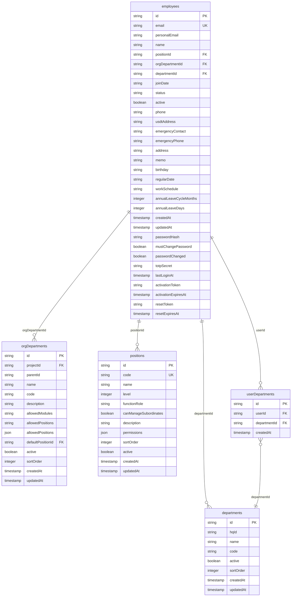
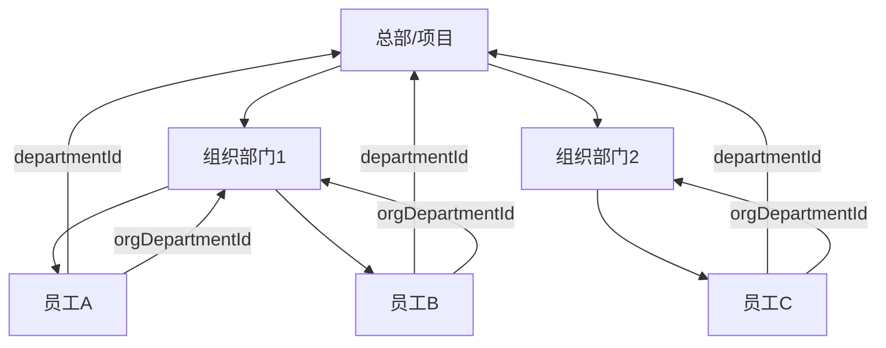
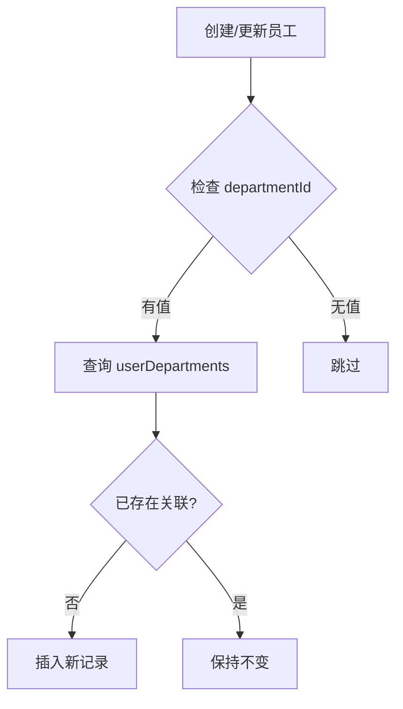
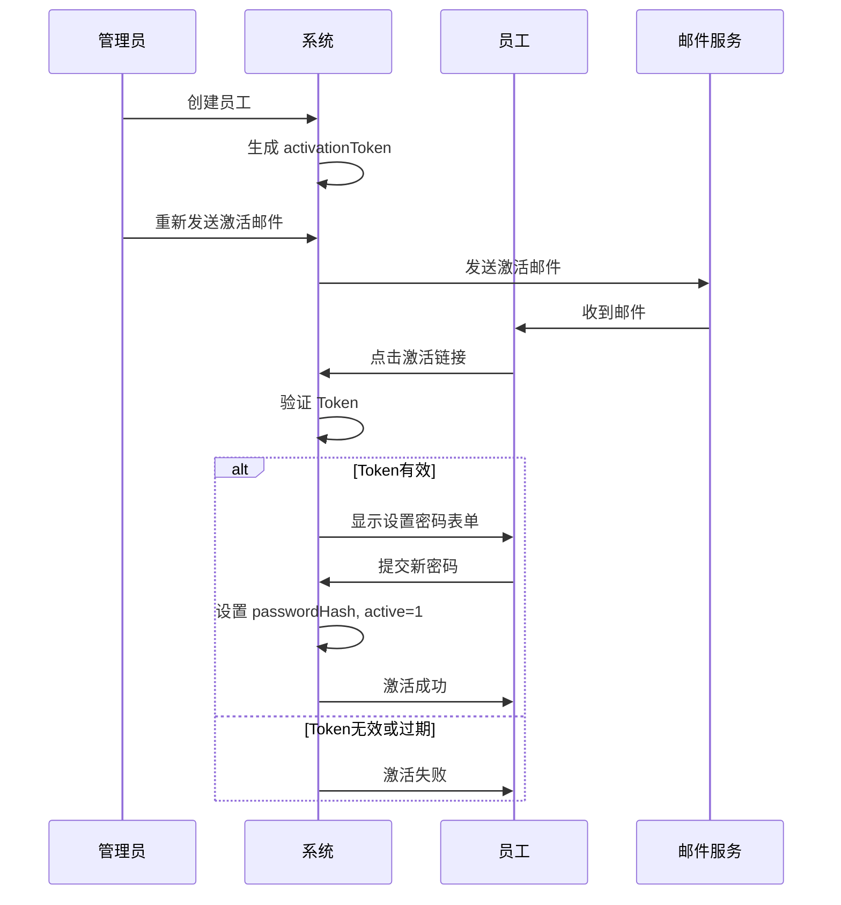

# 员工与组织架构关系

<cite>
**本文档引用文件**  
- [schema.ts](file://backend/src/db/schema.ts)
- [schema.sql](file://backend/src/db/schema.sql)
- [employees.ts](file://backend/src/routes/v2/employees.ts)
- [EmployeeService.ts](file://backend/src/services/EmployeeService.ts)
- [departments.ts](file://backend/src/routes/v2/master-data/departments.ts)
- [org-departments.ts](file://backend/src/routes/v2/master-data/org-departments.ts)
- [positions.ts](file://backend/src/routes/v2/master-data/positions.ts)
- [permissions.ts](file://backend/src/utils/permissions.ts)
- [employee.schema.ts](file://backend/src/schemas/employee.schema.ts)
</cite>

## 目录
1. [引言](#引言)
2. [核心数据表结构](#核心数据表结构)
3. [员工与部门关系](#员工与部门关系)
4. [员工与职位关系](#员工与职位关系)
5. [用户-部门多对多关系](#用户-部门多对多关系)
6. [员工状态与激活流程](#员工状态与激活流程)
7. [实际查询示例](#实际查询示例)
8. [权限与数据访问控制](#权限与数据访问控制)
9. [结论](#结论)

## 引言

本文档详细阐述了员工（employees）与组织架构（包括部门、组织部门、职位）之间的关系。系统通过多个数据库表来管理复杂的组织结构和员工信息，包括员工与部门的一对多关系、员工与职位的关联、以及用户与部门的多对多关系。文档将深入分析这些表的结构、外键关系、业务逻辑以及实际查询用例。

## 核心数据表结构

系统的核心数据表定义了员工、部门、组织部门和职位的结构。



**图表来源**
- [schema.ts](file://backend/src/db/schema.ts#L14-L116)

## 员工与部门关系

员工与部门之间存在一对多的关系，主要通过 `employees` 表中的 `departmentId` 和 `orgDepartmentId` 字段实现。

### 部门（departments）表

`departments` 表代表了公司的主要项目或总部。它是一个扁平的结构，每个部门可以关联到一个总部（`hqId`）。该表用于定义组织的顶层结构。

**图表来源**
- [schema.ts](file://backend/src/db/schema.ts#L65-L74)

### 组织部门（orgDepartments）表

`orgDepartments` 表实现了树状的组织结构，用于表示项目内的小组或子部门。它通过 `parentId` 字段形成层级关系，并通过 `projectId` 字段与 `departments` 表关联。`orgDepartmentId` 字段在 `employees` 表中作为外键，将员工直接关联到一个具体的小组。

**图表来源**
- [schema.ts](file://backend/src/db/schema.ts#L95-L109)

### 关系实现

一个员工通过 `departmentId` 关联到一个顶层项目，同时通过 `orgDepartmentId` 关联到该项目下的一个具体小组。这种设计允许系统实现精细的权限控制，例如，项目主管（level 2）可以管理其 `departmentId` 下的所有员工，而小组长（team leader）可以管理其 `orgDepartmentId` 下的员工。



**图表来源**
- [schema.ts](file://backend/src/db/schema.ts#L14-L22)
- [EmployeeService.ts](file://backend/src/services/EmployeeService.ts#L588-L618)

## 员工与职位关系

员工与职位之间是简单的一对多关系，通过 `employees` 表中的 `positionId` 外键字段实现。

### 职位（positions）表

`positions` 表定义了公司内的所有职位。每个职位包含关键信息：
- `level`：职位层级（1-总部，2-项目，3-组），这是权限控制的核心。
- `functionRole`：功能角色（如 director, hr, finance, admin, developer），用于功能模块的权限分配。
- `canManageSubordinates`：布尔值，标识该职位是否具有管理下属的权限。
- `permissions`：JSON 字符串，存储该职位的详细权限配置。

**图表来源**
- [schema.ts](file://backend/src/db/schema.ts#L50-L63)

### 关系实现

当创建或更新员工时，`positionId` 字段被设置，从而将员工与一个具体的职位绑定。员工的权限和数据访问范围完全由其职位决定。例如，在 `EmployeeService` 中，`getSubordinateEmployeeIds` 方法会根据用户的职位 `level` 和 `canManageSubordinates` 属性来确定其可以管理的下属员工列表。

**图表来源**
- [schema.ts](file://backend/src/db/schema.ts#L19)
- [EmployeeService.ts](file://backend/src/services/EmployeeService.ts#L566-L621)

## 用户-部门多对多关系

为了实现员工与部门的多对多关系，系统使用了 `userDepartments` 中间表。

### 中间表（userDepartments）设计

`userDepartments` 表包含两个外键：
- `userId`：引用 `employees` 表的 `id`。
- `departmentId`：引用 `departments` 表的 `id`。

这种设计允许一个员工属于多个部门，一个部门也包含多个员工。

### 业务逻辑

在创建员工时，系统会自动将员工添加到其 `departmentId` 对应的 `userDepartments` 记录中。当更新员工的 `departmentId` 时，系统会检查并创建相应的 `userDepartments` 记录以确保关联性。



**图表来源**
- [schema.ts](file://backend/src/db/schema.ts#L111-L116)
- [EmployeeService.ts](file://backend/src/services/EmployeeService.ts#L461-L479)

## 员工状态与激活流程

员工的状态和账户激活流程是系统安全和用户管理的关键部分。

### 员工状态（status）

`employees` 表中的 `status` 字段定义了员工的生命周期状态，常见的值包括：
- `probation`：试用期
- `regular`：正式
- `resigned`：已离职

状态的变更通过特定的 API 端点（如 `/employees/{id}/regularize`, `/employees/{id}/leave`）触发，并会记录审计日志。

**图表来源**
- [schema.ts](file://backend/src/db/schema.ts#L23)
- [employees.ts](file://backend/src/routes/v2/employees.ts#L428-L482)

### 激活流程（activationToken）

新员工的账户激活流程设计如下：
1.  **创建员工**：调用 `/employees` 接口创建员工。系统会生成一个唯一的 `activationToken` 和 `activationExpiresAt`（24小时后过期）。
2.  **发送激活邮件**：管理员手动触发 `/employees/{id}/resend-activation` 接口，系统向员工的个人邮箱发送包含激活链接的邮件。
3.  **激活账户**：员工点击链接，前端调用激活接口。后端验证 `activationToken` 的有效性和过期时间。
4.  **设置密码**：验证通过后，员工设置初始密码。系统将 `passwordHash` 写入数据库，并将 `active` 状态设为1，同时清空 `activationToken`。

此流程确保了新员工必须通过其个人邮箱完成激活，增强了账户的安全性。



**图表来源**
- [EmployeeService.ts](file://backend/src/services/EmployeeService.ts#L186-L202)
- [AuthService.ts](file://backend/src/services/AuthService.ts#L349-L436)
- [employees.ts](file://backend/src/routes/v2/employees.ts#L269-L287)

## 实际查询示例

以下是一些常见的数据库查询示例。

### 查询某部门所有员工及其职位信息

这是一个典型的 JOIN 查询，用于获取部门内所有员工的详细信息。

```sql
SELECT 
    e.id,
    e.name,
    e.email,
    e.status,
    p.name AS position_name,
    p.function_role,
    d.name AS department_name
FROM employees e
LEFT JOIN positions p ON e.position_id = p.id
LEFT JOIN departments d ON e.department_id = d.id
WHERE e.department_id = ? AND e.active = 1
ORDER BY e.created_at DESC;
```

**图表来源**
- [EmployeeService.ts](file://backend/src/services/EmployeeService.ts#L310-L355)

## 权限与数据访问控制

系统的权限和数据访问控制是基于员工的职位（`positions`）实现的。

### 权限检查

`hasPermission` 函数根据用户职位的 `functionRole` 和 `permissions` JSON 字段来判断其是否具有执行特定操作（如 create, update, delete）的权限。

### 数据访问过滤

`getDataAccessFilter` 函数是数据访问控制的核心。它根据用户职位的 `level` 返回不同的 SQL 过滤条件：
- **Level 1 (总部)**：返回 `1=1`，可访问所有数据。
- **Level 2 (项目)**：返回 `departmentId = ?`，只能访问其所在部门的数据。
- **Level 3 (小组长)**：返回 `orgDepartmentId = ?`，只能访问其所在小组的数据。

这个过滤条件被应用在 `employees` 路由的 `list` 接口中，确保了不同层级的用户只能看到其权限范围内的员工列表。

**图表来源**
- [permissions.ts](file://backend/src/utils/permissions.ts#L184-L223)
- [employees.ts](file://backend/src/routes/v2/employees.ts#L62-L103)

## 结论

本系统通过 `employees`、`departments`、`orgDepartments` 和 `positions` 四个核心表，构建了一个灵活且安全的组织架构管理体系。员工与部门的一对多关系、与职位的关联以及通过中间表实现的多对多关系，共同支撑了复杂的业务场景。结合基于职位层级的权限和数据访问控制，系统能够有效地管理用户权限和数据隔离。员工状态和激活流程的设计则确保了账户生命周期的安全和可控。