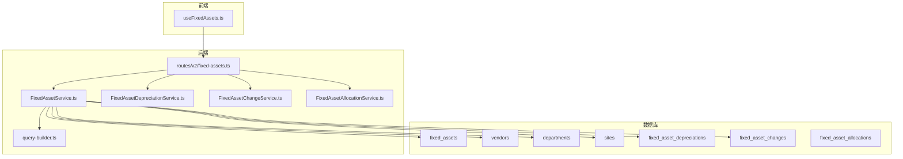
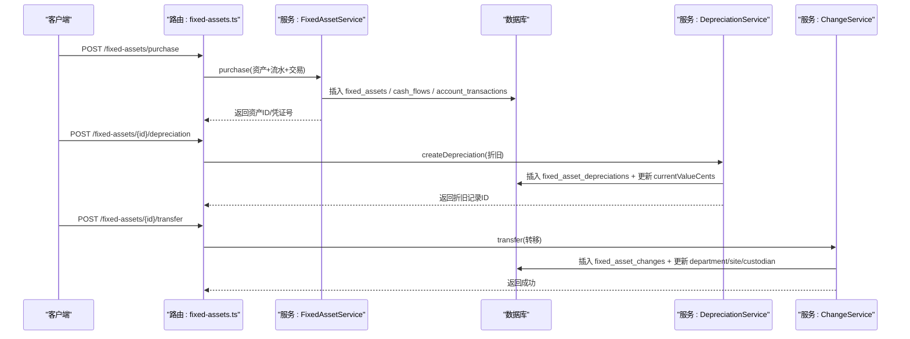
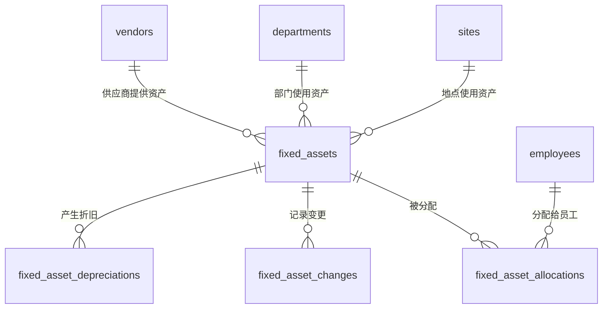
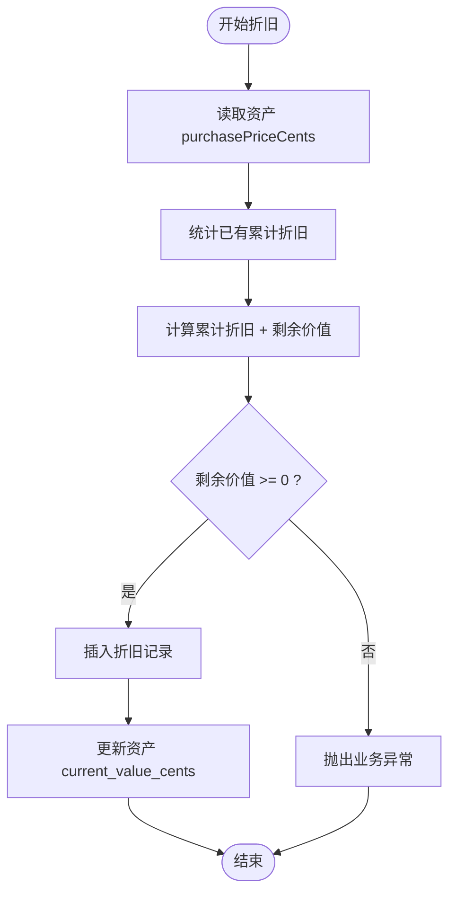
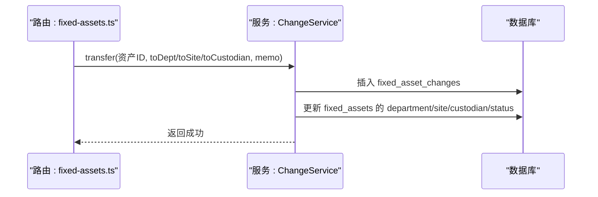
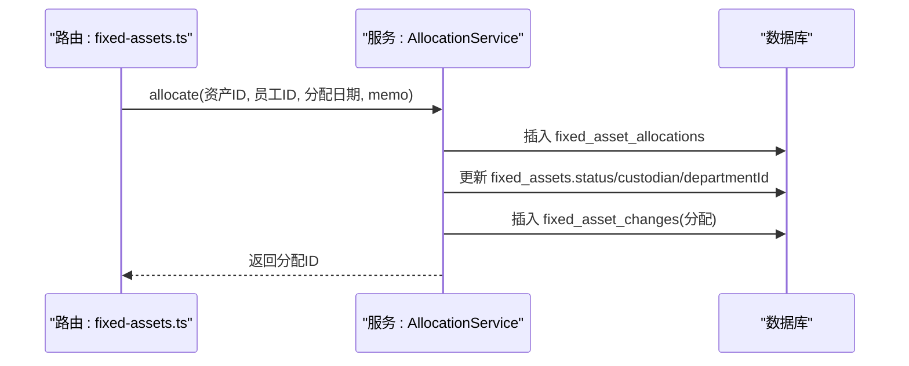
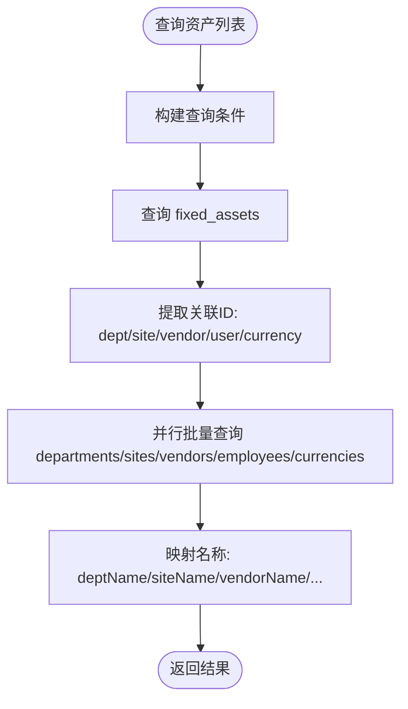
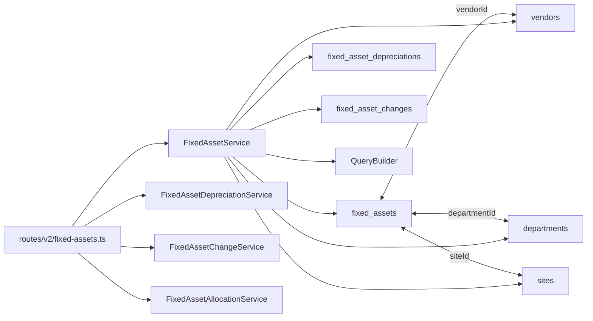

# 固定资产与供应商关系

<cite>
**本文引用的文件**
- [schema.ts](file://backend/src/db/schema.ts)
- [fixed-assets.ts](file://backend/src/routes/v2/fixed-assets.ts)
- [FixedAssetService.ts](file://backend/src/services/FixedAssetService.ts)
- [FixedAssetAllocationService.ts](file://backend/src/services/FixedAssetAllocationService.ts)
- [FixedAssetChangeService.ts](file://backend/src/services/FixedAssetChangeService.ts)
- [FixedAssetDepreciationService.ts](file://backend/src/services/FixedAssetDepreciationService.ts)
- [query-builder.ts](file://backend/src/utils/query-builder.ts)
- [common.schema.ts](file://backend/src/schemas/common.schema.ts)
- [FixedAssetService.test.ts](file://backend/test/services/FixedAssetService.test.ts)
- [useFixedAssets.ts](file://frontend/src/hooks/business/useFixedAssets.ts)
</cite>

## 目录
1. [简介](#简介)
2. [项目结构](#项目结构)
3. [核心组件](#核心组件)
4. [架构总览](#架构总览)
5. [详细组件分析](#详细组件分析)
6. [依赖关系分析](#依赖关系分析)
7. [性能考量](#性能考量)
8. [故障排查指南](#故障排查指南)
9. [结论](#结论)
10. [附录：查询示例](#附录查询示例)

## 简介
本文件聚焦于固定资产管理的数据模型与业务流程，系统性阐述以下关系：
- fixedAssets 表与 vendors、departments、sites 的外键关联关系
- 折旧明细表 fixedAssetDepreciations 的记录机制
- 资产状态变更历史表 fixedAssetChanges 的记录机制
- 资产分配表 fixedAssetAllocations 实现资产与员工的分配关系
- 提供“查询某供应商提供的所有资产”和“获取某部门固定资产清单”的查询示例路径

## 项目结构
围绕固定资产模块，后端采用分层设计：
- 数据库层：定义 schema.ts 中的实体表及字段
- 路由层：routes/v2/fixed-assets.ts 定义 API 接口与请求/响应结构
- 服务层：各 Service 文件负责具体业务逻辑（资产、折旧、变更、分配）
- 工具层：query-builder.ts 提供批量关联查询与映射能力
- 前端 Hook：frontend/src/hooks/business/useFixedAssets.ts 提供前端查询参数构造

图表来源
- [schema.ts](file://backend/src/db/schema.ts#L506-L574)
- [fixed-assets.ts](file://backend/src/routes/v2/fixed-assets.ts#L1-L120)
- [FixedAssetService.ts](file://backend/src/services/FixedAssetService.ts#L1-L120)
- [FixedAssetDepreciationService.ts](file://backend/src/services/FixedAssetDepreciationService.ts#L1-L79)
- [FixedAssetChangeService.ts](file://backend/src/services/FixedAssetChangeService.ts#L1-L115)
- [FixedAssetAllocationService.ts](file://backend/src/services/FixedAssetAllocationService.ts#L1-L120)
- [query-builder.ts](file://backend/src/utils/query-builder.ts#L45-L107)
- [useFixedAssets.ts](file://frontend/src/hooks/business/useFixedAssets.ts#L1-L40)

章节来源
- [schema.ts](file://backend/src/db/schema.ts#L506-L574)
- [fixed-assets.ts](file://backend/src/routes/v2/fixed-assets.ts#L1-L120)
- [FixedAssetService.ts](file://backend/src/services/FixedAssetService.ts#L1-L120)
- [query-builder.ts](file://backend/src/utils/query-builder.ts#L45-L107)
- [useFixedAssets.ts](file://frontend/src/hooks/business/useFixedAssets.ts#L1-L40)

## 核心组件
- 固定资产表（fixed_assets）
  - 关键字段：vendorId（供应商）、departmentId（使用部门）、siteId（使用地点）
  - 状态字段：status（in_use/idle/maintenance/scrapped/sold）
  - 折旧相关：depreciationMethod、usefulLifeYears、currentValueCents
- 供应商表（vendors）
  - 供应商基本信息，与 fixed_assets 通过 vendorId 关联
- 部门表（departments）
  - 组织层级与排序字段，与 fixed_assets 通过 departmentId 关联
- 地点表（sites）
  - 地点信息，与 fixed_assets 通过 siteId 关联
- 折旧明细表（fixed_asset_depreciations）
  - 记录每次折旧的日期、金额、累计折旧、剩余价值等
- 资产变更历史表（fixed_asset_changes）
  - 记录状态变更、转移、分配、归还等事件
- 资产分配表（fixed_asset_allocations）
  - 记录资产分配给员工的时间、类型、归还信息等

章节来源
- [schema.ts](file://backend/src/db/schema.ts#L506-L574)

## 架构总览
固定资产管理的典型流程：
- 新购资产时，同时写入 fixed_assets，并在财务流水与交易记录中登记
- 定期计提折旧，更新 fixed_asset_depreciations 与 fixed_assets 的 currentValueCents
- 资产状态变化（如转移、分配、归还、出售）写入 fixed_asset_changes
- 资产与员工的分配通过 fixed_asset_allocations 实现

图表来源
- [fixed-assets.ts](file://backend/src/routes/v2/fixed-assets.ts#L613-L765)
- [FixedAssetService.ts](file://backend/src/services/FixedAssetService.ts#L313-L468)
- [FixedAssetDepreciationService.ts](file://backend/src/services/FixedAssetDepreciationService.ts#L1-L79)
- [FixedAssetChangeService.ts](file://backend/src/services/FixedAssetChangeService.ts#L1-L115)

## 详细组件分析

### 数据模型关系图

图表来源
- [schema.ts](file://backend/src/db/schema.ts#L506-L574)

章节来源
- [schema.ts](file://backend/src/db/schema.ts#L506-L574)

### 折旧明细（fixedAssetDepreciations）
- 记录维度：资产ID、折旧日期、折旧金额、累计折旧、剩余价值、备注
- 业务要点：累计折旧不得超购买价格；每次折旧会同步更新资产的当前净值

图表来源
- [FixedAssetDepreciationService.ts](file://backend/src/services/FixedAssetDepreciationService.ts#L1-L79)

章节来源
- [FixedAssetDepreciationService.ts](file://backend/src/services/FixedAssetDepreciationService.ts#L1-L79)

### 资产状态变更历史（fixedAssetChanges）
- 记录维度：资产ID、变更类型（状态变更/转移/分配/归还/采购/出售）、变更日期、来源/目标部门/地点/保管人、状态前后值、备注
- 业务要点：转移接口要求至少提供一个目标字段（部门/地点/保管人）

图表来源
- [fixed-assets.ts](file://backend/src/routes/v2/fixed-assets.ts#L549-L611)
- [FixedAssetChangeService.ts](file://backend/src/services/FixedAssetChangeService.ts#L1-L115)

章节来源
- [FixedAssetChangeService.ts](file://backend/src/services/FixedAssetChangeService.ts#L1-L115)
- [fixed-assets.ts](file://backend/src/routes/v2/fixed-assets.ts#L549-L611)

### 资产与员工分配（fixedAssetAllocations）
- 记录维度：资产ID、员工ID、分配日期、分配类型、预计归还日期、实际归还日期、归还类型、备注
- 业务要点：同一资产同一时刻仅允许一条未归还的分配记录；分配时更新资产状态与保管人，并记录变更

图表来源
- [fixed-assets.ts](file://backend/src/routes/v2/fixed-assets.ts#L767-L809)
- [FixedAssetAllocationService.ts](file://backend/src/services/FixedAssetAllocationService.ts#L106-L208)

章节来源
- [FixedAssetAllocationService.ts](file://backend/src/services/FixedAssetAllocationService.ts#L1-L208)
- [fixed-assets.ts](file://backend/src/routes/v2/fixed-assets.ts#L767-L809)

### 资产列表与关联查询（FixedAssetService）
- 支持按搜索、状态、部门、分类等条件筛选
- 通过 QueryBuilder 批量提取关联ID（部门、地点、供应商、币种、创建人），并并行查询，最后映射为带名称的资产结果

图表来源
- [FixedAssetService.ts](file://backend/src/services/FixedAssetService.ts#L25-L120)
- [query-builder.ts](file://backend/src/utils/query-builder.ts#L45-L107)

章节来源
- [FixedAssetService.ts](file://backend/src/services/FixedAssetService.ts#L25-L120)
- [query-builder.ts](file://backend/src/utils/query-builder.ts#L45-L107)

## 依赖关系分析
- 固定资产表与供应商、部门、地点的外键关系
- 路由层对服务层的依赖：列表、详情、采购、折旧、转移、分配、归还等均通过对应服务实现
- 服务层对数据库层的依赖：drizzle-orm 对 schema.ts 中定义的表进行操作
- 工具层对服务层的依赖：QueryBuilder 在多个服务中复用，提升批量查询性能

图表来源
- [schema.ts](file://backend/src/db/schema.ts#L506-L574)
- [FixedAssetService.ts](file://backend/src/services/FixedAssetService.ts#L1-L120)
- [query-builder.ts](file://backend/src/utils/query-builder.ts#L45-L107)
- [fixed-assets.ts](file://backend/src/routes/v2/fixed-assets.ts#L1-L120)

章节来源
- [schema.ts](file://backend/src/db/schema.ts#L506-L574)
- [FixedAssetService.ts](file://backend/src/services/FixedAssetService.ts#L1-L120)
- [query-builder.ts](file://backend/src/utils/query-builder.ts#L45-L107)
- [fixed-assets.ts](file://backend/src/routes/v2/fixed-assets.ts#L1-L120)

## 性能考量
- 批量关联查询：通过 QueryBuilder.extractRelatedIds 与 QueryBuilder.fetchRelatedData 并行拉取多张表数据，降低 N+1 查询开销
- 分页与排序：列表默认按创建时间倒序，支持 limit/offset 控制结果规模
- 事务一致性：采购、折旧、分配/归还、转移等关键流程均使用事务保证原子性

章节来源
- [query-builder.ts](file://backend/src/utils/query-builder.ts#L45-L107)
- [FixedAssetService.ts](file://backend/src/services/FixedAssetService.ts#L25-L120)
- [FixedAssetDepreciationService.ts](file://backend/src/services/FixedAssetDepreciationService.ts#L1-L79)
- [FixedAssetAllocationService.ts](file://backend/src/services/FixedAssetAllocationService.ts#L106-L208)
- [FixedAssetChangeService.ts](file://backend/src/services/FixedAssetChangeService.ts#L1-L115)

## 故障排查指南
- “无法删除资产”：若存在折旧记录则禁止删除
- “折旧金额超过购买价格”：累计折旧不可超过购买金额
- “资产未分配或已归还”：归还前必须存在未归还的分配记录
- “只能分配使用中或闲置的资产”：非 in_use/idle 状态不可分配
- “转移参数缺失”：转移时至少提供 toDepartmentId、toSiteId 或 toCustodian 其一

章节来源
- [FixedAssetService.ts](file://backend/src/services/FixedAssetService.ts#L288-L310)
- [FixedAssetDepreciationService.ts](file://backend/src/services/FixedAssetDepreciationService.ts#L34-L76)
- [FixedAssetAllocationService.ts](file://backend/src/services/FixedAssetAllocationService.ts#L120-L158)
- [FixedAssetChangeService.ts](file://backend/src/services/FixedAssetChangeService.ts#L20-L78)

## 结论
本方案通过清晰的表结构与服务层职责划分，实现了固定资产从采购到折旧、转移、分配与归还的全生命周期管理。供应商、部门、地点三者与资产形成稳定的外键关系，配合变更与折旧记录，确保资产数据的完整性与可追溯性。

## 附录：查询示例

### 示例一：查询某供应商提供的所有资产
- 前端参数构造（前端 Hook）
  - 使用 useFixedAssets 构造查询参数，传入 departmentId 等筛选条件
  - 参考路径：[useFixedAssets.ts](file://frontend/src/hooks/business/useFixedAssets.ts#L16-L31)
- 后端路由与服务
  - 路由层接收查询参数并调用服务层
  - 服务层按条件查询 fixed_assets，并通过 QueryBuilder 批量获取关联名称
  - 参考路径：
    - [fixed-assets.ts](file://backend/src/routes/v2/fixed-assets.ts#L33-L115)
    - [FixedAssetService.ts](file://backend/src/services/FixedAssetService.ts#L25-L120)
    - [query-builder.ts](file://backend/src/utils/query-builder.ts#L45-L107)
- 测试验证
  - 测试覆盖了按部门筛选的场景，可类比供应商筛选思路
  - 参考路径：[FixedAssetService.test.ts](file://backend/test/services/FixedAssetService.test.ts#L181-L235)

章节来源
- [useFixedAssets.ts](file://frontend/src/hooks/business/useFixedAssets.ts#L16-L31)
- [fixed-assets.ts](file://backend/src/routes/v2/fixed-assets.ts#L33-L115)
- [FixedAssetService.ts](file://backend/src/services/FixedAssetService.ts#L25-L120)
- [query-builder.ts](file://backend/src/utils/query-builder.ts#L45-L107)
- [FixedAssetService.test.ts](file://backend/test/services/FixedAssetService.test.ts#L181-L235)

### 示例二：获取某部门固定资产清单
- 前端参数构造
  - 通过 useFixedAssets 传入 departmentId 参数
  - 参考路径：[useFixedAssets.ts](file://frontend/src/hooks/business/useFixedAssets.ts#L16-L31)
- 后端路由与服务
  - 路由层解析查询参数，服务层按 departmentId 条件查询 fixed_assets
  - 参考路径：
    - [fixed-assets.ts](file://backend/src/routes/v2/fixed-assets.ts#L33-L115)
    - [FixedAssetService.ts](file://backend/src/services/FixedAssetService.ts#L25-L120)
- 测试验证
  - 测试覆盖了按部门筛选的场景
  - 参考路径：[FixedAssetService.test.ts](file://backend/test/services/FixedAssetService.test.ts#L181-L235)

章节来源
- [useFixedAssets.ts](file://frontend/src/hooks/business/useFixedAssets.ts#L16-L31)
- [fixed-assets.ts](file://backend/src/routes/v2/fixed-assets.ts#L33-L115)
- [FixedAssetService.ts](file://backend/src/services/FixedAssetService.ts#L25-L120)
- [FixedAssetService.test.ts](file://backend/test/services/FixedAssetService.test.ts#L181-L235)